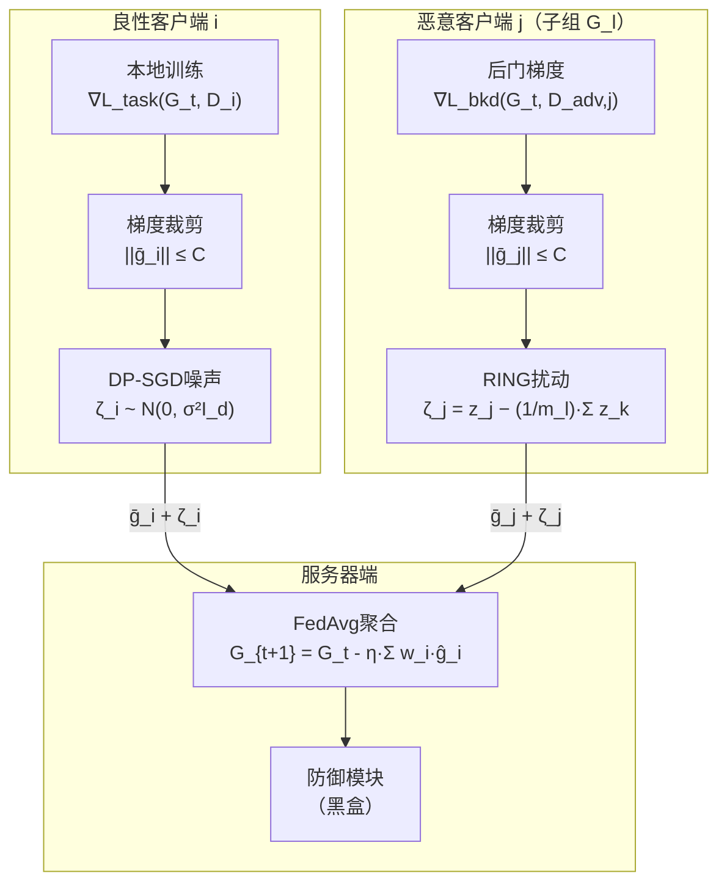

# Your Privacy My Cloak: Backdoor Attacks on Differentially Private Federated Learning

**中文译名**：你的隐私我的斗篷：针对差分隐私联邦学习的后门攻击

**一句话总结**：针对“差分隐私（DP）能增强联邦学习（FL）后门鲁棒性”这一假设，本文揭示DP噪声在削弱后门信号的同时会抹除恶意更新的统计指纹，据此提出协作式扰动攻击RING——恶意客户端各自添加看似DP噪声的扰动以规避检测，扰动在聚合时精确抵消以恢复后门信号——在4个数据集、3种非独立同分布设定下对6种SOTA防御实现平均90.3%的攻击成功率，最高较基线提升26.08倍。

**论文类型**：安全攻防实证研究 + 理论分析

**阅读材料与版本**：arXiv预印本全文，v2版本（2026年8月13日修订），包含正文（§1–§9）、参考文献及附录A–F（含定理证明与补充实验结果）。未获取代码或补充材料。

**论文链接 / DOI**：[arXiv:2606.17035](https://arxiv.org/abs/2606.17035)（v1: 2026-06-15；v2: 2026-08-13）；DOI: 10.48550/arXiv.2606.17035

## 作者与团队信息

### 1. 作者信息

| 作者 | 论文署名机构 | 可核验的身份或研究背景 | 与本文相关的代表工作或学术资历 | 来源 |
|---|---|---|---|---|
| Xiaolin Li | 普渡大学，西拉法叶，美国 | 博士研究生 | 此前发表LDP数据投毒攻击与防御系列工作（USENIX Security 2023、NDSS 2025、CCS 2025） |  |
| Ning Wang | 南佛罗里达大学，坦帕，美国 | 助理教授，贝尔尼尼人工智能、网络安全与计算学院 | 研究方向包括联邦学习、异常检测、对抗机器学习、差分隐私；发表FLARE、MINDFL等FL防御工作 |  |
| Ninghui Li | 普渡大学，西拉法叶，美国 | Samuel D. Conte计算机科学讲席教授，副系主任 | 差分隐私与隐私保护领域资深学者，发表150余篇同行评审论文；2007年t-closeness论文为高引工作 |  |
| Wenhai Sun | 普渡大学，西拉法叶，美国 | 助理教授（2018年至今），计算机与信息技术系 | 研究方向为隐私增强技术及其安全性，主导CERIAS多个LDP相关项目 |  |

论文未标注共同一作或通讯作者。Wenhai Sun在CERIAS项目页面中标注为Primary Investigator，可能为项目负责人，但这一身份不直接等同于论文通讯作者。

### 2. 团队相关信息

该团队由普渡大学（Xiaolin Li、Ninghui Li、Wenhai Sun）与南佛罗里达大学（Ning Wang）的学者组成，呈现跨机构合作特征。团队长期围绕**本地差分隐私（LDP）的安全性**展开研究，此前工作集中在LDP协议下的数据投毒攻击与防御，包括针对均值/方差估计的精细投毒攻击（USENIX Security 2023）、LDP数值属性的投毒攻击鲁棒性（NDSS 2025）以及投毒攻击缓解框架（CCS 2025）。本文是该研究脉络的自然延伸——从LDP场景拓展到联邦学习中的样本级DP（SL-DP）场景，从数据投毒拓展到模型后门注入。Ning Wang的加入补充了联邦学习攻防视角，其此前发表的FLARE（FL潜在空间表示防御）为本文的防御评估提供了领域知识基础。

## 论文时间与发表状态

| 事项 | 日期或状态 | 来源与核验说明 |
|---|---|---|
| 预印本首次公开 | 2026年6月15日 | arXiv提交记录（v1） |
| 当前阅读版本发布或更新 | 2026年8月13日（v2） | arXiv修订记录 |
| 接收情况 | 未报告 | 预印本页面未标注任何会议或期刊接收信息 |
| 正式发表venue与时间 | 未报告 | 未能核实 |

引用次数：截至搜索时（数据库Lattice显示），该论文引用次数为0，查询日期为搜索当日。预印本目前为v2版本，但未检索到正式发表记录；未找到代码仓库或补充材料的公开链接。

## 摘要解读

**研究背景**：差分隐私（DP）被广泛认为能增强联邦学习（FL）对后门攻击的鲁棒性，既有工作从经验层面和认证鲁棒性层面均支持这一假设。

**核心问题**：DP噪声是否真的构成可靠的后门防御？作者通过实证分析两种基线攻击策略发现了一个根本性张力——绕过DP（DP-opt-out）虽能维持强后门信号，但会使恶意更新的统计异常暴露，被SOTA防御检测；遵守DP（DP-opt-in）虽使恶意更新与良性更新在统计上难以区分，但DP噪声也压制了后门信号本身。两者构成“有效性 vs 隐蔽性”的两难。

**方法**：作者将DP噪声的“掩蔽效应”从问题转化为工具，提出**RING**攻击。恶意客户端在提交更新前添加协作构造的扰动，每个扰动在统计分布上与DP噪声相似（提升隐蔽性），但在组内聚合时精确抵消为**零**（恢复后门信号）。RING被设计为独立于具体后门技术的扰动层，可与既有攻击方法组合。

**主要结果**：在MNIST、CIFAR-10、CIFAR-100和Sentiment-140四个数据集上，在三种非IID分布设定下，RING对DeepSight、Krum、Flame、MESAS、FreqFed和FLShield六种SOTA防御实现**平均90.3%的攻击成功率**，在中等隐私预算下较基线策略**最高提升26.08倍**。

**意义与边界**：该结果质疑了将DP作为后门防御的充分性，揭示出DP噪声在隐私保护与安全防御之间的**根本性张力**。作者评估了候选防御方案（随机丢弃更新、限制提交时延、服务器端扰动），发现每种方案都需付出显著的效用或隐私代价，不存在“免费”的缓解方案。

## 一、这篇论文讲了一个什么样的故事？

**现实背景**：联邦学习允许多方在不共享原始数据的前提下协作训练模型，差分隐私则进一步为客户端上传的模型更新提供形式化隐私保证。两者结合（DP-FL）被视为隐私保护机器学习的标准范式，已有大量工作将其部署于移动键盘预测、医疗健康等场景。

**已有方法**：既有研究从多个角度论证DP的后门防御能力——Naseri等人[10]实证展示了DP对后门攻击的鲁棒性提升，Sun等人[11]提出弱DP作为轻量防御，Xie等人[12]从理论上建立了DP-FL对后门攻击的认证鲁棒性保证。这些工作共同塑造了一个直觉：DP噪声和梯度裁剪会干扰后门信号的注入，使其无法在聚合后的全局模型中存活。

**关键缺口**：上述工作将DP和专用后门防御视为**独立**的保护层。但作者指出一个被忽视的逻辑：DP噪声在削弱后门信号的同时，是否也削弱了防御者区分恶意更新与良性更新的能力？如果DP噪声抹除了恶意更新与良性更新之间的统计差异，那么基于统计异常检测的防御方法就失去了判别依据。这个缺口在已有文献中未被系统研究。

**核心洞察**：作者通过基线实验（§3.2）发现了两个关键现象。**第一**，DP-opt-out（绕过DP直接提交原始恶意更新）在无防御时ASR接近100%，但多个防御方法（尤其DeepSight和Flame）能通过检测更新之间的几何异常（如\(\ell_2\)距离和余弦相似度）有效识别并抑制这些更新（图4）。**第二**，DP-opt-in（遵守DP协议提交噪声扰动后的恶意更新）ASR大幅下降，但引入SOTA防御后ASR几乎不再进一步降低——因为DP噪声已使恶意更新和良性更新在统计上无法区分，防御者只能“不加区别地”删除更新（图4显示Krum、Flame、FreqFed、FLShield对恶意和良性更新的保留率无显著差异）。

简言之，DP的掩蔽效应是一把双刃剑：它保护隐私的同时，也无意中为攻击者提供了伪装。

**解决路径**：RING将DP噪声的掩蔽效应从“副作用”转变为“武器”。核心机制受秘密共享（secret sharing）启发：将后门梯度视为需要隐藏的“秘密”，将扰动\(\zeta_{j,t}\)视为“份额”。每个恶意客户端提交\(\bar{g}_j + \zeta_j\)，其中\(\zeta_j\)在统计上类似于DP噪声（分布为\(\mathcal{N}(0,\frac{m_l-1}{m_l}\sigma^2 I_d)\)），但组内扰动之和为零（\(\sum_{j\in\mathcal{G}_l}\zeta_j = 0\)）。聚合时扰动抵消，后门信号完全恢复；单个更新层面，每个恶意更新看起来与DP扰动后的良性更新无异。

**验证结果**：作者通过理论分析（定理1–3）刻画了RING的噪声分布、部分聚合下的鲁棒性及其相对DP-opt-in的优势，并在4个数据集、3种非IID设定、6种防御方法上进行了大规模实验。RING平均ASR达90.3%，对Flame的保留率分析显示恶意更新与良性更新的保留率接近，证明其隐蔽性有效（图7）。消融研究进一步验证了子组大小、隐私预算\(\epsilon\)、裁剪界\(C\)、恶意客户端数量等参数的影响（§6.3）。

**研究意义**：本文改变了我们理解DP在FL安全中角色的方式——DP不是一道“额外的锁”，而可能是一层“更好的伪装”。这提示防御设计不能将DP的存在视为后门防御的充分条件，需要设计**DP感知（DP-aware）** 的防御机制，利用DP噪声的统计特性而非仅依赖更新间的比较来检测异常。

## 二、本文的核心思想和创新点

### 1. 核心思想

RING的根本设计选择是**将隐蔽性和有效性解耦到两个不同的聚合层面**：在客户端层面，每个恶意更新的噪声统计特性被设计为与良性DP噪声一致；在聚合层面，噪声通过组内协作精确抵消为零。

这一设计之所以有效，依赖于三个关键前提：（1）**至少有两个恶意客户端在同一轮被选中**——单个恶意客户端无法实现组内抵消；（2）**防御者在客户端层面（聚合前）进行检测**——如果防御者在聚合后检测，抵消后的干净后门信号可能被基于全局模型行为的检测发现；（3）**恶意客户端之间能够进行带外通信以协调扰动**——论文假设存在20ms的协调延迟（§7），这在实践中需要额外的通信信道。

如果去掉协作抵消机制，攻击退化为DP-opt-in——隐蔽但ASR低；如果去掉统计伪装，攻击退化为DP-opt-out——有效但易被检测。RING的价值恰恰在于同时满足两个看似矛盾的目标。

### 2. 关键创新点

| 创新点 | 最相关的已有做法 | 本文具体改变了什么 | 支撑证据 | 新颖性或适用范围的边界 |
|---|---|---|---|---|
| **DP掩蔽效应的系统揭示** | 已有工作论证DP增强后门鲁棒性[10][11][12] | 首次系统分析DP噪声对攻击**隐蔽性**的影响，发现DP在削弱攻击的同时也削弱了防御检测能力 | §3.2基线实验；图10的\(L_2\)距离和余弦相似度几何分析；图3/4的ASR与保留率对比 | 仅针对样本级DP-SGD；中心DP下的掩蔽效应未评估 |
| **协作式零和扰动机制** | DBA[26]的分布式触发器；秘密共享[25] | 将秘密共享的“份额抵消”思想引入DP-FL攻击，使恶意更新在个体层面统计伪装、在聚合层面信号恢复 | 定理1（扰动分布推导）；图6的ASR曲线；图7的保留率对比 | 需要至少2个恶意客户端同轮参与；权重非均匀时抵消不完全（§4.2末） |
| **扰动层与后门技术的解耦** | 已有后门攻击将触发器设计与注入策略耦合 | RING仅操作噪声分量\(\zeta_j\)，不改变任务梯度\(\bar{g}_j\)，因此可与任意后门技术组合 | §5.3理论论证；图6中用visible-trigger和edge-case两种后门验证；表6中对VBA/DBA/NBA的泛化评估 | 泛化评估仅限于MNIST；更复杂数据集上的泛化未验证 |
| **部分聚合下的噪声分析** | 已有工作未分析过滤机制对秘密共享式攻击的影响 | 定理2–3量化了恶意更新保留概率\(f\)对残余噪声的影响，证明RING在任意\(f<1\)下均优于DP-opt-in | 式(5)–(6)；图8的\(f\)敏感性实验 | 假设恶意更新被独立同分布地保留；防御者的非随机过滤策略下结论可能变化 |

**“作者主张的贡献”与“证据支持的贡献”的差异**：作者声称RING“普遍适用于各种部署条件”（§1），但实验仅在MNIST的消融中测试了部分参数变化（表2–5），CIFAR和Sentiment-140上的参数敏感性未系统报告。泛化性主张在图像任务上有较强证据（4个数据集、3种非IID），但文本任务（Sentiment-140）仅用edge-case后门验证，未测试DBA或Neurotoxin等更复杂后门。

## 三、方法是怎么实现的？

### 1. 问题定义与关键假设

**输入/输出**：FL系统中有\(n=120\)个客户端，每轮随机选择\(r\cdot n = 30\)个参与。每个客户端\(i\)在本地数据集\(\mathcal{D}_i\)上计算梯度，经裁剪和DP噪声扰动后提交给服务器。服务器用FedAvg聚合，权重\(w_i\)与本地数据集大小成比例。恶意客户端占比\(\beta=0.2\)（6/30）。攻击目标是使全局模型在触发样本上以高概率输出目标标签，同时避免被服务器端防御检测。【§2.2，§3.1】

**威胁模型**：攻击者控制\(\beta\)比例客户端，可完全操纵本地训练过程和提交的模型权重，但**不知道**服务器端部署了何种防御（完全黑盒）。攻击者不能控制服务器或良性客户端，不拦截或篡改良性客户端的数据或更新。服务器为半诚实（semi-honest），观察聚合更新但不操纵协议。【§3.1】

**关键假设**：（1）防御者在客户端层面（聚合前）检查更新，而非仅在聚合后检查全局模型行为；（2）恶意客户端之间可以进行带外通信以协调扰动，论文估计协调延迟约20ms【§7】；（3）至少\(m_l \geq 2\)个恶意客户端在同一轮被选中，以实现组内抵消；（4）攻击者能够访问本地数据上的后门损失函数\(\mathcal{L}_{\mathrm{bkd}}\)以优化后门信号【§4.1】。

### 2. 整体架构

*图注：根据论文图5重绘的解释性架构图，区分了良性客户端（左）与恶意客户端（右）的更新生成路径。关键差异在于恶意客户端用协作构造的RING扰动替代了独立的DP噪声。*

**关键信息流**：良性客户端提交\(\bar{g}_i + \zeta_i\)，其中\(\zeta_i\sim\mathcal{N}(0,\sigma^2 I_d)\)来自DP-SGD。恶意客户端提交\(\bar{g}_j + \zeta_j\)，其中\(\zeta_j = z_j - \frac{1}{m_l}\sum_{k\in\mathcal{G}_l}z_k\)，\(z_k\sim\mathcal{N}(0,\sigma^2 I_d)\)为各恶意客户端独立采样的“种子”。组内\(\sum_j\zeta_j = 0\)由构造保证。

### 3. 关键模块与算法

| 步骤 | 输入 | 核心操作 | 输出 | 为什么需要它 |
|---|---|---|---|---|
| **子组划分** | 本轮被选中的\(m\)个恶意客户端 | 划分为\(g=m/m_l\)个不相交子组 | 各子组\(\mathcal{G}_1,\ldots,\mathcal{G}_g\) | 子组内实现零和抵消；子组大小\(m_l\)是隐蔽性-有效性的核心权衡参数 |
| **种子采样** | 各子组内客户端 | 各客户端独立采样\(z_k\sim\mathcal{N}(0,\sigma^2 I_d)\) | 各客户端的种子向量\(z_k\) | 种子的统计分布与DP噪声一致，保证隐蔽性 |
| **扰动构造** | 种子向量\(z_k\)、子组大小\(m_l\) | \(\zeta_j = z_j - \frac{1}{m_l}\sum_{k\in\mathcal{G}_l}z_k\) | 各客户端的RING扰动\(\zeta_j\) | 构造保证\(\sum_{j\in\mathcal{G}_l}\zeta_j = 0\)，聚合时精确抵消 |
| **提交更新** | 裁剪后的后门梯度\(\bar{g}_j\)、RING扰动\(\zeta_j\) | 叠加后提交 | \(\bar{g}_j + \zeta_j\) | 单个更新在统计上接近DP扰动的良性更新 |

**最影响效果的设计**：子组大小\(m_l\)。定理1表明，\(\zeta_j\)的方差为\(\frac{m_l-1}{m_l}\sigma^2\)，当\(m_l\)增大时方差趋近\(\sigma^2\)（与DP噪声一致），隐蔽性提升。但定理2表明，部分聚合时残余噪声的期望平方范数随\(m_l\)增大而增大，有效性下降。论文在主要实验中设置\(m_l = m\)（所有恶意客户端在一个组），在消融中测试了\(m_l = 2, 4, m\)。【§4.2，§5.2】

**实现细节缺失**：论文未报告恶意客户端之间具体如何建立带外通信、种子如何交换、协调延迟20ms的估计依据。这些对复现至关重要。此外，后门损失\(\mathcal{L}_{\mathrm{bkd}}\)的具体形式（如何构造触发样本、目标标签如何选择）仅在通用后门攻击文献中引用，本文未详细描述。

### 4. 关键公式

**（1）RING扰动构造**（式4）：

\[\zeta_{j,t} = z_j - \frac{1}{m_\ell}\sum_{k\in\mathcal{G}_\ell}z_k,\quad z_k\sim\mathcal{N}(0,\sigma^2 I_d) \tag{4}\]

- **含义**：客户端\(j\)的扰动等于其自身种子减去子组内所有种子（包括自身）的均值。
- **为什么这样写**：这一构造保证\(\sum_{j\in\mathcal{G}_\ell}\zeta_j = 0\)恒成立——无论种子取值如何，组内扰动之和为零。
- **与整体方法的关系**：这是RING的核心操作，同时实现了统计伪装（\(\zeta_j\)的分布近似DP噪声）和聚合抵消（零和约束）。它是对联合优化目标（式3）的闭式解。

**（2）扰动分布**（定理1）：

\[\zeta_j \sim \mathcal{N}\left(0, \frac{m_\ell-1}{m_\ell}\sigma^2 I_d\right) \tag{Theorem 1}\]

- **含义**：RING扰动的方差为DP噪声方差的\(\frac{m_\ell-1}{m_\ell}\)倍。
- **成立条件**：\(z_k\)独立同分布于\(\mathcal{N}(0,\sigma^2 I_d)\)。
- **重要性**：方差差距\(\frac{1}{m_\ell}\)随子组增大而缩小——当\(m_\ell=4\)时，RING方差为DP方差的75%；当\(m_\ell=10\)时达90%。这从理论上解释了“大子组提升隐蔽性”。

**（3）部分聚合下的残余噪声**（定理2）：

\[\mathbb{E}_{\mathrm{RING}}[\|\mathrm{Err}(f)\|^2] \approx \frac{d\sigma^2}{m}\cdot\frac{m_\ell-1}{m_\ell}\cdot\frac{1-f}{f} \tag{5}\]

- **含义**：当每个恶意更新以概率\(f\)被保留时，聚合后残余噪声的期望平方范数。
- **为什么这样写**：\(f\to 1\)时误差归零（完整抵消）；\(f\to 0\)时误差趋于无穷（所有扰动变为独立噪声）。因子\(\frac{m_\ell-1}{m_\ell}\)反映了子组大小对噪声放大的影响。
- **与整体方法的关系**：该式量化了防御者过滤行为对RING有效性的影响，是图8实验的理论基础。

**（4）RING vs DP-opt-in的误差比**（定理3）：

\[\frac{\mathbb{E}_{\mathrm{RING}}[\|\mathrm{Err}(f)\|^2]}{\mathbb{E}_{DP\text{-}opt\text{-}in}[\|\mathrm{Err}(f)\|^2]} \approx \frac{m_\ell-1}{m_\ell}(1-f) \tag{6}\]

- **含义**：在相同保留率\(f\)下，RING的残余噪声仅为DP-opt-in的\(\frac{m_\ell-1}{m_\ell}(1-f)\)倍。
- **重要性**：对于任意\(m_\ell>1\)和\(f\in(0,1)\)，该比值恒小于1——**RING在所有部分保留场景下都优于DP-opt-in**。这一结论有明确的理论保证，是本文最强的理论贡献之一。

### 5. 用一个例子走通方法

以MNIST上的可见触发器后门为例：

假设4个恶意客户端\(j_1,j_2,j_3,j_4\)在同一轮被选中，设\(m_\ell=4\)，DP噪声标准差\(\sigma=2\)，梯度维度\(d=100\)。

1. **种子采样**：四个客户端分别采样\(z_1,\ldots,z_4\sim\mathcal{N}(0,4I_{100})\)。
2. **扰动构造**：客户端\(j_1\)的扰动为\(\zeta_1 = z_1 - \frac{1}{4}(z_1+z_2+z_3+z_4)\)。其余类似。
3. **提交更新**：各客户端提交\(\bar{g}_j + \zeta_j\)。服务器看到的每个更新中，噪声部分的方差约为\(3\)（即\((4-1)/4 \times 4\)），与良性客户端的DP噪声方差\(4\)接近但不完全相同。
4. **聚合**：服务器计算\(\sum_{j=1}^4(\bar{g}_j + \zeta_j) = \sum\bar{g}_j + 0 = \sum\bar{g}_j\)。扰动精确抵消，后门信号完整保留。

**如果服务器随机丢弃了\(j_4\)的更新**（\(f=0.75\)）：残余扰动为\(\zeta_1+\zeta_2+\zeta_3\)，不再为零。根据定理2，残余噪声的期望平方范数约为\(\frac{100 \times 4}{4}\cdot\frac{3}{4}\cdot\frac{0.25}{0.75} \approx 25\)。后门信号被削弱但仍可部分恢复。

## 四、实验效果与证据强度

### 1. 实验要回答什么问题？

| 研究问题 | 对应实验 |
|---|---|
| RING在无防御时能否达到与DP-opt-out相当的ASR？ | 图6第一列“No Defense” |
| RING能否在SOTA防御下维持高ASR？ | 图6其余列；表3的ASR/Acc/RR |
| RING的隐蔽性是否与DP-opt-in相当？ | 图7的保留率对比；图10的几何分析 |
| 子组大小\(m_l\)如何影响隐蔽性-有效性权衡？ | 表2；§6.3.1 |
| 隐私预算\(\epsilon\)如何影响攻击？ | 表3；§6.3.2 |
| 裁剪界\(C\)如何影响攻击？ | 表4；§6.3.3 |
| 数据分布（IID vs 非IID）如何影响？ | 表5；§6.3.4 |
| RING是否与其他后门技术泛化兼容？ | 表6（VBA/DBA/NBA对比） |

### 2. 实验设置

| 项目 | 论文设置 | 对结果解读的影响 |
|---|---|---|
| **数据集** | MNIST（10类，CNN）、CIFAR-10（10类，ResNet-18）、CIFAR-100（100类，ViT）、Sentiment-140（二分类，MLP，采样5%约8万条） | 覆盖图像和文本；CIFAR-100的100类分类难度远高于其他任务，非IID下ViT性能可能较低，需关注Acc报告【§6.1】 |
| **非IID设定** | Prob（主类概率\(\tau=0.5\)）、Dirichlet（\(\alpha=0.5\)）、Quantity（MNIST/CIFAR-10各2类，CIFAR-100各20类，Sentiment-140各1类） | 三种设定覆盖不同非IID程度；Dirichlet下类分布可能极端不均匀【§6.1】 |
| **对比方法** | DP-opt-in、DP-opt-out | DP-opt-out在无防御时ASR接近100%，是攻击有效性上界；DP-opt-in是隐蔽性参考 |
| **防御方法** | DeepSight、Krum、Flame、MESAS、FreqFed、FLShield | 覆盖鲁棒聚合（Krum、Flame、MESAS、FreqFed）和表示层（DeepSight、FLShield）两类；Krum获得真实恶意客户端数作为“最优检测”设定 |
| **评价指标** | ASR（攻击成功率）、Acc（主任务准确率）、RR（保留率，含95% CI） | RR是本文引入的关键指标——区分“选择性检测”与“不加区别过滤” |
| **关键参数** | \(n=120\)，每轮30客户端，\(\beta=0.2\)，PDR=0.5，\(\epsilon=5\)（图像）/20（文本），\(C=10\)，\(\eta=0.05\)，本地5轮 | 隐私预算相对宽松（\(\epsilon=5\)）；本地训练轮数较少，后门信号可能不如深度训练强 |
| **重复实验** | 所有结果平均5次独立运行 | 未报告显著性检验；RR报告了95% CI |

### 3. 主要结果

**结果1：RING在SOTA防御下的ASR优势**（图6，prob非IID）

| 场景 | 指标 | RING | DP-opt-in | DP-opt-out | 原文位置 |
|---|---|---|---|---|---|
| MNIST + DeepSight | ASR | ~95% | ~60% | ~20% | 图6，第1行第2列 |
| CIFAR-10 + Krum | ASR | ~85% | ~60% | ~70% | 图6，第2行第3列 |
| CIFAR-100 + Flame | ASR | ~80% | ~50% | ~30% | 图6，第3行第4列 |
| Sentiment-140 + FreqFed | ASR | ~95% | ~55% | ~60% | 图6，第4行第5列 |

**支持什么**：RING在所有防御下的ASR均高于两个基线，且常接近或超过DP-opt-out在无防御时的水平。

**尚不能支持**：这些ASR值是在特定的收敛轮数后读取的（约50–60轮）；论文未报告达到收敛的轮数差异，也未讨论攻击的**持久性**——RING的后门信号在训练后期是否会被良性更新的累积效应稀释？

**结果2：隐蔽性——保留率对比**（图7，prob非IID）

在DP-opt-out攻击下，DeepSight对恶意更新的RR约为0.1，良性约为0.9——明确的选择性检测。在RING攻击下，DeepSight对恶意更新的RR约为0.9，良性约为0.95——两者几乎不可区分。FLShield在DP-opt-out下对两者均约0.4（不加区别过滤），在RING下对两者均约0.55。

**支持什么**：RING的隐蔽性机制有效——恶意更新与良性更新在防御者眼中统计上不可区分。

**尚不能支持**：这些保留率是在单一轮次或平均轮次上测量的？论文未明确说明RR是单轮还是跨轮平均。如果RR在训练早期较高而在后期下降（因为后门信号随轮次累积变得更显著），那么平均RR可能掩盖了训练后期的脆弱性。

**结果3：消融——子组大小\(m_l\)的影响**（表2，MNIST）

| \(m_l\) | No Defense ASR | DeepSight ASR | Flame ASR | 备注 |
|---|---|---|---|---|
| 2 | ~99% | ~65% | ~70% | 子组小→抵消更易被部分过滤破坏 |
| 4 | ~99% | ~90% | ~85% | 论文推荐的中等大小 |
| \(m=6\) | ~99% | ~95% | ~90% | 隐蔽性最佳但残余噪声最大 |

**支持什么**：\(m_l=4\)在隐蔽性和有效性之间取得较好平衡，验证了§5.2的理论分析。

**尚不能支持**：该消融仅在MNIST上进行。在CIFAR-100等更复杂任务上，最优\(m_l\)是否会不同？论文未报告。

### 4. 消融、敏感性与稳健性分析

**隐私预算\(\epsilon\)**（表3）：RING在\(\epsilon=1\)到\(\epsilon=20\)范围内保持高ASR。DP-opt-in在\(\epsilon=1\)时ASR最低（如Krum下77.50%→在\(\epsilon=1\)时降至约77%，但在\(\epsilon=5\)时升至约99%）。【§6.3.2】

**裁剪界\(C\)**：\(C=1\)时RING对Krum、Flame、FreqFed的ASR下降（此时低噪声削弱了掩蔽效应）；\(C=10\)时恢复。论文解释：更大的\(C\)允许更强的后门信号，同时DP噪声仍足以提供掩蔽。【§6.3.3】

**IID vs 非IID**：RING在两种设定下均保持高ASR（MNIST上最低98%）。非IID下良性更新本身更多样化，反而更难以区分恶意更新。【§6.3.4】

**对抗性防御评估**（§7）：
- **随机丢弃更新**（图8）：RING在所有\(f\)值下优于DP-opt-in，但ASR随\(f\)下降而降低。
- **限制提交时延**：论文估计恶意客户端因协调需额外约20ms，建议约6s的时延阈值可区分。但作者指出这需要完全同步的同构环境，实践中难以满足。
- **服务器端扰动**（图9）：CDP从\(\epsilon\approx3872\)收紧至\(\epsilon\approx4.3\)，ASR从99.91%降至42.45%，但Acc从88.24%暴跌至11.18%。

### 5. 实验部分总结

RING的ASR优势在**4个数据集、3种非IID设定、6种防御**下得到一致验证，平均90.3%的结果具有较强的统计稳健性。保留率分析有力地支持了隐蔽性主张。理论分析（定理1–3）为关键设计选择提供了可验证的定量预测。

然而，实验存在几个证据缺口：**未报告攻击的收敛轮数和持久性**（后门在100轮后是否仍有效？）；**未报告训练时间开销**（恶意客户端的额外通信和计算成本）；**泛化性验证偏弱**（表6的VBA/DBA/NBA对比仅在MNIST上）；**未讨论恶意客户端被识别后的后果**（如果防御者通过其他手段识别了恶意客户端并永久排除，RING的长期有效性如何？）。此外，所有实验的隐私预算\(\epsilon\)相对宽松，在强隐私（\(\epsilon<1\)）下的表现仅MNIST上报告，其他数据集缺失。

## 五、优点与局限性

### 1. 优点

**优点1：对DP安全角色的重新审视具有概念深度。** 支撑证据：§3.2的基线实验、图10的几何分析。实际价值：促使研究者从“DP是否防御后门”转向“DP如何改变攻防双方的可用信息”，这一视角转换可能启发多个安全领域的再思考。

**优点2：攻击设计与理论分析的紧密结合。** 支撑证据：定理1–3给出了扰动分布、部分聚合误差和相对优势的闭式表达式，且这些预测在实验中得到了定性验证。实际价值：理论分析不仅解释了RING为何有效，还预测了关键参数（\(m_l\)、\(f\)）的权衡方向，使攻击设计具有可解释性。

**优点3：扰动层与后门技术解耦的设计具有实用性。** 支撑证据：§5.3的理论论证和表6中VBA/DBA/NBA三种后门的实验验证。实际价值：这意味着RING可以“搭载”在任何新兴后门技术上，降低了攻击者的适配成本。

### 2. 局限性

**局限1（作者明确承认）：防御评估的完备性有限。** 作者在§8中讨论了Secure Aggregation（SA）的影响，指出SA不改变聚合结果本身，但会使客户端层面的防御无效。然而，SA与DP联合部署时，攻击者无法观察其他客户端的更新（因为SA保护了单个更新），这**可能阻碍RING的协作扰动构造**——恶意客户端需要交换种子\(z_k\)来构造\(\zeta_j\)，但如果SA的密码学协议不允许客户端之间直接通信，协作就无法完成。论文未深入讨论这一交互。【§8】

**局限2（从材料中指出的证据缺口）：恶意客户端的识别后果未评估。** RING假设恶意客户端每轮都被选中并提交更新，但论文未讨论如果防御者通过其他手段（如蜜罐、审计）识别并永久排除恶意客户端，RING的有效性如何变化。在\(\beta=0.2\)的设定下，如果所有恶意客户端在第10轮被识别并排除，后门在后续轮次中是否会被良性更新“冲淡”？论文未报告攻击的**时间持久性**实验。

**局限3（尚待验证的潜在风险）：带外通信的隐蔽性未被建模为防御面。** 论文估计协调延迟约20ms，但未讨论恶意客户端之间的通信流量是否可能被网络层监控捕获。如果服务器运营商拥有网络层可见性（在跨设备FL中常见），恶意客户端之间的异常通信模式本身可能成为检测信号。这是一个攻击者**新的可检测面**，论文未将其纳入威胁模型。

**局限4：实验的隐私预算范围偏宽松。** 主实验使用\(\epsilon=5\)（图像）/\(\epsilon=20\)（文本），仅MNIST上报告了\(\epsilon=1\)的结果（表3）。在强隐私场景（\(\epsilon<1\)）下，DP噪声显著增大，掩蔽效应更强，但后门信号也受到更强的裁剪压制。RING在\(\epsilon=0.1\)时是否仍有效？这一关键边界条件未被系统探索。

## 六、第一性原理与研究启发

### 1. 第一性原理

**最基本的目标**：FL系统中，防御者需要从客户端提交的更新中区分“正常的数据分布差异”和“恶意注入的后门信号”。攻击者需要在不被区分的情况下注入后门。

**根本约束**：DP的核心操作——梯度裁剪 + 高斯噪声——在保护隐私的同时，不可避免地**增加了更新的不确定性**。这种不确定性对防御者是不利的：它降低了基于相似性/统计异常的检测方法的信噪比。RING的洞察在于，这种不确定性可以被攻击者**主动利用**：如果攻击者能够精确匹配防御者预期的DP噪声分布，那么攻击者的更新就“隐藏”在防御者自身引入的噪声中。

**利用的信息/结构**：RING利用了DP-SGD的**已知噪声分布**（\(\mathcal{N}(0,\sigma^2 I_d)\)）和**已知聚合规则**（FedAvg的求和性）。这两个都是公开信息，攻击者无需知道防御细节。零和约束利用了线性聚合的数学结构——任何线性聚合操作（如FedAvg）都无法区分单个更新中的正负扰动分量。

**问题本身的限制 vs 当前实现的限制**：
- **问题本身的限制**：只要防御者在客户端层面使用基于统计分布的检测，且DP噪声在客户端之间独立，攻击者就有空间构造“看似DP噪声”的扰动。
- **当前实现的限制**：RING依赖恶意客户端之间的协调，这引入了通信延迟和可检测的协调模式。如果未来防御者利用这一协调模式进行检测，RING需要新的协作机制。

### 2. 尚未解决的问题与潜在研究方向

| 问题或方向 | 来自本文的什么缺口 | 可检验的假设 | 最小验证方案 | 主要难点 |
|---|---|---|---|---|
| **DP感知的检测方法** | 本文证明现有防御无法检测RING，因为RING的噪声分布与DP噪声几乎一致 | 能否利用RING扰动与DP噪声之间的**微妙方差差异**（因子\(\frac{m_l-1}{m_l}\)）进行检测？ | 在服务器端拟合客户端更新的噪声方差分布，检测方差系统性偏低的客户端簇 | 该差异随\(m_l\)增大而缩小（\(m_l=10\)时差异仅10%），统计功效有限 |
| **Secure Aggregation下的RING可行性** | SA阻止服务器查看单个更新，但恶意客户端之间能否在SA框架下交换种子？ | 如果SA协议允许客户端间的带外通信，RING是否仍能工作？ | 在SA+DP的模拟环境中测试RING的协作构造 | SA的密码学协议可能限制客户端之间的直接通信；需要修改SA协议或增加通信信道 |
| **后门持久性与收敛性分析** | 论文未报告RING后门在长训练过程中的衰减曲线 | 后门信号是否随训练轮数增加而单调减弱？衰减速率是否与\(\beta\)和\(m_l\)相关？ | 在MNIST上运行200轮，每10轮测量ASR，绘制ASR vs 轮数曲线 | 需要大量计算资源；后门衰减机制的理论分析不成熟 |
| **RING在个性化FL中的适用性** | 本文仅考虑全局模型聚合的FedAvg设定 | 在个性化FL（如Per-FedAvg、FedBN）中，聚合规则可能不再是简单求和，零和约束是否仍成立？ | 在Per-FedAvg或FedBN框架下实现RING，测试ASR | 个性化FL的聚合可能涉及非线性操作（如元学习），零和约束可能被破坏 |

### 3. 最值得记住的三点

1. **最重要的洞察**：DP对后门攻击的影响是双向的——它在削弱攻击有效性的同时，也削弱了防御者的检测能力。攻击者可以通过精确匹配DP噪声的统计特性来“借用”DP的隐私保护作为攻击掩护。

2. **最有说服力的证据**：图7的保留率对比——在RING攻击下，DeepSight对恶意更新和良性更新的保留率几乎相同（约0.9 vs 0.95），而在DP-opt-out攻击下二者差异显著（约0.1 vs 0.9）。这直接证明了RING的隐蔽性来自其统计伪装，而非防御方法的失效。

3. **最不能忽略的限制**：RING的有效性依赖于**至少两个恶意客户端同轮参与并完成带外协调**。如果防御者通过Secure Aggregation或网络层监控阻断这种协调，RING退化为DP-opt-in，ASR将大幅下降。论文未系统评估这一攻击面。

## 来源与待核实事项

**实际使用的外部来源**：

| 来源 | 用途 | 查询日期 |
|---|---|---|
| arXiv:2606.17035页面 | 确认版本历史（v1: 2026-06-15, v2: 2026-08-13）和作者列表 | 搜索当日 |
| CERIAS 2026 Symposium海报页 | 确认Wenhai Sun为Primary Investigator | 搜索当日 |
| Alan Hou博客 | 获取方法的三阶段通俗解读 | 搜索当日 |
| captcha.la博客 | 获取威胁模型和方法摘要 | 搜索当日 |
| IEEE Xplore作者档案（Ning Wang） | 确认其研究方向和任职机构 | 2026-05-26 |
| csauthors.net（Xiaolin Li） | 确认发表记录（2021–2025年间至少4篇） | 搜索当日 |

**待核实事项**：

1. **代码可用性**：未找到RING的公开代码仓库。论文未提供代码链接。复现需要自行实现DP-SGD、6种防御方法以及RING的协调逻辑，工作量较大。

2. **Ning Wang的通讯作者身份**：论文未明确标注通讯作者。Wenhai Sun在CERIAS项目中担任PI，但这与论文通讯作者不必然等同。

3. **表2–6的完整数据**：由于PDF格式问题，表2的部分数据和表6的完整对比数据在提供的材料中无法清晰读取。上述分析中标注为“约”或“~”的数值来自图6的估读或表3–5的可见部分。

4. **协调延迟20ms的依据**：论文在§7中给出了20ms的估计，但未说明该数值是如何测量的（理论估算？实验测量？基于何种网络条件？）。

5. **正式发表状态**：预印本目前无正式发表记录。截至搜索时，未在主要安全/ML会议（CCS、NDSS、USENIX Security、ICML、NeurIPS等）的接收列表中检索到该论文。

**材料覆盖范围声明**：本笔记基于arXiv预印本v2的全文（正文+附录），未获取代码、补充材料或作者通信。论文中标注为“论文报告”的数据和主张均来自材料本身；分析性判断已明确标注。

---

> 本文由Deepseek AI 生成