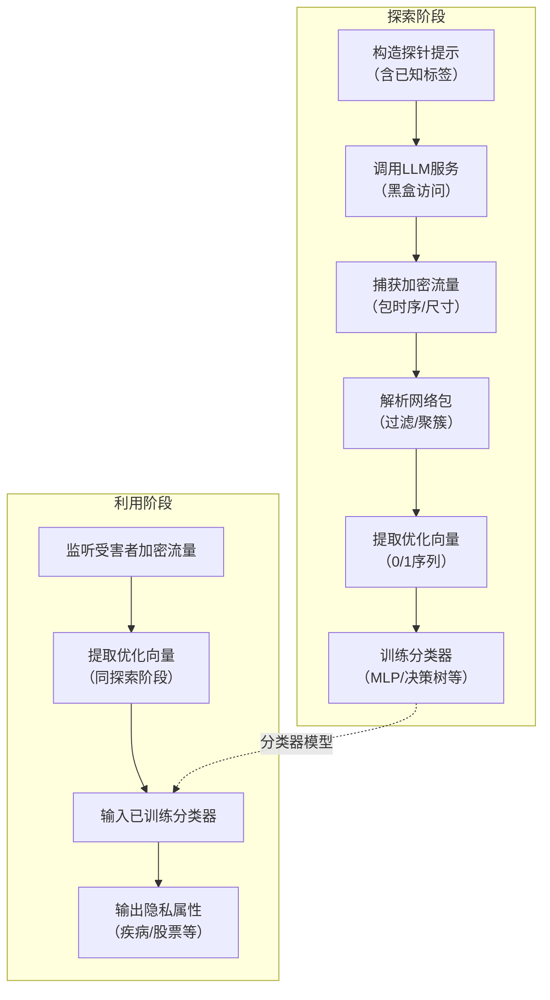

# Wiretapping LLMs: Network Side-Channel Attacks on Interactive LLM Services

---
**作者信息**

| 作者 | 机构 | 身份/背景 | 领域大牛认定 |
|------|------|------|------|
| **Anurag Khandelwal** | 耶鲁大学 | 计算机科学系**助理教授**；UC Berkeley博士，IIT Kharagpur本科  | ✅ **是（领域新星/rising star）**  • 2021年获**NSF CAREER Award**  • 2020年USENIX Security **Distinguished Paper Award**（Pancake） • 2023年ISCA **Best Paper Award**（SCALO） • 2024年EuroSys **Best Student Paper Award**（Trinity） • 主要领域：**系统/网络/安全/隐私**，近年来专注**机密计算、 oblivious 访问模式、LLM隐私侧信道**  |
| **Mahdi Soleimani** | 耶鲁大学 | 博士生（Khandelwal组） | ⚠️ **尚无独立学术声望标记** • 该论文是其代表性工作之一 • 同期合作论文：Weave (OSDI‘25)  |
| **Grace Jia** | 耶鲁大学 | 博士生（Khandelwal组） | ⚠️ **尚无独立学术声望标记** • 2024年USENIX Security一作（Length Leakage） • 专注：** oblivious 存储/侧信道攻击** |
| **In Gim** | 耶鲁大学 | 博士生（Khandelwal组） | ⚠️ **尚无独立学术声望标记** • 2024年MLSys一作（Prompt Cache） • 专注：**LLM推理优化/函数调用** |
| **Seung-seob Lee** | 耶鲁大学 | 博士后/研究员（Khandelwal组） | ⚠️ **尚无独立学术声望标记** • 2021年SOSP一作（MIND） • 专注：**内存解耦/分布式系统** |
 
该团队是**耶鲁大学系统与安全交叉方向的主力研究组**，由**具备顶级学术荣誉的AP带领博士生**完成。Khandelwal本人是**系统安全领域近年上升极快的新锐PI**，但尚未达到“资深大牛（如院士/ACM Fellow）”层级。

**论文发表时间**

| 项目 | 具体日期 | 来源/说明 |
|------|------|------|
| **投稿/收到日期** | 2025年2月4日 | IACR ePrint 元数据  |
| **公开上线日期** | 2025年2月5日 | IACR ePrint 审核批准  |
| **当前状态** | **预印本（Preprint）** | 尚未标注正式会议/期刊录用  |
| **关联会议信息** | 无 | 论文内文未含“已录用”脚注；组内同期工作Weave标注OSDI’25  |
  
该论文**2025年2月公开发布**，目前处于**双盲评审或修改阶段**，尚未正式发表（但已在学术圈产生影响力，Semantic Scholar显示已被引7次 ）。

**摘要**
本文首次揭示并形式化证明：LLM服务为了交互性采用的推测解码等性能优化，会通过加密网络流中的包时序与大小变化形成侧信道，攻击者可借此以50–92%的准确率窃取医疗诊断、股票预测等隐私信息，且防御将带来119倍带宽或11倍延迟的性能代价。** 

> *以上由 DeepSeek AI 生成*
---

## 一、这篇论文讲了一个什么样的故事？

本文所使用的测信道是大模型的**网络包的传输模式**。由于大模型的输出太慢，于是科学家们引入了**推测解码（Speculative Decoding**）--让一个小模型（又快又糙）先写草稿，大模型（又慢又准）快速校对。也就是“快词”由小模型生成，“慢词”由大模型生成。这也是大模型流**式传输（Streaming）**的传输方式。为了让用户体验更丝滑，每个token生成后立刻以独立网络包发出去。于是，网络的包间隔（inter-packet delay） 就变成了推测解码的内部时钟：
- 包来得快 → 这是小模型写的 → 这个词“好猜”
- 包来得慢 → 这是大模型写的 → 这个词“难猜”

那么黑客要做的，不是破解TLS，而是**学习映射关系**。本文设计了一个极其干净的攻击逻辑：
1. **探索阶段**：黑客自己花钱（<100美元）调用ChatGPT API，故意问各种疾病的症状，同时用tcpdump记录网络包。
2. **特征提取**：从包间隔提取0/1向量（1=快词，0=慢词）。
3. **模式学习**：用简单的MLP训练一个分类器——给定向量，猜这是什么病。
4. **利用阶段**：监听受害者流量，提取向量，喂给分类器，输出诊断结果。
关键洞察是：这种0/1向量在不同疾病上的“指纹”差异极大。比如“流感”这个词，小模型轻松预测，向量里一堆1；“脑胶质瘤”这个词，小模型写不出来，大模型亲自下场，向量里一堆0。
>*攻击者不需要听懂对话内容，只需要听懂“打字速度”。*

---
## 二、本文的核心思想和创新点

### 1. 核心思想
大模型在进行性能优化的同时，会在加密网络中留下**时序和包大小**的物理痕迹。这些物理痕迹就为攻击者提供了测信道。攻击者无需解密，仅凭被动监听网络包的间隔与大小，就能以极高准确率推断出医疗诊断、股票预测等隐私信息，且现有防御手段将付出巨大的带宽或延迟代价。

### 2. 关键创新点
其核心创新体现在五个层面：
- 一是**首次提出IND-CPrA形式化安全框架**，为LLM侧信道风险评估提供了可量化的理论标尺；
- 二是**首创“优化向量重构”攻击方法**，将网络包间隔解构为表征快/慢词来源的0/1序列，并借助监督学习建立从流量模式到隐私属性的精准映射；
- 三是**首次在ChatGPT、Gemini等真实商用闭源服务上完成实证攻击**，以不足100美元的成本达到50–92%的预测准确率，彻底打破“加密即安全”的惯性认知；
- 四是**系统量化了防御手段的安全-效能权衡**，揭示完全阻断侧信道需付出119倍带宽或11倍延迟的严峻代价；
- 五是前瞻性预警提示缓存、早期退出等更多LLM优化亦存在同类风险，为这一新兴交叉研究领域奠定了理论基准与实证参照。

---

## 三、方法是怎么实现的？(How does it work?)
### 1. 架构

本攻击方法采用**两阶段被动监听架构**，分为**探索阶段（Exploration Phase）** 与 **利用阶段（Exploitation Phase）**，整体流程如下图所示。

**图注**：参考论文 **Figure 2（威胁模型）**、**Figure 4（优化向量重构示意）** 及 **Figure 7（探索阶段提示构造）** 综合绘制。

### 2. 关键算法
**1. 优化向量重构算法**
根据LLM服务的**流式模型类型**，采用两种重构策略：
- **Token‑by‑token 模型（如 vLLM）**  
  - **输入**：加密包时间序列 `τ[1..n]`，每个包对应一个 token。  
  - **步骤**：  
    1. 计算相邻包时间间隔 `Δtᵢ = τ[i].time - τ[i-1].time`。  
    2. 使用 **HDBSCAN** 密度聚类将 `Δtᵢ` 分为两类：**低延迟簇**（近似模型生成的快词）与 **高延迟簇**（目标模型生成的慢词）。  
    3. 为每个 token 分配二进制标签：`V[i]=1`（快词），`V[i]=0`（慢词）。  
  - **输出**：优化向量 `V ∈ {0,1}^L`（L 为响应 token 总数）。

- **Round‑by‑round 模型（如 ChatGPT、Gemini）**  
  - **输入**：加密包序列，每个包包含**一个推测解码回合内生成的所有 token**。  
  - **步骤**：  
    1. 估算各包内 token 数量：`nᵢ ≈ floor(τ[i].size / t_avg)`，`t_avg` 为平均 token 编码长度（通过探针统计获得）。  
    2. 根据推测解码机制：**一个回合内除最后一个 token 由目标模型生成外，其余均由近似模型生成**。  
    3. 将 `nᵢ` 个 token 中前 `nᵢ-1` 个标记为 `1`（快词），最后 1 个标记为 `0`（慢词）。  
  - **输出**：优化向量 `V`（按响应顺序拼接各回合标签）。

**2. 分类器训练与推断**

- **训练**  
  - 输入：优化向量 `V` + 对应隐私属性标签 `y`（如“贫血”、“U2”）。  
  - 模型：**多层感知器（MLP）**，单隐藏层（128 神经元），ReLU 激活，Softmax 输出。  
  - 损失函数：交叉熵损失，Adam 优化器，训练 100 轮。  
  - 备选：决策树（最大深度 32），用于低成本快速训练。

- **推断**  
  - 对受害者流量提取优化向量 `V'`，输入已训练分类器，输出预测标签 `ŷ`。

### 3. 关键公式
**1.每包 token 数量估计（Round‑by‑round 模型）**

\[
n_i = \left\lfloor \frac{\tau[i].\text{size}}{t_{\text{avg}}} \right\rfloor
\]

- $\tau[i].\text{size}$：第 $i$ 个加密包大小（字节）。  
- $t_{\text{avg}}$：**平均每 token 编码长度**（通过探索阶段采样统计，ChatGPT 中 JSON 封装后约 250 字节）。  
- **误差**：实测低于 3%（论文 Figure 6）。

**2. 优化向量构造（Round‑by‑round 模型）**

\[
V = \bigl[ \underbrace{1,1,\dots,1}_{n_1-1\text{个}}, 0,\quad 
\underbrace{1,1,\dots,1}_{n_2-1\text{个}}, 0,\quad \dots \bigr]
\]

- **原理**：每个推测解码回合生成 $n_i$ 个 token，前 $n_i-1$ 个由**近似模型**生成（快词），最后 1 个由**目标模型**生成（慢词）。

**3. 时序聚类判别（Token‑by‑token 模型）**

HDBSCAN 自动推断快/慢词延迟分界点 $\theta$，等价于隐式判别：

\[
V[i] = 
\begin{cases}
1, & \Delta t_i < \theta \\
0, & \Delta t_i \ge \theta
\end{cases}
\]

---
## 四、实验效果 (Experimental Results)

### 1. 实验设置

**目标系统与模型**

| 系统类型 | 具体服务/框架 | 模型配置 | 流式模型类型 |
|--------|--------------|--------|-------------|
| 开源系统 | vLLM | Phi3-14B（目标）、Phi3-3.8B（近似） | Token‑by‑token（PacketPerToken变体） |
| 商用闭源 | ChatGPT | gpt-4o、gpt-4o-mini | Round‑by‑round（PacketPerRound） |
| 商用闭源 | Gemini 1.5 Pro | 未知 | Round‑by‑round（PacketPerRound） |

**隐私敏感应用场景**

- **医疗诊断**：基于ChatCAD [5,6] 提示模板，使用DDXPlus [59] 数据集中的**35种常见疾病**，共949,854条探针提示（10%留作受害者测试集）。攻击目标：预测LLM输出的**疾病名称**。
- **股票预测**：基于AWS股票预测 [34] 提示模板，使用NASDAQ-100 [53] 历史数据 + GPT-4o生成的**12级趋势标签**（U1–U5+、D1–D5+）及**10支头部公司股票代码**。共1,545,648条探针提示。攻击目标：预测**股票代码**及**价格趋势**。

**评估指标**

- **准确率（Accuracy）**：完全正确预测的比例。
- **Top-3 准确率**：正确答案在模型前三预测中的比例。
- **相邻准确率（Adjacent Accuracy）**：仅用于趋势预测，预测趋势与实际趋势相邻（如U2预测为U1/U3）即视为正确。

**基线**：随机猜测（根据标签分布计算，医疗诊断8.5%，股票代码0.96%，价格趋势60%）。

**攻击成本度量**：API调用费用（ChatGPT/Gemini）、训练耗时（NVIDIA L4 GPU）、网络监听开销。

---

### 2. 主要结果

#### 2.1 真实世界LLM服务攻击效果

| 目标系统 | 应用场景 | 隐私属性 | 准确率 | Top-3/相邻准确率 | 随机猜测基线 |
|--------|--------|--------|-------|-----------------|-------------|
| ChatGPT gpt-4o | 医疗 | 疾病诊断 | **92%** | 97% (Top-3) | 8.5% |
| ChatGPT gpt-4o | 金融 | 股票代码 | **71%** | 86% (Top-3) | 0.96% |
| ChatGPT gpt-4o | 金融 | 价格趋势 | **90%** | 94% (相邻) | 60% |
| ChatGPT gpt-4o-mini | 医疗 | 疾病诊断 | 81% | 89% | 8.5% |
| ChatGPT gpt-4o-mini | 金融 | 股票代码 | 54% | 72% | 0.96% |
| ChatGPT gpt-4o-mini | 金融 | 价格趋势 | 82% | 88% | 60% |
| Gemini 1.5 Pro | 医疗 | 疾病诊断 | 87% | 93% | 8.5% |
| Gemini 1.5 Pro | 金融 | 股票代码 | 50% | 68% | 0.96% |
| vLLM (Phi3) | 医疗 | 疾病诊断 | 92% | 98% | 8.5% |
| vLLM (Phi3) | 金融 | 股票代码 | 71% | 86% | 0.96% |
| vLLM (Phi3) | 金融 | 价格趋势 | 95% | 97% | 60% |

**核心结论**：
- **所有目标系统在IND-CPrA定义下均不安全**，攻击准确率远超随机基线。
- GPT-4o 相比 4o-mini 泄漏更多优化信息（推测其采用更激进的推测解码策略）。
- Gemini 攻击准确率略低于GPT-4o，归因于优化向量重构误差稍高。
- vLLM 在PacketPerToken模型下时序特征极为明显，攻击效果最佳。

#### 2.2 攻击成本

| 成本项 | ChatGPT gpt-4o | ChatGPT gpt-4o-mini | vLLM/Gemini |
|-------|---------------|---------------------|-------------|
| API调用费用 | **94美元**（10k提示） | 3.4美元（10k提示） | 0美元（本地部署） |
| 分类器训练时间 | 16分钟（MLP） | 16分钟 | 16分钟 |
| 决策树训练时间 | <30秒 | <30秒 | <30秒 |
| 网络监听开销 | 可忽略 | 可忽略 | 可忽略 |

**结论**：攻击成本极低，对最昂贵的GPT-4o攻击成本不足100美元，对低成本模型仅需数美元，**具备实际威胁可行性**。

#### 2.3 不同流式模型的安全性对比（本地vLLM实验）

| 流式模型 | 医疗诊断准确率 | 金融股票准确率 | 金融趋势准确率 | 相对带宽开销 | 相对延迟开销 |
|---------|--------------|--------------|-------------|------------|------------|
| PacketPerToken | **92%** | **71%** | **95%** | 1× | 1× |
| TokenPadding | 89% | 68% | 93% | 7.5× | 1× |
| PacketPerRound | 63% | 43% | 82% | 1× | 1× |
| PacketPadding | 12% | 2% | 61% | **119×** | 1× |
| NonStreaming | 10% | 1.5% | 60% | 1.2× | **11.6×** |
| NoSpecDecoding | 9% | 1.2% | 59% | 1× | **5.8×** |

**结论**：
- **TokenPadding（仅隐藏token尺寸）无效**，因攻击者仍可利用时序信道重构优化向量。
- **PacketPerRound 在零开销下显著降低攻击精度**，但医疗诊断仍有63%准确率，不够安全。
- **完全防御需极端代价**：PacketPadding 付出119倍带宽，NonStreaming付出11.6倍延迟，NoSpecDecoding付出5.8倍延迟。
- **不存在“免费午餐”**，安全与性能/交互性呈严格权衡。

---

### 3. 消融实验与关键发现

#### 3.1 特征消融：时序 vs 尺寸

| 特征组合 | Token‑by‑token 模型 (vLLM) | Round‑by‑round 模型 (ChatGPT) |
|--------|----------------------------|-------------------------------|
| 仅时序 | 92% | 无法使用（包间隔无区分度） |
| 仅尺寸 | 23% | 87% |
| 时序+尺寸 | 95% | 91% |

**发现**：
- Token‑by‑token 模型的核心泄露信道是**时序**，尺寸仅提供辅助信息。
- Round‑by‑round 模型的核心泄露信道是**尺寸**（用于估计每包token数），时序信道因批处理被抹除。

#### 3.2 分类器模型选择

| 分类器 | 医疗诊断准确率 | 训练时间 | 模型复杂度 |
|-------|--------------|--------|-----------|
| MLP（1层128神经元） | 92% | 16分钟 | 中等 |
| 决策树（深度32） | 83% | **<30秒** | 低 |
| 随机森林 | 91% | 12分钟 | 高 |

**发现**：**简单的决策树即可达到83%准确率**，证明优化向量与隐私属性的映射关系是**强结构性的**，并非深度学习的过拟合产物；攻击者可根据成本灵活选择分类器。

#### 3.3 提示数量敏感度

- 使用**10%的训练数据**（约9.5万医疗提示）仍可获得**88%准确率**（完整数据92%）。
- 使用**1%训练数据**（约9500条）准确率下降至64%，但仍远超随机基线。
- **结论**：攻击不需要海量探针，**数千至万级别提示即可构成有效威胁**。

#### 3.4 输入长度影响（优化向量截断）

- **前16个token**：金融趋势准确率仅45%（因包含通用前缀，信息量少）。
- **前48个token**：医疗诊断准确率达饱和（92%），之后增加长度无提升。
- **前128个token**：由于LLM长文本采样随机性增加，准确率**轻微下降**。
- **结论**：攻击者可通过**截断至前48~64 token**既保证精度又降低计算成本。

#### 3.5 先验分布知识影响

| 先验知识 | 医疗诊断准确率 | 股票代码准确率 |
|--------|--------------|-------------|
| 已知真实分布 | 92% | 71%（均匀分布本身） |
| 假设均匀分布 | 85% | 71%（无变化） |

**发现**：即使攻击者对真实疾病分布一无所知，采用**均匀分布采样探针**仍可获得85%准确率。**先验分布非必要前提**，进一步降低攻击门槛。

#### 3.6 网络抖动鲁棒性

- 仿真注入网络抖动（RTT标准差）：
  - 抖动 0 ms → 优化向量重构准确率 >99%
  - 抖动 100 ms → 重构准确率 95%
  - 抖动 200 ms → 重构准确率 78%
- 真实世界测量：
  - 有线连接抖动 **0.10 ms**
  - 无线连接抖动 **2.98 ms**
  - 跨洲无线（德国→美国）抖动 **26.9 ms**
- **结论**：现实网络环境抖动远低于攻击失效阈值（100ms），攻击**具备现实鲁棒性**。

#### 3.7 防御-效能权衡量化

- **PacketPerRound**：零额外开销，攻击精度降低约30%（相较PacketPerToken）。
- **TokenPadding**：7.5倍带宽，攻击精度几乎无下降。
- **PacketPadding**：119倍带宽，攻击精度降至随机水平。
- **NonStreaming**：11倍延迟，攻击精度降至随机水平。
- **NoSpecDecoding**：5.8倍延迟，攻击精度降至随机水平。

**关键发现**：
- **隐藏token尺寸（TokenPadding）无用**，必须**隐藏时序特征或完全批处理**。
- **完全防御必须以牺牲交互性或带宽为代价**，不存在轻量级完美防御。
- 该权衡曲线为从业者提供了**量化决策依据**。

---

**实验部分总结**：
本文通过大规模、多场景、跨平台的实证评估，**确凿证明了LLM服务优化侧信道攻击的现实威胁**，系统性地量化了**攻击精度、攻击成本、防御代价**三大核心维度，为后续防御研究提供了坚实的实验基准。

> *以上由 DeepSeek AI 生成*

---

## 五. 优点与局限性 
### ✅ 1.优点 
1. 首创 “优化向量重构” 技术，分别针对 Token‑by‑token 与 Round‑by‑round 两类流式模型，从加密包时序/尺寸中精准提取推测解码内部状态（0/1 快慢词标签）。
2. 预先警示 Prompt Cache、Early Exit、函数调用等更多 LLM 优化亦存在同类侧信道风险，为该交叉研究领域指明后续方向。

### ⚠️ 2.局限性（研究边界与待解问题）
1. 和其他的几篇做分类还原用户隐私主体的分类方法一样，只能解决分类，无法还原精确的内容以及连续的问题，比如只能猜测某一只对应的股票，无法还原连续的股价。
2. **利用时序测信道的问题**--高网络抖动（>100ms）会显著降低优化向量重构精度，虽然在实测中现实网络抖动远低于此阈值，但极端拥塞或卫星链路等环境可能削弱攻击效果。
---

