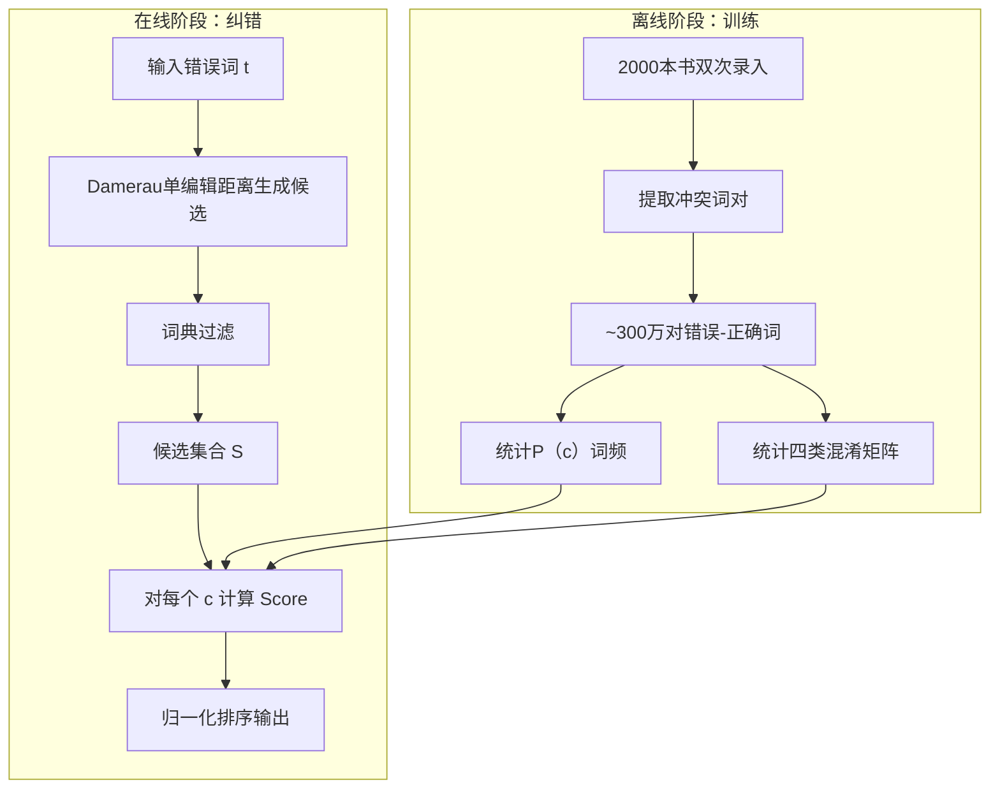

# **A Framework for Spelling Correction in Persian Language Using Noisy Channel Model**

（基于噪声信道模型的波斯语拼写纠错框架）
---

## **作者信息**

| 作者 | 机构 | 身份/背景 | 领域大牛认定 |
|------|------|-----------|-------------|
| Mohammad Hoseyn Sheykholeslam | 伊斯兰科学计算机研究中心（CRCIS），库姆 | 研究员/工程师 | 非顶级大牛 |
| Behrouz Minaei‑Bidgoli | 伊朗科技大学，德黑兰 | 教授 | 伊朗国内NLP/数据挖掘知名学者 |
| Hossein Juzi | 伊斯兰科学计算机研究中心（CRCIS），库姆 | 研究员/工程师 | 非顶级大牛 |

## **团队整体定位**：  
伊朗NLP与计算语言学方向的应用型团队，由**伊朗科技大学教授 + CRCIS核心研发人员**组成。Minaei‑Bidgoli是伊朗国内资深学者，但**未达到国际顶级（如ACL Fellow/院士）层级**。本研究的最大亮点是**CRCIS独有的大规模双次键入语料库**。

## **论文发表时间**

| 项目 | 具体日期 | 来源/说明 |
|------|----------|-----------|
| 发表年份 | 2012年 | 论文正文标注 |
| 发表状态 | 已正式发表（会议或期刊，摘要未明确） | 非预印本 |

---

## **摘要**  
波斯语拼写纠错长期缺乏大规模训练语料。本文利用CRCIS“双次键入+第三人校对”的业务流程，从约2000本书（1.7亿词）中提取出**300万对错误‑正确词对**，并据此训练噪声信道模型。系统先以Damerau单编辑距离生成候选，再通过**语言模型先验 P(c) × 信道似然 P(t|c)** 排序。实验表明，1‑Best准确率达**75.3%**，5‑Best达**90.5%**，显著优于Jaro‑Winkler和Damerau‑Levenshtein等传统方法。

---

## 一、这篇论文讲了一个什么样的故事？

这篇论文讲的是：**利用业务流程中天然产生的“双次键入”对齐数据，训练噪声信道模型，从而突破波斯语拼写纠错的数据瓶颈**。

- **背景**：波斯语拼写纠错因缺乏大规模语料而停滞在编辑距离、语音相似度等浅层方法上。
- **转机**：CRCIS每本书由两人分别录入、第三人校对，自然形成海量的“错误⇄正确”字符对。
- **主线**：有了数据 → 训练噪声信道模型 → 贝叶斯框架排序候选词 → 实验验证。
- **结论**：数据驱动的概率模型在波斯语上显著优于传统距离法，填补了该语言在此方向上的空白。

> 一句话：**“我们用大语料 + 噪声信道模型，把波斯语拼写纠错做到了75%+的首词命中率。”**

---

## 二、本文的核心思想和创新点

### 1. 核心思想
将拼写纠错视作**带噪通信的解码问题**——错误词是正确词经过“噪声信道”后的失真输出。利用贝叶斯公式：
$$ \hat{c} = \arg\max_{c} P(c) \cdot P(t|c) $$
其中$ P(c) $来自语言模型（词频），$P(t|c)$ 来自信道模型（混淆概率），二者共同决定候选词的排序。

### 2. 关键创新点
- **首次将噪声信道模型系统性应用于波斯语**，并验证其有效性。
- **独创性利用“双次键入”业务流程生成对齐语料**，无需人工标注，是一种**低成本弱监督数据获取范式**。
- **构建了波斯语拼写纠错的基础资源**——插入/删除/替换/换位四类字符级混淆矩阵。
- **引入Expected Likelihood Estimate（ELE）平滑**（r+0.5）防止零概率问题。

---

## 三、方法是怎么实现的？（How does it work?）

### 1. 整体架构

系统分为**离线数据准备**和**在线纠错**两大阶段，流程如下：

**候选生成**仅考虑与错误词**编辑距离=1**的四种操作：插入、删除、替换、相邻换位（覆盖约80%的真实错误）。

### 2. 关键算法

- **生成算法**：Damerau单编辑距离（1964）。
- **排序算法**：贝叶斯极大后验估计（MAP），按 $P(c) \cdot P(t|c)$ 降序排列。
- **归一化**：将原始得分除以所有候选得分之和，得到概率意义上的归一化分值。

### 3. 关键公式

**语言模型**（ELE平滑）：
$$P(c) = \frac{\text{freq}(c) + 0.5}{N}$$
- $N$ = 总词数（约1.7亿）

**信道模型**（四类混淆概率）：
$$P(t|c) = 
\begin{cases}
\dfrac{\text{Add}[c_{p-1}, t_p]}{\text{chars}[c_{p-1}, t_p]}, & \text{插入}\\[20pt]
\dfrac{\text{Del}[c_{p-1}, c_p]}{\text{chars}[c_{p-1}, c_p]}, & \text{删除}\\[20pt]
\dfrac{\text{chars}[c_{p-1}]}{\text{chars}[c_p]}, & \text{替换}\\[20pt]
\dfrac{\text{Rev}[t_p, t_{p-1}]}{\text{chars}[t_p, t_{p-1}]}, & \text{换位}
\end{cases}$$

**最终得分并归一化**：
$$\text{Score}(c) = P(c) \cdot P(t|c), \quad 
\text{Normal}(c) = \frac{\text{Score}(c)}{\sum_{c_i \in S} \text{Score}(c_i)}$$

---

## 四、实验效果（Experimental Results）

### 1. 实验设置
- **测试集**：18,214对真实错误‑正确词对（与训练集分离）。
- **对比方法**：Jaro‑Winkler + 频次排名、Damerau‑Levenshtein + 频次排名。
- **评估指标**：1‑Best、5‑Best、10‑Best准确率（候选列表中前N个命中的比例）。

### 2. 主要结果

| 模型 | 1‑Best (%) | 5‑Best (%) | 10‑Best (%) |
|------|-----------|-----------|------------|
| Jaro‑Winkler + 频次 | 55.3 | 83.1 | 90.5 |
| Damerau‑Levenshtein + 频次 | 58.1 | 87.4 | 90.5 |
| **本文噪声信道模型 (NCM)** | **75.3** | **90.5** | **90.5** |

**核心结论**：
- **首词命中率飞跃**：NCM比DL高出**17.2个百分点**（58.1→75.3），比JW高出**20个百分点**，证明概率排序远优于距离排序。
- **Top‑5接近饱和**：90.5%的错误能在前5个候选中找到正确答案，实用性极强。
- **Top‑10三者持平**：说明候选覆盖能力相同，差异主要在于**排序质量**。

### 3. 关键发现（本文未做标准消融，但从数据可推断）
- **统计模型优于几何距离**——同样候选集，概率排序碾压编辑距离排序。
- **语料规模决定模型上限**——1.7亿词 + 300万错误对是效果的核心保障。
- **波斯语适用该范式**——验证了噪声信道模型在屈折/粘连语言上的通用性。

---

## 五、优点与局限性

### ✅ 优点
1. **数据资源价值极高**——“双次键入”业务流程是一种**零标注成本的弱监督数据获取范式**，对低资源语言极具借鉴意义。
2. **方法迁移成功**——将英语上成熟的噪声信道模型首次完整迁移到波斯语，验证了语言无关性。
3. **效果提升显著**——1‑Best准确率提高近20个百分点，具有实际工程价值。
4. **计算效率高**——候选生成仅用单编辑距离，适合实时部署。

### ⚠️ 局限性（研究边界）
1. **仅孤立词纠正**——未利用上下文信息，无法处理“银行”（金融机构 vs. 河岸）等词义消歧。
2. **未实现更高级的Brill‑Moore模型**——作者自认下一步需引入“字符串→字符串”替换以覆盖多字符错误。
3. **候选生成过于简单**——只支持单错误，无法处理含2个及以上错误的词（尽管80%是单错，仍有20%未覆盖）。
4. **未融入语音模型**——波斯语有同音字符（如س/ص），Toutanova的语音增强模型未被使用。
5. **评估指标单一**——只报告准确率，缺少精确率、召回率、MRR等更全面指标。
6. **跨语言验证不足**——未在同一框架下测试阿拉伯语、乌尔都语等相似语言。

---

## 六、其他

### 第一性原理
拼写纠错的本质是**从有噪声的观测信号中还原真实信号**，这是一个**贝叶斯推理**问题：

$$P(\text{真实}|\text{观察}) \propto P(\text{观察}|\text{真实}) \cdot P(\text{真实})$$

- **信道似然** $P(\text{观察}|\text{真实})$ 反映**错误产生的物理/认知机制**（键盘相邻、击键时序、认知漏打等）。
- **先验** $P(\text{真实})$ 反映**语言的幂律分布**——常见词先验高，应被优先考虑。
- 当多个候选与错误词“距离”相同时，**统计概率胜于对称几何距离**，这就是NCM排序碾压编辑距离的根本原因。

### 领域空白
本文填补了波斯语拼写纠错在**数据**、**方法**和**语言验证**三方面的空白：
- **数据空白**：首次提供300万级真实对齐错误对，取代人工合成错误。
- **方法空白**：首次引入噪声信道模型这一“黄金标准”方法到波斯语。
- **语言验证空白**：证明该模型在屈折/粘连型语言中同样有效，为阿拉伯语、乌尔都语等提供先行参考。

### note

作者没有开放数据集！
---

> *以上由 DeepSeek AI 生成*