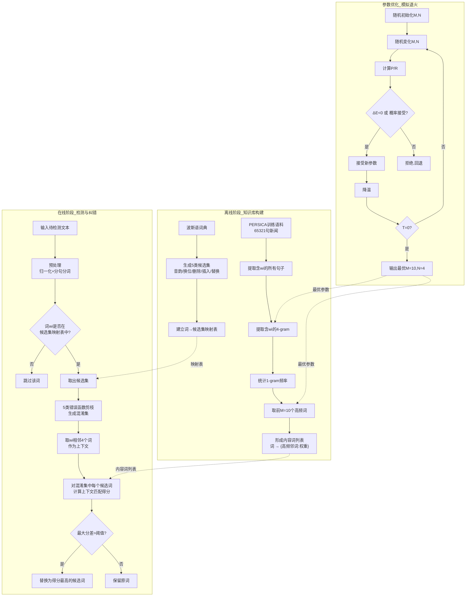

# A Content-based Method for Persian Real-Word Spell Checking (2015)

---
## **作者信息**

| 作者 | 机构 | 身份/背景 | 领域大牛认定 |
|------|------|----------|-------------|
| Mohammad Hossein Samani | Research Center for Developing Advanced Technologies (RCDAT), Tehran | 基础设施安全部门研究员 | 非领域顶级大牛 |
| Zeinab Rahimi | RCDAT, Tehran | 语音与自然语言处理部门研究员 | 非领域顶级大牛 |
| Sara Rahimi | Shahrud University of Technology | 计算机工程与信息技术系研究生 | 非领域顶级大牛 |

## **团队相关信息**：
该团队来自**伊朗的两个学术/研究机构**——RCDAT（先进技术研发中心）和Shahrud理工大学。RCDAT是伊朗国内的技术研发机构，并非国际知名的NLP研究中心。三位作者均未见于国际顶级NLP会议（如ACL/EMNLP/NAACL）的主要作者名单，属于**区域性研究团队**，在国际学术圈影响力有限。该论文发表于**伊朗国内的ICT会议（IKT 2015）**，非国际顶级会议。

## **论文发表时间**

| 项目 | 具体日期 | 来源/说明 |
|------|---------|----------|
| 会议召开年份 | 2015年 | 7th International Conference on Information and Knowledge Technology (IKT 2015) |
| 发表状态 | 2015年已正式发表 | IEEE Xplore收录的会议论文（正式出版） |

---

## **摘要**

本文提出了一种面向波斯语真实单词拼写错误的基于内容的方法。该方法将真实单词错误分为5类，并通过基于内容的流程进行修正。每个可能引发真实单词错误的词，与其相似词（潜在错误）作为一个条目列入候选集。随后，基于混淆集中每个词的相邻高频N-gram构建内容词列表。评估表明，所提方法不仅具有良好性能和可接受的精确率，而且在精确率和召回率方面均优于同类现有系统。

---

## 一、这篇论文讲了一个什么样的故事？

这篇论文讲述的是**波斯语（Persian/Farsi）文本编辑中“真实单词错误”（Real-Word Error）的自动检测与纠正问题**。

故事背景是：随着文本编辑软件的广泛使用，拼写检查器已成为NLP领域最常用的工具之一。英语拼写检查器已相当成熟，但波斯语的完美拼写检查仍是未解难题。在波斯语拼写检查器的各个模块中，负责处理真实单词错误的部分性能最差，几乎无法实际应用。

所谓“真实单词错误”，是指文本中的某个词本身是波斯语词典中的合法词汇，但并非作者原本想写的词——例如，打字时误将“heart”打成“heat”（英文例子）。这类错误无法通过简单的词典查词检测出来，必须借助上下文语义分析。

论文的故事主线是：

1. **定义问题边界**——将真实单词错误细分为5类（音韵、换位、删除、插入、替换），并基于波斯语的特点为每个词构建“候选集”；
2. **构建知识库**——从大型新闻语料库（PERSICA，65321句）中提取每个候选词的高频相邻N-gram，形成“内容词列表”；
3. **设计纠错流程**——对待检测文本，通过候选集定位、错误类型函数剪枝、相邻4词与内容词列表的加权评分，判断是否应该替换以及替换为哪个候选词；
4. **参数优化**——使用模拟退火算法确定最优参数（M=10, N=4）；
5. **验证有效性**——在两个测试集上与基线系统[18]对比，F-measure从83.6%提升至88.3%，证明方法有效。

简而言之，这是一个**基于统计上下文的波斯语真实单词拼写纠错系统**，其核心贡献在于面向波斯语的语言特点设计了候选集构建和上下文评分方法。

---

## 二、本文的核心思想和创新点

### 1. 核心思想

**两步走策略**：

- **第一步（离线构建）**：为波斯语词汇中的每个可能产生真实单词错误的词，建立两个知识库——① 候选集（哪些词可能被混淆替换）；② 内容词列表（每个词在上下文中经常与哪些词共现）。
- **第二步（在线纠错）**：当输入文本中的某个词命中了候选集，就提取其相邻4个词，与候选集中每个词的内容词列表做匹配打分，分数最高且差距超过阈值者即为纠错结果。

### 2. 关键创新点

| 创新点 | 说明 |
|--------|------|
| **面向波斯语的5类错误细分** | 将波斯语真实单词错误细化为音韵错误、换位错误、删除错误、插入错误、替换错误，不同于一般研究的笼统处理 |
| **候选集 + 内容词列表的双知识库架构** | 第一层知识库（候选集）基于词汇相似性（编辑距离类），第二层知识库（内容词列表）基于语料统计——两层解耦，可独立优化 |
| **基于N-gram的上下文评分机制** | 利用相邻4个词（N=4，经SA优化）与候选词的内容词列表做加权匹配，而非直接用N-gram概率，避免稀疏性问题 |
| **模拟退火参数优化** | 使用SA算法系统优化M（高频词个数）和N（N-gram阶数），而非经验设定 |
| **首次系统化波斯语真实单词纠错** | 在论文发表时，波斯语真实单词纠错的相关工作极少，该研究填补了空白 |

---

## 三、方法是怎么实现的？(How does it work?)

### 1. 架构

本方法分为**离线构建阶段（知识库构建）**与**在线检测与纠错阶段**，整体流程如下图所示。

**图注**：参考论文 **Section III（Proposed Method）** 及 **Figure 3（Flow chart of proposed method）** 综合绘制。

### 2. 关键算法

**算法1：内容词列表构建（离线阶段）**

对于词典中每个词 $w_i$ ：

1. 从训练语料中提取所有包含 $w_i$  的句子  $S_{i,k}$；
2. 对每个句子，提取包含 $w_i$  的 N-gram（N=4）；
3. 统计所有这些 N-gram 中所有 1-gram（即单个词）的出现频率；
4. 取频率最高的 M 个词（M=10）作为 $w_i$  的内容词列表，频率归一化后作为权重。

**算法2：在线纠错流程**

输入文本 $T$，对于每个词 $w$ ：

1. 若 $w$ 不在候选集映射表中 → 跳过；
2. 取 $w$ 的候选集 $C(w)$，用5类错误函数剪枝得到混淆集 $Conf(w)$；
3. 取 $w$ 的左右各2个词（共4个相邻词）作为上下文 \( Context(w) \)；
4. 对于 $Conf(w)$ 中的每个候选词 $c_j$ ，计算得分：
  $$ Score(c_j) = \sum_{t \in Context(w)} weight_{c_j}(t)$$
   其中 $weight_{c_j}(t)$ 是词  $t$  在候选词  $c_j$  的内容词列表中的归一化频率；

5. 若 $\max(Score) - \text{second\_max}(Score) > \text{threshold}$ ，则将  $w $ 替换为得分最高的候选词。

### 3. 关键公式

**(1) 召回率 (Recall)**
$$Recall(Y|X) = \frac{|X \cap Y|}{X}$$
其中 X 为系统输出候选集，Y 为标准参考集。

**(2) 精确率 (Precision)**
$$Precision(Y|X) = \frac{|X \cap Y|}{Y}$$

**(3) F-measure**
$$F = \frac{2 \times Precision \times Recall}{Precision + Recall}$$

**(4) 模拟退火中的能量差**
$$\Delta E = Cost(new) - Cost(old)$$
其中 $Cost = 1 - F\text{-}measure $（反向评分），若 $\Delta E < 0$  则接受新点，否则以概率 $ P = e^{-\Delta E / T}$  接受。

---

## 四、实验效果 (Experimental Results)

### 1. 实验设置

| 配置项 | 详情 |
|--------|------|
| **训练语料** | PERSICA语料库，65321句新闻文本（来自ISNA通讯社），共2,637,480词 |
| **测试集1** | 550句新闻文本（来自PERSICA非训练部分） |
| **测试集2** | 1100句上下文敏感测试集（德黑兰大学NLP实验室准备），用于公平对比 |
| **基线系统** | Faili & Azadnia (2010) [18]——首个波斯语上下文敏感拼写检查器（基于贝叶斯方法） |
| **评价指标** | 精确率(Precision)、召回率(Recall)、F-measure |
| **最优参数** | M=10, N=4（经模拟退火优化） |

### 2. 主要结果

**表1：本文方法在测试集1上的表现**

| 指标 | 数值 |
|------|------|
| Precision | 89.2% |
| Recall | 90.5% |
| F-measure | **89.8%** |

**表2：与基线系统[18]的对比（测试集2）**

| 系统 | Precision | Recall | F-measure |
|------|-----------|--------|-----------|
| Faili & Azadnia [18] | 80.5% | 87.0% | 83.6% |
| **本文方法** | **87.7%** | **89.0%** | **88.3%** |

**核心结论**：
- 本文方法在精确率上比基线提升 **+7.2个百分点**（87.7% vs 80.5%）；
- 在F-measure上提升 **+4.7个百分点**（88.3% vs 83.6%）；
- 在训练语料同域的测试集1上表现更优（F=89.8%），说明领域适配性有效；
- 证明了基于内容（上下文统计）的方法在波斯语真实单词纠错任务上优于纯贝叶斯方法。

### 3. 消融实验与关键发现

论文未单独设置消融实验（ablation study），但通过**模拟退火参数优化**间接验证了关键超参数的影响：

| 参数 | 搜索范围 | 最优值 | 说明 |
|------|---------|--------|------|
| M（高频词个数） | 未明确（SA搜索） | 10 | 取前10个高频邻词已足够，更多词引入噪声 |
| N（N-gram阶数） | 未明确（SA搜索） | 4 | 4-gram最能捕获波斯语的局部上下文依赖 |

**隐含验证**：通过对比测试集1（新闻域，与训练语料同域）和测试集2（通用域）的结果，可以观察到**领域适配性对性能影响显著**——同域测试F=89.8%，跨域测试F=88.3%，差距虽不大但仍表明内容词列表的域敏感性。

---

## 五、优点与局限性

### ✅ 1. 优点

- **面向波斯语的系统化设计**：首次将波斯语真实单词错误细化为5类并分别建模，体现了对目标语言特点的深入思考；
- **双重知识库解耦**：候选集（词汇相似性）与内容词列表（上下文共现）分离构建，使得两部分可各自独立优化和扩展；
- **参数调优系统化**：使用模拟退火而非经验设定，提高了方法的可复现性和理论严谨性；
- **切实可行的性能提升**：相比2010年的基线系统，F-measure提升约5个百分点，验证了方法的有效性；
- **评测设计合理**：使用公开语料PERSICA和共享测试集，与其他工作可比。

### ⚠️ 2. 局限性（研究边界与待解问题）

- **语料规模有限**：训练语料仅6.5万句（260万词），对于统计方法而言规模较小，可能影响低频词的内容词列表质量；
- **仅覆盖5类错误**：论文明确指出只覆盖5类真实单词错误，但真实世界中可能还有更多错误类型（如键盘布局导致的系统化错误等）；
- **阈值设定模糊**：评分后的替换阈值（threshold）未详细说明如何确定，缺乏理论指导；
- **未处理未登录词（OOV）** ：方法依赖词典和候选集，无法处理词典外的词汇；
- **领域迁移性未充分验证**：训练语料为新闻域，虽在通用测试集上表现尚可，但对诗歌、口语、社交媒体等域的效果未知；
- **基线单一**：仅与[18]对比，未与同期其他系统（如VAFA[19]）进行对比；
- **未公开代码和数据**：论文未提及代码开源，对学术界的可复现性和后续推进有限。

---

## 六、其他

### 第一性原理

**问题本质**：真实单词错误纠错的根本困难在于——单个词本身在词典中存在，因此局部信息（词本身）不足以下判断，必须借助更广的上下文信号。

**第一性思维**：
- 人类如何判断一个词是否用错了？→ 读者会看这个词周围出现了哪些其他词，如果某些共现模式与自己的语言经验严重不符，就会产生“别扭”的感觉。
- 能否让机器模拟这个过程？→ 从大规模语料中统计每个词与其上下文的共现关系，以此作为“语言经验”的数字化表达。
- 波斯语的特点是什么？→ 波斯语具有阿拉伯-波斯字母系统、独特的正字法、相对灵活的语序，其错误模式（如音韵混淆）与其他语言不同，需要定制化处理。

本文正是沿着“**用统计共现模拟人类上下文语感**”这一第一性思路展开，方法的核心是**用数据驱动的方式为每个词构建其典型上下文画像，然后以待纠错词的实际上下文与之匹配**。

### 领域空白

**当时（2015年前后）波斯语NLP的空白状态**：

| 空白维度 | 具体描述 |
|----------|---------|
| **真实单词错误检查几乎空白** | 波斯语拼写检查主要集中在非词错误（non-word error）检测，如Virastyar[10]、STEP-1[11]等；真实单词错误检查仅有[18]和VAFA[19]等极少数工作 |
| **缺乏面向波斯语特性的错误分类** | 已有的波斯语真实单词纠错工作多直接借用英语的方法论（如贝叶斯分类），未系统针对波斯语的音韵、正字法特点设计错误类别 |
| **缺乏高质量波斯语上下文语料** | PERSICA语料库（本文所用）在2015年属于较新的贡献，说明波斯语大规模标注/统计语料在彼时仍稀缺 |
| **缺乏参数优化的系统性研究** | 波斯语N-gram方法中的参数（N阶数、特征数量等）多为经验设定，缺乏如本文使用模拟退火进行系统优化的先例 |

**本文在填补空白方面的贡献**：构建了针对波斯语特点的5类错误体系 + 第一个使用系统化参数优化的波斯语真实单词纠错系统 + 验证了基于内容（上下文统计）方法在波斯语上的可行性。但该空白远未被完全填补——后续仍需更大规模语料、更丰富的错误类型、以及基于深度学习的方法来进一步提升。

### note

作者没有开放数据集！
---

> *以上由 DeepSeek AI 生成*
