# **PerSpellData: An Exhaustive Parallel Spell Dataset For Persian**

---

## **作者信息**

| 作者 | 机构 | 身份/背景 | 领域大牛认定 |
|------|------|-----------|-------------|
| Romina Oji | 德黑兰大学 | 博士生/研究人员 | 青年研究者 |
| Nasrin Taghizadeh | 德黑兰大学 | 博士生/研究人员 | 青年研究者 |
| Heshaam Faili | 德黑兰大学 | 教授/研究组负责人 | **伊朗自然语言处理领域资深学者**，德黑兰大学NLP实验室带头人 |

## **团队相关信息**：  
该团队是**德黑兰大学计算机工程学院自然语言处理研究组**，由**资深教授Heshaam Faili领导**。Faili教授在波斯语NLP领域有长期积累，曾主导开发Vafa拼写检查器，并在数字人文学科领域有重要发表。该团队是**波斯语拼写校正与语法纠错方向的核心研究力量**，但尚未达到国际顶级学术圈（如ACL Fellow等）的广泛认知度。

---

## **论文发表时间**

| 项目 | 具体日期 | 来源/说明 |
|------|----------|-----------|
| 提交时间 | 2021年 | 论文中无明确提交日期，推测为2021年 |
| 发表状态 | 已发表 | 发表于某学术会议/期刊（论文格式表明为会议论文） |

该论文**2021年公开发布**，目前已被引用数次，是**波斯语拼写校正领域首个大规模平行数据集**的开创性工作。

---

## 摘要

本文提出了PerSpellData，一个专为波斯语拼写校正任务构建的大规模平行数据集。该数据集包含约640万对平行句子（错误句−正确句），其中约380万为非词错误，其余为真词错误。数据集构建依托大规模波斯语语料库和一个包含215万对词条的混淆矩阵，数据来源涵盖：1）知名波斯语拼写检查器Virastman的用户日志（实际人为错误）；2）CPG波斯语语法错误语料库；3）基于字典和大规模语料合成的系统性错误。数据集覆盖正式与非正式文本、多种主题，同时包含词级和句级错误。本文还使用CHAR-LSTM-LSTM模型对该数据集进行了验证实验，并与Virastman进行了对比。

---

## 一、这篇论文讲了一个什么样的故事？

**核心叙事线**：

波斯语作为一种低资源语言，长期以来缺乏大规模、公开可用的拼写校正平行数据集。现有波斯语拼写检查工具（如Virastman、Paknevis）主要基于词典和n-gram语言模型，存在两大局限：（1）上下文窗口过小，无法有效处理非词错误；（2）缺乏真词错误数据，导致无法训练端到端的神经拼写校正模型。

近年来，英语等语言中基于编码器-解码器架构的神经拼写校正器取得了显著成效，但这些模型严重依赖大规模平行数据。波斯语恰好面临"无数据可用"的困境——已有数据集要么规模太小，要么纯属合成，要么不包含真词错误。

本文的解决方案是：**系统性收集+智能合成**双轨并行。一方面从Virastman日志中挖掘用户真实错误记录，另一方面基于大规模混淆矩阵（215万对词）生成覆盖所有错误类型（插入、删除、替换、换位、词边界等）的系统化噪声。最终构建出包含640万平行句对的PerSpellData数据集，填补了波斯语拼写校正领域的核心数据空白。

**这项工作的价值在于**：它不仅是一个数据集，更是一套完整的数据构建方法论，展示了如何从多个异构来源（日志、学习者语料、OCR输出、人工规则）整合出高质量的平行数据，为其他低资源语言的类似任务提供了可复制的范式。

---

## 二、本文的核心思想和创新点

### 1. 核心思想

**将拼写校正问题重新定义为"从错误文本到正确文本的机器翻译问题"** ，为此需要大规模平行数据作为训练燃料。论文的核心策略是：**构建一个覆盖所有错误类型（非词+真词）、融合真实错误与合成错误的大规模平行数据集**，使神经拼写校正模型能够在波斯语上有效训练。

### 2. 关键创新点

| 创新点 | 说明 |
|--------|------|
| **最大规模的波斯语平行拼写数据集** | 约640万平行句对，远超此前所有波斯语拼写数据集，为训练深度学习模型提供了充足数据 |
| **首次系统覆盖真词错误** | 此前波斯语数据集几乎不包含真词错误，本文从9种不同来源系统收集/合成了约250万真词错误样本 |
| **真实错误+合成错误的双轨策略** | 既包含Virastman日志中用户实际犯的错误（高真实性），又通过混淆矩阵进行系统性错误注入（高覆盖率） |
| **多源混淆矩阵构建** | 整合了Faspell、CPG、Virastman日志、波斯语语言学规则（Tanvin、Hamza、Gozar词等）等多种来源，构建了215万对混淆词 |
| **首次识别"词边界错误"为波斯语最频错误类型** | 发现"به"（to）与后续词错误合并占所有非词错误的约61%，为后续模型设计提供了重要语言学线索 |

---

## 三、方法是怎么实现的？(How does it work?)

### 1. 架构

数据集构建采用**四阶段流水线架构**：语料收集与清洗 → 混淆矩阵构建 → 非词错误生成 → 真词错误生成。

```mermaid
graph TD
    subgraph 语料与词典构建
        A1[多源波斯语语料<br>Wikipedia/Blogfa/新闻/CPG/COPER] --> A2[文本清洗与规范化<br>字符归一化/符号转换/Emoji移除]
        A2 --> A3[句子分割与错误句过滤]
        A3 --> A4[人工校验词典<br>~290K词条]
    end

    subgraph 混淆矩阵构建
        B1[Virastman日志<br>用户实际错误] --> B5[融合混淆矩阵<br>2.15M对]
        B2[CPG语料库<br>学习者错误] --> B5
        B3[Faspell<br>学生/打字员错误] --> B5
        B4[语言学规则<br>Tanvin/Hamza/Gozar/同音词] --> B5
        B6[编辑距离合成<br>1-2 Damerau-Levenshtein] --> B5
    end

    subgraph 非词错误生成
        C1[Virastman日志真实错误] --> C3[平行句对<br>3.8M]
        C2[CPG/Faspell/词边界规则<br>合成/真实混合] --> C3
    end

    subgraph 真词错误生成
        D1[Virastman真词日志] --> D3[平行句对<br>2.5M]
        D2[编辑距离合成<br>~1.4M对] --> D3
        D3[语言学规则<br>复数的错误复数/同音词/Tanvin/Hamza] --> D3
    end

    A4 --> B6
    A4 --> D2
    C3 --> E[PerSpellData<br>6.4M平行句对]
    D3 --> E
```

**图注**：参考论文**Section 4（PerSpellData）** 的数据构建流程综合绘制。

### 2. 关键算法与策略

**（1）混淆矩阵构建策略**

混淆矩阵是数据合成的核心。每一对 (w_correct, w_wrong) 表示两个词可能被混淆。来源包括：

| 来源 | 数量级 | 特点 |
|------|--------|------|
| Virastman日志 | ~303K非词对 + ~1K真词对 | 用户真实行为，最高质量 |
| 编辑距离合成 | ~1.4M对 | 基于290K词典，Damerau-Levenshtein距离1或2 |
| Faspell | 包含三类错误 | 小学学生+专业打字员错误 |
| 语言学规则 | 数百至数千对 | Tanvin、Hamza、Gozar、同音词等 |

**（2）非词错误生成**

- **Virastman日志处理**：用户从建议列表中选择正确词，或手动输入正确词，构成平行对
- **CPG/Faspell转换**：将错误词替换为正确词，构造平行句
- **词边界规则**：手工收集"به"与后续词错误合并的约500种常见情况

**（3）真词错误生成**

核心挑战：真词错误的"正确词"和"错误词"都是词典中的合法词，需要上下文才能区分。论文通过以下方式生成：

- **编辑距离合成**：为290K词典中每个词查找1-2个编辑距离内的候选词，形成1.4M对
- **语言学规则集**：
  - 阿拉伯语复数词被错误二次复数化
  - 同音词（基于Persian Soundex）
  - "گذاشتن/گزاردن"两个同音异义动词的混淆
  - Tanvin（تنوین）标记的遗漏或误用
  - Hamza（همزه）在Alef和Yeh上的位置混淆

### 3. 关键公式与指标

**Damerau-Levenshtein距离**：用于生成混淆矩阵的核心编辑距离度量，包含四种基本操作（插入、删除、替换、换位），每个操作距离为1。

$$D_{DL}(a,b) = \min \begin{cases} 
D_{DL}(a_{i-1}, b_j) + 1 & \text{(删除)} \\
D_{DL}(a_i, b_{j-1}) + 1 & \text{(插入)} \\
D_{DL}(a_{i-1}, b_{j-1}) + \mathbb{1}(a_i \neq b_j) & \text{(替换)} \\
D_{DL}(a_{i-2}, b_{j-2}) + 1 & \text{(换位)}
\end{cases}$$

**数据集统计**：

| 错误类型 | 混淆矩阵大小 | 最终数据集大小 |
|----------|-------------|---------------|
| 非词错误 | 650K | 3.8M |
| 真词错误 | 1.5M | 2.5M |
| **总计** | **2.15M** | **6.4M** |

---

## 四、实验效果 (Experimental Results)

### 1. 实验设置

| 项目 | 配置 |
|------|------|
| **训练数据** | Virastman非词日志的150万平行句 |
| **测试数据** | Faspell数据集中的1600句 |
| **模型** | CHAR-LSTM-LSTM（嵌套RNN，Li et al., 2018），通过NeuSpell实现 |
| **对比基线** | Virastman（基于词典检测 + bi-gram LM + 加权编辑距离排序） |
| **评估指标** | 准确率（Accuracy）+ 校正率（Correction Rate） |
| **超参数** | 与NeuSpell原始实现一致 |

### 2. 主要结果

| 模型 | 准确率 (%) | 校正率 (%) |
|------|-----------|-----------|
| Virastman（所有建议） | **97.95** | 74.26 |
| CHAR-LSTM-LSTM（波斯语） | 95.83 | 58.42 |
| CHAR-LSTM-LSTM（英语） | 96.60 | 77.30 |

**核心结论**：

- **Virastman准确率极高**（97.95%）：它很少将正确词误判为错误，错误检测能力出色
- **但校正率偏低**（74.26%）：主要是因为Virastman采用交互式设计——它给出多个候选词，但不做最佳排序
- **CHAR-LSTM-LSTM准确率低于Virastman**（95.83% vs 97.95%），表明神经模型在错误检测上仍有提升空间
- **CHAR-LSTM-LSTM校正率远低于Virastman**（58.42% vs 74.26%），主要原因有二：
  1. 波斯语存在大量仅差1个编辑距离的候选词，模型难以精准选择
  2. 缺乏上下文感知能力（当前CHAR-LSTM-LSTM的上下文表示能力有限）

- **在英语上校正率更高**（77.30%），说明英语拼写校正研究更成熟、词典/训练数据更丰富

### 3. 消融与关键发现

虽未做正式消融实验，但论文隐含以下关键发现：

**（1）波斯语词边界错误是最大痛点**
- 占所有非词错误的**61%**
- 其中"به"与后续词合并（带空格或不带空格）占比最高
- 该发现对波斯语拼写校正模型的**分词策略设计**有重大指导意义

**（2）神经模型需要"上下文+字形"双重信息**
- CHAR-LSTM-LSTM同时包含字符级RNN（捕捉正字法信息）和词级RNN（捕捉上下文信息）
- 实验表明，仅靠字符级信息无法解决真词错误（因为错误词本身合法），必须依赖上下文

**（3）波斯语拼写校正的"候选词爆炸"问题**
- 编辑距离为1的候选词过多，导致排序/选择困难
- 未来需要**更强大的上下文建模能力**（如BERT/Transformer）来提升校正率

---

## 五、优点与局限性

### ✅ 1. 优点

| 维度 | 具体贡献 |
|------|----------|
| **规模性** | 640万平行句对，在波斯语NLP领域是规模最大的拼写校正数据集，有效支撑深度学习模型的训练需求 |
| **覆盖完整性** | 同时覆盖非词错误和真词错误，涵盖4种编辑距离错误类型和词边界错误，覆盖了波斯语书写错误的几乎所有类别 |
| **数据真实性** | 约303K条来自Virastman用户日志的真实错误，比纯合成数据更贴近实际应用场景 |
| **语言学深度** | 深入挖掘波斯语特有语言学现象（Tanvin、Hamza、Gozar词、阿拉伯语复数词误用等），而非简单套用英语方法 |
| **开源价值** | 数据集公开可用（publicly available），为波斯语NLP社区提供了关键基础设施 |
| **方法论可迁移性** | "真实日志+多源混淆矩阵+语言学规则"的构建范式可迁移到其他低资源语言的拼写校正数据集建设中 |

### ⚠️ 2. 局限性（研究边界与待解问题）

| 局限 | 说明 |
|------|------|
| **模型验证较初步** | 仅用CHAR-LSTM-LSTM一种模型做验证，未测试更强力的模型（如Transformer、BERT-based），数据集潜力未被充分挖掘 |
| **缺少公开基准** | 论文未明确定义标准训练/验证/测试划分，限制了不同方法的公平对比 |
| **真词错误合成质量问题** | 部分真词错误（如编辑距离合成）可能生成在真实场景中极少出现的"人为"错误，导致训练与真实分布的偏差 |
| **仅使用Virastman日志的子集** | 实验仅用150万句（占总数据集约23%），且只用了非词错误部分，未充分发挥数据集全部价值 |
| **无多领域评估** | 未测试模型在不同文本领域（新闻、社交媒体、学术等）上的泛化能力 |
| **未涉及语法错误** | 数据集仅覆盖拼写层面的错误（词级），不涉及句法/语法层面的错误（尽管CPG中包含语法错误，但论文未充分利用） |
| **缺乏人工评估** | 实验结果仅依赖自动指标（准确率/校正率），缺少人工评估模型输出的流畅性和语义保真度 |

---

## 六、其他

### 第一性原理

**拼写校正的本质是"从噪声信道中恢复原始信息"** 。从信息论角度看，打字/书写过程是一个通信信道，作者想表达的信息（正确文本）在传输过程中被噪声（打字错误、知识缺失等）污染，拼写校正器是接收端的解码器，目标是最小化恢复错误。

从第一性原理出发：

**原始正确文本** → **（噪声注入）** → **观测到的错误文本** → **（解码/恢复）** → **原始正确文本**

论文中的数据构建策略正是对这一模型的工程化实现：
- **噪声模型**：通过混淆矩阵中的(正确词→错误词)对，显式建模了信道噪声分布
- **语言模型**：通过大规模语料库，隐式学习了正确文本的先验概率
- **解码器**：CHAR-LSTM-LSTM试图学习从观测文本到原始文本的条件概率 $P(w_{correct} | w_{observed}, context)$

论文最深层的洞察在于：**不同语言的"噪声结构"差异显著**（如波斯语的词边界错误占61%），任何有效的拼写校正系统都必须深植于目标语言的特定噪声分布中，而非简单套用跨语言的通用模型。

### 领域空白

在PerSpellData提出之前，波斯语拼写校正领域存在三大关键空白：

| 空白领域 | 缺失内容 | PerSpellData的填补 |
|----------|----------|-------------------|
| **数据层面** | 无大规模平行拼写数据集，尤其缺少真词错误数据 | 640万平行句对，包含250万真词错误样本 |
| **方法层面** | 已有拼写检查器（Virastman、Paknevis）基于词典和n-gram，无法利用深度学习 | 为神经网络模型提供了训练数据基础设施 |
| **认知层面** | 缺乏对波斯语错误分布的量化认知 | 首次系统量化了波斯语错误类型分布，揭示词边界错误占61%的关键事实 |

论文填补的不仅是"数据空白"，更是为波斯语拼写校正从"基于规则/词典"范式向"基于神经上下文理解"范式的**范式转换**提供了燃料。这使得波斯语NLP在拼写校正任务上能够追赶英语等资源丰富语言的进展。

---
> *以上由 DeepSeek AI 生成*