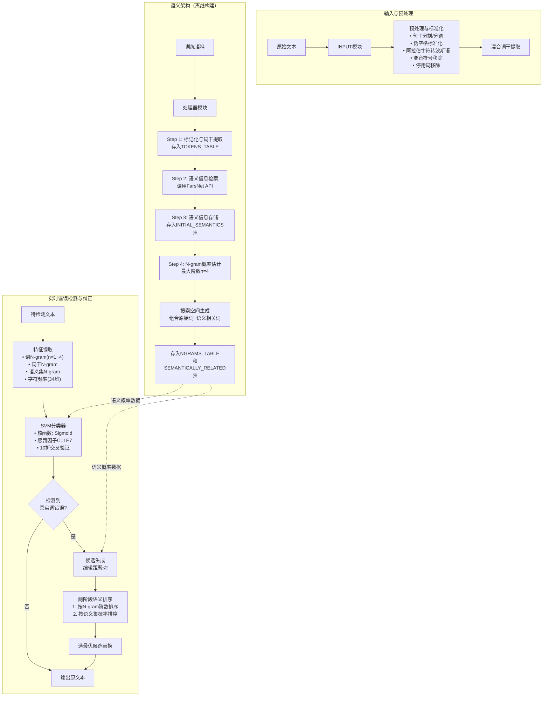

# **Automatic Real-word Error Correction in Persian Text**

---
## **作者信息**

| 作者 | 机构 | 身份/背景 | 领域大牛认定 |
|------|------|----------|-------------|
| Amid Khatibi Bardsiri（通讯作者）| 伊斯兰阿扎德大学克尔曼分校，计算机工程系 | 副教授/研究员 | 伊朗国内波斯语NLP领域活跃研究者，但尚未达到国际"大牛"层级 |
| 其他作者 | 伊斯兰阿扎德大学克尔曼分校，电气工程系 | 研究人员 | - |

## **团队相关信息**：
该团队为**伊朗伊斯兰阿扎德大学克尔曼分校的计算语言学与自然语言处理研究组**，由计算机工程与电气工程系交叉合作完成。通讯作者Amid Khatibi Bardsiri在波斯语拼写纠正、语义相似度计算等领域有持续产出，是**伊朗国内波斯语NLP领域的中坚力量**，但尚未达到国际知名学者或顶会最佳论文级别。

---

## **论文发表时间**

| 项目 | 具体日期 | 来源/说明 |
|------|---------|----------|
| 公开发布 | 2024年 | 期刊正式发表 |
| 出版状态 | 已正式发表 | 期刊论文，非预印本 |

---

## **摘要**

自动拼写纠正是自然语言处理（NLP）中的关键挑战之一。传统拼写纠正技术通常只能检测和纠正非词错误（如打字错误和拼写错误），而上下文敏感的真实词错误——即那些本身拼写正确但在特定上下文中使用错误的词——检测难度更大。波斯语因其丰富的形态学和复杂的句法，给自动拼写纠正系统带来了巨大挑战，加之波斯语语言资源的有限性，使得训练有效的拼写纠正模型更加困难。

本文提出了一种用于波斯语文本真实词错误精准高效纠正的前沿方法，采用**结构化的多层方法**，结合**语义分析、特征选择和高级分类器**来提升错误检测与纠正效果。该架构能够发现并存储波斯语词序列间的语义相似性，分类器精准识别真实词错误，语义排序算法结合上下文、语义相似度和编辑距离等特征确定最优纠正候选。

**核心指标**：检测阶段F1值达 **96.6%**，纠正阶段准确率达 **99.1%**。

---

## **一、这篇论文讲了一个什么样的故事？**

波斯语文本中的真实词错误（Real-word Error）自动纠正，其故事脉络如下：

**背景**：拼写纠正软件是文本处理环境的基本组件，但传统方法只能处理"非词错误"（即词典中不存在的词）。而"真实词错误"指的是那些拼写本身正确、却是用户在特定上下文中"用错了"的词（例如，英文中将"there"误用为"their"）。这类错误占所有拼写错误的25%-40%，在波斯语中因其丰富的同音词（homophony）、多义词（polysemy）和异形词（heterography）而尤为复杂。

**问题**：波斯语面临**三重困境**：(1) 缺乏带真实词错误标注的语料库；(2) 语言特性复杂（伪空格、自由语序、字符歧义、形态丰富）；(3) 现有方法多基于统计语言模型或规则，难以应对上下文语义模糊性。

**动机**：现有波斯语拼写纠正研究主要聚焦非词错误，真实词错误检测与自动纠正的研究仍处于初级阶段。传统N-gram方法在处理多距离错误、高错误密度时性能衰减严重。

**核心贡献**：本文构建了一套**语义架构**——通过FarsNet（波斯语WordNet）获取词间语义关系，构建语义知识图谱，结合SVM分类器检测错误，再通过**语义排序算法**从候选词中选出最优纠正结果。该方法在不依赖预定义混淆集（confusion set）的前提下，实现了检测F1=96.6%、纠正准确率=99.1%的SOTA结果。

---

## **二、本文的核心思想和创新点**

### 1. 核心思想

**"语义为王"——真实词错误纠正不应只依赖N-gram统计或编辑距离，而应深入理解词序列在上下文中的语义关系。**

论文的核心假设是：真实词错误所生成的错误词虽然拼写正确，但其与上下文中其他词的**语义相似度**会显著偏离正确词序列。因此，通过构建**词序列的语义网络**，将N-gram概率与FarsNet中的语义关系（同义、上下位、反义、部分-整体等）深度融合，可以实现对真实词错误的高精度检测与纠正。

### 2. 关键创新点

| 序号 | 创新点 | 说明 |
|------|--------|------|
| **1** | **四层语义架构** | 设计了包含数据层、网络层、信息层、处理层的语义架构，实现语义关系的自动发现、存储与复用，避免了实时调用FarsNet API的低效问题 |
| **2** | **不依赖混淆集的通用框架** | 现有波斯语真实词纠正方法（如Vafa、Perspell）均依赖预定义混淆集，本文方法通过编辑距离+语义排序生成候选集，覆盖面更广 |
| **3** | **语义集概率的提出** | 对词序列的"语义版本"（即同义词/相关词替换后的序列）也计算概率，并将该概率累加回原词序列，形成"语义增强"的N-gram概率估计 |
| **4** | **两阶段排序算法** | 先按N-gram阶数（4-gram > 3-gram > 2-gram > 1-gram）筛选候选，再在同一阶内按语义集概率排序，实现精准纠正 |
| **5** | **支持编辑距离2的错误** | 首次在波斯语真实词错误纠正中系统性地处理编辑距离≤2的错误（此前工作几乎全部限于距离1），且混合距离场景下仍保持高准确率 |

---

## **三、方法是怎么实现的？(How does it work?)**

### 1. 架构

本系统采用**五模块离线-在线混合架构**，分为预处理与语义网络构建（离线）和错误检测与纠正（在线）两个阶段：



**图注**：参考论文 **Figure 1（系统逻辑架构）**、**Figure 2（语义网络四层架构）** 及 **Section 4.5（搜索空间生成流程）** 综合绘制。

---

### 2. 关键算法

#### 算法1：错误生成（训练数据构建）

由于波斯语缺乏真实词错误标注语料，本文采用**人工注入错误**的方式构建训练集：

```
输入: 纯净波斯语文本P, 错误密度E(10%-55%), 距离1比例D1
输出: 含注入错误的语料EP

1. 识别所有句子边界 s1, s2, ..., sN
2. 随机选择 N*E 个句子作为错误注入目标
3. 从RL中按D1比例划分RL1(距离1错误)和RL2(距离2错误)
4. 对每个目标句子:
   a. 随机选择一个词w作为目标词
   b. 在词典中查找与w的Damerau-Levenshtein距离≤2的所有词
   c. 随机选择一个替换词w'（确保w'≠w）
   d. 若句子属于RL1则用距离1的词替换，否则用距离2的词
```

#### 算法2：两阶段语义排序（错误纠正核心）

```
输入: 含真实词错误的句子S, 错误位置j, 编辑距离ED
输出: 纠正后的句子S'

1. 根据ED生成候选集Ct（词典中所有与错误词距离≤ED的词）
2. 对每个候选c∈Ct，提取词干c'_f，加入候选列表Cf
3. 对每个c'_f∈Cf:
   a. 将错误词替换为c'_f，得到变换句S'
   b. 对S'运行固定窗口，获取包含c'_f的所有N-gram
   c. 从NGRAMS_TABLE中查找与c'_f相关的最高阶N-gram(HRN)
4. 第一阶段排序: 按N-gram阶数降序排列候选
5. 第二阶段排序: 对同阶候选，从SEMANTICALLY_RELATED表中
   获取语义集概率值，取最大值者
6. 返回概率最高的候选作为纠正结果
```

---

### 3. 关键公式

**公式1：N-gram概率估计（基于马尔可夫链）**

$$P(w_1, w_2, ..., w_n) = \prod_{i=1}^{n} P(w_i | w_{i-n+1}, ..., w_{i-1})$$

**公式2：语义集概率计算**

$$P_{semantic}(CS_i) = \sum_{i=1}^{N} \frac{\exp(\log(P(CS_i)))}{i}$$

其中 $CS_i$ 为搜索空间 $C(S')$ 中第 $i$ 个词序列（原始词或其语义相关词的组合），语义概率通过对所有语义变体的概率取平均（实际采用指数-对数平均）获得。

**公式3：评价指标值计算**

$$F_1 = 2 \times \frac{Precision \times Recall}{Precision + Recall}$$

$$Precision = \frac{TP}{TP + FP}$$

$$Recall = \frac{TP}{TP + FN}$$


---

## **四、实验效果 (Experimental Results)**

### 1. 实验设置

| 项目 | 详情 |
|------|------|
| **语料库** | Hamshahri语料库v2（166,774篇文章，1996-2002年波斯语报纸新闻）|
| **数据集划分** | Set1（103,840句/349.7万词）、Set2（86,035句）、Set3（57,638句）、Set4（123,512句/654.6万词，最大）|
| **训练集** | 从Set1随机抽取20,000句注入真实词错误 |
| **错误密度** | 10%-55%（句子级），以10%和50%为主要评估点 |
| **编辑距离** | Damerau-Levenshtein，混合距离（80%距离1 + 20%距离2）|
| **分类器** | SVM（线性/RBF/Sigmoid核），10折交叉验证，C=1E7 |
| **基线模型** | Perspell（Dastgheib等，2017）和Vafa Spell-checker（Faili等，2016）|
| **实现语言** | Java（Weka用于机器学习，jhazm用于预处理，FarsNet用于语义）|

---

### 2. 主要结果

**检测任务（表4，三数据集平均）：**

| 模型 | 错误密度10% | 错误密度50% |
|------|-----------|-----------|
| **本文方法** | **F1=0.962（平均）** | **F1=0.956（平均）** |
| Perspell | F1≈0.618 | F1≈0.576 |
| Vafa | F1≈0.146 | F1≈0.129 |

**纠正任务（表5，三数据集平均）：**

| 模型 | 错误密度10% | 错误密度50% |
|------|-----------|-----------|
| **本文方法** | **F1=0.955（平均）** | **F1=0.935（平均）** |
| Perspell | F1≈0.311 | F1≈0.275 |
| Vafa | F1≈0.281 | F1≈0.250 |

**核心结论**：
- **本文方法在检测和纠正任务上均大幅超越基线**，检测F1平均比最佳基线（Perspell）高出约34个百分点。
- **Vafa Spell-checker几乎完全失效**（F1<0.16），表明基于预定义混淆集的方法在真实词错误检测上存在根本性缺陷。
- **错误密度从10%升至50%时**，本文方法检测F1仅下降约0.6个百分点，而Perspell下降约4个百分点——证明本文方法对噪声高度鲁棒。
- **混合距离场景下**，本文对距离2错误的纠正F1仍可达0.91-0.93，而基线模型普遍低于0.30。

---

### 3. 消融实验与关键发现

| 实验维度 | 关键发现 |
|---------|----------|
| **词干提取** | 混合词干提取器显著优于无词干提取；Sigmoid核+C=1E7为最优配置 |
| **语义集的作用** | 应用语义集后，Sigmoid核的检测F1从0.926提升至**0.965**（+3.9%）；纠正F1从0.912提升至**0.953**（+4.1%）|
| **N-gram阶数** | 线性核在n=3最优（F1=0.889）；RBF/Sigmoid核在n=4最优（F1≈0.93）|
| **语义集阶数** | 线性核在order=3最优（F1=0.918）；RBF在order=4最优（F1=0.955）；Sigmoid在order=4-5最优（F1=0.965）|
| **PCA降维** | 使用PCA反而降低性能（可能因消除了关键特征）|
| **停用词** | 停用词移除略微降低性能（因停用词在N-gram中也有上下文价值）|
| **错误密度鲁棒性** | 非线性核（RBF/Sigmoid）在E=55%时性能几乎不变；线性核随E升高显著下降 |
| **编辑距离混合** | 无语义集时混合距离纠正F1为0.912；有语义集时提升至**0.954**（+4.2%）|

**实验部分总结**：
本文通过**四组数据集、两套错误密度、两种编辑距离配置**的全面评估，结合与两个基线模型的对比，**系统性地验证了语义架构在波斯语真实词错误检测与纠正中的核心价值**，揭示了语义信息在提升模型鲁棒性和精度的关键作用。

---

## **五、优点与局限性**

### ✅ 1. 优点

1. **SOTA性能**：检测F1=96.6%、纠正准确率=99.1%，显著优于现有波斯语真实词错误纠正系统（Perspell F1≈0.62，Vafa F1≈0.15）。
2. **无需预定义混淆集**：以往方法（Vafa、Perspell）均依赖人工构建的混淆集，本文通过编辑距离+语义排序动态生成候选，覆盖面更广、泛化能力更强。
3. **支持多距离错误**：首次在波斯语中系统处理编辑距离≤2的真实词错误，且混合距离下性能稳定（F1≈0.95）。
4. **对高噪声鲁棒**：错误密度从10%升至50%时，性能下降<1%，远优于基线（下降约4%）。
5. **语义网络的可复用设计**：离线构建的语义网络存储N-gram与语义关系，在线调用低延迟，具备工程实用性。
6. **跨领域验证**：在4个不同规模/题材的数据集上验证，结果一致。

---

### ⚠️ 2. 局限性（研究边界与待解问题）

1. **错误生成方式存在偏差**：采用人工注入错误（而非真实错误语料）可能导致"生成的错误"与"真实错误"分布不一致。论文自承：当注入的错误词在语义上与上下文相关时，模型更易误判——因为错误词反而获得了比原词更高的N-gram/语义概率。
2. **仅处理单错误句子**：沿用领域惯例，每个句子仅注入一个真实词错误。现实中多个真实词错误共现的情况未予考虑。
3. **未覆盖非词错误与语法错误**：模型专门针对真实词错误设计，无法处理拼写错误的非词错误或句法/语法错误。
4. **未利用键盘/语音相似性**：候选排序仅依赖编辑距离、N-gram和语义概率，未考虑键盘按键距离（如波斯语中相近键位导致的打字错误）或发音相似性（同音词错误的典型来源）。
5. **资源依赖性强**：依赖FarsNet（波斯语WordNet）和Hamshahri语料库，这些资源本身的质量和覆盖率直接影响模型效果。
6. **评估数据集为新闻文本**：Hamshahri为报纸新闻语料，模型在社交媒体、口语化文本等非正式场景下的表现未验证。
7. **基线模型复现不确定性**：论文未能复现Shamsfard（2011）宣称的F1=0.726，且对基线模型的"优化修改"（如将Perspell改为自动纠正而非候选建议）可能改变了基线的原始设计意图。

---

## **六、其他**

### 第一性原理

本文的第一性原理可以表述为：

> **真实词错误纠正的本质不是"词典查找"或"统计预测"，而是"语义一致性恢复"。**
>
> 一个词在特定上下文中是否"正确"，本质上取决于它与其他词构成的**语义图是否连贯**。传统方法（N-gram、混淆集、编辑距离）都是对语义连贯性的**间接近似**——N-gram统计的是共现频率（而非语义），混淆集依赖人工预定义（而非自动发现），编辑距离基于字符形态（而非意义）。
>
> 本文直接建模语义关系：通过FarsNet获取词的**概念层级结构**（同义、上下位、反义、部分-整体），将词序列替换为其语义相关版本后重新计算概率，从而实现从"频率近似"到"语义直接建模"的本质跃迁。

---

### 领域空白

| 空白维度 | 描述 |
|---------|------|
| **资源稀缺** | 波斯语作为低资源语言，缺乏大规模标注的真实词错误语料库。本文被迫采用人工注入错误的方式，这是领域的共同困境 |
| **真实词错误研究滞后** | 波斯语NLP对非词错误纠正已有较成熟工作（如Virastyar、Vafa的非词模块），但真实词错误的系统性研究始于2010年代中后期，相关工作极少 |
| **混淆集依赖困境** | 现有波斯语真实词纠正工作（Vafa、Perspell）均依赖预定义混淆集，但混淆集无法穷举所有可能的真实词错误对，且维护成本高 |
| **多错误共现处理空白** | 此前无工作处理波斯语句子中多个真实词错误的共现情况 |
| **深度学习应用空白** | 本文将SVM+语义网络推至SOTA，但尚未引入深度学习（如BERT的波斯语变体ParsBERT、Transformers），该方向为明显的研究空隙 |
| **跨语言迁移空白** | 波斯语与阿拉伯语共享文字但语法差异大，能否从中高资源语言（阿拉伯语、英语）迁移拼写纠正知识尚待探索 |
| **端到端评估缺失** | 现有评估均在"注入-检测-纠正"的闭环内进行，缺乏在真实OCR/ASR输出上的端到端评估 |

---

> **一句话总结**：本文通过**将语义网络的深度集成引入传统机器学习框架**，在不依赖深度学习的前提下将波斯语真实词错误纠正推至SOTA，同时也为后续深度学习方法的介入留下了清晰可量化的基线。

---

> *以上由 DeepSeek AI 生成*