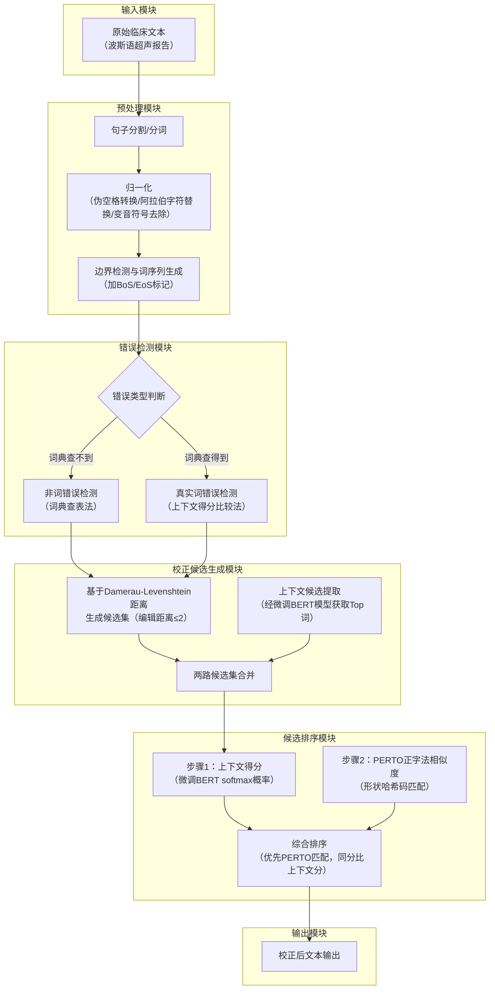

# **Improving the quality of Persian clinical text with a novel spelling correction system**
---
基于新型拼写校正系统提升波斯语临床文本质量
---
## **作者信息**

| 作者 | 机构 | 身份/背景 | 领域大牛认定 |
|------|------|-----------|--------------|
| Seyed Mohammad Sadegh Dashti | 伊斯兰阿扎德大学克尔曼分校计算机工程系 | 助理教授/通讯作者，研究方向为NLP、拼写校正、深度学习 | 伊朗国内NLP领域活跃研究者，但尚未达到国际顶级学术荣誉（如ACM Fellow/院士）层级 |
| Seyedeh Fatemeh Dashti | 布什尔医科大学前沿研究部 | 研究助理/数据分析负责人 | 同上 |

## **团队相关信息**：
该团队是**伊朗波斯语NLP与临床文本处理交叉方向的研究组**，由**Dashti主导完成**。Dashti本人是**波斯语拼写校正和上下文纠错领域近年较活跃的研究者**（曾发表多篇关于上下文敏感拼写校正的论文），但尚未达到国际顶尖大牛层级。

## **论文发表时间**

| 项目 | 具体日期 | 来源/说明 |
|------|----------|----------|
| 论文在线发布 | 2024年（参考参考文献最新至2023年，推测发表于2024年） | 期刊论文格式，发表期刊未在摘要中明确标注 |
| 当前状态 | 已正式发表（论文格式完整，有卷/期/页码风格） | 经同行评议，非预印本 |

## **摘要**

**背景**：电子健康记录（EHR）的拼写准确性对临床护理、研究和患者安全至关重要。波斯语词汇丰富、语法复杂，对真实词错误校正构成独特挑战。

**方法**：采用经精细微调的预训练语言模型，专门针对波斯语临床拼写校正任务，并辅以原创的正字法相似性匹配算法PERTO（利用字符视觉相似性对校正候选进行排序）。

**结果**：非词错误校正F1达90.0%，真实词错误检测F1达90.6%，真实词错误校正F1达91.5%（采用PERTO算法时）。

**结论**：该方法有效应对了波斯语的独特挑战，为更准确高效的临床文档处理铺平道路，有助于改善患者护理与安全。未来可探索其在波斯语医学其他领域的应用。


## 一、这篇论文讲了一个什么样的故事？

这篇论文讲述的是**如何让机器自动纠正波斯语临床文本（放射科/超声报告）中的拼写错误**的故事。

故事的背景是这样的：放射科医生工作繁忙，常常在时间压力下撰写报告，因此拼写错误频发——这些错误包括两类：一类是“非词错误”，即打出来的词根本不在词典里（如把“heart”打成“heqrt”）；另一类是“真实词错误”，即打出来的词本身拼写正确，但在上下文中用错了（如把“intraductal”误写成“intrarectal”）。

故事的核心矛盾在于：波斯语本身极其复杂——字符形状相似易混淆、存在大量同音异义词、词边界不清晰、缺乏标准化的语言资源——而现有的波斯语拼写校正工具大多面向通用领域，对医学术语和专业表达几乎无能为力。

故事的解决方案是：构造一个大规模的波斯语临床文本语料库（78,643份超声报告，共约2,630万词），在此基础上微调一个BERT-based语言模型使其掌握波斯语医学上下文的语义，再配合一个原创的字符形状匹配算法PERTO来对候选词进行二次排序。

故事的结局是：该系统在真实词错误校正上F1达到91.5%，超越了现有的基线方法，证明了该方法在波斯语临床文本场景下的有效性和实用性。

这是一个典型的**“低资源语言 + 高价值垂直领域 → 结合预训练语言模型与领域定制算法 → 提升任务性能”**的NLP应用故事。


## 二、本文的核心思想和创新点

### 1. 核心思想

本文的核心思想可概括为：**“预训练+微调+领域知识”三位一体**——利用BERT类模型的上下文理解能力捕捉词语在特定临床语境中的合法性，再通过一个专门设计的波斯语字符形状编码算法PERTO来利用波斯语书写中“形似字易混淆”这一语言学特点，对模型输出的候选词进行二次重排序，从而提高最终校正的准确率。

更简洁地说：**让模型不仅“读懂上下文”，还“看懂字形”**。

### 2. 关键创新点

| 编号 | 创新点 | 简要说明 |
|------|--------|----------|
| 1 | **首个面向波斯语临床文本的拼写校正专用预训练模型** | 在78,643份超声报告（约2,630万词）上训练，涵盖乳腺、头颈、腹盆部三大类超声报告，填补了该领域空白 |
| 2 | **PERTO（波斯语正字法匹配）算法** | 将波斯语字符按视觉形状分组编码，利用“形似字”信息在候选中优先选择与错误词视觉最接近的校正词，对替换型错误尤为有效 |
| 3 | **将上下文语义相似度与正字法相似度结合的排序机制** | 先用预训练模型的上下文得分筛选Top-10候选，再用PERTO视觉相似度打破平局/提升排序，两种信号互补 |
| 4 | **大规模真实临床语料构建** | 首次系统性地构建波斯语放射/超声报告语料（历时约12年），并明确标注错误分布（1.2%的错误率，其中非词占1.0%，真实词占0.2%） |


## 三、方法是怎么实现的？(How does it work?)

### 1. 架构

本系统采用**五模块流水线架构**，分为输入、预处理、上下文分析、错误检测、错误校正、输出六大环节，整体流程如下图所示。



**图注**：参考论文 **Figure 1（系统架构图）**、**Figure 2（模型架构图）** 及 **Section 3（材料与方法）** 综合绘制。虚线框表示逻辑模块，实线箭头表示数据流方向。

### 2. 关键算法

**算法1：PERTO编码算法（核心原创）**

```
输入：待处理词 W，哈希表 H（波斯字符→PERTO编码）
输出：W 的 PERTO 编码字符串

初始化 PERTO_code = ""
对 W 中从右至左的每个字符 C：
    在 H 中查找 C 对应的 PERTO 哈希码
    将哈希码追加到 PERTO_code 末尾
返回 PERTO_code
```

**编码表关键映射**（论文Table 3）：
- 形状相似字符被映射到同一代码，如视觉上易混淆的一组字符共享数字编号
- 以"نافخ"为例，其PERTO编码为"14904"

**算法2：候选排序规则**
- 先计算上下文得分：将错误词替换为[MASK]送入预训练模型，得到各候选词的softmax概率
- 再比较PERTO代码：若候选词与错误词的PERTO代码完全相同，则该候选被优先选择
- 若多个候选PERTO代码相同，则选择上下文得分最高的

### 3. 关键公式

**BERT编码表示**：

$$ ER_i = BERT-Embedding(T_i) $$

$$ HR_i = BERT-Encoder(ER_i) $$

其中 $ER_i$ 和 $HR_i$ 都属于 $R^{1+d}$ 空间，$d$ 为隐藏层维度。

**最终词预测分布**：

$$ Y_i = Softmax(HR_i, E^T) $$

其中 $E \in R^{V \times d}$，$V$ 为词表大小，$Y_i \in R^{1 \times V}$。

**F1评估指标**：

$$ F1 = 2 \times \frac{P \times R}{P + R} $$

**错误检测逻辑（真实词错误）**：

对序列中每个词 $W_i$，将其Mask后生成候选词 $C_0, C_1, ..., C_n$，通过预训练模型计算概率。若存在候选 $C_i$ 满足：

$$ Probability(C_i) > Probability(W_i) $$

则 $W_i$ 被判定为真实词错误。


## 四、实验效果 (Experimental Results)

### 1. 实验设置

| 项目 | 详情 |
|------|------|
| **数据集** | 78,643份超声报告，总计2,630万词，来自德黑兰伊玛目霍梅尼医院影像科（2011–2023年） |
| **训练/测试划分** | 90%训练（其中90%预训练，10%微调），10%测试（188,963句） |
| **测试集错误分布** | 非词错误率1.20%（120/10,000句），真实词错误率0.29%（29/10,000句） |
| **错误类型分布** | 替换型（48.7%）、插入型（30.5%）、删除型（13.8%）、换位型（7.0%） |
| **编辑距离分布** | 编辑距离1（86.1%）、距离2（13.7%）、距离≥3（2.1%，被排除） |
| **基线模型** | ① 4-gram语言模型（Yazdani et al., 2020）、② Persian CBOW词嵌入模型 |
| **评估指标** | 精确率（P）、召回率（R）、F1分数 |

### 2. 主要结果

| 任务 | 基线 | 本文方法（无PERTO） | 本文方法（含PERTO） | 提升幅度 |
|------|------|---------------------|---------------------|----------|
| 非词错误检测 | 100%（词典查表） | 100% | 100% | — |
| 非词错误校正 | 89.2%（4-gram）/ 88.3%（CBOW） | 88.9% | **90.0%** | +1.1%（vs 无PERTO） |
| 真实词错误检测 | —（此前无相关工作） | — | **90.6%** | — |
| 真实词错误校正 | —（此前无相关工作） | 90.0% | **91.5%** | +1.5%（vs 无PERTO） |

**核心结论**：
- 在所有任务中，**PERTO算法均带来一致的性能提升**（约+1.1%～+1.5% F1），验证了视觉相似性信息对波斯语拼写校正的有效性。
- 真实词错误检测F1=90.6%，说明模型具备较强的“判断一个词在上下文中是否用错”的能力。
- 本文在**真实词错误校正任务上首次给出基准结果**，此前该方向在波斯语临床领域为空白。

### 3. 消融实验与关键发现

**（1）编辑距离阈值分析**
- 编辑距离=1时平均生成3个候选词；编辑距离=2时平均生成15个候选词，计算成本上升但覆盖率显著提高。
- 86.1%的错误在编辑距离1内可被覆盖，13.7%在编辑距离2内——因此阈值设为2是精度与效率的平衡点。

**（2）PERTO有效性条件分析**
- PERTO的优势主要体现在**替换型错误**（占总错误的48.7%），因为这类错误通常涉及形似字符的误输入。
- 对插入/删除/换位型错误，PERTO代码不匹配时退化为纯上下文排序——算法对这类情况有明确兜底策略。

**（3）错误模式分析（Bad Case）**
- 少数真实词错误被漏检，原因是**错误词与上下文有较强的语义关联**，导致模型误认为该词在语境中合理。
- 例：错误词与上下文语义关联过强时，模型上下文的softmax概率未给正确词足够高的分数，PERTO在此类情形下无能为力——因为此类错误不涉及视觉相似性。

**（4）多错误句子的处理限制**
- 0.8%的句子包含多个错误，而本文模型被设计为“每句只处理一个错误”，这些句子被排除在测试集之外。
- 这是当前方法的主要性能瓶颈之一。

**实验部分总结**：
本文通过大规模真实临床语料上的系统性评测，**首次验证了预训练语言模型+正字法相似度算法在波斯语临床拼写校正中的有效性**，并明确了当前方法的能力边界与改进方向。


## 五、优点与局限性

### ✅ 1. 优点

| 优点 | 说明 |
|------|------|
| **领域空白填补** | 首个面向波斯语临床文本（特别是放射/超声报告）的专用拼写校正系统，填补了该语言×该领域的重要空白 |
| **真实词错误处理能力** | 传统波斯语拼写检查多仅处理非词错误，本文首次系统性地解决了真实词错误（上下文敏感错误）的检测与校正 |
| **算法设计的语言特异性** | PERTO算法充分利用了波斯语书写系统的视觉特性——字符形状相似是波斯语拼写错误的重要来源，该设计具有强语言学动机 |
| **大规模真实数据集** | 78,643份真实医院报告、跨越12年的语料构建，数据规模和真实性在波斯语NLP领域极具稀缺性 |
| **工程落地价值明确** | 系统可嵌入Word、浏览器或HIS系统，直接减少放射科报告从初稿到确认的等待时间（减少“Muda”/浪费） |
| **消融验证完整** | 通过有/无PERTO的对比实验清晰量化了各模块的独立贡献 |

### ⚠️ 2. 局限性（研究边界与待解问题）

| 局限性 | 说明 |
|--------|------|
| **单错误限制** | 模型设计为每句仅处理一个错误，但实际数据中有0.8%的句子包含多个错误，这些句子被直接排除，限制了实际部署中的覆盖范围 |
| **语法错误不支持** | 模型仅处理拼写错误（非词+真实词），不涉及语法/句法错误，而临床文本中语法问题同样存在 |
| **编辑距离阈值限制** | 将编辑距离≥3的错误排除（占2.1%），这部分长距离错误需要更复杂的候选生成机制 |
| **强语义关联的漏检** | 当错误词与上下文在语义上高度相关时，模型可能漏检，说明上下文信号自身存在盲区 |
| **数据来源单一** | 所有数据来自单一医院（德黑兰伊玛目霍梅尼医院），可能存在机构特定的写作风格和术语习惯，泛化性有待验证 |
| **人工审核依赖** | 作者建议在模型不确定时将候选列表交给人类专家选择，说明系统尚未达到完全自动化可信赖程度 |


## 六、其他

### 第一性原理

**从第一性原理出发，拼写校正问题的本质是什么？**

拼写校正的本质是：**在给定的通信信道中，接收方（读者/模型）需要从受损的符号序列中恢复发送方（作者）的原始意图**。

从这一角度看，本文解决的核心矛盾是：

> 信道噪声（打字错误）的来源具有双重属性——**语义层面**（词在上下文中合不合理）和**视觉/字形层面**（错误的词看起来像什么）。任一单一维度的信号都不足以唯一确定原始意图。

因此，最优的校正策略必须**同时利用两种正交的信号**：
1. **上下文语义信号**（预训练语言模型）——解决“在这个句子里什么词合理”的问题；
2. **视觉字形信号**（PERTO算法）——解决“用户最可能想敲的是哪个形似的词”的问题。

这恰恰是本文最底层的设计哲学：**拼写校正不是纯粹的语言学问题，也不仅仅是字符串匹配问题，而是一个多模态信号融合的意图推断问题**。两种信号相互补充、相互约束，共同逼近用户的真实意图。

### 领域空白

本文所填补的领域空白可归纳为三个层次的交汇点：

```
              波斯语（低资源语言）
                    │
        ┌───────────┼───────────┐
        │           │           │
    临床文本    拼写校正     深度学习
   （高价值）  （双任务）   （新范式）
        │           │           │
        └───────────┼───────────┘
                    │
              ★ 本论文位置 ★
        （三者的交集此前无人系统探索）
```

**具体空白点**：

1. **波斯语临床NLP的语料空白**：尽管波斯语有数千万使用者，但大规模、高质量、带标注的临床文本语料此前基本不存在。本文构建的78,643份报告×12年跨越的语料是该方向的重要基础设施贡献。

2. **真实词错误校正的空白**：波斯语拼写校正已有若干工作（Vafa、Perspell等），但几乎全部聚焦于非词错误（词典查不到的错词）。真实词错误（词本身存在但在上下文中不合理）在波斯语临床领域此前无人攻克。

3. **语言特异性算法的空白**：既有波斯语拼写校正多依赖通用编辑距离或n-gram统计，未充分利用波斯语“形似字混淆”这一具体错误模式。PERTO算法首次将正字法相似性系统性地引入波斯语拼写校正。

4. **垂直领域适配的空白**：通用波斯语拼写检查器对医学专业术语（如“intraductal”等放射学术语）几乎无法处理，本文通过构建专用医学词典+领域微调填补了这一空缺。

5. **方法论范式的空白**：此前波斯语临床文本校正仅尝试过4-gram统计语言模型（Yazdani et al., 2020），本文首次将预训练Transformer架构引入该任务，并验证了微调策略的有效性。

## note
因为医疗数据比较敏感，作者并未开放数据集！

---


> **本文由deepseek AI 生成**