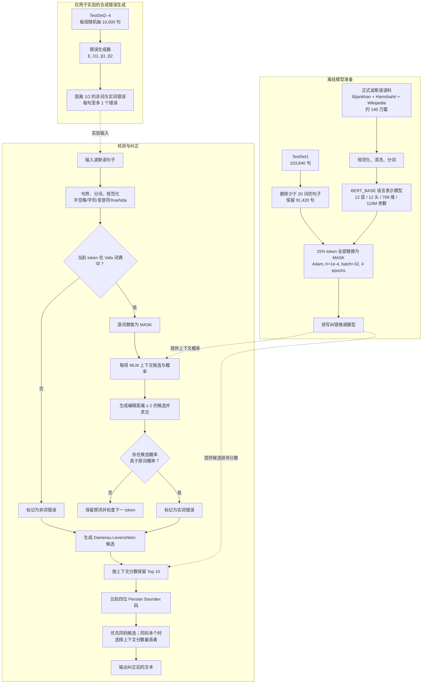

# PERCORE：融合上下文深度表示与波斯语音系分析的拼写纠错框架

> 原文：*PERCORE: A Deep Learning-Based Framework for Persian Spelling Correction with Phonetic Analysis*  
> 类型：应用型 NLP / 拼写纠错系统 / 实证研究  
> 阅读日期：2026-07-26  
> [Springer 正式版本](https://link.springer.com/article/10.1007/s44196-024-00459-y)｜[DOI](https://doi.org/10.1007/s44196-024-00459-y)

---

## **作者信息**

| 作者 | 机构 | 身份/背景 | 领域大牛认定 |
|---|---|---|---|
| Seyed Mohammad Sadegh Dashti | 伊斯兰阿扎德大学克尔曼分校，计算机工程系 | 第一作者。公开论文记录显示，其研究主线长期集中于上下文敏感、实词错误及波斯语拼写纠错；2018 年已发表实词纠错相关论文。本论文未写明其职称，作者顺序只能说明其很可能是主要执行者，不能据此断言其为博士生或教师。 | 可认定为**波斯语实词拼写纠错的专门研究者**，但公开证据不足以支持“国际顶级 NLP 大牛”判断。Semantic Scholar 作者条目在查询时约为 5 篇论文、34 次引用、h-index 3，且自动消歧可能有误，仅供参考。 |
| Amid Khatibi Bardsiri | 伊斯兰阿扎德大学克尔曼分校，计算机工程系 | 通讯作者。公开个人页面标注为计算机工程副教授，研究覆盖机器学习、数据挖掘、优化、软件工程等；与第一作者至少自 2017/2018 年起合作研究实词拼写纠错。 | 是本团队中较资深的 PI/指导者。Semantic Scholar 查询约为 48 篇、611 次引用、h-index 14；尚无院士、ACM/IEEE Fellow 或国际顶级 NLP 学术带头人等证据，故更适合称为**区域性应用 AI 学者**，而非“领域巨擘”。 |
| Mehdi Jafari Shahbazzadeh | 伊斯兰阿扎德大学克尔曼分校，电气工程系 | 合作者。公开资料显示拥有博士学位，研究背景偏信号/图像处理、生物医学图像、人工智能和电气工程，为项目提供跨领域工程与机器学习经验。 | 属于**跨学科工程与 AI 合作者**，并非以波斯语 NLP 闻名的国际权威。Semantic Scholar 查询约为 26 篇、147 次引用、h-index 8；同样需考虑自动作者消歧误差。 |

作者机构、作者顺序和通讯作者由论文首页及 [Springer 作者信息](https://link.springer.com/article/10.1007/s44196-024-00459-y)确认；职称与研究方向参考公开的 [Amid Khatibi Bardsiri 个人页面](https://www.researchgate.net/profile/Amid-Khatibi-Bardsiri)和 [Mehdi Jafari Shahbazzadeh 个人页面](https://www.researchgate.net/profile/Mehdi-Jafari-Shahbazzadeh)。论文只声明“三位作者均实质参与研究构思、设计、写作和审阅”，没有公布 CRediT 分工，因此更细的角色划分均应视为谨慎推断。

## **团队相关信息：**

该团队更像是**伊斯兰阿扎德大学克尔曼分校内部的应用 AI/NLP 合作小组**：第一作者提供波斯语实词拼写纠错的连续研究积累，通讯作者提供机器学习与计算机工程指导，第三作者提供信号处理和工程 AI 背景。它不是公开意义上的国际顶级 NLP 实验室，也没有“院士/Fellow 带队”的证据；但在**波斯语这一低资源语言的拼写纠错细分方向**，团队具有持续工作积累。最准确的评价是：**细分问题经验较强、国际学术影响仍有限的区域性研究团队**。

## **论文发表时间**

| 项目 | 具体日期 | 来源/说明 |
|---|---:|---|
| 投稿（Received） | 2023-12-13 | 论文首页；Springer 元数据 |
| 接收（Accepted） | 2024-03-12 | 论文首页；Springer 元数据 |
| 正式在线发表 | 2024-05-08 | Springer “Published” 与 “Version of record” |
| arXiv 上传 | 2024-07-20 | [arXiv:2407.14789](https://arxiv.org/abs/2407.14789)，晚于期刊正式发表 |
| 期刊信息 | 2024 年，第 17 卷，文章号 114，23 页 | *International Journal of Computational Intelligence Systems*，Springer，开放获取，CC BY 4.0 |
| DOI | 10.1007/s44196-024-00459-y | [DOI 页面](https://doi.org/10.1007/s44196-024-00459-y) |
| 引用快照 | 8 次（Semantic Scholar）；7 次（Springer）；6 次（Crossref） | 查询于 2026-07-26。数据库覆盖范围不同，数字会变化；[Semantic Scholar API 条目](https://api.semanticscholar.org/graph/v1/paper/DOI:10.1007/s44196-024-00459-y?fields=title,year,citationCount)、[Springer 指标页](https://link.springer.com/article/10.1007/s44196-024-00459-y)、[Crossref 元数据](https://api.crossref.org/works/10.1007%2Fs44196-024-00459-y) |

该论文已经**正式同行评审并发表**，不是“双盲评审或修改阶段”。截至查询日已有约 6–8 次数据库可见引用，说明已有少量后续使用或讨论，但还不足以据此判断其已产生广泛学术影响。

## **摘要**

本文提出 PERCORE，一个同时处理波斯语**非词错误**（错误形式不在词典中）与**实词错误**（词形合法但放在当前上下文中不合适）的混合拼写纠错框架。其核心是：先在约 140 万篇正式波斯语文档上构建 BERT_BASE 规模的语言表示模型，再以掩码语言建模方式针对拼写纠错进行微调；检测时，非词错误由词典查找识别，实词错误通过逐词掩码并比较候选词与原词的上下文概率识别；纠正时，再将 Damerau-Levenshtein 编辑距离、上下文概率和作者设计的四位波斯语 Soundex 语音编码结合起来排序候选词。

作者还提出一个可控制错误密度、编辑距离和错误类型比例的人工错误生成算法，以弥补波斯语真实错误语料不足。受控合成测试中，PERCORE 在实词错误检测、实词错误纠正和非词错误纠正上的最佳 F1 分别为 0.890、0.905 和 0.891。结果支持“上下文模型 + 语音先验”优于单纯上下文模型，但这些结论主要成立于**正式新闻域、单句最多一个人工错误、封闭词典**的实验条件下。

---

## 一、这篇论文讲了一个什么样的故事？

这篇论文的故事可以概括为：**波斯语拼写纠错不是一个单纯的字典查错问题，而是词法合法性、句子语义、键入扰动和语音混淆共同作用的问题；单一模型只看其中一层，因此需要混合证据。**

第一层困难是语言本身。波斯语使用源于阿拉伯字母的书写系统，存在阿拉伯/波斯字形变体、空格与半空格、附加符号、丰富词形变化和大量同音异形词。非词错误尚可通过词典发现，但“把一个合法词误写成另一个合法词”时，词典完全失效，只能依赖上下文。（论文 pp. 1–5）

第二层困难是资源。作者认为现有 ParsBERT 的训练数据含有大量评论和非正式文本，其中可能保留拼写错误，不够适合做“规范形式”的纠错模型。因此，他们把 Bijankhan、Hamshahri 和波斯语 Wikipedia 汇总成约 140 万篇正式文本，训练/微调一个 BERT_BASE 规模的波斯语表示模型。（论文 pp. 8–10）

第三层困难是评测。波斯语缺少规模足够、带真实错误及正确答案的公开语料，于是作者设计了一个“可控造错器”：给定错误密度 $E$、距离 1 错误比例 $D1$、非词/实词比例 $\beta_1,\beta_2$，在原句中人工注入 Damerau-Levenshtein 距离 1 或 2 的错误。（论文 pp. 6–7）

最后，作者提出一个组合解法：

1. 用词典判断“是不是一个词”；
2. 用 BERT 判断“这个词在句子里合不合理”；
3. 用编辑距离限定“用户可能怎样敲错”；
4. 用 Persian Soundex 判断“错误词与候选词是否读音相近”；
5. 将这些证据汇合，选出最可能的纠正词。

故事的高潮是：Soundex 确实带来稳定但不巨大的增益，约为 **1.2–1.3 个 F1 百分点**。因此，论文真正有价值的结论不是“深度学习全面解决了波斯语拼写纠错”，而是：**在低资源语言中，把语言特有的语音知识作为候选排序先验，能补足通用上下文模型。**

---

## 二、本文的核心思想和创新点

### 1. 核心思想

PERCORE 将纠错看成一个多约束候选选择问题：

- **词法约束**：观察词是否存在于参考词典；
- **字符扰动约束**：正确词与错误词的 Damerau-Levenshtein 距离应不超过 2；
- **上下文约束**：候选词放回句子后的条件概率应高；
- **语音约束**：同音或近音候选应得到优先；
- **规范化约束**：先统一半空格、阿拉伯/波斯字形、变音符号和 Kashida，减少表面噪声。

从贝叶斯角度看，它近似于经典噪声信道分解：
$$P(c\mid w_{\text{obs}},S)
\propto
P(w_{\text{obs}}\mid c)\,P(c\mid S)$$

其中：

- $P(c\mid S)$由掩码语言模型的上下文概率近似；
- $P(w_{\text{obs}}\mid c)$ 由编辑距离和 Soundex 语音相似性近似；
- 词典负责限定候选空间。

论文没有直接写出这一贝叶斯公式，但它是理解整个系统最清楚的第一性抽象。

### 2. 关键创新点

| 论文声称的贡献 | 具体内容 | 批判性判断 |
|---|---|---|
| General Persian Corpus | 汇总 Bijankhan、Hamshahri、波斯语 Wikipedia，约 140 万篇正式文档 | 对低资源语言有价值；但合并语料、清洗脚本和最终语料未公开，难以复现“高质量/无错误”主张 |
| 波斯语语言表示模型 | 采用 BERT_BASE：12 层、12 头、隐藏维 768、约 1.1 亿参数、最长 512 token；再用拼写纠错式 MLM 微调 | BERT 架构本身并不新；价值在语言和任务适配。预训练 tokenizer、词表、训练步数、硬件等关键信息缺失 |
| 可控错误生成算法 | 可控制错误密度、编辑距离 1/2 比例、非词/实词比例，并保证每句最多一个错误 | 工程上实用，便于压力测试；但合成错误不能替代真实用户错误，并会产生“语义上反而合理”的伪错误 |
| Persian Soundex | 将 32 个波斯文字母按读音分成 14 组，生成固定四位音码，作为候选排序依据 | 本文最清楚的语言特定创新；消融显示稳定约 1.2–1.3 个 F1 百分点增益 |
| 统一处理两类错误 | 同一框架覆盖非词检测/纠正和实词检测/纠正 | 属于系统整合贡献，不是全新的理论范式；检测逻辑仍是“词典 + MLM” |

严格来说，论文的主要新意不是某个全新深度网络，而是**将波斯语规范化、词典、编辑距离、任务化 BERT 和语音编码组织成一个可操作的端到端流程**。

---

## 三、方法是怎么实现的？(How does it work?)

### 1. 架构

论文 Figure 1 将系统画成六个经由 databus 交换信息的模块：INPUT、预处理/错误生成、上下文分析、错误检测、错误纠正和 OUTPUT。为了避免把“实验造错器”误认为线上纠错必需组件，下面将离线模型训练、合成评测和实际推理分开重画：

**图注**：依据论文 **Figure 1**（六模块系统，p. 5）、**Figure 2**（BERT_BASE 语言表示模型，p. 9）、**Pseudocode 1**（错误生成，p. 7）和 **Pseudocode 2**（实词检测，p. 12）综合重绘。虚线表示模型或合成评测数据向推理流程提供信息；真实部署不需要人为注入错误。

### 2. 关键算法

#### 2.1 预处理

预处理包括句子切分、tokenization、规范化和停用词处理。波斯语特定操作包括：

- 将应使用半空格的位置统一成 zero-width non-joiner；
- 将阿拉伯字形变体统一为波斯字形；
- 删除变音符号；
- 删除 Kashida 延长符；
- 借助 Dehkhoda 词典选择多字形词的规范形式。

这一步很重要，因为“字形不统一”和“真正拼写错误”若不先分开，词典查找会制造大量假阳性。（论文 p. 5）

#### 2.2 可控错误生成

输入为语料 $P$、句数 $N$、错误密度 $E$、距离 1 比例 $D1$、非词比例 $\beta_1$ 和实词比例 $\beta_2$。

1. 随机选择 $N E$ 个待造错句子；
2. 其中 $D1$ 比例注入距离 1 错误，其余 $1-D1$ 注入距离 2 错误；
3. 每个距离组再按 $\beta_1,\beta_2$ 分成非词和实词错误；
4. 每句随机选择一个可在 Vafa 词典中验证的原词；
5. 用插入、删除、替换或相邻字符转置生成目标距离的错误；
6. 每句最多一个错误。

候选/造错词典含 **1,095,959** 个词。论文报告编辑距离 1 平均约产生 5 个候选，距离 2 平均约产生 23 个候选，因此距离 2 的计算量和歧义都明显更高。（论文 pp. 6–7）

#### 2.3 非词错误检测

$$w_i\notin \mathcal L \Rightarrow w_i\text{ 为非词错误}$$

其中 $\mathcal L$ 是参考词典。论文实验中，所有方法都使用同一词典查找，因此非词检测 F1 被报告为 100%。这更准确地说是**封闭词典实验中的构造性结果**，并不代表面对人名、新词、外来词和领域术语时仍能达到 100%。（论文 pp. 10–11, 18）

#### 2.4 实词错误检测

对句中每个词依次执行：

1. 将当前词替换为 `[MASK]`；
2. 取得微调 BERT 的候选分布；
3. 从词典生成与原词 Damerau-Levenshtein 距离为 1 或 2 的候选；
4. 求编辑候选与 MLM 输出候选的交集；
5. 若任一候选上下文概率高于原词，则把原词标为实词错误；
6. 因实验假设每句最多一个错误，发现首个错误后立即停止并进入纠正。

可将其简写为：

$$\max_{c\in C_{\mathrm{DL}}(w_i)}
P_\theta(c\mid S_{\setminus i})
>
P_\theta(w_i\mid S_{\setminus i})
\Rightarrow
w_i\text{ 为实词错误}$$

这是对论文 Pseudocode 2 的等价抽象，不是作者另行提出的公式。（论文 pp. 11–12）

#### 2.5 候选纠正与 Persian Soundex

无论非词还是实词，纠正阶段都先生成距离不超过 2 的候选，再按 MLM 上下文分数保留 Top 10。随后比较错误词与候选词的 Persian Soundex 码：

- 码相同的候选优先；
- 若多个候选同码，选择上下文分数最高者；
- 若没有同码候选，论文没有完整写明所有回退细节，示例显示系统会继续依赖上下文分数。

Persian Soundex 将波斯文字母按发音分为 14 组，编码为 `0–9, A–D`，输出固定四位码；通常忽略元音。`ا`、`و`、`ی` 兼具元音/辅音功能，作者指出需要音节切分判断。主要音组包括：

| 码 | 同音/近音字母组 |
|---|---|
| 0 | س、ش、ث、ص |
| 1 | ط、ت、د |
| 2 | ذ、ظ、ض、ز、ژ |
| 3 | ج、چ |
| 4 | ه、ح及相关 heh 字形 |
| 5 | ق、ک、خ |
| 6 | ب、پ |
| 7 | گ、غ |
| 8 | ا、آ、ع |
| 9 | م、ن |
| A/B/C/D | ف / ل / و / ر |

论文没有完整说明相邻重复码如何处理、短词如何补位、长词如何截断，以及音节切分器如何实现，这是复现 Persian Soundex 的关键缺口。（论文 Table 2, p. 10）

### 3. 关键公式

#### 3.1 错误数量与组成

论文公式（1）的排版并不规范，其合理解释是：

$$\beta = N\times E,\qquad \beta_1+\beta_2\leq 1$$

其中 $\beta$ 是人工错误总数，$\beta_1,\beta_2$ 分别是非词与实词错误的比例系数。进一步可得：

$$\begin{aligned}
N_{\mathrm{dist}=1} &= \beta D1,\\
N_{\mathrm{dist}=2} &= \beta(1-D1),\\
N_{\mathrm{nonword}} &= \beta\beta_1,\\
N_{\mathrm{realword}} &= \beta\beta_2.
\end{aligned}$$

后四式是根据伪代码作出的清晰化重写。（论文 pp. 6–7）

#### 3.2 BERT 表示与词分布

$$ER_i=\mathrm{BERTEmbedding}(T_i)$$

$$HR_i=\mathrm{BERTEncoder}(ER_i)$$

$$Y_i=\mathrm{Softmax}(HR_iE^\top)$$

其中 $ER_i,HR_i\in\mathbb R^{1\times d}$，$E\in\mathbb R^{V\times d}$，$V$ 为词表大小，$Y_i\in\mathbb R^{1\times V}$ 是掩码位置上的词表概率分布。作者把与 $HR_i$ 最匹配的 token 作为候选输出。（论文公式 2–4，pp. 8–9）

#### 3.3 F1

$$F_1=2\frac{PR}{P+R}$$

论文定义了 Precision、Recall 和 F1，但结果表只给出 F1，没有给出各自的 P、R、置信区间或多次随机试验方差。（论文公式 5，p. 14）

#### 3.4 纠正目标的第一性重构

PERCORE 的启发式排序可近似写成：

$$
c^*=
\arg\max_{c\in C_{\mathrm{DL}}(w)}
\left[
\log P_\theta(c\mid S_{\setminus i})
+\lambda\mathbf 1\{\mathrm{SX}(c)=\mathrm{SX}(w)\}
\right]
$$

其中 $C_{\mathrm{DL}}$ 是编辑距离候选集，$\mathrm{SX}$ 是 Persian Soundex。论文实际上使用“Top 10 + 同码优先 + 上下文分数打破并列”的离散规则，并未训练或报告 $\lambda$；上式只是便于理解的统一表达。

---

## 四、实验效果 (Experimental Results)

### 1. 实验设置

#### 1.1 预训练/语言资源

| 语料 | 规模 | 用途 |
|---|---:|---|
| Bijankhan | 4,300 篇文章，约 260 万词 | 正式新闻与通用文本 |
| Hamshahri v2 | 323,616 篇新闻，82 个类别、65 个主题 | 预训练来源及保留集来源 |
| Persian Wikipedia | 1,160,676 篇文章，约 4.41 亿 token | 扩大正式波斯语覆盖 |

三者按文章数相加约为 149 万，作者概括为“140 万篇”。文中称这些文本经过规范化和清洗，但未给出最终 token 数、去重方法、错误率审计或公开下载位置。（论文 p. 8）

#### 1.2 四个 Hamshahri 保留集

| 数据集 | 文章数 | 句子数 | token 数 | 不同 token 数 |
|---|---:|---:|---:|---:|
| TestSet1 | 15,712 | 103,840 | 3,496,720 | 147,851 |
| TestSet2 | 6,204 | 86,035 | 3,191,898 | 155,964 |
| TestSet3 | 3,455 | 57,638 | 1,700,321 | 160,912 |
| TestSet4 | 69,008 | 123,512 | 6,546,136 | 183,473 |

共 94,379 篇保留文章。TestSet1 用于拼写任务微调与参数实验；最终比较从 TestSet2、3、4 各随机抽 10,000 句，共 30,000 句。论文正文一处把 TestSet4 的 6,546,136 写成“不同 token 数”，与 Table 4 不一致，应以表格中的“token 总数”为准。（论文 Table 4, pp. 12–15）

#### 1.3 模型与训练参数

| 项目 | 设置 |
|---|---|
| PERCORE 主干 | BERT_BASE：12 层、12 头、隐藏维 768、约 110M 参数、最长 512 token |
| 任务微调数据 | TestSet1 中长度至少 20 词的 91,420 句 |
| MLM 方案 | 随机选择 15% token，全部替换为 `[MASK]`；不 mask `[CLS]`、`[SEP]`；取消 BERT 原始方案中的随机词替换和保持不变分支 |
| 优化 | TensorFlow/Keras，Adam，学习率 $10^{-4}$，batch 32，4 epochs |
| 候选词典 | Vafa 词典，1,095,959 个词 |
| 合成错误 | $D1=0.8$；最终评估 $\beta_1=0.8,\beta_2=0.2$；$E=10\%$ 与 $50\%$；每句最多一个错误 |
| 参数曲线 | TestSet1 上另测 $E=10\%,20\%,30\%,40\%,50\%$，全部为实词错误 |
| 指标 | Precision、Recall、F1；结果表仅报告 F1 |

#### 1.4 对比基线

- Perspell：词典 + bigram + confusion sets/Persian WordNet；
- Yazdani et al.：加权双向 four-gram，限非词纠正；
- Persian CBOW：在同一约 140 万篇语料上训练，窗口 10、维度 300；
- Vafa Spell-checker：上下文、候选集合与 trigram，限实词任务；
- GPT-2.0：论文称在同一语料上预训练，并在 91,420 句上微调；学习率 $5\times10^{-5}$、batch 16、4 epochs；
- GPT-3.0：通过 OpenAI API、prompt/fine-tuning 处理；temperature 0.7、top-p 0.95，但具体模型快照、prompt 模板和实际 `max_tokens` 未完整报告。

### 2. 主要结果

#### 2.1 参数敏感性：TestSet1 实词错误检测

| 错误密度 $E$ | 距离 1 F1 | 距离 2 F1 | 总体 F1 |
|---:|---:|---:|---:|
| 10% | 0.891 | 0.853 | 0.883 |
| 20% | 0.866 | 0.829 | 0.859 |
| 30% | 0.848 | 0.813 | 0.841 |
| 40% | 0.836 | 0.803 | 0.829 |
| 50% | 0.832 | 0.800 | 0.826 |

错误密度越高，F1 越低；距离 2 始终比距离 1 难。作者将原因归结为候选数从平均约 5 个增至约 23 个，使正常词更容易被某个高概率候选“击败”。（论文 Table 5, pp. 13–15）

#### 2.2 非词错误纠正

| 模型 | $E=10\%$：距离1 / 距离2 / 总体 | $E=50\%$：距离1 / 距离2 / 总体 |
|---|---|---|
| PERCORE | 0.886 / 0.849 / 0.879 | 0.838 / 0.813 / 0.833 |
| **PERCORE + Soundex** | **0.898 / 0.863 / 0.891** | **0.850 / 0.824 / 0.845** |
| Perspell | 0.614 / 0.568 / 0.605 | 0.559 / 0.515 / 0.550 |
| Yazdani et al. | 0.716 / 0.674 / 0.708 | 0.660 / 0.619 / 0.652 |
| CBOW | 0.752 / 0.701 / 0.742 | 0.703 / 0.653 / 0.693 |
| GPT-2.0 | 0.818 / 0.776 / 0.810 | 0.798 / 0.756 / 0.788 |
| GPT-3.0 | 0.872 / 0.834 / 0.864 | 0.850 / 0.812 / 0.842 |

在 $E=10\%$ 时，PERCORE + Soundex 比纯 PERCORE 高 0.012，比 GPT-3.0 高 0.027；在 $E=50\%$ 时仅比 GPT-3.0 高 0.003，优势已经非常小。（论文 Table 6, pp. 16–18）

#### 2.3 实词错误检测

| 模型 | $E=10\%$：距离1 / 距离2 / 总体 | $E=50\%$：距离1 / 距离2 / 总体 |
|---|---|---|
| **PERCORE** | **0.897 / 0.860 / 0.890** | 0.850 / 0.814 / 0.843 |
| Perspell | 0.668 / 0.593 / 0.653 | 0.618 / 0.558 / 0.606 |
| Vafa | 0.188 / 0.159 / 0.182 | 0.164 / 0.133 / 0.158 |
| GPT-2.0 | 0.813 / 0.765 / 0.805 | 0.795 / 0.747 / 0.787 |
| GPT-3.0 | 0.879 / 0.831 / 0.871 | **0.861 / 0.813 / 0.853** |

PERCORE 在正常错误密度 $E=10\%$ 下最佳，但在高错误密度 $E=50\%$ 下，GPT-3.0 的总体 F1 为 **0.853**，高于 PERCORE 的 **0.843**。因此，“PERCORE 在所有条件下都优于 GPT-3.0”并不被 Table 7 支持。（论文 Table 7, pp. 17–19）

#### 2.4 实词错误纠正

| 模型 | $E=10\%$：距离1 / 距离2 / 总体 | $E=50\%$：距离1 / 距离2 / 总体 |
|---|---|---|
| PERCORE | 0.900 / 0.861 / 0.892 | 0.856 / 0.833 / 0.851 |
| **PERCORE + Soundex** | **0.913 / 0.873 / 0.905** | **0.868 / 0.846 / 0.864** |
| Perspell | 0.349 / 0.322 / 0.344 | 0.324 / 0.293 / 0.318 |
| Vafa | 0.315 / 0.290 / 0.310 | 0.297 / 0.268 / 0.291 |
| GPT-2.0 | 0.818 / 0.774 / 0.810 | 0.798 / 0.756 / 0.783 |
| GPT-3.0 | 0.901 / 0.859 / 0.886 | 0.867 / 0.823 / 0.852 |

Soundex 在两种密度下都给纯 PERCORE 增加 0.013 F1；相对 GPT-3.0，最佳总体优势分别为 0.019 和 0.012。（论文 Table 7, pp. 17–19）

**核心结论：**

- 在论文的合成、封闭词典评测中，PERCORE + Soundex 获得最佳的非词纠正和实词纠正总体 F1。
- 语音信息的独立贡献稳定但有限：约 **+0.012 至 +0.013 F1**，不是数量级提升。
- 距离 2 的错误持续难于距离 1，验证了候选空间扩张造成的歧义。
- 错误密度升高通常降低性能，但并非所有任务中 PERCORE 都保持第一；高密度实词检测由 GPT-3.0 领先。
- 论文报告非词检测 F1 为 100%，主要因为检测和造错均受同一封闭词典约束，不能直接外推到开放词汇真实文本。

### 3. 消融实验与关键发现

严格意义上，论文唯一清楚的组件消融是“**PERCORE vs. PERCORE + Soundex**”：

| 任务 | $E=10\%$ 增益 | $E=50\%$ 增益 |
|---|---:|---:|
| 非词纠正 | 0.879 → 0.891（+0.012） | 0.833 → 0.845（+0.012） |
| 实词纠正 | 0.892 → 0.905（+0.013） | 0.851 → 0.864（+0.013） |

**关键发现：**

- Soundex 的收益与数据中 **41.7% 错误为字符替换**有关；许多替换字符在语音或字形上相近。
- 纯上下文模型已经承担绝大多数性能，Soundex 更像稳定的语言学先验，而不是主模型。
- 编辑距离 2 会扩大候选集并增加误报；效率与准确率之间存在直接权衡。
- 作者发现，人工替换词若与上下文语义相关，模型可能正确地认为新句子合理，却被金标准记为“漏检”。这说明问题可能出在合成标签，而非模型。
- 论文没有分别消融预处理、语料来源、MLM 微调策略、Top-10 阈值、词典规模或距离约束，因此无法判断这些部件各自贡献。

**实验部分总结：**

实验能够支持一个相对克制的结论：**在 Hamshahri 正式新闻文本、每句最多一个合成错误、候选来自封闭词典的条件下，任务化 BERT 与 Persian Soundex 的混合排序优于多数传统基线，并对较高错误密度保持一定稳定性。**  
它尚不能“确凿证明”真实社交媒体、OCR/ASR、方言文本或开放词汇环境中的部署效果，因为没有真实用户错误语料、跨域测试、统计显著性或运行时评估。

---

## 五. 优点与局限性

### ✅ 1. 优点

1. **问题拆分合理。** 非词错误与实词错误的可观测证据不同，分别使用词典与上下文检测，比强行用单一规则更符合问题结构。
2. **融入波斯语特性。** 半空格、字形规范化、同音异形与语音分组不是装饰性背景，而是进入了实际算法。
3. **系统解释性较好。** 编辑距离定义候选、BERT 给上下文分、Soundex 提供语音先验，每一步都可检查，适合低资源场景调试。
4. **有资源建设意识。** 汇总大规模正式波斯语文本，并设计可控制 $E,D1,\beta_1,\beta_2$ 的造错器，为不同难度的压力测试提供框架。
5. **比较范围较广。** 同时覆盖 n-gram、CBOW、词典系统、GPT-2.0 和 GPT-3.0，并测试两种错误密度与两种编辑距离。
6. **作者主动披露失败案例。** 论文明确讨论语义上合理的合成错误、候选意图歧义、语法错误缺失及 API 成本/延迟，批判意识好于只报最优数字的论文。

### ⚠️ 2. 局限性（研究边界与待解问题）

#### 论文明确承认的局限

1. **不处理语法错误。** 系统目标仅是非词和实词拼写错误。（论文 p. 20）
2. **每句只允许一个错误。** 检测到首个错误即停止，无法处理多错误交互。（论文 pp. 6, 11, 21）
3. **候选第一名不等于用户意图。** 上下文和 Soundex 都接近时，系统可能选择语义合理但并非用户想写的词。（论文 p. 20）
4. **合成错误可能变成合理句子。** 替换词与上下文相关时，所谓“错误句”本身可能成立，造成标签噪声。（论文 pp. 15, 20）
5. **语音不足以覆盖字形混淆。** 作者提出未来加入 Persian Shapex，将字形相近字符纳入编码。（论文 pp. 20–21）

#### 进一步的批判性局限

1. **核心评测全部依赖人工错误。** 没有真实输入日志、人工标注错词或用户意图数据，无法估计真实错误分布和真实误报代价。
2. **封闭词典造成循环优势。** 造错、候选生成和非词检测共享 Vafa 词典，天然排除了开放词汇 OOV，100% 非词检测因而不具现实代表性。
3. **数据划分与数量叙述有歧义。** 文中一方面设置 $E=10\%,50\%$，另一方面又称 30,000 句中 24,000/6,000 句分别含距离 1/2 错误，表述上等于每句都有错；最合理的解释是先建完整错误池再按 $E$ 采样，但论文没有讲清。TestSet4 的 token/不同 token 也有文字与表格冲突。
4. **潜在预训练重叠无法排除。** 评测来自 Hamshahri “保留文章”，但论文未给出去重、文档 ID 划分或与 140 万篇预训练语料的隔离脚本。
5. **模型复现信息不足。** 缺少 tokenizer、词表大小、预训练步数、预训练目标细节、硬件、训练时间、随机种子、模型 checkpoint 和源码。
6. **Persian Soundex 定义不完整。** 四位码的补齐/截断、重复音码、未映射字母、音节切分和无同码候选的回退规则均未完整说明。
7. **GPT 基线不透明。** “GPT-3.0”没有具体模型 ID/版本日期；prompt、fine-tuning 数据格式和费用缺失；`max_tokens` 被与 top-p 0.95 混写，技术报告存在明显问题。
8. **缺乏统计严谨性。** 没有多次随机抽样、标准差、置信区间或显著性检验；Precision/Recall 虽被定义，却未逐项报告。
9. **没有效率指标。** 实词检测需要对句中每个 token 分别执行一次掩码推理，近似需要 $n$ 次 BERT 前向；距离 2 又扩大候选集。论文未报告延迟、吞吐、显存或词典检索成本。
10. **跨域泛化未知。** 数据以正式新闻为主，未测试社交媒体、口语、Dari/Tajik、代码混写、专名、新词、OCR/ASR 噪声和半空格/分合词错误。
11. **结论略有过度概括。** Table 7 中 $E=50\%$ 的实词检测是 GPT-3.0（0.853）优于 PERCORE（0.843）；因此不能说 PERCORE 在所有设置下全面领先。
12. **架构叙述不一致。** 方法部分和 Figure 1 明确是六模块，Discussion 却称“四阶段架构”，反映写作和系统定义仍可收紧。

---

## 六. 其他

### 第一性原理

#### 1. 拼写纠错的本质是“意图反演”

观察到的词 $w_{\text{obs}}$ 只是用户意图词 $c$ 经过键盘、视觉、发音或自动识别信道后的结果。真正目标不是找“最像的字串”，而是求：

$$\arg\max_c
P(c\mid \text{上下文})
\times
P(w_{\text{obs}}\mid c,\text{输入信道})$$

BERT 主要建模第一项，编辑距离/Soundex 建模第二项。PERCORE 的成功来自这两个证据源互补，而不是 BERT 单独“理解了拼写”。

#### 2. 非词与实词错误是两个不同的判定问题

- 非词错误：主要是集合成员判断 $w\notin\mathcal L$；
- 实词错误：是相对概率判断，必须比较原词与替代词在同一上下文中的得分；
- 因而“词形合法”与“使用正确”不能由同一个二元词典规则解决。

#### 3. 语音只应是先验，不应替代语义

同音只能说明“可能由同一读音产生”，不能说明“符合作者意图”。最合理的系统应让 Soundex 缩小或重排候选，但最终由上下文、领域和用户交互决定。本文的 +1.2–1.3 F1 增益正说明它是**有用但次要的先验**。

#### 4. 低资源问题首先是测量问题

本文真正的瓶颈不是缺少更大的模型，而是缺少：

- 真实错误；
- 可靠正确答案；
- 用户原始意图；
- 错误来源标签；
- 跨域分布。

如果金标准本身把合理句子标为错误，再强的模型也会被错误惩罚。因此，优先级应是“真实基准 > 可复现资源 > 更大模型”。

#### 5. 规范化会改变任务边界

半空格和阿拉伯/波斯字形在预处理中被直接修复后，它们不再进入主模型评测。由此得到的 F1 只代表“规范化之后的单 token 纠错”，不能等同于完整波斯语文本校对能力。

### 领域空白

1. **真实波斯语错误基准。** 从输入法日志、学习者作文、编辑修订、OCR/ASR 对齐中采集真实错误，并保留原句、修改句、错误类型和用户意图。
2. **多错误联合解码。** 取消“每句最多一个错误”，研究多个实词错误相互改变上下文概率时的全句搜索。
3. **语音、字形与键盘联合信道。** 将 Soundex、Shapex、键盘邻键、OCR 字形混淆和 ASR 音素混淆统一为可学习的错误信道。
4. **开放词汇与形态学。** 对专名、新词、复合词、词缀和半空格边界使用字符/子词模型，而不是简单判定 OOV 即错误。
5. **跨变体与跨域评测。** 覆盖伊朗波斯语、Dari、Tajik、社交媒体、医疗、法律、新闻、口语和代码混写。
6. **现代强基线。** 与公开可复现的 Persian encoder、seq2seq、instruction-tuned LLM 和字符级纠错模型比较，固定模型快照与 prompt。
7. **置信度与人机协同。** 在意图不唯一时输出 Top-k、校准概率和“保留原词”选项，而不是强制替换。
8. **高效推理。** 使用一次前向的检测器定位可疑 token，仅对少数位置调用 masked LM，降低逐词 mask 的 $O(n)$ 次前向成本。
9. **完整开放科学资源。** 发布预训练/微调 checkpoint、词表、Soundex/Shapex 实现、错误生成器、固定划分和随机种子。
10. **更完整指标。** 除 token-level F1 外，报告句级 exact match、误改率、Top-k recall/MRR、校准误差、延迟、吞吐、内存和人工可接受度。

---

**一句话评价：**

PERCORE 是一篇**问题拆分清楚、语言学先验有效、工程整合有价值**的波斯语拼写纠错论文；其最可信的贡献是证明 Persian Soundex 能在任务化 BERT 上带来稳定的小幅增益，而不是证明系统已在真实开放环境中全面解决波斯语纠错。若用于综述，应把它定位为“**上下文预训练模型与语言特定语音规则融合的代表性工作**”，同时明确其结论受合成语料、单错误假设和复现信息不足限制。

---

>本笔记由ChatGPT（codex）生成
