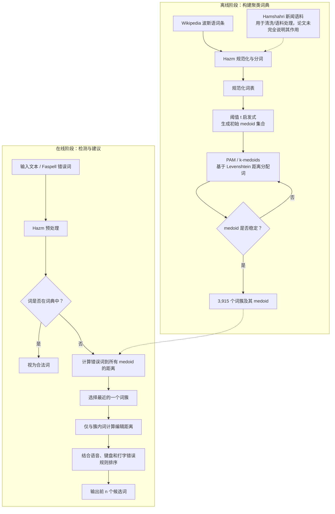

# A Partitional Clustering Approach to Persian Spell Checking

> **中文译名：基于划分聚类的波斯语拼写检查方法**

---

## 作者信息

| 作者 | 论文所列机构 | 身份/背景 | 领域大牛认定 |
|---|---|---|---|
| **Fatemeh Hojati Kermani** | Department of Technology, Alzahra University，Tehran, Iran | 第一作者。论文只给出院系，没有注明职称。研究工作集中在将聚类和编辑距离用于波斯语拼写检查；公开资料不足以可靠判断其当时是学生、教师还是专职研究人员。 | **不能认定为领域“大牛”**。未发现足以支持院士、IEEE/ACM Fellow、顶级实验室负责人或高影响力波斯语 NLP 学者身份的可靠公开证据。 |
| **Shirin Ghanbari** | Department of Computer Science and Electronic Engineering, University of Essex, UK | 第二作者。可核实的早期论文显示其曾在埃塞克斯大学从事图像检索、图像分割等多媒体研究；本文把工程与聚类经验迁移到波斯语 NLP。论文没有注明其职称。 | **不能认定为波斯语 NLP 领域“大牛”**。现有资料表明她具有跨方向工程研究背景，但没有证据显示其属于该领域的资深领军学者。 |

**团队相关信息：**

这是一个由**伊朗 Alzahra University 与英国 University of Essex 组成的两人制、跨机构工程型合作团队**。论文呈现的强项是把成熟的 **PAM/k-medoids 聚类、Levenshtein 编辑距离和波斯语预处理工具**组合成轻量级拼写检查流程，而不是提出新的语言模型或聚类理论。就可查证的公开履历、论文影响力和团队规模而言，该团队更适合定位为**面向波斯语 NLP 应用的小型研究合作**，没有充分证据将其描述为该领域的主力实验室或由顶级学术荣誉获得者带队的团队。

> 注：作者身份判断严格依据论文署名信息与可核实的公开论文记录，避免把同名作者的履历误归于本文作者。

## 论文发表时间

| 项目 | 具体日期 | 来源/说明 |
|---|---|---|
| 会议举行时间 | **2019年2月28日—3月1日** | 2019 IEEE 5th Conference on Knowledge Based Engineering and Innovation（KBEI 2019），地点为伊朗德黑兰；[会议录信息](https://www.proceedings.com/49240.html) |
| 论文标注出版时间 | **2019年2月** | Crossref 的 `published-print`、`issued` 和 Semantic Scholar 记录均指向 2019 年 2 月 |
| IEEE/Crossref 元数据创建 | **2019年6月13日** | Crossref 的 DOI 元数据创建时间；可理解为论文进入正式数字出版元数据系统的时间，而非会议宣读日 |
| 正式出版状态 | **已正式发表** | IEEE 会议论文，收录于 KBEI 2019 会议录，第 **297–301 页**，不是预印本或在审稿件 |
| DOI | **10.1109/KBEI.2019.8734932** | [IEEE Xplore](https://ieeexplore.ieee.org/document/8734932/)；[DOI](https://doi.org/10.1109/KBEI.2019.8734932) |
| 当前引用情况 | **Semantic Scholar 4 次；Crossref 3 次** | 截至 **2026年7月26日**查询。不同数据库覆盖范围不同，因此计数不一致；属于引用影响较低的会议论文 |

该论文于 **2019年2月在 KBEI 2019 会议上公开发表**，随后进入 IEEE Xplore。它是一篇已经正式出版的 5 页 IEEE 会议论文，而非双盲评审或修改阶段的稿件。

## 摘要

本文提出一种面向**波斯语非词错误（non-word error）**的词典式拼写检查方法。传统方法需要把错误词与整个词典逐一比较，在线检索开销较大；作者因此先用 **PAM/k-medoids** 和 **Levenshtein 编辑距离**离线聚类词典，每个簇由一个真实词作为 medoid。查询时，系统先将错误词与全部 medoid 比较，只进入最近的一个簇，再在该簇内部生成并排序候选词，从而缩小搜索空间。作者以 Wikipedia 词条构建较现代的词典，使用 Hazm 进行波斯语文本预处理，并在含 **5,863 对错误词—正确词**的 Faspell 语料上测试。论文报告系统建立了 **3,915 个簇**、检测出测试集中的全部拼写错误，并以 **82% 准确率**给出与全词典检索相同的建议。不过，论文没有定义该准确率究竟是 top-1、top-n 还是候选集合命中率，也没有报告其最核心目标——时间和存储节省——的定量数据。

---

## 一、这篇论文讲了一个什么样的故事？

这篇论文的故事可以概括为：**把拼写纠错重新理解为一个字符串最近邻检索问题，再用聚类给词典建立索引。**

波斯语拼写检查首先面临语言自身的规范化难题，例如字符变体、连接形式、空格/半空格以及复杂的构词形式。经过规范化后，最朴素的非词纠错方法是：如果输入词不在词典中，就计算它与所有词典词之间的编辑距离，并返回距离最小的若干词。这个方法容易理解，但词典越大，在线比较越慢。

作者的解决思路不是训练一个更复杂的纠错模型，而是把计算成本前移：先在离线阶段把 Wikipedia 词典按照 Levenshtein 距离聚成若干簇，每个簇选一个实际词作为 medoid；在线阶段只比较“所有 medoid + 最近簇中的词”。这相当于把全词典搜索改成两级搜索：

1. 先粗定位错误词属于哪个字符串簇；
2. 再在这个小簇内精细搜索候选。

论文最后用 Faspell 数据验证这一思路。结果显示候选建议与全词典方案有 **82% 的一致/命中表现**，说明聚类剪枝具有一定可行性；但由于没有直接测量延迟、内存和压缩比例，论文只能证明“这种剪枝还能保留相当一部分候选质量”，尚不能充分证明“它确实显著节省了时间与存储”。

---

## 二、本文的核心思想和创新点

### 1. 核心思想

本文的核心思想是：

> **把词典预先组织成由 medoid 表示的字符串簇，使一次全词典最近邻搜索变成“先找最近 medoid，再查对应簇”的分层候选检索。**

它本质上是一种**检索索引/候选剪枝方法**，而不是一个学习上下文语义的纠错模型。聚类不直接决定正确词，而是减少需要计算编辑距离的候选数量。

### 2. 关键创新点

1. **将 partitional clustering 引入波斯语拼写检查。**  
   作者声称，聚类此前虽用于孟加拉语拼写检查，但尚未被用于波斯语拼写检查。因而其创新主要是语言场景和系统组合层面的创新，并非首次把聚类用于全球范围的拼写纠错。

2. **用 k-medoids 而非 k-means 组织字符串词典。**  
   medoid 必须是词典中的真实词，且算法只需要词与词之间的距离，适合直接使用 Levenshtein 距离；k-means 的“均值词”则没有自然定义。

3. **提出启发式初始 medoid 生成方法。**  
   作者通过一个距离阈值 $t$逐步选择相距较远的词作为初始 medoid，由此同时产生 medoid 数量，试图缓解标准 PAM 对随机初始化敏感以及必须预先给定 $K$的问题。

4. **采用 Wikipedia 作为较现代的词典来源。**  
   作者认为传统正式词典可能缺少现代语料中的词，又包含大量古旧、文学词，可能让某些现实中的错误形式被错误地当成合法词。使用 Wikipedia 是一种实用主义选择，但也会引入词条噪声、专名和不规范拼写。

5. **把语言特定知识加入候选排序。**  
   在编辑距离之外，论文称还会优先考虑语音相似、键盘布局和常见打字错误。不过这些规则没有被公式化，也没有单独评估贡献。

---

## 三、方法是怎么实现的？(How does it work?)

### 1. 架构

该方法采用**离线词典聚类 + 在线两级候选搜索**架构：

**图注**：依据论文 **Figure 1（系统流程）** 与 **Figure 2（聚类生成流程）** 综合重绘。图中的 Hamshahri 语料作用在原文中描述不充分；“前 $n$个候选”中的 $n$也未给出具体数值。

### 2. 关键算法

#### 算法 A：启发式初始 medoid 选择

论文不是随机选择 PAM 的初始 medoid，而是大致执行以下过程：

1. 将词表中的第一个词设为当前初始词；
2. 计算它与词表末端候选词的 Levenshtein 距离；
3. 若距离大于阈值 $t$，把该候选加入 medoid 集合，并移除其附近的词；
4. 若距离不超过 $t$，移除该候选，继续比较次末词；
5. 重复至待处理词表为空。

其目的在于生成彼此较远的初始中心，并由阈值间接决定簇数。不过，论文没有交代：

- 阈值 $t$的具体取值与选择依据；
- 初始词表的排序方式；
- “附近的词”按什么阈值移除；
- 不同排序或阈值是否会改变 3,915 个簇的结果。

因此该算法还不足以被严格复现。

#### 算法 B：PAM/k-medoids 聚类

1. 把每个词分配给 Levenshtein 距离最近的 medoid；
2. 对每个簇，寻找使簇内总距离最小的实际词，作为新 medoid；
3. 重复分配与更新，直到 medoid 不再变化。

与 k-means 不同，PAM 的中心是数据集中的实际对象，因而特别适合离散字符串。

#### 算法 C：在线拼写纠错

1. 若输入词存在于词典，系统不报错；
2. 否则，计算它与全部 3,915 个 medoid 的距离；
3. 选择最近 medoid 所代表的**单一词簇**；
4. 计算错误词与该簇中各词的编辑距离；
5. 根据最小编辑距离，并辅以语音相似、键盘邻近和典型打字错误规则进行排序；
6. 返回前 $n$个建议。

关键风险是：正确词若位于另一个簇、但靠近簇边界，单簇检索就会在候选生成阶段永久丢失它。

### 3. 关键公式

> 说明：论文只说明采用 Levenshtein 距离和 PAM，没有完整印出以下数学形式。为便于复现，下面是依据标准定义对其方法的形式化重构，不应误认为原文逐式给出。

#### （1）Levenshtein 编辑距离

设字符串 $x=x_1\ldots x_m$、$y=y_1\ldots y_n$，动态规划递推为：

$$
D(i,j)=\min
\begin{cases}
D(i-1,j)+1, & \text{删除}\\
D(i,j-1)+1, & \text{插入}\\
D(i-1,j-1)+\mathbb{I}(x_i\neq y_j), & \text{替换或匹配}
\end{cases}
$$

$$
D(i,0)=i,\qquad D(0,j)=j
$$

其中 $\mathbb{I}(\cdot)$为指示函数。标准实现的时间复杂度约为 $O(mn)$。

#### （2）k-medoids 目标函数

给定词典 $V$和 medoid 集合 $M\subseteq V$，目标是：

$$
\min_{M\subseteq V,\ |M|=K}
\sum_{x\in V}\min_{m\in M}d_{\mathrm{Lev}}(x,m)
$$

每个词的簇分配为：

$$
c(x)=\arg\min_{m\in M}d_{\mathrm{Lev}}(x,m)
$$

#### （3）在线候选生成

对于错误词 $w$，先选择最近 medoid：

$$
m^*=\arg\min_{m\in M}d_{\mathrm{Lev}}(w,m)
$$

然后只在对应簇 $P_{m^*}$中搜索：

$$
\hat{y}=\arg\min_{y\in P_{m^*}}d_{\mathrm{Lev}}(w,y)
$$

若加入语音、键盘和打字错误特征，更完整的排序函数可写成：

$$
\operatorname{score}(y\mid w)=
\alpha d_{\mathrm{Lev}}(w,y)
+\beta d_{\mathrm{phon}}(w,y)
+\gamma d_{\mathrm{key}}(w,y)
+\delta d_{\mathrm{typo}}(w,y)
$$

但论文没有定义这些子距离、权重或学习方式，因此这只是对作者文字描述的形式化表达。

#### （4）检索复杂度

若平均词长为 $L$，全词典规模为 $|V|$，medoid 数为 $K$，命中簇大小为 $|P_{m^*}|$，则：

$$
T_{\mathrm{full}}\approx O(|V|L^2)
$$

$$
T_{\mathrm{cluster}}\approx O\big((K+|P_{m^*}|)L^2\big)
$$

只有当 $K+|P_{m^*}|\ll |V|$时，聚类检索才会明显更快。论文没有给出 $|V|$、平均簇大小、簇大小分布或运行时间，因此无法验证这一条件是否真正成立。

---

## 四、实验效果 (Experimental Results)

### 1. 实验设置

| 项目 | 设置 |
|---|---|
| 评测语料 | **Faspell** 波斯语拼写错误语料 |
| 样本总量 | **5,863 对**错误词—正确词 |
| 常见/人工错误子集 | **5,063 对**，来源包括学生书写错误、打字错误与常见错误 |
| OCR 错误子集 | **800 对**，来自 OCR 输出 |
| 词典来源 | Wikipedia 波斯语词条 |
| 预处理 | Hazm；论文还提及 Hamshahri 新闻语料 |
| 字符串距离 | Levenshtein distance |
| 聚类方法 | 带自定义初始 medoid 选择的 PAM/k-medoids |
| 生成簇数 | **3,915** |
| 对照方式 | 与“在整个词典中生成的建议”比较，但未给出独立基线系统、显著性检验或运行环境 |

### 2. 主要结果

| 论文报告的结果 | 数值 | 应如何解读 |
|---|---:|---|
| 拼写错误检测 | **全部检测到** | 在封闭词典设置下，只要错误词不在词典即可检出；这一结果不能说明系统能处理真实词错误、专名或未登录词 |
| 候选建议准确率 | **82%** | 原文称能以 82% 准确率给出与全语料/全词典相同的建议，但没有定义 top-1、top-$n$或候选集合匹配标准 |
| 聚类数量 | **3,915** | 说明在线第一阶段仍需与 3,915 个中心比较；因缺少原始词典规模，无法计算搜索空间缩减比例 |

在 5,063 个较常见的人为错误样本中，错误类型分布为：

| 错误类型 | 占比 |
|---|---:|
| 插入 | **42%** |
| 删除 | **20%** |
| 替换 | **12%** |
| 转置 | **3%** |
| 多种错误组合 | **23%** |

**核心结论：**

- 该实验支持了**聚类后只搜索最近词簇仍可保留大部分候选质量**这一可行性判断。
- 作者报告的总体建议准确率为 **82%**，但指标定义不足，不能直接与现代论文的 Accuracy、Recall@$k$或 MRR 横向比较。
- 论文声称方法可以节省时间和存储，却**没有报告毫秒级延迟、吞吐量、内存占用、词典总规模或加速倍数**，因此其核心效率主张没有被实证量化。
- OCR 子集包含一些难以辨识、甚至不太符合真实人工拼写模式的错误，作者认为这是整体准确率下降的重要原因。

### 3. 消融实验与关键发现

论文**没有正式消融实验**。它没有分别移除或改变聚类、阈值初始化、语音规则、键盘规则和打字错误规则，也没有测试不同簇数或多簇搜索。因此，下列内容应称为“实验观察”，而不是严格的消融结论：

**关键发现：**

- **OCR 噪声与人工拼写错误的分布不同。** OCR 产生的字符序列可能非常不自然，仅依赖编辑距离和一个最近词簇时更容易漏掉正确候选。
- **插入错误占比最高。** 在常见错误子集中，插入占 42%，提示波斯语纠错系统不应只优化替换错误。
- **聚类剪枝存在约 18% 的候选质量损失或不一致。** 若将 82% 理解为与全词典建议一致，则剩余差异很可能来自簇边界和只搜索一个簇；但论文没有逐例验证这一因果。
- **效率结论缺乏实验支撑。** 没有“全词典检索 vs. 聚类检索”的速度、存储和质量对照，也没有报告阈值 $t$的敏感性。

**实验部分总结：**

本文实验是一个**初步的概念验证**：它表明 k-medoids 词典索引在 Faspell 上可以保留约八成的建议效果。但证据不足以证明该方案在真实系统中具有显著速度或存储优势，也不足以确定 82% 的具体纠错能力。相比“大规模、跨平台、完整消融”的成熟实证论文，本研究的实验规模和报告完整性都较有限。

---

## 五、优点与局限性

### ✅ 1. 优点

1. **问题建模简洁。**  
   将非词纠错抽象为字符串最近邻搜索，方法容易解释，也便于在资源有限的环境中实现。

2. **k-medoids 与字符串距离匹配良好。**  
   它不要求计算不存在的“平均字符串”，中心词可直接用于在线查询。

3. **离线—在线解耦清楚。**  
   昂贵的词典组织过程只需离线执行，在线阶段采用两级搜索，具备工程部署直觉。

4. **关注波斯语资源与预处理。**  
   论文结合 Wikipedia、Hazm、Hamshahri 和 Faspell，体现了对低资源语言工具链的实际关注。

5. **包含多来源错误。**  
   Faspell 同时包含学生/打字错误和 OCR 错误，比只用随机字符扰动更接近真实应用。

6. **对后续研究具有启发性。**  
   它提示后续系统可以将聚类作为候选召回层，再叠加语境模型，而不必让复杂模型扫描整个词表。

### ⚠️ 2. 局限性（研究边界与待解问题）

1. **没有验证最核心的效率主张。**  
   标题和摘要强调节省时间与存储，但实验没有运行时间、内存、加速比或原始词典大小。

2. **指标定义不清。**  
   “82% accuracy”和“same suggestions”含义模糊，无法确定是 top-1 正确率、top-$n$命中率还是与基线候选集合的一致率。

3. **算法不可完全复现。**  
   初始 medoid 阈值 $t$、词表顺序、邻近词移除准则、候选数 $n$以及语音/键盘规则都未给出。

4. **缺少强基线。**  
   没有与 BK-tree、VP-tree、Trie/FST、SymSpell、完整 PAM、随机初始化或当时已有波斯语拼写检查器比较。

5. **没有消融与敏感性分析。**  
   不能判断 82% 的效果来自聚类、编辑距离、词典选择还是人工排序规则。

6. **只处理非词错误。**  
   合法词被误用时仍存在于词典中，系统无法发现。例如相邻词、同音词或语境错误需要句子级语言模型。

7. **词典外词问题被忽略。**  
   专名、新词、派生词和领域术语不在词典时会被误报；“检测出所有错误”在封闭语料中容易成立，但不代表真实部署中的高精度。

8. **单簇检索容易产生边界漏召回。**  
   最近 medoid 并不保证正确词一定在该 medoid 的簇中。搜索多个近邻簇可能提高召回率，但论文没有尝试。

9. **Wikipedia 词典质量未审计。**  
   Wikipedia 更新快，但也含专名、变体、外来词和潜在拼写噪声；论文没有描述清洗、去重和词形处理细节。

10. **统计报告不足。**  
    没有训练/验证/测试划分、随机种子、重复实验、方差、置信区间或显著性检验。

11. **文稿存在术语与陈述问题。**  
    原文偶尔把 medoid 称为 centroid，把 phonetics 写成 “photonics”；对波斯字母、元音和辅音数量的表述也存在内部算术不一致。这些问题降低了论述严谨性。

---

## 六、其他

### 第一性原理

#### 1. 拼写纠错首先是候选召回，其次才是候选排序

如果正确词没有进入候选集合，后续再强的排序器也无法挽救。本文用单个最近簇降低计算量，却也可能在簇边界丢失正确词。因此真正的目标不应只是“最小化比较次数”，而应是：

$$
\text{在给定计算预算下最大化正确词的 Recall@}k
$$

更合理的系统可搜索距离最近的多个簇，或根据距离差动态决定搜索几个簇。

#### 2. 聚类在这里不是纠错模型，而是索引

PAM 不理解语义、句法或输入上下文；它只是用字符串距离重排搜索空间。论文的真正贡献应评价为**词典索引策略**，而不是完整的语言智能纠错框架。

#### 3. “不在词典”不等于“拼写错误”

词典查找只能解决封闭词表的合法性判断：

$$
w\notin V \;\not\Rightarrow\; w\text{ 一定错误}
$$

它可能是人名、地名、新词、专业术语或合法派生词。真实系统必须同时建模词法生产性、领域词表和上下文概率。

#### 4. 距离函数决定了系统认为什么是“相似”

标准 Levenshtein 对所有插入、删除、替换赋予相同代价，但真实波斯语错误并非等概率。例如键盘相邻字符、同音字母、阿拉伯语/波斯语字符变体和半空格错误应具有不同成本。一个学习得到的加权编辑距离可能比增加更多聚类技巧更直接有效。

#### 5. 效率优化必须给出端到端证据

3,915 个 medoid 并不天然意味着“快”。如果词典本身并不大，或目标簇很大，聚类开销可能抵消收益。必须同时报告：

- 离线建索引时间；
- 在线平均与 P95/P99 延迟；
- 内存和磁盘占用；
- 候选 Recall@$k$；
- 不同词典规模下的扩展曲线。

### 领域空白

1. **可复现的波斯语纠错评测基准。**  
   需要公开、去重并按人工错误、OCR、键盘、字符规范化、半空格和真实词错误分层的数据集，同时明确 top-1、Recall@$k$、MRR 和误报率。

2. **高召回、可证明的字符串索引。**  
   将 PAM 与 BK-tree、VP-tree、Trie/FST、SymSpell 和度量空间分支定界进行公平比较，回答聚类是否真是波斯语词典的最佳索引。

3. **多簇自适应检索。**  
   根据最近几个 medoid 的距离差、簇半径和查询不确定性，动态扩大搜索范围，在延迟与召回率之间建立可控曲线。

4. **语言学加权编辑距离。**  
   从真实错误对中学习插入、删除、替换、转置、键盘邻近、同音字母和半空格操作的代价，而不是全部固定为 1。

5. **形态学感知的开放词汇处理。**  
   波斯语具有丰富的词缀和连接规则，需要结合词干、词缀、Ezafe、复数、附着代词及半空格规范，减少合法未登录词误报。

6. **真实词错误与上下文纠错。**  
   将高效候选召回与 n-gram、神经语言模型或现代 Transformer 重排序器结合，处理“词本身合法、放在句中错误”的情形。

7. **词典质量与版本治理。**  
   系统比较 Wikipedia、正式词典、新闻语料和领域词表的覆盖率、噪声、年代偏差及专名比例，并记录可更新的词典版本。

8. **OCR 与人工拼写错误分域建模。**  
   OCR 噪声来自视觉混淆，人工错误来自语音、键盘与语言知识，两者不应共享完全相同的距离模型和候选策略。

9. **端到端工程评估。**  
   在移动端、服务器端和大规模批处理环境分别测量延迟、内存、吞吐量和能耗，才能真正检验本文“节省时间与存储”的原始动机。

---

## 一句话评价

这篇论文的价值在于提出了一个**直观、低门槛的波斯语词典聚类索引方案**；它证明了单簇剪枝在 Faspell 上仍能保留约 82% 的建议效果，但由于效率指标、算法细节和评测定义缺失，更适合被视为一项**有启发性的概念验证**，而不是已经充分证实优越性的完整拼写纠错系统。

---
>本笔记由ChatGPT（codex）生成