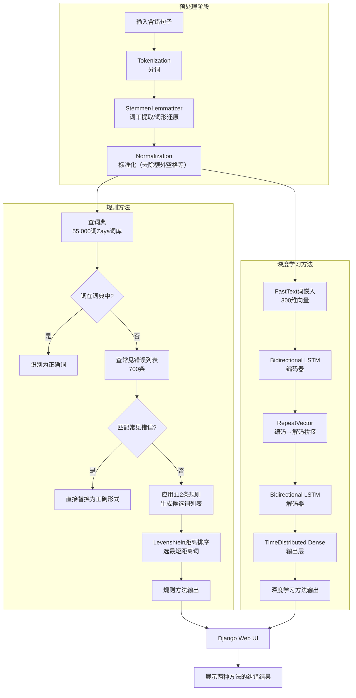

# Correcting spelling mistakes in Persian texts with rules and deep learning methods
---
中文译名：基于规则与深度学习的波斯语拼写纠错
---
## 作者信息
| 作者 | 机构 | 身份/背景 | 领域大牛认定 |
|------|------|-----------|-------------|
| Sa. Kasmaiee | Amirkabir University of Technology (德黑兰理工大学) | 计算机工程系，通讯作者 | 非领域大牛 |
| Si. Kasmaiee | Amirkabir University of Technology | 计算机工程系 | 非领域大牛 |
| M. Homayounpour | Amirkabir University of Technology | 计算机工程系 | 非领域大牛 |
**团队相关信息**：该团队来自**伊朗德黑兰理工大学（Amirkabir University of Technology）计算机工程系**，这是伊朗国内顶尖的理工科院校之一，但在国际NLP/拼写纠错研究领域并非主流团队。三位作者均非国际公认的"领域大牛（如ACM Fellow、IEEE Fellow或高被引学者）"级别，属于**区域性研究团队**，工作聚焦于**波斯语等低资源语言的NLP应用**。该论文发表在 *Scientific Reports*（Nature旗下OA期刊，IF ~4.6，JCR Q2），属于中等水平的国际期刊，与团队地位匹配。
---
## 论文发表时间
| 项目 | 具体日期 | 来源/说明 |
|------|----------|-----------|
| 投稿日期 | 2023年7月9日 | 论文"Received"标注 |
| 接收日期 | 2023年11月11日 | 论文"Accepted"标注 |
| 正式发表 | 2023年11月15日 | 论文元数据与出版记录 |
| 版本类型 | VoR（Version of Record） | 最终出版版本 |
| 期刊 | *Scientific Reports*, Vol. 13, Article 19945 | Nature Publishing Group UK |
| DOI | 10.1038/s41598-023-47295-2 | — |
| 许可 | CC BY 4.0（开放获取） | — |
该论文**2023年11月正式发表于 *Scientific Reports***，属于**已正式发表（非预印本/非在审）**的开放获取论文，同行评审周期约4个月。
---
## 摘要

本文针对波斯语（Persian）缺乏自动化拼写纠错系统的现状，提出并比较了两种方法：(1) **基于规则的方法**——利用55,000词词典、700条常见错误列表和112条手工纠错规则，结合Levenshtein编辑距离进行候选词排序；(2) **基于深度学习的方法**——构建了一个以LSTM编码器-解码器为基础的网络，使用FastText词嵌入，并额外尝试了卷积层和胶囊（Capsule）层的增强。通过规则自动生成含错误的1.2M句人工语料库进行训练，最终深度网络在评估集上取得了准确率87%、精确率70%、召回率89%、F值78%、BLEU 84%的结果，显著优于规则方法，并与印地语、马拉雅拉姆语等低资源语言的同类系统可比。

---
## 一、这篇论文讲了一个什么样的故事？

这篇论文讲述了一个**"填补空白"的故事**：英语拼写纠错已经非常成熟（有Grammarly等强大工具），但波斯语作为一种拥有约1.1亿使用者的语言，在自动化拼写纠错方面几乎是一片空白。作者试图通过两种互补的方法——传统的规则系统和现代的深度学习——来构建**首个波斯语拼写纠错的综合系统**。

故事的推进逻辑是：先构建规则方法作为基线（因为它不需要训练数据，可解释性强），再通过规则自动生成大规模含噪声训练数据（"以规则养数据"），最后用这些数据训练深度神经网络，实现端到端的序列到序列（Seq2Seq）纠错。实验表明，深度学习方法全面优于规则方法，但规则方法在缺乏训练数据的场景下仍有价值。整个故事的**核心贡献**不在于方法创新，而在于**系统性工程化地解决了波斯语这一低资源语言的拼写纠错问题**。

---
## 二、本文的核心思想和创新点
### 1. 核心思想
**"以规则生成噪声数据，以深度学习学习纠错映射"**。作者的核心思路是：在没有大规模标注纠错平行语料的情况下，利用语言学知识设计112条规则来**人工制造**各种类型的拼写错误（字母替换、字母重复、字母删除、字母对调、多余空格等），将10,000句正确句子扩展为包含约112万句错误-正确句对的平行语料库，然后用这个语料库训练一个Seq2Seq的LSTM编码器-解码器网络，实现端到端的拼写纠错。

### 2. 关键创新点
1. **首个波斯语拼写纠错的综合深度学习系统**：声称是首次在波斯语拼写纠错中全面使用深度学习方法，包括尝试FastText词嵌入、CNN层、胶囊（Capsule）层等组件。
2. **系统性的错误类型覆盖**：基于Shahmiri等人对波斯语拼写错误分布的研究，设计了覆盖9种错误类型（包括语音错误、字母替换、字母对调、字母重复、字母删除、字母插入、多余空格、空格删除等）的112条规则，覆盖了波斯语真实拼写错误的绝大部分。
3. **规则→数据→网络的工程闭环**：通过规则自动生成大规模训练数据，解决了波斯语缺乏标注纠错语料的核心瓶颈，形成了一个自洽的工程管道。
4. **完整的端到端系统**：不仅训练了模型，还构建了基于Django的Web用户界面，提供规则和深度学习两种纠错模式，具有实际可用性。

---
## 三、方法是怎么实现的？(How does it work?)
### 1. 架构
本系统采用**双轨并行架构**，包含规则方法（Rule-based）和深度学习方法（Deep Learning）两条独立的纠错通道，共用预处理模块，最终都通过Django Web界面展示结果。

**图注**：参考论文Figure 8（拼写纠错流程图）、Figure 9（神经网络结构图）综合绘制。规则方法和深度学习方法，两轨共享预处理阶段。
### 2. 关键算法
**（1）人工语料库生成算法（数据增广）**
这是整个方法的关键前提。对10,000句正确波斯语句子，每条句子应用112条规则，每条规则独立产生一种错误变体，最终生成约1,120,000句错误-正确平行句对。规则覆盖的错误类型包括：
| 错误类型 | 占比 | 实现方式 |
|----------|------|----------|
| 字母替换 | 39.5% | 将字母替换为键盘上相邻的左/右字母 |
| 字母删除 | 19% | 依次删除词中第1-5个字母 |
| 字母重复 | 14.5% | 依次重复词中第1-5个字母 |
| 字母插入 | 8% | 在词中插入相邻键字母 |
| 其他 | 6.5% | 组合错误 |
| 字母对调 | 5% | 依次交换相邻字母对 |
| 空格删除 | 5% | 删除相邻词之间的空格 |
| 多余空格 | 2.5% | 在词内插入多余空格 |
| 语音错误 | 0.5% | 替换同音字母 |
**（2）LSTM编码器-解码器网络（Seq2Seq）**
- **输入层**：将句子转换为整数序列，通过FastText预训练模型（波斯语版，来自Facebook AI）映射为300维词向量。
- **编码器**：Bidirectional LSTM（尝试了500和1000个记忆单元两种配置），处理输入序列，生成上下文向量。
- **桥接**：RepeatVector层将编码器输出复制为解码器的时间步输入。
- **解码器**：Bidirectional LSTM，逐时间步生成输出序列。
- **输出层**：TimeDistributed Dense层 + Softmax，将每个时间步的隐状态映射到词汇表上的概率分布。
- **增强变体**：在嵌入层后添加了Conv1D + MaxPooling层（提取局部特征）和Capsule层（保留层级关系），再接入LSTM。
**训练参数**：优化器Adam，损失函数sparse_categorical_crossentropy，batch_size=8，早停（patience=3 epochs），最大100 epochs。
**（3）规则方法中的候选词选择算法**
当规则方法为一个错词生成多个候选词时，计算每个候选词与原始错词的Levenshtein编辑距离，选择距离最小的候选词作为最终输出。
### 3. 关键公式
**（1）词向量余弦相似度（用于评估词嵌入质量）**：
$$cos(\vec{v_i}, \vec{v_j}) = \frac{\vec{v_i} \cdot \vec{v_j}}{|\vec{v_i}| |\vec{v_j}|}$$
**（2）CNN卷积层特征提取**：
$$c_i = f(w \cdot x_{i:i+h} + b)$$
$$\hat{c} = \max(c)$$
其中 $w \in \mathbb{R}^{hk}$ 为卷积滤波器，$x_{i:j}$ 为词 $i$ 到 $j$ 的组合，$f$ 为tanh激活函数。
**（3）LSTM核心更新公式**：
$$c_t = f_t \odot c_{t-1} + i_t \odot \tilde{c}_t$$
$$o_t = \sigma(W_o[h_{t-1}, x_t] + b_o)$$
$$h_t = o_t \odot \tanh(c_t)$$
$$y_t = \text{Softmax}(o_t)$$
其中遗忘门 $f_t = \sigma(W_f[h_{t-1}, x_t] + b_f)$，输入门 $i_t = \sigma(W_i[h_{t-1}, x_t] + b_i)$，候选记忆 $\tilde{c}_t = \tanh(W_c[h_{t-1}, x_t] + b_c)$。
**（4）Bidirectional LSTM输出**：
$$h_t = [h_t^f, h_t^b]$$
**（5）损失函数（稀疏类别交叉熵）**：
$$\text{Loss} = -\frac{1}{N} \sum_{s \in S} \sum_{c \in C} l_{s \in c} \log p(s \in c)$$
**（6）评价指标**：
$$\text{Accuracy} = \frac{TP+TN}{TP+TN+FP+FN}$$
$$\text{Recall} = \frac{TP}{TP+FN}$$
$$\text{Precision} = \frac{TP}{TP+FP}$$
$$F\text{-Measure} = 2 \cdot \frac{\text{Precision} \cdot \text{Recall}}{\text{Precision} + \text{Recall}}$$
$$\text{BLEU} = \min\left(1, \frac{\text{output-length}}{\text{reference-length}}\right) \times \left(\prod_{i=1}^{4} \text{precision}_i\right)^{0.25}$$

**注意**：论文中（17）和（18）式的Accuracy和Recall公式存在符号定义问题——Accuracy公式中分子分母同时包含TP+TN，但文中定义的TN是"真实句子无拼写错误且网络正确识别为无错误"，这在以词为单位的拼写纠错中难以直接应用，实际上作者可能混淆了句子级和词级的评估粒度。

---
## 四、实验效果 (Experimental Results)
### 1. 实验设置
- **训练数据**：800,000句（人工生成的错误-正确句对）
- **测试数据**：200,000句
- **评估数据**：200,000句（深度网络）/ 2,500句（规则方法，因人工评估限制）
- **网络配置**：三种配置对比——(a)基础LSTM编码器-解码器500单元，(b)基础LSTM编码器-解码器1000单元，(c)1000单元LSTM + CNN + Capsule
- **评估指标**：Accuracy、Precision、Recall、F-Measure、BLEU
- **对比基线**：规则方法（含常见错误列表）、马拉雅拉姆语LSTM模型、HINSPELL印地语、CNN-Strides/Filters英语、HINDIA印地语
### 2. 主要结果
**训练与测试精度**：
| 网络类型 | 训练精度 | 测试精度 |
|----------|----------|----------|
| 基础网络（500 LSTM单元/层） | 0.968 | 0.978 |
| 基础网络（1000 LSTM单元/层） | 0.984 | 0.988 |
| 1000 LSTM + CNN + Capsule | 0.979 | 0.979 |
**核心结论**：
- **增加LSTM单元数（500→1000）有效提升性能**：训练精度从96.8%提升至98.4%，且收敛速度更快（epoch数从10+降至6）。
- **CNN和Capsule层的添加并未带来实质提升**：与基础1000单元LSTM网络表现几乎相同（0.979 vs 0.988），增加的计算开销未转化为性能增益。
- **深度学习方法全面碾压规则方法**：在以2,500句评估时，基础网络（F值49%、BLEU 65%）已优于规则方法（F值25%、BLEU 40%）；在200,000句全量评估时，基础网络达到F值78%、BLEU 84%。
**最终深度网络（200,000句评估）**：
| 指标 | Accuracy | Precision | Recall | F-Measure | BLEU |
|------|----------|-----------|--------|-----------|------|
| 数值 | 87% | 70% | 89% | 78% | 84% |
**跨语言对比**：
| 方法 | 语言 | Accuracy | Precision | Recall | F-Measure |
|------|------|----------|-----------|--------|-----------|
| 本文网络 | 波斯语 | 87% | 70% | 89% | 78% |
| HINDIA (split) | 印地语 | 80% | 85% | 72% | 78% |
| HINDIA (test) | 印地语 | 74% | 81% | 72% | 77% |
| HINSPELL | 印地语 | 77% | — | — | — |
| LSTM (Malayalam) | 马拉雅拉姆语 | 55% | 47% | 97% | 63% |
### 3. 消融实验与关键发现
**关键发现**：
1. **Bidirectional LSTM已经足够强大**：CNN和Capsule层的添加几乎未带来增益，作者推测这是因为双向LSTM本身已经能够很好地捕捉前后文依赖关系，CNN的局部特征提取和Capsule的层级关系建模在拼写纠错任务中属于冗余能力。
2. **规则方法的瓶颈在于词典覆盖率**：规则方法在仅选最低Levenshtein距离候选词时效果较差（F值25%），但如果用户能从候选词列表中选择，实际效果会更好。
3. **以规则生成训练数据是可行的工程策略**：人工生成的数据集在真实评估中表现良好，验证了"规则制造噪声→深度学习学习去噪"这一范式的有效性。
4. **波斯语作为低资源语言，深度学习方法有效**：该网络在波斯语上的表现（F值78%）与印地语等低资源语言的最优系统（HINDIA F值78%）持平，说明该方法在低资源语言拼写纠错中具有通用性。
---
## 五、优点与局限性
### ✅ 1. 优点
1. **系统完整性高**：从数据生成、模型训练、评估到Web UI部署，构建了一个完整可用的波斯语拼写纠错系统，工程价值突出。
2. **问题定义清晰，方法选择合理**：针对波斯语缺乏标注数据的现实，采用"规则生成数据+深度学习"的策略，逻辑自洽。Seq2Seq框架用于纠错任务也是自然的选择。
3. **错误类型覆盖全面**：基于先前的波斯语拼写错误分布研究，设计了9类112条规则，覆盖了真实拼写错误的绝大部分，数据增广的逼真性有保障。
4. **多维度评估**：使用Accuracy、Precision、Recall、F-Measure、BLEU五个指标进行评估，并与多个语言的同类系统对比，评估较为全面。
5. **开源与可复现性**：代码以Supplementary Information形式提供，数据可应要求获取，符合Scientific Reports的开放科学标准。
### ⚠️ 2. 局限性（研究边界与待解问题）
1. **方法创新性有限**：核心方法（LSTM Seq2Seq + FastText）是NLP领域的标准组合，CNN和Capsule层的尝试也未能带来增益，本质上属于**应用现有方法到新语言**的工程型工作，而非方法创新。
2. **评估粒度不清**：论文对"正类"的定义（将错词识别并纠正=TP）存在歧义——是在**词级别**还是**句子级别**评估？文中公式定义与实验部分的描述不一致，可能影响结果的可信度。
3. **未使用Transformer/BERT等更新架构**：论文发表于2023年，但方法仍停留在LSTM时代。波斯语BERT模型（如ParsBERT）已于2020年发布，但论文未与之对比或结合，在方法先进性上存在明显滞后。
4. **上下文感知能力有限**：规则方法完全基于词典匹配，无法利用上下文信息（如"من تورا دوست دارم"中的"طور"应根据上下文纠正为"تو"）。虽然深度网络试图解决此问题，但LSTM的长距离依赖能力有限。
5. **数据增广的覆盖度未验证**：人工生成的错误是否真实反映了波斯语母语者的实际拼写错误模式，缺乏实证验证。
6. **仅评估了最低Levenshtein距离候选词**：规则方法实际输出的是候选词列表，但评估时仅选取了距离最短的，低估了规则方法的实际可用性。
7. **作者团队和出版平台影响力有限**：三位作者来自伊朗区域性团队，发表在Scientific Reports（IF ~4.6），在NLP顶会（ACL/EMNLP/NAACL）级别的竞争中影响力有限。
---
## 六、其他
### 第一性原理
拼写纠错的本质是**在给定噪声输入（含错文本）的条件下，恢复出最可能的正确文本**。用贝叶斯视角来看，就是最大化 $P(\text{正确文本}|\text{含错文本})$。这可以分解为两个子问题：(1) **错误建模**——给定一个正确词，人会以什么模式犯错？(2) **语言建模**——什么序列更可能是正确的波斯语？规则方法侧重错误建模（通过枚举已知错误模式），深度学习方法则通过数据同时隐式学习错误模式和语言模型。本文的贡献在于建立了波斯语的错误模型（112条规则），并将语言模型的学习外包给了LSTM网络。
### 领域空白
1. **波斯语（及广义的阿拉伯文字系语言）拼写纠错的深度学习研究严重不足**：与英语、中文等相比，波斯语、乌尔都语、阿拉伯语等使用阿拉伯文字的语言在NLP基础设施上明显落后，缺乏大规模标注纠错语料库。
2. **拼写错误的数据增广方法缺乏系统性研究**：如何生成"逼真"的拼写错误（而非随机的字符级噪声）是一个被低估的问题，不同语言、不同输入设备（键盘vs触屏vs语音输入）的错误模式差异很大。
3. **Transformer架构在低资源语言拼写纠错中的应用**：虽然Transformer在英语纠错中已成为主流，但在波斯语等低资源语言中，缺乏足够的训练数据来发挥Transformer的优势，如何在有限数据下训练Transformer纠错模型是一个开放问题。
4. **拼写纠错与语法纠错的统一框架**：本文仅处理拼写错误，但真实文本中拼写错误和语法错误往往同时存在，将它们统一在一个框架下处理的研究仍然有限。
---

> 本笔记由deepseek AI 生成