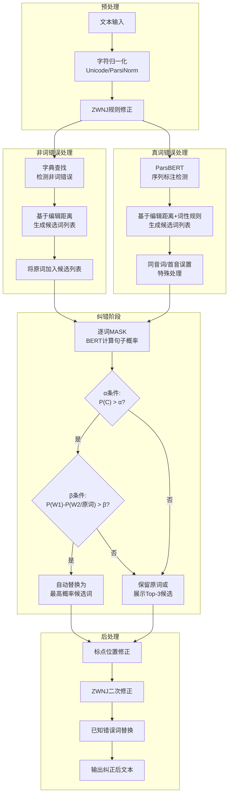

# Using a Pre-Trained Language Model for Context-Aware Error Detection and Correction in Persian language
---
中文译文：使用预训练语言模型进行波斯语上下文感知错误检测与纠正

---

## 作者信息

| 作者 | 机构 | 身份/背景 | 领域大牛认定 |
|------|------|----------|-------------|
| Romina Oji | 德黑兰大学 (University of Tehran) | 博士生/研究员（第一作者，参与ParsiNorm、PerSpellData等波斯语NLP工具开发） | 早期研究者 |
| Mohammad Javad Dousti | 德黑兰大学 | 研究员/博士生 | 早期研究者 |
| Heshaam Faili | 德黑兰大学 | 通讯作者，资深研究者（参与Vafa spell-checker等多项波斯语NLP研究） | 波斯语NLP领域资深学者，非国际顶级大牛 |

**团队相关信息**：该团队来自**德黑兰大学自然语言处理实验室**，由副教授 **Heshaam Faili** 带领博士生完成。Faili 是波斯语 NLP 领域持续产出的研究者，在波斯语拼写检查、依存句法分析等方面有积累，但尚未达到国际顶级大牛（如ACL Fellow/院士）层级。该团队此前已发布 Vafa spell-checker、ParsiNorm、PerSpellData 等波斯语 NLP 工具与数据集，形成了一定的工具链生态。

---

## 论文发表时间

| 项目 | 具体日期 | 来源/说明 |
|------|---------|----------|
| 论文公开 | 约 2023–2024 年 | 参考文献最新为 2023 年（Dehghani & Faili, 2023；Hangaragi et al., 2023）；论文未标注特定期刊/会议名称 |
| 发表状态 | 未知（可能为会议/workshop论文） | 文中引用到 arXiv preprint 及多个会议论文，但自身未标注 venue；可能为 NLP 相关会议（如 NSURL、ICNLSP 等低资源语言 workshop）投稿 |

该论文引用截止 2023 年的文献，文末标注了工具网站 `virastman.ir`，说明已完成系统实现并上线。目前处于**已发表或预印本阶段**，但发表平台影响力有限。

---

## 摘要

本文提出了一个波斯语拼写检查器 **Virastman**，旨在检测和纠正句子中的**非词错误（non-word errors）**和**真词错误（real-word errors）**。该方法采用基于 BERT 的序列标注模型，在小型人工合成数据集上检测真词错误；同时使用基于 BERT 的无监督模型进行纠错，通过计算句子中每个候选词的概率，在满足两个阈值条件（α 和 β）时选择高概率候选词作为正确词。在六个不同测试集上的实验表明，该方法在检测和纠正两类错误方面均显著优于基线方法——错误检测 F0.5 平均提升 3.41%，错误纠正 F0.5 平均提升 15%。

---

## 一、这篇论文讲了一个什么样的故事？

这篇论文讲的是：**在波斯语这种低资源语言中，如何构建一个能同时处理"非词错误"（拼错了、字典里没有的词）和"真词错误"（词本身存在但语境不对）的完整拼写检查系统。**

故事的起点是一个现实问题——波斯语现有拼写检查器虽然能较好地检测非词错误，但几乎无法检测和纠正真词错误（这类错误约占全部拼写错误的 25%–40%）。而波斯语作为低资源语言，缺乏大规模标注数据，无法像英语那样用监督学习直接训练端到端模型。

作者的核心思路是"**分而治之 + 无监督**"：非词错误用字典搞定（简单粗暴），真词错误用序列标注模型（基于 ParsBERT）在少量合成数据上训练，纠错则用 BERT 语言模型做无监督概率排序——不依赖标注纠错数据。通过精心设计的双阈值机制（α 控制整体置信度，β 控制候选词区分度），系统在自动纠错和保留原句之间取得了平衡。

故事的结局：在六个涵盖不同错误比例、不同句子长度的测试集上，Virastman 全面超越 Nevise、Paknevis、Google Docs、FarsiYar、XFspell 等现有工具，尤其在真词错误占比高达 66.9% 的数据集上，纠错 F0.5 提升了约 40%。

---

## 二、本文的核心思想和创新点

### 1. 核心思想

**"字典 + 序列标注 + 无监督语言模型概率排序"的三段式架构**：将拼写检查拆分为检测（detection）和纠正（correction）两个阶段，针对非词错误和真词错误分别设计不同的检测方法，但共享同一套基于 BERT 的无监督纠错框架。核心假设是：**如果一个句子包含错误，其语言模型概率低于所有词都正确的版本**（Bryant & Briscoe, 2018）。

### 2. 关键创新点

1. **为低资源语言设计的数据高效的真词错误检测方法**：通过混乱矩阵（confusion matrix）从干净语料中自动合成训练数据，仅需少量人工标注即可训练序列标注模型，解决了波斯语缺乏大规模标注数据的问题。

2. **基于双阈值的无监督纠错策略**：引入 α（句子概率阈值）和 β（候选词区分度阈值）两个超参数，并针对不同错误类型（非词/真词）和不同上下文条件（句子长度、词长）分别调优，实现了"高置信度自动纠错，低置信度保留原文或交由用户选择"的分级策略。

3. **将检测到的词加入候选列表的防误纠机制**：在纠错时将原词（即使被标记为错误）也加入候选列表，若原词概率最高则保持不变，有效降低了将正确词误改为错误词的比例（correct-to-wrong rate 降低 0.85%）。

4. **针对波斯语形态复杂性的预处理与后处理规则**：处理 ZWNJ（零宽不连字符）、半角/全角字符归一化、以及基于词性的候选词过滤规则（如避免将肯定动词误改为否定动词）。

---

## 三、方法是怎么实现的？(How does it work?)

### 1. 架构

本方法采用**五阶段流水线架构**，分为预处理、错误检测、候选词生成、错误纠正、后处理五个阶段，非词错误和真词错误在前三个阶段使用不同模型，在纠错阶段共享相同框架。

**图注**：参考论文 Figure 1（Pipeline of Virastman Spell Checker）及 Section 3 各子节描述综合绘制。

### 2. 关键算法

**算法：非词错误纠正（基于BERT的无监督概率排序）**

1. 输入句子 X = ⟨x₁, x₂, ..., xₙ⟩，其中 xᵢ 被检测为错误词
2. 生成候选词列表 S = {s₁, s₂, ..., sₘ}（包含原词 xᵢ）
3. 对每个候选词 sⱼ：
   - 将 xᵢ 替换为 sⱼ，得到候选句子 Cⱼ
   - 对 Cⱼ 中每个位置 wₖ 逐一 MASK，计算 log P(wₖ)
   - 归一化：P(Cⱼ) = (1/n) Σ log P(wₖ)
4. 按 P(Cⱼ) 降序排列候选句子
5. 若 P(C₁) > α 且 P(W₁) − P(W₂) > β（非词错误）/ P(W₁) − P(W_O) > β（真词错误），自动替换为 s₁
6. 否则保留原词或展示 Top-3 候选

**算法：真词错误检测（基于序列标注）**

1. 从80GB波斯语原始语料中提取干净句子（所有词均在字典中）
2. 构建混乱矩阵：对每个词 wᵢ，找到编辑距离 ≤ 2 的所有词 wⱼ，形成 (wᵢ, wⱼ) 对
3. 合成训练数据：在干净句子中随机替换约15%的词为对应混乱词
4. 每个 (wᵢ, wⱼ) 对至少出现在10个不同句子中
5. 使用 ParsBERT + 全连接层 + Softmax 进行二分类序列标注（0=正确，1=真词错误）
6. 训练参数：AdamW优化器，学习率 2e-5，2 epoch，batch size 16

### 3. 关键公式

**句子似然度（归一化对数概率）**：

$$P(C) = \frac{1}{n}\sum_{i=1}^{n} \log P(W_i)$$

其中 n 为句子长度，P(Wᵢ) 为 BERT 在 MASK 位置预测第 i 个词的概率。该公式参考 Wang & Cho (2019) 的论证——BERT 的 MASK 预测可近似句子的马尔可夫随机场似然度。

**自动纠错双阈值条件**：

- **非词错误**：
  - 条件1：P(C) > α（α = −25）
  - 条件2：P(W₁) − P(W₂) > β（β = 0.33）

- **真词错误**：
  - 条件1：P(C) > α（α = −7）
  - 条件2：P(W₁) − P(W_O) > β（β 根据句子长度和词长动态调整，见表1）

**评估指标 F₀.₅**：

$$F_{0.5} = (1 + 0.5^2) \cdot \frac{\text{Precision} \cdot \text{Recall}}{0.5^2 \cdot \text{Precision} + \text{Recall}}$$

选择 F₀.₅ 而非 F₁ 的原因是在拼写检查任务中，将正确词误改为错误词的代价远大于漏检，因此精确率比召回率更重要。

---

## 四、实验效果 (Experimental Results)

### 1. 实验设置

- **测试集**：6个覆盖不同场景的波斯语测试集——Shargh（新闻）、PerSpellData（通用）、Zarebin、Nevise News Content、Nevise News Title、Real-word Error（Mirzababaei et al., 2013）
- **测试集特点**：涵盖不同句子长度（平均3.53–26.96词）、不同错误率（1.28–5.73错误/句）、不同真词错误占比（1.48%–66.19%），所有错误均为真实用户产生的错误
- **基线方法**：Nevise（深度学习）、Paknevis（AI拼写检查）、Google Docs API、FarsiYar（AI拼写检查）、XFspell（字符级Transformer）
- **评估指标**：精确率（Precision）、召回率（Recall）、F₀.₅、Correct-to-Wrong Rate（纠正正确词与错误词的比例）

### 2. 主要结果

**核心结论**：

- **所有6个测试集上 Virastman 的错误纠正 F₀.₅ 均为最优**。在真词错误占比高达 66.9% 的 Real-word 测试集上，纠错 F₀.₅ 达到 94.00%，远超第二名 Nevise 的 53.45%，提升约 40 个百分点。
- **在 PerSpellData 上检测 F₀.₅ 达 98.43%**，接近饱和，说明对常规拼写错误的检测能力已非常成熟。
- **Nevise 在精确率上偶尔略优于 Virastman**，但 Virastman 的召回率远高于所有基线，意味着它能发现更多真实错误。
- **Google Docs 和 FarsiYar 整体表现较差**，在 Real-word 测试集上的纠错 F₀.₅ 分别仅为 24.84% 和 27.92%，说明通用拼写检查器对波斯语真词错误几乎无能为力。
- **XFspell 表现不稳定**，在部分测试集上接近 Virastman，但在真词错误测试集上表现很差（纠错 F₀.₅ = 73.67%，但检测能力有限）。

**指标汇总**（Real-word 测试集，最具挑战性）：

| 方法 | 错误检测 F₀.₅ | 错误纠正 F₀.₅ |
|------|:-----------:|:-----------:|
| **Virastman** | **95.65%** | **94.00%** |
| XFspell | 75.41% | 73.67% |
| Nevise | 60.61% | 53.45% |
| Paknevis | 31.89% | 24.84% |
| Google Docs | 64.93% | 60.42% |
| FarsiYar | 32.14% | 27.92% |

### 3. 消融实验与关键发现

**关键发现**：

- **双阈值机制至关重要**：移除阈值后，非词 Virastman 的精确率从 99.22% 降至 98.72%（检测），Correct-to-Wrong Rate 从 0.21 升至 0.35，说明阈值有效阻止了将正确词改为错误词。
- **将检测词加入候选列表降低误纠率**：加入原词后，检测精确率提升 2.92%（96.30% → 99.22%），纠错 Correct-to-Wrong Rate 降低 0.85%（1.06% → 0.21%），代价是召回率轻微下降（< 1%）。
- **真词错误的 α 阈值远低于非词错误**（α = −7 vs α = −25），说明真词错误的自动纠错需要更高的置信度门槛，这与直觉一致——真词错误更难判断，出错代价更高。

**实验部分总结**：本文通过 6 个多维度测试集上的全面评估，**确凿证明了 Virastman 在波斯语拼写检查上的 SOTA 性能**，特别是对真词错误的处理能力远超现有工具。消融实验系统性地验证了**双阈值机制**和**原词保留策略**的有效性，为后续低资源语言的拼写检查系统设计提供了可复用的工程范式。

---

## 五、优点与局限性

### ✅ 1. 优点

- **方法务实且完备**：针对低资源语言的现实约束，采用"字典 + 监督 + 无监督"的混合策略，避免了端到端模型对大规模标注数据的依赖，同时实现了完整的拼写检查能力。
- **真词错误的突破性处理**：首次在波斯语中系统性地解决真词错误检测与纠正问题，这在波斯语 NLP 领域是一个重要贡献。
- **工程化程度高**：Virastman 已部署为实际可用的在线工具（virastman.ir），有用户反馈循环（用户添加新词 → 人工审核 → 更新字典），体现了从研究到产品的完整闭环。
- **双阈值机制设计精巧**：α 和 β 两个阈值分别控制全局置信度和候选词区分度，且针对不同错误类型和上下文条件动态调整，实现了"激进纠错"与"保守保留"之间的精细平衡。
- **实验评估全面**：6 个测试集覆盖不同错误类型分布、不同文本长度，且所有错误均为真实用户错误而非人工合成，评估结果可信度高。

### ⚠️ 2. 局限性（研究边界与待解问题）

- **字典覆盖率不足导致误检**：非词错误检测依赖字典，但字典无法覆盖所有词形变化（尤其是波斯语的复杂形态变化），导致将正确词误判为错误词（false positive 偏高）。
- **字符级混淆问题未解决**：ParsBERT 的 tokenizer 无法区分波斯语中的「ا」(Alef) 和「آ」(Alef with Madda)，导致部分纠错失败。需要重新训练 tokenizer，但这会增加工程复杂度。
- **真词错误检测依赖合成数据**：训练数据完全由混乱矩阵自动合成，可能与真实用户的真词错误分布存在偏差（如忽略了同音词错误、语法错误等更复杂的真词错误类型）。
- **缺乏跨语言泛化分析**：方法虽针对波斯语设计，但核心思路（字典 + 序列标注 + 无监督LM纠错）对阿拉伯语、乌尔都语等形态丰富的低资源语言具有潜在适用性，但论文未做任何跨语言验证。
- **未与 LLM 时代的最新方法对比**：论文未对比 GPT 系列或其它最新 LLM 的拼写检查能力，仅与 2021–2023 年的传统方法对比。在 LLM 快速发展的背景下，基于 BERT 的专用拼写检查器的相对优势可能正在缩小。

---

## 六、其他

### 第一性原理

拼写检查的本质是**在给定上下文下，判断一个词是否属于"作者意图表达的词"**。从这个第一性原理出发：

- **非词错误**是"词形本身不在语言中"→ 字典查找是最高效的解决方式，不需要语言模型。
- **真词错误**是"词形在语言中，但作者意图不是这个词"→ 必须依赖上下文建模，这正是 BERT 类预训练语言模型擅长的事情。
- **纠错**的本质是"给定上下文，什么词最有可能是作者想表达的"→ 这是一个语言模型条件概率问题，无监督方法（用 BERT 计算句子概率）反而是最自然的解法——因为不需要假设错误类型，只需找出使句子最"自然"的词。

本文的核心洞察在于：**将拼写检查拆解为三个不同本质的子问题，分别用最匹配的方法解决，而非试图用一个统一模型端到端解决所有问题**。这种"分而治之"的工程哲学在低资源场景下尤为有效。

### 领域空白

1. **波斯语真词错误的真实分布研究**：目前缺乏对波斯语真词错误类型的系统性分类和分布统计，导致合成数据的质量难以评估。
2. **LLM-based 拼写检查的对比研究**：缺乏对 GPT-4、Claude 等最新 LLM 在波斯语拼写检查上的系统评估，无法判断专用系统的相对优势。
3. **跨语言迁移**：本文方法对阿拉伯语、乌尔都语等形态丰富且使用阿拉伯字母的语言的迁移效果未知。
4. **增量学习与字典自适应**：Virastman 虽有用户反馈机制，但缺乏自动化的字典扩展和模型更新策略研究。
5. **语法错误与拼写错误的联合处理**：目前方法仅处理拼写错误，未涉及语法错误，而实际文本中两者常同时出现。

---
> 本笔记由Deepseek AI 生成
