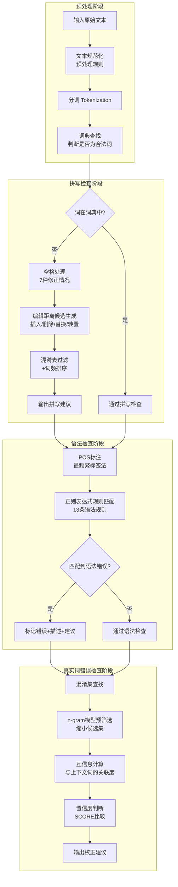

# Vafa spell-checker for detecting spelling, grammatical, and real-word errors of Persian language

---

## **作者信息**

| 作者 | 机构 | 身份/背景 | 领域大牛认定 |
|------|------|----------|-------------|
| Heshaam Faili（通信作者） | 德黑兰大学电气与计算机工程学院 + 基础科学研究所（IPM）计算机科学学院 | 高级教授/项目负责人，同时隶属于德黑兰大学和IPM | 伊朗NLP领域资深研究者，长期从事波斯语NLP研究，但非国际顶级大牛（非ACM/IEEE Fellow级别） |
| Nava Ehsan | 德黑兰大学电气与计算机工程学院 | 博士生/研究人员 | 早期参与者，与Faili合作发表过波斯语语法检查论文（Ehsan & Faili, 2010, 2013） |
| Mortaza Montazery | 德黑兰大学电气与计算机工程学院 | 博士生/研究人员 | 研究人员 |
| Mohammad Taher Pilehvar | 德黑兰大学电气与计算机工程学院 | 博士生（发文时）/ 现为知名NLP研究者 | **波斯语NLP领域上升期研究者**，后续在语义相似度、词义消歧方向发表大量高水平论文，是该团队中学术影响力最大的成员 |

## **团队相关信息：**

该团队是**德黑兰大学电气与计算机工程学院的NLP研究组**，与**伊朗基础科学研究所（IPM）**联合开展研究。由**Heshaam Faili教授带领博士生团队**完成。Faili教授是伊朗本土波斯语NLP领域的资深研究者，长期致力于波斯语计算语言学工具开发。团队中**Mohammad Taher Pilehvar**后续成长为国际知名的NLP学者，在语义相似度、词嵌入等方向有重要贡献（如SemEval任务组织者）。该团队是伊朗波斯语NLP资源建设的主力军之一，本论文即为其代表性的系统开发成果。

---

## **论文发表时间**

| 项目 | 具体日期 | 来源/说明 |
|------|----------|-----------|
| Advance Access在线发表 | 2014年9月8日 | DOI: 10.1093/llc/fqu043 |
| 正式期刊发表 | 2016年，Vol. 31, No. 1 | Digital Scholarship in the Humanities（原LLC，牛津大学出版社出版，EADH学会期刊） |

该论文于**2014年9月在线预发表，2016年正式见刊于Digital Scholarship in the Humanities第31卷第1期**，属于数字人文领域的重要期刊。

---

## **摘要**

随着信息技术的发展，大量电子文档（报纸、邮件、博客、论文等）每日产生。自动拼写和语法检查/校正系统有助于提高文本质量。本文介绍了名为**Vafa Spell-Checker**的波斯语（Farsi）自动拼写、语法和真实词错误检查器的开发。文本错误分为拼写错误、语法错误和真实词错误三类。Vafa是一个**混合系统**，同时采用**基于规则和基于统计的方法**：拼写和真实词错误的检测与校正采用统计方法，语法检查采用规则方法。系统作为Microsoft Word插件发布。F0.5指标分别为：拼写检查0.908、语法检查0.452、真实词错误检查0.187。此外，项目中还生成了多个免费可用的波斯语语言资源。

---

## 一、这篇论文讲了一个什么样的故事？

本文讲述了**为波斯语构建一个一体化、多层次的文本错误检测与校正系统**的完整工程故事。波斯语作为中东地区的主要语言之一，其书写系统具有独特的语言学特征（如从右到左书写、短元音不书写、ZWNJ字符的使用、阿拉伯语借词的复数形式等），使得现成的英语拼写检查工具无法直接适用。

故事线如下：
1. **问题提出**：波斯语缺乏集成的拼写、语法、真实词错误检查工具，现有工具（如Microsoft Word波斯语拼写检查）功能有限，尤其无法处理空格错误和ZWNJ错误。
2. **系统设计**：提出Vafa Spell-Checker，采用混合架构——预处理→拼写检查→语法检查→真实词错误检查的流水线。
3. **资源建设**：构建了大量波斯语语言资源（词典、语料库、混淆表、语法规则、互信息和n-gram信息），并免费开放。
4. **实验评估**：在真实采集的测试集上与Microsoft Word和Virastyar对比，验证了系统有效性，同时揭示了语法检查和真实词错误检查仍需统计方法改进的结论。

---

## 二、本文的核心思想和创新点

### 1. 核心思想

核心思想是**将波斯语文本的三类错误（拼写、语法、真实词）整合到一个统一的混合系统中处理**，针对不同错误类型采用最适合的方法：
- **拼写错误**：统计方法（编辑距离 + 混淆表 + 词频排序）
- **语法错误**：规则方法（正则表达式匹配POS标签序列）
- **真实词错误**：统计方法（互信息 + n-gram语言模型）

这种"**分而治之、混合集成**"的策略避免了一刀切的方法局限，同时系统以Microsoft Word插件形式提供实际可用性。

### 2. 关键创新点

1. **首个集成三类错误检查的波斯语系统**：将拼写、语法、真实词错误检测整合在统一框架中，且作为Word插件可直接使用。
2. **针对波斯语书写特性的专门处理**：
   - 处理ZWNJ（零宽非连接符）相关错误
   - 处理run-on和split空格错误（7种修正情况）
   - 针对波斯语字母的启发式混淆表
3. **大规模免费语言资源开放**：包括波斯语词典（含词频和最频繁POS标签）、预处理规则、混淆表、语法规则、互信息和n-gram信息、真实测试集——这些资源对波斯语NLP社区具有长期价值。
4. **真实词错误检测的双重统计方法**：结合互信息和n-gram模型，通过n-gram预筛选缩小混淆集后再计算互信息，提高效率。
5. **基于规则的可扩展语法检查框架**：13条正则表达式规则覆盖常见波斯语语法错误，支持用户自定义扩展，并提供四层框架（检测→识别→诊断→校正）。

---

## 三、方法是怎么实现的？(How does it work?)

### 1. 架构

Vafa Spell-Checker采用**四阶段流水线架构**，依次执行预处理、拼写检查、语法检查和真实词错误检查，整体流程如下图所示：

**图注**：参考论文 **Figure 1（Vafa spell-checker系统总览图）** 综合绘制。系统采用线性流水线设计，前一阶段输出作为后一阶段输入，各阶段使用不同技术路线。

### 2. 关键算法

#### （1）拼写错误检测与校正

- **错误检测**：通过词典查找（HashMap，O(1)复杂度），未找到的词标记为拼写错误。
- **空格处理**：处理3种空格位移情况（词间缺空格、多余空格、词与前后词粘连），生成7种可能修正。Case 1复杂度O(nᵢ)，Case 2/3复杂度O(1)。
- **候选生成**：基于Damerau-Levenshtein编辑距离，考虑4种单字符错误操作（插入、删除、替换、转置），复杂度O(32nᵢ) = O(nᵢ)。
- **候选过滤与排序**：使用启发式混淆表（存储各错误操作的概率：高/中/低）过滤低概率候选，再用词频排序。
- **ZWNJ处理**：检测词与前后词之间的空格/ZWNJ错误。

#### （2）语法错误检测（规则方法）

- **POS标注**：使用Peykareh标注语料库训练，采用**最频繁标签法**（most frequent tag），准确率约94.65%（四折交叉验证），比HMM更快。550个原始标签合并为40个。
- **规则匹配**：13条正则表达式规则，匹配词和/或POS标签序列。涵盖13类波斯语语法错误（如基数词后用复数名词、动词在属格名词后、主谓不一致等）。
- **主谓一致检查**：处理长距离依赖和pro-drop特性，仅在主语为代词且未省略时检查。
- **四层框架**：检测→识别→诊断→校正，每条规则可独立开关，附带错误描述。

#### （3）真实词错误检测（统计方法）

- **混淆集**：预定义的易混淆词集合，作为候选建议列表。
- **互信息计算**：计算混淆集中每个词与上下文词的互信息MI(cⱼ, w)，选择互信息最高的词。
- **n-gram增强**：使用SRILM工具包从IRNA语料库训练bigram和trigram模型��约1700万bigram、800万trigram），先通过n-gram概率预筛选混淆集，再计算互信息。
- **遗漏词预测**：利用语言模型计算Score(null)和Score(w')，判断是否有遗漏词并预测。

### 3. 关键公式

**公式（3）-（5）：互信息评分**

$$MI(c_j, w) = \log \frac{p(c_j, w)}{p(c_j) \cdot p(w)}$$

$$W = \arg\max_{W_j \in \{w_{-k},...,w_{-1}, w_1,...,w_k\}} \left[ \sum MI(c_j, w) + (2k+1) \cdot \log p(w) \right]$$

其中 $c_j$ 为混淆集中的候选词，$w$ 为上下文词，$k$ 为上下文窗口大小。$(2k+1)\log p(w)$ 项引入词频先验，偏好高频词。

**公式（7）-（8）：选择条件与置信度**

$$\forall x \in S, x \neq w: SCORE(w) > SCORE(x)$$

加入置信系数 $d$ 后：

$$\forall x \in S, x \neq w: SCORE(w) > d \cdot SCORE(x)$$

$d$ 引入置信水平，避免过多误报（false alarm），可由用户调节。

**公式（9）-（12）：n-gram语言模型**

$$P(w_1,...,w_m) = \prod_{i=1}^{m} P(w_i | w_{i-n+1},...,w_{i-1})$$

Trigram模型：$P(w_1,w_2,w_3) = p(w_1) \cdot p(w_2|w_1) \cdot p(w_3|w_1,w_2)$

**公式（13）-（14）：遗漏词检测**

$$Score(null) = \sqrt{LM(w_1 w_2 w_3) \cdot LM(w_2 w_3 w_4)}$$

$$Score(w') = \sqrt[3]{LM(w_1 w_2 w') \cdot LM(w_2 w' w_3) \cdot LM(w' w_3 w_4)}$$

使用几何平均归一化范围，若Score(null) > 所有Score(w')，则认为无遗漏词。

---

## 四、实验效果 (Experimental Results)

### 1. 实验设置

| 项目 | 详情 |
|------|------|
| **训练语料** | IRNA（伊朗通讯社）语料库，约1亿token |
| **标注语料** | Peykareh语料库（Bijankhan, 2006），430+主题，正式新闻和通用文本 |
| **n-gram模型** | SRILM工具包训练，约1700万bigram、800万trigram |
| **测试集** | 从互联网（主要是波斯语博客，约340个网站）采集的真实错误句子 |
| **测试集规模** | 312个拼写错误、745个语法错误、120个真实词错误 |
| **平均句长** | 14.05词 |
| **评测指标** | Detection recall、Correction recall、Precision、F0.5（精度权重为召回的2倍）、MRR |
| **对比系统** | Microsoft Word 2007波斯语拼写检查、Virastyar（Kashefi et al., 2010） |

### 2. 主要结果

**表1：波斯语拼写检查器对比**

| 系统 | Detection | Correction | MRR |
|------|-----------|------------|-----|
| **Vafa spell-checker** | 91% | 75% | **0.844** |
| Virastyar | 97% | 79% | 0.828 |
| Microsoft Word | 89% | 70% | 0.815 |

**表8：Vafa系统总汇结果**

| 模块 | Detection Recall | Correction Recall | Precision | F0.5 |
|------|-----------------|-------------------|-----------|------|
| 拼写检查 | 0.91 | 0.75 | 0.90 | **0.908** |
| 语法检查 | 0.16 | 0.12 | 0.83 | **0.452** |
| 真实词错误检查 | 0.225 | 0.18 | 0.18 | **0.187** |

**表7：真实词错误检查消融**

| 方法 | FP | TN with correction | Detection Recall | Correction Recall | Precision |
|------|-----|--------------------|--------------------|-------------------|-----------|
| 仅互信息 | 84 | 16 | 0.30 | 0.14 | 0.04 |
| 互信息 + n-gram | 93 | 22 | 0.225 | 0.18 | 0.18 |

**核心结论**：
- **拼写检查模块效果优异**：F0.5达0.908，MRR优于Virastyar和Microsoft Word。Virastyar在检出率和校正率上略高，但Vafa在排名质量（MRR）上最优。
- **语法检查模块精度高但召回低**：精度0.83说明检出的错误大部分正确，但召回仅0.16，规则覆盖面不足（仅覆盖43%的错误类型）。
- **真实词错误检查效果有限**：F0.5仅0.187，但n-gram的加入显著提升了精度（从0.04提升到0.18）和校正率（从0.14提升到0.18），代价是检出率略降。
- **n-gram + 互信息组合有效**：n-gram预筛选虽然降低了检出率（从0.30到0.225），但大幅提升了精度（从0.04到0.18），使81%的检出错误被正确修改。

### 3. 消融实验与关键发现

**关键发现**：
- **n-gram模型对真实词错误检查至关重要**：仅用互信息时精度仅4%（大量误报），加入n-gram后精度提升至18%，说明n-gram能有效过滤不合理的上下文搭配。
- **规则方法适合精度优先场景**：语法检查精度0.83表明规则方法误报少，但覆盖面有限——43%的错误类型被规则覆盖，剩余57%（如形容词位置、介词遗漏等）无法用正则表达式检测，需要更深层的句法分析（如PCFG）。
- **主谓一致是最具挑战性的语法错误**：长距离依赖和pro-drop特性使得纯正则表达式无法充分处理。
- **波斯语特有问题影响系统设计**：ZWNJ错误、阿拉伯语借词复数、短元音不书写导致的词义歧义等，是波斯语独有的挑战，英语系统无需考虑。

**实验部分总结**：
本文通过在真实采集测试集上与商业系统（Microsoft Word）和学术系统（Virastyar）的系统对比，**验证了Vafa拼写检查模块的优越性**，同时**坦诚揭示了语法检查和真实词错误检查的局限性**，明确指出这两个模块需要更强大的统计方法（如PCFG、SMT）才能达到实用水平。

---

## 五. 优点与局限性

### ✅ 1. 优点

1. **系统集成度高**：首个将拼写、语法、真实词错误检查整合在统一框架中的波斯语系统，作为Word插件具有实际可用性。
2. **拼写检查效果优异**：F0.5达0.908，MRR优于商业和学术竞品，验证了编辑距离+混淆表+词频排序方法的有效性。
3. **针对波斯语特性深入处理**：专门解决ZWNJ错误、空格错误（7种情况）、阿拉伯语借词复数等波斯语独有问题。
4. **开放丰富的语言资源**：词典（含词频和POS）、预处理规则、混淆表、语法规则、n-gram模型、测试集全部免费开放，对波斯语NLP社区贡献巨大。
5. **系统设计可扩展**：语法规则可独立开关、支持用户自定义扩展；混淆集和置信系数可调。
6. **实验设计扎实**：使用真实采集的测试集（非合成数据），与多个系统对比，消融实验清晰。

### ⚠️ 2. 局限性（研究边界与待解问题）

1. **语法检查召回率极低**（0.16）：规则仅覆盖43%错误类型，大量语法错误（形容词位置、介词遗漏/多余、阿拉伯语规则误用等）无法检测——正则表达式表达能力不足以处理深层句法。
2. **真实词错误检查效果不理想**（F0.5=0.187）：精度仅0.18，检出率仅22.5%，说明混淆集方法和互信息+n-gram的组合仍不足以可靠地检测上下文相关错误。
3. **POS标注方法简单**：仅使用最频繁标签法，未做词义消歧（WSD），对多义词和未知词的处理粗糙（未知词一律标为名词）。
4. **主谓一致检查不完整**：仅处理主语为代词且未省略的简单情况，pro-drop和长距离依赖场景未覆盖。
5. **无深层句法分析**：未使用PCFG或依存句法分析，无法检测需要句法结构信息的错误（如介词遗漏需要论元结构知识）。
6. **训练语料偏新闻域**：IRNA语料库为新闻文本，对博客、社交媒体等非正式文本的覆盖可能不足。
7. **未与统计机器翻译方法对比**：Ehsan和Faili（2013）已提出基于SMT的语法校正框架，但本文未将其整合或对比。
8. **真实词错误混淆集规模有限**：仅依赖预定义混淆集，无法处理开放领域的真实词错误。

---

## 六. 其他

### 第一性原理

从第一性原理来看，本文的核心逻辑是：**不同类型的文本错误具有不同的本质特征，因此需要不同的检测机制**：
- **拼写错误**本质上是**词形层面的偏离**——词不在词典中，可通过编辑距离度量并利用语言统计排序候选。这是最"可计算"的错误类型。
- **语法错误**本质上是**结构规则的违反**——句子违反了语法约束，理论上需要句法解析。但本文用正则表达式近似，这是一种"浅层结构匹配"的妥协——精度高但覆盖有限。
- **真实词错误**本质上是**语义/语用层面的异常**——词虽合法但语境不当，需要理解词与上下文的关系。互信息是一种粗粒度的语义关联度量，n-gram是局部上下文概率模型，二者结合仍无法真正"理解"语义。

这种分层处理的设计哲学——**从浅到深、从精确到近似**——是NLP系统设计的经典范式。论文的实验结果恰好印证了这一原理：越深层的错误（真实词>语法>拼写），越难用浅层方法解决。

### 领域空白

1. **波斯语深层句法分析工具缺失**：论文指出PCFG或依存句法分析是语法检查的必要条件，但2014-2016年波斯语缺乏成熟的句法分析器，这一空白至今仍部分存在。
2. **波斯语词义消歧（WSD）资源不足**：短元音不书写导致的词形歧义（如 /pær/羽毛 vs /por/满）需要WSD技术，但波斯语WSD研究薄弱。FarsNet本体（Shamsfard, 2008）被提出但未被充分利用。
3. **波斯语错误标注语料规模有限**：测试集仅312+745+120=1177个错误，远小于英语同类资源（如CoNLL-2014共享任务），限制了统计方法的训练效果。
4. **缺乏端到端神经方法**：本文发表于2014/2016年，恰逢神经网络NLP兴起前夕。后续的Transformer/BERT类模型可能大幅提升真实词错误检测效果，但波斯语预训练模型的发展相对滞后。
5. **跨错误类型的交互建模空白**：本文将三类错误串行处理（拼写→语法→真实词），但错误之间可能存在交互（如拼写错误导致语法错误），联合建模是未探索的方向。
6. **学习者错误模式研究不足**：论文Future Work指出需收集波斯语学习者数据以扩展错误覆盖，但这一方向尚未充分发展——不同于英语有大量ESL错误语料（如Cambridge Learner Corpus），波斯语学习者错误语料几乎空白。

---
### 论文原文提到的资源获取地址

论文脚注2给出了项目官网：**vafaspellchecker.ir**

该网站在2016年时确实存活（Web Archive有存档），页面显示Vafa是**伊朗通信研究所（ITRC）**与**德黑兰大学NLP实验室**合作的产品，以免费MS Word插件形式提供。但**目前该网站已下线，无法访问**。

### 论文提到的6类资源及当前可获取性

| 资源 | 原始获取方式 | 当前状态 |
|------|-------------|---------|
| ① 波斯语词典（含词频和最频繁POS标签，120万+词型） | vafaspellchecker.ir | ❌ 网站已下线 |
| ② 预处理规则（约20条） | vafaspellchecker.ir | ❌ 网站已下线 |
| ③ 启发式混淆表（不同打字错误类型） | vafaspellchecker.ir | ❌ 网站已下线 |
| ④ 语法检查规则（13条正则表达式，含描述/建议/示例） | vafaspellchecker.ir | ❌ 网站已下线 |
| ⑤ 互信息和n-gram信息（1700万bigram + 800万trigram） | vafaspellchecker.ir | ❌ 网站已下线 |
| ⑥ 真实测试集（312拼写 + 745语法 + 120真实词错误） | vafaspellchecker.ir | ❌ 网站已下线 |
| TMC单语种波斯语语料库（2.5亿词） | 德黑兰大学NLP实验室 ece.ut.ac.ir/nlp/ | ⚠️ 页面重定向，需申请许可 |

---

### 仍可获取的替代资源

1. **FAspell数据集**（非Vafa项目直接产出，但相关）：HuggingFace上有镜像 → https://huggingface.co/datasets/AlirezaF138/FAspell ，包含5050对波斯语拼写错误-正确词对 + 800对OCR错误。

2. **TMC语料库**：德黑兰大学NLP实验室创建，DBpedia记录其外部链接为 `http://ece.ut.ac.ir/en/node/940`（目前重定向中）。据Wikipedia记载，该语料库"free for research use, after obtaining permission from the corpus aggregator"，需向实验室申请。

3. **Peykareh标注语料库**（论文用于POS标注训练）：由Bijankhan等人(2011)构建，是波斯语NLP标准资源，在波斯语NLP社区可获取。

4. **IRNA语料库**（论文用于n-gram训练）：源自伊朗通讯社官网 http://www.irna.ir/ ，论文中使用的版本需联系作者获取。

---

### 建议获取方式

由于原始项目网站已下线，获取论文资源的可行途径：

- **联系通信作者**：Heshaam Faili，邮箱 **hfaili@ut.ac.ir**（论文中明确给出）
- **联系德黑兰大学NLP实验室**：原页面 `http://ece.ut.ac.ir/nlp/`（可尝试直接邮件联系实验室）
- **Web Archive存档**：访问 `https://web.archive.org/web/2016/https://vafaspellchecker.ir/` 查看网站快照（但存档中未发现独立的数据下载页面，主要是软件插件下载）
- **ResearchGate**：论文页面 https://www.researchgate.net/publication/270752606 可直接向作者请求全文或资源

**总结**：论文承诺的6类免费资源在发表时确实通过 vafaspellchecker.ir 提供，但该网站已下线近十年。目前最可靠的获取方式是**直接邮件联系通信作者 Heshaam Faili (hfaili@ut.ac.ir)** 索取资源副本。

---

> 本笔记由 腾讯的workbuddy AI 生成
