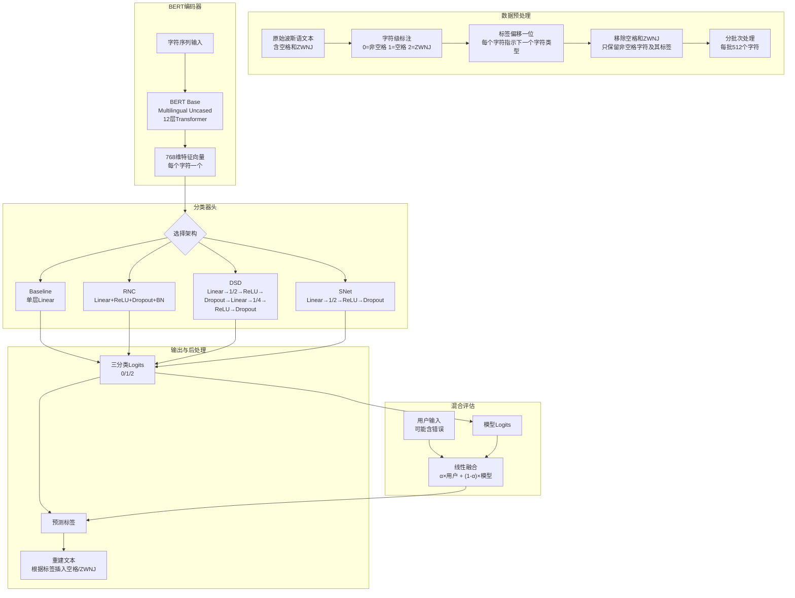

# PerSpaCor: Correcting Space and ZWNJ Errors in Persian Text with Transformer Models
---

## 作者信息
| 作者 | 机构 | 身份/背景 | 领域大牛认定 |
|--------------|------|-----------|-------------|
| Matin Ebrahimkhani | IASBS, Iran | 计算机科学系研究者 | 否 |
| Ebrahim Ansari | IASBS, Iran | 计算机科学系研究者（通讯作者） | 否 |

## **团队相关信息：**

该团队来自**伊朗基础科学高等研究所（IASBS）计算机科学与信息技术系**，是一个专注于波斯语NLP的区域性研究组。Ansari在此前有关于Stack Overflow多标签分类（DeBERTa方法）的发表记录。该团队属于**波斯语NLP细分领域的有贡献研究者**，但尚未达到"国际资深大牛"层级。论文发表于RANLP 2025，属于NLP领域B类会议。

---
## 论文发表时间
| 项目 | 具体日期 | 来源/说明 |
|------|----------|-----------|
| 会议 | RANLP 2025 | 2025年9月8-10日，保加利亚瓦尔纳 |
| DOI | `10.26615/978-954-452-098-4-040` | 正式出版 |
| 状态 | 已正式发表 | RANLP 2025 Proceedings, pp. 325–333 |

论文已正式发表于 **RANLP 2025（Recent Advances in Natural Language Processing）**，该会议是NLP领域具有一定影响力的国际会议。

---
## 摘要

波斯语使用阿拉伯字母书写，全为连写（cursive），其中空格（space）和半空格（ZWNJ, Zero Width Non-Joiner）的正确使用对文本可读性和语义准确性至关重要。然而，由于空格和ZWNJ不可见、键入不便、用户不熟悉规则等原因，波斯语文本中空格/ZWNJ错误极为常见，甚至生成式AI模型也会复制这些错误。

本文提出**四个基于BERT的序列标注分类器架构**（Baseline、ReLU-Norm Classifier、DualStep DropNet Classifier、SimplexNet Classifier），在Bijankhan和Peykare语料库（超过1270万词）上进行微调，将空格/ZWNJ纠错建模为**字符级三分类问题**（非空格、空格、ZWNJ）。最佳模型在直接评估中达到**97.26%宏平均F1**，在融合用户输入的混合评估中进一步提升至**98.38%**。论文还提供了交互式纠错器的实现。

---
## 一、这篇论文讲了一个什么样的故事？
波斯语是一种有超过1亿使用者的重要语言，其书写系统高度依赖连写——词语内部字母相互连接，形成优美的流动线条。然而，现代波斯语数字排版面临一个尴尬的问题：**空格和ZWNJ的正确使用**。空格用于分隔词语，ZWNJ（零宽非连接符）用于阻止词语内部字母的不当连接，例如波斯语现在时态前缀"می"必须用ZWNJ与动词分开。

问题是，空格和ZWNJ是**不可见字符**——打错了也看不出来，导致用户经常省略或误用。更糟的是，ZWNJ在键盘上很难找到，移动端更是如此。这些错误在互联网文本中大量存在，以至于ChatGPT等生成式模型都被"训练坏"了，输出的波斯语文本也经常包含这些错误。
于是，作者提出：**能不能用BERT来做字符级的空格/ZWNJ自动纠错？** 这是一个巧妙的视角转换——不是做传统的"分词"（word segmentation），而是做"纠错"（correction），更贴近实际应用场景（用户通常对自己的文本有一定信心，只需要修正明显的错误，而不是完全重新分词）。

论文设计了一个精巧的**字符级标注方案**：将每个字符标注为"后面跟非空格/空格/ZWNJ"三类标签，然后移除空格和ZWNJ字符本身，让模型只根据可见字符序列预测标签。这种设计利用了波斯语的关键规则——**空格和ZWNJ不能连续出现**，前后必然是非空格字符。
最终，论文提出了四种BERT分类器架构，在1270万词的大规模语料上训练，最好的模型达到了97.26%的准确率，实际可用。

---
## 二、本文的核心思想和创新点
### 1. 核心思想
**将波斯语空格/ZWNJ纠错建模为字符级序列标注问题**，利用BERT的双向注意力机制捕捉上下文依赖，实现高精度的自动纠错。核心思想是"纠错"而非"分割"——面向实际用户场景，在已有文本基础上修正错误，而非从零开始插入空格。
### 2. 关键创新点
1. **新颖的字符级标注方案**：标签偏移一位（shifted one position back），让每个可见字符的标签指示"下一个字符应该是什么类型"，然后移除空格和ZWNJ字符。这种设计利用了"空格/ZWNJ不能连续出现"的规则约束，简化了模型的学习任务。
2. **四种分类器架构的系统性探索**：
   - **Baseline**：单层线性层
   - **ReLU-Norm Classifier（RNC）**：全连接+ReLU+Dropout+BatchNorm
   - **DualStep DropNet Classifier（DSD）**：两级降维（1/2→1/4）+每步ReLU+Dropout
   - **SimplexNet Classifier（SNet）**：单层降维（1/2）+ReLU+Dropout
3. **混合评估（Hybrid Evaluation）**：提出融合用户输入的方法——将模型logits与用户输入（可能包含错误）线性组合，系数α控制融合权重。在注入人工错误（非空格5%、空格10%、ZWNJ 40%错误率）后，混合评估F1提升至98.38%。
4. **大规模高质量数据集**：对Bijankhan和Peykare语料（1270万词）进行了系统的预处理、标注和修正，对齐2015年波斯语正字法标准，并公开数据集供研究使用。
---
## 三、方法是怎么实现的？(How does it work?)
### 1. 架构

**图注**：基于论文 Figure 1（标注方案）、Figure 2（四种分类器架构）及 Section 4-5 综合绘制。
### 2. 关键算法
**字符级标注算法**（论文核心预处理流程）：
1. 将文本拆分为字符序列，每个字符标注为0（非空格）、1（空格）、2（ZWNJ）
2. 标签向后偏移一位：位置i的字符的标签表示"位置i+1应该是哪种字符"
3. 删除所有空格和ZWNJ字符及其对应的标签
4. 剩余序列：仅包含可见字符 + 每个可见字符的"下一个字符类型"标签
**优点**：利用了"空格/ZWNJ不能连续出现"的语言规则，简化了模型训练；后处理反向重建非常简单。
### 3. 关键公式
**混合评估的线性融合公式**：
$$P_{final} = \alpha \cdot P_{user} + (1 - \alpha) \cdot P_{model}$$
其中：
- $P_{model}$：模型输出的三分类logits
- $P_{user}$：用户输入对应标签的one-hot编码
- $\alpha$：融合系数，默认0.5（等权重），$\alpha=0$为纯模型输出，$\alpha=1$为纯用户输入
**人工错误注入**：
- 非空格字符错误率：5%
- 空格错误率：10%（替换为非空格或ZWNJ）
- ZWNJ错误率：40%（替换为空格或非空格）
---
## 四、实验效果 (Experimental Results)
### 1. 实验设置
- **数据集**：Bijankhan + Peykare语料库，共1270万词，训练/验证/测试=80/10/10
- **预训练模型**：6个候选（bert-base-multilingual-uncased/cased、ParsBERT、bert-fa-zwnj-base、roberta-fa-zwnj-base、charbert-roberta-wiki）
- **训练参数**：学习率 $2\times10^{-5}$，10 epoch，batch size 512
- **评估指标**：精确率、召回率、F1（按类别和宏平均）
- **评估方式**：
  - **直接评估**：模型完全自主生成空格/ZWNJ
  - **混合评估**：模型输出与用户输入融合，模拟真实使用场景
### 2. 主要结果
**预训练模型对比**（Baseline架构）：
| 预训练模型 | Precision | Recall | F1 Score |
|-----------|-----------|--------|----------|
| **bert-base-multilingual-uncased** | **0.9652** | **0.9680** | **0.9666** |
| bert-base-multilingual-cased | 0.9640 | 0.9647 | 0.9643 |
| ParsBERT | 0.9605 | 0.9631 | 0.9618 |
| bert-fa-zwnj-base | 0.9571 | 0.9536 | 0.9553 |
| roberta-fa-zwnj-base | 0.9564 | 0.9543 | 0.9554 |
| charbert-roberta-wiki | 0.9530 | 0.9518 | 0.9524 |
**核心结论**：
- 令人惊讶的是，**多语言BERT（uncased）表现优于波斯语专用BERT**（ParsBERT、bert-fa-zwnj-base），说明多语言预训练在跨语言泛化方面有优势
- 波斯语专用模型（ParsBERT等）虽然领域更相关，但可能是预训练数据量不足导致泛化能力略逊
- 不同预训练模型之间的差距不大（F1范围0.9524-0.9666），说明该任务相对结构清晰，各种BERT变体都能较好地处理
**分类器架构对比**（直接评估）：
| 架构 | 非空格F1 | 空格F1 | ZWNJ F1 | 宏平均F1 |
|------|----------|--------|---------|-----------|
| Baseline | 0.9950 | 0.9854 | 0.9195 | 0.9666 |
| ReLU-Norm | 0.9960 | 0.9887 | 0.9227 | 0.9691 |
| DualStep DropNet | 0.9960 | 0.9892 | 0.9318 | **0.9724** |
| **SimplexNet** | **0.9961** | 0.9891 | 0.9326 | **0.9726** |
**混合评估**（α=0.5，含人工错误注入）：
| 架构 | 非空格F1 | 空格F1 | ZWNJ F1 | 宏平均F1 |
|------|----------|--------|---------|-----------|
| Baseline | 0.9965 | 0.9903 | 0.9511 | 0.9793 |
| ReLU-Norm | 0.9972 | 0.9926 | 0.9520 | 0.9806 |
| DualStep DropNet | 0.9971 | 0.9928 | 0.9609 | 0.9836 |
| **SimplexNet** | **0.9972** | 0.9927 | 0.9615 | **0.9838** |
### 3. 消融实验与关键发现
**关键发现**：
1. **ZWNJ是最难分类的类别**：在所有设置下，ZWNJ的F1（约0.92-0.96）远低于空格（约0.99）和非空格（约0.996），原因是ZWNJ在训练数据中占比极低（仅约1.4-1.5%），且其使用规则更为复杂和微妙。
2. **更深的分类器头有帮助，但边际收益递减**：DualStep DropNet（两级降维）相比SimplexNet（单级降维）的增益非常有限（0.9724 vs 0.9726），说明BERT的表示能力已经很强，简单的分类器头就足够。
3. **混合评估大幅提升性能**：加入用户输入后，宏平均F1从97.26%提升到98.38%，尤其是ZWNJ F1从0.9326提升到0.9615（+2.9个百分点），体现了"人机协作"的实际价值。
4. **多语言BERT优于波斯语专用BERT**：这是一个反直觉的发现，可能原因是多语言BERT在更多语言数据上训练，学到了更通用的字符级模式；而波斯语专用BERT的预训练数据可能不够大或不够多样。
5. **任务相对"简单"但"实用"**：三分类任务结构清晰，数据标注质量高，使得即使是Baseline也能达到96.66%的F1。但该任务的实用价值极高——波斯语乃至所有使用ZWNJ的语言（如乌尔都语、普什图语等）都存在相同问题。
**实验部分总结**：本文通过系统的预训练模型选型、四种分类器架构的对比、直接评估与混合评估的双重验证，**全面证明了BERT在波斯语空格/ZWNJ纠错任务上的有效性**，并提供了实用的交互式纠错方案。
---
## 五、优点与局限性
### ✅ 优点
1. **问题定义清晰且实用性强**：聚焦一个被忽视但影响广泛的实际问题（波斯语空格/ZWNJ错误），且直接面向用户场景（纠错而非分割），有明确的应用价值。
2. **标注方案精巧**：标签偏移+去除空格/ZWNJ的设计巧妙地利用了语言规则约束，简化了模型学习任务，且后处理反向重建非常简单。
3. **实验设计系统全面**：6种预训练模型×4种分类器架构×2种评估方式，构成了完整的消融实验矩阵，结论可靠。
4. **数据集公开**：将预处理后的1270万词标注数据集公开在HuggingFace上，支持可复现研究。
5. **混合评估方案贴近实际**：提出用户输入融合机制，模拟真实使用场景，为实际部署提供了参考。
### ⚠️ 局限性
1. **仅限波斯语**：方法虽然原则上可推广到其他使用ZWNJ的语言（如乌尔都语、普什图语、库尔德语等），但论文未做任何跨语言验证。
2. **分类器架构创新有限**：四种分类器架构（Baseline、RNC、DSD、SNet）本质上都是全连接层的不同排列组合，没有引入注意力增强、跨层融合等更先进的机制。
3. **缺乏消融实验对标注方案的验证**：标签偏移方案是否确实优于其他标注方案（如直接三分类）？论文没有对此进行消融实验。
4. **人工错误注入的合理性存疑**：混合评估中ZWNJ错误率设为40%是合理的（因为ZWNJ确实最难正确使用），但非空格5%和空格10%的错误率缺乏实证依据，且这些错误是"随机"注入的，可能与真实用户的错误分布不一致。
5. **未考虑上下文感知的α值**：混合评估中α固定为0.5，但实际场景中用户对不同部分的置信度不同——有的地方用户很确定，有的地方用户不确定。动态α值会更实用。
6. **没有与最新LLM对比**：论文未比较GPT-4、Claude等现代LLM在相同任务上的表现，无法回答"大模型时代还需要专门的纠错模型吗"这个问题。
7. **计算效率未讨论**：BERT-Base在CPU上的推理速度如何？能否做到实时纠错？这对于实际部署至关重要。
---
## 六、其他
### 第一性原理
**为什么波斯语空格/ZWNJ纠错是必要的？**
波斯语全为连写，字母在词内相互连接。空格分隔词语，而ZWNJ阻止词内字母的不当连接。这两个字符是"不可见"的——打错了也看不出来，但错了会改变词语的视觉形态甚至语义。
从第一性原理出发，这个问题可以分解为：
1. **输入**：一串可见字符
2. **输出**：在正确位置插入空格和ZWNJ
3. **约束**：空格/ZWNJ不能连续出现（前后必为非空格字符）
4. **信号**：上下文信息（形态学、句法、语义）决定每个位置应该是哪种字符
这个问题的本质是**从上下文推断隐式分隔符**——类似于给一段没有标点的中文文本加标点，但更简单（只有三类标签）也更微妙（ZWNJ的规则更精细）。
**为什么BERT适合这个任务？**
- 双向注意力能同时捕捉左右上下文
- 预训练已学到字符级的统计规律
- 序列标注是BERT的强项（类似NER任务）
### 领域空白
1. **跨语言泛化**：该方法能否直接迁移到其他使用ZWNJ的语言（如乌尔都语、普什图语、信德语等）？已知这些语言存在完全相同的问题，但尚无相关工作。
2. **轻量化部署**：BERT-Base对于移动端或浏览器端部署仍然偏重，知识蒸馏或模型量化能否在保持精度的同时大幅减小模型体积？
3. **与生成式LLM的协同**：能否将BERT纠错器作为后处理模块，修正GPT/Claude等模型输出的波斯语文本中的空格/ZWNJ错误？这比重新训练LLM更经济。
4. **动态α值的混合纠错**：根据用户输入置信度（如用户是否手动输入了ZWNJ）自适应调整α值，而非固定0.5。
5. **扩展到其他不可见字符的纠错**：类似思路能否应用于其他语言中的"不可见但重要"的字符，如阿拉伯语的Tatweel（延展符）、中文的零宽空格等？
6. **端到端的生成式纠错**：将问题从"分类"转变为"生成"——输入一段有错误的波斯语文本，直接输出修正后的文本，而非逐字符标注。这可能更好地处理全局一致性。
7. **实时纠错与输入法集成**：将模型嵌入波斯语输入法，在用户打字时实时提示空格/ZWNJ建议，而非事后批量纠错。
---

论文中标注的数据集地址为：
**https://huggingface.co/datasets/PerSpaCor/bijankhan-peykare-annotated**
该数据集包含句子、字符列表、POS标注和空格标签，供研究使用。

---

> 本笔记使用 Deepseek AI 生成

