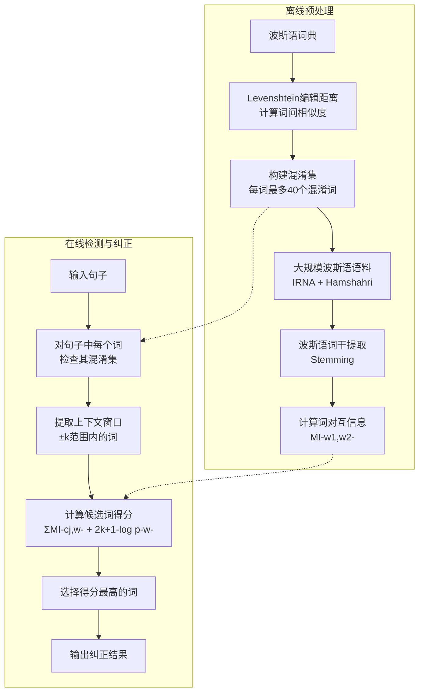

# Detection and Correction of Real-Word Spelling Errors in Persian Language

---

## **作者信息**

| 作者 | 机构 | 身份/背景 | 领域大牛认定 |
|------|------|-----------|-------------|
| Heshaam Faili | 德黑兰大学（University of Tehran），电气与计算机工程学院 | 伊朗德黑兰大学教员，从事自然语言处理（NLP）研究，发表多篇波斯语处理的论文 | 非领域大牛。该论文发表于2010年，作者当时在德黑兰大学从事波斯语NLP研究，属于**区域性语言处理的研究者**，在国际NLP顶级圈子中不算知名人物。 |

---

## **团队相关信息**

该论文为**Heshaam Faili 独立完成**，无团队协作。作者来自**德黑兰大学电气与计算机工程学院**，该机构在伊朗国内属于顶尖水平，但在国际NLP领域并非顶级研究组。论文发表于 NLPKE-2010（第6届自然语言处理与知识工程国际会议），这是一个区域性会议，非ACL/EMNLP/NAACL等顶级会议。

---

## **论文发表时间**

| 项目 | 具体日期 | 来源/说明 |
|------|----------|-----------|
| 会议举办 | 2010年8月21-23日 | IEEE会议记录 |
| 论文出版 | 2010年 | IEEE Xplore，DOI: 10.1109/NLPKE.2010.5587806 |
| 页数 | 4页（短论文） | Proceedings of NLPKE-2010, pp. 1-4 |

该论文**2010年8月发表于NLPKE-2010会议**，是一篇4页短论文，已正式发表并被IEEE Xplore收录。

---

## **摘要**

本文提出了一种基于**波斯语词汇互信息（Mutual Information）**的统计方法，用于检测和纠正波斯语文本中的**真实词拼写错误**（real-word spelling errors）。这类错误的特点是：拼写错误恰好构成词典中的另一个合法词（如将"form"误拼为"from"），因此传统拼写检查器无法检测。

方法的核心思路是：
1. 利用Levenshtein编辑距离为每个波斯语词构建"混淆集"（confusion set）
2. 基于贝叶斯框架，利用词汇互信息（MI）对上下文中的候选词进行评分
3. 选择得分最高的词作为纠正结果

实验在100句测试句上（每句含1个真实词错误），精确率约80.5%，召回率87%。

---

## 一、这篇论文讲了一个什么样的故事？

这篇论文解决的是**波斯语中的"真实词拼写错误"（real-word spelling errors）问题**。

所谓真实词拼写错误，是指用户想打单词A，但由于拼写失误打出了单词B，而B恰好也是一个合法的词典词。比如英文中想打"peace"却打成了"piece"——两个词拼写都正确，但语义完全不同。传统拼写检查器（如Word的红色波浪线）只能检测"非词错误"（non-word errors），对这种错误完全无能为力，因为两个词都在词典里。

作者指出，在2010年之前，**所有真实的真实词拼写纠错方法都只针对英语**，波斯语领域完全空白。于是作者将英语中已有的统计方法（基于Gale & Church的互信息框架和Golding的Winnow方法）迁移到波斯语上，并根据波斯语的特点做了适配（如处理波斯语动词的高度屈折变化）。

简单来说，这是一个**"将成熟方法移植到新语言"的应用型工作**，创新性不高，但填补了波斯语NLP的一个空白。

---

## 二、本文的核心思想和创新点

### 1. 核心思想

**用"互信息"衡量词与上下文的关联强度，以此判断哪个词才是作者真正想写的。**

直觉上，如果一个词与周围的上下文词"经常一起出现"（即互信息高），那么它更可能是正确的词。例如，在句子"我去医院看___"中，如果候选词有"病"和"饼"，"病"与"医院"的互信息更高，因此"病"更可能是正确的词。

### 2. 关键创新点

本论文的创新点非常有限，主要体现在：

- **首次将真实词拼写纠错方法应用于波斯语**：这是该论文最大的贡献——填补了波斯语领域的空白。
- **针对波斯语特点做了适配**：包括（1）在构建混淆集时考虑了波斯语字母的特殊性；（2）在计算互信息之前对波斯语动词进行了词干提取（stemming），以缓解波斯语高度屈折变化带来的数据稀疏问题。
- **使用了波斯语本土语料**：训练数据来自IRNA（伊朗伊斯兰共和国通讯社）20万篇文章和Hamshahri（伊朗著名报纸）190万句子。

---

## 三、方法是怎么实现的？(How does it work?)

### 1. 架构生成

本方法分为**离线预处理阶段**和**在线检测/纠正阶段**，整体流程如下图所示：



**图注**：参考论文第3节（Correction Method）和第4节（Persian Mutual Information）综合绘制。方法基于Gale et al. (1994)的贝叶斯框架，核心改动是将原始的概率乘积替换为互信息求和。

### 2. 关键算法

**算法分为两步：混淆集构建 + 基于互信息的候选词评分。**

**步骤1：混淆集构建**
- 对波斯语词典中每个词，计算其与其他所有词的Levenshtein编辑距离
- 若编辑距离 ≤ 1（即最多1次插入/删除/替换），则互相加入对方的混淆集
- 每个混淆集最多保留40个词

**步骤2：候选词评分与纠正**
- 对输入句子中的每个词*w*，在其混淆集（含自身）中，选择使以下得分最大的候选词：

```
Score(w) = Σ_{j∈[-k,-1]∪[1,k]} MI(cⱼ, w) + (2k+1)·log p(w)
```

其中：
- *cⱼ* 是目标词*w*前后*k*窗口内的上下文词
- *MI(cⱼ, w)* 是*cⱼ*与*w*的互信息
- *p(w)* 是词*w*的语料中出现概率

**步骤3：上下文词筛选**
- 对每个上下文词*c*，使用卡方检验（chi-square test）判断其是否对区分混淆集中的词有显著贡献
- 无显著贡献的上下文词（如停用词、功能词）被丢弃

### 3. 关键公式

**核心公式（从贝叶斯推导到互信息形式）：**

起点：选择使后验概率最大的候选词
```
ŵ = argmax_w p(w | c₋ₖ, ..., c₋₁, c₁, ..., cₖ)
```

应用贝叶斯公式并忽略常量分母：
```
ŵ = argmax_w p(c₋ₖ, ..., c₋₁, c₁, ..., cₖ | w) · p(w)
```

独立性假设简化：
```
ŵ = argmax_w [Π_{j} p(cⱼ | w)] · p(w)
```

取对数：
```
ŵ = argmax_w Σ_{j} log p(cⱼ | w) + log p(w)
```

**关键一步**：利用互信息定义 *MI(X,Y) = log [p(x,y) / (p(x)·p(y))]*，推导出：
```
log p(cⱼ | w) = MI(cⱼ, w) + log p(cⱼ)
```

代入得最终公式：
```
ŵ = argmax_w [Σ_{j} MI(cⱼ, w)] + (2k+1)·log p(w)
```

**互信息计算**（基于语料共现统计）：
```
MI(w₁, w₂) = log [p(w₁, w₂) / (p(w₁)·p(w₂))]
```

---

## 四、实验效果 (Experimental Results)

### 1. 实验设置

- **训练语料**：IRNA（伊朗通讯社）20万篇文章 + Hamshahri（伊朗报纸）190万句子
- **测试数据**：从IRNA语料中选择100句长度≤15词的句子（不含训练集）
- **错误注入**：每句随机选1个词，从混淆集中随机替换为另一个词
- **评估指标**：
  - 健全性（Soundness）：用无错句子测试，看系统是否误报
  - 完备性（Completeness）：用含错句子测试，看系统能否检测并纠正
  - 精确率（Precision）和召回率（Recall）

### 2. 主要结果

| 实验类型 | 正确接受 | 标为错误 | 正确纠正 | 错误纠正 | 忽略 |
|----------|---------|---------|---------|---------|------|
| 健全性评估（无错输入） | 79% | 21% | — | — | — |
| 完备性评估（含错输入） | — | — | 79% | 8% | 13% |

**核心结论**：
- **精确率 ≈ 80.5%**，**召回率 ≈ 87%**
- 在无错句子上，79%的句子被正确判断为"无错误"，21%被误报（假阳性偏高）
- 在含错句子上，79%的错误被正确检测并纠正，13%被忽略（漏检），8%被检测到但纠正错误
- 总体而言，方法在波斯语上初步有效，但距实用水平（>95%）仍有较大差距

### 3. 消融实验与关键发现

本论文**没有**进行消融实验。作为一篇4页短论文，实验部分非常简略，缺乏以下分析：
- 不同窗口大小*k*对性能的影响
- 混淆集大小阈值的影响
- 词干提取（stemming）的消融
- 卡方检验筛选上下文词的效果
- 不同错误类型（如动词误用 vs 名词误用）的细分分析

**实验部分评价**：实验设计极为简陋。100句测试集样本量太小，且错误是人工注入的（每条句子只含一个错误），与真实场景中多错误、多类型的分布不符。缺乏统计显著性检验，也缺乏与任何基线方法的对比（如朴素贝叶斯、词频基线等）。

---

## 五、优点与局限性

### ✅ 优点

1. **填补空白**：首次将真实词拼写纠错方法应用于波斯语，具有开创性意义。
2. **方法清晰**：贝叶斯→互信息的推导过程清晰，公式完整，易于复现。
3. **语言适配**：针对波斯语高度屈折变化的特点，引入了词干提取步骤，体现了对目标语言特性的关注。
4. **使用大规模本土语料**：IRNA和Hamshahri是波斯语领域的重要语料资源，训练数据量充足。

### ⚠️ 局限性（研究边界与待解问题）

1. **创新性极低**：方法本质上是将Gale et al. (1994)和Golding等人的英语方法直接移植到波斯语，几乎没有方法论创新。互信息替换概率乘积这一步也是Gale et al. (1994)提出的。
2. **实验设计薄弱**：
   - 仅100句测试集，样本量极小
   - 人工注入错误，非真实错误，生态效度低
   - 每句仅一个错误，过于简化
   - 无基线对比，无消融实验，无统计检验
3. **假阳性率高**：21%的无错句子被误报为错误，实用性差。
4. **混淆集构建粗糙**：仅基于编辑距离≤1，未考虑发音相似性、键盘布局等因素。
5. **未与SOTA对比**：当时英语已有99%准确率的方法（Carlson et al., 2001），本文80.5%的精确率差距明显，且未分析原因。
6. **缺乏波斯语特有挑战的深入讨论**：如波斯语从右向左书写、字母连写、短元音省略等实际困难未涉及。

---

## 六、其他

### 第一性原理

真实词拼写错误检测的本质是一个**词义消歧（Word Sense Disambiguation, WSD）问题**：给定一个歧义位置（可能是错误词），从有限的候选词集合（混淆集）中选择语义上最匹配上下文的那一个。

从信息论角度看，**互信息（MI）**衡量的是两个随机变量之间的依赖程度。在本文的语境中，*MI(cⱼ, w)* 衡量的是"上下文词*cⱼ*的出现"与"目标词*w*的出现"之间的统计关联强度。如果对某个候选词*w*，它与所有上下文词的互信息之和最大，那么这个候选词在统计学上最"自然"、最"合理"。

这一原理的底层假设是：**语言中真正相关的词对会在语料库中频繁共现**。这是分布语义学（Distributional Semantics）的基本思想——"You shall know a word by the company it keeps"（Firth, 1957）。

### 领域空白

1. **波斯语NLP基础设施匮乏**：2010年时波斯语领域缺乏高质量的标注语料、预训练词向量、语言模型等，这直接限制了方法的上限。论文中使用的互信息本质上是一种基于共现统计的粗糙语义度量，在当时条件下是合理的，但与后来的词嵌入方法相比已显落后。

2. **深度学习方法尚未介入**：2010年深度学习尚未在NLP中爆发，本文的方法属于传统的统计NLP方法。后续研究者可以将波斯语BERT、词嵌入等预训练模型引入该任务，有望大幅提升性能。

3. **缺乏波斯语真实错误数据集**：至今（2026年）波斯语领域仍缺乏大规模的、标注了真实词拼写错误的公开数据集，这是该方向最关键的瓶颈。

4. **多错误同时检测**：本文假设每句只有一个错误，但真实场景中一句话可能包含多个错误，且错误之间可能存在依赖关系，这是一个开放问题。

---

> 本笔记由Deepseek AI 生成
