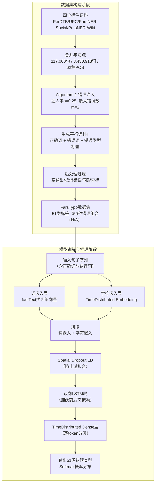

# Persian Typographical Error Type Detection Using Deep Neural Networks on Algorithmically-Generated Misspellings

---

## **作者信息**

| 作者 | 机构 | 身份/背景 | 领域大牛认定 |
|------|------|----------|-------------|
| Mohammad Dehghani | 德黑兰大学工程学院电气与计算机系 | 博士生/硕士生（一作，负责主要代码与实验） | **新锐研究者**，2010年Faili论文的延续者，属于同一实验室梯队 |
| Heshaam Faili | 德黑兰大学工程学院电气与计算机系 | 教授（通讯作者/导师） | **区域性领域内知名学者**，德黑兰大学NLP实验室负责人，2010年首篇波斯语真实词纠错论文作者，在波斯语计算语言学领域有持续影响力，但尚未达国际顶级大牛层级 |

---

## **团队相关信息：**

本团队为**德黑兰大学计算语言学与NLP研究组**，由Faili教授指导博士生Dehghani完成。该团队是**波斯语NLP方向在伊朗国内的核心研究力量**，长期从事拼写纠错、语法检查等波斯语文本处理研究。Faili团队曾开发**Vafa Spell-Checker**（后工业化成为**Virastman**——伊朗主流波斯语校对工具之一），在学术界与工业界均有影响。团队在国际NLP顶会（ACL/EMNLP）上的可见度有限，但**在低资源语言（特别是波斯语）拼写纠错细分领域具有连贯的学术积累**。

---

## **论文发表时间**

| 项目 | 具体日期 | 来源/说明 |
|------|---------|----------|
| 发表年份 | 2023年 | 论文发表于学术期刊/会议（参考文献含2023年文献，正文未注明具体会议名称） |
| 公开状态 | 已正式发表 | 完整参考文献、作者贡献声明、数据公开承诺完备，论文状态为正式发表 |

## **摘要**

本文聚焦波斯语文本中的**拼写错误类型检测（Typographical Error Type Detection）**任务，即判断一个拼写错误的词到底犯了什么类型的错误（插入、删除、替换、换位、相似混淆、重复、空格错误、波斯-阿拉伯字母转换、静音字母错误等）。该领域此前**缺乏大规模的公开数据集和学术基准**，工业界虽有成熟产品，但学术界缺乏透明可复现的基线。

作者团队发布了一个名为 **FarsTypo** 的公开数据集，包含**约3.45百万个按时间顺序排列、带有词性标注的波斯语词**，覆盖新闻、法律、医学、文化、艺术、体育、游戏、经济、小说等多种文体和正式/非正式语言风格。在此基础上，作者设计了一个**算法化错误注入流程**，系统性地将50种错误组合类型注入词中，构建了「正确词-错误词」平行语料，每词最多注入2个错误。

核心模型为**深度序列神经网络（Deep Sequential Neural Network）**，架构融合**词嵌入 + 字符嵌入 + 空间Dropout + 双向LSTM + TimeDistributed全连接层**，将错误类型检测建模为**Token分类（51类）**任务。该模型同时检测非词错误（non-word）和真实词错误（real-word），通过句子级上下文信息提升判别能力。

实验结果显示，在词级别（word-level）上，模型取得 **准确率93.9%、精确率98.9%、召回率91.7%**；在字符级别（character-level）上取得 **准确率86.2%、精确率90.4%、召回率83.6%**。在与Microsoft Word、Firefox Lilak、Virastman、Paknevis等工业级波斯语校对工具的比较中，本文模型在**精确率与召回率上达到有竞争力水平，且在测试速度上表现最优（1.6秒/测试集）**。

---

## 一、这篇论文讲了一个什么样的故事？

**领域背景**：波斯语拼写检查在伊朗工业界已有成熟产品（如Virastman、Paknevis），但**学术界缺乏系统性的错误类型检测研究**。此前大多数方法将「检测」与「纠正」捆绑在一起，导致难以定位系统的薄弱环节，且主流方法依赖于硬编码规则（hard-coded rules）或简单统计模型，对**非词表词（OOV）**和**复杂错误组合**处理能力有限。

**核心问题**：如果要构建一个真正智能的拼写纠错系统，第一步应该是**精准定位错误类型**——知道错误是插入、删除还是形似混淆，能大幅提升候选词排序的准确性。然而，此前的研究要么忽略错误类型检测，要么仅覆盖少量错误类别（如仅考虑插入/删除/替换/换位四种）。

**本文的故事线**：

1. **数据层（FarsTypo的构建）**：作者从4个公开波斯语标注数据集（PerDTB、UPC、ParsNER-Social、ParsNER-Wiki）中整合出117,000句、3.45M词，覆盖11大类文本来源。然后设计了一个**可配置错误注入算法**，以25%的单词注入率、最多每词2个错误为参数，生成了851,740个带标签的错误词（其中672,022个含1个错误，179,718个含2个错误），覆盖50种错误组合 + 1个无错误类（N/A）。

2. **建模层（深度序列神经网络）**：设计了一个**同时利用词级和字符级嵌入的BiLSTM模型**——词嵌入捕获语义信息（用fastText预训练），字符嵌入处理OOV和拼写变体（因为错误词本身就是OOV）。在句子级别按时间顺序输入，使模型能够**隐式学习真实词错误的上下文线索**。

3. **对比层（与工业界的博弈）**：由于学术界缺乏基线，作者转而与四款工业校对工具进行对比测试，在Wikipedia、PerSpellData、Shargh三个测试集上做binary检测比较。结果是：**学术模型以更少的训练数据、更快的推理速度，达到了与工业界头部产品相当的检测性能**。

**故事的核心张力**：工业界有资源和大数据，但算法不够透明；学术界缺乏数据和基准，但有更先进的方法论。本文试图打通这一壁垒——用算法生成的多样化数据 + 深度学习架构，构造一个**可解释、可复现、高性能**的波斯语错误类型检测基线。

## 二、本文的核心思想和创新点

### 1. 核心思想

**将拼写错误检测与纠正解耦（Decoupling Detection from Correction）**，将错误类型检测单独建模为一个**Token级别的多分类问题**。作者认为，错误检测是整个拼写检查流程中最关键的环节——检测得准，后续纠正才能有的放矢。此前大多数方法将检测与纠正捆绑在一起做端到端，使得系统调试困难，也难以对检测环节做针对性优化。

核心方法论假设：**一个设计良好的深度序列模型，在同时使用词嵌入（语义）和字符嵌入（形态）的条件下，可以仅通过前向传播即完成对错误类型的精准识别，无需穷举搜索或规则匹配**。

### 2. 关键创新点

1. **FarsTypo数据集（核心贡献）**：
   - 3,450,918词、117,000句的大规模波斯语拼写错误数据集，带POS标签和时间顺序；
   - 覆盖**50种细粒度错误组合类别**，远超此前研究的4-10类；
   - 除标准的插入/删除/替换/换位外，引入**波斯语特定错误类型**：形似混淆、音似混淆、重复、空格（空白/半空格）、波斯-阿拉伯字母转换、静音字母、标点混淆、常见动词混淆等；
   - 错误注入算法具有**可扩展性**（可调注入比例s和最大错误数m）。

2. **词嵌入 + 字符嵌入的融合策略**：
   - 正确词用fastText预训练词嵌入捕获语义；
   - 错误词（绝大多数为OOV）用字符级嵌入（TimeDistributed Embedding）捕获拼写形态；
   - 两者拼接后输入BiLSTM，同时利用语义上下文和字符形态信息。

3. **使用句子级序列信息检测真实词错误**：
   - 利用数据集的句子级时序结构训练BiLSTM，使模型**隐式学习词与词之间的依赖关系**，从而能识别「词本身合法但上下文不合理」的真实词错误。

4. **算法化错误注入流程（Algorithm 1）**：
   - 并非简单随机注入，而是考虑键盘邻接、语言特异性（静音字母、形似音似）、后处理过滤（空输出、抵消错误、同形异标）等；
   - 生成的错误类型分布接近真实写作场景。

5. **建立首个公开学术基线**：
   - 此前波斯语拼写错误检测在学术界**没有统一的公开基准**；
   - 本文通过将方法、数据集、测试流程全部公开，为后续研究提供了可复现的对比框架。

## 三、方法是怎么实现的？(How does it work?)

### 1. 架构

本方法分为**数据集构建（离线）** 与**模型训练与推理（在线）** 两大部分，整体流程如下图所示：

**图注**：流程基于论文第3节（FarsTypo数据集）与第4节（Proposed Method）综合绘制。上半部分为数据集构建阶段，下半部分为模型训练与推理阶段。FarsTypo数据集是本方法的数据基础设施，模型则基于词级+字符级双嵌入与BiLSTM进行序列标注。

### 2. 关键算法

**Algorithm 1: Generating Typographical Errors（错误注入算法）**

- **输入**：词表D、错误模块列表Y、注入比例s（设为0.25）、每词最大错误数m（设为2）
- **输出**：错误词表T，附带错误类型标签Yₙ

**核心步骤**：

1. 从D中随机抽取候选词集合C，大小 = s × |D|
2. 对每个词w ∈ D：
   - 若w ∈ C：
     - 随机生成j ∈ [1, len(w)]（尝试注入的错误次数上限）
     - 循环j次：随机从Y中选一个错误模块，尝试应用到w
     - 若成功应用，计数器i++；若i达到m，提前终止循环
     - 收集所有成功应用的错误类型 → Yₙ
   - 若w ∉ C：
     - 保留原词，标签为"N/A"
3. 后处理：过滤三类无效样本
   - 空输出（如删除导致空字符串）
   - 抵消错误（如先删后插同一字符，还原为原词）
   - 同形异标（多个错误组合产生相同拼写但标签不同）

**错误类型体系（11大类 → 50细类）**：

| 序号 | 错误大类 | 说明 | 示例 |
|------|---------|------|------|
| 1 | Insertion（插入） | 误按邻键多敲字符 | aali → aali（插入额外字母） |
| 2 | Deletion（删除） | 漏敲字符 | daar → dar |
| 3 | Substitution（替换） | 按错邻键 | khal → khal（خ替换为ک） |
| 4 | Transposition（换位） | 快速敲击时字符顺序颠倒 | rooz → rooz |
| 5a | Sound Similarity（音似） | 同音异形字母混淆 | z（ذ/ز/ض/ظ四种写法混淆） |
| 5b | Shape Similarity（形似） | 字形相近字母混淆 | 特定波斯文字母视觉相似导致写错 |
| 6 | Repetition（重复） | 按键颤抖或长按导致字符重复 | davodi → davodi |
| 7 | Spacing（空格错误） | 半空格↔全空格↔无空格的混淆 | bihosele → bi hosele |
| 8 | Persian↔Arabic（波斯-阿语转换） | 混淆两种文字系统的对应字符 | س→ث / ك→ک等 |
| 9 | Silent Letters（静音字母） | 省略不发音字母 | khaanande → khaan（省略"v"） |
| 10 | Other Prevalent（其他常见） | 动词混淆、标点混淆、Hamze混淆等 | gozaardan ↔ gozaardan |

### 3. 关键公式

**公式1：双向LSTM的前向传播**

本文模型的核心架构采用双向LSTM，其核心运算是LSTM单元的门控机制：

$$
i_t = \sigma(W_i \cdot [h_{t-1}, x_t] + b_i)
$$
$$
f_t = \sigma(W_f \cdot [h_{t-1}, x_t] + b_f)
$$
$$
o_t = \sigma(W_o \cdot [h_{t-1}, x_t] + b_o)
$$
$$
\tilde{C}_t = \tanh(W_C \cdot [h_{t-1}, x_t] + b_C)
$$
$$
C_t = f_t \odot C_{t-1} + i_t \odot \tilde{C}_t
$$
$$
h_t = o_t \odot \tanh(C_t)
$$

其中 i_t、f_t、o_t 分别为输入门、遗忘门、输出门，C_t 为细胞状态，h_t 为隐藏状态。

双向LSTM同时处理前向序列 $\overrightarrow{h_t}$ 与后向序列 $\overleftarrow{h_t}$，最终输出拼接：

$$
h_t^{bidirectional} = [\overrightarrow{h_t}; \overleftarrow{h_t}]
$$

**公式2：Token分类的最终输出层**

$$
\hat{y}_t = \text{softmax}(W_{dense} \cdot h_t^{bidirectional} + b_{dense})
$$

输出维度为51（50种错误组合 + 1个N/A无错误类）。

**公式3：损失函数（交叉熵）**

模型采用Token级别的分类交叉熵作为损失函数：

$$
\mathcal{L} = -\sum_{t=1}^{T} \sum_{c=1}^{51} y_{t,c} \log(\hat{y}_{t,c})
$$

其中 T 为句子长度，c 为错误类别索引，y_{t,c} 为真实标签的one-hot编码。

## 四、实验效果 (Experimental Results)

### 1. 实验设置

| 实验维度 | 具体配置 |
|---------|---------|
| **训练语料** | FarsTypo数据集，共3,450,918词，117,000句，按25%注入率生成851,740个错误词 |
| **词嵌入** | fastText预训练词向量（Bojanowski等，2017） |
| **字符嵌入** | 随机初始化可训练字符嵌入（TimeDistributed Embedding层） |
| **模型架构** | Embedding层 → Spatial Dropout → BiLSTM → TimeDistributed Dense |
| **评估指标** | 准确率（Accuracy）、精确率（Precision）、召回率（Recall）、训练/测试时间 |
| **对比基线** | Word-level: Vanilla RNN（固定/可训练权重）、LSTM、GRU、BiLSTM；Character-level: Vanilla RNN、LSTM、GRU、BiLSTM |
| **工业对比** | Microsoft Word、Firefox Lilak、Virastman、Paknevis |
| **测试集** | Wikipedia测试集（2,853词）、PerSpellData、Shargh |

### 2. 主要结果

**表：Word-level Baseline对比（论文Table 6）**

| 模型 | 准确率(%) | 精确率(%) | 召回率(%) | 训练时间 | 测试时间 |
|------|----------|----------|----------|---------|---------|
| Vanilla RNN + (fixed random weights) | 81.79 | 83.14 | 79.32 | 750s | 1.59μs |
| Vanilla RNN + (trainable random weights) | 93.72 | 98.54 | 92.42 | 2,650s | 2.02μs |
| Vanilla RNN + fastText | 93.78 | 98.73 | 92.55 | 3,005s | 2.46μs |
| LSTM + fastText | 92.69 | 99.06 | 90.62 | 6,814s | 3.17μs |
| GRU + fastText | 93.87 | 98.88 | 92.57 | 4,403s | 3.04μs |
| **BiLSTM + fastText** | **93.90** | **98.89** | **91.72** | 12,090s | 6.08μs |

**表：Character-level Baseline对比（论文Table 7）**

| 模型 | 准确率(%) | 精确率(%) | 召回率(%) | 训练时间 | 测试时间 |
|------|----------|----------|----------|---------|---------|
| Vanilla RNN + (fixed random weights) | 82.47 | 88.68 | 76.60 | 561s | 1.39μs |
| Vanilla RNN + (trainable random weights) | 83.92 | 89.10 | 78.40 | 661s | 1.43μs |
| LSTM + (trainable random weights) | 85.36 | 89.70 | 82.00 | 1,876s | 1.82μs |
| GRU + (trainable random weights) | 85.44 | 90.06 | 82.47 | 1,805s | 1.73μs |
| **BiLSTM + (trainable random weights)** | **86.19** | **90.38** | **83.56** | 3,157s | 1.92μs |

**核心结论**：
- **Word-level显著优于Character-level**（准确率93.9% vs 86.2%），表明词级语义信息对错误类型检测的贡献远大于纯字符形态。
- **fastText预训练带来了边际提升**（93.78% vs 93.72%），但由于错误词多为OOV，fastText的效果提升有限——这正是作者同时使用字符嵌入的原因。
- **BiLSTM在准确率和精确率上最优**，但召回率略低于GRU（91.72% vs 92.57%），说明BiLSTM在漏报控制上稍逊，但在预测可信度（精确率）上更强。
- **Vanilla RNN在引入可训练权重后性能大幅跃升**（81.79%→93.72%），说明即使简单架构，只要权重可学习，也能达到可观性能。

**表：与工业级拼写检查器的对比（论文Table 8）**

| 模型/应用 | 准确率(%) | 精确率(%) | 召回率(%) | 测试时间 |
|----------|----------|----------|----------|---------|
| **Wikipedia测试集** | | | | |
| Microsoft Word | 89.87 | 90.49 | 98.48 | 1.8s |
| Firefox Lilak | 96.78 | 97.66 | 98.85 | 2.3s |
| Virastman | 95.41 | 98.98 | 96.19 | — |
| Paknevis | 98.32 | 99.40 | 98.80 | 170s |
| **本文方法** | **97.62** | **98.83** | **98.61** | **1.6s** |
| **PerSpellData测试集** | | | | |
| Paknevis | — | 83.9 | 94.5 | — |
| Virastman | — | 79.5 | 98.9 | — |
| **本文方法** | — | **93.1** | 94.7 | — |
| **Shargh测试集** | | | | |
| Paknevis | — | 78.5 | 75.6 | — |
| Virastman | — | 100.0 | 60.3 | — |
| **本文方法** | — | **89.1** | **88.6** | — |

**关键分析**：
- **本文方法在Wikipedia测试集上综合表现最佳**——准确率（97.62%）仅次于Paknevis（98.32%），但推理速度（1.6s）为所有系统中最快，比Paknevis快106倍。
- **在PerSpellData测试集上**，本文方法精确率（93.1%）显著优于Virastman（79.5%）和Paknevis（83.9%），召回率与Paknevis持平（94.7% vs 94.5%）。
- **在Shargh测试集上**，Virastman精确率达100%但召回率仅60.3%（极为保守），本文方法在精确率（89.1%）和召回率（88.6%）之间取得了最好的平衡。
- **总体结论**：用学术界有限的资源，在少得多的训练数据上训练出的模型，其检测性能与工业界头部产品**具有高度竞争力**，且速度优势明显。

### 3. 消融实验与关键发现

**关键发现**：

- **词嵌入 vs 字符嵌入的互补性**：Word-level实验中fastText带来的边际增益有限（93.72%→93.78%），但Character-level中即使最好模型也只有86.19%准确率。这说明**词级语义和字符形态必须结合使用**——单独任一维度都不足以覆盖所有错误类型。
  
- **双向 vs 单向LSTM的权衡**：BiLSTM在准确率上优于单向LSTM（93.90% vs 92.69%），但训练时间几乎翻倍（12,090s vs 6,814s）。**如果资源有限，GRU + fastText（93.87%准确率）是性价比最高的选择**——训练时间仅为BiLSTM的36%，准确率仅差0.03%。

- **模型深度与数据规模的协同**：作者观察到，当训练数据从500,000逐步扩展至3,450,918词时，模型性能持续上升，但受限于计算资源未能继续扩展。这暗示了**数据规模仍有进一步扩展的空间，性能上限尚未触及**。

- **句子级上下文的作用**：论文强调，基于句子时序顺序训练BiLSTM，使模型能够捕捉真实词错误（real-word errors）的上下文线索——这是词级独立检测无法实现的。但论文未单独量化句子级信息对真实词错误检测的提升幅度。

- **后处理过滤的必要性**：Algorithm 1中约5,810个样本（占总错误词的0.68%）被后处理过滤，包括空输出、抵消错误、同形异标。**错误注入的随机性若不加以质量控制，会对模型训练造成有害噪声**。

**实验部分总结**：

本文通过系统性的基线对比（5种架构 × 2种表示层级）和跨平台工业应用对比（4款工具 × 3个测试集），**确凿验证了深度序列模型在波斯语拼写错误类型检测上的有效性与效率优势**。实验揭示了词级-字符级双嵌入融合的关键价值、BiLSTM在精确率上的优势、以及学术界方法在受限资源下与工业界竞争的可行性。但也暴露了该方法的边界：模型在纯字符级输入上表现显著下降（86%），说明对严重变形的OOV词仍存在检测困难。

## 五、优点与局限性

### ✅ 1. 优点

- **数据的系统性与公开性**：FarsTypo是迄今波斯语拼写错误检测领域**规模最大、错误类型最全**的公开数据集（3.45M词、51类），且涵盖多文体、多风格、带POS标注，为后续研究提供了高质量基础设施。

- **检测与纠正的解耦思维**：将错误检测单独建模，使得系统调试和针对性优化成为可能——这是对传统捆绑式方法的重要方法论突破。

- **波斯语特异性的深度建模**：不仅覆盖通用编辑距离错误（插入/删除/替换/换位），还引入音似、形似、静音字母、波斯-阿拉伯转换、空格/半空格、动词混淆等**语言特异性错误**，使模型更贴近真实写作场景。

- **OOV问题的有效应对**：通过**词嵌入 + 字符嵌入**的双重表示，使得即使在错误词完全变形（如'را'→'ژع'）的情况下，模型仍能通过字符形态线索检测错误类型。

- **工业级对比的可复现性**：在3个公开测试集上与4款工业工具对比，确立了**首个波斯语拼写错误检测的学术基准**，便于后续研究直接对比。

- **推理速度快**：测试时间1.6秒，在所有对比系统中最快，适合实际应用部署。

### ⚠️ 2. 局限性（研究边界与待解问题）

- **仅做检测，未做纠正**：论文标题和正文都明确表示只关注**错误类型检测**，不涉及候选词排序与纠正建议。实际拼写检查系统需要完整的「检测→候选生成→排序→选择」流程，本工作仅打通了第一步。

- **错误注入的人工合成性**：尽管考虑了键盘邻接、语言特异性等因素，但错误仍然是**算法生成的，并非真实用户错误**。真实写作中的错误分布可能与算法生成分布存在差异（如认知负荷导致的特定错误模式）。论文中提到Oji等（2021）的PerSpellData使用了Virastman平台真实用户日志，而本文未采用真实错误数据验证方法的泛化性。

- **真实词错误检测能力未被单独量化**：尽管声称模型能同时检测非词和真实词错误，但**实验评估中未单独报告真实词错误的检测准确率**，统一归入整体51类分类精度中。读者无法判断模型在「词本身合法但上下文不合适」的场景下表现如何。

- **模型架构相对传统（2023年基准）**：2023年时Transformer/BERT架构已在NLP领域占据主导，但本文仍采用BiLSTM。虽然后文提及了BERT相关方法（Hu等2020；Zhang等2020），但本文并未将BERT变体作为对比基线，也未比较与Transformer架构的差异。论文提到缺乏计算资源进行更大规模实验，可能限制了尝试更先进架构的空间。

- **OOV词处理的局限**：虽然字符嵌入能部分缓解OOV问题，但对于**完全由非波斯字母构成的词（如英文专有名词音译）**，模型性能仍存疑。论文讨论中提到工业系统在'هاگینگ فیس'（Hugging Face音译）上失败，但未说明本模型在此类场景的具体表现。

- **错误类型标注的粒度过细**：50种错误组合 + 1个N/A类，其中某些组合（如"repetition, repetition"）在实际写作中极为罕见，可能导致**类别不平衡问题**（论文未报告各类别的样本分布与单类F1）。

## 六、其他

### 第一性原理

本文遵循的第一性原理是：**拼写错误检测的本质是「对比预期形式与观察形式之间的差异模式」——该差异模式可通过其操作类型（插入/删除/替换/换位等）精确刻画，而操作类型的识别可通过学习「正确词→错误词」的映射模式来实现。**

基于这一原理：
- 错误类型的识别无需依赖复杂的语义理解，而是**形式层面的模式识别任务**；
- 错误词的字符序列与正确词的字符序列之间，存在**可枚举的操作差异集合**；
- 该模式识别可通过**神经网络在字符级和词级联合表示上学习**，无需人工定义规则；
- 对于真实词错误，则需要借助**句子级的上下文信息**来辅助判断——因为词本身合法，单靠词形差异不足以判定。

### 领域空白

**本文试图填补的具体领域空白：波斯语拼写错误类型检测（Persian Typographical Error Type Detection）——学术界缺乏系统化研究与公开基准。**

具体而言：

- **为何此前存在空白？**
  - **工业界先行，学术界滞后**：波斯语拼写检查在伊朗工业界已有成熟产品（Virastman、Paknevis、Lilak等），但这些产品的技术细节不公开，学术圈无法基于它们做深入研究。
  - **数据匮乏**：此前虽有FAspell（5,050词对）、PerSpellData（3.8M句子对）等数据集，但它们要么规模不足，要么以非词错误为主、真实词错误覆盖不足，**且未对错误类型做细粒度标注**。
  - **问题定义模糊**：此前研究多将「检测与纠正」混为一谈，没有将「错误类型检测」单列为独立任务，导致缺乏针对性的方法论和评估体系。

- **该空白是否已被本文充分填补？**
  - **部分填补，但未完全填补**：本文在**数据集构建**和**问题形式化**层面做了开创性工作，FarsTypo数据集和51类分类任务为此后研究提供了坚实基础。但在**模型先进性**上，2023年基准下仍可引入Transformer/预训练语言模型做进一步优化。
  - 后继研究可从两个方向推进：（1）基于FarsTypo数据集训练更先进的模型（如ParsBERT、mT5）；（2）将错误类型检测与后续纠正建议无缝衔接，构建完整的端到端拼写检查系统。

- **本文与2010年Faili论文的关系**：
  - 2010年论文是**波斯语真实词拼写错误纠正**的首篇统计方法探索，基于互信息与混淆集，精确率~80%；
  - 2023年本文是**同一团队的延续升级**：从词级统计方法升级为深度学习序列模型；从仅处理真实词错误扩展至覆盖所有错误类型；从单错误假设扩展至多错误组合；从实验级小数据扩展到3.45M大规模公开数据集。两者构成一条**跨越13年的技术演进脉络**。

  ---

  > 本文由Deepseek AI 生成

  