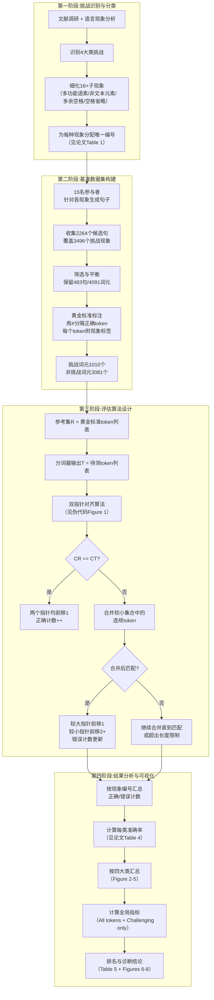

# A Framework for Evaluating Word Boundary Detection in Persian Tokenizers

---

## **作者信息**

| 作者 | 机构 | 身份/背景 | 领域大牛认定 |
|------|------|----------|-------------|
| Mostafa Karimi Manesh | 沙希德·贝赫什提大学计算机科学与工程学院 | 人工智能方向博士生（一作，负责实验与论文撰写） | **新锐研究者**，主要研究方向为语言模型与评估 |
| Mehrnoush Shamsfard | 沙希德·贝赫什提大学计算机科学与工程学院 | 副教授，自然语言处理与知识工程实验室主任（通讯作者/导师） | **伊朗NLP领域资深学者**，在波斯语自然语言处理、知识工程方面有持续影响力，Shahid Beheshti大学NLP方向学科带头人，研究成果见于LREC等国际会议，属**区域内顶尖、国际上有一定知名度**的学者层级，但未达国际院士/ACL Fellow水准 |

---

## **团队相关信息：**

本团队为**沙希德·贝赫什提大学自然语言处理与知识工程实验室（NLP & Knowledge Engineering Lab）**，由Shamsfard副教授领衔。该团队是**伊朗波斯语NLP领域的另一核心研究力量**（与德黑兰大学Faili团队并列）。与Faili团队侧重拼写纠错与模型构建不同，本团队更侧重**NLP基础工具评估与基准测试**。团队发表了STeP-1工具包等波斯语基础处理工具，在波斯语文本处理标准化方面有较深积累。

---

## **论文发表时间**

| 项目 | 具体日期 | 来源/说明 |
|------|---------|----------|
| 发表时间 | 2024年1月 | 发表于期刊，Volume 1 Issue 2 |
| 公开状态 | 已正式发表 | 完整参考文献与作者信息，具备正式出版状态 |

## **摘要**

分词（Tokenization）是文本预处理中的关键环节，在波斯语等**词边界不具备确定性（non-deterministic word boundary）** 的语言中面临诸多挑战，包括多功能语素识别、标点符号分离、词间空格缺失、词内多余空格等问题。

通常，分词器的评估仅关注整体性能对比，且测试数据未必覆盖所有具挑战性的语言现象，导致各分词器在特定挑战下的优劣势无法被独立评估。本文系统梳理了波斯语书写系统在词边界检测中面临的挑战，并评估了**八种不同分词器（六种工具性分词器 + 两种语言模型）** 在处理各项挑战时的表现。为此，作者构建了一个包含**483个句子、4091个词元（其中1010个为挑战性词元）** 的测试集，基于该数据集对分词器的词边界检测能力进行了多维度评估。

结果表明：**不同分词器在处理波斯语正字法的不同方面时表现差异显著**——例如，有的分词器在复合词分离上表现较好，有的则在零宽非连接符（半空格）的识别与保留上更为成功。详细对比揭示，**没有任何一个分词器能够完全应对所有挑战**，这凸显了改进算法和开发更智能的波斯语分词词边界检测方案的必要性。本文通过提供综合性基准并识别现有分词器的优缺点，为波斯语处理工具的更好发展铺平了道路。

---

## 一、这篇论文讲了一个什么样的故事？

**核心矛盾**：波斯语分词（Tokenization）是NLP的"地基工程"，但**这个地基本身就不稳**——与英语中空格几乎总能作为词边界不同，波斯语中空格、半空格（Zero-Width Non-Joiner, ZWNJ）、无空格之间的界限极其模糊。同一个词在不同上下文可能有不同写法，同一串字符可能被不同分词器切出截然不同的"词"。

**此前做了什么**：学术界已开发出多款波斯语分词工具（Hazm、Parsivar、DadmaTools、STeP-1等），也有若干分词评估研究（如Kamali等2022）。但以往评估几乎都采用**整体准确率**作为唯一指标，测试数据大多为随机采样，未针对特定语言现象做针对性覆盖。

**本文发现的问题**：整体准确率是一块"遮羞布"——某个分词器整体F1=85%，但在"复合动词拆合"上可能只有16%的正确率。如果没有细粒度诊断，工具开发者根本不知道自己的弱点在哪，下游NLP应用开发者也无法为特定任务选择最合适的分词器。

**本文的故事**：
1. **拆解挑战（Phenomena Identification）**：作者系统梳理了波斯语分词中4大类、16+子类的语言挑战（多功能语素、非文本元素、多余空格、空格省略）。
2. **构建"压力测试"数据集**：邀请15位语言/计算语言学参与者，针对每个挑战现象生成句子，最终构建483句、4091词元的测试集，其中1010个词元被标注为"挑战性词元"（约占25%），每个挑战词元都打上了现象类别标签。
3. **设计智能对齐评估算法**：由于分词器的输出粒度不同（有的把"می‌روم"当一个词，有的当两个），简单的字符串精确匹配会失效。作者设计了一套基于指针的**动态合并对齐算法**，能够正确对齐不同粒度的分词结果并统计各现象类别的准确率。
4. **横向诊断**：用这套框架对8个分词器（Hazm、Dadma、Polyglot、Parsivar、ParsiNorm、STeP-1、ParsBERT、LLaMA3-8B）做了系统诊断，揭示了每个工具在各类别上的真实优劣势。

**故事的核心洞察**：**没有一个分词器是万能的**——STeP-1在"多余空格"类别上表现优异（>97%），但在"多功能语素（به）"上仅约6.76%；ParsBERT在"空格省略（含错误）"上表现突出（83.79%），但在"直接宾语附着语素"上仅3.13%。更有意思的是，**LLaMA3-8B这样一个70亿参数的大语言模型，在分词任务上竟不如轻量级规则工具STeP-1**——这提示了一个重要结论：通用大模型并不适合做基础预处理任务，性价比极低。

## 二、本文的核心思想和创新点

### 1. 核心思想

**将分词器评估从"整体性能对比"升级为"基于语言现象的细粒度诊断"**。分词器的优劣不能仅用一个F1值来概括；必须将其在不同语言挑战类别上的表现拆解开，才能知道它"好在哪里、差在哪里、适合什么场景"。一句话概括：**不只看分数，要看"病根"**。

### 2. 关键创新点

1. **系统性的挑战分类体系（4大类 → 16+子现象）**：
   - **第1类：多功能语素（Multi-function Morphemes）**——如"به"（可作介词"到"或前缀"好"）、"می"（可作持续体标记或名词"酒"）、"با"（可作介词"与"或前缀"全"）。分词器必须根据上下文决定合并还是拆分。
   - **第2类：非文本波斯语元素（Non-textual Persian Elements）**——含数字/日期的token、标点符号分离、英文词嵌入、缩写词（如"ب.م.م"）。
   - **第3类：多余空格（Extra Spaces）**——包括动词屈折中的多余空格、复数标记、不定冠词附着语素、复合动词、属格附着语素、系动词附着语素、直接宾语附着语素、派生词、复合词等（**共9种子类，是测试集中出现最频繁的类别**）。
   - **第4类：空格省略（Space Omission）**——包括无拼写错误的词间空格省略（如"کامپیوترولپتاپ"）和有拼写错误的省略（如"کتابمن"），以及半空格在派生词/复合词中的省略。

2. **"现象驱动"的基准数据集构建流程**：
   - 邀请15名参与者，针对每种现象人工生成句子，而非从现有语料库随机抽取；
   - 确保了**每种现象都有足够样本**，且样本质量高（"黄金标准"分词由专家标注）；
   - 标注格式为：正确分词结果以"#"分隔，每个token附带现象类别标签（"0"为常规token，非零代表对应Table 1中的现象编号）。

3. **动态对齐评估算法（核心方法论贡献）**：
   - 解决了分词器输出粒度不同导致的直接比较失效问题；
   - 采用双指针扫描（参考集R与分词器输出集T），当token不匹配时，在较小的集合一侧不断合并下一个token，直到与较大集合的token匹配或超出长度限制；
   - 精确统计每个现象类别上的正确/错误次数，而非仅计算全局准确率。

4. **首次将LLM（LLaMA3-8B）纳入波斯语分词基准对比**：
   - 验证了"通用大语言模型是否可替代专用分词器"这一假设；
   - 结果否定性但极具价值：LLaMA3-8B在分词任务上表现平庸（F1~69.4%），远不及STeP-1（87.6%），且资源消耗巨大，说明**基础预处理应坚持专用轻量工具**。

## 三、方法是怎么实现的？(How does it work?)

### 1. 架构

本文的核心贡献是一个**分词器评估框架（Evaluation Framework）**，而非一个分词器模型。整体评估流程如下图所示：

**图注**：流程基于论文第3-5节综合绘制。本框架分为四个阶段：**挑战识别 → 数据集构建 → 评估算法执行 → 结果分析**。输出的核心产品是**每个分词器在每个语言现象上的准确率表**，而非单一的全局F1值。

### 2. 关键算法

**评估算法：双指针动态对齐算法（对应论文Figure 1伪代码）**

- **输入**：参考token列表 R = [r₁, r₂, ..., rₘ]（黄金标准，每个token带现象标签）；分词器输出列表 T = [t₁, t₂, ..., tₙ]
- **输出**：每个现象类别上的正确计数（TP）与错误计数（FP/FN）

**核心步骤**：

1. **初始化**：指针 p_R = 0, p_T = 0；正确计数 TP = 0，错误计数 Incorrect = 0
2. **主循环**（当 p_R < len(R) 且 p_T < len(T)）：
   - 令 c_R = R[p_R]，c_T = T[p_T]
   - **Case 1（精确匹配）**：若 c_R == c_T，则 p_R++, p_T++, TP++，继续下一轮
   - **Case 2（粒度不一致）**：若 c_R != c_T：
     * 确定"较小集合"：若 len(c_R) <= len(c_T)，则较小集合为R，否则为T
     * 在较小集合一侧连续合并后续token（如 R[p_R] + R[p_R+1] + ...），直到：
       - 合并后的字符串 == 较大集合当前token → **匹配成功**；或
       - 合并后的字符串长度 > 较大集合当前token长度 → 停止合并；或
       - 到达列表末尾 → 停止合并
     * 若匹配成功：
       - 较大集合指针前移1步
       - 较小集合指针前移 n 步（n为合并所用token数）
       - 若 n != 1（即合并步数不为1），则 Incorrect++（说明分词粒度有误）
     * 若匹配失败：按未匹配处理，记录错误，两个指针均前移1步
3. **分类统计**：由于每个参考token rᵢ 都预先关联了一个现象标签（0为常规，非0为Table 1中的现象编号），每产生一次错误，系统即在该现象编号下累加一次错误计数；每产生一次正确匹配，则在该现象编号下累加一次正确计数。

### 3. 关键公式

**公式1：全局评估指标（标准Precision/Recall/F1）**

$$
\text{Precision} = \frac{TP}{TP + FP}, \quad
\text{Recall} = \frac{TP}{TP + FN}, \quad
F1 = 2 \times \frac{\text{Precision} \times \text{Recall}}{\text{Precision} + \text{Recall}}
$$

其中 TP（真正例）为分词器正确切分的token数；FP（假正例）为分词器错误切分（多切/错切）的token数；FN（假负例）为分词器漏切的token数。论文区分了两类统计口径：
- **All tokens**：所有4091个词元参与计算
- **Challenging tokens only**：仅1010个带标签（非0）的挑战性词元参与计算

**公式2：现象级准确率（Phenomenon-specific Accuracy）**

$$
\text{Acc}_{\text{phen}} = \frac{\text{Correct}_{\text{phen}}}{\text{Total}_{\text{phen}}} \times 100\%
$$

其中 Total_phen 为测试集中某现象的出现次数（见论文Table 4第2列），Correct_phen 为分词器在该现象上的正确切分次数。例如，Table 4中"复合动词中的多余空格"（Extra Space in Compound Verb）出现43次，STeP-1正确39次，准确率 = 39/43 ≈ 90.7%。

## 四、实验效果 (Experimental Results)

### 1. 实验设置

| 实验维度 | 具体配置 |
|---------|---------|
| **评估对象（8款）** | 六款工具：Hazm、DadmaTools、Polyglot、Parsivar、ParsiNorm、STeP-1；两款语言模型：ParsBERT、LLaMA3-8B |
| **测试数据集** | 483句，4091词元，1010个挑战性词元（占24.7%），最短句4词，最长句17词 |
| **挑战类别分布** | 多功能语素（4种）、非文本元素（3种）、多余空格（9种）、空格省略（2种），共16+现象，详见论文Table 1 |
| **评估指标** | 准确率（Accuracy）、精确率（Precision）、召回率（Recall）、F1分数，按全量token和挑战token分别统计；同时按现象类别输出单项准确率 |
| **比较方式** | 每个分词器的输出与黄金标准（#分隔）通过双指针对齐算法逐一比对 |
| **排除工具** | 因安装失败、无法访问或运行错误而未能纳入：部分知名工具（具体名称未列出） |

### 2. 主要结果

**表：全局评估结果——全量token vs 挑战性token（论文Table 5）**

| 分词器 | 全量token F1(%) | 挑战token F1(%) | 全量Recall(%) | 全量Precision(%) | 挑战Recall(%) | 挑战Precision(%) |
|--------|----------------|----------------|---------------|-----------------|---------------|------------------|
| **STeP-1** | **87.57** | **75.24** | 88.51 | 87.16 | 77.87 | 73.54 |
| Hazm | 82.52 | 53.74 | 84.52 | 81.28 | 57.14 | 51.51 |
| Parsivar | 78.52 | 48.18 | 80.94 | 76.99 | 51.39 | 46.11 |
| ParsiNorm | 70.59 | 34.62 | 76.26 | 66.41 | 37.74 | 32.69 |
| Polyglot | 69.90 | 34.55 | 74.97 | 66.32 | 37.47 | 32.76 |
| LLaMA3-8B | 69.42 | 31.92 | 74.10 | 66.01 | 36.11 | 29.42 |
| ParsBERT | 68.63 | 37.90 | 75.62 | 63.36 | 41.29 | 35.83 |
| DadmaTools | 69.64 | 31.05 | 74.75 | 66.03 | 34.05 | 29.19 |

**核心结论**：
- **STeP-1在所有指标上全面领先**，尤其在挑战性token上F1（75.24%）比第二名Hazm（53.74%）高出21.5个百分点。这说明其**57,000+词条规则+词典混合架构**在处理复杂语言现象时优势显著。
- **Hazm位居第二**，在全量token上F1=82.52%，但在挑战token上急剧下滑至53.74%——说明Hazm主要优势在处理常规文本，对边缘语言现象（如复合动词、附着语素）鲁棒性不足。
- **ParsBERT表现不如预期**：作为基于Transformer的预训练语言模型，本应在上下文建模上优于规则工具，但挑战token F1仅37.90%。作者推测其WordPiece子词分词策略本身就不是为"词级边界检测"设计的，在需要精确识别词边界的任务上天然弱势。
- **LLaMA3-8B未能超越专用工具**：F1=69.42%（全量）和31.92%（挑战），略优于Dadma/Polyglot，但远逊于STeP-1。考虑到其70亿参数的巨大资源消耗，**将LLM用于基础分词任务性价比极低，不具实际部署价值**。

**表：代表性现象级单项准确率对比（摘录自论文Table 4）**

| 现象（编号） | 样本数 | STeP-1(%) | Hazm(%) | ParsBERT(%) | LLaMA3(%) | 最佳工具 |
|-------------|--------|-----------|---------|-------------|-----------|----------|
| 多功能语素「به」 | 37 | 6.76 | 46.07 | 24.33 | 77.39 | **LLaMA3** |
| 多功能语素「می」 | 35 | 45.71 | 82.86 | 2.86 | 0.00 | **Hazm** |
| 含数字token | 36 | 63.89 | 66.67 | 58.34 | 41.88 | **Hazm** |
| 标点分离 | 52 | 92.31 | 94.24 | 90.39 | 86.15 | **Hazm** |
| 英文token检测 | 36 | 88.89 | 19.45 | 91.67 | 86.89 | **ParsBERT** |
| 多余空格-动词 | 36 | **97.23** | 11.12 | 100.00 | 9.46 | **ParsBERT** |
| 多余空格-复数标记 | 68 | **97.06** | 98.53 | 20.59 | 19.10 | **Hazm** |
| 多余空格-不定冠词 | 50 | 98.00 | 96.00 | 88.00 | 90.00 | **STeP-1** |
| 多余空格-复合动词 | 43 | **90.70** | 86.05 | 16.28 | 13.27 | **STeP-1** |
| 多余空格-属格附着语素 | 56 | **98.22** | 53.58 | 35.72 | 30.31 | **STeP-1** |
| 多余空格-系动词附着 | 34 | **97.06** | 73.53 | 32.36 | 28.37 | **STeP-1** |
| 多余空格-派生词 | 46 | 84.79 | 58.70 | 10.87 | 9.42 | **STeP-1** |
| 多余空格-复合词 | 96 | **70.84** | 42.71 | 6.25 | 46.08 | **STeP-1** |
| 空格省略-无错误 | 37 | **81.09** | 98.11 | 15.41 | 71.83 | **Hazm** |
| 空格省略-有错误 | 37 | 18.11 | 5.41 | **83.79** | 79.45 | **ParsBERT** |
| 非挑战性常规token | 3120 | 92.31 | 93.88 | 94.62 | 92.71 | **ParsBERT** |

**单项分析洞察**：
- **STeP-1在"多余空格"大类的9个子类中拿了7个第一**——其57k词条词典在处理黏着语素合并方面具有压倒性优势。
- **ParsBERT在"空格省略+有拼写错误"（83.79%）和"多余空格-动词"（100%）上表现异常突出**——这与其预训练阶段接触的大量噪声文本有关，使其具备了一定的拼写容错能力。但与此同时，ParsBERT在"复合词多余空格"（6.25%）和"复数标记+属格附着语素组合"（0%）上几乎完全失效——说明Transformer的上下文建模在高度屈折的复合结构面前仍力不从心。
- **LLaMA3-8B仅在"多功能语素「به」"（77.39%）上表现最佳**，这得益于其大模型对上下文语义的理解能力，能正确区分"به"是前缀还是介词。但在"多余空格"系列上全面溃败（多在9-46%），说明LLM并未针对波斯语正字法做专项优化。

### 3. 消融实验与关键发现

本文未做传统意义上的"消融实验"（如移除某模块），但其评估设计本身提供了若干关键分析性发现：

**关键发现1：不同分词器在处理不同类型挑战时存在显著的能力偏移**

- STeP-1在规则性强的任务（多余空格系列）上碾压对手（多数>90%），但在语义判断任务（多功能语素「به」）上仅6.76%——说明其词典和规则并未覆盖某些高频多义词的上下文判别。
- ParsBERT在常规token上准确率最高（94.62%），但在挑战token上暴跌至37.90%——说明Transformer模型在处理"见过的模式"时很擅长，但遇到需要精确词边界判断的"长尾现象"时并不比规则系统更强。

**关键发现2：大语言模型（LLM）不适合替代专用分词器**

- LLaMA3-8B在所有16+个现象类别中仅拿到1个第一（「به」），其余类别全面落后于专用工具；
- 其全局F1（69.42%）与Dadma/Polyglot相当，但资源消耗（70B参数）是STeP-1（轻量规则系统）的数万倍；
- 核心启示：**NLP基础预处理环节应坚持"专用轻量工具优先"原则**，盲目上LLM既不经济也不高效。

**关键发现3：各工具之间存在非传递性优劣关系**

- 没有一个工具在所有类别上同时最优：
  - STeP-1整体最强，但在「به」上弱于LLaMA3和Hazm；
  - Hazm在「می」和"标点分离"上最强，但在"英文token检测"上仅19.45%；
  - ParsBERT在"多余空格-动词"和"空格省略-有错误"上最强，但在复合词/派生词上极弱。
- **实践启示**：下游任务应根据自身面临的文本特点**选择性地组合多个分词器**或**针对特定现象做后处理增强**。

**关键发现4：工具可达性和标准化仍是波斯语NLP的严重障碍**

- 论文提到在评测过程中：无可靠下载源、部分工具无法访问、安装困难、编程语言不统一、缺少标准化输出格式、部分工具甚至没有归一化模块；
- 这说明**波斯语NLP基础设施的建设（工具维护、文档、基准）本身就是一个亟待解决的系统性问题**，其紧迫性甚至不亚于算法创新。

**实验部分总结**：

本文通过构建多现象基准数据集与动态对齐评估算法，**首次实现了对波斯语分词器在细粒度语言挑战上的系统性诊断**。实验揭示了三个核心事实：（1）**STeP-1综合表现最佳**，尤其在规则性任务上；（2）**Transformer模型（ParsBERT）在非标准拼写容错上有独特优势**，但在结构复杂的词边界任务上表现不佳；（3）**LLM并非基础分词的万能解**——LLaMA3-8B性价比极低。评估结论具有明确的工程指导价值：**波斯语分词器的改进应优先聚焦于复合词处理、多功能语素消歧和工具标准化三大方向**。

## 五、优点与局限性

### ✅ 1. 优点

- **问题定义的范式升级**：将分词评估从"整体分数比拼"升级为"基于语言现象的多维度诊断"，使评估结果具有工程可操作性——开发者可以直接定位"复合动词处理"模块的问题，而非仅仅知道F1=80%。

- **评估算法的通用性与公平性**：双指针对齐算法能正确处理不同粒度的分词输出（如"می‌روم"被分为1个token还是2个token），不因输出格式差异而产生评分偏差，具备推广到其他黏着语/屈折语（如阿拉伯语、土耳其语）评估的潜力。

- **现象驱动的数据集构建方法**：邀请15名参与者针对特定现象人工生成句子，确保每个挑战类别都有足够数量的样本，而非从语料库随机采样导致长尾现象样本不足。这种方法论对低资源语言的基准构建具有示范意义。

- **对比设置的全面性**：覆盖了6款主流工具 + 2款不同代际的语言模型（BERT类 + LLM类），横跨规则、统计、神经网络、大模型四种技术范式，对比维度完整。

- **对工业/学术桥梁建设的贡献**：明确指出了工具可达性和标准化问题（安装困难、格式不统一），这看似是"非学术"问题，但恰恰是波斯语NLP产业化的真实瓶颈。

- **清晰的工程启示**：结论明确——STeP-1在全量数据和挑战数据上均表现最优，推荐作为通用分词首选；对特定场景（如含有大量拼写错误的社交媒体文本），可考虑用ParsBERT做补充。

### ⚠️ 2. 局限性（研究边界与待解问题）

- **数据集规模有限**：仅483句、4091词元，与深度学习时代动辄数万样本的基准相比规模偏小。虽然通过"现象定向采样"保证了挑战样本的密度，但模型在更广泛文本体裁上的泛化能力仍需更大规模测试集验证。

- **词级边界检测的任务边界清晰但不够全面**：本文仅评估"词边界检测"（word-level tokenization），未涉及子词分词（如BPE/WordPiece），也未评估分词对下游任务（如POS标注、NER）的实际影响。一个分词器可能在词边界检测上F1=90%，但其分词策略对下游POS标注的影响可能优于F1=95%的分词器——这种"下游效应"未被研究。

- **LLM选择有限**：仅测试了LLaMA3-8B一个LLM，且作者明确因资源限制未测试更大模型（如GPT-4、Llama3-70B）。但更大模型在分词任务上是否会有质的飞跃？可能性较低（分词是基础模式匹配而非复杂推理），但未经实证不能完全排除。

- **未包含真实文本噪声场景**：测试句子由参与者人工生成，虽然覆盖了"有拼写错误"的子类，但整体文本较为规范，未系统评估在社交媒体、OCR、语音转写等强噪声场景下的分词表现。

- **错误类型归因不够细化**：当分词器在一个token上出错时，算法仅记录"错误"，但未进一步归因于"误合并"（应分未分）还是"误拆分"（应合未合）。这两种错误的性质不同，后续改进策略也不同。

- **工具版本与可复现性问题**：论文提到部分工具无法安装或运行出错，意味着读者若要复现实验可能面临同样的工程障碍。论文未提供Docker镜像或线上Demo，降低了评估框架的可复现性。

## 六、其他

### 第一性原理

本文遵循的第一性原理是：**词是文本语义的基本承载单元，但"词"在自然语言中并非一个客观存在的物理实体——它是由书写规范（正字法）约定俗成的社会性产物**。因此，分词算法的本质不是"发现"词的边界，而是在 **不确定的书写信号（空格/半空格/无空格）与稳定的语义单元（词）之间建立映射关系**。

基于这一原理：
- **空格不能作为词的充分或必要条件**——波斯语中，"می‌روم"（我去）写有半空格但应算一个词，"کتاب من"（我的书）写有空格但可以是两个词。空格只是书写层面的噪声信号。
- **正确的分词必须依赖语言知识**——包括形态学（词缀规则）、词典（已知词表）、句法（上下文关系）和正字法（半空格使用规范）的多重约束。
- **评估分词器不能只看最终准确率，而要看它在每种"映射不确定性"（即挑战现象）上的求解能力**——因为不同分词器背后的语言知识库和规则设计不同，它们在面对不同不确定性类型时的表现必然不同。

### 领域空白

**本文试图填补的具体领域空白：波斯语分词器的细粒度、现象驱动型评估框架（Fine-grained, Phenomenon-driven Evaluation Framework for Persian Tokenizers）。**

具体而言：

- **此前为何存在空白？**
  - **评估粗粒度**：Kamali等（2022）虽做了分词器比较，但仅报告了整体F1，未针对具体语言现象做分类评估。整体F1掩盖了模型在长尾现象上的系统性缺陷。
  - **缺乏领域共识**：此前研究对"波斯语分词的挑战到底是什么"缺乏系统梳理——Farhoodi等（2022）虽识别了复合词/半复合词/句法组三类，但未扩展到多功能语素、空格省略等其他维度；Qayoumi（2018）关注空格修正但未建立评测基准。
  - **技术范式迭代带来的新问题**：随着ParsBERT等Transformer模型进入波斯语NLP，其子词分词策略（WordPiece）与传统词级分词不在同一比较平面，需要新的对齐评估方法来公平比较不同粒度的分词器。

- **该空白是否已被本文充分填补？**
  - **方法论上填补充分**：本文提出了完整的四阶段评估框架（挑战识别→数据集构建→对齐算法→多维度报告），为后续波斯语分词评估提供了可复用的标准和工具。
  - **实证结论具有长期参考价值**："STeP-1整体最优""LLM不适合作分词器""各工具在现象级表现上存在显著差异"等结论为工程选型提供了明确依据。
  - **但仍需持续迭代**：数据集规模可扩大，可纳入更多LLM（如GPT-4o-mini）、可增加下游任务验证、可引入错误类型细分类（误合并vs误拆分）。本文提供了一个"骨架"，后续研究可在其上增添"血肉"。

- **与前两篇（2010/2023）Faili团队论文的学术脉络关系**：
  - **2010年（Faili）**：关注**真实词错误检测与纠正**，核心是语义层面的词替换判断，与分词无关；
  - **2023年（Dehghani & Faili）**：关注**错误类型检测**，其方法依赖于FarsTypo数据集和BiLSTM模型，**默认使用了某种分词策略**（但未评估分词质量），分词中的错误可能会向下游传播；
  - **2024年（本文）**：关注**分词器本身的词边界检测质量**，是对前两篇工作的**基础设施层面的补充和质疑**——如果分词器连词边界都切不准，那么后续的错误检测（2023）和真实词替换（2010）都会建立在不稳固的地基之上。三篇论文共同勾勒了波斯语文本处理的三层问题：**词边界确定→错误类型识别→语义级纠正**，本文处于最底层但最基础的位置，与前两篇形成**"基础工具评估"与"上层任务建模"的互补关系**。

  ---

  > 本文由Deepseek AI 生成

  