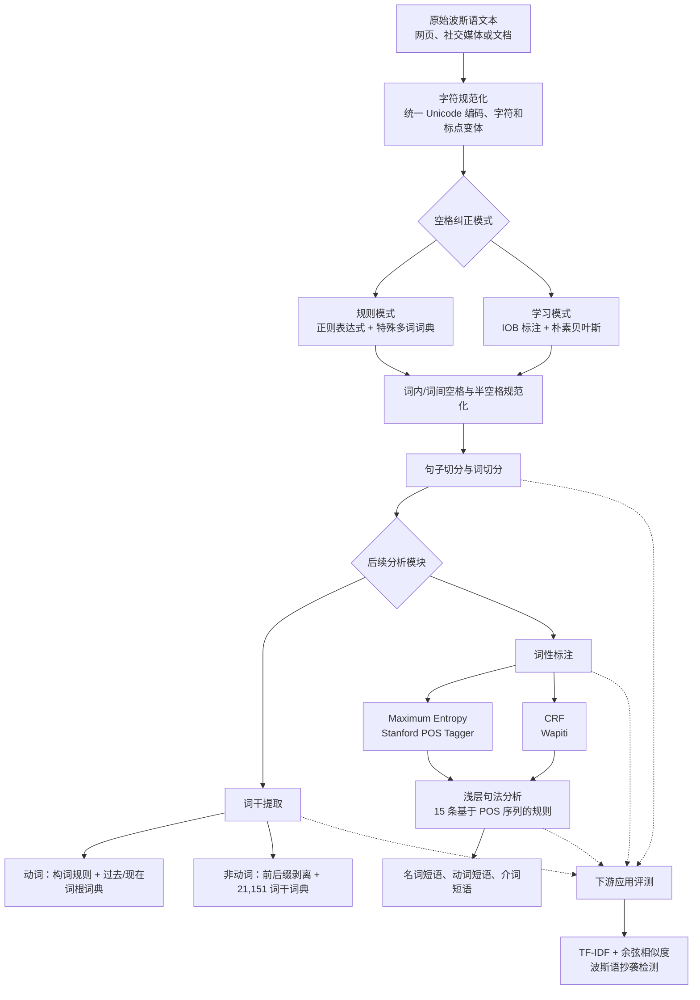

# Parsivar: A Language Processing Toolkit for Persian

> **中文译名：Parsivar——波斯语语言处理工具包**

---

## 作者信息

| 作者 | 论文所列机构 | 身份/背景 | 领域大牛认定 |
|---|---|---|---|
| **Salar Mohtaj** | ICT Research Institute, Academic Center for Education, Culture and Research（ACECR），Tehran, Iran | 第一作者、Parsivar 的主要开发者。2018 年前后从事波斯语 NLP、文本复用与抄袭检测；此后在 TU Berlin 获得博士学位，并进入德国人工智能研究中心 DFKI，从事多语言 NLP、生成模型评测、虚假信息与有害内容检测，现为高级研究人员。 | **波斯语 NLP 工具方向具有代表性的中生代/新锐研究者，但不是传统意义上的资深“大牛”**。尚无院士、ACL Fellow、IEEE/ACM Fellow 等顶级荣誉证据；其影响力更偏开源工具和应用研究。 |
| **Behnam Roshanfekr** | 同上 | 共同作者。公开书目记录显示其研究涉及模式识别、图像处理及工程应用；本文中参与波斯语预处理工具的研发。论文没有注明具体职称或分工。 | **不能认定为该领域大牛**。公开成果规模较小，也缺少其作为波斯语 NLP 领军学者的可靠证据。 |
| **Atefeh Zafarian** | 同上 | 共同作者。其后续工作涉及跨语言文档对齐、命名实体识别及外部知识增强等 NLP 任务；公开资料显示其亦与 Amirkabir University of Technology 有研究联系。 | **属于专业研究人员，而非公认的领域顶级学者**。在波斯语 NLP 有持续工作，但没有顶级学术荣誉或大规模学术领导力证据。 |
| **Habibollah Asghari** | 同上 | 末位作者，ICT Research Institute/ACECR 的资深研究人员。长期从事数据挖掘、文本挖掘、波斯语 NLP 与抄袭检测，曾组织或参与 PersianPlagDet 2016，并持续研究 Persian Ezafe 等任务。结合作者顺序和研究履历，他很可能承担了团队指导或项目组织角色，但论文没有明确声明。 | **可视为伊朗波斯语文本处理和抄袭检测方向的资深应用型专家，但尚不能认定为国际 NLP 顶级“大牛”**。未发现 ACL Fellow、院士等资深领军荣誉。 |

## 团队相关信息

该团队是**伊朗 ICT Research Institute of ACECR 内部的波斯语文本处理与信息检索研发团队**。ACECR 属于面向教育、科技研发和成果转化的伊朗公共非政府机构；本文四位作者在发表时均署名该研究所，而不是一个跨校的大型国际团队。

团队的研究脉络很清楚：一端是**波斯语基础 NLP 工具**，另一端是**文本复用/抄袭检测等下游应用**。Parsivar 正是把这两端连起来的基础设施项目。Habibollah Asghari 更接近资深项目组织者，Salar Mohtaj 是主要实现者和后来发展较快的研究骨干。团队在**波斯语开源 NLP 工程生态中有实际影响力**，但没有证据表明它是国际计算语言学界的顶级理论学派或由院士/Fellow 领衔的明星实验室。

值得注意的是，Parsivar 并非只停留在论文中：截至 **2026年7月29日**，其[官方 GitHub 仓库](https://github.com/ICTRC/Parsivar)约有 **247 stars、37 forks**，后来还增加了依存分析和拼写检查等功能。这说明该成果的实际影响力大于单纯的论文引用数字。

## 论文发表时间

| 项目 | 具体日期 | 来源/说明 |
|---|---|---|
| 正式发表月份 | **2018年5月** | ACL Anthology 书目记录 |
| LREC 2018 全部会期 | **2018年5月7日—12日** | 教程、研讨会和主会合计；地点为日本宫崎 Phoenix Seagaia Conference Center |
| LREC 2018 主会 | **2018年5月9日—11日** | [LREC 2018 官方会议说明](https://www.ilc.cnr.it/en/events/lrec-2018/) |
| 收录会议 | **The Eleventh International Conference on Language Resources and Evaluation（LREC 2018）** | LREC 是语言资源与评测领域的重要国际会议 |
| 出版机构 | **European Language Resources Association（ELRA）** | 正式会议论文集 |
| 页码 | **1112–1118** | 原始论文页码，共 7 页 |
| ACL Anthology ID | **L18-1179** | [ACL Anthology 正式条目](https://aclanthology.org/L18-1179/) |
| DOI | **10.63317/5cmzfmbj8mef** | [DOI 链接](https://doi.org/10.63317/5cmzfmbj8mef)。该 DOI 是 2026 年补登记的回溯性 DOI，不代表论文在 2026 年重新发表 |
| 当前引用情况 | **OpenAlex 29 次；ResearchGate 页面显示 33 次；新 DOI 的 Crossref 计数为 1 次** | 截至 **2026年7月29日**。数据库覆盖和 DOI 回溯合并方式不同，故数字不一致；[OpenAlex 记录](https://openalex.org/W2806746267) |

该论文于 **2018年5月在 LREC 2018 正式发表**，并非预印本或在审稿件。2026 年出现的 DOI 元数据属于会议论文的**回溯性 DOI 登记**，不能把它误读为论文的首次公开时间。

## 摘要

本文发布了一个开源的波斯语预处理工具包 **Parsivar**。作者认为，波斯语及其他阿拉伯字母书写语言存在多套字符编码、全空格与半空格混用、多词成分边界模糊、词缀丰富等问题，使未经标准化的网页文本难以直接用于 NLP。Parsivar 因此把**字符规范化、空格纠正、词句切分、词干提取、词性标注和浅层句法分析**整合为一套 Python 流水线。

工具包采用规则与统计学习相结合的设计：字符统一和部分空格纠正依靠规则与词典；学习式空格纠正使用基于 IOB 标签的朴素贝叶斯模型；词干提取使用动词/非动词形态规则及词典校验；词性标注同时提供最大熵和 CRF 模型；浅层分析使用 15 条基于词性序列的语言学规则。作者既对各模块进行内在评测，也把 Hazm、ParsiPardaz 和 Parsivar 的输出送入同一个波斯语抄袭检测系统做外在评测。论文报告 Parsivar 在下游任务中整体优于对照工具，摘要称 F1 约提高 **8%**。不过，实验规模、运行时间、统计显著性和若干指标定义仍不充分，且空格纠正 F1 在正文与表格之间存在明显不一致。

---

## 一、这篇论文讲了一个什么样的故事？

这篇论文讲的是一个“**先把地基修好，再谈上层 NLP 模型**”的故事。

在英语处理中，人们常把预处理理解为简单的空格分词和大小写转换；但波斯语文本的“同一个词”可能因 Unicode 编码、阿拉伯/波斯字符变体、普通空格、零宽非连接符（ZWNJ，俗称半空格）以及书写习惯不同，而在计算机中呈现为不同字符串。一个由多个成分组成的词还可能被连写、用半空格连接或被错误地用普通空格拆开。

如果这些问题没有在流水线最前端解决，后续模型看到的就不是稳定的“词”：

- 词表会被同形异码字符人为膨胀；
- 多词成分会被切错；
- 词干提取和词性标注会收到错误 token；
- 信息检索、文本分类和抄袭检测中的匹配率会随之下降。

作者于是构建 Parsivar，将多个分散的波斯语基础工具整合为统一 Python 包，并采用“**能用确定规则解决的部分用规则，需要上下文判断的部分用统计模型**”的混合路线。论文不仅测量每个模块自身的准确性，还把不同工具包接入同一个抄袭检测器，观察预处理差异是否真的影响下游任务。

故事的最终落点是：**预处理不是无关紧要的清洗步骤，而是一种会沿流水线传播误差的表示学习前置层。** Parsivar 的优势主要来自字符编码统一以及词内、词间空格纠正；这些改进让下游抄袭检测在不同相似度阈值下都获得更高 F1。

---

## 二、本文的核心思想和创新点

### 1. 核心思想

本文的核心思想可以概括为：

> **将波斯语文本预处理做成一个可复用、可开源、可在速度与准确率之间选择的模块化流水线，并通过规则、词典和统计序列标注的混合方法解决字符与词边界问题。**

论文真正关心的并不是某一个单点算法是否新颖，而是能否把波斯语 NLP 所需的基础能力打包起来，并证明“更好的预处理”能够改善真实下游任务。

### 2. 关键创新点

1. **提供一体化开源工具包。**  
   在当时的波斯语工具中，STeP-1 和 ParsiPardaz 功能较多，但不便公开获取；Hazm 开源且速度较快，但作者认为准确性不足。Parsivar 试图同时兼顾覆盖范围、准确性、运行速度和开放获取。

2. **把空格纠正作为波斯语预处理的核心任务。**  
   Parsivar 不把空格简单视为绝对词界，而是同时处理：
   - 词与词之间该分未分的问题；
   - 一个复合词内部被普通空格错误拆开的问题；
   - 半空格/ZWNJ 的规范使用。

3. **为空格纠正提供规则版和学习版两条路径。**  
   规则版使用正则表达式及特殊多词词典；学习版把词界恢复建模为 IOB 序列标注，用朴素贝叶斯根据邻近词和前一标签判断成分边界。用户可据此在速度与准确率之间取舍。

4. **构建面向波斯语形态的词干提取器。**  
   作者将动词和非动词分开处理：动词依靠过去/现在词根、构词规则及动词词典；非动词依靠前缀、复数后缀、所有格后缀等形态结构，并通过 21,151 个常用词干组成的词典验证候选。

5. **同一工具包内提供两种词性标注器。**  
   使用 Stanford 最大熵标注器和 Wapiti CRF 标注器，在相同 Bijankhan 语料上训练，使用户能够在实现依赖和速度之间选择。

6. **同时采用内在评测与外在评测。**  
   论文不仅报告 tokenization、stemming、POS 和 shallow parsing 指标，还将不同预处理工具的输出送入完全相同的抄袭检测系统。这一设计强调了基础组件对下游系统的实际价值。

7. **从大规模真实网页文本中归纳编码变体。**  
   作者利用超过 200 万篇波斯语博客文档收集字符与标点的编码形式，用以建立规范化映射，具有明显的工程实践价值。

需要区分的是：最大熵、CRF、朴素贝叶斯、IOB、正则规则和 TF-IDF 都不是本文原创；论文的创新主要是**面向波斯语特点的系统整合、资源工程和评测设计**。

---

## 三、方法是怎么实现的？(How does it work?)

### 1. 架构

Parsivar 是一个由低层字符处理逐步走向句法结构的级联流水线：

**图注**：依据论文第 3 节各模块说明、Algorithm 1–2、Table 1–2 及 Figure 1 综合重绘。原论文没有给出完整系统架构图，因此该图属于**基于正文的数据流重构**。

### 2. 关键算法

#### 2.1 字符规范化

1. 从超过 200 万篇波斯语博客文档中收集同一字符和标点的不同编码形式；
2. 建立变体到统一标准形式的映射；
3. 对输入文本逐字符替换；
4. 将数字、标点及波斯语/阿拉伯语字符差异统一到稳定表示。

论文没有列出完整映射表，也没有单独报告字符规范化准确率。

#### 2.2 规则式空格纠正

1. 用正则表达式处理具有稳定构词模式的形式，例如波斯语进行体标记、派生词缀等；
2. 对无法抽象出通用规则的二词或三词固定表达，建立特殊词典；
3. 将错误的普通空格、缺失空格或半空格改为统一形式；
4. 在空格修复完成后再执行词和句子的切分。

#### 2.3 学习式空格纠正

作者使用 Bijankhan 语料建立 IOB 标签：

- **B**：多成分词的第一个部分；
- **I**：该多成分词的后续部分；
- **O**：不属于多成分词的普通 token。

每个位置使用以下特征：

- 前一个 token 的标签；
- 前一个 token；
- 后一个 token。

然后训练朴素贝叶斯分类器预测 B/I/O 标签，并根据标签序列恢复词边界。数据按 90%/10% 划分训练和验证。

#### 2.4 动词词干提取

1. 对输入词依次匹配波斯语动词构词规则；
2. 从匹配形式中抽取现在时或过去时词根候选；
3. 在动词词典中验证候选；
4. 对前缀动词，先移除前缀，再递归处理剩余部分；
5. 若有多个合法候选，返回最短候选；否则返回原词。

#### 2.5 非动词词干提取

作者假设非动词具有如下可选形态层次：

$$\{\text{前缀}\}+\text{词干}+\{\text{其他后缀}\}+\{\text{复数后缀}\}+\{\text{所有格后缀}\}$$

算法按后缀/前缀类别尝试剥离，并检查剩余部分是否出现在由 **21,151 个常用词干**构成的词典中；多个候选同时成立时，选择最短者。

#### 2.6 POS 标注

- 训练数据来自超过 260 万人工标注词的 Bijankhan corpus；
- 原始约 550 个细粒度标签被合并为 40 个标签；
- 最大熵模型使用 Stanford POS Tagger；
- CRF 模型使用 Wapiti；
- 最佳特征窗口包含前两个词、当前词、后两个词以及前两个标签。

#### 2.7 浅层句法分析

作者没有训练统计 chunker，而是手工构造 **15 条**基于 POS 标签序列的正则规则，识别：

- 名词短语（NP）；
- 动词短语（VP）；
- 介词短语（PP）。

例如：

$$
\mathrm{NP}\rightarrow
\langle N\_SING\rangle
\langle ADJ\_SIM\rangle
\langle N\_SING\rangle
$$

优点是不需要标注语料；缺点是覆盖范围有限、语言依赖强，而且 POS 错误会继续传递到 chunker。

### 3. 关键公式

#### （1）最大熵 POS 标注的概率分解

设句子为 $S=s_1,\ldots,s_n$，标签序列为 $T=t_1,\ldots,t_n$。论文写为：

$$
p(t_1^n\mid s_1^n)
=
\prod_{i=1}^{n}p(t_i\mid t_1^{i-1},s_1^i)
\approx
\prod_{i=1}^{n}p(t_i\mid h_i)
$$

其中 $h_i$ 是位置 $i$ 周围的有限上下文。使用前两个标签和前后各两个词时，可写为：

$$
p(t_1^n\mid s_1^n)
\approx
\prod_{i=1}^{n}
p\!\left(
t_i\mid
t_{i-2}^{i-1},
s_{i-2}^{i+2}
\right)
$$

最终选择概率最大的标签序列：

$$
\hat{T}=\arg\max_T p(T\mid S)
$$

#### （2）CRF 序列标注

论文只对 CRF 作概念说明，没有完整给出公式。标准线性链 CRF 可形式化为：

$$
p(T\mid S)
=
\frac{1}{Z(S)}
\exp\left(
\sum_{i=1}^{n}\sum_k
\lambda_k f_k(t_{i-1},t_i,S,i)
\right)
$$

其中 $Z(S)$ 是归一化项，$f_k$ 是词、上下文和标签转移特征。该式是为理解方法补充的标准形式，而非原文逐式给出。

#### （3）学习式空格纠正

朴素贝叶斯对当前位置标签 $y_i\in\{B,I,O\}$ 的预测可重构为：

$$
\hat y_i
=
\arg\max_{y_i}
p(y_i)
\prod_j p(f_{ij}\mid y_i)
$$

其中 $f_{ij}$ 包括前词、后词及前一标签。论文没有给出该公式及平滑方式。

#### （4）下游抄袭检测中的向量相似度

每个句子用 TF-IDF 向量表示，并用余弦相似度判断是否超过阈值：

$$
\cos(\mathbf{x},\mathbf{y})
=
\frac{\mathbf{x}\cdot\mathbf{y}}
{\|\mathbf{x}\|_2\|\mathbf{y}\|_2}
$$

#### （5）字符级抄袭检测 Precision、Recall 与 F1

设 $S$ 为真实抄袭片段集合，$R$ 为系统检测片段集合。论文采用：

$$
\operatorname{Precision}(S,R)
=
\frac{1}{|R|}
\sum_{r\in R}
\frac{\left|\bigcup_{s\in S}(s\cap r)\right|}{|r|}
$$

$$
\operatorname{Recall}(S,R)
=
\frac{1}{|S|}
\sum_{s\in S}
\frac{\left|\bigcup_{r\in R}(s\cap r)\right|}{|s|}
$$

$$
F_1
=
2\cdot
\frac{\operatorname{Precision}\cdot\operatorname{Recall}}
{\operatorname{Precision}+\operatorname{Recall}}
$$

这组指标按字符重叠计算，适合评估检测片段边界，而不只是判断一篇文档是否含抄袭。

---

## 四、实验效果 (Experimental Results)

### 1. 实验设置

| 模块/任务 | 数据与设置 | 指标/对照 |
|---|---|---|
| 字符规范化 | 超过 **200 万篇**波斯语博客文档用于收集编码变体 | 未单独报告指标 |
| Tokenization | Hamshahri 中随机选 **10 篇文档**，共 2,552 tokens；去停用词后评估 1,465 个词 | Accuracy |
| Stemming | 与 tokenization 相同的 1,465 词样本 | Precision、Recall、F1 |
| 学习式空格纠正 | Bijankhan IOB 数据：O=2,428,732，B=160,775，I=169,518；90% 训练、10% 验证 | Accuracy、Precision、Recall、F1 |
| POS tagging | Bijankhan corpus；论文称训练使用 100 万词，并以语料的 10% 测试；比较 ME 与 CRF、窗口 3 与 5 | 词级准确率、整句准确率 |
| Shallow parsing | Hamshahri 中随机选 **100 句**，人工检查 | “Performance”/准确表现 |
| 下游抄袭检测 | Persian plagiarism detection corpus 的一个子集；固定 VSM+TF-IDF+cosine 检测器 | 字符级 F1；比较 Hazm、ParsiPardaz、Parsivar |
| 相似度阈值 | 从 **0.05 到 0.95** 变化 | 绘制三种预处理工具对应的 F1 曲线 |

### 2. 主要结果

#### 各模块内在评测

| 模块 | 结果 |
|---|---:|
| Tokenization Accuracy | **98.29%** |
| Stemmer Precision | **98.71%** |
| Stemmer Recall | **81.91%** |
| Stemmer F1 | **89.53%** |
| 空格纠正 IOB Accuracy | **93.2%** |
| 空格纠正 Precision | **87.3%** |
| 空格纠正 Recall | **91.9%** |
| 空格纠正 F1（Table 4） | **89.5%** |
| Shallow Parser | **76.8%** |

#### POS 标注结果

| 模型 | 窗口 | 词级准确率 | 整句准确率 |
|---|---:|---:|---:|
| Maximum Entropy | 3 | 91% | 75% |
| Maximum Entropy | 5 | **95%** | 78% |
| CRF | 3 | 93% | 76% |
| CRF | 5 | **95%** | **79%** |

论文表格把这些数值写为 0.91、0.95 等，同时列标题又标注 “[%]”；这里按 91%、95% 解读。窗口从 3 扩大到 5 明显改善整句准确率；CRF 的最好整句结果略高于最大熵模型。

#### 下游抄袭检测

- 在论文 Figure 1 的全部相似度阈值上，**Parsivar 曲线都高于 Hazm 和 ParsiPardaz**。
- Parsivar 的峰值约为 **F1=0.64**，出现在阈值约 0.20–0.25。
- Hazm 与 ParsiPardaz 的峰值大约在 **0.60–0.61**。
- 阈值增大后，三种系统的 F1 都下降，但 Parsivar 的优势通常更加明显。
- 摘要把总体提升概括为**约 8% F1**；原文未说明这是绝对百分点、相对提升还是跨阈值平均值，因此不宜进一步精确化。

**核心结论：**

- **低层规范化和词界恢复会真实影响下游任务。** 同一个抄袭检测模型仅更换预处理工具，就得到持续不同的 F1。
- Parsivar 最明显的优势来自**字符编码统一和空格纠正**，而不是某个全新的高层模型。
- POS 标注在词级可达到约 95%，但整句完全正确率只有 79%，表明逐 token 小误差会在句级快速累积。
- 规则式 shallow parser 仅为 76.8%，是流水线中相对薄弱的环节，且会继承 POS 标注错误。

### 3. 消融实验与关键发现

论文**没有严格意义上的组件消融实验**。作者没有分别关闭字符规范化、空格纠正、词干提取、POS 或 chunking，因而无法从下游 F1 曲线中量化每个组件的独立贡献。

**关键发现：**

1. **更宽的 POS 上下文窗口有效。**  
   窗口从 3 扩大到 5 后，ME 的词级准确率由 91% 升至 95%，整句准确率由 75% 升至 78%；CRF 的词级准确率由 93% 升至 95%，整句准确率由 76% 升至 79%。

2. **CRF 与 ME 的词级最佳结果相同，CRF 句级略优。**  
   这说明序列依赖对整句一致性有一定帮助，但差距只有 1 个百分点，论文没有统计显著性分析。

3. **词干提取的主要瓶颈是召回率。**  
   98.71% Precision 但只有 81.91% Recall，说明系统较保守：给出词干时往往正确，但会漏掉相当一部分可提取形式。

4. **预处理错误存在级联传播。**  
   shallow parser 依赖 POS 标签，作者明确认为部分 76.8% 的误差来自 POS 标注错误。

5. **论文内部存在空格纠正指标冲突。**  
   第 3.1.2 节文字称学习式空格纠正在验证集上获得 **96.5% F1**，但第 4 节 Table 4 报告 **89.5% F1**。两处没有解释是否采用不同数据、标签口径或实验版本，因此应以“指标存在未解决矛盾”记录，而不应任选一个作为唯一结论。

6. **“运行时间接近 Hazm”缺少数据。**  
   论文声称 Parsivar 的运行时间接近 Hazm，但没有给出硬件、每秒 token 数、延迟或内存用量。

**实验部分总结：**

本文通过模块内在评测和一个抄袭检测外在评测，提供了“高质量波斯语预处理能够改善下游系统”的有力初步证据。其中 tokenization 和 POS 的结果较好，stemming 与空格纠正尚有明显召回空间，shallow parsing 最弱。实验的价值主要在于**端到端意识**，而不是大规模、严格可重复的 SOTA 比较：样本量较小、缺少消融和显著性检验、运行时间未量化，且关键指标存在文本—表格冲突。

---

## 五、优点与局限性

### ✅ 1. 优点

1. **解决的是低资源语言中真正基础而高频的问题。**  
   Unicode 变体、半空格、复合词边界和丰富词缀会影响几乎所有波斯语 NLP 任务，工程价值很高。

2. **工具覆盖面完整。**  
   从字符级规范化一直覆盖到浅层句法结构，减少了研究者拼装多个不兼容工具的成本。

3. **开源和 Python 化降低了使用门槛。**  
   这在当时部分波斯语工具不可公开获取的背景下尤其重要，也解释了 Parsivar 的持续使用。

4. **规则与统计模型的组合符合资源条件。**  
   对可枚举的语言规律使用规则，对需要上下文的空格边界和 POS 使用统计模型，是一种务实的系统设计。

5. **提供速度—准确率选择。**  
   空格纠正有规则版和统计版，POS 有 Stanford ME 与更快的 Wapiti CRF 实现，体现了部署意识。

6. **既做内在评测，也做外在评测。**  
   下游抄袭检测实验让“预处理质量”不再只停留在 token 级指标上。

7. **关注误差传播。**  
   论文认识到 tokenization、normalization 和 POS 错误会层层传递，这是分析级联 NLP 系统的重要视角。

8. **成果具有持续的社区生命力。**  
   官方仓库持续保留，并在论文之后加入依存分析、拼写检查等功能，说明它已从论文原型发展为波斯语 NLP 基础工具之一。

### ⚠️ 2. 局限性（研究边界与待解问题）

1. **关键指标存在内部矛盾。**  
   学习式空格纠正 F1 同时出现 96.5% 与 89.5%，未解释实验口径，直接影响结果可信度。

2. **部分内在评测样本过小。**  
   tokenization/stemming 只使用 10 篇 Hamshahri 文档，shallow parsing 只人工评估 100 句，难以覆盖不同体裁和书写风格。

3. **缺少独立规范化评测。**  
   论文认为编码统一是主要优势，却没有构建字符级 gold standard 或报告规范化 Precision/Recall。

4. **没有模块级消融。**  
   下游优势可能来自 normalization、space correction、stemming 或多个模块的组合，但 Figure 1 无法区分因果贡献。

5. **运行效率主张未量化。**  
   “运行时间接近 Hazm”和“可调节速度—准确率”都没有对应的时间、内存或吞吐量表格。

6. **外在评测只有一个任务。**  
   抄袭检测高度依赖词面重合，天然受 normalization 和 tokenization 影响；不能据此推断 Parsivar 在 NER、机器翻译、情感分析或句法分析上也同样占优。

7. **基线设置不够透明。**  
   ParsiPardaz 当时不完全开源，论文也没有详细说明三个工具的版本、参数和具体启用模块，复现实验困难。

8. **统计严谨性不足。**  
   没有置信区间、重复采样、随机种子或显著性检验；数个百分点差异是否稳定无法判断。

9. **训练/测试描述存在潜在歧义。**  
   POS 部分一处介绍 Bijankhan 全语料规模，实验部分又称以 100 万词训练并用语料 10% 测试，具体划分、去重与句子边界没有说明。

10. **词干算法偏向最短合法候选。**  
    “选择最短候选”可能发生过度词干化；词典内存在并不等于该候选在当前词形中具有正确的形态分析。

11. **浅层分析规则覆盖有限。**  
    15 条规则难以覆盖复杂句法、口语、省略和长距离依赖，并且对 POS 错误敏感。

12. **没有系统处理现代网络语言。**  
    代码混写、Pinglish、emoji、社交媒体缩写、方言和非规范口语并未在本文实验中得到充分评估；其中部分能力虽然后来出现在仓库中，但不能倒推为 2018 论文已验证的贡献。

13. **预处理可能改变原意或破坏可逆性。**  
    强制规范化和词干化会丢失原始表记信息，论文没有讨论可逆映射、字符位置对齐或对法律/OCR 文档的副作用。

---

## 六、其他

### 第一性原理

#### 1. 波斯语预处理的本质是“建立稳定表示”

对下游模型而言，两个表面形式是否被视为同一个对象，首先由预处理决定。若同一个波斯语字符存在多个编码：

$$
\text{视觉相同}\not\Rightarrow\text{编码相同}
$$

规范化的目标就是建立等价类映射：

$$
N(x_1)=N(x_2)
\quad
\text{当 }x_1,x_2\text{ 只是编码或书写变体时}
$$

但这个映射必须避免把语义不同的形式错误合并。

#### 2. 空格不是波斯语中可靠的唯一词界

英语式的 `split(" ")` 假设在波斯语中并不成立。普通空格、半空格和无空格三种形式同时参与词法结构，故 tokenization 实际上是一个**带语言知识的边界推断问题**。

#### 3. 级联系统的上限由最前端决定

若各阶段正确率分别为 $a_1,a_2,\ldots,a_k$，在一个简化的独立近似下，端到端完全正确率可能接近：

$$
A_{\mathrm{pipeline}}\approx\prod_{i=1}^{k}a_i
$$

即使每个模块单独看都达到 95%，五个串联模块的完全正确概率也可能只有：

$$
0.95^5\approx77.4\%
$$

这解释了为什么词级 POS 准确率可达 95%，整句正确率却明显更低，也说明前端 normalization/tokenization 的微小改进可能带来较大的端到端收益。

#### 4. 规则和学习不是二选一

规则适合高精度、低歧义、可解释的字符与形态规律；学习模型适合依赖上下文、边界不确定和例外较多的情况。最合理的设计往往是：

$$
\text{语言规则提供约束}
+
\text{数据模型处理歧义}
$$

Parsivar 的历史意义正在于，它在深度学习普及前展示了这种混合路线对低资源语言的实用性。

#### 5. 内在指标与外在指标回答不同问题

- 内在评测回答：“token、词干或标签本身是否正确？”
- 外在评测回答：“这些改进是否帮助真实应用？”

两者缺一不可。但外在提升不能自动证明每个组件都有效，仍需要消融实验建立因果链。

#### 6. 预处理不是越强越好

过度规范化、过度词干化会抹去对任务有用的差异。理想预处理应根据下游目标选择：

$$
\max_N\ \operatorname{Utility}_{\text{downstream}}(N(x))
\quad
\text{s.t. 尽量保留可恢复信息}
$$

例如信息检索可能受益于词干化，而作者身份识别可能需要保留原始拼写习惯。

### 领域空白

1. **统一、公开、分体裁的波斯语预处理基准。**  
   需要同时覆盖新闻、社交媒体、OCR、口语转写、法律文本、代码混写和方言，并分别标注 Unicode、空格、半空格、句界和词界。

2. **可逆和位置保持的规范化。**  
   输出标准文本的同时保存原字符到标准字符的对齐，使 NER、信息抽取和高亮系统能够准确回到原文位置。

3. **现代 Unicode 与安全规范化。**  
   系统处理双向文本控制符、零宽字符、视觉同形异码、数字体系和潜在文本欺骗，同时避免误删合法字符。

4. **口语、Pinglish 与代码混写的联合处理。**  
   波斯语网络文本常混用拉丁字母、英语和非正式拼写，需要联合进行语言识别、音译、规范化和分词。

5. **从词干提取走向形态分析与词形还原。**  
   不只返回最短字符串，而是输出 lemma、词根、词缀、语法特征和置信度，并允许多个分析候选。

6. **基于 Transformer 的联合预处理。**  
   将空格恢复、tokenization、POS、lemmatization 和 chunking 作为多任务模型联合训练，减少级联误差；同时与轻量规则系统比较延迟和资源成本。

7. **不确定性感知的流水线。**  
   上游模块不应只输出单一硬标签，而应把候选和置信度传给下游，使后续模型能够纠正边界或 POS 的不确定判断。

8. **跨工具的严格工程基准。**  
   在同一硬件、同一数据、相同版本和参数下比较 Parsivar、Hazm、DadmaTools、Stanza/UD 管线及现代工具，报告 Accuracy/F1、速度、内存、启动时间和模型大小。

9. **多任务外在评测。**  
   除抄袭检测外，在 NER、情感分析、搜索、机器翻译、阅读理解和拼写纠错上测试，判断每类预处理何时有益、何时损害性能。

10. **版本、资源与模型治理。**  
    固定语料版本、训练脚本、许可证、模型卡和可复现实验环境，解决老旧 Python 依赖、外部资源链接失效和模型长期维护问题。

11. **错误传播的定量因果分析。**  
    使用 gold 上游输出、预测上游输出和逐模块替换实验，测出：

$$
\Delta F_1^{(i)}
=
F_1(\text{第 }i\text{ 模块使用 gold})
-
F_1(\text{全部使用预测})
$$

从而识别真正限制端到端性能的模块。

---

## 一句话评价

Parsivar 论文的核心价值不在于发明了新的机器学习算法，而在于**把波斯语文本从字符规范化到浅层句法分析的关键基础能力做成可用、开源且经过下游任务验证的统一工具链**。它是波斯语 NLP 工程基础设施中的代表性工作；但从严格实验角度看，样本规模、消融、运行效率和指标一致性仍不足，因此更适合被视为一篇**重要的资源/系统论文**，而不是已经全面证明各模块达到最优的算法论文。

## 资料来源

- 原始论文：[2018-波斯语预处理.pdf](E:/【2】CityU/【2】博士论文/【1】小语种/【1】论文/【1】综述/参考文献/Persian/2018-波斯语预处理.pdf)
- 正式论文条目：[ACL Anthology L18-1179](https://aclanthology.org/L18-1179/)
- 原会议 PDF：[LREC 2018 Proceedings PDF](https://www.lrec-conf.org/proceedings/lrec2018/pdf/908.pdf)
- 会议日期、地点和出版信息：[LREC 2018 Proceedings](https://www.lrec-conf.org/proceedings/lrec2018/index.html)
- 官方代码仓库：[ICTRC/Parsivar](https://github.com/ICTRC/Parsivar)
- 当前引用记录：[OpenAlex W2806746267](https://openalex.org/W2806746267)
- Salar Mohtaj 当前研究背景：[TU Berlin 官方页面](https://www.tu.berlin/qu/ueber-uns/team-personen/senior-researchers/dr-salar-mohtaj)
- Habibollah Asghari 研究背景：[ICT Research Institute 研究档案](https://www.researchgate.net/profile/Habibollah-Asghari)

---

> 本文使用ChatGPT（Codex） 生成
