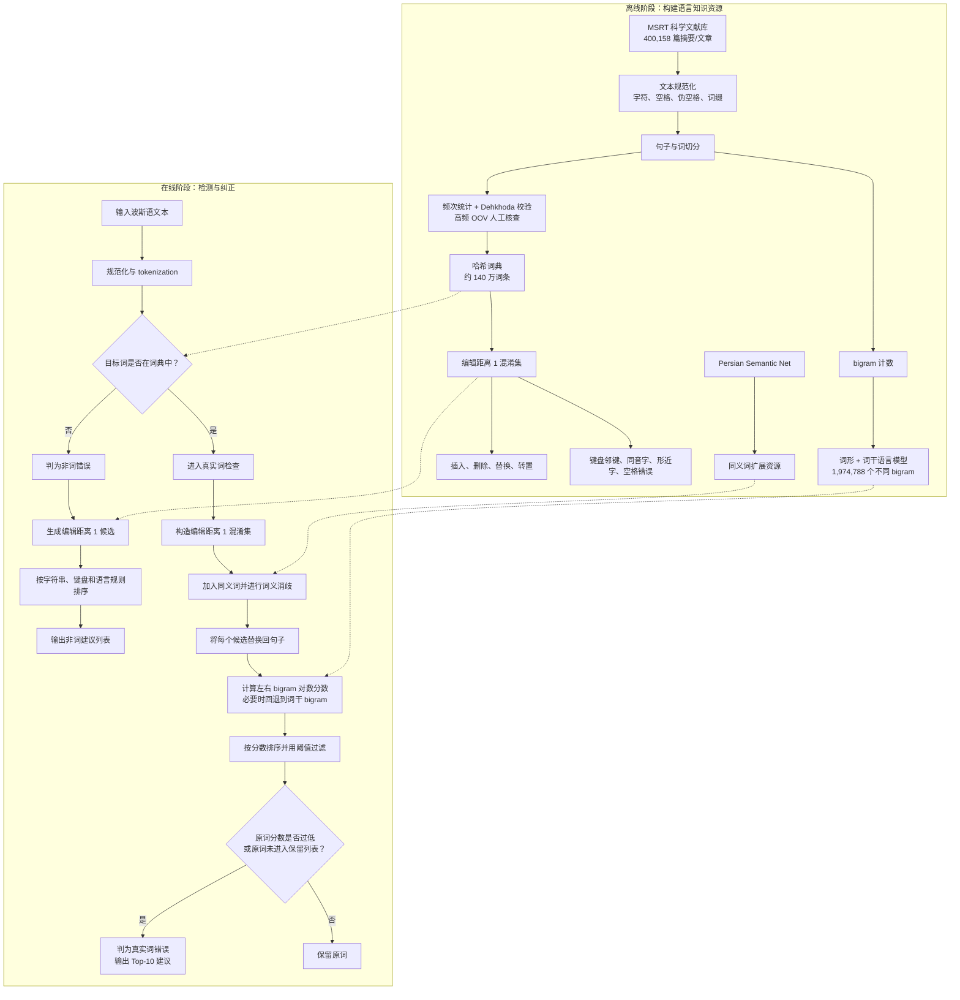

# Perspell: A New Persian Semantic-Based Spelling Correction System

> **中文译名：Perspell——一种新的基于语义的波斯语拼写纠错系统**

---

## 作者信息

| 作者 | 论文所列机构 | 身份/背景 | 领域大牛认定 |
|---|---|---|---|
| **Mohammad Bagher Dastgheib** | Department of Computer Science and Engineering, School of Electrical and Computer Engineering, Shiraz University, Iran | 第一作者、通讯作者，主要研究波斯语 NLP、信息检索和数字资源处理。其后在伊朗 Regional Information Center for Science and Technology（RICeST）担任计算机工程助理教授，继续从事波斯语信息检索、文本分类和跨语言检索研究。 | **属于波斯语信息处理方向的专业研究者，不属于国际 NLP 资深“大牛”**。没有院士、ACL Fellow、IEEE/ACM Fellow 或国际顶级实验室负责人等证据。 |
| **Seyed Mostafa Fakhrahmad** | 同上 | 论文发表时为 Shiraz University 计算机科学与工程研究人员/教师；后续公开资料显示其为该校副教授，研究覆盖数据挖掘、信息检索、文本处理、缺陷定位、知识图谱和复杂网络。Scopus 作者页显示其有较持续的发表记录。 | **属于资深度较高的应用型计算机学者，但并非波斯语 NLP 的国际顶级领军人物**。研究方向较宽，Perspell 只是其文本挖掘/信息检索工作的一部分。 |
| **Mansoor Zolghadri Jahromi** | 同上 | 末位作者、团队资深教授。1988 年起任职 Shiraz University，长期研究模式识别、模糊系统、机器学习、信息检索与 Web 搜索；拥有较长期的学术积累，公开资料显示其发表过多篇模式识别与分类研究。 | **团队中学术资历最深的教授，可称为伊朗模式识别/智能系统方向的资深学者**；但他不是以波斯语 NLP 为核心的国际公认“大牛”，也未发现 Fellow/院士级荣誉证据。 |

## 团队相关信息

该团队是**伊朗 Shiraz University 计算机科学与工程系内部的应用人工智能、模式识别与信息检索研究团队**。从作者结构看，更接近“**资深教授 Mansoor Zolghadri Jahromi 提供模式识别和信息检索方法指导，由年轻教师/研究人员完成波斯语 NLP 系统实现**”的组合。

团队的优势不在语言学理论，而在于：

- 大规模科学文献资源处理；
- 词典与信息检索系统构建；
- 统计语言模型、模式识别和候选排序；
- 将波斯语特有的字符、键盘和空格问题工程化。

因此，它可以被视为**Shiraz University 内具有较强工程能力的文本信息处理团队**，但不是 ACL/EMNLP 意义上的世界顶级 NLP 主力实验室。Mansoor Zolghadri Jahromi 是团队中最接近“资深大牛”的成员，但其主要影响力来自模式识别、模糊系统和机器学习，而非波斯语拼写纠错本身。

## 论文发表时间

| 项目 | 具体日期 | 来源/说明 |
|---|---|---|
| Advance Access 首次在线 | **2016年3月26日** | 论文 PDF 首页明确标注 “Advance Access published on 26 March 2016”；Crossref 记录为 3 月 27 日，可能源于元数据时区或登记口径 |
| 正式卷期出版 | **2017年9月** | *Digital Scholarship in the Humanities*, Volume 32, Issue 3 |
| 页码 | **543–553** | 正式期刊版本，共 11 页 |
| 出版机构 | **Oxford University Press（OUP）** | 代表 European Association for Digital Humanities 出版 |
| DOI | **10.1093/llc/fqw015** | [DOI](https://doi.org/10.1093/llc/fqw015) |
| 论文状态 | **正式同行评议期刊论文** | 不是预印本、在审稿件或双盲评审阶段稿件 |
| 当前引用情况 | **Semantic Scholar 8 次，其中 influential citations 3 次** | 截至 **2026年7月29日**；OpenAlex 为 4 次、Crossref 为 1 次，不同数据库覆盖范围和引用合并规则不同 |

该论文于 **2016年3月26日首先以 Advance Access 形式在线公开**，随后编入 **2017年9月出版的第 32 卷第 3 期**。引用这篇论文时通常写作 **Dastgheib et al. (2017)**；讨论首次公开时间时，则应注明 **2016 年已在线发表**。

## 摘要

本文提出波斯语拼写纠错系统 **Perspell**，同时处理：

1. **非词错误（nonword error）**：错误形式不在词典中；
2. **真实词错误（real-word error）**：输入本身是合法词，但放在当前语境中不合适。

系统采用离线—在线两阶段架构。离线阶段从伊朗 MSRT 科学论文库的 400,158 篇摘要/文章中构建大规模词典和二元语言模型，并预先生成编辑距离为 1 的混淆集；在线阶段先规范化字符、半空格和词缀，再通过哈希词典检测非词错误。对于真实词错误，Perspell 将编辑距离候选与语义网络中的同义词结合，通过词义消歧过滤无关候选，再利用左右 bigram 概率对原词和替换候选的句子进行评分。

论文在 100 篇科学论文摘要上人工注入约 20% 的合成错误。非词错误检测 F1 达到 **0.9825**，候选建议 F1 为 **0.8831**；真实词错误检测的 Recall 为 **0.9690**，但 Precision 只有 **0.5873**，F1 为 **0.7261**；在已检测错误的建议阶段，F1 为 **0.9265**。Perspell 的主要贡献是首次较系统地把**大规模科学文献词典、波斯语字符/键盘知识、bigram 语言模型、词干回退、语义网络和词义消歧**组合起来处理两类错误。不过，测试错误全部是合成的，且测试摘要可能来自构建语言模型的同一文献库，因此结果存在明显的域内偏置和潜在数据泄漏风险。

---

## 一、这篇论文讲了一个什么样的故事？

这篇论文讲的是：**只看“一个词是否存在于词典”无法完成真正的拼写纠错，系统还必须判断这个合法词是否适合当前语境。**

传统词典式拼写检查器擅长发现非词错误。例如，一个词因为插入、删除或替换字符而不再出现在词典中，系统很容易把它标为错误。但真实词错误更加棘手：用户输入的是另一个确实存在的词，词典查找会认为它完全合法，只有放回句子后才会发现语义或搭配异常。

例如，原意是“德黑兰这座**城市**的特点”，用户却输入了一个与“城市”编辑距离很近、但意思是“花蜜”的合法波斯语词。两个词都在词典里，只有结合左右上下文，才能判断“花蜜”不应该出现在这个位置。

Perspell 因此把纠错分成两条路径：

- **非词路径**：词典判断 + 编辑距离 + 波斯语键盘/同音/形近规则；
- **真实词路径**：编辑距离混淆集 + 同义词扩展 + 词义消歧 + bigram 语境概率。

为了给这套系统提供知识基础，作者先从 40 万余篇跨学科科学文献中构建约 140 万词条的词典、近 200 万个不同 bigram 和一套语义候选资源。系统再以原词和候选词分别替换句中目标位置，比较整句概率：如果原词得分过低，或不能进入阈值过滤后的候选列表，就将其判为真实词错误。

实验表明，这条路线极大提高了真实词错误的**召回率**：Vafa 只召回约 9.4%，Perspell 达到约 96.9%。但代价是 Perspell 的检测 Precision 只有 58.7%，即会产生较多误报。因此，论文真正证明的是：

> **利用语境与语义资源可以把过去几乎检测不到的真实词错误大量召回，但尚未解决误报控制和跨域泛化问题。**

---

## 二、本文的核心思想和创新点

### 1. 核心思想

本文的核心思想是：

> **使用大规模领域语料构建词典和 bigram 语言模型，以编辑距离产生局部候选，再通过语义网络、词义消歧和上下文概率判断一个合法词是否适合当前句子。**

其方法不是现代意义上的神经语义模型。“semantic-based”主要体现在：

- 使用 Persian Semantic Net 提供同义词；
- 用词义消歧过滤与当前句义无关的同义词；
- 用上下文语言模型验证候选。

系统仍然以**词典、规则、编辑距离和统计 n-gram**为主体。

### 2. 关键创新点

1. **统一处理非词错误和真实词错误。**  
   当时许多波斯语拼写检查器只能发现不在词典中的错误；Perspell 将合法但语境错误的词纳入同一系统。

2. **建立大规模科学文本词典。**  
   作者从 400,158 篇跨学科 MSRT 科学文献中抽取词项，经 Dehkhoda 词典和人工核查后，建立约 140 万个本土词和借词组成的词典。这显著扩大了专业词汇覆盖。

3. **显式建模波斯语特有错误。**  
   候选生成除了普通插入、删除、替换和转置，还考虑：
   - 同音但字形不同的波斯字符；
   - 形近、点数不同的字符；
   - 波斯语键盘相邻键；
   - 普通空格、伪空格/ZWNJ 以及连写/拆分错误；
   - 词缀连接形式。

4. **将语义网络加入混淆集扩展。**  
   不仅搜索编辑距离为 1 的词，还加入候选词的同义词，以缓解 bigram 稀疏和纯字形候选覆盖不足。

5. **用词义消歧控制同义词噪声。**  
   语义扩展容易引入与当前句义不相关的候选，因此作者使用 WSD 过滤同义词。这是题目中“semantic-based”的核心来源。

6. **同时记录词形和词干 bigram。**  
   当完整词形组合没有语料计数时，系统回退到词干组合，以缓解波斯语丰富词形变化带来的零频问题。

7. **用上下文概率重新排序。**  
   每个候选替换目标词后重新计算句子 bigram 对数概率；原词得分低于阈值时被视为真实词错误。

8. **用检测与建议两个阶段分别评估。**  
   论文没有只报告一个总体 Accuracy，而是分别计算错误检测和候选建议的 Precision、Recall 与 F1，这比单一命中率更有诊断价值。

需要注意：Damerau–Levenshtein、bigram、哈希词典、同义词扩展和 WSD 各自都不是新算法；本文创新主要是**面向波斯语拼写纠错的系统组合与知识资源构建**。

---

## 三、方法是怎么实现的？(How does it work?)

### 1. 架构

Perspell 采用**离线知识库构建 + 在线双分支纠错**架构：

**图注**：依据论文 **Figure 1（Perspell 总体架构）**、**Figure 2（真实词错误检测算法）**以及第 3.1–3.2 节综合重绘。原 Figure 1 只给出模块级结构，本图补充了正文中的数据流和判断条件。

### 2. 关键算法

#### 2.1 离线文本规范化与词典构建

1. 将 MSRT 论文文档转换为纯文本；
2. 统一阿拉伯语/波斯语字符变体，例如不同编码的 yeh 和 kaf；
3. 将普通空格、伪空格/ZWNJ 和词缀连接形式规范化；
4. 执行句子切分和词切分；
5. 统计词频；
6. 使用 Dehkhoda 词典检查常用词；
7. 删除低于阈值的低频形式；
8. 对高频但不在 Dehkhoda 中的专业 OOV 词人工检查；
9. 得到约 140 万词条的哈希词典。

论文没有给出：

- 低频阈值具体数值；
- 人工核查者人数及一致性；
- 词典中 140 万词与 Table 2 中 1,044,568 distinct words 的对应关系；
- 测试摘要是否从语言模型训练语料中排除。

#### 2.2 非词错误检测

对句子中每个词 $w$：

1. 在哈希词典中查询；
2. 若 $w\notin V$，标记为非词错误；
3. 生成与 $w$ 编辑距离为 1 的候选；
4. 候选操作包括插入、删除、替换、相邻转置；
5. 额外加入键盘邻键、同音字、形近字和空格操作；
6. 只保留词典中存在的候选并排序。

论文称哈希查询单词为 $O(1)$，因此检查一个含 $M$ 个词的句子为 $O(M)$。但这个分析只覆盖**错误检测**，没有计入候选生成、语言规则和排序成本。

#### 2.3 真实词混淆集构建

对于词典中合法的目标词 $w_i$：

1. 生成所有满足 $d_{\mathrm{DL}}(w_i,c)=1$ 的合法词 $c$；
2. 从 Persian Semantic Net 中为候选加入同义词；
3. 对同义词做词义消歧，删除与当前句子主题/词义无关的项；
4. 原词和剩余候选构成最终混淆集。

论文没有说明语义网络的版本、规模、同义词关系类型以及 WSD 的具体算法和准确率，因此该部分难以完全复现。

#### 2.4 bigram 候选评分

1. 将目标位置依次替换为混淆集中的每个候选；
2. 计算替换后句子的 bigram 概率；
3. 使用对数概率避免多个小概率相乘造成下溢；
4. 如果词形 bigram 未出现，尝试词干 bigram；
5. 通过平滑处理零频；
6. 按分数对候选排序，保留通过阈值的前 10 个候选。

#### 2.5 真实词检测

Figure 2 的核心判断逻辑可概括为：

1. 先计算原词的上下文分数；
2. 若分数为零，提取词干并查询词干分数；
3. 原词和词干都无法获得有效语言模型支持时，标为错误；
4. 若存在有效分数，则与阈值比较；
5. 得分低于阈值或原词不在最终保留列表时，标为真实词错误；
6. 否则保留原词。

阈值由混淆集中最高排名候选的分数乘以一个小于 1 的系数得到，并应在训练集上调整。但论文没有报告该系数、训练集划分和调参过程。

### 3. 关键公式

#### （1）完整语言模型链式分解

对于词序列 $w_1,\ldots,w_n$：

$$
P(w_1,w_2,\ldots,w_n)
=
\prod_{i=1}^{n}
P(w_i\mid w_1,\ldots,w_{i-1})
$$

#### （2）bigram 马尔可夫近似

假设当前词只依赖前一个词：

$$
P(w_1,\ldots,w_n)
\approx
P(w_1\mid \langle S\rangle)
\prod_{i=2}^{n}P(w_i\mid w_{i-1})
P(\langle /S\rangle\mid w_n)
$$

论文文字称一个词依赖“前一个词和后一个词”，实际做法是通过候选替换后同时改变：

- 左 bigram：$(w_{i-1},w_i)$
- 右 bigram：$(w_i,w_{i+1})$

因此候选的局部评分可更直接写成：

$$
\operatorname{LocalScore}(c)
=
\log P(c\mid w_{i-1})
+
\log P(w_{i+1}\mid c)
$$

#### （3）整句对数似然

$$
\operatorname{Score}(w_1,\ldots,w_n)
=
\log P(w_1\mid \langle S\rangle)
+
\sum_{i=2}^{n}\log P(w_i\mid w_{i-1})
+
\log P(\langle /S\rangle\mid w_n)
$$

对数将乘法转换为加法，避免概率连乘下溢。

#### （4）Damerau–Levenshtein 候选集

可将非词/真实词候选集写为：

$$
C_{\mathrm{edit}}(w)
=
\{c\in V\mid d_{\mathrm{DL}}(w,c)=1\}
$$

再加入语义候选：

$$
C(w)
=
C_{\mathrm{edit}}(w)
\cup
\operatorname{WSDFilter}
\left(
\bigcup_{c\in C_{\mathrm{edit}}(w)}
\operatorname{Syn}(c)
\right)
$$

#### （5）阈值判定

论文给出的思想可抽象为：

$$
\tau=\alpha\cdot S_{\mathrm{best}},
\qquad 0<\alpha<1
$$

$$
\operatorname{RealWordError}(w_i)
=
\mathbb{I}\left[
S(w_i)<\tau
\ \lor\
w_i\notin C_{\mathrm{kept}}
\right]
$$

但原文的分数方向存在可疑之处：Table 4 中排名第 1 的候选分数 **0.302** 小于排名第 2 的 **2.915**，而对数概率通常应“越大越好”。这暗示实现可能使用负对数损失或其他变换，但论文公式仍写作 $\log P$。因此阈值方向和分数定义不能被严格复现。

#### （6）Precision、Recall 与 F1

$$
\operatorname{Precision}
=
\frac{TP}{TP+FP}
$$

$$
\operatorname{Recall}
=
\frac{TP}{TP+FN}
$$

$$
F_1
=
2\cdot
\frac{\operatorname{Precision}\cdot\operatorname{Recall}}
{\operatorname{Precision}+\operatorname{Recall}}
$$

论文分别在“错误检测”和“候选建议”阶段计算这三项指标。

#### （7）复杂度分析

若句子有 $M$ 个词、平均词长为 $L$、字母表大小为 $|\Sigma|$、每个目标词保留 $C$ 个候选，则：

- 哈希词典检测约为：

$$
O(M)
$$

- 生成编辑距离 1 的候选数量量级约为：

$$
O(|\Sigma|L+L)
$$

- 若只重算目标词左右两个 bigram，真实词候选评分约为：

$$
O(MC)
$$

若每个候选都重新计算整句概率，则会达到 $O(M^2C)$。论文没有说明实现是否使用了局部增量计算，也未报告实际延迟。

---

## 四、实验效果 (Experimental Results)

### 1. 实验设置

#### 语言资源

| 资源属性 | 数值 |
|---|---:|
| 科学摘要/文章数量 | **400,158** |
| 段落数量 | **1,400,533** |
| 句子数量 | **7,703,041** |
| 字符数量 | **46,218,187** |
| 不同词形数量 | **1,044,568** |
| 不同 bigram 数量 | **1,974,788** |
| 最终词典规模 | 约 **1,400,000** 个本土词及借词 |

正文有时将原始材料称为“articles”，Table 2 则写作“abstracts”；摘要还声称构建了“parallel corpus”，但正文实际描述的是**波斯语单语科学文献库**。这些术语并不一致。

#### 测试集

| 项目 | 数值 |
|---|---:|
| 测试摘要 | **100 篇** |
| 段落 | **270** |
| 句子 | **1,243** |
| 词数 | **13,765** |
| 字符数（含空格） | **77,625** |
| 注入错误比例 | 每篇约 **20% 的词** |

#### 非词错误构造

- 从摘要中随机选择约 20% 的词；
- 通过插入、删除、替换或转置生成错误；
- 替换字符可来自同音字或波斯语键盘邻键；
- 所有生成错误均与正确词编辑距离为 1；
- 比较 **Perspell、Vafa、Virastyar**。

#### 真实词错误构造

- 随机选择约 20% 的词；
- 替换词必须存在于词典中；
- 替换词与原词编辑距离必须为 1；
- 停用词和长度小于 3 的词被排除；
- 找不到合法替换时改选其他词；
- 比较 **Perspell 与 Vafa**。

### 2. 主要结果

#### 非词错误检测

| 系统 | Precision | Recall | F1 |
|---|---:|---:|---:|
| **Perspell** | **0.966164** | **1.000000** | **0.982510** |
| Virastyar | 0.965755 | 0.959147 | 0.961604 |
| Vafa | 0.919883 | 0.944902 | 0.930643 |

Perspell 在检测阶段取得最高 F1，尤其是 Recall 达到 1。但所有测试错误都是根据系统假设生成的编辑距离 1 错误，且 Perspell 使用的科学词典与测试域高度一致。

#### 非词错误建议

| 系统 | Precision | Recall | F1 |
|---|---:|---:|---:|
| **Perspell** | **0.877488** | 0.888706 | **0.883061** |
| Vafa | 0.723880 | **0.988056** | 0.835585 |
| Virastyar | 0.797407 | 0.805312 | 0.801299 |

Vafa 的建议 Recall 更高，但 Precision 较低；Perspell 在精确率与召回率之间更均衡，因此 F1 最好。

#### 真实词错误检测

| 系统 | Precision | Recall | F1 |
|---|---:|---:|---:|
| **Perspell** | 0.587288 | **0.969037** | **0.726091** |
| Vafa | **0.815556** | 0.094179 | 0.165409 |

这张表是全文最重要的结果：

- Perspell 的真实词错误 Recall 从 Vafa 的 **9.4%** 提升到 **96.9%**；
- 但 Perspell Precision 只有 **58.7%**，说明误报很多；
- 摘要所谓“real word error detection rate 95%”主要指**召回率**，不能理解为 95% Accuracy 或 95% Precision；
- 平均每篇文档漏检错误数：Vafa 为 **23.6**，Perspell 为 **5.1**。

#### 真实词错误建议

| 系统 | Precision | Recall | F1 |
|---|---:|---:|---:|
| **Perspell** | **0.923676** | 0.929545 | **0.926527** |
| Vafa | 0.759259 | **0.986728** | 0.794433 |

Perspell 的建议列表更精确、更均衡；Vafa 仍有更高 Recall，但候选噪声较大。

**核心结论：**

- Perspell 在论文构造的科学文本测试集上，四项 F1 指标均优于对照系统。
- 最大优势出现在**真实词错误检测召回率**：96.9% 对 9.4%。
- 最大弱点也出现在真实词检测：Precision 只有 58.7%，会将不少正确词误报为错误。
- 非词性能提升的一部分来自更大的科学领域词典，而不一定来自算法本身。作者也明确承认 Vafa 的新闻词典缺少专业词汇。
- 真实词建议 F1 很高，但这一指标很可能是在系统已检测到的案例或候选集合上计算，不能替代端到端纠错准确率。

### 3. 消融实验与关键发现

论文**没有正式的消融实验**。它没有分别移除：

- 语义网络；
- 词义消歧；
- 词干 bigram；
- 平滑；
- 键盘规则；
- 同音/形近字符；
- 词典扩容；
- bigram 上下文。

因此无法判断性能提升究竟主要来自大词典、语言模型，还是语义扩展。

**关键发现：**

1. **上下文建模解决了纯词典方法无法处理的真实词错误。**  
   Vafa 的 Precision 较高但 Recall 极低，说明它只在非常少数、把握很高的情形报警；Perspell 则通过语言模型大幅扩大覆盖。

2. **高召回是以误报为代价获得的。**  
   Perspell 的 96.9% Recall 伴随 58.7% Precision，说明阈值策略明显偏向“宁可多报，不要漏报”。

3. **大词典对非词检测极其重要。**  
   Perspell 的专业科学词典比 Vafa 的新闻词典覆盖更多术语，减少了把正确专业词误判为 OOV 的情况。

4. **不能由本实验得出“编辑距离 1 已足够”的普遍结论。**  
   作者认为无需考虑更大的编辑距离，但测试错误本来就全部按编辑距离 1 生成，这个结论具有循环性。

5. **词干回退可以缓解形态稀疏。**  
   某些完整词形 bigram 未出现，而对应词干 bigram 有计数；同时保存两者是适合波斯语的工程策略。

6. **语义扩展与 WSD 的独立作用没有被证明。**  
   题目强调 semantic-based，但没有“有/无语义网络”或“有/无 WSD”的对照，因此不能量化语义模块贡献。

7. **测试可能存在同源语料偏置。**  
   语言模型来自 MSRT 文献库，测试的 100 篇摘要也“从该 repository 中抽取”。论文未说明是否在训练前留出，因而可能包含直接 n-gram 记忆或词频泄漏。

**实验部分总结：**

本文提供了较完整的检测/建议对照表，清楚展示了 Perspell 在合成科学文本错误上的优势，尤其是把真实词错误从“几乎检测不到”提升到高召回。但实验不能被视为对现实部署能力的充分证明：错误比例高达 20%、错误全部为编辑距离 1、测试域与语言模型同源、基线词典资源不一致，而且没有模块消融和统计显著性分析。

---

## 五、优点与局限性

### ✅ 1. 优点

1. **同时覆盖两类拼写错误。**  
   不仅检查词典外错误，也处理合法词误用，比单纯词典查找更接近完整纠错系统。

2. **深入考虑波斯语书写特点。**  
   同音字符、形近字符、键盘布局、伪空格、连写/拆分和词缀问题都进入系统设计。

3. **构建了较大规模的领域资源。**  
   40 万余篇科学文本、近 200 万个不同 bigram 和约 140 万词条在当时具有较高工程价值。

4. **语义与统计信息结合。**  
   编辑距离负责召回字形候选，语义网络扩大覆盖，WSD 控制噪声，bigram 负责语境排序，模块分工清楚。

5. **使用词形和词干两级语言模型。**  
   这是应对波斯语形态变化和数据稀疏的务实方案。

6. **评估拆分为检测和建议。**  
   可以看出系统究竟是漏检、误报，还是候选排序失败。

7. **真实词结果揭示了重要的 Precision–Recall 权衡。**  
   论文没有用单一“95%”掩盖所有结果，Table 7 仍展示了只有 58.7% 的 Precision。

8. **与当时可用的波斯语系统进行了比较。**  
   非词部分比较 Vafa 和 Virastyar，真实词部分比较 Vafa，使结果具备一定历史参照。

### ⚠️ 2. 局限性（研究边界与待解问题）

1. **测试错误完全由算法人工合成。**  
   真实用户错误的字符分布、语义混淆、词频和上下文通常比随机替换复杂得多。

2. **20% 错误率远高于真实文本。**  
   分类指标会受错误先验影响；在真实低错误率环境中，58.7% Precision 可能进一步恶化。

3. **真实词错误被限定为编辑距离 1。**  
   许多真正的选词错误、同义误用、语法搭配错误并不与正确词字形相近，Perspell 无法覆盖。

4. **可能存在数据泄漏。**  
   测试摘要来自构建词典和 bigram 模型的同一 repository，未说明严格留出策略。

5. **基线资源不公平。**  
   Perspell 使用科学文献词典，Vafa 使用新闻词典，而测试也是科学摘要；算法效果与词典覆盖效果被混在一起。

6. **“semantic-based”模块严重欠描述。**  
   Persian Semantic Net 的来源、规模、关系类型、WSD 模型、训练数据和准确率均未说明。

7. **没有语义模块消融。**  
   无法知道高性能是否主要由大词典和 bigram 贡献，而不是语义网络。

8. **阈值不可复现。**  
   系数 $\alpha$、调参集、最优值和不同领域的敏感性均未报告。

9. **分数定义可能自相矛盾。**  
   公式把 Score 写成对数概率，理论上越大越好；示例表中排名更高的候选却有更小的正数分数，可能实际使用负对数，但没有说明。

10. **语料规模表述不一致。**  
    摘要称输出包括“parallel corpus”，正文却是 monolingual corpus；正文称 400,000 articles，Table 2 写 400,158 abstracts。

11. **词典规模数据缺乏解释。**  
    Table 2 的不同词数为 1,044,568，正文最终词典约 1,400,000；二者为何不同、是否包含派生词或人工扩展没有交代。

12. **语言模型过于局部。**  
    波斯语词序相对自由，bigram 只能看到相邻搭配，难以识别长距离主谓一致、语义角色和跨短语依赖。

13. **真实词检测误报率高。**  
    58.7% Precision 意味着接近四成报警是误报，可能严重影响用户体验。

14. **建议阶段指标口径不够清楚。**  
    论文没有明确候选列表长度、是否按 top-1/top-10 统计，以及检测失败是否计入建议阶段。

15. **没有端到端自动纠正指标。**  
    用户真正关心的是正确词能否排在第一名以及自动替换后是否正确，论文未报告 Top-1 Accuracy、MRR 或 sentence accuracy。

16. **没有运行效率与内存数据。**  
    约 140 万词典、近 200 万 bigram、语义扩展和 WSD 的实际延迟、吞吐量与存储成本均未报告。

17. **没有统计显著性分析。**  
    只在一组 100 篇摘要上给出平均指标，没有重复实验、置信区间或显著性检验。

18. **跨域泛化未经验证。**  
    结论仅适用于科学文本；新闻、社交媒体、学生作文、OCR 和口语文本可能表现不同。

19. **资源公开承诺缺乏可核验细节。**  
    论文说会免费发布语料、模型、tokenizer 和 Perspell，但正文未给出稳定下载地址、许可证或版本号。

---

## 六、其他

### 第一性原理

#### 1. 拼写纠错是“候选召回 + 语境判别”

完整纠错系统至少包含两类问题：

$$
\text{候选召回：正确词是否进入候选集合？}
$$

$$
\text{候选排序：正确词能否在当前上下文中排到最前？}
$$

编辑距离解决第一部分，语言模型解决第二部分。若正确词从未进入混淆集，再好的语言模型也无法恢复它。

#### 2. 合法性与适切性是两个不同判断

词典只能回答：

$$
w\in V\ ?
$$

语境纠错需要回答：

$$
P(w_i\mid \text{context})\text{ 是否足够高？}
$$

真实词错误正是二者分离的结果：一个词在类型层面合法，在语境层面不合适。

#### 3. 资源质量与算法质量不能混为一谈

非词检测可写为：

$$
\operatorname{Error}(w)=\mathbb{I}[w\notin V]
$$

此时系统性能高度依赖词典 $V$。扩大专业词典可能比改进检测算法更有效，但也可能让真正的错误碰巧落入罕见词条，从而漏检。因此必须分别比较：

- 相同算法、不同词典；
- 相同词典、不同算法；
- 相同语料域与跨语料域。

#### 4. 高召回并不等于高可用性

Perspell 检出约 96.9% 真实词错误，但 Precision 仅 58.7%。在真实文本中错误很少时，即使 Recall 很高，也可能产生大量误报。若错误先验为 $\pi$，实际后验精度取决于：

$$
P(\text{真错}\mid\text{报警})
=
\frac{\mathrm{TPR}\cdot\pi}
{\mathrm{TPR}\cdot\pi+\mathrm{FPR}\cdot(1-\pi)}
$$

当 $\pi$ 很低，微小 FPR 都会显著降低用户看到的报警质量。

#### 5. bigram 本质上是局部搭配模型

候选替换只改变左右两个 bigram，因此无需每次重算整句：

$$
\Delta(c)
=
\log P(c\mid w_{i-1})
+
\log P(w_{i+1}\mid c)
-
\log P(w_i\mid w_{i-1})
-
\log P(w_{i+1}\mid w_i)
$$

这种局部增量评分高效，但无法理解远距离语义。现代上下文编码器的优势，就在于条件分布不再局限于相邻两个词。

#### 6. “语义扩展”同时提高召回和噪声

同义词扩展会扩大候选集合：

$$
|C_{\mathrm{semantic}}|\ge|C_{\mathrm{edit}}|
$$

候选越多，正确词被召回的概率可能越高，但误报和计算成本也会上升。WSD 的作用不是锦上添花，而是控制语义扩展带来的组合爆炸。

#### 7. 评测数据必须独立于系统假设

若系统只搜索编辑距离 1，而测试也只生成编辑距离 1 错误，那么实验测量的是“算法在自己定义的问题上表现如何”，而不是“现实错误是否符合这个定义”。高质量评测应从真实错误出发，再观察其距离分布，而不是先固定距离再生成错误。

### 领域空白

1. **真实波斯语错误语料。**  
   建立来自学生作文、专业写作、社交媒体、OCR 和输入法日志的自然错误对，并标注错误类型、正确词、上下文和多个可接受修正。

2. **严格的数据隔离。**  
   按文档、作者、时间和领域切分语言模型训练集与测试集，避免 n-gram 记忆和词典泄漏。

3. **资源公平的基线比较。**  
   所有系统使用同一词典、同一训练语料和同一测试集，再单独测试资源替换带来的增益。

4. **语义模块消融。**  
   依次比较：

$$
\text{Edit only}
\rightarrow
\text{Edit + Bigram}
\rightarrow
\text{+ Stem}
\rightarrow
\text{+ Synonym}
\rightarrow
\text{+ WSD}
$$

从而确定每个模块的独立贡献。

5. **从 bigram 走向全句上下文模型。**  
   使用 masked language model、Transformer 或生成式纠错模型捕捉自由词序和长距离依赖，同时保留规则候选的可解释性。

6. **开放词汇与形态学建模。**  
   对词干、词缀、半空格和派生规则进行显式分析，避免把所有未登录词都当成错误。

7. **超越编辑距离 1 的候选召回。**  
   使用加权编辑距离、音系表示、键盘通道模型、词向量和检索模型覆盖多字符错误与非字形近邻的真实词误用。

8. **误报控制与校准。**  
   对模型输出进行概率校准，报告 Precision–Recall 曲线，并根据自动改写、交互提示和后台审校等场景设置不同阈值。

9. **Top-k 和端到端评测。**  
   至少报告 Top-1、Recall@5、Recall@10、MRR、sentence correction accuracy 以及自动替换后的净收益。

10. **多领域鲁棒性。**  
    在科学、新闻、文学、医学、法律、口语和社交媒体之间做域内/跨域矩阵评测。

11. **可解释的上下文纠错。**  
    告诉用户触发报警的是哪一个搭配、语义关系或字符规则，减少高误报系统对用户信任的损害。

12. **高效候选检索。**  
    对大词典使用 BK-tree、Trie/FST、SymSpell 或向量检索，量化延迟、吞吐量、内存和移动端部署成本。

13. **公开、版本化的知识资源。**  
    发布语料、词典、语义网络、WSD 模型、训练脚本和许可证，并对词典更新建立可审核流程。

---

## 一句话评价

Perspell 是波斯语拼写纠错发展史上一项有代表性的**统计—语义混合系统**：它用领域词典解决非词错误，用编辑距离、bigram、词干、同义词和 WSD 大幅提高真实词错误召回率。其“96.9% 检出率”很有吸引力，但伴随 **58.7% Precision**，且建立在同源科学语料与编辑距离 1 合成错误上。因此，这篇论文证明了**上下文纠错方向的可行性**，尚未证明系统在真实开放环境中已经达到可靠自动纠错水平。

## 资料来源

- 原始论文：[Perspell A new Persian semanticbased spelling correction system.pdf](E:/【2】CityU/【2】博士论文/【1】小语种/【1】论文/【1】综述/参考文献/Persian/Perspell%20A%20new%20Persian%20semanticbased%20spelling%20correction%20system.pdf)
- 正式出版页：[Oxford Academic](https://academic.oup.com/dsh/article/32/3/543/2669740)
- DOI：[10.1093/llc/fqw015](https://doi.org/10.1093/llc/fqw015)
- 书目信息与引用记录：[Semantic Scholar Corpus ID 33883645](https://www.semanticscholar.org/paper/7523853d7377ed9df51c667d8782d4de35b0c38a)
- Seyed Mostafa Fakhrahmad 书目档案：[DBLP](https://dblp.org/pid/162/9263)
- Mansoor Zolghadri Jahromi 学术背景：[ScienceDirect 作者简介](https://www.sciencedirect.com/science/article/abs/pii/S0925231212008995)
- Mohammad Bagher Dastgheib 后续机构与职称：[DOAJ/RICeST 论文记录](https://doaj.org/article/2ce08ed557ef4be1a139ccfd722d50d1)

---
> 本文由 ChatGPT（Codex） 生成

