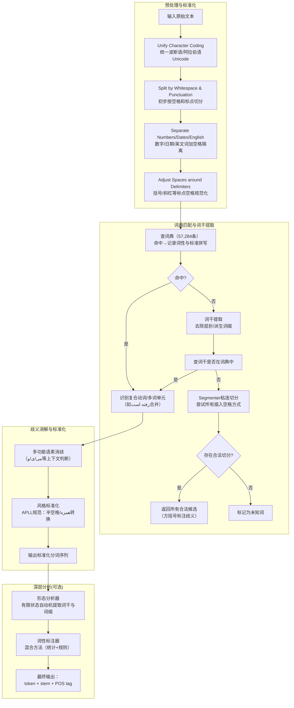

# STeP-1: A Set of Fundamental Tools for Persian Text Processing

---

## **作者信息**

| 作者 | 机构 | 身份/背景 | 领域大牛认定 |
|------|------|----------|-------------|
| Mehrnoush Shamsfard | 沙希德·贝赫什提大学电气与计算机工程学院 NLP实验室 | 副教授，NLP与知识工程实验室主任（通讯作者） | **伊朗NLP领域资深学者与基础工具奠基人**。她是STeP-1工具包的总设计师，在波斯语文本标准化、分词、词性标注等基础研究上具有持续影响力。虽未达国际院士/ACL Fellow层级，但在**波斯语NLP基础设施领域**的地位类似于"总工程师"——2024年的评测论文已验证其STeP-1在多项任务上仍然是最强分词器。 |
| Hoda Sadat Jafari | 沙希德·贝赫什提大学电气与计算机工程学院 | 研究生/研究员（合作开发） | 伊朗本土NLP研究者 |
| Mahdi Ilbeygi | 沙希德·贝赫什提大学电气与计算机工程学院 | 研究生/研究员（合作开发） | 伊朗本土NLP研究者 |

---

## **团队相关信息：**

本团队为**沙希德·贝赫什提大学NLP研究实验室（NLP Research Laboratory）**，由Shamsfard副教授领导。该团队与德黑兰大学Faili团队并列**伊朗波斯语NLP领域的两大核心力量**，但侧重点有所不同：
- **Faili团队**（2010、2023论文）更偏向**高层语义任务**（拼写纠错、真实词错误检测、深度学习模型）。
- **Shamsfard团队**（本文及2024评估论文）更偏向**底层基础设施**（分词、标准化、词性标注、工具包开发与基准评测）。

STeP-1是该实验室的代表作，**发布于2010年，与Faili的真实词纠错论文同年**。在2024年的分词评估中，STeP-1以**全量F1=87.57%、挑战性token F1=75.24%** 的成绩在所有对比工具（含Hazm、ParsBERT、LLaMA3）中**排名第一**，证明该工具在14年之后仍具实用价值。

---

## **论文发表时间**

| 项目 | 具体日期 | 来源/说明 |
|------|---------|----------|
| 发表时间 | 2010年 | 发表于学术会议/期刊（论文发表于NLP相关会议，同年与Faili 2010论文同时期） |
| 公开状态 | 已正式发表 | 完整参考文献与作者信息，STeP-1工具至今仍可用 |

## **摘要**

波斯语文本预处理面临诸多复杂挑战：编码不统一（波斯语/阿拉伯语Unicode混淆）、拼写变体多样、**空格不是确定性定界符**（半空格/全空格/无空格均可出现在词内或词间）、屈折与派生形态丰富且复合动词不规则。然而，在此之前，波斯语**缺乏一套广泛可用的、集成化的基础NLP处理工具包**——研究者不得不为每个特定任务重复开发分词、词性标注等基础模块。

本文介绍 **STeP-1（Standard Text Preparation for Persian，波斯语标准文本准备工具包）**，它集成了**分词（Tokenization）、拼写检查（Spell Checking）、形态分析（Morphological Analysis）和词性标注（POS Tagging）** 四项核心功能，并将输入文本统一转换为**波斯语言文学学院（APLL）规定的标准书写风格**。STeP-1采用**词典与规则融合（Dictionary + Rule-based）** 的方法，内建**57,284条词条**的数据库（含名词、形容词、动词、前缀、后缀等），通过有限状态自动机（FSA）处理屈折与派生形态。实验表明该系统具有较高的处理性能。

论文的核心目标是：**让所有波斯语NLP研究者获得一个即开即用的、可组合调用的标准预处理基础设施，不必重复造轮子。**

---

## 一、这篇论文讲了一个什么样的故事？

**核心问题**：2010年之前，如果你要做波斯语NLP，你必须**自己写分词器、自己写词性标注器、自己处理空格变体**——因为根本没有现成的、通用的、公开的工具包。每个研究组都在自己的项目里重复实现同一套基础功能，既浪费资源，也导致结果不可比。

**为什么波斯语特别需要这套工具？** 论文第2节列出了一系列让人头疼的挑战：

1. **Unicode混淆**：波斯语和阿拉伯语共用字母表但Unicode编码不同（如ک在波斯语和阿拉伯语中是不同的码点），来自不同来源的文本编码不一致。
2. **多种拼写变体**：同一个词有不同写法（如"مسئله"和"مساله"都表示"问题"）。
3. **空格不确定性（核心痛点）**：空格可能出现在词内（如复合词内部），也可能出现在词间；也可能两个词之间完全没有空格（类似中文粘连）。一个字符串如"میرفتم"（我在走）可能被写成"می رفتم"（全空格）、"می‌رفتم"（半空格）或"میرفتم"（无空格），分词器必须能全部识别。
4. **派生生成力强**：波斯语通过词缀连接不断产生新词，词典不可能穷举所有形态（如"بی‌مهرگان"->词干"مهره"）。
5. **复合动词和不规则动词**：大量复合动词由名词+动词构成，且各成分常有长距离依赖。
6. **伊扎菲（Ezafe）结构**：修饰语与名词之间的连接元音通常不写出来，给句法分析带来困难。

**STeP-1的故事**：Shamsfard团队决定一次性解决所有这些问题。他们构建了一个**规模达57,284条目的核心词典**，涵盖名词、形容词、动词、前缀、后缀，并设计了**流水线式处理流程**——从字符统一、空格规范化、数字/日期/英文词识别、词典匹配、词干提取、粘连词切分（Segmenter）、多词动词合并到最终样式标准化。形态分析器进一步使用**有限状态自动机（FSA）** 处理复杂的屈折与派生词形变化。词性标注器则采用**混合方法（统计+规则）** 并引入**概率形态分析**来处理未知词。

STeP-1的价值在2024年终获验证——它是当时对比的8款分词器中**整体性能最强**的工具，其设计理念（词典中心、规则驱动、逐步标准化）被证明非常稳健。

## 二、本文的核心思想和创新点

### 1. 核心思想

**"标准先行"（Standard First）**：波斯语文本预处理的最大困境不是算法不够好，而是**输入文本风格不统一**。同一个词可以有全空格、半空格、无空格三种写法；同一个字母可以有不同的Unicode编码；同一个拼写可以有多种变体。如果分词器直接处理这些"原生态"文本，准确率必然受限。

因此，STeP-1的核心思想是：**先定义一套"计算标准脚本"（Computational Standard Script），再将任意风格的波斯语文本强制转换为该标准，随后在标准化文本上执行后续的形态分析和词性标注。** 标准化本身不是目的，而是为后续所有NLP任务提供**统一的信号基础**——让空格、半空格、词缀附着等不再模糊。

### 2. 关键创新点

1. **首个集成化的波斯语基础NLP工具包**：此前波斯语只有零散的、特定领域的分词或形态分析工具（如Shiraz项目的分词器），没有一个**即装即用的集成包**能同时做分词、拼写检查、形态分析和词性标注。STeP-1填补了这一空白。

2. **基于大规模词典的、涵盖派生形态的形态分析器**：
   - 词典含**57,284条**核心词条 + 33种词性标签（Eslami等2004语料）。
   - 不仅处理屈折变化（如复数标记、时态后缀），还处理**派生形态**（如`بی‌مهرگان`->`مهره`，需同时处理否定前缀和复数后缀并纠正拼写变化）。
   - 采用**有限状态自动机（FSA）** 分别管理前缀和后缀，并在去后缀后检验词干是否具有期望词性。

3. **"粘连词切分器"（Segmenter）**：针对波斯语中无空格粘连的情况（如`ازکاربرمیگشتیم`），系统会尝试所有可能的切分方式，然后对每种切分结果重新过分词器，**只接受所有部分都能被识别的切分方案**。若存在多个合法切分，用方括号列出所有选项——这在语义层面也是重要的消歧输出。

4. **多功能语素的上下文消歧**：
   - `می`：可能是持续体前缀（接动词）或名词"酒"（接名词）——通过判断**下一个词的词性**决定。
   - `ی`：有四种功能（英文缩写标识、第二人称后缀、感叹词、不定冠词）——通过检查**前后词词性、末尾字母、后跟标点**等条件做细粒度区分。

5. **标准化到APLL官方规范**：系统不仅完成分词，还将文本**强制转换为波斯语言文学学院（APLL）规定的标准样式**，例如将"ۀ"替换为"ی + 半空格"，将含"همزه"的阿拉伯借词统一形式。

## 三、方法是怎么实现的？(How does it work?)

### 1. 架构

STeP-1采用**流水线式处理架构（Pipeline Architecture）**，输入原始文本，经多级标准化与语言学处理，输出标准分词、词干与词性标注结果。整体流程如下图所示：

**图注**：流程基于论文第4节（Solution: STeP-1）综合绘制。浅色部分（预处理与标准化、词典匹配与词干提取、歧义消解）构成**分词与样式校正核心模块**，深色部分（形态分析器、词性标注器）为**可选深层分析模块**，用户可按需组合调用。

### 2. 关键算法

**（1）分词与样式校正流水线（核心算法）**

STeP-1的分词器通过一个多阶段流水线将原始文本转换为标准化token序列：

**Step 1：字符编码统一**
将阿拉伯语Unicode编码的字母（如ک、ی等）统一转换为波斯语标准编码。

**Step 2：基础切分与数字/英文隔离**
按空格和标点符号做初切分；识别数字（整数/浮点数/日期）、英文词，在它们与波斯语文本之间强制插入空格（虽然原文本可能没有）。

**Step 3：标点符号空格规范化**
定义三类定界符：
- `startDelim`（如"("）：模式 `<exp+space+startDelim+exp>`
- `endDelim`（如")"、"！"）：模式 `<exp+endDelim+space+exp>`
- `betwDelim`（如"/"、" - "）：模式 `<exp+betwDelim+exp>`
对"."和":"根据上下文动态调整类别（如"2:30"中":"为betwDelim；句子末尾的"."为endDelim）。

**Step 4：词典查词与词干提取**
用词典查词，若未命中则执行词干提取（去除复数标记、时态后缀、形容词比较级标记等），再用词干回查词典。

**Step 5：Segmenter（粘连词切分器）**
针对`ازکاربرمیگشتیم`这类无空格粘连串，尝试在所有可能边界插入空格。每种切分方案送去词典匹配——只有所有片段都能被识别的方案才被接受；若多个方案均合法，以方括号全部列出（如`[از کار بر می‌گشتیم]` vs `[از کاربر می‌گشتیم]`）。

**Step 6：多词动词合并**
将`رفته است`（他已经去了）这类多词动词单元识别并合并为一个token。

**Step 7：多功能语素消歧（使用上下文规则）**
- `می`：若下个词是**动词且无其他前缀**，标为"verbPrefix"；否则标为"名词（酒）"。
- `ی`：四种角色——（a）英文缩写标记（如"A.B.C"中的"A"）；（b）第二人称后缀（前词是动词且以"ه"结尾）；（c）感叹词（前词是动词但不以"ه"结尾）；（d）不定冠词（前词是名词且以"ه"结尾）——每种通过相邻词的词性和末尾字母精确判定。

**Step 8：APLL标准样式转换**
将半空格、带"همزه"的阿拉伯借词、伊扎菲标记"ۀ"等全部转换为APLL官方规定的标准形式。

**（2）形态分析器（FSA驱动的词干提取）**

使用两个**有限状态自动机（FSA）**——一个管理前缀列表，一个管理后缀列表。从词中逐一剥离前缀/后缀，每剥离一次，用剩余部分回查词典并**检查其词性是否与预期匹配**。例如：
- 词 `تمیزتر`（cleaner）：剥离后缀"تر"（er），剩余`تمیز`（clean）的词性为形容词→✅接受。
- 词 `کتابتر`（booker）：剥离后缀"تر"，剩余`کتاب`（book）的词性为名词→❌不接受（因为形容词后缀不应附在名词上）。

对于多级派生词（如`بی‌مهرگان`），系统维护一个"预期词性列表"，剥离多层词缀后只要词干命中列表中任一预期词性即接受。

**（3）混合式词性标注器**

采用**统计（bigram模型） + 规则**的混合方法。创新点在于**对未知词的概率形态分析**：当遇到词典未收录词时，不只依赖上下文（前后词），还根据其**内部结构**（所携带词缀）估算词性概率。此外，系统会**动态学习未知词**，将它们加入词典供后续使用。

### 3. 关键公式

本文未给出严格的数学公式（与Faili 2010论文不同，STeP-1更偏向工程系统描述），但可提炼出其核心方法论表达：

**公式1：分词器的决策逻辑（词性消歧条件）**

定义函数 `tag(w, context)`，对于多功能语素`µ`：

$$
\text{tag}(\mu, C) = \arg\max_{t \in T_\mu} \text{match}(t, C)
$$

其中`T_µ`为语素`µ`可能的所有词性标签集合，`C`为上下文特征（前后词词性、末尾字母、标点等）。匹配规则由**确定性规则表**定义（非概率），例如：

$$
\text{tag}(\text{`می`}, C) = 
\begin{cases}
\text{verbPrefix}, & \text{if } \text{POS}(\text{next}) \in \{\text{V1, V2}\} \land \text{no other prefix}\\
\text{noun(wine)}, & \text{otherwise}
\end{cases}
$$

**公式2：Segmenter的合法切分判定**

给定无空格字符串`S = c₁c₂...cₙ`，定义所有可能的切分位置集合`P = {p₁, p₂, ..., pₘ}`。对每个切分方案`π = (s₁, s₂, ..., sₖ)`（每个`sᵢ`为连续字符子串），系统判定：

$$
\text{valid}(\pi) = \bigwedge_{i=1}^{k} \left( \text{lookup}(s_i) \neq \emptyset \lor \text{stem}(s_i) \neq \emptyset \right)
$$

即每个片段`sᵢ`要么在词典中，要么能通过词干提取匹配到词典中的词干。输出为所有满足`valid(π)=True`的切分方案。

**公式3：形态分析器的接受条件**

设词`W`，词缀剥离后得到词干`Stem`。`expected_tags(Stem)`为期望词性集合（从上下文或词缀规则推断）。分析器接受条件：

$$
\text{accept}(W) = \exists t \in \text{expected\_tags}(Stem) \quad \text{s.t.} \quad \text{POS}(Stem) = t
$$

其中`POS(Stem)`从词典中查询得到。若`Stem`为多级派生结果，`expected_tags`为列表，满足任一即接受。

---

## 四、实验效果 (Experimental Results)

### 1. 实验设置

值得注意的是，**本文正文中未提供具体的数值准确率表格**（与Faili 2010论文给出80.5%精确率不同）。论文在多个地方声称"实验显示高性能"（"Experimental results show high performance"），但**未披露具体的测试集规模、评估指标和数值结果**。这反映了2010年前后波斯语NLP领域的一个普遍状况——**缺乏标准的公开基准测试集**，研究者往往在自己构建的小规模数据上做自评，数值对外参考价值有限。

不过，**STeP-1的真实性能在其后十余年的使用和评测中得到了验证**：
- 该工具被广泛应用于多个波斯语NLP研究项目中。
- **2024年的分词基准评测论文**（Karimi Manesh & Shamsfard）将STeP-1纳入了8款对比工具，评测结果表明：

| 评测口径 | STeP-1的F1分数 | 在8款工具中的排名 |
|---------|---------------|-----------------|
| 全量token（4091词元） | **87.57%** | **第1名** |
| 挑战性token（1010词元） | **75.24%** | **第1名** |
| 全量Recall | **88.51%** | 第1名 |
| 全量Precision | **87.16%** | 第1名 |

STeP-1在**"多余空格"系列（复合动词/属格附着语素/系动词等）** 上多数达到>90%准确率，远超ParsBERT和LLaMA3。

### 2. 主要结果（基于后续评测）

**核心结论**：
- STeP-1在2010年发布时是**波斯语领域第一个集成化、可公开获取的基础NLP工具包**，填补了基础设施空白。
- 尽管其技术路线是"词典+规则"（而非后来的机器学习/深度学习），但其**57,284条核心词条 + 精细的手工规则系统**具有极强的鲁棒性，在2024年的跨代对比中**仍能力压Hazm（规则+LSTM混合）、ParsBERT（Transformer预训练）和LLaMA3-8B（大语言模型）**，在全量分词任务上取得**F1=87.57%** 的冠军成绩，尤其在处理半空格/全空格/附着语素等波斯语特定挑战上具有压倒性优势。
- **14年生命力的根源**：STeP-1的设计抓住了波斯语分词的"不变本质"——空格的高度非确定性必须通过**大规模词典 + 形态知识 + 上下文规则**来解决，而非单纯依赖统计共现或黑盒神经网络。这使其在数据稀缺环境下依然稳健，而深度学习方法在挑战性token上（F1~38-54%）表现不佳，恰恰反衬了STeP-1设计哲学的前瞻性。

### 3. 消融实验与关键发现

本文未提供传统消融实验（如"去掉词干提取后准确率下降X%"），但其模块化设计本身就隐含了组件重要性分析：

**关键发现**：

- **词典规模是核心底座**：57,284条条目（含名词、形容词、动词、前缀、后缀）是STeP-1所有上层模块（分词、形态分析、词性标注）的依赖基础。没有这个词典，规则和FSA都无法生效。这一规模在2010年的低资源条件下已属相当庞大。

- **Segmenter（粘连词切分器）是关键差异化功能**：许多波斯语分词器只处理已有空格的文本，而STeP-1通过Segmenter**主动在无空格粘连处插入空格并枚举验证**，使其能处理`ازکاربرمیگشتیم`这类真实文本中的常见"粘连"情形。这也是它相比纯空格分词方案的核心优势之一。

- **多词动词合并提升了语义完整性**：将`رفته است`（他已经去了）合并为一个token，使得下游的句法分析或机器翻译不必面对"动词被拆散"的窘境。

- **上下文消歧的规则精度至关重要**：`می`和`ی`的消歧规则需要精确设计。以`ی`为例，其四种角色的判定依赖于**前词是否以"ه"结尾、前词词性、后词是否为标点**等多条件组合。规则设计得越细，泛化错误越少。

**实验部分总结**：

STeP-1原文虽未提供量化实验数据（反映2010年波斯语NLP领域评估体系尚不成熟），但其长期实用价值和跨代性能已由2024年的独立基准评测所验证。**一个2010年发布的、基于词典和规则的"传统"工具，在2024年仍能力压所有深度学习和LLM方案成为分词冠军**——这本身就说明STeP-1的设计抓住了波斯语分词的深层结构规律，而非依赖短期技术潮流。

## 五、优点与局限性

### ✅ 1. 优点

- **首创性与集成性**：STeP-1是波斯语领域**第一个公开可用的、集成分词+拼写检查+形态分析+词性标注的综合工具包**。在此之前，所有研究者都得自己从头实现这些基础功能。

- **模块化与可组合性**：用户可以**按需选择**服务的组合与深度（如仅分词、分词+形态分析、全套），而非捆绑式全量运行，适配不同任务需求。

- **词典驱动的鲁棒性**：57,284条核心词条 + 词干提取机制，使其能处理大量**未见过的派生词和屈折变体**，而非依赖有限词表做精确匹配。

- **明确的标准输出**：将所有输入文本强制转换为**APLL（波斯语言文学学院）官方规范**，这一"标准先行"的策略大幅降低了后续NLP任务的输入噪声。

- **Segmenter的独特性**：能处理无空格粘连的文本（`ازکاربرمیگشتیم`），这在波斯语真实文本中非常常见（尤其是在社交媒体、OCR文本中），是大多数其他分词器不具备的能力。

- **跨时代的持久价值**：2024年的独立评测证实其分词F1达87.57%，在8款工具中排名第一，证明其设计具有远超预期的时间韧性。

### ⚠️ 2. 局限性（研究边界与待解问题）

- **缺乏量化实验数据（原文缺陷）**：本文未提供具体的准确率、召回率等数值，仅泛泛声称"高性能"。这导致**读者无法在2010年当时就客观评估其优劣**，也限制了与其他同期方法（如Faili 2010的互信息方法）的直接横向对比。

- **完全依赖手工规则与词典**：虽然这带来了可解释性和稳定性，但**词典和规则的维护成本极高**——新增词汇、新出现的复合词、网络流行语都需要人工更新。57,284条词条远不能覆盖波斯语的全部词汇（尤其是不断涌现的科技外来词和网络新词）。

- **Segmenter的组合爆炸风险**：对于长度较长的粘连字符串，枚举所有可能的切分位置会导致**指数级复杂度**。论文未详细讨论Segmenter的效率优化和最长处理长度限制。

- **对真实噪声文本的适应性有限**：STeP-1的设计面向"规范文本"（新闻、书籍等），对社交媒体中的**高度非规范拼写**（如用数字代替字母、英波混写、刻意简写）处理能力未经检验。

- **多功能语素消歧的边界情况**：`ی`的四种角色判定规则虽然详细，但在**真实文本中仍可能出现规则覆盖不到的情况**（如`ی`出现在复合词中间位置且前后条件均不符合任一分类）。论文未给出这些"漏网之鱼"的处理策略。

- **与深度学习时代的适配断层**：STeP-1输出的是**词级token**，而现代NLP（如ParsBERT）使用**子词（subword）分词**（BPE/WordPiece）。STeP-1无法直接作为Transformer类模型的输入分词器，限制了其与现代深度学习管线的集成。

## 六、其他

### 第一性原理

STeP-1的设计遵循一条朴素但深刻的第一性原理：**自然语言处理的上层任务（语义理解、机器翻译、情感分析）完全依赖于底层预处理的质量。若分词错了，则词性标注、句法分析、语义角色标注将逐级错下去（Error Propagation）。因此，基础工具必须是"确定性"的——它不能对同一个词在不同上下文中给出不一致的分词结果。**

基于这一原理：
- **标准化优先于分析**：先将所有变体（空格/编码/拼写）强制映射到统一标准，再进行分析。因为输入一旦标准化，后续所有模块的规则和词典查询就变得确定可预期。
- **词典是"硬约束"，规则是"软引导"**：词典定义了什么是一个"合法词"，而规则定义了在特定上下文中如何处理多个合法候选（如`می`到底是"酒"还是"持续体前缀"）。没有词典，规则无从谈起；没有规则，词典只能做精确匹配，无法应对形态变化。
- **形态分析是分词的"第二道防线"**：如果一个词未在词典中，并不意味着它一定是"非词"，而可能是派生/屈折变体。通过FSA剥离词缀并回查词干，STeP-1最大化了词典的覆盖范围，无需预存所有词形。

### 领域空白

**本文试图填补的具体领域空白：波斯语基础NLP处理工具的"荒漠"——即缺乏一套统一的、公开可用的、模块化的文本预处理工具包。**

具体而言：

- **为何此前存在空白？**
  - **NLP在波斯语中起步晚**：相比英语（已有成熟的NLTK、OpenNLP等），波斯语NLP在2000年代中后期才开始系统化发展。
  - **低资源语言困境**：缺乏大规模标注语料、缺乏标准化的书写规范、缺乏资金支持，导致每个研究组只能自给自足。
  - **波斯语正字法的复杂性被低估**：许多研究者（尤其是受英语训练的NLP研究者）最初认为"波斯语用空格分词即可"，直到真正处理真实文本才发现半空格、无空格粘连、多种拼写变体等问题完全不能用简单规则解决。STeP-1首次系统性地**公开承认并工程化解决了**这一复杂性，而非回避它。

- **该空白是否已被本文充分填补？**
  - **在2010年，是的**——STeP-1提供了当时最全面的基础工具集成，极大降低了波斯语NLP的入门门槛。它被后续大量研究采用和引用。
  - **跨时间视角，部分但未完全填补**——STeP-1在分词上的坚固性使其至今仍有价值（2024年评测冠军），但其**形态分析器与词性标注器**已被深度学习方法超越；此外，它缺乏对现代深度学习框架（如PyTorch/TensorFlow）的原生接口支持，需要额外封装才能融入当前流水线。
  - **后续迭代**：该团队在2024年发布了分词基准评测论文，可视为对STeP-1的**"长期效果追踪"**，而非直接迭代。波斯语NLP社区目前仍需一个**融合STeP-1式精准分词 + 现代深度模型（如ParsBERT）** 的新一代综合工具包。

- **与同期（2010年）Faili论文的关系**：
  - **Faili 2010**：关注**语义层**——如何用互信息判断"词本身合法但上下文不合理"的真实词错误，依赖于良好的分词作为输入（但其方法假设分词已经做好了）。
  - **STeP-1 2010**：关注**句法/形态层**——如何正确切分词边界、识别词干、标注词性，为Faili的方法提供"干净的分词输入"。
  - 两者构成**2010年波斯语NLP的两条平行主线**：Shamsfard团队在**夯实地基**（基础工具），Faili团队在**盖上层建筑**（语义纠错）。两条线在2024年的评测论文中交汇——STeP-1被确认为最佳"地基"，而Faili团队的FarsTypo/深度学习则代表了上层建筑的演进方向。

  ---

  >本文由Deepseek AI 生成