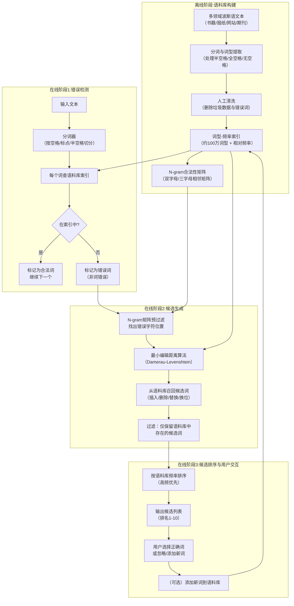

# FarsiSpell: A spell-checking system for Persian using a large monolingual corpus

---

## **作者信息**

| 作者 | 机构 | 身份/背景 | 领域大牛认定 |
|------|------|----------|-------------|
| Tayebeh Mosavi Miangah | Payame Noor University（伊朗培亚梅·努尔大学）语言学系 | 语言学教授，长期从事语料库语言学与计算语言学研究 | **伊朗语料库语言学与波斯语NLP领域的资深学者**，研究兴趣涵盖平行语料库、术语提取、拼写检查等。她在**语料库驱动的波斯语处理**方向有持续产出，但主要活跃于伊朗国内学术圈，国际知名度相对有限。与Shamsfard（工程背景、工具开发）和Faili（计算机背景、统计模型）不同，Mosavi Miangah的学术背景是**语言学**，这使她的研究视角更侧重于**语料库资源建设与语言特征分析**。 |

---

## **团队相关信息：**

本论文为**单一作者研究**，由Payame Noor大学语言学系独立完成。该团队以**大规模语料库建设与语料库语言学应用**见长，区别于德黑兰大学Faili团队（计算机科学/深度学习）和沙希德·贝赫什提大学Shamsfard团队（工具包开发/基准评测）。Mosavi Miangah曾在波斯语-英语平行语料库、术语自动提取等领域有前期工作，本文是其将**大规模单语语料库**应用于**拼写检查**的一次系统性尝试。

---

## **论文发表时间**

| 项目 | 具体日期 | 来源/说明 |
|------|---------|----------|
| 论文提交/录用 | 2012年（推测） | 论文于Literary and Linguistic Computing期刊2014年第29卷第1期正式出版 |
| 正式出版 | 2014年 | Oxford University Press出版，Digital Scholarship in the Humanities（DSH）前身期刊 |

## **摘要**

本文提出了一种**基于大规模单语语料库（>1.2亿词元）而非传统词典**的波斯语拼写检查系统FarsiSpell。核心思想是：传统词典无法覆盖专有名词、派生词、新词、外来语等"词典外词汇"（OOV），而一个持续更新的**大规模语料库**可以更全面地反映语言的实际使用状况，充当拼写检查的数据库。

系统采用**三阶段流程**：（1）**错误检测**——通过语料库查词（而非词典查词）识别非词错误（non-word errors）；（2）**候选生成**——基于**最小编辑距离（Damerau-Levenshtein）** 算法生成候选词列表；（3）**候选排序**——根据各候选词在语料库中的**相对频率**排序，频率最高者排首位。此外，系统引入了**双字母/三字母N-gram矩阵**作为预处理过滤器，以加速候选生成并提高精度。

实验在人工构造测试集（10,000词，含1,000个错误）和真实数据测试集（约1,000词，来自波斯语博客）上分别评估。结果表明：**错误检测率达96%以上**，但自动纠正准确率（候选排序首位命中率）约为**67-70%**。系统在**专有名词、外来语、新词、技术术语**等词典难以覆盖的词类上表现良好，但**词边界错误（word boundary errors）** 是主要薄弱环节（检测率仅61-85%），归因于波斯语空格/半空格/无空格的书写模糊性及分词器的不完善。

---

## 一、这篇论文讲了一个什么样的故事？

**核心问题**：波斯语拼写检查面临一个两难困境——如果只用**传统词典**做数据库，专有名词（人名、地名）、新词、派生词、外来语音译词等都会因不在词典中而被误判为"错误"（假阳性）。但如果用**大规模语料库**代替词典，虽然覆盖面更广，但检索速度和处理噪声又是新的挑战。

**本文的解决方案**：放弃词典，转向语料库。作者团队构建了一个**超过1.2亿词元（tokens）、约100万词型（types）的波斯语单语语料库**，涵盖政治、医学、诗歌、体育、文学、艺术、宗教、科学、文化、历史、经济等多个领域，主要来源包括Hamshahri在线报纸等。语料库经过人工清洗，剔除垃圾数据和拼写错误，形成一个"合法词数据库"——规模远超任何静态词典。

**FarsiSpell的三步走策略**：
1. **检测**：对每个输入词查语料库——不在库中则标记为错误。
2. **生成候选**：使用**最小编辑距离算法**（Damerau-Levenshtein，支持插入/删除/替换/换位四种操作）从语料库中召回与错误词最相似的合法词。同时用**N-gram矩阵**（相邻二/三字母合法性检查）提前过滤掉不可能的词形，减少候选生成的计算量。
3. **排序**：根据候选词在语料库中的**出现频率**从高到低排序——高频词优先（因为高频词更可能是作者想写的正确词）。

**故事的核心张力**：本文试图证明"**语料库 > 词典**"是波斯语拼写检查的正确路径。但实验也揭示了这一路径的"阿喀琉斯之踵"——**词边界错误**（如"قابل تغییر"写成"قابلتغییر"）的检测和纠正远不如单字符编辑错误（插入/删除/替换/换位）成功，因为分词器本身在处理波斯语半空格/全空格/无空格的混乱书写时已经力不从心。这恰好呼应了Shamsfard团队（STeP-1）和Karimi团队（2024评测）反复强调的**分词是波斯语NLP一切上层任务的瓶颈**。

---

## 二、本文的核心思想和创新点

### 1. 核心思想

**用大规模单语语料库替代传统词典作为拼写检查的唯一数据源**。理由是：语言是活的——新词、专有名词、外来语不断涌现，传统词典永远滞后；而一个持续监测（monitoring）和更新的语料库可以跟随语言的演进，自动吸纳新词汇。作者明确提出："据我们所知，这是首次在拼写检查系统中使用语料库代替词典的经验，不仅对波斯语如此，对许多其他语言也是如此。"

### 2. 关键创新点

1. **语料库驱动的拼写检查（Corpus-driven Spell-checking）**：
   - 构建了一个**>1.2亿词元、约100万词型**的大型波斯语单语语料库，覆盖12+个主题领域。
   - 所有词型经过人工清洗验证，确保数据库中只包含"合法波斯语词"。
   - 语料库具有**动态更新能力**——用户可通过"Add to Corpus"按钮将新词加入数据库。

2. **将候选排序与语料库频率挂钩**：
   - 传统方法常用编辑距离或统计语言模型做候选排序；本文直接用候选词在语料库中的**原始频率**做排序依据。方法虽然朴素，但在实际应用中有效——高频词确实更可能是正确词。

3. **N-gram矩阵作为预处理加速器**：
   - 在应用完整的编辑距离算法之前，先用**双字母和三字母相邻矩阵**（bigram/trigram adjacency matrix）检查错误词的内部结构。
   - 如果某个字符组合（如"دپ"）在波斯语中从未出现（矩阵值为0），则该位置即为错误源，编辑距离算法只需处理该局部的错误，而非整个词。
   - 这大幅减少了候选生成阶段的候选词数量和响应时间。

4. **明确区分"检测"与"纠正"，并限定任务范围**：
   - 本文聚焦**非词错误（non-word errors）**，明确将**真实词错误（real-word errors）** 排除在研究范围之外（作者引用了Faili 2010的工作作为真实词错误处理的代表）。
   - 这一任务边界的清晰界定，使系统的设计目标更加聚焦，评估指标更易解读。

---

## 三、方法是怎么实现的？(How does it work?)

### 1. 架构

FarsiSpell采用**三阶段流水线架构**，输入原始文本，依次经过检测→候选生成→排序三个模块，输出带下划线的错误词及其候选列表（按频率排序）。整体流程如下图所示：

**图注**：流程基于论文第4-5节综合绘制。**离线阶段**（上方）完成语料库构建与词型索引生成；**在线阶段**分为检测→候选生成→排序三个顺序执行的模块。虚线箭头表示用户交互式地"添加新词到语料库"的反馈回路。

### 2. 关键算法

**（1）错误检测算法（词典/语料库查词）**

将输入词`w`与语料库词型集合`C`比较：
- 若`w ∈ C` → 合法词，通过。
- 若`w ∉ C` → 标记为错误（非词错误）。

注意：本文**不处理真实词错误**——即`w ∈ C`但上下文不合理（如"after"代替"alter"）的情况，作者明确将其留给上下文敏感方法（如Faili 2010的互信息方法）。

**（2）候选生成算法（伪代码——论文原步骤）**

**输入**：错误词 IW（Input Word）；**输出**：候选词列表 S

Step 1：取IW作为错误词（已不在语料库中）。
Step 2：在IW的每两个相邻字母之间插入空格，若任何结果片段在语料库中，将整个切分结果作为候选。
Step 3：将IW与**前一个词**或**后一个词**合并，重复Step 2。
Step 4：**替换**：将IW中的每个字母依次替换为波斯语字母表中的所有32个字母，生成新词，检查是否在语料库中。
Step 5：**删除**：依次删除IW中的每个字母，生成新词，检查是否在语料库中。
Step 6：**插入**：在IW的每个位置（包括两端）依次插入波斯语字母表中的所有32个字母，生成新词，检查是否在语料库中。
Step 7：**换位**：交换IW中的每对相邻字母，生成新词，检查是否在语料库中。

**优化**：Step 4-7仅作用于**N-gram矩阵标记为异常的位置**，而非整个词，以降低计算复杂度。

**（3）N-gram预过滤原理**

构建两个**二进制矩阵**：
- **Bigram矩阵**：32×32，记录每对相邻波斯文字母是否在语料库的任意合法词中出现。
- **Trigram矩阵**：32×32×32，记录每三个相邻字母是否在语料库的任意合法词中出现。

当错误词IW输入时，提取其所有相邻二字母/三字母组合，逐一查矩阵。若某组合矩阵值为0（从未在任何合法词中出现），则该位置被标记为"异常源"，编辑距离算法将**优先在该区域**执行操作，而非暴力遍历全词。

### 3. 关键公式

**公式1：Damerau-Levenshtein最小编辑距离**

$$d_{DL}(a,b) = \text{minimum number of operations (insertion, deletion, substitution, transposition) to convert } a \text{ to } b$$

论文采用Wagner-Fischer动态规划算法计算编辑距离，时间复杂度为 `O(|a|·|b|)`，但通过N-gram预过滤大幅缩减了实际计算范围。

**公式2：候选排序——基于相对频率**

$$\text{rank}(s_i) = \text{freq}(s_i) \quad \text{(sorted descending)}$$

其中 `freq(s_i)` 为候选词`s_i`在语料库中出现的总次数。频率最高的候选词排在列表首位，作为"自动纠正"的首选。

**公式3：Mean Reciprocal Rank (MRR)——论文采用的评估指标**

$$\text{MRR} = \frac{1}{|M|} \sum_{i=1}^{|M|} \frac{1}{\text{rank}_i}$$

其中 `|M|` 为错误词总数，`rank_i` 为第`i`个错误词的**正确候选词**在系统输出列表中的排名位置。例如：正确词排在第一位→贡献1；排在第二位→贡献1/2；排在第三位→贡献1/3。MRR越高，说明系统的排序质量越好。本文在1,000个错误词上计算得到的MRR为 **0.76**。

**公式4：检测精确率（Precision on Detection）**

$$\text{Precision}_{\text{detection}} = \frac{\text{number of words whose correct form is ranked first}}{\text{number of words detected as erroneous}}$$

本文报告值为：`974 / 1032 = 94.3%`（即在所有被标记为错误的词中，94.3%的词其正确形式被排在了候选列表首位）。

**公式5：排序精确率（Precision on Ranking Candidates）**

$$\text{Precision}_{\text{ranking}} = \frac{696}{1032} = 67.4\%$$

即在所有检测到的错误词中，67.4%的词在候选列表中的**首位**即为正确词（自动纠正可成功）。这个指标与"自动纠正准确率"直接对应。

## 四、实验效果 (Experimental Results)

### 1. 实验设置

| 实验维度 | 具体配置 |
|---------|---------|
| **语料库规模** | >1.2亿词元（tokens），约100万词型（types），涵盖12+个领域 |
| **人工测试集** | 约10,000词，其中1,000词被人工注入错误（覆盖插入/删除/替换/换位/词边界五大类） |
| **真实数据测试集** | 约1,000词，来自波斯语博客（主题：拔罐放血疗法"hejamat"） |
| **评估指标** | 检测率（Detected %）、自动纠正准确率即"正确决策"（Correct Decision %）、MRR、精确率 |
| **对比对象** | 未做直接横向对比（与Vira、Virastyar、Vafa等工具做定性比较，无统一测试集下的量化对比） |

### 2. 主要结果

**表2：人工测试集上各错误类型的检测率与纠正准确率**

| 错误类型 | 检测率（%） | 自动纠正准确率（%） | 示例 |
|---------|-----------|-------------------|------|
| Word Boundary（词边界） | 60.97 | 43.20 | قابل تغییر → قابل‌تغییر |
| Insertion（插入） | 100 | 85.10 | استثنایی → استثنایی |
| Deletion（删除） | 100 | 72.05 | هزینه → هزینه |
| Substitution（替换） | 100 | 56.90 | — |

**表3：真实数据测试集上各错误类型的检测率与纠正准确率**

| 错误类型 | 检测率（%） | 自动纠正准确率（%） | 示例 |
|---------|-----------|-------------------|------|
| Word Boundary（词边界） | 85.02 | 53.00 | صرف نظر → صرف‌نظر |
| Insertion（插入） | 100 | 91.00 | صفر → صفر |
| Deletion（删除） | 98.20 | 77.50 | بپوشاید → بپوشد |
| Substitution（替换） | 100 | 60.60 | بالفاصله → بلافاصله |
| Transposition（换位） | 100 | 70.51 | حجامت → حجامت |
| **总计** | **96.64** | **70.52** | — |

**核心结论**：
- **检测能力强劲**：在单字符错误（插入/删除/替换/换位）上检测率几乎100%，真实数据总体检测率达96.64%。这说明"语料库查词"方法在召回错误方面非常有效。
- **词边界错误是致命弱点**：无论是人工测试（60.97%检测率，43.20%纠正率）还是真实数据（85.02%检测率，53.00%纠正率），词边界类错误都远低于其他类型。原因在于**分词器本身无法可靠处理波斯语的半空格/全空格/无空格混淆**——这与2024年Karimi评测论文的核心发现完全一致。
- **自动纠正准确率有提升空间**：在真实数据上70.52%的纠正准确率（即首位候选即为正确词）表明，**仍有约30%的错误需要用户在候选列表中手动选择**（通常第二位或第三位才是正确的）。这一结果与论文的MRR=0.76吻合。
- **真实数据优于人工数据**：词边界错误的检测率在真实数据（85%）上反而高于人工数据（61%），作者未解释这一反常现象，可能与人工测试集中词边界错误的设计方式过于困难有关。

**表4-5：不同词类上的检测与纠正表现（真实数据测试集）**

| 词类 | 检测率（%） | 自动纠正准确率（%） | 示例 |
|------|-----------|-------------------|------|
| Proper nouns（专有名词） | 89.8 | 98.0 | لقدمن → لقدمن |
| Foreign words（外来语） | 100 | 100 | كاسترول → كاسترول |
| Neologisms（新词） | 98.0 | 88.7 | پژوهانه → پژوهانه |
| Technical terms（技术术语） | 100 | 100 | فصد → فصد |
| Loan words（借词） | 100 | 81.0 | ماسا → ماسا |
| Regular words（常规词） | 97.6 | 78.5 | تهدیدان → تهدیدان |

**关键洞察**：传统词典最容易"误杀"的**专有名词**和**外来语**，在FarsiSpell的语料库方法下反而**检测率和纠正准确率都很高**（专有名词检测率89.8%、纠正率98%）。这验证了"语料库覆盖词典外词汇"的核心优势。

**表6：错误词长度对系统性能的影响**

| 词长度（字符数） | 检测率（%） | 自动纠正准确率（%） | 示例 |
|---------|-----------|-------------------|------|
| N=2 | 100 | 33.3 | ان → من |
| N=3 | 100 | 44.5 | قلب → قلب |
| N=4 | 100 | 50.0 | قیمت → قیمت |
| N=5 | 100 | 78.2 | آلبریت → آبریت |
| N=6 | 100 | 82.7 | هدف مند → هدفمند |
| N=7 | 78.7 | 88.6 | پلی استر → پلی‌استر |
| N=8 | 68.0 | 88.9 | کامپوتر → کامپیوتر |
| N>8 | 65.0 | 34.1 | خشنونامیز → خشنونامیز |

**关键发现**：
- **短词（2-4字符）容易检测但难以纠正**：因为候选词过多——仅替换一个字母就可能生成多个合法词，系统难以判断哪个是作者原意。
- **中等长度词（5-7字符）表现最佳**：检测率和纠正率均处于高位（检测~80-100%，纠正~78-89%）。
- **长词（>8字符）检测困难但纠正准确率可观**（N=8时纠正率达88.9%），但超过8字符后纠正率骤降至34.1%——因为长词在语料库中稀见，候选集本身就不充分。
- **整体趋势**：随词长增加，检测率下降，纠正率先升后降——这个倒U型曲线揭示了语料库稀疏性对系统性能的制约。

### 3. 消融实验与关键发现

本文未做系统性的消融实验（如"去掉N-gram矩阵后速度下降多少"），但论文中提供了若干可提取的关键分析性发现：

**关键发现1：N-gram矩阵显著提升了候选生成速度**

作者指出，通过N-gram预过滤，编辑距离算法只需在矩阵标记为"异常"的局部区域执行操作，而不必扫描全词。这大幅降低了候选生成的计算开销，使系统能在实时环境下运行（"regardless of the word length and the type of errors"）。但论文未给出量化的速度对比数据。

**关键发现2：频率排序虽然朴素，但在大多数情况下有效**

作者承认频率排序不如上下文感知排序（如语言模型）精确，但在实际测试中，**约2/3的错误词的正确答案确实排在候选列表首位**（MRR=0.76）。这说明简单的频率信息已经捕获了大量的"词汇正确性"先验知识。

**关键发现3：语料库的"监测性更新"是核心优势**

作者强调，与传统静态词典不同，FarsiSpell的语料库可以通过**用户交互（"Add to Corpus"按钮）和持续的网络爬取**动态更新。这意味着当新词（如技术术语、网络流行语）出现时，系统无需等待词典更新即可识别它们。但论文未具体说明更新机制的实际实施方式和更新频率。

**关键发现4：分词的瓶颈决定了整个系统的上限**

FarsiSpell在**单字符编辑错误**上表现优异（检测率≈100%），但在**词边界错误**上表现显著较差。作者将此归因于"分词模块不够鲁棒"，而分词模块的问题又源于波斯语书写系统的内在模糊性（空格/半空格/无空格）。这一发现与后续的STeP-1（2010）和Karimi 2024评测论文形成**跨时间的一致性结论**——**分词是波斯语拼写检查乃至一切NLP任务的基础瓶颈**。

**实验部分总结**：

本文通过人工测试集和真实数据测试集的双重验证，**证明了大规模单语语料库替代传统词典进行非词错误拼写检查的可行性**。系统在检测阶段表现优异（>96%），在自动纠正阶段表现中等（~70%）。关键瓶颈清晰指向**分词与词边界处理**，而语料库方法在**专有名词、外来语、新词**等传统词典"盲区"上展现出了显著优势。MRR=0.76为后续研究提供了可量化的基准参考。

## 五、优点与局限性

### ✅ 1. 优点

- **语料库替代词典的思路前瞻性强**：在2014年，大多数拼写检查器仍依赖于静态词典（如Unix spell的25,000词表）。FarsiSpell用>1.2亿词元的语料库替代词典，在覆盖专有名词、新词、外来语方面具有天然优势。这一思路在后续的神经网络方法兴起之前，是扩展拼写检查覆盖面的最实用路径。

- **大规模语料库的构建与清洗投入巨大**：>1.2亿词元、约100万词型的语料库构建，且经人工清洗以确保每个词型都是合法词——这在低资源语言中是一项耗时耗力的基础工程。该语料库的构建本身即为波斯语NLP社区的重要资源贡献。

- **N-gram矩阵作为加速器的工程价值**：在计算资源有限的2014年，用二/三字母相邻矩阵做预过滤来减少编辑距离计算量，是一种务实的工程优化。即使在今天，这一思路对低算力环境下的拼写检查仍有参考价值。

- **清晰的问题边界与评估框架**：本文明确将研究范围限定为**非词错误**，不处理真实词错误——这使得评估结果不受"语义消歧"这个更复杂问题的干扰，指标更干净、更易解读。同时引入了**MRR**作为排名质量的度量，比简单的"首位命中率"更能反映候选列表的整体质量。

- **任务目标的诚实界定**：作者坦承系统目前**不能做自动纠正**，只做检测和候选排序，最终选择权交给用户。这种"不做自己做不到的事"的诚实态度在学术论文中值得肯定。

### ⚠️ 2. 局限性（研究边界与待解问题）

- **分词器的鲁棒性不足**：这是整个系统的最大瓶颈。词边界错误（如"قابل تغییر"写成"قابلتغییر"）的检测率在人工测试中仅60.97%，说明分词器在面对波斯语空格/半空格/无空格的书写变体时力不从心。作者自己承认"tokenization part of the system is not sufficiently robust"，但未提出具体的改进方案。

- **频率排序缺乏上下文信息**：候选排序仅依赖词频，完全不考虑**上下文**。这意味着它无法处理真实词错误（如"زندگی" vs "زنده‌ای"在特定上下文中哪个正确），也容易在高频候选词之间选出错误项（例如，错误词"ان"的候选中，"آن"和"این"都高频，系统无法根据上下文区分）。作者在结论部分将此列为未来工作方向。

- **评估测试集的规模偏小且缺乏标准化**：人工测试集10,000词（含1,000个错误）、真实测试集1,000词，规模相对有限。更重要的是，**没有统一的公开评测基准**——这与2024年Karimi等人的评测工作形成鲜明对比（后者建立了系统性的多现象基准数据集）。因此，FarsiSpell的性能难以与其他同期或后续系统进行公平的横向比较。

- **人工清洗的可扩展性问题**：约100万词型的语料库经人工清洗以剔除错误词——这在1.2亿词元规模的语料库上是一项极其繁重的工作。当语料库需要持续监测和更新时，完全依赖人工清洗是不可持续的。作者未提出自动化的清洗或验证方案。

- **未与同期系统做量化对比**：论文虽在结论部分提及Vira、Virastyar、Vafa等系统并进行定性比较（如"Vira只支持编辑距离为1""Vafa依赖Microsoft Word环境"），但**缺乏在同一测试集上的量化对比**，读者无法判断FarsiSpell的相对优劣势。

- **词边界错误的"纠正"定义模糊**：词边界错误的"正确决策"（Correct Decision）指标是如何计算的？是将多个词合并为一个词算正确，还是将一个词拆分为多个词算正确？论文未给出明确的评估标准。考虑到词边界错误的处理涉及分词粒度的根本分歧（半空格 vs 全空格），这一点尤其需要澄清。

## 六、其他

### 第一性原理

本文遵循的第一性原理是：**拼写检查的"合法性判断"本质上是一个"语言使用证据"问题——如果一个词在真实语言使用中确实存在（即使词典没有收录它），它就不应被标记为错误。**

基于这一原理：
- **静态词典是"规定的"（prescriptive）**：它定义了"应该"存在哪些词，但永远滞后于实际语言变化。
- **语料库是"描述的"（descriptive）**：它记录了"实际"存在的词，包括专有名词、新词、外来语、技术术语等词典未覆盖的合法词。
- **拼写检查应优先采用描述性标准**：因为用户写下的词如果真实存在于大规模语料中，即使不在词典中，它也极可能是合法词而非错误。这一思路在低资源语言和新词频出的领域中尤为重要。

### 领域空白

**本文试图填补的具体领域空白：波斯语拼写检查中"词典覆盖不足"的问题——即专有名词、外来语、新词、派生词等合法但不在词典中的词被误判为错误的高假阳性率。**

具体而言：

- **为何此前存在空白？**
  - **词典规模限制**：即使是大型词典（如Dehkhoda含约40,000词条）也无法覆盖波斯语中所有的专有名词（人名、地名）、外来语音译、新兴科技词汇和派生词。以约100万词型的语料库做对比，其覆盖面是传统词典的20倍以上。
  - **波斯语的高度派生性**：如前所述，波斯语通过词缀拼接不断产生新词（如"دانش"→"دانشگاه"→"دانشمند"→"دانشمندان"）。任何词典都无法穷举所有派生形式，而语料库可以"自然覆盖"这些形变。
  - **此前研究多聚焦于算法改进（编辑距离、n-gram、规则）**，较少关注数据源本身的质量和覆盖广度。FarsiSpell的差异化贡献正在于此——它不是在"算法"层面做改进，而是在"数据源"层面做改变。

- **该空白是否已被本文充分填补？**
  - **部分填补**：本文通过实验证明了"语料库替代词典"在非词错误检测上的可行性和优势，尤其在专有名词、外来语等词典外词汇上的表现优异。
  - **但语料库方法也有其代价**：（1）构建和维护成本高；（2）语料库本身可能包含错误（如原文本中已存在的拼写错误）；（3）低频合法词可能因语料库不足而被误判为错误（数据稀疏问题）。作者虽然进行了人工清洗，但并未完全解决这些问题。
  - **后续方向**：理想的解决方案可能是**词典 + 语料库的融合**——用词典做核心合法性判断，用语料库做覆盖面扩展。此外，深度学习时代的方法（如BERT-based拼写检查）通过大规模预训练自动学习词汇分布，可以看作是对本文"语料库驱动"思路的间接传承与深化。

- **与同期其他波斯语NLP论文的关系**：
  - **Faili 2010（互信息）**：处理**真实词错误**，需要上下文语义信息；FarsiSpell明确将真实词错误排除在外，两者是**互补而非竞争**关系。
  - **STeP-1 2010（Shamsfard）**：提供分词、形态分析、POS标注等基础工具；FarsiSpell的**分词器正是STeP-1同期或稍后改进的同类系统**，但FarsiSpell的词边界错误检测率低（60-85%）恰恰说明分词器仍需大幅改进——这与STeP-1/2024评测论文的结论一致。
  - **Dehghani & Faili 2023（深度学习错误类型检测）**：用神经网络在字符+词级检测 **51种错误类型**，在错误分类细粒度上远超FarsiSpell；FarsiSpell只做二分类（错误/非错误）+ 编辑距离召回。但FarsiSpell的优势在于**完全不需要标注训练数据**，仅依赖语料库即可工作。
  - **总体定位**：FarsiSpell处于 **"数据驱动、无监督、轻量级"** 的一端，适合资源受限场景；而Faili/Dehghani系列处于 **"统计模型/深度学习、有监督、高精度"**   的另一端。两者在波斯语拼写检查的技术谱系中分别代表了 **"语料库资源建设"** 和 **"算法模型创新"** 两条不同的演进路径。

  ---

根据公开信息，**没有证据表明该语料库在2026年仍在更新**。

该语料库似乎是一个为特定研究项目创建的、相对静态的资源，而非一个持续维护的活项目。

*   **核心论文的发表时间**：描述该语料库的核心论文《FarsiSpell: A spell-checking system for Persian using a large monolingual corpus》发表于2014年，这是该语料库最直接的公开记录。
*   **作者后续研究**：论文作者Tayebeh Mosavi Miangah教授在2016年后，其公开的研究方向转向了机器翻译、词典编纂等领域，未见关于此语料库持续更新的后续报告。
*   **语料库的构成**：该语料库的主要来源之一“Hamshahri Corpus”本身是一个历史静态数据集，其内容主要来自1996年至2002年的报纸文章。虽然该报纸仍在运营，但没有信息表明FarsiSpell项目在持续爬取其新内容。

综合来看，这个为2014年研究项目构建的语料库，在完成后并未作为一个持续更新的资源进行维护。当前（2026年）活跃的波斯语NLP资源，多为基于Wikipedia等现代数据源构建的新项目。

---
> 本文由Deepseek AI 生成
