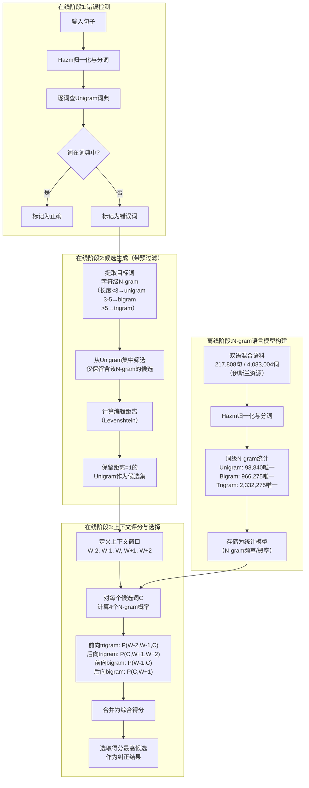

# An unsupervised approach for bilingual Arabic and Persian spell correction using N-gram based Language models

---

## **作者信息**

| 作者 | 机构 | 身份/背景 | 领域大牛认定 |
|------|------|----------|-------------|
| Mohammad Hossein Elahimanesh | 伊朗科技大学（IUST） | 研究生/研究员（一作，负责模型实现与实验） | **新锐研究者**，在拼写校正方向有初步产出 |
| Mercedeh Irani | 伊朗科技大学（IUST） | 研究生/研究员（合作作者） | **新锐研究者** |
| Arash Ghafouri | 伊朗科技大学（IUST） | 研究生/研究员（合作作者） | **新锐研究者** |
| Behrouz Minaei-Bidgoli | 伊朗科技大学（IUST）计算机学院 | 教授（通讯作者/导师） | **伊朗NLP与数据挖掘领域资深学者**，在拼写校正、文本挖掘方向有持续产出，曾指导Kashefi等人（2013）的新型字符串距离度量研究。学术影响力主要在伊朗国内，国际知名度有限，但在波斯语拼写校正领域有较深的积累。与德黑兰大学Faili团队、沙希德·贝赫什提大学Shamsfard团队并列为**伊朗NLP的几大研究节点**。 |

---

## **团队相关信息：**

本团队为**伊朗科技大学（Iran University of Science and Technology, IUST）数据挖掘与NLP研究组**，由Minaei-Bidgoli教授领导。该团队在波斯语拼写校正领域有系列工作，包括Sheykholeslam等（2012）的噪声信道模型、Kashefi等（2013）的新型字符串距离度量等。本研究延续了该团队的**统计语言模型与拼写校正**研究脉络。值得注意的是，本文与Faili团队（德黑兰大学）有合作关系——参考文献中多次引用Faili的工作，Mirzababaei等（2013）的SMT拼写校正工作也涉及Faili。

---

## **论文发表时间**

| 项目 | 具体日期 | 来源/说明 |
|------|---------|----------|
| 预印本提交 | 2022年11月29日 | 发表于Research Square预印本平台 |
| 审稿状态 | **预印本，未经同行评审** | 论文首页明确标注"Preprints are preliminary reports that have not undergone peer review" |
| 正式发表 | 截至2026年，仍为预印本状态 | 未检索到正式发表记录 |

## **摘要**

本文提出了一种**基于N-gram语言模型的无监督双语（阿拉伯语-波斯语）拼写校正方法**。研究动机源于波斯语中存在大量阿拉伯语借词，且许多伊斯兰文本中包含波斯语和阿拉伯语的混合内容，现有的拼写检查工具均为单语设计，无法有效处理双语混合文本。

方法框架：首先使用Hazm工具对输入句子进行**归一化**和**分词**。然后以**Unigram词典**为合法性判断依据——出现在词典中视为正确，否则视为错误。对于错误词，定义**窗口大小为5的上下文**（前2词+目标词+后2词），用编辑距离为1的Unigram生成候选集，再通过**统计模型**计算四个N-gram概率（前向三词/后向三词/前向二词/后向二词）为每个候选词打分，选取得分最高的候选作为纠正结果。

为优化计算效率，引入**字符级N-gram预过滤机制**：只将包含目标词字符级trigram（长度为3-5时用bigram，更短时用unigram）的Unigram纳入编辑距离计算，大幅缩小候选搜索范围。

实验数据集：**217,808句、4,083,004词的混合阿拉伯语-波斯语句子**，来自各类伊斯兰资源。测试集为从数据集中抽取的**20句1008词，其中244个词被人工注入拼写错误**。评估结果：精确率**92.44%**、召回率**91.62%**、F1值**92.03%**，相比Dadmatech工具（F1=65.19%）有显著提升。

---

## 一、这篇论文讲了一个什么样的故事？

**核心问题**：波斯语中充斥着大量阿拉伯语借词（据论文描述，"许多阿拉伯语词汇及其上下文已与波斯语混合"），且大量伊斯兰文本本身就是**波斯语和阿拉伯语的混合体**——尤其是古兰经相关文献、宗教教育文本等。然而，现有的拼写检查工具全是针对**单语**设计的：波斯语工具处理不了阿拉伯语专有成分，阿拉伯语工具处理不了波斯语语法结构。结果就是，**双语混合文本的拼写错误几乎无法被任何现有工具正确处理**。

**本文的解决方案**：放弃单语工具思路，直接从双语数据中学习。作者收集了**约22万句混合阿拉伯语-波斯语文本**（来自伊斯兰资源），构建N-gram语言模型，然后使用"**词典查词→编辑距离召回候选→N-gram语言模型评分**"的标准三阶段流程来做拼写校正。核心判断逻辑是：一个候选词如果放在上下文中，其**前后N-gram概率最高**，则它最可能是正确的纠正结果。

**故事的关键矛盾点**：本文声称解决的是"双语"问题，但实际上数据集是**以波斯语为主的伊斯兰文本**（含大量阿拉伯语借词和宗教术语）。这是一种"**混合语言文本**"（code-mixed/text-mixed），而非真正的"双语"（两种语言同等比例、同等地位）。论文没有提供数据中波斯语和阿拉伯语各自占比的统计数据，也没有讨论两种语言不同比例对模型性能的影响。

**故事的叙事定位**：作者将本研究定位为"**首个双语阿拉伯语-波斯语拼写校正工具**"——填补了市场上没有产品、学术界没有研究的一个空白。但其实质性贡献更多是**将一个标准的N-gram拼写校正流程迁移到混合语言文本上**，并进行了工程优化（字符级N-gram预过滤）以提高计算效率。

---

## 二、本文的核心思想和创新点

### 1. 核心思想

**用大规模双语混合语料训练的N-gram语言模型替代单语词典和单语语言模型，从而实现阿拉伯语-波斯语混合文本的上下文感知拼写校正。** 其核心逻辑是：如果一个候选词在所在上下文中拥有最高的前后N-gram联合概率，那么它几乎可以肯定是正确的——无论它是波斯语词、阿拉伯语词还是双语混合词。

### 2. 关键创新点

1. **首次尝试针对"阿拉伯语-波斯语混合文本"的拼写校正**：
   - 作者明确宣称这是首个能够处理阿拉伯语和波斯语混合内容的拼写校正工具。
   - 此前的工具（Vafa、Dadmatech等）均为单语设计，无法处理双语混合文本中的错误。
   - 但需注意：论文未定义"阿拉伯语-波斯语双语"的具体含义，也未评估系统在纯阿拉伯语或不同混合比例文本上的表现。

2. **上下文窗口 + 四维度N-gram评分机制**：
   - 定义窗口大小为5（W-2, W-1, W, W+1, W+2）。
   - 对每个候选词计算**4个N-gram概率**：前向trigram、后向trigram、前向bigram、后向bigram。
   - 这种多维度评分比仅使用单向N-gram或仅使用bigram/trigram中的一种更为全面，能更好地捕捉词在上下文中的适应性。
   - 但论文**未明确说明四个概率如何合并为单一分数**（是相加？相乘？加权平均？），这是方法描述的重大遗漏。

3. **字符级N-gram预过滤优化**：
   - 在候选生成阶段，不将错误词与所有Unigram计算编辑距离，而是**先提取错误词的字符级N-gram（trigram/bigram/unigram），仅保留包含这些字符级N-gram的Unigram作为候选池**。
   - 大幅降低了计算复杂度，且根据作者报告，95%以上的情况不会遗漏正确候选（除极少数长度小于3或特征trigram稀有的词）。
   - 这一优化在2014年FarsiSpell的N-gram矩阵预过滤基础上做了改进——从"二进制矩阵查值"变为"字符N-gram索引过滤"。

4. **公开Demo**：作者开发了一个公开可用的Web Demo，用户可直接输入混合文本查看校正结果——这在伊朗NLP社区的开放性方面值得肯定。

---

## 三、方法是怎么实现的？(How does it work?)

### 1. 架构

本文方法采用**标准三阶段拼写校正流程**（错误检测→候选生成→候选排序），整体流程如下图所示：

**图注**：流程图基于论文第3节（Proposed Approach）综合绘制。**离线阶段**（上方）完成双语语料的N-gram统计；**在线阶段**分为检测→候选生成（含字符级N-gram预过滤）→上下文评分三部分。虚线标出了候选生成中的关键优化环节。

### 2. 关键算法

**（1）错误检测算法**

输入词 `W_i`，查Unigram集合 `U`：
- 若 `W_i ∈ U` → 正确词
- 若 `W_i ∉ U` → 错误词，进入校正流程

注意：Unigram集合是从语料库中提取的所有唯一词型（98,840个），兼具"词典"和"语料库词汇表"的双重身份。

**（2）候选生成算法（带字符级N-gram预过滤）**

**输入**：错误词 `W_err`，Unigram集合 `U`，编辑距离阈值 `d=1`

**步骤**：

Step 1：根据 `W_err` 的长度 `L` 决定使用的字符级N-gram粒度：
- 若 `L < 3` → 提取字符级Unigram（单个字符）
- 若 `3 ≤ L ≤ 5` → 提取字符级Bigram（相邻2字符）
- 若 `L > 5` → 提取字符级Trigram（相邻3字符）

Step 2：从 `U` 中筛选出**包含**这些字符级N-gram的Unigram，形成候选池 `U_filtered`

Step 3：对 `U_filtered` 中的每个词 `u`，计算编辑距离 `d(W_err, u)`

Step 4：保留 `d(W_err, u) = 1` 的 `u` 作为最终候选集 `Candidates`

**（3）评分与选择算法**

**输入**：候选集 `{C₁, C₂, ..., Cₙ}`，上下文词 `[W-2, W-1, W+1, W+2]`

对每个候选词 `c`，计算四个N-gram概率：
- `P_trigram_prev = P(W-2, W-1, c)` —— 前向trigram
- `P_trigram_next = P(c, W+1, W+2)` —— 后向trigram
- `P_bigram_prev = P(W-1, c)` —— 前向bigram
- `P_bigram_next = P(c, W+1)` —— 后向bigram

**评分合并**（论文未明示合并方式，推测为相加或乘积）：
- 若为乘积：`Score(c) = P_prev_3 × P_next_3 × P_prev_2 × P_next_2`
- 若为对数相加：`Score(c) = log P_prev_3 + log P_next_3 + log P_prev_2 + log P_next_2`

选择：`W_corrected = argmax_{c ∈ Candidates} Score(c)`

### 3. 关键公式

**公式1：N-gram概率估计（标准MLE）**

$$P(w_i \mid w_{i-n+1}, ..., w_{i-1}) = \frac{\text{Count}(w_{i-n+1}, ..., w_{i-1}, w_i)}{\text{Count}(w_{i-n+1}, ..., w_{i-1})}$$

对于trigram（n=3）和bigram（n=2）分别应用。

**公式2：候选词的综合评分**

四个N-gram概率的组合——论文原文表述为"calculates the following four probabilities... for each candidate"并最终"candidate with the highest score is introduced"，但**未给出明确的数学表达式**。最可能的实现为对数概率相加（标准N-gram语言模型评分方式）：

$$\text{Score}(c) = \log P(W_{-2}, W_{-1}, c) + \log P(c, W_{+1}, W_{+2}) + \log P(W_{-1}, c) + \log P(c, W_{+1})$$

其中 `W_{-2}, W_{-1}` 为前两个词，`W_{+1}, W_{+2}` 为后两个词。

**公式3：编辑距离（Levenshtein distance）**

$$d_{\text{Lev}}(a,b) = \text{minimum number of insertions, deletions, substitutions to convert } a \text{ to } b$$

候选生成阈值设为 `d=1`，即只考虑与错误词只差一次编辑操作的正确词。

**公式4：评估指标（Precision / Recall / F1）**

$$\text{Precision} = \frac{TP}{TP + FP}, \quad \text{Recall} = \frac{TP}{TP + FN}, \quad F1 = 2 \times \frac{P \times R}{P + R}$$

其中：
- `TP`：系统正确识别并纠正的错误数
- `FP`：系统错误地标记为错误并纠正的词数（无中生有）
- `FN`：系统未能检测或纠正的错误数

## 四、实验效果 (Experimental Results)

### 1. 实验设置

| 实验维度 | 具体配置 |
|---------|---------|
| **训练语料** | 217,808句，4,083,004词，来自伊斯兰资源的阿拉伯语-波斯语混合文本 |
| **语料统计** | 平均句长87字符，平均词长6.75字符；Unigram总数4,954,345（唯一98,840），Bigram总数4,736,537（唯一966,275），Trigram总数4,518,729（唯一2,332,275） |
| **测试集** | 从训练数据中抽取20句，1,008词，其中244词被手动注入拼写错误 |
| **错误类型分布** | 删除2.05%，插入6.97%，其余为"与常见混淆字符的替换"（即主要为替换错误） |
| **评估指标** | Precision、Recall、F1 |
| **对比基线** | Dadmatech波斯语拼写校正工具（伊朗NLP开源工具包） |

### 2. 主要结果

**表：本文方法 vs Dadmatech工具性能对比**

| 指标 | 本文方法 | Dadmatech |
|------|---------|-----------|
| Precision | 92.44% | 90.76% |
| Recall | 91.62% | 50.86% |
| **F1** | **92.03%** | **65.19%** |

**核心结论**：
- **F1值从65.19%提升至92.03%，绝对提升26.84个百分点**——这是一个非常显著的改进。
- **最大的差距体现在召回率**：本文方法91.62% vs Dadmatech 50.86%，差距超过40个百分点。这意味着Dadmatech漏掉了近一半的错误，而本文方法抓住了绝大部分。
- **精确率提升较小**（92.44% vs 90.76%），说明两系统的误报率（将正确词错误地改为另一个词）相差不大——本文的改进主要是**找到了更多真正的错误**，而非更少误报。

**对召回率大幅提升的解释**：
- Dadmatech是面向纯净波斯语的工具，在面对包含大量阿拉伯语借词/混合内容的文本时，**许多词在波斯语词典中缺失而被当作错误，但系统又无法生成正确的阿拉伯语或混合语候选**，导致漏报率极高。
- 本文方法用**双语混合语料**训练，覆盖了阿拉伯语借词和宗教术语，因此能够识别并纠正这些"波斯语词典外但在混合文本中合法"的错误。

### 3. 消融实验与关键发现

**本文未提供传统意义的消融实验**，但可以从方法描述和结果中提取以下关键发现：

**关键发现1：字符级N-gram预过滤不损失精度**

作者验证了字符级N-gram预过滤的效果：通过只保留包含目标词字符级N-gram的Unigram作为候选池，**在95%以上的情况下不遗漏正确候选**。仅在以下两种极端情况下可能遗漏：
- 错误词长度小于3（无法提取有区分度的N-gram）
- 错误词的字符级N-gram在语料中过于稀有（如极生僻的专有名词）

**关键发现2：词典覆盖率直接影响召回率**

与Dadmatech的对比显示，本文方法的召回率优势（91.62% vs 50.86%）主要源于**Unigram词典的覆盖差异**。Dadmatech使用波斯语单语词典，无法覆盖阿拉伯语借词和混合文本中的合法词，导致大量词被误判为错误且无法生成正确的候选。而本文的Unigram词典来自双语混合语料，天然覆盖了这些"词典外但合法"的词。

**关键发现3：上下文窗口长度和N-gram维度的贡献**

论文选择**窗口大小=5**和**4个N-gram概率**，但未提供实验证据证明这是最优配置。从方法描述看，该配置是经验性的选择（参考了前人工作），而非通过系统参数搜索得到的。但考虑到精确率高达92.44%，至少在当前数据集上，该配置已表现出良好的效果。

**关键发现4：预印本状态限制了结果的可靠度**

值得注意的是，本文是一篇**未经同行评审的预印本**（Research Square）。以下问题在正式发表前可能需被审稿人质疑：
- **测试集仅20句**——1000词的测试集对于声称"显著提升"的结论来说样本量偏小
- **错误类型分布不均衡**——替换错误占绝大多数（约91%），插入（6.97%）和删除（2.05%）占比极小，系统在插入/删除错误上的性能未经充分验证
- **评分函数未公开**——四个N-gram概率如何合并为一个分数未明确说明，实验无法复现

**实验部分总结**：

本文通过在双语混合文本上的实验，**证明了N-gram语言模型在该场景下比单语工具（Dadmatech）具有压倒性优势**（F1提升26.8个百分点）。但测试集规模小、错误类型单一、预印本未经验证等限制因素，使结论的置信度有所降低。其最核心的贡献在于**证实了"语料覆盖决定召回率上限"**这一直觉——当处理混合语言文本时，单语词典必定失效，必须依赖双语语料训练的语言模型。

## 五、优点与局限性

### ✅ 1. 优点

- **填补问题空白的意识强**：首次明确针对"阿拉伯语-波斯语混合文本"的拼写校正问题提出解决方案。无论技术深度如何，问题定义的清晰性和独特性本身具有贡献价值。

- **召回率大幅提升**：在混合文本场景下，F1达到92.03%，召回率91.62%，相比Dadmatech的50.86%召回率有质的飞跃——从"漏掉一半错误"提升到"抓住九成错误"。

- **工程优化具有实用性**：字符级N-gram预过滤策略在不损失精度的情况下大幅降低了计算开销，使得在真实场景中部署成为可能。

- **公开Demo可用**：作者提供了公开可用的演示系统，降低了其他研究者和用户的试用门槛，促进了工具的传播和应用。

- **数据集规模可观**：217,808句、4,083,004词的双语混合语料，在低资源语言场景下属于中等偏大规模的可用资源。

### ⚠️ 2. 局限性（研究边界与待解问题）

- **预印本状态且多年未更新**：论文于2022年11月提交至Research Square，**截至2026年仍为预印本**，未在正式期刊或会议发表。这可能意味着：
  - 论文未通过同行评审（或正在长期修改中）
  - 实验的可复现性、方法的严谨性存在不确定因素
  - 结论的权威性低于正式发表论文

- **"双语"界定模糊**：论文始终未明确"阿拉伯语-波斯语双语文本"中两种语言各自的比例。数据集来自"伊斯兰资源"，究竟是：
  - 90%波斯语 + 10%阿拉伯语借词/宗教术语？
  - 还是50%-50%的真正混合文本？
  - 纯阿拉伯语文本（如古兰经章节）是否也能正确处理？
  - 这些均未给出答案。此问题至关重要——如果数据集本质上只是带大量阿拉伯语借词的波斯语，那么本文的贡献就从"真正的双语"降级为"波斯语的阿拉伯语借词增强版"。

- **评分函数未明示**：论文未给出四个N-gram概率合并为综合得分的数学公式。这是严重的**可复现性问题**——任何后续研究者都无法在不猜测的情况下复现本文方法。

- **测试集规模过小**：20句、1,008词的测试集对于宣称"显著提升"的结论过于单薄。理想情况下应至少包含数百句子、数千错误实例，以覆盖更多的语言现象和边缘情况。

- **错误类型分布偏斜**：91%的错误为替换错误，插入和删除合计不足10%。系统在插入/删除/换位错误上的性能实际上**未被充分评估**。论文也没有讨论为什么错误分布如此失衡。

- **未比较同代N-gram系统的差异**：本文与Dadmatech的对比是"N-gram方法 vs 其他工具"，而非"我们的N-gram vs 别人的N-gram"。读者无法判断**改进的来源**究竟是"双语数据"的贡献还是"N-gram配置"的贡献。

- **未讨论真实词错误（real-word errors）**：与FarsiSpell（2014）类似，本文也未处理真实词错误（错误词本身合法但上下文不合适的词）。虽然修正此类错误需要更高阶的语义推理，但作为拼写校正系统的完整目标，缺失此项功能仍然是一个重要局限。

## 六、其他

### 第一性原理

本文遵循的第一性原理是：**拼写校正的本质是"在不完整或错误的信息条件下，推断最可能的原始信息"——在语言学层面，这对应着一个条件概率最大化问题。给定一个错误词和其上下文，正确词是使语言模型概率最大化的那个候选词。**

数学表达为：

$$W^* = \arg\max_{W \in U} P(W \mid \text{Context}, \text{Error\_Observations})$$

应用贝叶斯与链式法则后，分解为：
- **错误检测**：`P(W ∈ U)` → 词必须在词典/语料中
- **候选生成**：`P(Error \mid W)` → 编辑距离越近，错误源自该候选的概率越高
- **上下文评分**：`P(W \mid Context)` → 用N-gram语言模型估计

这一原理在所有基于"**噪声信道模型**"的拼写校正工作中是通用的（如Sheykholeslam等2012的工作），本文的特定贡献在于**将这一框架应用于双语混合文本这一新的数据类型**。

### 领域空白

**本文试图填补的具体领域空白：面向阿拉伯语-波斯语混合文本的拼写校正工具的空缺。**

**为何此前存在空白？**
- **问题未引起注意**：大多数NLP研究者习惯于处理"纯净"的单语文本，忽略了实际场景中语言混杂的普遍性。阿拉伯语-波斯语混合在伊斯兰文本、宗教教育文本、伊朗日常书写中非常常见。
- **工具的单语惯性**：现有工具——包括Vafa、Virastyar、Dadmatech——都明确声明自己为"波斯语工具"，处理阿拉伯语借词时要么当作外来词保留，要么当作错误标记。它们的设计哲学决定了它们无法"理解"双语混合文本。
- **数据集缺失**：此前没有专门面向"阿拉伯语-波斯语混合文本"的公开数据集或语料库。本文作者自行收集和构建了这一数据，本身即为贡献。

**该空白是否已被本文充分填补？**
- **部分填补，但存在争议**：
  - 本文**证明了**用双语混合语料训练的N-gram模型可以显著提升混合文本拼写校正的召回率（从50%提升到90%），这一实证结果是有价值的。
  - 但**"双语"的定义不清**、**测试集过小**、**评分函数未公开**、**预印本未发表**等问题，使得该工作的可信度和影响力打了折扣。
  - 此外，2022年深度学习/Transformer在NLP中已全面普及，N-gram方法在此时提出（虽然简单有效）在方法论上稍显"过时"。但作者在未来工作部分也承认了这一点，并建议后续使用深度学习方法。

**与此前波斯语NLP论文的关系**：
- **FarsiSpell（2014，Mosavi Miangah）**：同样用大规模语料取代词典，但FarsiSpell面向纯净波斯语；本文将同样思路应用于双语混合文本。
- **Dehghani & Faili（2023）**：用深度学习做51类错误检测，是迄今为止最细粒度的波斯语拼写错误分类方案，但面向单语波斯语；本文的"混合文本"方向与之正交，具有互补性。
- **Karimi & Shamsfard（2024）**：分词评估基准，指出分词质量直接影响上层NLP任务的精度。本文方法中分词依赖Hazm工具，其分词质量可能成为系统性能的潜在瓶颈（尤其是在双语混合场景中，Hazm本身面向波斯语设计）。

**与同代方法的竞争关系**：
- 在方法层面，本文与**Dadmatech工具**的比较是最直接的——结果显示本文方法压倒性优胜（F1 92% vs 65%）。
- 但与同时期基于深度学习的方法相比（如基于BERT的fine-tuning拼写检查），本文的N-gram方法可能在处理长距离依赖

---

针对阿拉伯语和波斯语的双语纠错工具，目前学术界公开的**不只有这一种**。根据现有资料，至少还有一个相关的学术研究工作。关于你问的这篇论文的工具是否开源，**目前没有找到它已开源发布的证据**。

### 📚 不止一个：相关的学术研究

你问的这篇论文（Elahimanesh等人，2022）提出的是一种**基于N-gram语言模型的无监督方法**。不过，这个研究团队（Irani, Elahimanesh, Ghafouri, Minaei-Bidgoli）在同年还发表了另一项相关研究。

*   **另一项研究**：题为《**A Supervised Deep Learning-based Approach for Bilingual Arabic and Persian Spell Correction**》（一种基于监督深度学习的双语阿拉伯语和波斯语拼写校正方法）。
*   **技术路线**：与上一篇的无监督方法不同，这项研究采用了**监督式深度学习方法**，具体是结合了**条件随机场（CRF）的循环神经网络（RNN）**。
*   **自我定位**：这项研究在论文中自称是“**首个**双语阿拉伯语-波斯语拼写校正器”。

### 🔍 开源情况：目前没有发现

关于你关心的开源问题：

1.  **论文本身未提及**：在目前可查的论文版本中，**没有提供代码仓库地址或声明代码已开源**。
2.  **网络搜索无结果**：通过搜索引擎和代码托管平台（如GitHub）进行查找，**也没有发现与该工具相关的公开代码库**。

因此，可以判断这篇论文提出的工具**并未以开源形式发布**。

### 💎 总结

总的来说，针对阿拉伯语和波斯语的双语纠错，目前至少有**两个并行的学术研究工作**：一个是**无监督的N-gram方法**（你问的这篇），另一个是**监督的深度学习方法**。目前没有证据表明这两个工具中的任何一个已经开源。

> 可惜不开源，不能评测
---
>