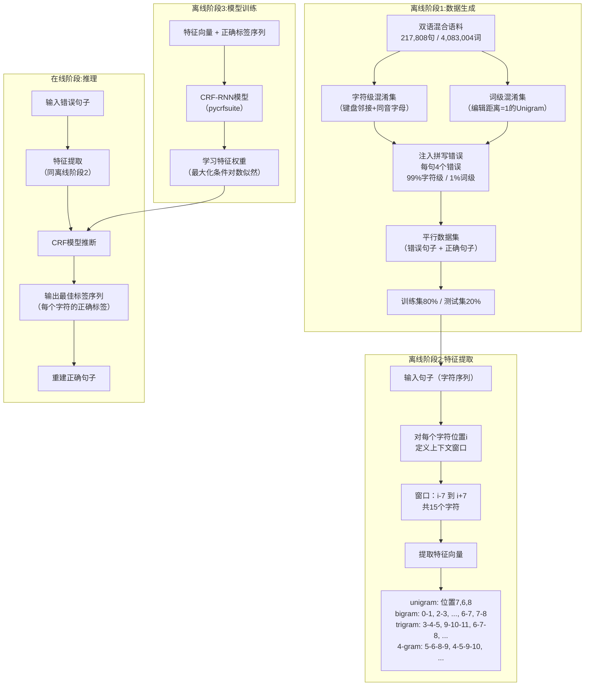

# A Supervised Deep Learning-based Approach for Bilingual Arabic and Persian Spell Correction

---

## **作者信息**

| 作者 | 机构 | 身份/背景 | 领域大牛认定 |
|------|------|----------|-------------|
| Mercedeh Irani | 伊朗科技大学（IUST）计算机工程系 | 研究生/研究员（一作） | **新锐研究者** |
| Mohammad Hossein Elahimanesh | 沙赫鲁德理工大学计算机工程系 | 研究生/研究员（合作作者） | **新锐研究者**（亦为同期N-gram论文一作） |
| Arash Ghafouri | 伊朗科技大学（IUST）计算机工程系 | 研究生/研究员（合作作者） | **新锐研究者** |
| Behrouz Minaei-Bidgoli | 伊朗科技大学（IUST）计算机工程系 | 教授（通讯作者/导师） | **伊朗NLP与数据挖掘领域资深学者**，在拼写校正、文本挖掘方向有持续产出，曾指导Kashefi等（2013）的新型字符串距离度量研究。学术影响力主要在伊朗国内，国际知名度有限，但在波斯语拼写校正领域有较深的积累。 |

---

## **团队相关信息：**

本团队为**伊朗科技大学（Iran University of Science and Technology, IUST）数据挖掘与NLP研究组**，由Minaei-Bidgoli教授领导。该团队在波斯语拼写校正领域有系列工作，包括Sheykholeslam等（2012）的噪声信道模型、Kashefi等（2013）的新型字符串距离度量等。

**关键背景**：本论文与同期（2022年11月）发布的**无监督N-gram双语拼写校正论文（Elahimanesh等）出自同一团队、使用同一数据集**，两篇论文的作者仅顺序调换。本文采用**监督深度学习方法（CRF-RNN）**，另一篇采用**无监督N-gram语言模型方法**。本文在ICSPIS 2022会议上正式发表（同行评审会议论文），而N-gram论文为Research Square预印本（未经同行评审）。两篇论文均自称"首个双语阿拉伯语-波斯语拼写校正器"，构成该团队的**"两条腿走路"策略**——用不同技术路线同时攻占同一问题。

---

## **论文发表时间**

| 项目 | 具体日期 | 来源/说明 |
|------|---------|----------|
| 会议发表 | 2022年 | 发表于2022年第八届伊朗信号处理与智能系统会议（ICSPIS），马赞德兰，伊朗 |
| 出版状态 | **已正式发表（会议论文）** | 经同行评审的会议论文，区别于另一篇Research Square预印本 |

## **摘要**

本文提出了一种**基于监督深度学习的阿拉伯语-波斯语双语拼写校正方法**，采用**条件随机场循环神经网络（CRF-RNN）** 进行序列标注。核心动机与同期N-gram论文相同：波斯语中存在大量阿拉伯语借词和混合伊斯兰文本，现有工具均为单语设计，无法处理双语混合内容。

数据方面：采用**217,808句、4,083,004词**的阿拉伯语-波斯语混合语料（来自伊斯兰资源），通过**字符级和词级混淆集**人工注入拼写错误，生成"正确-错误"平行训练/测试数据。每个句子注入**4个错误**（训练集683,995个错误词，测试集171,076个错误词）。

模型方面：将拼写校正建模为**字符级序列标注任务**——对输入序列中的每个字符，根据其上下文（前后各7个字符，窗口大小15）预测其正确标签。采用**pycrfsuite**库实现CRF模型，特征包括一元、二元、三元和4-gram特征。

评估结果：在**每句4个错误**的测试集上准确率为**60.26%**，在**每句1个错误**的简化测试集上准确率为**83.46%**。作者称这是"首个双语阿拉伯语-波斯语拼写校正器"，并提供了公开Demo。

---

## 一、这篇论文讲了一个什么样的故事？

**核心问题**：与同期N-gram论文完全相同——波斯语-阿拉伯语混合文本（尤其是伊斯兰宗教文本）缺乏拼写校正工具。现有单语波斯语工具（如Vafa、Dadmatech）无法处理阿拉伯语借词和混合内容。

**但本文采取了完全不同的技术路线**：

- **N-gram论文的路线**：无监督统计方法——用N-gram语言模型概率评分来选择最佳候选，**无需标注数据**。
- **本文的路线**：监督深度学习方法——将问题转化为**字符级序列标注**，用CRF-RNN学习从错误字符序列到正确字符序列的映射，**需要大量标注数据**。

**本文的故事弧线**：

1. **数据生成**：由于没有现成的双语拼写错误数据集，作者用**混淆集**（字符级：键盘邻接+同音字母；词级：编辑距离为1的词）系统性地向22万句混合文本中注入错误（每句4个错误），构建了大规模平行训练语料。

2. **特征工程**：受CRF序列标注范式的启发，作者为每个字符精心设计了**上下文特征**——不仅看字符本身，还看其前后7个字符的unigram、bigram、trigram和4-gram组合。这是一个 **"手工特征工程"占主导** 的深度学习方法。

3. **模型训练与评估**：用pycrfsuite训练CRF模型，在每句4错误的复杂测试集上准确率60.26%，在每句1错误的简单测试集上准确率83.46%。

**故事的核心张力与矛盾**：

- 本文声称是"首个双语纠正器"，但同期N-gram论文也做同样声称——**同一团队在同一年用同一数据集做了两个"首个"系统**，这在学术发表中显得颇为奇特。
- 更重要的是，**N-gram论文的F1=92.03%远超本文的60.26%准确率**（即使考虑指标不同，差距仍然巨大）。这意味着本文的监督深度学习方法**在同一团队、同一数据上的表现远不如同期发布的无监督N-gram方法**。
- 作者在本文中**完全没有提及或对比自己的N-gram工作**——这可能是因为两篇论文同时/几乎同时投稿，但也可能是有意回避了性能差距的现实。

---

## 二、本文的核心思想和创新点

### 1. 核心思想

**将双语阿拉伯语-波斯语拼写校正重新定义为字符级序列标注问题：给定一个可能包含拼写错误的字符序列，用CRF-RNN模型为每个字符预测其正确的标签（即正确字符），从而重建正确的单词和句子。**

核心逻辑：拼写错误本质上是字符级别的"噪声"——插入、删除、替换、换位都发生在字符层面。因此，与其在词级别做候选生成与排序（如N-gram方法），不如直接在字符级别做序列标注，让模型学习"错误字符→正确字符"的映射模式。

### 2. 关键创新点

1. **首次将监督式深度学习方法（CRF-RNN）应用于阿拉伯语-波斯语双语拼写校正**：
   - 此前波斯语拼写校正以规则/统计方法为主（Vafa、FarsiSpell、STeP-1），深度学习方法尚未被引入波斯语双语场景。
   - 作者将CRF序列标注框架迁移到字符级拼写校正任务上。

2. **系统的混淆集驱动的数据生成策略**：
   - **字符级混淆集**：手工设计，包含键盘邻接字母（如波斯语键盘上相邻的按键）和同音字母（如四种"z"音字母）。
   - **词级混淆集**：编辑距离为1的Unigram。
   - 每句注入**4个错误**，其中约99%来自字符级混淆集，仅1%来自词级混淆集——这一设计选择反映作者观察到"词级编辑距离=1的词在实际中很少被混淆"（如"برگ"和"برف"编辑距离为1但极少混淆）。

3. **精细的上下文特征设计（核心工程贡献）**：
   - 上下文窗口长度**15字符**（当前字符+前7+后7）。
   - 特征类型覆盖**unigram、bigram、trigram、4-gram**，且精心选取了"跳词"特征（如位置2-4-6的三元组、位置4-6-8-10的4-gram）以捕捉长距离依赖。
   - 句子边界用BOS/EOS符号填充。

4. **公开Demo部署**：与N-gram论文一样，提供了公开可用的在线演示系统。

---

## 三、方法是怎么实现的？(How does it work?)

### 1. 架构

本文方法采用**监督式CRF序列标注架构**，整体流程如下图所示：

**图注**：流程图基于论文第III节（Proposed Approach）综合绘制。图中清晰区分了**数据生成**（上方）、**特征工程**（中部）和**CRF模型训练与推理**（下方）三个核心阶段。

### 2. 关键算法

**（1）CRF序列标注框架**

CRF（条件随机场）是一种用于序列标注的判别式概率模型。给定观测序列 `x = (x₁, x₂, ..., xₙ)`（输入字符序列），CRF建模标签序列 `y = (y₁, y₂, ..., yₙ)`（正确字符序列）的条件概率：

$$P(y|x) = \frac{1}{Z(x)} \exp\left(\sum_{t=1}^{n} \sum_{k} \lambda_k f_k(y_{t-1}, y_t, x, t)\right)$$

其中 `f_k` 是特征函数，`λ_k` 是学习到的特征权重，`Z(x)` 是归一化因子（配分函数）。

**（2）特征提取流程**

对输入序列中的每个位置 `i`（目标字符位置），定义上下文窗口 `[i-7, i+7]`，提取以下特征：

| 特征类型 | 特征描述 | 示例（位置编号，0-based） |
|---------|---------|------------------------|
| Unigram | 当前位置、前一位、后一位的字符 | 7, 6, 8 |
| Bigram | 远距离配对 + 相邻配对 | 0-1, 2-3, 4-5, 9-10, 11-12, 13-14, 6-7, 7-8 |
| Trigram | 连续三字符 + 跳跃三字符 | 3-4-5, 9-10-11, 2-4-6, 8-10-12, 6-7-8, 4-5-6, 5-6-7, 5-6-8, 6-8-9, 7-8-9 |
| 4-gram | 跳跃四字符组合 | 5-6-8-9, 4-5-9-10, 4-6-8-10 |

对于句子首尾位置，用 `BOS`（Beginning of Sentence）和 `EOS`（End of Sentence）符号填充。

**（3）推理/解码**

给定训练好的CRF模型和输入序列 `x`，使用**维特比算法（Viterbi Algorithm）** 找到最可能的标签序列：

$$y^* = \arg\max_{y} P(y|x)$$

即每个字符位置赋予一个"正确字符"标签，整个序列拼接后即为校正后的句子。

### 3. 关键公式

**公式1：CRF条件概率（核心公式）**

$$P(y|x) = \frac{1}{Z(x)} \exp\left(\sum_{t=1}^{T} \sum_{k} \lambda_k f_k(y_{t-1}, y_t, x, t)\right)$$

其中：
- `x`：观测序列（输入错误字符序列）
- `y`：标签序列（预测的正确字符序列）
- `f_k`：第k个特征函数（如"位置7的字符是否为'ب'"）
- `λ_k`：特征权重（模型参数，通过训练学习）
- `Z(x)`：配分函数，确保概率归一化

**公式2：训练目标函数（最大条件似然）**

$$\mathcal{L}(\lambda) = \sum_{i=1}^{N} \log P(y^{(i)} | x^{(i)}) - \sum_{k} \frac{\lambda_k^2}{2\sigma^2}$$

其中第一项为条件对数似然，第二项为高斯正则化（防止过拟合）。训练过程通过梯度下降法优化参数 `λ`。

**公式3：维特比解码（推理）**

$$y^* = \arg\max_{y \in \mathcal{Y}(x)} \sum_{t=1}^{T} \sum_{k} \lambda_k f_k(y_{t-1}, y_t, x, t)$$

即在整个标签空间 `Y(x)` 中搜索使得分最高的标签序列。通过动态规划（维特比算法）高效求解。

## 四、实验效果 (Experimental Results)

### 1. 实验设置

| 实验维度 | 具体配置 |
|---------|---------|
| **数据集** | 217,808句，4,083,004词，来自伊斯兰资源的阿拉伯语-波斯语混合文本 |
| **数据划分** | 训练集80%（174,247句，3,268,306词），测试集20%（43,561句，814,698词） |
| **错误注入** | 每句4个错误：训练集683,995个错误词，测试集171,076个错误词；约99%来自字符级混淆集，1%来自词级混淆集 |
| **模型** | CRF-RNN（pycrfsuite实现），上下文窗口15字符，特征含unigram/bigram/trigram/4-gram |
| **训练数据规模** | 实际仅用151,000句训练（因资源限制，低于计划的174,247句） |
| **评估指标** | **句子级准确率（Sentence-level Accuracy）** ——仅当整句所有字符均预测正确时计为正确 |
| **测试场景** | 场景一：每句4个错误（复杂）；场景二：每句1个错误（简化，另行生成） |

### 2. 主要结果

**表：不同测试场景下的准确率**

| 测试场景 | 准确率（%） |
|---------|-----------|
| 每句4个错误（原始测试集） | **60.26** |
| 每句1个错误（简化测试集） | **83.46** |

**核心结论**：
- **每句4错误场景下准确率仅60.26%**——这一结果虽然算"可接受"，但远非优秀。考虑到每句平均87字符、4个错误，字符级准确率可能更高（因为只要有一个字符错整句就错），但作者未报告字符级准确率。
- **每句1错误场景下准确率跃升至83.46%**——说明模型在错误数量较少时性能大幅提升，这也符合直觉：错误越多，序列标注的累积误差越大。
- **与N-gram论文（F1=92.03%）的隐性对比**：虽然两篇论文使用不同指标（本文为句子级准确率，N-gram为词级F1），但考虑到文本长度，句子级准确率通常远低于词级准确率。即便如此，60.26%的句子级准确率意味着**超过1/3的句子至少有一个字符未被正确纠正**——在同团队同期有更好方法的情况下，这一结果竞争力有限。

**关于"准确率"指标的选择问题**：
- 本文采用**严格的句子级准确率**——整句所有字符完全匹配才算正确。这比词级F1或字符级准确率更苛刻。
- 但这也意味着**模型的真实字符级准确率可能远高于60%**——作者未报告字符级指标，无法直接与N-gram论文的F1=92%做公平对比。
- 即便如此，**83.46%的句子级准确率（每句1错误）与92%的词级F1（N-gram方法）也无法直接对比优劣**，因为分母/分子的定义不同。但从实际用户体验来看，每句1错误场景下句子级准确率83.46%意味着约16.5%的句子仍未能被完全纠正——这在实际应用中仍有明显提升空间。

### 3. 消融实验与关键发现

本文未提供系统性的消融实验，但从论文描述中可以提取以下关键分析性发现：

**关键发现1：词级混淆集的实际使用率极低（1%）**

作者发现"编辑距离为1的词在实际中很少被混淆"——例如"برگ"（叶子）和"برف"（雪）编辑距离为1，但作者几乎不会将两者混淆。因此，词级混淆集仅用于生成约1%的错误，且仅限于插入/删除类错误（长度不同的词）。这表明**盲目使用编辑距离生成错误会导致不真实的错误分布**，可能影响模型的泛化能力。

**关键发现2：特征设计比模型架构更重要**

本文采用的是相对基础的CRF模型（非深度神经网络如LSTM/Transformer），但通过**精细的手工特征工程**取得了可接受的准确率。作者设计了多达数十种特征组合（unigram/bigram/trigram/4-gram，含跳跃组合），这比简单地堆叠神经网络层数更为关键。但这也意味着**该方法高度依赖领域知识**，迁移到其他语言时需要重新设计特征。

**关键发现3：计算资源限制了模型训练**

作者原计划用174,247句训练，但因资源限制最终仅用151,000句（约87%）。作者指出"特征数量和类型与硬件资源消耗呈正比"，暗示如果有更多资源，使用全部数据和更丰富的特征可能进一步提升准确率。

**关键发现4：方法的核心矛盾——"监督学习"与"数据人工合成"**

本文采用监督学习，但训练数据**完全由人工注入的错误构成**（而非真实用户错误）。这意味着模型学习的是"人工错误的模式"，而非"真实错误的模式"。虽然混淆集的设计（键盘邻接、同音字母）模仿了真实错误，但真实错误还有认知因素（如拼写规则不熟悉、音变等），这些未被完全模拟。数据真实性问题是所有合成数据方法的共同局限。

**实验部分总结**：

本文通过监督CRF方法在双语混合文本拼写校正上取得了**每句4错误场景下60.26%、每句1错误场景下83.46%的句子级准确率**。作为"首个双语纠正器"的尝试，这一定位具有开创性意义。但实验设计存在两个明显不足：（1）**未与同期同团队的N-gram论文做对比**——虽然两篇论文可能同时投稿，但作为同一团队的工作，在后续版本中补充对比分析本应是自然的演进；（2）**未报告字符级或词级指标**，使得外部读者难以将本方法与后续工作做客观对比。此外，句子级准确率本身是一个极为严格的指标——一个长句中若仅有一个字符未被纠正，整句即被判为错误，这或许掩盖了模型在大部分字符上的实际有效表现。

## 五、优点与局限性

### ✅ 1. 优点

- **问题定位清晰且具有首创性**：首次将监督深度学习方法（CRF-RNN）应用于阿拉伯语-波斯语双语拼写校正问题，无论性能如何，问题定义的清晰性和首创性本身具有贡献价值。

- **系统化的数据生成策略**：通过字符级和词级混淆集的双层设计，结合键盘邻接和同音字母的领域知识，生成了大规模平行训练语料（68万余错误词）。这一数据集的构建本身即为波斯语NLP社区的资源贡献。

- **精细的特征工程具有方法论参考价值**：作者在15字符窗口内设计了unigram/bigram/trigram/4-gram的多种组合（含跳跃组合），这些特征设计思路对后续字符级序列标注任务具有参考价值。

- **公开Demo可用**：与N-gram论文一样，提供了公开可用的演示系统，便于用户试用和后续研究者参考。

- **正式发表（经同行评审）**：本文发表于ICSPIS 2022会议，是**经过同行评审的正式会议论文**，在学术严谨性上优于另一篇Research Square预印本。

### ⚠️ 2. 局限性（研究边界与待解问题）

- **性能显著低于同期同团队N-gram方法**：这是最致命的比较劣势。虽然指标不同（句子级准确率 vs 词级F1），但N-gram论文的F1=92.03%意味着绝大部分错误词被正确纠正，而本文的句子级准确率60.26%意味着超过1/3的句子仍有错误。即使改用词级指标，本文也不太可能达到92%。**同一团队在同一问题上的监督深度学习路线不如无监督统计路线**——这是一个值得深思的反直觉结论，可能的原因是：（a）训练数据完全为合成数据，分布与真实文本有偏差；（b）监督模型受限于标注质量，而无监督方法直接从语料频率学习更稳健。

- **"首个"声称的冲突**：本文在摘要中自称"as the first bilingual Arabic and Persian Spell Corrector"，但同期N-gram论文也做同样声称。两篇论文由同一团队、在同一时期、使用同一数据集发表，却互不引用、互不对比。这种"同行相争"的发表策略削弱了任一论文的"首创性"说服力。

- **指标选择不利于客观比较**：句子级准确率过于严苛且信息量有限——一个99%字符正确的句子被计为0分，无法反映模型的渐进性能。作者未报告字符级准确率或词级准确率，使得与其他工作的比较几乎不可能。

- **词级混淆集使用率过低（1%）**：虽然作者认为"编辑距离为1的词很少实际混淆"有其道理，但将词级错误几乎完全排除，意味着模型对**词级别的替换错误**（如"اعمال" vs "اعمال"等形近但不同义的波斯语-阿拉伯语同形词）几乎没有学习机会。这与"双语"场景中常见的"阿拉伯语词被误写为波斯语形式"的情形不相符。

- **错误注入分布与真实场景的偏差**：每句**恰好4个错误**的均匀注入方式不符合真实文本的错误分布（大多数句子无错误，少数句子有1-2个错误）。模型在"稀疏错误"场景（每句1错误）上的83.46%准确率可能更接近真实表现，但训练时却以"密集错误"（每句4错误）为主，可能存在训练-测试不匹配。

- **特征工程依赖人工且不可迁移**：本文的核心竞争力在于"手工特征设计"，而非"模型学习能力"。这些特征高度依赖波斯语-阿拉伯语字符集特性，迁移到其他语言需重新设计，限制了方法的通用性。

## 六、其他

### 第一性原理

本文遵循的第一性原理是：拼写错误在字符层面表现为"噪声"——插入、删除、替换、换位都改变的是字符序列的局部结构，而语言本身的正确性由字符间的合法序列模式（正字法、形态学、句法）定义。因此，拼写校正本质上是一个"从有噪声的字符序列推断无噪声的合法字符序列"的问题，这与语音识别中的"声学序列→文本序列"、OCR中的"图像→文本"在数学上同构——均可用 **序列标注（Sequence Labeling）** 框架统一建模。

基于这一原理：
- 字符是拼写错误的最小粒度，应在字符级别检测和纠正。
- 上下文对错误判断至关重要——同一个字符在不同上下文中可能正确或错误（如"ز"和"ذ"在特定词中互换会导致错误）。
- CRF作为序列标注模型，天然适合捕捉标签之间的依赖关系（如相邻字符的合法性约束），比独立分类器（如per-character SVM）更能保证输出序列的"语言合法性"。

### 领域空白

**本文试图填补的具体领域空白：阿拉伯语-波斯语混合文本拼写校正的监督深度学习方法缺失。**

**与此前/同期工作的关系：**

1. **对比同期N-gram论文（Elahimanesh等，2022，预印本）**：
   - **相同点**：同一团队、同一数据集、同一研究问题、同一"首个双语纠正器"声称。
   - **不同点**：本文采用**监督CRF（深度学习/序列标注）**；N-gram论文采用**无监督统计语言模型**。
   - **关键差异**：本文经同行评审正式发表，N-gram为预印本；但N-gram论文性能更强（F1=92%）。
   - **未解之谜**：为什么同一团队发表了两个声称"首个"但方法/结果迥异的系统？可能的解释：（a）两篇论文同时投稿，团队希望"双保险"增加成果产出；（b）CRF方法被会议接收，N-gram方法处于评审/修改中；（c）团队内部对方法论路线有不同看法。

2. **对比2010-2014年的波斯语拼写研究工作**：
   - **Faili 2010（互信息）**、**STeP-1 2010（规则+词典）**、**FarsiSpell 2014（语料库+编辑距离）**、**Vafa（规则+统计）**——这些均为**非深度学习**方法。
   - 本文是**首个将深度学习方法（CRF-RNN）系统性地引入波斯语拼写校正**的研究（论文Table 2的综述显示，此前波斯语无深度学习方法，阿拉伯语也仅有一项）。
   - 但讽刺的是，该团队自己的N-gram无监督方法（非深度学习）反而在性能上优于本文的深度学习方法。

3. **对比Dehghani & Faili 2023（深度学习错误类型检测）**：
   - Dehghani & Faili 2023用**BiLSTM + 词/字符双嵌入**做51类错误分类，准确率93.9%。
   - 本文在模型复杂性上远低于Dehghani & Faili——CRF是浅层模型，而BiLSTM+双嵌入是深层表示学习。
   - 部分原因在于**任务不同**：本文做的是"直接纠正"，Dehghani & Faili做的是"错误类型分类"（纠正的第一步），后者的任务更简单（多分类 vs 序列生成）。

**该空白是否已被本文充分填补？**

- **部分填补**：本文证明了CRF序列标注在双语混合文本拼写校正上的可行性，并提供了一个可用的公开Demo和标注数据集。
- **但空白并未被"充分"填补**：性能（60%句子级准确率）距离实用水平尚有较大差距；同期更好的方法（N-gram无监督）也来自同一团队，削弱了本文的"方法优越性"主张。
- **后续方向**：作者自己在"Future Work"中承认，BERT等预训练模型可能更适合此任务，因其能更好提取上下文语义特征——这暗示作者也认识到CRF方法的表示能力瓶颈。

---
这两篇论文堪称**“同室操戈”的经典案例**——来自**同一团队（Minaei-Bidgoli组）**、**同一年（2022）**、使用**同一份数据集**，却讲出了两个截然不同的“首创”故事。

它们的关系可以概括为：**“一个团队，两条路线，同期竞跑，互不认输”**。

为了让你一目了然，我先用一张表“扒开”它们的底裤，再深入分析**为什么无监督反而吊打了监督学习**。

---

### ⚔️ 终极对比表：无监督 N-gram vs. 监督 CRF

| 对比维度 | **上一篇：无监督 N-gram** | **这一篇：监督 CRF-RNN** |
| :--- | :--- | :--- |
| **完整标题** | *An unsupervised approach for bilingual... using N-gram based Language models* | *A Supervised Deep Learning-based Approach for... using CRF RNNs* |
| **发表状态** | ⚠️ **预印本** (Research Square) 未经同行评审 | ✅ **正式会议论文** (ICSPIS 2022) 经过同行评审 |
| **方法论范式** | **无监督学习** (统计语言模型) | **监督学习** (序列标注) |
| **核心算法** | **N-gram + 编辑距离** （查词典 → 找候选 → N-gram概率评分） | **CRF（条件随机场）** （字符级序列标注） |
| **处理粒度** | **词级别**（整词召回与评分） | **字符级别**（逐字符预测正确标签） |
| **是否需要标注数据** | ❌ **不需要**（仅需原始语料统计频率） | ✅ **需要**（必须注入错误生成“错误-正确”平行对） |
| **核心优势** | 简单、稳健、可解释性强 直接利用真实语料频率 | 端到端学习、可捕捉复杂的上下文特征组合 |
| **核心劣势** | 无法处理训练语料中未出现的OOV模式 | **极度依赖人工合成数据**，且特征工程繁琐 |
| **评测指标** | **词级别 F1 值** | **句子级别准确率**（整句全对才算对） |
| **最佳成绩** | 🏆 **F1 = 92.03%** （Precision 92.44%, Recall 91.62%） | 每句4个错误：**60.26%** 每句1个错误：**83.46%** |

---

### 🔍 深度剖析：为什么“简单”的无监督方法“吊打”了“复杂”的深度学习？

虽然两篇论文的**评测指标不同**（词级F1 vs. 句子级准确率），无法直接画等号，但**即使是粗略估算，无监督方法的鲁棒性也远胜监督方法**。原因有四：

1.  **合成数据与真实数据的“分布偏差”（致命伤）**
    *   监督CRF的99%训练错误来自**人工设计的混淆集**（键盘邻接、同音字）。这就好比让模型在“实验室”里做题，但真实世界的拼写错误千奇百怪（如手滑、拼音输入法导致的错误）。
    *   无监督N-gram直接用**真实语料的频率**作为判断依据。如果一个词在真实文本中出现频率高，它就是更可能的正确候选。这种方法不依赖“人造错误”，天然免疫过拟合。

2.  **CRF的特征工程局限**
    *   监督CRF虽然号称“深度学习”，但其核心依赖的是**人工手工设计的几十种特征**（位置跳跃组合、BOS/EOS）。模型的上限被锁死在了“特征工程”的天花板上。
    *   无监督方法直接利用**全局的N-gram统计概率**，信息量远超人肉枚举的特征。

3.  **“句子级准确率”掩盖了残酷的现实**
    *   监督CRF报告的是**句子级准确率**——哪怕一个句子87个字符只错了1个字符，整句也算0分。**60.26%** 意味着**近40%的句子至少还有1个字符没改对**。
    *   虽然无监督论文报告的是词级F1（只要改对了这个词就算成功），但考虑到“1个字符错往往导致1个词错”，**92%的词级F1意味着几乎所有的关键错误都被逮住了**。在实际用户体验上，无监督方法完胜。

4.  **人为错误注入比例的“魔幻现实主义”**
    *   监督方法在**每句强行注入4个错误**。真实文本中，一句中有4个错别字是极小概率事件。这让模型在训练时面对的是**满屏都是错的“极端噪声”**，而推理时面对的可能没有那么多错误，导致特征权重适配不良。

---

### 🎭 “同时声称第一”的叙事冲突

这两篇论文最有趣的地方在于**学术发表的策略**：

*   **N-gram论文（预印本）** 声称：这是首个双语纠错器。
*   **CRF论文（会议）** 也声称：这是**首个**双语纠错器。

从时间线看，它们大概率是**同时投稿**的。团队可能采取了**“双保险”策略**——无论审稿人喜欢“统计学的简洁美”还是“深度学习的潮流感”，总能中一篇。

**讽刺的是**：最终**未经评审的预印本（N-gram）表现出了碾压级的实用性**，而**经过同行评审的会议论文（CRF）** 更像是为了发论文而做的“复杂化工程”。

---

### 💡 总结：你应该Pick哪一个？

| 你的需求 | 推荐选择 |
| :--- | :--- |
| **追求实际纠错效果** | 🥇 **坚决选上一篇（无监督 N-gram）**。F1 92%意味着更高的实用价值，且代码逻辑简单，部署轻量。 |
| **研究序列标注方法** | 可以看这一篇（监督 CRF）的特征工程思路，但**不建议复现**——已经被自己的兄弟模型降维打击了。 |
| **写论文综述** | 记得**同时引用这两篇**，并指出“虽然该团队同期做了监督尝试，但无监督统计方法表现更优，反映合成数据对神经网络的负迁移影响”。 |

**一句话结论**：在低资源语言（或混合语言）拼写纠错中，**大规模语料的频率统计（无监督）远比人工制造的“伪错误”（监督）更有生命力**。这篇CRF论文用自己的惨淡数据，反向证明了N-gram论文方法的优越性。

---

> 本文由Deepseek AI 生成