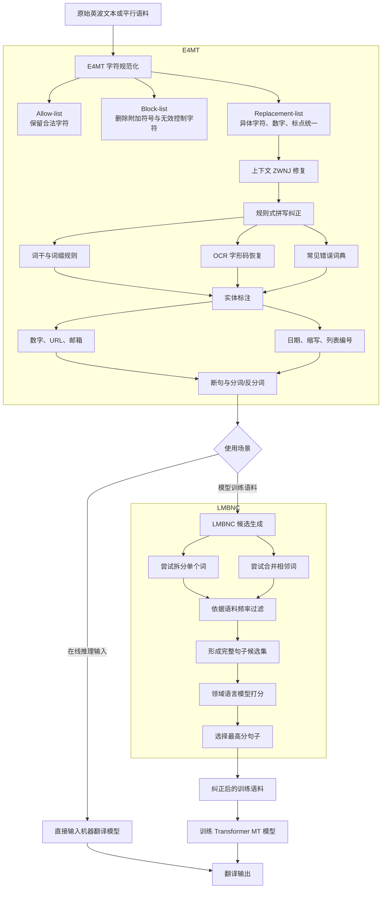

# Introducing E4MT and LMBNC: Persian pre-processing utilities

**中文题目：** E4MT 与 LMBNC：面向波斯语的预处理工具  
**论文类型：** 工程系统型会议论文  
**研究领域：** 波斯语自然语言处理、低资源语言、机器翻译、文本规范化、上下文拼写纠错  
**DOI：** 10.1109/ICCKE57176.2022.9960087 

---

## **作者信息**

| 作者 | 论文署名机构 | 身份/背景 | 领域大牛认定 |
|---|---|---|---|
| Zakieh Shakeri | Targoman Intelligent Processing Co. | 第一作者，主要从事波斯语 NLP、英波机器翻译和数据预处理；公开记录显示其早在 2012 年便参与英波统计机器翻译研究。 | 否，但属于有长期工程积累的专业研究人员。公开信息不足以支持 Fellow、院士或国际顶级 PI 级别认定。 |
| Mehran Ziabary | Targoman Intelligent Processing Co. | Targoman 联合创始人兼 CEO，软件工程和复杂系统架构背景，是团队的产业与技术负责人。 | 产业型技术负责人，而非传统学术大牛。在伊朗本地机器翻译产业中具有较强实践影响力。 |
| Behrooz Vedadian | Targoman Intelligent Processing Co. | 软件、数学与计算机科学背景，曾参与 Targoman 统计机器翻译引擎开发，偏底层算法与工程实现。 | 资深工程型专家，非国际学术大牛。 |
| Fatemeh Azadi | Targoman Intelligent Processing Co. | 机器翻译、翻译质量估计、词对齐等方向研究者；此后在 ACL 系列及低资源机器翻译方向继续发表工作。 | 团队中学术轨迹相对突出，但当时仍属于青年研究者。尚不能认定为领域大牛。 |
| Saeed Torabzadeh | Amirkabir University of Technology | 人工智能背景，研究经历涉及波斯语 OCR、语言模型和机器翻译系统，也具备 C++ 与解码器优化经验。 | 研究型工程师，非学术大牛。 |
| Arian Atefi | Targoman Intelligent Processing Co. | 论文将其列为 Targoman 工程团队成员；可验证的公开学术履历较少。 | 信息不足，不能认定为领域大牛。 |

## **团队相关信息**

该团队不是典型的“大学教授带博士生”的纯学术实验室，而是一个以 **Targoman 智能处理公司为核心、联合高校研究人员**组成的产业研发团队。

其主要特点是：

- 长期聚焦**英波机器翻译、波斯语文本处理和生产级 NLP 服务**；
- 作者中既有企业创始人、底层系统工程师，也有机器翻译研究人员；
- 研究问题直接来源于真实翻译产品：同一波斯语词的大量 Unicode 写法、ZWNJ 使用混乱、OCR 字形编码、训练语料中的错误切分与粘连；
- 方法以规则、词典、语言模型和 C++ 工程实现为主，强调**可部署性与下游收益**，而不是提出新的深度学习架构。

**综合认定：** 这是一个具有较强波斯语机器翻译产业积累的工程团队，在波斯语预处理这一细分方向具有实际经验；但从论文发表平台、作者学术荣誉及国际影响力看，不能称为全球 NLP 顶级研究组。更准确的定位是：**区域性低资源语言 NLP 的专业产业团队。**

---

## **论文发表时间**

| 项目 | 具体日期 | 来源/说明 |
|---|---|---|
| 会议时间 | **2022 年 11 月 17—18 日** | 第 12 届 International Conference on Computer and Knowledge Engineering，举办地为伊朗马什哈德 Ferdowsi University |
| 论文公开时间 | **2022 年 11 月** | ResearchGate 元数据将其列为 2022 年 11 月会议论文。 |
| 正式发表状态 | **已正式发表** | 已收入 IEEE 会议论文集，并分配 DOI，不是预印本或双盲评审中的稿件 |
| 页码 | **246—252** | ICCKE 2022 会议论文集 |
| 当前引用情况 | **较低，数据库统计不一致** | ResearchGate 当前未解析到引用，而 Connected Papers 搜索结果显示 1 次引用，因此不宜声称论文已产生广泛影响。 |

该论文是 **2022 年正式发表的 IEEE 会议论文**，并非仍在评审或修改阶段。其主要价值是工程实用性和波斯语资源建设，而不是高引用量或顶会影响力。

---

## **摘要**

本文介绍了两个服务于波斯语机器翻译的数据预处理工具：

1. **E4MT（Essential Tools for MT）**：面向训练和推理阶段的通用预处理工具，包括字符规范化、规则式拼写纠正、实体标注、分词与反分词。
2. **LMBNC（Language Model-Based N-gram Corrector）**：面向训练语料的上下文错误纠正工具，通过领域语言模型判断某个词应当拆分，或相邻词应当合并。

作者指出，波斯语文本中存在大量编码和书写变体，例如阿拉伯字符与波斯字符混用、OCR 输出字形码、零宽非连接符 ZWNJ 使用不一致。这些问题会让同一个语言单位产生大量不同表面形式，进而放大词表、稀释词频并降低机器翻译质量。

实验表明：

- E4MT 将词表规模从 662,964 降至 302,376，降低约 **54.4%**；
- 相比 Hazm 和 Parsivar，E4MT 在英译波机器翻译中提升约 **1.15—1.51 BLEU**；
- E4MT 人工评测精确率为 **97.9%**；
- LMBNC 将机器翻译 BLEU 从 20.28 提升至 20.87，即 **+0.59 BLEU**；
- LMBNC 人工评测精确率为 **98.1%**。

---

## 一、这篇论文讲了一个什么样的故事？

这篇论文讲的是一个典型的“**模型效果不好，根源却在数据书写层**”的故事。

Targoman 团队在运营英波机器翻译系统时发现，一些译文质量问题并不是 Transformer 本身能力不足，而是训练语料中存在大量肉眼明显的拼写和切分错误。对于波斯语而言，这个问题尤其严重：

- 同一个字符可能由不同 Unicode 码表示；
- 阿拉伯语、乌尔都语、普什图语字符可能混入波斯语文本；
- PDF 与 OCR 可能保存字符字形而非规范 Unicode；
- 前后缀与词干之间可以使用 ZWNJ、空格、控制字符或完全不分隔；
- 两个词可能错误地粘成一个词；
- 一个词也可能错误地被拆为两个词。

例如，论文统计发现，意为“结论”的一个波斯语词组在语料中出现了 **30,628 次，却有 22 种不同书写形式**。另一个带有多个词缀的词甚至存在 **54 种表面形式**。

这些变体在语言学上可能是同一个词，但模型会把它们当作不同 token：

> 表面形式增加  
> → 词表膨胀  
> → 单词频率被分散  
> → 低频词和 singleton 增加  
> → 模型更难学习稳定的词义和翻译对应关系。

为解决这个问题，团队设计了两层清洗机制：

- **E4MT**先处理相对确定、可通过字符规则和词法规则解决的问题；
- **LMBNC**再利用上下文语言模型处理“单看词本身无法判断”的粘连和切分错误。

最终，作者用下游机器翻译 BLEU 和人工精确率证明：**在低资源语言中，改进训练数据质量可以直接转化为模型质量提升。**

---

## 二、本文的核心思想和创新点

### 1. 核心思想

本文的核心思想可以概括为：

> **先消除文本表示层的无意义差异，再用领域语言模型解决需要上下文判断的分词与拼写歧义。**

方法将错误分为两个层次：

#### 第一层：确定性的规范化问题

这类问题通常不需要理解句子语义：

- 异体 Unicode 字符；
- 阿拉伯字符与波斯字符混用；
- 多字符词被编码为单个码点；
- OCR 字形码；
- 无效控制字符和附加符号；
- 不合理的 ZWNJ；
- 数字和标点的多种编码。

这些问题由 E4MT 的字符表、上下文规则、词典和正则表达式处理。

#### 第二层：上下文相关的边界错误

例如波斯语中的一个字符串可能：

- 本身是合法词；
- 也可能是两个词错误粘连后的结果。

同样，某个二元词组可能：

- 在一个句子中需要合并成一个词；
- 在另一个句子中又确实应当保持两个词。

此时不能只依赖字典或词频，需要比较完整句子的语言模型概率。LMBNC 因而将纠错建模为：

> 生成多个可能的拆分或合并句子  
> → 使用领域语言模型打分  
> → 选择概率最高的句子。

### 2. 关键创新点

#### 创新点一：覆盖完整 UTF-8 双字节字符范围的波斯语规范化

E4MT 不只是替换少量常见阿拉伯字符，而是针对大量 Unicode、OCR 字形码、全角字符、控制符和上下文依赖字符进行处理。

#### 创新点二：将 ZWNJ 和词缀处理纳入词法规则

波斯语是一种具有丰富词缀的语言。E4MT 使用词干、动词、名词、形容词和副词列表，检查 n-gram 是否可以通过合法屈折规则分解，并恢复正确的 ZWNJ 或连接方式。

#### 创新点三：预处理、实体标注和分词一体化

工具先识别 URL、邮箱、日期、数字、缩写和列表编号，再处理标点与断句，减少错误地在 URL、小数或缩写内部切分句子的风险。

#### 创新点四：基于“拆分—合并候选”的上下文纠错

LMBNC 同时搜索两种相反操作：

- 把一个 token 拆成两个；
- 把两个相邻 token 合成一个。

候选先由语料频率过滤，再由领域语言模型做句子级选择。

#### 创新点五：使用下游机器翻译验证预处理价值

作者不只报告预处理自身的正确率，还训练完整 Transformer 翻译系统，用 BLEU 测量清洗是否真正改善最终任务。这种外部评估比只报告规则命中率更有说服力。

---

## 三、方法是怎么实现的？（How does it work?）

### 1. 架构

整体系统由 **基础规范化管线 E4MT** 和 **语料级上下文纠错器 LMBNC** 组成。

**图注：** 根据论文第 III、IV 节及 Algorithm 1、Algorithm 2 综合绘制。论文自身没有给出完整系统架构图，上图是对文字流程的结构化还原。

### 2. 关键算法

#### 2.1 E4MT 字符规范化

每个输入字符被划分至三类集合：

| 集合 | 操作 | 示例 |
|---|---|---|
| Allow-list | 原样保留 | 拉丁字母、数字、合法波斯语字符 |
| Block-list | 删除 | 阿拉伯附加符号、无效控制字符 |
| Replacement-list | 转换为规范形式 | 阿拉伯字符转波斯字符、各语言数字转拉丁数字、全角标点转半角 |

此外，还根据当前字符的前后字符判断 ZWNJ 是否合理。例如，ZWNJ 出现在数字、标点或不能继续连接的字符之前时通常没有意义，应当删除。

#### 2.2 E4MT 词法拼写纠正

系统维护以下资源：

- 动词词干列表；
- 名词、形容词和副词列表；
- 合法词缀与屈折变化规则；
- OCR 字形到 Unicode 的映射；
- 常见拼写错误词典。

算法检查句子中的 n-gram 是否可以按照合法的词法规则分解。如果可以，则把错误使用的空格、控制字符或重复 ZWNJ 替换为正确边界。

#### 2.3 实体标注与分词

通过手工正则表达式识别：

- 数字；
- 邮箱；
- URL；
- 日期；
- 缩写；
- 列表符号与编号。

完成实体保护后，再安全地分离剩余标点，并以句号、问号、感叹号等作为断句边界。

#### 2.4 LMBNC 候选生成

对句子中的第一个词 $w$，枚举所有可能字符切分点：

$$
w = w_1 \oplus w_2
$$

只有当拆分形式在语料中更常见时，才将其加入候选：

$$
\operatorname{freq}(w_1\ \text{space}\ w_2)
>
\operatorname{freq}(w)
$$

对于相邻词 $w_0,w_1$，如果合并形式更常见，则加入合并候选：

$$
\operatorname{freq}(w_0w_1)
>
\operatorname{freq}(w_0\ \text{space}\ w_1)
$$

该过程递归应用于句子的剩余部分，最终获得完整句子的备选集合。

#### 2.5 领域语言模型选择

设某一句子的候选集合为：

$$
\mathcal{C}(x)=\{c_1,c_2,\ldots,c_n\}
$$

LMBNC 用语言模型为每个候选打分，并选出最高分形式：

$$
\hat{c}
=
\arg\max_{c\in\mathcal{C}(x)}
\operatorname{LMScore}(c)
$$

通常可将语言模型分数理解为：

$$
\operatorname{LMScore}(c)
=
\log P(c)
=
\sum_{t=1}^{T}
\log P(c_t\mid c_{<t})
$$

论文没有明确说明 Fairseq 语言模型的具体网络层数、隐藏维度或训练超参数。

### 3. 关键公式

#### 词表缩减率

$$
R_{\text{vocab}}
=
\frac{V_{\text{before}}-V_{\text{after}}}
{V_{\text{before}}}
$$

代入实验结果：

$$
R_{\text{vocab}}
=
\frac{662,964-302,376}{662,964}
\approx 54.4\%
$$

#### BLEU 增益

$$
\Delta \text{BLEU}
=
\text{BLEU}_{\text{processed}}
-
\text{BLEU}_{\text{baseline}}
$$

LMBNC 的增益为：

$$
20.87-20.28=0.59
$$

E4MT 在内部语料上相对 Parsivar 的增益为：

$$
19.53-18.02=1.51
$$

---

## 四、实验效果（Experimental Results）

### 1. 实验设置

#### 机器翻译模型

- 模型：标准 Transformer 编码器—解码器；
- 工具：Marian；
- 翻译方向：英语 → 波斯语；
- 评价指标：BLEU；
- 测试集：从训练数据中留出 10%；
- 由于缺少通用波斯语反分词器，BLEU 在**分词后的输出**上计算。

#### 数据集

| 数据集 | 句子数 | 英语 token | 波斯语 token | 领域 |
|---|---:|---:|---:|---|
| TED2020 公共语料 | 30 万 | 500 万 | 560 万 | 演讲、通用领域 |
| 内部语料 | 100 万 | 2380 万 | 2670 万 | 学术期刊与科技论文 |

对比工具：

- Hazm；
- Parsivar；
- E4MT。

由于 Hazm 和 Parsivar 只处理波斯语，实验使用 Moses tokenizer 处理其英语侧。

### 2. 主要结果

#### E4MT 对机器翻译的影响

| 预处理工具 | TED2020 BLEU | 内部语料 BLEU |
|---|---:|---:|
| Hazm | 19.27 | 18.36 |
| Parsivar | 19.14 | 18.02 |
| **E4MT** | **20.42** | **19.53** |

相对提升：

| 对比 | TED2020 | 内部语料 |
|---|---:|---:|
| E4MT − Hazm | +1.15 | +1.17 |
| E4MT − Parsivar | +1.28 | +1.51 |

E4MT 在两个数据集上均获得最佳 BLEU，说明改善不完全依赖某个特定语料领域。

#### E4MT 对词表的影响

| 指标 | 原始语料 | E4MT 后 | 变化 |
|---|---:|---:|---:|
| 总词表 | 662,964 | 302,376 | **−54.4%** |
| Singleton | 441,937 | 156,848 | **约 −64%** |
| 非 Singleton | 221,027 | 145,528 | **约 −35%** |

值得注意的是，运行词数从约 2700 万增加至约 2800 万，因为原来错误粘连的 token 被正确拆开。但与此同时，独立词型数量大幅下降，说明系统把许多表面变体归并到了相同规范形式。

#### E4MT 人工评估

- 约 4,434,795 个波斯语 token 被修改；
- 约占语料运行词的 15.4%；
- 随机抽取 100 个句子人工检查；
- 精确率为 **97.9%**。

#### LMBNC 对机器翻译的影响

| 系统 | BLEU |
|---|---:|
| 原始训练语料 | 20.28 |
| LMBNC 清洗语料 | **20.87** |
| 提升 | **+0.59** |

#### LMBNC 人工评估

- 总语料约 100 万句；
- 119,861 个句子被修改；
- 共纠正 176,971 个词；
- 随机人工检查 300 个句子；
- 精确率为 **98.1%**。

**核心结论：**

- 波斯语规范化能够显著降低由编码、ZWNJ 和词法变体造成的词表碎片化；
- E4MT 相比 Hazm 和 Parsivar 在两个英波翻译数据集上均有稳定提升；
- 上下文切分错误即使只影响部分训练句子，也会对最终 MT 质量产生可测量影响；
- 在低资源语言场景下，约 0.6—1.5 BLEU 的提升具有现实意义，尤其是该提升没有改变翻译模型主体；
- 高精确率说明工具适合用于大规模自动清洗，但论文尚未测量纠错召回率。

### 3. 消融实验与关键发现

严格来说，本文**没有完整的逐模块消融实验**。论文没有分别移除字符规范化、ZWNJ 规则、拼写词典和实体标注，以判断每个模块贡献了多少 BLEU。

其最接近消融实验的部分是 LMBNC 的语言模型选择。

#### 通用领域 LM 与领域 LM

作者首先使用约：

- 400 万句；
- 1.08 亿 token；
- 75% 新闻；
- 25% 科学论文

训练通用语言模型。

该模型能够发现不少错误，但同时产生了不可忽略的错误修改。随后作者改用目标内部语料的波斯语侧训练领域语言模型，误改显著减少。

**关键发现：**

- 单纯增加语言模型训练数据不一定更好；
- 纠错任务需要估计的是目标领域中的句子分布；
- 领域匹配程度可能比 LM 语料总量更重要；
- 高概率句子不一定是正确句子，因此自动纠错系统必须控制误改风险。

#### 实验中未回答的问题

- E4MT 的 BLEU 增益究竟来自哪个模块？
- 如果只进行 Unicode 规范化，能获得多少收益？
- LMBNC 如果取消词频预筛选，效果和计算量如何变化？
- 通用 LM 与领域 LM 的具体精确率分别是多少？
- 使用 n-gram LM、RNN LM 或 Transformer LM 的差异是什么？
- 结果是否通过 bootstrap 或其他方法达到统计显著？

**实验部分总结：**

论文通过两个规模不同的英波机器翻译数据集证明：**波斯语预处理并非无关紧要的辅助步骤，而是会实质性改变模型词表、训练分布和最终翻译效果。**不过，其实验证据主要是工程有效性证明，尚未达到完整算法研究所需的消融、统计检验和跨任务泛化深度。

---

## 五、优点与局限性

### ✅ 1. 优点

#### （1）问题来自真实生产系统

论文不是在人工构造的小数据集上寻找问题，而是从实际机器翻译服务的用户反馈出发，发现训练语料中的错误 n-gram 会直接导致明显错译。

#### （2）抓住了波斯语文本处理的核心痛点

Unicode 异体、ZWNJ、OCR 字形、词缀粘连等问题具有很强的语言特异性。通用英语 tokenizer 很难直接解决。

#### （3）方法分层合理

- 可确定的问题交给规则系统；
- 有上下文歧义的问题交给语言模型。

这种设计避免了让复杂模型处理所有简单问题，也避免了让僵硬规则解决真正的语义歧义。

#### （4）同时进行了内部与外部评估

作者既报告了：

- 人工纠错精确率；
- 词表规模变化；

也报告了：

- 下游机器翻译 BLEU。

因此可以确认工具不仅“改了很多文本”，而且确实改善了最终模型。

#### （5）比较了多个公开波斯语工具

E4MT 与 Hazm、Parsivar 在相同机器翻译任务上进行了直接比较，而不是只与未经处理的语料比较。

#### （6）开放源代码

论文给出了 E4MT、E4MTPy 和 LMBNC 的开源项目地址，有利于复现和实际应用。

---

### ⚠️ 2. 局限性（研究边界与待解问题）

#### （1）缺少模块级消融实验

E4MT 是多个组件的组合，但无法从论文判断：

- 字符规范化贡献多少；
- 拼写纠正贡献多少；
- 实体标注与分词贡献多少；
- 不同模块之间是否存在负面干扰。

#### （2）人工评测样本较小

E4MT 只检查 100 个句子，LMBNC 检查 300 个句子。相对于数百万次修改，这一规模不足以细分不同错误类型和罕见失败模式。

#### （3）只报告精确率，没有召回率

高精确率只能说明被修改的内容大多正确，不能说明系统找到了多少真实错误。系统也可能非常保守，漏掉大量应纠正的文本。

#### （4）内部语料不可获得

最重要的领域语料包含 100 万个科学论文句对，但未公开，限制了完整复现以及与后续方法的公平比较。

#### （5）下游任务单一

所有外部评估都围绕英语到波斯语机器翻译。尚不能确认其对以下任务同样有效：

- 文本分类；
- 信息检索；
- 命名实体识别；
- 问答；
- 语言模型预训练；
- 语音识别后处理。

#### （6）缺少统计显著性分析

BLEU 提升虽然稳定，但论文未报告：

- 多次随机种子；
- 标准差；
- 置信区间；
- 显著性检验。

因此无法排除部分提升来自模型训练波动。

#### （7）BLEU 在分词文本上计算

由于缺少通用波斯语 detokenizer，作者在 tokenized output 上计算 BLEU。这使结果适合内部横向比较，但与其他论文中的标准反分词 BLEU 不一定直接可比。

#### （8）规则资源维护成本较高

词干表、词缀规则、OCR 映射和常见错误词典需要持续人工维护，对：

- 新词；
- 口语；
- 网络缩写；
- 混合语言；
- 新领域术语

的覆盖能力可能不足。

#### （9）候选生成可能出现组合爆炸

LMBNC 对句子中的多个位置递归生成拆分和合并候选。在长句或错误密集文本中，候选数可能快速增长。论文未提供复杂度、剪枝策略或处理速度。

#### （10）没有置信度与拒绝机制

当前形式直接选择得分最高的候选。更安全的系统应比较最佳候选和原句的分数差，在证据不足时保持原文不变。

---

## 六、其他

### 第一性原理

#### 1. 预处理的本质是降低“无意义表示熵”

设真实语言单位为 $z$，但它可以对应多个表面形式：

$$
x_1,x_2,\ldots,x_k \rightarrow z
$$

如果不规范化，模型会把它们视作不同 token，导致同一语言知识被拆分到多个参数和词向量中。

规范化的目标是建立映射：

$$
f(x_i)=z
$$

从而把原本分散的计数重新聚合：

$$
\operatorname{count}(z)
=
\sum_{i=1}^{k}\operatorname{count}(x_i)
$$

这会提高统计估计稳定性，减少 singleton，并降低模型学习难度。

#### 2. 词表大小不等于语言表达能力

E4MT 将词表降低约一半，却提高了 BLEU。这说明原词表中的大量类型并不代表新的语言意义，而只是编码噪声、空格错误和书写变体。

因此：

> **删除虚假的词表多样性，不会损失表达力，反而会提升有效信息密度。**

#### 3. 上下文纠错本质是贝叶斯推断

给定观测到的错误字符串 $x$，系统希望找到真实句子 $y$：

$$
\hat y = \arg\max_y P(y\mid x)
$$

根据贝叶斯思想：

$$
P(y\mid x)\propto P(x\mid y)P(y)
$$

本文没有显式构建错误通道 $P(x\mid y)$，而是：

- 用拆分/合并和词频规则近似可能的错误通道；
- 用领域语言模型近似语言先验 $P(y)$。

因此 LMBNC 可以视为一个简化的 noisy-channel correction 系统。

#### 4. 数据质量与模型容量存在替代关系

在低资源场景中，模型无法通过大量重复样本“平均掉”噪声。每一次错误切分都可能改变词频和对齐关系。

因此，与继续增加 Transformer 参数相比：

> 对训练数据进行高精度清洗，可能是成本更低、收益更稳定的改进路径。

#### 5. 领域语言模型体现了正确的先验

新闻语料中的高概率表达，不一定是医学或科学论文中的正确表达。领域 LM 的优势来自：

$$
P_{\text{target-domain}}(y)
\neq
P_{\text{general}}(y)
$$

这也是论文中通用 LM 误改较多、领域 LM 表现更好的根本原因。

---

### 领域空白

#### 1. 缺少统一的波斯语预处理基准

目前需要一个公开、人工标注的综合数据集，覆盖：

- Unicode 异体；
- ZWNJ；
- OCR 错误；
- 错误拆分；
- 错误粘连；
- 口语与社交媒体；
- 波斯语—英语代码混合。

并分别报告字符级、token 级和句子级 precision、recall、F1。

#### 2. 缺少带“拒绝能力”的上下文纠错系统

未来系统不应强制修改所有候选，而应计算置信度：

$$
\Delta =
\operatorname{score}(c_{\text{best}})
-
\operatorname{score}(c_{\text{original}})
$$

只有当：

$$
\Delta > \tau
$$

时才进行纠正，否则保留原文。

#### 3. 缺少现代上下文模型对比

可以比较：

- n-gram LM；
- RNN/Transformer LM；
- ParsBERT；
- 多语言编码器；
- 指令微调语言模型。

同时必须控制模型“过度纠正”的倾向。

#### 4. 预处理与子词模型尚未联合优化

BPE 或 SentencePiece 本身能够缓解部分未知词问题，但未必能解决语义错误切分。值得研究：

- 规范化前后 BPE merge 的变化；
- 预处理与 tokenizer 联合训练；
- 字符级、字节级模型是否仍受益于 E4MT；
- 规范化对跨语言词对齐的影响。

#### 5. 缺少可逆规范化

生产系统不仅需要把文本变规范，还可能需要恢复用户原始格式。未来可构建：

$$
\text{原文}
\rightarrow
\text{规范形式}
\rightarrow
\text{模型处理}
\rightarrow
\text{原格式重建}
$$

并保留所有修改位置和来源。

#### 6. 缺少跨任务评估

应在 NER、检索、文本分类、问答、语言模型困惑度和自动语音识别后处理等任务上验证，判断 E4MT 的收益究竟是机器翻译特有，还是普适的数据质量收益。

#### 7. 缺少效率和部署指标

作为生产工具，需要进一步报告：

- 每秒处理字符数；
- 内存占用；
- 平均句子候选数；
- 最坏情况复杂度；
- 在线推理延迟；
- 多线程扩展能力。

---

## 总体评价

这篇论文最重要的贡献不是提出一个新型神经网络，而是清楚地证明了：

> **对于波斯语这类低资源、富词缀且书写规范不统一的语言，文本规范化本身就是模型能力的一部分。**

E4MT 解决的是“同一语言单位被错误表示成多个 token”的问题；LMBNC 解决的是“必须利用句子上下文才能判断边界”的问题。二者分别对应确定性清洗和概率性纠错，系统设计合理，工程效果明确。

不过，从研究完整性看，论文仍属于**实用工具介绍和有效性验证**：其消融、召回率、运行效率、统计显著性和公开可复现实验仍不充分。它更适合作为波斯语 NLP 工程、低资源语言数据治理及机器翻译预处理的案例论文，而不是算法层面的里程碑工作。

---

> 本文由ChatGPT AI 生成