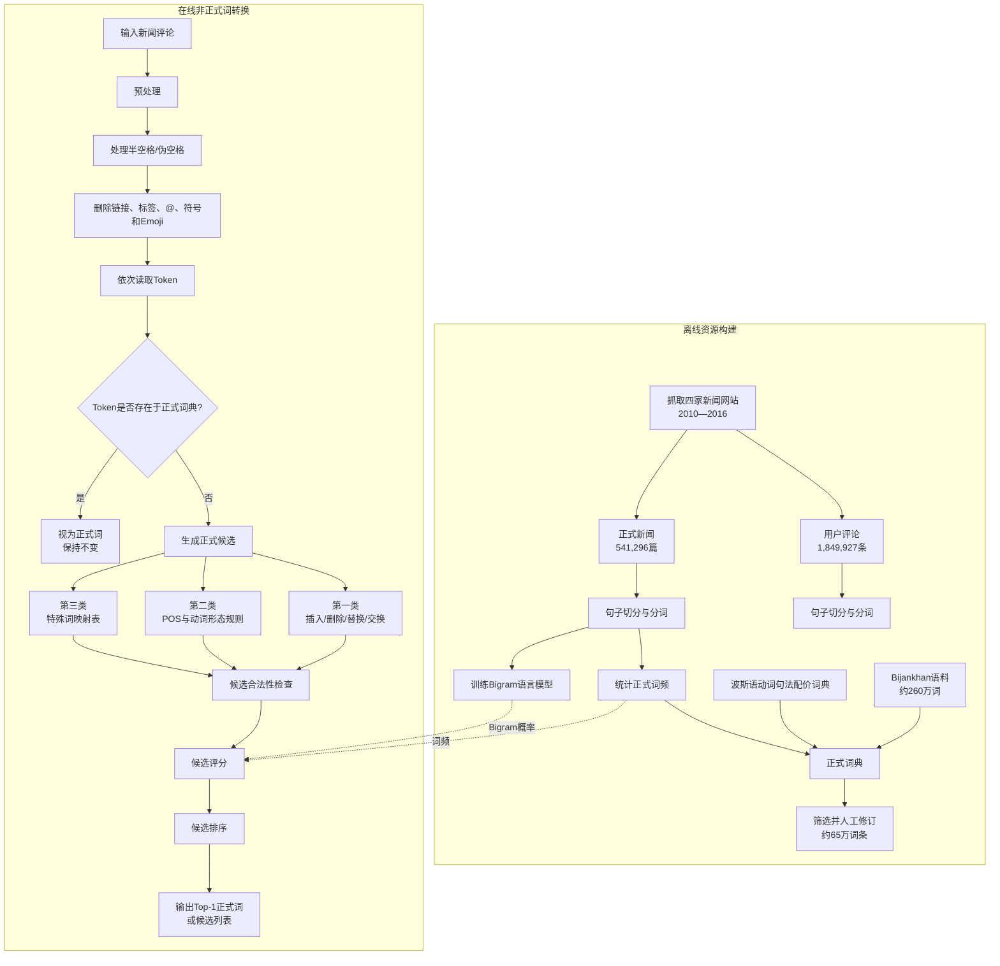

# Informal-to-Formal Word Conversion for Persian Language Using Natural Language Processing Techniques

**中文题目：** 基于自然语言处理技术的波斯语非正式词—正式词转换  
**研究方向：** 波斯语自然语言处理、文本规范化、拼写纠错、社交媒体文本处理、候选词排序  
**论文定位：** 规则、词典与统计语言模型结合的工程型方法  
**DOI：** 10.1145/3468691.3468710 

---

## **作者信息**

| 作者 | 论文署名机构 | 身份/背景 | 领域大牛认定 |
|---|---|---|---|
| **Amin Naemi** | 南丹麦大学 Maersk Mc-Kinney Moller Institute | 第一作者、通讯作者。论文发表时从事 NLP 与应用机器学习；目前南丹麦大学官方页面将其列为博士后，并参与健康信息学与人工智能研究。 | 否。属于跨领域应用型青年研究者，并非波斯语 NLP 公认领军学者。 |
| **Marjan Mansourvar** | 南丹麦大学 Maersk Mc-Kinney Moller Institute | 计算机科学博士，公开履历显示其长期从事医疗信息学和数据科学，曾在南丹麦大学工作，之后进入丹麦技术大学相关研究环境。 | 否。具有稳定的应用机器学习研究积累，但不是 NLP 顶级学者。 |
| **Mostafa Naemi** | 墨尔本大学 Melbourne Energy Institute | 其主要背景实际上是风电场、储能和能源系统建模；2020年完成墨尔本大学博士学位，本论文中的 NLP 工作属于跨领域合作。 | 否。不是波斯语 NLP 专家，主要是能源系统研究者。 |
| **Bahman Damirchilu** | 伊朗阿米尔卡比尔理工大学计算机工程与信息技术系 | 论文署名为计算机工程研究人员，但可核验的个人学术履历较少，无法准确判断其在项目中的具体职责。 | 信息不足。没有证据表明其属于该领域资深学术带头人。 |
| **Ali Ebrahimi** | 南丹麦大学 Maersk Mc-Kinney Moller Institute | 应用机器学习与健康信息学研究者，目前为南丹麦大学助理教授，研究工作主要集中于医疗数据、预测模型与决策支持。 | 青年/中生代 PI，但不是 NLP 大牛。在应用健康信息学方向有一定积累。 |
| **Uffe Kock Wiil** | 南丹麦大学 Maersk Mc-Kinney Moller Institute | 团队资历最深的作者，南丹麦大学教授，拥有超过35年研发经历和25年以上科研管理经验，研究方向包括数据分析、可视化、社交网络和医疗决策支持。 | 资深教授和团队负责人。但其核心领域是健康信息学与应用数据分析，而非波斯语 NLP；不宜称为该语言领域的顶级大牛。 |

## **团队相关信息**

该团队并非传统意义上的“波斯语 NLP 顶级实验室”，而是一个以**南丹麦大学健康信息学与应用机器学习团队**为主、联合伊朗计算机工程研究者和墨尔本大学能源研究人员组成的跨机构合作团队。

其中，**Uffe Kock Wiil 是资历最深的教授和科研管理者**，Ali Ebrahimi、Amin Naemi、Marjan Mansourvar主要从事应用机器学习与医疗信息学；Mostafa Naemi的核心背景则是能源系统。由此看，这篇论文更像是团队针对波斯语社交媒体数据提出的一项**语言特定型工程研究**，而不是长期波斯语语言学团队提出的理论突破。

**综合判断：**

> 该团队具有较强的应用数据处理和机器学习能力，由资深应用信息学教授带领，但不是波斯语 NLP 的国际主力研究组。论文价值主要体现在真实数据、语言规则设计和工程实现，而非团队学术光环或前沿神经网络创新。

---

## **论文发表时间**

| 项目 | 具体日期 | 来源/说明 |
|---|---|---|
| 会议名称 | 2021年第2届计算、网络与物联网国际会议，CNIOT 2021 | ACM会议论文 |
| 会议时间 | **2021年5月20—22日** | 会议在中国北京举行 |
| 正式发表年份 | **2021年** | 已收入ACM会议论文集 |
| 论文状态 | **正式发表、经过同行评审** | 南丹麦大学研究门户将其标记为会议论文集中的同行评审论文 |
| 文章编号 | **19:1—19:7** | 全文共7页 |
| DOI | **10.1145/3468691.3468710** | ACM正式DOI |
| 引用情况 | **Semantic Scholar显示6次引用** | 截至本次检索；不同数据库的统计可能略有差异 |

论文于**2021年5月正式发表**，并非预印本或仍在双盲评审中的论文。Semantic Scholar目前显示6次引用，因此可以认为它在波斯语文本规范化这一小众方向获得了少量后续关注，但尚未形成较大的学术影响力。

---

## **摘要**

互联网和社交媒体中存在大量波斯语用户评论，但这些文本通常采用口语化、非正式的书写方式。非正式词可能发生元音变化、字母删除与插入、词缀缩写、动词变形或完全替换，使传统拼写检查器和下游文本挖掘系统难以处理。

本文提出一个将波斯语非正式词转换为正式词的混合系统。作者首先从四家伊朗新闻网站采集正式新闻文章和用户评论，分别构建正式词资源和非正式词数据；随后利用词典、词性和波斯语形态规则生成候选正式词，并综合以下三种信息进行排序：

1. Damerau–Levenshtein编辑距离；
2. 正式词在新闻语料中的频率；
3. 前文与候选词构成的二元语言模型概率。

实验结果显示，该系统对非正式词的检测率达到**94.33%**，正确正式词进入候选列表的比例为**85.23%**，正确答案排在第一位的比例为**81.26%**。系统在检测率和候选覆盖率上优于Vafa与Virastyar两个波斯语拼写检查器，但Virastyar的MRR略高。作者还通过运行时间实验声称，系统随输入词数量近似线性增长。

---

## 一、这篇论文讲了一个什么样的故事？

这篇论文讲的是一个“**传统拼写检查无法直接解决口语化文本**”的故事。

波斯语新闻正文通常采用正式书面语，而新闻评论区中的用户更倾向于使用接近日常发音的非正式写法。例如，一个正式词在口语中可能出现：

- 元音替换；
- 字母省略或添加；
- 词尾代词缩写；
- 系词缩写；
- 动词词干变化；
- 空格或半空格使用错误；
- 与正式形式完全不同的俚语表达。

传统拼写检查器通常采用以下逻辑：

> 某个词不在词典中  
> → 将其判断为拼写错误  
> → 找出编辑距离较近的词。

但对于非正式波斯语，这一逻辑存在两个问题：

第一，非正式词并不完全是随机打字错误，而是具有稳定的口语和形态规律。例如，某些非正式动词与正式动词之间相差多个字符，单纯限制一到两次编辑操作可能找不到正确答案。

第二，多个正式词可能与非正式词具有相似的编辑距离。此时需要结合上下文判断。例如，一个非正式形式可能同时对应“房子”和“血液”，只有观察后面的动词，才能判断“流血”比“倾倒房子”更符合语言习惯。

作者因此将问题转化为一个两阶段过程：

> **先利用波斯语语言规律扩大并约束候选词集合，再利用词频和二元语言模型选出最自然的正式词。**

为此，团队从2010—2016年的四家伊朗新闻网站采集了：

- 541,296篇正式新闻；
- 1,849,927条用户评论。

正式新闻用于构建词典、词频和二元语言模型，用户评论则用于提取和测试非正式词。最终，系统在3,260个非正式词上获得约94%的检测率和约81%的Top-1转换准确率。

---

## 二、本文的核心思想和创新点

### 1. 核心思想

论文的核心思想是：

> **把非正式词转换建模为“规则约束的候选生成＋统计上下文排序”，而不是单纯的字符串纠错。**

系统综合了三类知识。

#### 字符层知识

使用四类Damerau–Levenshtein操作：

- 插入；
- 删除；
- 替换；
- 相邻字符交换。

论文还将**空格视为一个字符**，因此空格和波斯语半空格问题也可以纳入编辑操作。

#### 形态与语言学知识

作者根据非正式词与正式词之间的变化程度，把错误分为三类：

| 类别 | 特征 | 处理方式 |
|---|---|---|
| 第一类 | 只需改变一两个字母，包括元音、代词词尾、系词和空格变化 | 编辑操作、词性与词缀规则 |
| 第二类 | 需要三次左右或更多变化，主要是特殊动词形式 | 动词词根、前缀与POS规则 |
| 第三类 | 非正式词与正式词完全不同 | 人工维护的映射表 |

#### 统计上下文知识

当多个候选具有相似编辑距离时，系统利用：

- 候选词在正式新闻中的频率；
- 候选词与前一个词构成的Bigram概率；

对候选重新排序。

### 2. 关键创新点

#### 创新点一：专门研究波斯语非正式词，而非普通拼写错误

此前波斯语拼写检查工作主要针对正式文本，其中错误词比例通常较低。本文面向新闻评论等高度口语化文本，错误更加频繁且变化幅度更大。

#### 创新点二：将非正式变化划分为三个可处理层级

作者没有使用统一编辑距离暴力搜索，而是根据语言现象区分：

1. 轻微字符变化；
2. 复杂动词变化；
3. 无法通过字符编辑恢复的词汇替换。

这种分层降低了规则混乱，也使方法具有较好的可解释性。

#### 创新点三：POS与波斯语词法规则参与候选生成

系统尝试识别一个非正式词中已经属于正式词典的主体部分，再将非正式词缀转换为正式词缀。例如，对于带有口语化所有格后缀的名词，系统保留名词主体，只替换其后缀。

#### 创新点四：组合编辑距离、词频与Bigram

编辑距离衡量形式相似度，词频提供通用先验，Bigram提供局部上下文。三者分别解决：

- “长得像不像”；
- “这个词常不常见”；
- “放在当前上下文中自然不自然”。

#### 创新点五：构建大规模新闻—评论数据资源

作者从四家新闻网站采集超过230万篇文章或评论，并整理了一个包含约5,000个常见非正式波斯语词及其频率的语料资源。作者声称这是当时首批面向波斯语非正式—正式词转换的数据资源之一；不过论文没有提供明确、可持续访问的数据下载地址。

---

## 三、方法是怎么实现的？（How does it work?）

### 1. 架构

该方法由**离线资源构建**和**在线词转换**两个部分组成。论文第3页的Figure 1给出了主流程，下面结合正文中的数据、词典、规则和评分模块重新绘制。

**图注：** 根据论文第3页 **Figure 1（System flowchart）**、第2.1—2.4节以及评分公式综合绘制。原图重点描述逐Token查询、候选生成、候选评分和列表填充过程；上图补充展示了词典、词频及语言模型的离线构建过程。

### 2. 关键算法

#### 2.1 数据预处理

系统从新闻网页的HTML与RSS中提取正文和评论，仅保留文本内容。预处理包括：

- 句子切分；
- Tokenization；
- 正确处理波斯语pseudo-space；
- 删除hashtag、@mention、链接、媒体符号和Emoji。

由于波斯语中的一个词可能由普通空格、半空格或零宽字符连接，论文使用能够保留伪空格词完整性的切分函数，而不是简单按空格切词。

#### 2.2 正式词典构建

正式词典来源包括：

1. **Bijankhan Corpus**：约260万个带词性的波斯语词；
2. **Syntactic Valency Lexicon for Persian Verbs**：包括简单动词、复合动词和带前缀动词；
3. 新闻正文中的词频统计。

作者按照新闻语料中的频率对词进行排序，选取约**650,000个常见词条**，之后进行人工修订。词频还会在候选排序阶段被重复使用。

#### 2.3 第一类候选：低编辑距离变化

对于变化较小的非正式词，系统应用四种基本操作：

$$
\mathcal O=\{\text{Insertion},\text{Deletion},
\text{Substitution},\text{Interchange}\}
$$

论文最多考虑三次操作组合：

- 一次编辑：4种函数；
- 两次编辑：10种组合；
- 三次编辑：20种组合。

除了普通字符，空格也作为一个可插入、删除或替换的字符处理。

#### 2.4 词根和词缀分解

系统利用POS与形态规则找出非正式词中最大的正式词典片段：

$$
\text{正式主体}+\text{非正式词缀}
\rightarrow
\text{正式主体}+\text{正式词缀}
$$

该方法尤其适合处理：

- 名词所有格后缀；
- 复数后缀；
- 人称代词后缀；
- 系词缩写。

#### 2.5 第二类候选：特殊动词规则

部分口语动词与正式形式之间相差多个字符，无法通过较小编辑距离可靠恢复。

作者观察到其中很多是带有：

- “می”；
- “ب”；
- “ن”

等前缀的动词，因此利用现在时词根和人称后缀构造正式形式。例如，某些口语第三人称复数形式可通过如下模式恢复：

$$
\text{می}+\text{现在时词根}+\text{ند}
$$

#### 2.6 第三类候选：完全不同的词汇映射

当非正式词和正式词不存在明显字符对应关系时，编辑距离方法基本失效。系统为这些高频特例维护人工映射表：

$$
\text{非正式表达}\longrightarrow\text{正式表达}
$$

这种方法覆盖面有限，但可保证常见俚语的转换精度。

### 3. 关键公式

#### 3.1 N-gram语言模型

对于词序列 $PW_1,\ldots,PW_m$，完整概率可表示为：

$$
P(PW_1,\ldots,PW_m)
=
\prod_{i=1}^{m}
P(PW_i\mid PW_1,\ldots,PW_{i-1})
$$

使用 $n$-gram近似后：

$$
P(PW_1,\ldots,PW_m)
\approx
\prod_{i=1}^{m}
P(PW_i\mid
PW_{i-(n-1)},\ldots,PW_{i-1})
$$

本文采用二元语言模型，即：

$$
P(PW_i\mid PW_{i-1})
$$

它只利用候选词前面的一个词进行判断。

#### 3.2 候选评分函数

论文的原始符号较为混乱，可将其整理为：

$$
g(F,I)=
\alpha\frac{1}{ed(I,F)}
+\beta f_F
+\gamma n(F,I_{-1})
$$

其中：

- $I$：输入的非正式词；
- $F$：候选正式词；
- $ed(I,F)$：从 $I$ 转换到 $F$ 的Damerau–Levenshtein距离；
- $f_F$：正式词在新闻语料中的归一化词频，范围为0—9；
- $n(F,I_{-1})$：前一个词后面出现候选 $F$ 的Bigram分数；
- $\alpha,\beta,\gamma$：三个评分项的权重。

实验中采用的最佳权重为：

$$
(\alpha,\beta,\gamma)=(10,5,1)
$$

因此，评分系统明显更重视**编辑距离**，其次是词频，Bigram主要用于打破相近候选之间的平局。

#### 3.3 MRR

候选排序效果还通过平均倒数排名衡量：

$$
MRR=
\frac{1}{|Q|}
\sum_{i=1}^{|Q|}
\frac{1}{rank_i}
$$

正确候选越靠前，MRR越接近1。

#### 3.4 复杂度

一次编辑的候选生成成本近似为：

$$
2\times32\times L_w\times t_{\text{search}}
$$

其中：

- 32是波斯语字母数；
- $L_w$ 是输入词长度；
- $t_{\text{search}}$ 是一次词典查询时间。

考虑三次编辑时，论文给出的最坏形式为：

$$
12t_{\text{search}}(32L_w)^3
$$

因此，严格而言该算法对**词长度和编辑次数并不是线性的**。论文所谓“线性复杂度”，主要是指在词长、最大编辑次数和语言分布基本固定时，实测总时间与输入词数量近似线性增长。

---

## 四、实验效果（Experimental Results）

### 1. 实验设置

#### 数据来源

| 新闻网站 | 新闻数量 | 评论数量 |
|---|---:|---:|
| Khabaronline.ir | 86,822 | 654,802 |
| Tabnak.ir | 194,011 | 704,199 |
| Mashreghnews.ir | 169,723 | 363,164 |
| Fararu.ir | 90,740 | 127,762 |
| **总计** | **541,296** | **1,849,927** |

数据采集时间范围是**2010—2016年**。正式新闻用于构建词典、词频及Bigram模型，评论用于提取和评估非正式词。

#### 测试样本

作者随机抽取：

- 1,000条用户评论；
- 共14,200个词；
- 其中人工识别出3,260个非正式词。

人工专家为这3,260个词确定正式等价形式，再与系统生成的候选列表比较。

#### 比较基线

- **Vafa spell-checker**；
- **Virastyar spell-checker**；
- 本文提出的混合转换系统。

评价指标包括：

- 非正式词检测率；
- 正确正式词是否进入候选列表；
- Top-1正确率；
- Top-5覆盖率；
- MRR；
- 正确答案平均排名。

### 2. 主要结果

#### 候选生成与排序效果

| 指标 | 结果 |
|---|---:|
| 正确正式词排名第1 | **81.26%** |
| 正确正式词进入前5 | **83.42%** |
| 候选列表包含正确正式词 | **85.23%** |
| 正确正式词平均排名 | **1.539** |

这里需要特别区分：

- **81.26%** 才是严格意义上的Top-1自动转换正确率；
- **85.23%** 表示正确词出现在候选列表中，并不代表系统最终自动选中了它。

由表中数据可以进一步推导：当正确答案已经进入候选列表时，大约**95.3%**的情况下它会被排在第一位。因此，该系统的主要瓶颈更可能是**能否生成正确候选**，而不是候选进入列表后的排序能力。

#### 与波斯语拼写检查器比较

| 方法 | 检测率 | 正确词进入候选列表 | MRR |
|---|---:|---:|---:|
| **本文方法** | **94.33%** | **85.23%** | 0.814 |
| Vafa | 78.62% | 67.65% | 0.705 |
| Virastyar | 91.40% | 81.11% | **0.831** |

**核心结论：**

- 本文方法在非正式词**检测率**上最高，比Virastyar高2.93个百分点；
- 本文方法在正确候选**覆盖率**上最高，比Virastyar高4.12个百分点；
- Virastyar的MRR为0.831，反而高于本文方法的0.814；
- 因此，本文方法并不是在所有指标上都优于Virastyar；
- 论文的主要优势是找到更多非正式词和正确候选，而非始终提供最佳候选排序。

### 3. 消融实验与关键发现

本文没有进行严格意义上的模块消融实验，例如没有分别去掉：

- 编辑距离；
- 词频；
- Bigram；
- POS规则；
- 特殊词映射表。

因此，无法确定每个模块分别贡献了多少性能提升。

#### 错误编辑次数分布

论文第5页Figure 2显示：

| 所需编辑次数 | 数量 | 约占比 |
|---|---:|---:|
| 1次 | 2,663 | 81.7% |
| 2次 | 403 | 12.4% |
| 大于2次 | 194 | 6.0% |

这说明绝大多数口语化变化仍然具有较强的字符规律，因此以拼写检查为基础是合理的。

不过，论文正文后面声称“大于两次编辑的错误少于5%”，而根据图中194/3260计算，实际约为6%，存在小幅内部不一致。

#### 编辑操作分布

Figure 2还表明：

$$
\text{删除}>\text{插入}>\text{替换}>\text{交换}
$$

删除和插入是最常见操作，而字符交换非常少。这与部分英语拼写错误研究的分布不同，说明波斯语非正式化更多体现为发音驱动的字符省略、附加与词缀变化。

#### 权重发现

作者最终采用：

$$
(\alpha,\beta,\gamma)=(10,5,1)
$$

说明实验中编辑距离的权重远高于上下文Bigram。但论文未说明：

- 尝试了哪些权重组合；
- 使用训练集、验证集还是测试集选权重；
- 是否存在测试集调参；
- 不同权重下的性能曲线。

#### 运行时间

第7页Figure 3展示了从约100到3,260个非正式词的运行时间。散点和拟合线近似线性，支持“在固定配置和数据分布下，处理时间随输入词数量线性增长”的工程结论。

但这不能证明候选生成算法在词长或最大编辑距离上的理论复杂度为线性。

**实验部分总结：**

本文通过真实新闻评论证明，**波斯语非正式词的大部分变化可以由少量编辑操作与形态规则描述**。混合系统在检测率和候选覆盖率上明显优于两个传统拼写检查器，但其Top-1准确率实际为81.26%，且Virastyar的MRR更高。论文证明了方法的工程可行性，但尚未充分量化各个模块的独立贡献。

---

## 五、优点与局限性

### ✅ 1. 优点

#### （1）研究问题具有现实意义

新闻评论、社交媒体和聊天文本大量采用非正式波斯语。将其规范化有助于：

- 情感分析；
- 舆情挖掘；
- 信息检索；
- 事件识别；
- 文本分类；
- 下游语言模型训练。

#### （2）使用了规模较大的真实数据

数据不是人工合成的随机拼写错误，而是来自四家新闻网站、超过180万条真实用户评论，因此能够覆盖用户实际采用的口语写法。

#### （3）充分利用波斯语语言特征

方法不仅计算编辑距离，还针对：

- 半空格；
- 代词词尾；
- 系词；
- 动词前缀；
- 现在时词根；
- 完全不规则的口语词

设计了专门规则，比完全语言无关的方法更有针对性。

#### （4）系统具有良好可解释性

每个输出都可以追溯到：

- 使用了哪种编辑操作；
- 匹配了哪条词法规则；
- 候选词频是多少；
- Bigram概率如何；
- 为什么某个候选排在前面。

#### （5）同时评估检测、召回和排序

论文没有只报告一个总体准确率，而是分别报告：

- 检测率；
- 候选覆盖率；
- Top-1；
- Top-5；
- 平均排名；
- MRR。

这使得候选生成和候选排序两个环节可以被部分区分。

#### （6）与已有系统进行了直接比较

Vafa和Virastyar是已有的波斯语拼写检查器，加入二者作为基线，比仅与“无处理”系统比较更有说服力。

---

### ⚠️ 2. 局限性（研究边界与待解问题）

#### （1）本质上是词级转换，不是完整的句子风格转换

系统逐Token处理，最多使用前一个词的Bigram。它无法充分处理：

- 多词口语表达；
- 词序变化；
- 代词省略；
- 口语句法；
- 需要整句重写的表达；
- 同一个非正式词在不同语境中的长距离歧义。

#### （2）不能可靠处理real-word error

系统首先检查一个Token是否位于正式词典中。如果存在，通常直接保持不变。

因此，当一个非正式写法恰好也是某个合法正式词时，系统可能无法发现它。此类错误必须依赖句子语义，而不是词典成员关系。

#### （3）正确候选覆盖率只有85.23%

这意味着约14.77%的测试词中，正确答案根本没有进入候选列表。无论后续排序算法多好，都无法纠正这些词。

候选生成才是该方法的理论上限：

$$
\text{Top-1 Accuracy}
\leq
\text{Candidate Recall}
$$

#### （4）85.23%容易被误读为自动纠正准确率

严格的Top-1结果是81.26%，而85.23%只是“正确词位于某个候选位置”。如果系统需要自动替换用户文本，应使用Top-1而非候选覆盖率作为核心指标。

#### （5）缺少严格的数据集划分说明

规则、异常词映射、词频和测试数据均来自相同的四家新闻网站。论文没有清楚说明：

- 规则提取数据与测试评论是否完全分离；
- 是否存在重复评论或重复词；
- 特殊词映射表是否参考了测试词；
- 权重是否在测试集上选择。

因此存在一定的数据泄漏风险。

#### （6）缺少模块消融和统计检验

论文没有回答：

- 只使用编辑距离会怎样？
- 增加词频提升多少？
- Bigram提升多少？
- POS规则覆盖多少词？
- 特殊映射表贡献多少？
- 方法与基线的差异是否具有统计显著性？

#### （7）Virastyar的MRR更高

虽然本文方法的检测率和候选覆盖率更好，但Virastyar在MRR上占优。因此，论文所说的“显著优于”只能限定在检测和纠正覆盖指标，不能推广到所有评价指标。

#### （8）“线性复杂度”的论证不够严谨

三次编辑的理论搜索空间随词长呈三次增长。实验只证明了：

> 在固定字母表、词长分布、最大编辑次数和实现条件下，运行时间随测试词数量近似线性。

它没有证明算法对所有输入参数都是线性的。

#### （9）规则和词典维护成本较高

新的网络俚语、地区方言、缩写和外来词不断出现。人工规则和特殊映射表需要持续更新，否则性能会随时间下降。

#### （10）数据存在领域与年代限制

语料来自2010—2016年的新闻评论，与当前社交媒体在以下方面可能存在明显差异：

- 新俚语；
- Emoji使用；
- 波斯语—英语代码混合；
- 短视频平台语言；
- 青年群体缩写；
- 不同地区的方言写法。

#### （11）语料资源的开放性不足

作者声称构建了超过5,000个非正式词的语料，但论文中没有提供清晰的数据下载、许可证及版本信息，限制了完整复现和公平比较。

---

## 六、其他

### 第一性原理

#### 1. 该问题本质上是噪声信道解码

设观察到的非正式词为 $I$，真实正式词为 $F$，上下文为 $C$。目标是：

$$
F^*=\arg\max_F P(F\mid I,C)
$$

根据贝叶斯公式：

$$
P(F\mid I,C)
\propto
P(I\mid F)\,P(F\mid C)
$$

本文中的三个评分项可以对应为：

| 论文组件 | 概率意义 |
|---|---|
| 编辑距离 | 近似非正式词由正式词变形产生的概率 $P(I\mid F)$ |
| 正式词频 | 近似正式词的先验概率 $P(F)$ |
| Bigram | 近似上下文条件概率 $P(F\mid C)$ |

因此，这个系统实际上是一个简化的**Noisy Channel Model**。

#### 2. 候选生成决定系统上限

系统包含两个核心问题：

1. 正确词是否被生成；
2. 正确词是否被排在第一。

实验中：

$$
\text{候选覆盖率}=85.23\%
$$

$$
\text{Top-1}=81.26\%
$$

两者只相差3.97个百分点。这说明排序器已经能够较好地识别列表中的正确答案，更大的提升空间在于：

- 扩充候选规则；
- 处理不规则变化；
- 识别real-word error；
- 使用音系和句法信息；
- 覆盖多词表达。

#### 3. 为什么简单方法能够有效？

Figure 2显示约82%的非正式词只需要一次编辑。这意味着波斯语非正式化虽然看起来复杂，但在词级表面上具有较强的低距离结构：

$$
P(ed(I,F)=1)\gg P(ed(I,F)>2)
$$

因此，语言规则加编辑距离能够覆盖大部分常见现象，而不一定需要大型神经网络。

#### 4. 语言特定规则是一种强先验

通用模型需要从数据中学习“哪些字符变化在波斯语中合理”，而本文直接把这些知识编码进规则。

在数据有限时：

$$
\text{强语言先验}+\text{少量数据}
$$

往往可以接近甚至超过：

$$
\text{弱先验}+\text{复杂模型}
$$

但代价是跨语言迁移能力差、维护成本高。

#### 5. 检测与纠正是两个不同任务

检测解决：

$$
I\notin\mathcal D?
$$

纠正解决：

$$
\arg\max_{F\in\mathcal C(I)}g(F,I)
$$

一个系统可能检测到某个词“不正常”，却无法产生正确候选。本文94.33%的检测率明显高于85.23%的候选覆盖率，正体现了这两个阶段之间的性能损失。

---

### 领域空白

#### 1. 缺少公开统一的波斯语非正式—正式基准

未来基准应提供：

- 句子级平行语料；
- 词级对齐；
- 口语变化类别；
- 地区方言标签；
- 是否需要上下文；
- 多种合法正式表达；
- 训练、验证和测试集的严格隔离。

#### 2. 缺少句子级意义保持评估

真正的文本正式化不能只检查词是否正确，还应评估：

$$
\text{语义保持}
+\text{正式程度提升}
+\text{语法正确性}
$$

需要引入人工评分、语义相似度和风格分类器等多维指标。

#### 3. Real-word与上下文错误仍未解决

未来系统需要在词位于词典中时仍判断：

$$
P(w_i\mid w_{1:i-1},w_{i+1:n})
$$

这要求使用双向上下文模型，而不是只看前一个词的Bigram。

#### 4. 规则系统与神经模型可以结合

可采用两阶段结构：

规则系统负责约束搜索空间，Transformer负责理解长距离语义，可以同时保留可解释性和上下文能力。

#### 5. 需要置信度和拒绝机制

自动修改系统不应在证据不足时强行替换。可以使用：

$$
\Delta=
score(F_{\text{best}})
-
score(F_{\text{second}})
$$

当：

$$
\Delta<\tau
$$

时保留原词或返回多个候选，以避免过度纠正。

#### 6. 需要处理跨词和跨句变化

未来方法应覆盖：

- 多词俚语；
- 合并与拆分；
- 口语词序；
- 省略主语；
- 代词恢复；
- 口语助词删除；
- 整句礼貌程度转换。

#### 7. 需要面向现代社交媒体的数据更新机制

可以建立动态词典：

$$
\text{新评论流}
\rightarrow
\text{异常新词检测}
\rightarrow
\text{聚类和语境分析}
\rightarrow
\text{人工确认}
\rightarrow
\text{词典增量更新}
$$

从而应对语言随时间快速变化的问题。

---

## 总体评价

这是一篇具有明显工程价值的波斯语文本规范化论文。它最重要的贡献不是提出新的深度学习模型，而是证明：

> **波斯语非正式词的大部分变化具有可解释、低编辑距离和形态规则化的结构，因此可以通过词典、语言规则和统计上下文实现较高精度的转换。**

系统在检测率和正确候选覆盖率上优于Vafa与Virastyar，说明专门针对非正式语言设计规则确实有效。然而，其严格Top-1准确率为81.26%，并且存在词级处理、Bigram上下文过短、候选覆盖不足、数据划分不清以及复杂度论证不严谨等问题。

从研究史定位看，它适合作为**波斯语非正式文本规范化的早期工程基线和候选生成方法**，但还不是完整的句子级风格转换系统，也不是该领域的算法里程碑。

---

> 本文由ChatGPT AI 生成

