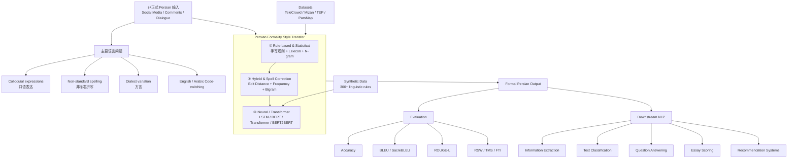

# Advances of Informal to Formal Persian Text Conversion: A Survey

《波斯语非正式文本到正式文本转换研究进展：综述》


> 论文类型：Survey / 综述论文

> 核心领域：Natural Language Processing、Formality Style Transfer、Persian/Farsi NLP、Low-Resource Languages

> 一句话定位：这篇论文不是提出一个新的文本转换模型，而是系统梳理了 2011–2025 年波斯语 informal → formal 文本转换领域的模型、数据集、评测指标以及未来研究空白。作者明确声称，这是首篇专门针对 Persian text formalization 的综合综述。

---
## **作者信息**

| 作者 | 机构 | 身份/背景 | 领域大牛认定 |
|---|---|---|---|
| **Aylin Naebzadeh** | 论文署名：Iran University of Science and Technology(伊朗科技大学)；目前公开资料显示在 **University of Hull** | NLP/AI 方向青年研究者，研究涉及 Persian NLP、Transformer、文本分类、LLM；目前已有专门针对 Persian formalization 的微调模型工作 | ⭐⭐ **青年研究者**。目前还不能算领域“大牛”，但研究方向和本文高度匹配，属于正在积累成果的 early-career researcher。|
| **Maryam Sadat Hashemi** | Iran University of Science and Technology | IUST 博士生；当前研究集中于 **LLM-based Multi-Agent Systems、强化学习、博弈论**；此前做过 VQA/VLM；导师包括 Sauleh Eetemadi | ⭐⭐ **青年研究者/博士生**。还不是资深学者，但已经有 FarExStance、Persian NLP 等工作。|
| **Sauleh Eetemadi** | University of Birmingham Dubai，School of Computer Science | **Assistant Professor**；Michigan State University PhD；曾在 **Microsoft Research NLP Group 工作约13年**，参与机器翻译系统研发；2018 年曾加入 IUST 任 Assistant Professor | ⭐⭐⭐⭐ **本团队最资深作者**。并非 ACL/AI 领域顶级“院士型大牛”，但在机器翻译、NLP 工程与 Persian NLP 领域有很扎实的工业界+学术背景，尤其 13 年 Microsoft Research 经历含金量较高。 |


## **团队相关信息：**
这个团队可以理解为一个以 IUST Persian NLP 研究生态为核心、与 University of Birmingham Dubai 合作的小型低资源语言 NLP 团队。

其中真正起到 senior researcher / PI 作用的是 Sauleh Eetemadi。他与一般纯学术路径的 AP 不太一样：在进入高校前，有大约 13 年 Microsoft Research NLP / Machine Translation 工程研究经历，之后于 2018 年进入 IUST，再转至 University of Birmingham Dubai 任 Assistant Professor。University of Birmingham
因此，这支团队的特点不是“顶级 NLP 豪华阵容”，而是：

> 长期机器翻译经验 + Persian NLP + 低资源语言 + 青年研究者。

从“领域大牛”的严格标准看，目前团队里没有 ACL Fellow、ACM Fellow、院士级别人物；但 Eetemadi 属于非常有经验的 NLP/MT senior researcher，而 Naebzadeh、Hashemi 更偏正在成长的年轻研究者。

## **论文发表时间**

| 项目 | 具体日期 | 来源/说明 |
|---|---|---|
| 所属会议 | **ACLing 2025：7th International Conference on AI in Computational Linguistics** | PDF 明确写明由 ACLing 2025 scientific committee 负责同行评审|
| 接收信息 | **2026 年 1 月 1 日** | Maryam Hashemi 个人主页将该论文列为 “accepted to Procedia Computer Science”。|
| 正式发表 | **2026 年 1 月** | Procedia Computer Science，Volume 275，Pages 743–750。 |
| DOI | **10.1016/j.procs.2026.01.086** | Elsevier / ScienceDirect。|
| 论文状态 | **正式发表、同行评审、Open Access** | 并不是 arXiv-only 或“在审稿”论文。ScienceDirect 已正式收录。|

这里有一个小的元数据现象：上传的 PDF 首页写有 ©2025 The Authors，同时注明 ACLing 2025；但正式的 Procedia Computer Science 卷期和 DOI 均属于 2026。 因此写论文笔记时，建议统一标成：

> 正式发表时间：2026 年；会议来源：ACLing 2025 proceedings。


---

## **摘要**

这篇论文研究的对象是 Formality Style Transformation（FST，正式度风格转换），即：
> 在保持原始语义不变的前提下，将社交媒体、聊天等场景中的非正式文本转换成规范、正式的文本。

这一任务对于信息抽取、文本分类、问答等下游 NLP 系统很重要，因为很多预训练模型主要接触规范语料，而真实用户输入却包含大量口语、省略、非标准拼写和俚语。
Persian/Farsi 尤其困难，因为它同时具有：

    · 低资源；
    · 非拉丁文字；
    · 丰富的形态变化；
    · 非标准拼写；
    · 口语表达；
    · 方言差异；
    · 与 English / Arabic 的 code-switching。
论文因此系统调查了 Persian FST 的 方法、数据集以及评价指标，并进一步总结了当前数据不足、长文本、方言、模型训练成本以及实际应用等开放问题。

---

## 一、这篇论文讲了一个什么样的故事？

这篇论文讲的其实是一个非常典型的：

> **“一个低资源 NLP 问题如何从人工规则，一步步走向 Transformer，然后发现真正的瓶颈已经从模型变成数据和评价体系”**

的故事。

最开始的问题来自社交媒体。

传统 Persian NLP 模型主要在规范书面语上训练，而 Twitter/X、Instagram、Telegram 等平台中的 Persian 却充满：

> 口语缩写、俚语、拼写变体、语法省略、方言和 English/Arabic code-switching。

所以模型存在明显的 **train–test distribution gap**：

```text
训练数据：
规范 Persian
      ↓
Pretrained NLP Model
      ↓
实际输入：
大量口语 / 非正式 Persian
      ↓
性能下降
```

于是研究者开始尝试一个中间层：

```text
Informal Persian
       ↓
Formality Style Transfer
       ↓
Formal / Standard Persian
       ↓
Existing NLP model
```

论文把十余年来的发展总结成三个阶段。

### 第一阶段：规则 + 统计模型

最早的方法高度依赖语言学专家。

例如 Armin & Shamsfard 使用：

> 20+ 手写 linguistic rules  
> + 自定义词典  
> + unigram / bigram language model

先产生多个正式候选词，再利用语言模型判断哪个候选词放在上下文中最合理。

其 word-level accuracy 达到 **93%**。

---

### 第二阶段：把 formalization 看成拼写纠错

研究者随后意识到：

很多口语 Persian → 正式 Persian 的变化，实际上和 spell correction 很像。

于是出现：

```text
Informal word
     ↓
插入 / 删除 / 替换 / 交换字符
     ↓
Candidate generation
     ↓
Damerau-Levenshtein Distance
+ Word Frequency
+ Bigram LM
     ↓
Formal word
```

Naemi 等人的方法达到：

- informal word detection：**94.33%**
- correction：**85.23%**

明显优于当时的 Persian spell checker。

---

### 第三阶段：Neural Network → Transformer

随后问题被重新定义为：

> **sequence-to-sequence translation**

也就是：

```text
Informal Persian sequence
          ↓
Encoder / Transformer
          ↓
Formal Persian sequence
```

Transformer 的优势在于它不需要人工指定：

> “这个词应该怎么改”

而是直接学习：

> “整个句子在正式 Persian 中应该怎么表达。”

这点非常重要，因为 ParsMap 数据显示：

> **49.77% 的 informal-formal sentence pairs 涉及 syntactic change。**

也就是说，近一半句子不是简单的“改单词”，而需要修改整个句法结构。

最终，survey 中介绍的 SOTA 方案是：

> **Autonomous Fa-BERT2BERT**

它不依赖外部 dictionary，而利用 Transformer 自己的上下文能力完成 formalization，并获得：

> BLEU = **70.68**  
> ROUGE-L = **86.15**  
> FTI = **75.83**

在相同实验中的多个 baseline 上表现最好。

所以整篇论文最终形成了一个很清晰的故事线：

> **Rule → Statistical → Spell Correction → Neural Seq2Seq → Transformer → Context-aware end-to-end formalization**

而当 Transformer 已经把模型性能提高以后，新的主要瓶颈逐渐变成：

> **数据不足、方言缺失、长文本缺失、评价指标不完善以及实际部署成本。**

---

# 二、本文的核心思想和创新点

## 1. 核心思想

需要特别注意：

> **这篇论文没有提出一个新的 Persian formalization 模型。**

它真正的核心贡献是：

> **建立 Persian informal-to-formal conversion 领域的“研究地图”。**

作者将 2011–2025 年的研究统一整理为三个技术范式：

```text
Persian Informal → Formal
          │
          ├── Rule-based & Statistical
          │
          ├── Hybrid & Spell-Correction
          │
          └── Neural & Transformer-based
```

同时，再从三个维度观察整个领域：

```text
方法（Model）
   +
数据（Dataset）
   +
评价（Evaluation）
   ↓
Persian FST Research Landscape
```

因此，它的价值更偏 **taxonomy + resource survey + research-gap analysis**。

---

## 2. 关键创新点

### **创新点 1：首篇专门面向 Persian FST 的综合综述**

作者明确表示：

> 据其所知，这是第一篇专门针对 Persian text formalization 的 comprehensive survey。

之前更多论文是：

```text
提出一个模型
↓
在一个数据集测试
↓
报告 BLEU / Accuracy
```

而本文第一次尝试：

```text
所有主要方法
       +
所有主要数据集
       +
评价方法
       +
未来挑战
```

放到同一个框架下讨论。

---

### **创新点 2：给出了清楚的技术演进路线**

论文第 2 页的 **Figure 1** 专门画出了 Persian informal-to-formal 方法发展的时间线，并据此划分为三大类别。

本质上可以总结成：

```text
2011
Rule + N-gram
        ↓
2020
Crowdsourcing / Synthetic Data
        ↓
2021
Spell Correction / Hybrid
        ↓
2022
LSTM / Transformer
        ↓
2024–2025
Context-aware BERT2BERT
```

---

### **创新点 3：不只讨论模型，也系统梳理数据集**

这是本文很实用的一点。

它没有把模型性能孤立出来，而是专门总结了：

- Armin & Shamsfard
- TeleCrowd
- Rasooli et al.
- Naemi et al.
- Khazeni et al.
- ParsMap

等数据资源。

尤其 ParsMap 已经发展为：

> **50,014 sentence pairs**  
> **529,286 word/phrase alignments**  
> **71,842 unique alignment pairs**  
> **49.77% sentences involving syntactic change**。

这实际上说明：

> **Persian FST 的进步很大程度上也是 Dataset Scaling 的结果。**

---

### **创新点 4：指出传统 BLEU 并不足够**

后期工作开始使用：

- BLEU
- ROUGE-L
- Register-Specific Words（RSW）
- Tag Matching Score（TMS）
- Formality Transfer Index（FTI）

特别是 Fa-BERT2BERT 工作通过 FTI 等指标试图更加直接地衡量：

> **“语言真的变正式了吗？”**

而不仅仅是：

> **“输出和 reference 字面上像不像？”** 

这是 FST 区别于普通机器翻译的一个重要问题。

---

# 三、方法是怎么实现的？(How does it work?)

## 1. 架构

再次强调：

> **本文是一篇 Survey，因此不存在一个由作者提出的统一系统架构。**

下面这个图是根据论文 **Figure 1（第2页技术演进图）+ Section 2 方法分类 + Section 3 Dataset + Section 4 Challenges** 综合还原的“Persian FST 研究架构”。



**图注**：依据论文第 2 页 **Figure 1（Persian informal-to-formal modeling timeline）**、Section 2 的三类方法、Section 3 数据集和 Section 4 应用方向综合绘制。论文指出 formalization 可以进一步服务信息抽取、分类、QA，以及未来的自动作文评分和推荐系统。 

---

## 2. 关键算法

### **路线 A：Rule + N-gram**

Armin & Shamsfard：

```text
Informal sentence
       ↓
20+ linguistic rules
       ↓
处理：
Verb
Pronoun
Punctuation
Lexical variation
       ↓
产生 Formal Candidates
       ↓
Unigram + Bigram LM
       ↓
根据上下文排名
       ↓
Formal sentence
```

结果：

> **93% word-level accuracy**。

优点是解释性强。

缺点也很明显：

> language-specific、维护成本高、遇到没写进规则的现象就容易失败。

---

### **路线 B：Crowdsourcing + EM**

TeleCrowd 的目标其实更多是：

> **解决没有 parallel corpus 的问题。**

流程：

```text
500 informal sentences
        ↓
Crowd-processing
用户提交 formal candidate
        ↓
Crowd-rating
用户 upvote / downvote
        ↓
Expectation-Maximization
估计每位 annotator 的可靠度
        ↓
高质量 informal–formal corpus
```

实验得到：

> corpus-level BLEU = **54**。

这个工作的意义主要是：

> **data construction，而不只是 model construction。**

---

### **路线 C：Edit-distance Spell Correction**

Naemi et al.：

```text
Informal Word
      ↓
Transformation Complexity Classification
      ↓
Candidate Generation
      │
      ├ insertion
      ├ deletion
      ├ substitution
      └ interchange
      ↓
Candidate Ranking
      │
      ├ Damerau-Levenshtein distance
      ├ Word frequency
      └ Bigram model
      ↓
Formal Word
```

结果：

> Detection = **94.33%**  
> Correction = **85.23%**。

---

### **路线 D：Synthetic Data + BERT**

低资源语言最大的困难是：

> 没有足够多的 informal/formal parallel pairs。

Rasooli et al. 做了一个很聪明的反向过程：

```text
大量 Formal Persian
       ↓
300+ linguistic transformation rules
       ↓
人工制造 Informal Persian
       ↓
Synthetic Parallel Corpus

Informal ───────── Formal
        ↓
BERT Encoder–Decoder
        ↓
Formalized Text
```

也就是一种 **back-transformation / synthetic data generation**。

最终：

> BLEU = **62.8**。

这也是低资源 NLP 中非常重要的一类思想：

> **没有数据，就先利用语言学知识制造数据，再让神经网络学习。**

---

### **路线 E：Character-level Transformer**

Momtazi & Adibian 使用了：

- LSTM encoder-decoder + attention；
- Transformer；
- character-level representation；
- 8 个 handcrafted linguistic rules。

关键发现是：

> Transformer + rules **before preprocessing** 达到 SacreBLEU **70.70**；

而：

> rules applied after neural model = **69.66**，

甚至比 base Transformer 的 **69.96** 略差。

这意味着：

> Transformer 已经能够自己学习很多原本需要人工 post-processing 的转换规律。

---

### **路线 F：Fa-BERT2BERT**

目前 survey 中最先进的一条路线。

```text
Informal Persian
       ↓
FaBERT Encoder
       ↓
Contextual Representation
       ↓
BERT Decoder
       ↓
Formal Persian
```

作者讨论的工作包含两种策略：

```text
Fa-BERT2BERT
      │
      ├── Dictionary-based
      │
      └── Autonomous
            ↓
     完全依赖 contextual information
```

最终 Autonomous 模型明显更好：

| 模型 | BLEU | ROUGE-L | RSW | TMS | FTI |
|---|---:|---:|---:|---:|---:|
| **Autonomous Fa-BERT2BERT** | **70.68** | **86.15** | 81.10 | **71.12** | **75.83** |
| Fa-BERT2BERT + Dictionary | 63.54 | 80.53 | 78.15 | 61.24 | 68.67 |
| Autonomous Pars-BERT2BERT | 65.83 | 84.89 | **82.52** | 69.43 | 75.41 |
| Hazm | 36.70 | 60.13 | 66.74 | 42.00 | 51.56 |
| mT5 Back-Translation | 17.90 | 35.95 | 41.28 | 37.56 | 39.30 |

原论文 Table 2 给出的结果表明 Autonomous Fa-BERT2BERT 在综合指标上表现最佳。

---

## 3. 关键公式

这里有一个需要特别说明的地方：

> **这篇 Survey 本身几乎没有给出算法公式。**

它更多是文字总结各方法，因此下面公式属于**为了帮助理解而做的数学抽象，并非本文作者原样给出的公式**。

### ① Formality Style Transfer 的基本目标

可以抽象为：

$$
y^*=\arg\max_y P_\theta(y|x)
$$

其中：

- $x$：informal Persian；
- $y$：formal Persian。

但普通 seq2seq 还不够，FST 实际上有两个约束：

$$
Semantics(y)\approx Semantics(x)
$$

同时：

$$
Formality(y)>Formality(x)
$$

也就是说：

> **内容不能变，但风格必须变。**

这是整个问题的第一性约束。

---

### ② Spell-correction 方法

论文描述 Naemi et al. 使用：

- Damerau–Levenshtein distance；
- word frequency；
- bigram statistics

联合排名候选词。

概念上可以表示成：

$$
Score(c)=
\alpha(-D_{DL}(x,c))
+\beta \log F(c)
+\gamma \log P(c|context)
$$

其中：

- $D_{DL}$：Damerau–Levenshtein distance；
- $F(c)$：candidate frequency；
- $P(c|context)$：bigram context probability。

**注意：这个表达式只是根据论文描述做的结构化抽象，survey 并未给出具体权重 $\alpha,\beta,\gamma$。**

---

### ③ FST 的真正评价目标

从方法论上可以进一步写成：

$$
Score=
f(
Semantic\ Preservation,
Formality,
Fluency
)
$$

即一个好的 formalizer 至少同时需要：

> **语义保持 + 正式度提升 + 语言流畅性**

这也解释了为什么后期工作不满足于 BLEU，而开始设计 RSW、TMS、FTI 等指标。

---

# 四、实验效果 (Experimental Results)

## 1. 实验设置

这里不能像普通方法论文一样说：

> “作者训练了某个模型。”

因为：

> **本文本身没有开展统一模型实验。**

所谓实验结果实际上来自作者整理的历年论文。

论文第 8 页的 **Table 6** 对整个领域做了最后汇总。

| 工作 | 方法 | 核心技术 | 主要结果 |
|---|---|---|---:|
| Armin & Shamsfard | Rule + N-gram | 20+ rules、unigram/bigram | **93% accuracy** |
| Masoumi et al. | TeleCrowd | Crowdsourcing + EM | **BLEU 54** |
| Naemi et al. | Spell Correction | Edit Distance + Frequency + Bigram | **94.33% detection / 85.23% correction** |
| Rasooli et al. | BERT Encoder–Decoder | 300+ rules synthetic data | **BLEU 62.8** |
| Khazeni et al. | PSC + DL | FastText + LSTM | **81.91% accuracy** |
| Momtazi & Adibian | Transformer | Character-level + 8 rules | **SacreBLEU 70.70** |
| Falakaflaki & Shamsfard | Fa-BERT2BERT | Context-aware end-to-end | **BLEU 70.68 / FTI 75.83** |

需要非常注意：

> **这些数字不能横向直接排名。**

例如：

$$
93\% Accuracy \neq BLEU\ 70.68
$$

因为：

- 数据集不同；
- 测试集不同；
- task granularity 不同；
- metric 不同。

所以不能说：

> “93% 的规则模型比 70.68 BLEU 的 Transformer 更强。”

这是不同实验体系。

---

## 2. 主要结果

### **结果 1：Transformer 已经明显成为主流**

在 Momtazi & Adibian 的同一实验设置下：

| 模型 | SacreBLEU |
|---|---:|
| LSTM Encoder–Decoder | 61.33 |
| LSTM + Rules Before | 61.88 |
| Transformer | 69.96 |
| **Transformer + Rules Before** | **70.70** |
| FarsiYar | 43.09 |

Transformer 相较 LSTM 提升非常明显。

---

### **结果 2：Context 比 Dictionary 更重要**

Fa-BERT2BERT：

$$
FTI_{Autonomous}=75.83
$$

而：

$$
FTI_{Dictionary}=68.67
$$

差异相当明显。

说明仅仅做：

> informal word → formal word dictionary lookup

已经不足以解决现在的 Persian FST。

真正困难的是：

> **句子级语义 + 上下文 + 句法重排。**

---

### **结果 3：近一半数据需要改变句法**

ParsMap：

$$
49.77\%
$$

的 sentence pairs 存在 syntactic change。

这几乎直接宣判了纯：

> word normalization / dictionary replacement

路线的上限。

因此这个领域最终走向 seq2seq Transformer 并非偶然。

---

### **结果 4：Data Scaling 对低资源语言非常重要**

例如 ParsMap 达到：

> **50,014 sentence pairs**  
> **529,286 alignments**

而早期 TeleCrowd 的 core set 只有：

> **500 informal sentences**。 

所以十多年性能提升不仅来自模型：

> **数据资源的数量和质量同样是核心推动力。**

---

### **核心结论：**

- Persian FST 已经经历了 **Rule → Statistical → Hybrid → Neural → Transformer** 的清晰技术迁移。
- 在相同实验条件下，**Transformer 明显优于 LSTM 和传统工具**。
- **Autonomous、context-aware end-to-end formalization** 比依赖 dictionary 的方式更有潜力。
- **Synthetic Data 是解决低资源问题的重要手段**；Rasooli et al. 利用 300+ linguistic transformations 生成训练数据。
- 但目前最大问题已经逐渐转向 **dataset coverage、dialects、long text、evaluation 和 deployment cost**。

---

## 3. 消融实验与关键发现

严格来说：

> **Survey 本身没有做新的 ablation study。**

但它总结的已有论文中存在几个非常有价值的“类消融实验”。

### **① Rules Before vs Rules After**

Transformer：

- Base：69.96
- Rules Before：**70.70**
- Rules After：69.66

也就是说：

> **Pre-processing rules 有一点帮助，post-processing rules 几乎没有帮助甚至略有下降。** 

一个合理解释是：

> Transformer 已经在内部学习到了这部分语言变换，后面再硬加规则反而可能破坏模型已经生成好的结构。

---

### **② Autonomous vs Dictionary**

Fa-BERT2BERT：

> Autonomous FTI = **75.83**

vs.

> Dictionary FTI = **68.67**

证明：

> **context-aware generation > lexical substitution**。

---

### **③ Word-level → Character-level → Sentence-level**

整个技术演进也说明：

```text
Word Replacement
      ↓
Character Transformation
      ↓
Sentence-level Context Modeling
```

模型能够处理的语言现象越来越复杂。

---

### **关键发现：**

- **Persian formalization 不是 Spell Checking 的简单扩展。**
- 真正困难的是 **context + syntax + morphology**。
- 手工规则并没有完全失去价值，但更适合作为：
  - preprocessing；
  - synthetic data generation；
  - low-resource prior knowledge。
- 当数据规模增长后，**Transformer 可以内化大量人工规则**。
- 单纯 BLEU 不足以完整评价 FST，因此需要专门衡量 style transfer 的指标。

---

### **实验部分总结：**

这篇论文并不是通过新的实验刷新 SOTA，而是通过横跨十余年的已有结果说明：

> Persian FST 已经从“人工告诉模型怎么改词”，发展到“模型根据整个上下文自动重写句子”。

其中最关键的转折是：

> **问题从 lexical normalization 逐渐转向 contextual sequence generation。**

而下一阶段的核心矛盾已经不再只是：

> “换一个更大的 Transformer 能不能涨点分？”

而是：

> **有没有更好的数据、更好的方言覆盖、更好的长文本 benchmark，以及更可靠的语义保持/正式度评价。**

---

# 五. 优点与局限性

## ✅ 1. 优点

### **① 选题非常集中，填补了一个细分综述空白**

Persian 是典型 low-resource language，而 informal Persian 又比正式 Persian 更缺数据。

作者把一个很碎片化的方向第一次系统整理起来，这对于刚进入该领域的研究者非常有价值。作者也明确声称这是首篇专门针对 Persian text formalization 的综合 survey。

---

### **② Taxonomy 非常直观**

三分法很容易理解：

> **Rule/Statistical → Hybrid/Spell Correction → Neural/Transformer**

作为论文笔记或者 related work 的框架都很好用。

---

### **③ 数据集部分非常有用**

很多 survey 只列模型，这篇论文专门梳理：

> dataset 来源、规模、预处理方式、synthetic data、parallel alignment。

特别是第 5–6 页关于 TeleCrowd 和 ParsMap 的统计，对以后做 Persian NLP 实验非常实用。 

---

### **④ 能从历史演进中看出方法上限**

比如：

> Rule after Transformer 没有效果；

以及：

> Autonomous Fa-BERT2BERT > Dictionary Fa-BERT2BERT。

这些结果实际上非常直观地说明：

> **这个问题已经从词典问题升级成上下文建模问题。**

---

### **⑤ Future Work 比较具体**

作者并不是泛泛而谈“以后可以研究 LLM”，而是提出：

- LoRA / parameter-efficient fine-tuning；
- Prompting / context engineering；
- long-text datasets；
- dialect coverage；
- Persian NLP toolkit integration；
- Automatic Essay Scoring；
- recommendation systems。

这对选题很有参考价值。

---

## ⚠️ 2.局限性（研究边界与待解问题）

这里分成 **作者自己承认的问题** 和 **我从综述方法学角度看到的问题**。

### **A. 作者明确指出的局限**

#### **① 数据仍然太少**

作者明确表示，public benchmark 数量有限。

---

#### **② 长文本严重不足**

例如 ParsMap 的大多数样本只有：

> **10–20 tokens**。

因此现在所谓“效果很好”，主要证明的是：

> **短句 formalization 效果好。**

并不能证明：

> paragraph/document-level formalization 也好。

---

#### **③ 完全没有 Persian dialect benchmark**

论文指出：

> 目前已有数据集都没有覆盖 Persian 的不同 dialects。

这是一个非常明显的研究空白。

---

#### **④ Transformer 需要大量训练数据**

作者提出可以利用：

> **LoRA / parameter-efficient fine-tuning**

缓解模型参数量和数据需求问题。

---

### **B. 从综述论文自身来看存在的不足**

#### **① 它更像 narrative survey，而不是严格 systematic review**

论文没有详细给出：

- 搜索数据库；
- search query；
- inclusion criteria；
- exclusion criteria；
- PRISMA-style screening；
- quality assessment protocol。

所以它虽然称“comprehensive survey”，但严格按 systematic literature review 标准来看：

> **可复现性比较弱。**

---

#### **② 篇幅只有 8 页，分析深度有限**

Procedia 版本只有 743–750 页，共约 8 页。

因此很多工作只能：

> 一篇一段快速介绍。

缺少深入讨论：

- error taxonomy；
- domain shift；
- human evaluation；
- cross-dataset transfer；
- statistical significance。

---

#### **③ 各模型的数字实际上不能直接比较**

这是一个比较明显的问题。

Table 6 把：

- Accuracy
- BLEU
- SacreBLEU
- Detection Rate
- Correction Rate
- FTI

放在同一张总表里。

但它们并不是一个 benchmark 下的统一结果。

因此 Table 6 更适合：

> **观察历史趋势**

而不适合：

> **严格建立 model leaderboard。**

---

#### **④ 对 LLM 的讨论还主要停留在“未来方向”**

作者提到了：

> prompting、context engineering、LLMs。

但没有真正系统 benchmark：

- GPT-4.x
- Llama
- Qwen
- Gemma
- Persian-specific LLM

在 Persian FST 上的：

> zero-shot / few-shot / LoRA / full fine-tuning

表现。

**这反而是一个很明显的研究机会。**

---

# 六.其他

## 第一性原理

如果完全抛开现有模型，从第一性原理看：

Persian Formality Style Transfer 本质上不是：

> **“把某几个口语词换成书面语词。”**

真正的问题是：

$$
X=(C,S_{informal})
$$

其中：

- $C$：Content / Semantic Meaning
- $S$：Style

我们希望得到：

$$
Y=(C,S_{formal})
$$

注意最核心的约束：

$$
C_X \approx C_Y
$$

但是：

$$
S_X\neq S_Y
$$

所以这个任务本质上是：

> **Content-preserving Controlled Generation**

而不是普通翻译。

---

### 第一性原理 1：为什么 Rule-based 最终一定会遇到瓶颈？

因为语言变化不是有限规则集合。

如果只是：

```text
word A → word B
```

规则非常有效。

但一旦出现：

```text
Context
Syntax
Morphology
Pronoun
Word order
Dialect
Semantic ambiguity
```

转换关系就变成：

$$
y_i=f(x_i,context)
$$

而不是：

$$
y_i=f(x_i)
$$

因此：

> **上下文模型一定比静态 dictionary 更有表达能力。**

这也正好被 Autonomous Fa-BERT2BERT > Dictionary Fa-BERT2BERT 的实验支持。

---

### 第一性原理 2：为什么 Dataset 比 Model 更关键？

因为模型能学到什么，本质上取决于数据是否覆盖：

$$
P(informal\ pattern,\ formal\ equivalent)
$$

如果训练集从来没有：

> dialect A

那么再大的模型也无法可靠学习：

$$
Dialect_A \rightarrow Standard\ Persian
$$

所以：

> **low-resource language 的根本问题不是 parameter shortage，而是 coverage shortage。**

---

### 第一性原理 3：49.77% syntactic change 是一个极重要的数字

ParsMap 里：

> **49.77% 的数据涉及 syntactic change。** 

这意味着接近：

$$
\frac{1}{2}
$$

的 formalization 不是 lexical replacement。

因此真正正确的问题定义应该是：

> **Sentence Rewriting**

甚至进一步：

> **Document Rewriting**

而不是：

> Word Normalization。

这也是我认为这篇 survey 最值得记住的一点。

---

# 领域空白

结合作者 Section 4 提出的 future work，再进一步往前推，我认为当前至少存在以下几个非常明确的研究空白。

### **Gap 1：Dialect-aware Persian Formalization**

目前论文明确指出：

> **没有已有 dataset 支持不同 Persian dialects。** 

可以构造：

```text
Tehran Persian
Mashhadi
Shirazi
Afghan Dari
Tajik-related varieties
        ↓
Multi-dialect FST benchmark
        ↓
Standard Persian
```

这属于非常直接的数据集 + benchmark 型研究方向。

---

### **Gap 2：Long-text / Document-level Formalization**

当前数据主要是 10–20 token 的短句。

但真实应用是：

```text
Email
Essay
Social Media Thread
Customer Review
Conversation
Document
```

因此可以研究：

> **Paragraph-level / Document-level Persian Formality Style Transfer**

尤其测试：

- discourse coherence；
- pronoun consistency；
- terminology consistency；
- long-range semantic preservation。

这是比继续刷短句 BLEU 更有价值的方向。

---

### **Gap 3：LLM + PEFT 的系统 benchmark**

作者已经提出：

> LoRA + Prompt Engineering 是未来方向。

但尚缺一个完整实验：

```text
Zero-shot
vs
Few-shot
vs
Prompt Engineering
vs
LoRA
vs
QLoRA
vs
Full Fine-tuning
```

再比较：

```text
mT5
FaBERT2BERT
Llama
Qwen
Gemma
Persian-specific LLM
```

这个方向到 2026 年依然非常自然。

---

### **Gap 4：Code-switching Formalization**

论文摘要已经指出 Persian informal text 中大量存在：

> English / Arabic code-switching。

但目前绝大部分 formalization benchmark 并没有系统研究：

```text
Persian + English
Persian + Arabic
Persian transliteration
```

如何在保持语义的同时规范化。

这会比纯 Persian benchmark 更接近真实社交媒体。

---

### **Gap 5：评价指标仍然不够好**

BLEU 衡量的是：

> Output 与 Reference 是否相似。

但 FST 真正关心：

$$
Meaning\ Preservation
+
Formality
+
Fluency
$$

所以未来很值得研究：

```text
Semantic similarity
        +
Formality classifier
        +
LLM-as-a-Judge
        +
Human evaluation
```

建立更加可靠的 Persian FST evaluation framework。

FTI、TMS、RSW 已经是这方面的一步，但远没有彻底解决问题。

---

### **Gap 6：真正的 Cross-domain Generalization**

目前不少数据来源于：

- Twitter/X；
- Telegram；
- Instagram；
- movie subtitles；
- news comments。

真正有意义的问题是：

```text
Train: Twitter
↓
Test: Telegram

Train: Social Media
↓
Test: Customer Support

Train: Short comments
↓
Test: Essays
```

如果模型只在同分布数据上 BLEU 高，那么距离真实部署还有明显差距。

---

## **我认为这篇论文最值得记住的 5 句话**

1. **Persian informal-to-formal conversion 已经从规则系统演化为 context-aware Transformer。**
2. **这个问题不是简单的拼写纠错，而是 semantic-preserving sentence rewriting。**
3. **ParsMap 中 49.77% 样本存在句法变化，这是理解整个任务难度的关键数字。** 
4. **Transformer 之后真正的瓶颈开始从模型转向 dataset、dialect、long text 和 evaluation。**
5. **目前最值得继续做的方向并不是再造一个普通 Transformer，而是“方言/长文本数据集 + LLM/PEFT + 更好的语义保持评价体系”。**

---

> 本文由ChatGPT + Gemini 辅助完成