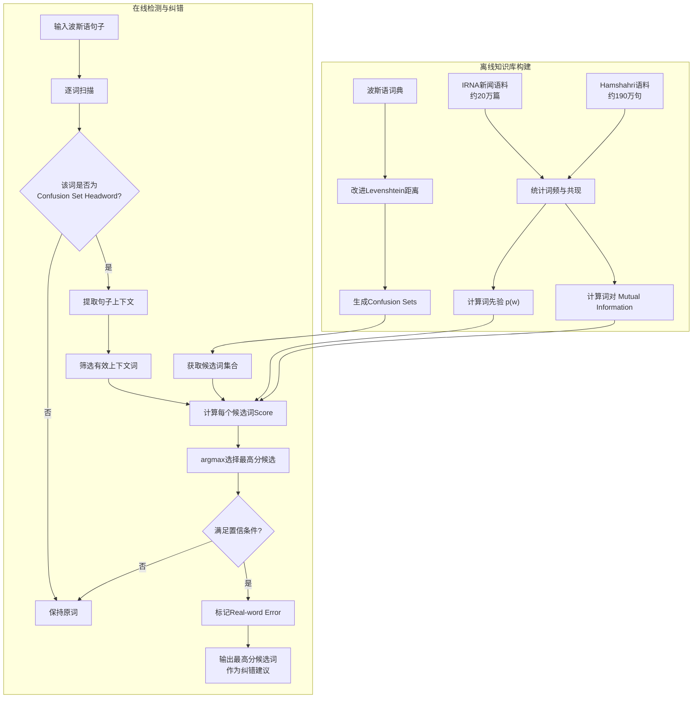

# The First Persian Context Sensitive Spell Checker 
**《首个波斯语上下文敏感拼写检查器》**

> 论文核心关键词：**Context-Sensitive Spell Checking、Persian NLP、Real-word Error、Bayesian Framework、Mutual Information、Confusion Set**

该论文的目标不是检测普通的“字典外拼写错误”，而是解决更困难的 **real-word spelling error（真实词拼写错误）**：错误输入本身仍然是一个合法单词，因此传统“查字典式”拼写检查器无法发现它。作者声称这是首个面向波斯语的上下文敏感拼写检查方法。

---

## **作者信息**

| 作者 | 机构 | 身份/背景 | 领域大牛认定 |
|---|---|---|---|
| **Heshaam Faili** | University of Tehran，School of Electrical and Computer Engineering | 软件工程本科、硕士，Sharif University of Technology 人工智能博士；2008年加入德黑兰大学 AI & Robotics Group 并任 faculty。研究方向包括 Persian NLP、机器翻译、拼写检查、语言学习、分类与聚类 | **波斯语NLP领域的专业研究者**。从本文作者简介来看，没有 ACM/IEEE Fellow、院士等顶级荣誉信息，因此不宜称为“国际顶级大牛”，更适合定位为**波斯语NLP方向的学术研究人员** |
| **Mohammad Azadnia** | Iran Telecom Research Center，Information Technology Department | 1988年进入 Iran Telecommunication Research Center，历任 researcher / project manager；1999年起为 ITRC IT Department faculty；论文发表超过35篇，方向包括 NLP、IR、IS、IT Management | **资深科研/工程管理型研究者**，具有长期电信研究机构经历，但论文没有提供足够依据将其认定为国际NLP领域顶级学者 |

作者履历信息来自论文最后一页的作者简介。其中 Faili 的研究路线明显偏向**统计NLP与机器学习方法**，而 Azadnia 更具有**电信研究院+信息技术应用研究**背景。

## **团队相关信息：**

这篇论文并不是典型的“国际顶级NLP实验室+大规模博士生团队”工作，而是一项由**德黑兰大学 + 伊朗电信研究中心（ITRC）**合作完成的波斯语NLP应用研究。

团队结构比较有特点：

- **Heshaam Faili**负责的学术方向与算法设计高度匹配，包括 NLP、拼写纠错、机器学习和概率方法；
- **Mohammad Azadnia**则具有长期 ITRC 项目研究和工程管理背景；
- 因而更像是一个**高校算法研究 + 国家研究机构应用场景**结合的团队。

从论文的技术路线也能看出来，它并不是追求复杂模型，而是解决当时非常现实的一个资源稀缺语言问题：

> **如何仅依赖波斯语词典、大规模新闻语料、贝叶斯统计和互信息，做出一个能识别“合法单词但上下文错误”的拼写检查器。**

从2010年的时间背景看，这种研究定位是比较合理的。作者也明确表示，据他们所知，当时尚没有已发表的**波斯语 context-sensitive error checking system**。

---

## **论文发表时间**

| 项目 | 具体日期 | 来源/说明 |
|---|---|---|
| 投稿 / Received | **2009年2月28日** | 论文首页 |
| 接收 / Accepted | **2010年7月28日** | 论文首页 |
| 正式发表 | **2010年7月** | International Journal of Information & Communication Technology |
| 卷期 | **Volume 2, Number 2** | July 2010 |
| 页码 | **51–59** | 共9页 |
| 文章类型 | **Research Note (IT Section)** | 并非预印本 |

因此，这是一篇**已经正式发表的期刊论文**，不是“投稿中”“双盲审稿中”或者预印本状态。

需要注意：论文PDF本身没有提供 Google Scholar / Semantic Scholar 当前引用量，因此这里不对今天的被引次数进行猜测。

---

## **摘要**

本文提出一种面向**波斯语（Persian）真实词拼写错误**的上下文敏感拼写检查方法。

传统拼写检查器通常通过词典判断一个单词是否合法，因此只能有效发现：

> `hte → the`

这类字典中不存在的错误。

但对于：

> `their → there`

这种错误，错误词本身仍然是合法单词，普通拼写检查器便无法发现。

本文的解决思路是：

**首先为每个波斯语单词构造一个 confusion set（混淆词集合），然后利用目标词与句子上下文词之间的 Mutual Information（互信息），结合词本身出现的先验概率，在贝叶斯框架下对所有候选词进行打分，最终选择上下文中得分最高的词。**

实验使用 IRNA 和 Hamshahri 新闻语料计算词频和词间互信息，并通过人工注入真实词错误进行评估。论文报告：

- 错误检测 **Precision ≈ 80.5%**
- 错误检测 **Recall ≈ 87%**
- 综合F-measure大约达到 **80%左右**

说明即使不依赖复杂语法分析，仅依靠**大规模语料统计 + confusion set + 上下文相关性**，也已经可以较有效地识别波斯语真实词错误。

---

# 一、这篇论文讲了一个什么样的故事？

这篇论文讲的故事其实非常经典。

### 第一幕：传统拼写检查器存在一个根本缺陷

普通拼写检查器基本做的是：

> **这个词在不在词典里？**

如果不存在，就认为拼错了。

例如：

> `roozn` → ❌ 字典中不存在

这种问题容易发现。

但是现实中还有一类错误：

> 用户本来想输入 A，  
> 却输入成了另一个完全合法的单词 B。

此时：

- B存在于词典；
- B语法上甚至可能合法；
- 但放在当前句子里却不合理。

这就是：

**Real-word spelling error。**

论文特别指出，这种错误通常无法通过传统 spell checker 直接发现。

---

### 第二幕：把拼写纠错重新定义成“候选词选择问题”

作者换了一个视角。

与其问：

> “这个词是不是错误？”

不如问：

> **“在当前上下文中，哪个候选词最合理？”**

于是首先为每个词建立一个：

> **Confusion Set**

例如概念上：

$$
S(w)=\{w,w_1,w_2,w_3,\dots\}
$$

里面放：

- 原词；
- 与它编辑距离很近的词；
- 发音容易混淆的词；
- 书写形态相近的词；
- 键盘位置容易误输入的词。

论文通过改进的 **Levenshtein Distance** 构造波斯语 confusion sets，同时考虑波斯文字特有的：

- 同音字符；
- 形似字符；
- 键盘邻近字符；
- 波斯语形态变化。

最终建立了大规模候选空间。论文表1报告约 **1,165,535 个 confusion sets**，平均每个集合约 **8.7 个成员**。

---

### 第三幕：真正决定答案的是“上下文”

假设：

> 当前观察到词 $w_i$

它可能属于：

$$
\{w_i,w_{i1},w_{i2},...,w_{in}\}
$$

真正需要解决的问题变成：

$$
\boxed{
W=\arg\max_w P(w|\text{Context})
}
$$

也就是：

> 在当前句子上下文条件下，哪一个候选词出现的概率最大？

于是问题从：

**拼写检测**

转化成：

**概率排序 / contextual ranking。** 

---

### 第四幕：但是直接算条件概率太难

如果直接计算：

$$
P(w|c_{-k},...,c_{-1},c_1,...,c_k)
$$

会遇到严重的：

> **Data Sparsity**

因为很多完整上下文组合，在训练语料里可能根本没有出现过。

作者于是进行近似：

> 不直接学习整个上下文，而分别计算候选词 $w$ 与各上下文词 $c_j$ 的关联强度。

这个关联强度就是： **Mutual Information**

最终：

> **候选词自身有多常见 + 候选词与周围词有多相关**

两部分共同决定答案。

这就是全文最核心的技术思想。

---

# 二、本文的核心思想和创新点

## 1. 核心思想

一句话总结：

> **将波斯语上下文拼写纠错建模为“confusion set中的候选词贝叶斯排序问题”，利用 Mutual Information 衡量候选词与句子上下文之间的语义/统计关联。**

整体逻辑可以写成：

$$
\text{输入词}
\rightarrow
\text{Confusion Set}
\rightarrow
\text{上下文}
\rightarrow
MI
\rightarrow
Bayesian Score
\rightarrow
\arg\max
\rightarrow
\text{纠错结果}
$$

从机器学习视角来看，它实际上已经形成了后来很多纠错系统都会使用的两阶段范式：

### Candidate Generation

先缩小搜索空间：

$$
Vocabulary\rightarrow ConfusionSet(w)
$$

### Candidate Ranking

再利用上下文：

$$
w^*=\arg\max Score(w)
$$

---

## 2. 关键创新点

### **创新点1：首个面向波斯语的 Context-Sensitive Spell Checker**

作者明确指出，据其所知，当时还没有公开发表的**波斯语上下文敏感错误检查系统**。

因此论文最大的价值首先是：

> **将成熟于英语的 real-word error correction 问题系统性迁移到 Persian NLP。** 

---

### **创新点2：面向波斯语特点设计 Confusion Set**

作者没有机械使用标准Levenshtein distance。

而是考虑：

- 相同/近似发音字符；
- 相似书写形式；
- 标准键盘相邻字符；
- 波斯语大量屈折变化。

使候选生成更符合真实波斯语输入错误。

---

### **创新点3：用 Mutual Information 替代高维上下文概率**

直接估计：

$$
P(C|w)
$$

非常稀疏。

于是作者将问题分解为：

$$
MI(c_j,w)
$$

即：

> 每一个上下文词分别能为候选词提供多少区分信息。

这实际上是一种非常典型的：

**“用低阶统计关系替代高维联合概率”**

思想。

---

### **创新点4：同时考虑上下文相关性和词频先验**

系统不是单纯选择与上下文最相关的词，而是：

$$
Score(w)=
\text{Context Association}
+
\text{Word Prior}
$$

因此一个极罕见词即使与一个上下文词偶然共现，也不会轻易击败更加常见、更加稳定的候选词。

---

### **创新点5：加入 Confidence Level 控制误报**

作者意识到：

> 自动纠错中，“错改一个本来正确的词”往往比“漏掉一个错误”更危险。

所以引入置信参数 $d$，要求当前候选不仅获胜，而且必须**明显优于其他候选**。

这形成：

> False Positive ↔ Error Detection

之间可调节的权衡。

---

# 三、方法是怎么实现的？(How does it work?)

## 1. 架构

本文并没有给出完整系统架构图，因此下面这张图是**根据论文 Section II–IV 的算法流程重新整理绘制的，不是论文原图**。

**图注**：根据论文第53–57页关于 **Confusion Sets、Persian Real-word Error Correction、Mutual Information、Evaluation** 的描述综合重构。

---

## 2. 关键算法

整个算法可以压缩成五步。

### Step 1：构建 Confusion Set

对于每一个波斯语词：

$$
w_i
$$

建立：

$$
S_i=\{w_i,w_{i1},w_{i2},...,w_{in}\}
$$

使用改进的Levenshtein距离寻找容易混淆的合法词。

论文限制：

- 最大编辑距离较小；
- 每个 confusion set 最大候选数设置为 **40**。

目的就是：

> 不在整个波斯语词典里搜索，而只处理“小范围疑似词”。

---

### Step 2：获取上下文

对于目标词：

$$
w_i
$$

考察：

$$
c_{-k},...,c_{-1},c_1,...,c_k
$$

论文实验中实际上将窗口设置到足以覆盖：

> **整个句子。**

因此基本属于：

**Sentence-level Context。** 

---

### Step 3：过滤无区分能力的上下文词

并不是所有上下文词都有用。

例如：

> the / is / of

这种高频词可能与所有候选词都大量共现，区分度很低。

论文通过：

- minimum occurrence threshold；
- Mutual Information threshold；
- stop-word pruning；
- 类似chi-square association significance的判断；

过滤不可靠上下文词。

---

### Step 4：给候选词打分

对于每一个候选词 $w$：

$$
Score(w)
=
\sum MI(c_j,w)+(2k+1)\log P(w)
$$

也就是：

> **上下文关联性 + 单词自身先验概率。**

然后：

$$
w^*=\arg\max_w Score(w)
$$

---

### Step 5：加入 Confidence Level

默认情况下：

$$
Score(w)>Score(x)
$$

就可以选择 $w$。

作者进一步加入参数：

$$
d>1
$$

要求：

$$
Score(w)>d\times Score(x)
$$

也就是说：

> 新候选必须比其他候选“明显更好”，系统才敢纠错。

$d$ 越大：

- 系统越保守；
- False Alarm越少；
- 但漏检越严重。

---

## 3. 关键公式

### **公式1：Bayesian Candidate Selection**

$$
\boxed{
W=\arg\max_w
P(w|c_{-k},...,c_{-1},c_1,...,c_k)
}
$$

核心含义：

> 找到给定上下文条件下概率最大的候选词。

---

### **公式2：贝叶斯分解**

根据Bayes：

$$
P(w|C)
\propto
P(C|w)P(w)
$$

其中：

- $P(w)$：候选词先验概率；
- $P(C|w)$：观察到该候选词时出现这些上下文的概率。

---

### **公式3：词频先验**

论文采用MLE：

$$
\boxed{
P(w)=
\frac{
\text{Corpus中包含 }w\text{ 的次数}
}{
\text{Corpus句子总数}
}
}
$$

高频词拥有更高先验概率。

---

### **公式4：Mutual Information**

两个词 $w_1,w_2$：

$$
\boxed{
MI(w_1,w_2)
=
\log
\frac{P(w_1,w_2)}
{P(w_1)P(w_2)}
}
$$

论文进一步利用计数实现：

$$
MI(w,c)
=
\log
\frac{
N\cdot N(w,c)
}{
N(w)N(c)
}
$$

直观解释：

如果：

> $w$ 和 $c$ 一起出现的次数远远高于独立随机情况下应该出现的次数，

那么：

$$
MI(w,c)\uparrow
$$

说明两个词上下文关联很强。

---

### **公式5：最终评分函数**

论文最终得到：

$$
\boxed{
Score(w)
=
\sum_{j}MI(c_j,w)
+
(2k+1)\log P(w)
}
$$

这基本就是全文最重要的公式。

可以直接理解成：

$$
\boxed{
Score=
上下文匹配程度
+
词本身常见程度
}
$$

---

### **公式6：Fβ**

为了权衡不同评价目标，作者定义：

$$
\boxed{
F_\beta=
\frac{
(1+\beta^2)(Precision\cdot Recall)
}{
\beta^2 Precision+Recall
}
}
$$

Figure 1进一步展示：

> 不同 $\beta$ 下可以选择不同 confidence level $d$，从而在漏检和误报之间取得不同平衡。

---

# 四、实验效果 (Experimental Results)

## 1. 实验设置

### **训练语料**

论文主要使用两个大型波斯语新闻资源。

#### IRNA

Islamic Republic News Agency：

> 约 **200,000篇文章**

用于估计：

- 单词出现频率；
- 单词共现；
- Mutual Information。

#### Hamshahri2

论文描述该数据集总规模约：

> **1.4 GB新闻文本**

整个集合跨度约1996–2007年；其中作者选取了1996–2002年部分，大约：

> **1,900,000个句子**

用于训练统计信息。

---

### **测试数据**

作者从未参与训练的IRNA文章中：

- 抽取 **100个句子**；
- 每句少于 **15个单词**；
- 随机选择一个词；
- 用该词 confusion set 中另一个合法词替换；
- 因此每个测试句子最多制造 **1个 real-word error**。

例如：

$$
正确句子
\rightarrow
随机替换为另一个合法词
\rightarrow
错误句子
$$

这是一个典型的：

> **Synthetic Real-word Error Benchmark**

---

### **两类评价**

论文区分：

#### Soundness

输入**没有错误的句子**：

看系统会不会把正确词误报成错误。

#### Completeness

输入**人工注入错误的句子**：

看系统能否：

1. 发现错误；
2. 给出正确建议。

---

## 2. 主要结果

论文 Table 2 给出的结果非常直观。

### Soundness Evaluation

| 结果 | 比例 |
|---|---:|
| 正确接受，不误报 | **79%** |
| 错误Flag | **21%** |

也就是说：

> 默认设置下，大约 **21%的正确目标词会被系统误报**。

---

### Completeness Evaluation

| 结果 | 比例 |
|---|---:|
| Flag + 正确纠正 | **79%** |
| Flag但建议错误 | **8%** |
| 完全忽略错误 | **13%** |

因此100个真实词错误中：

- 79个发现且改对；
- 8个发现但改错；
- 13个没发现。

---

### 错误检测 Precision

检测出来的错误数：

$$
87+21=108
$$

真正正确检测：

$$
87
$$

因此：

$$
Precision=
\frac{87}{108}
=
\boxed{80.50\%}
$$

---

### Recall

100个错误中：

$$
87
$$

被检测出来：

$$
Recall=
\frac{87}{100}
=
\boxed{87\%}
$$

这两个数字是论文第57页直接给出的。

---

### **核心结论**

- **Real-word spelling error确实可以通过上下文统计发现，而不必仅依赖字典合法性。**
- 在100条人工错误实验中，系统能够检测约 **87%** 的错误。
- 其中约 **79%** 不仅检测出来，而且给出了正确替换词。
- 错误检测 Precision 为约 **80.5%**。
- 论文整体F-measure表现约为 **80%左右**，与摘要中的描述一致。
- 对2010年的低资源波斯语NLP环境而言，证明了 **Bayesian + MI + Confusion Set** 是可行方案。

---

## 3. 消融实验与关键发现

严格来说，本文**没有今天机器学习论文意义上的完整消融实验**，例如：

> 去掉MI / 去掉prior / 去掉stemming / 换confusion set

这种模块级ablation。

它真正做的是： **Confidence-Level Sensitivity Analysis**。即改变 $d$。

---

### d = 1

比较激进：

- 正确句子接受率：**79%**
- 错误句正确纠正：**79%**

---

### d = 2

系统变保守：

- 正确句子接受率：**86%**
- 错误句正确纠正：**70%**

---

### d = 10

更加保守：

- 正确句子接受率：**90%**
- 错误正确纠正：仅 **40%**

---

### d = 100

极端保守：

- 正确词接受：**99%**
- False Flag仅约 **1%**
- 但真实错误正确处理仅剩 **18%**
- **82%** 被忽略或给出错误建议。

---

### **关键发现**

这其实揭示了一个非常重要的工程权衡：

$$
\boxed{
减少误报
\Longleftrightarrow
增加漏报
}
$$

也就是：

> **你希望系统“不乱改”，它就必须更加保守；但越保守，就越容易漏掉真正的错误。**

Confidence level：

$$
d\uparrow
$$

意味着：

$$
False Positive\downarrow
$$

但：

$$
Recall/Correction\ Rate\downarrow
$$

---

### Figure 1 的意义

论文第58页 Figure 1 并不是简单展示“哪个参数最好”，而是：

> 不同应用场景可以通过改变 $F_\beta$ 中的 $\beta$，选择不同的confidence level。

例如：

- 自动文本出版 → 害怕误改 → 更保守；
- 用户交互式拼写建议 → 可以多提示一些候选 → 更激进。

这已经带有一定的：**Risk-sensitive Decision**思想。

---

### **实验部分总结**

本文通过 IRNA + Hamshahri 波斯语新闻语料验证：

> **仅利用候选词集合、词频先验以及上下文词之间的Mutual Information，就能够检测传统字典式spell checker无法发现的real-word spelling errors。**

在人工单错误场景中实现约：

$$
Precision=80.5\%,\qquad Recall=87\%
$$

同时实验进一步说明：

> **误报率和漏检率之间不存在免费的午餐，可以通过 confidence parameter $d$ 显式控制这一权衡。**

不过必须注意，该结论建立在**100条、短句、单错误、人工注入错误**的实验环境上，因此不能直接解释成“真实世界波斯语文本纠错达到80%以上”。

---

# 五、优点与局限性

## ✅ 1. 优点

### **① 问题选择非常有价值**

作者没有继续解决普通 typo，而是抓住真正困难的问题：

> **“错误词也是合法词怎么办？”**

这正是 context-sensitive spell checking 的核心。

---

### **② 方法非常清晰**

全文其实就是一个非常干净的Pipeline：

$$
Candidate\ Generation
+
Context\ Modeling
+
Candidate\ Ranking
$$

没有大量复杂规则，逻辑非常容易解释。

---

### **③ 很好地利用了低资源语言能够获得的数据**

2010年的波斯语没有今天丰富的：

- BERT；
- mBERT；
- LLM；
- 大规模人工纠错语料。

但新闻文本很多。

因此作者选择：

> **Unlabeled Corpus → Word Co-occurrence → Mutual Information**

这是非常符合资源条件的设计。

---

### **④ 方法可解释性强**

如果系统选择：

$$
w_2>w_1
$$

基本可以追溯到：

- 哪些上下文词支持 $w_2$；
- 两者MI是多少；
- 两个词先验概率是多少。

比现代深度模型的黑盒判定更加容易解释。

---

### **⑤ 明确认识到“置信度”问题**

不是简单地：

> 最大值就是答案。

而是引入：

$$
Score(w)>dScore(x)
$$

这意味着作者已经意识到：

> **分类正确与“是否值得自动采取行动”是两个问题。**

这在实际自动纠错系统中非常重要。

---

## ⚠️ 2. 局限性（研究边界与待解问题）

### **① 最大问题：测试集太小**

只有：

$$
\boxed{100\text{ sentences}}
$$

这对于评价一个通用拼写纠错系统明显不足。

---

### **② 错误是人工随机制造的**

错误不是：

> 真实用户真的输入错的数据，

而是：

> 从 confusion set 里随机选择一个词替换。

因此训练/测试分布和真实人类错误分布之间可能存在巨大差异。

---

### **③ 假设一句话最多只有一个错误**

这是非常强的假设。

作者自己在Conclusion中特别承认：

> 当一句话里面存在多个 real-word errors 时，检测与纠错质量可能“dramatically”下降。

原因非常有意思。

假设：$w_1$ 和 $w_2$ 都输入错了。但两个错误词之间恰好具有很强的Mutual Information，那么：

$$
MI(w_1,w_2)
$$

反而会互相“证明”对方是正确的。作者在论文最后给出了这样的反例。

---

### **④ 上下文被简化成词对关系**

作者主要建模：

$$
MI(w,c_j)
$$

而没有真正建模：

$$
P(w|c_1,c_2,\dots,c_n)
$$

因此无法充分利用：

- 词序；
- 长距离依赖；
- 语法结构；
- 句法关系；
- 组合语义。

例如：

> A loves B

和：

> B loves A

词集合基本一样，但语义不同。

MI-based bag-of-context对此处理能力有限。

---

### **⑤ 强依赖预定义 Confusion Sets**

系统只能从：

$$
S(w)
$$

里寻找替代词。

如果真正答案：

$$
w^*\notin S(w)
$$

那么无论上下文模型多么准确，都不可能纠正成功。

这实际上形成了一个典型上限：

$$
\boxed{
Final Accuracy
\leq
Candidate Recall
}
$$

---

### **⑥ Data Sparsity仍然严重**

作者之所以设计：

- threshold；
- stemming；
- MI filtering；
- stop-word pruning；

本身就说明：

> 波斯语词形丰富导致词频被分散，pairwise statistics存在严重数据稀疏。

---

### **⑦ 没有真正的模块消融**

论文没有回答：

- 不使用MI会怎样？
- 只使用 unigram prior 会怎样？
- 不stemming会怎样？
- 普通Levenshtein vs Persian-aware Levenshtein 差多少？
- 只用IRNA vs IRNA+Hamshahri差多少？

因此我们知道：

> **整个系统有效**

但无法准确知道：

> **究竟哪个组件贡献最大。**

---

### **⑧ 以今天的视角，语言模型能力明显不足**

这是时代限制而不是作者本身的问题。

今天完全可以直接建模：

$$
P(w_i|w_1,\dots,w_{i-1},w_{i+1},...,w_n)
$$

通过：

- BERT；
- masked language model；
- Transformer；
- LLM；

进行上下文判断。

因此本文的方法今天更适合被看作：

> **现代Contextual Spelling Correction的经典统计学前驱。**

---

# 六、其他

## 第一性原理

这篇论文如果从第一性原理拆开，其实只有三个问题。

---

### **第一问：为什么字典不够？**

因为：

$$
\boxed{
合法词\neq正确词
}
$$

一个单词是否正确并不是这个单词自身的属性，而是：

$$
Correctness=f(word,context)
$$

因此：

> **拼写纠错本质上是条件概率问题，而不是词典查询问题。**

---

### **第二问：候选空间为什么必须先缩小？**

假设波斯语词表大小：

$$
|V|\approx10^6
$$

对每一个位置都计算：

$$
\arg\max_{w\in V}P(w|C)
$$

代价巨大，而且绝大多数词根本不可能是输入错误。

因此先利用输入机制产生：

$$
S(w)\ll V
$$

再做排序。

所以一个好的纠错器天然应该拆成：

$$
\boxed{
Candidate Generation
+
Candidate Ranking
}
$$

这也是今天搜索、推荐、纠错、实体链接系统非常常见的设计模式。

---

### **第三问：什么才叫“上下文合理”？**

最基本原则：

如果：

$$
P(w,c)>P(w)P(c)
$$

说明：

> 两个词一起出现的概率高于随机独立情况下的预期。

那么：

$$
MI(w,c)>0
$$

说明上下文 $c$ 对判断 $w$ 有信息价值。

于是：

$$
\sum_c MI(w,c)
$$

可以被理解为：

> **整个句子的上下文一共给候选词 $w$ 投了多少“支持票”。**

再加入：

$$
\log P(w)
$$

相当于：

> “这个词自身平时到底有多常见？”

最终得到：

$$
\boxed{
Score(w)
=
Context\ Evidence
+
Prior
}
$$

从这个角度看，全文其实非常漂亮。

---

# 领域空白

这里建议分成“**2010年的领域空白**”和“**今天继续做的空白**”。

## **1. 论文当时填补的空白**

作者明确提出：

> 当时尚未发现已发表的 Persian context-sensitive error checking system。

也就是说此前波斯语spell checking更多解决的是：

$$
Non-word Error
$$

而本文开始系统解决：

$$
Real-word Error
$$

因此它真正填补的是：

$$
\boxed{
Persian\ Traditional\ Spell\ Checking
\rightarrow
Persian\ Context-sensitive\ Spell\ Checking
}
$$

---

## **2. 从本文自身自然暴露出来的研究空白**

### **空白1：真实错误数据集**

本文人工注入错误。

更重要的问题应该是：

> 建立大规模、真实用户产生的 Persian spelling error corpus。

并统计：

$$
P(\text{error }x|\text{intended word }w)
$$

也就是：

**真实人类错误分布。**

---

### **空白2：多个错误联合纠错**

本文核心假设：

$$
\leq1\ error/sentence
$$

但真实世界显然不是这样。

进一步应解决：

$$
\arg\max_{W_1,...,W_n}
P(W_1,...,W_n|Sentence)
$$

而不是逐个词独立处理。

---

### **空白3：从Pairwise MI走向真正的上下文表示**

本文：

$$
Context\approx
\sum MI(c_j,w)
$$

下一步自然就是：

$$
Context\rightarrow
Learned\ Representation
$$

从今天看就是：

> Embedding → BiLSTM → BERT → Transformer / LLM。

---

### **空白4：Morphology-aware Correction**

波斯语具有丰富的形态变化。

论文通过 stemming 缓解问题，但更完整的方案应该联合：

$$
Stem
+
Affix
+
Morphology
+
Context
$$

而不是简单把多个表面形式压缩到stem。

---

### **空白5：Candidate Generator 与 Context Model 联合学习**

本文是完全分开的：

$$
EditDistance
\rightarrow
ConfusionSet
$$

然后：

$$
MI
\rightarrow
Ranking
$$

更先进的方向是：

$$
\boxed{
P(correct|typed,context)
}
$$

把：

- 键盘错误概率；
- 字符相似度；
- 发音；
- 词频；
- 上下文；

统一到一个模型中。

这就是典型：$Noisy\ Channel$ 思想。

---

### **空白6：置信度校准**

本文已经引入：$ d $，但只是手工阈值。

进一步值得研究：

$$
P(\text{correction is correct})
$$

真正做到：

- 低置信度 → 只提示；
- 中置信度 → 给Top-K；
- 高置信度 → 自动纠正。

这实际上就是现代系统中的：**Confidence Calibration / Selective Prediction。**

---

# 一句话评价这篇论文

如果把它放回 **2010年**：

> **这是一篇思路很干净的低资源语言NLP工作：首次系统地把波斯语real-word spelling correction转化为“confusion-set候选生成 + 贝叶斯上下文排序”问题，并用Mutual Information在缺少大规模标注语料的情况下实现约80%左右的纠错表现。**

如果站在今天看：

> 它真正值得学习的不是“MI算法本身”，而是它背后的三个经典思想——**Candidate Generation、Contextual Ranking、Confidence-aware Decision**。这三个思想直到今天依然存在于拼写纠错、搜索、推荐、实体链接乃至LLM系统中。

---

> 本文由ChatGPT AI 生成