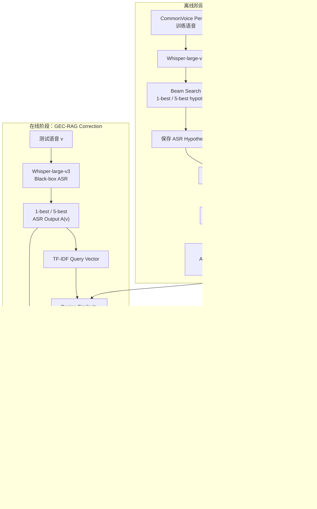
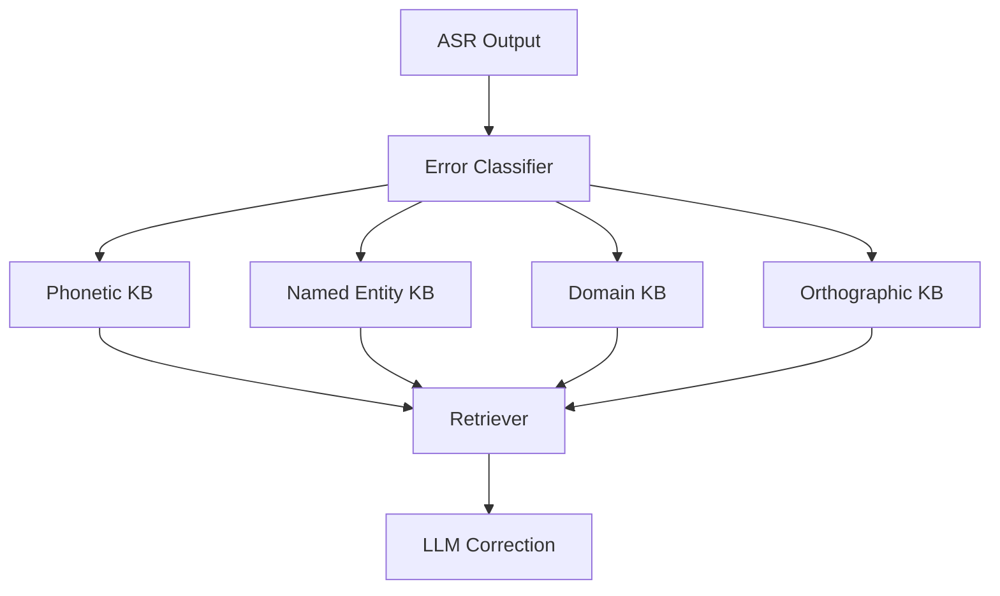

# GEC-RAG: Improving Generative Error Correction via Retrieval-Augmented Generation for Automatic Speech Recognition Systems  
### 中文：GEC-RAG：利用检索增强生成改进自动语音识别系统的生成式错误纠正

---

## **作者信息**

论文共有 7 位作者，主要来自伊朗 **Sharif University of Technology（谢里夫理工大学）电气工程系**，Fatemeh Rajabi 来自 **Amirkabir University of Technology（阿米尔卡比尔理工大学）数学与计算机科学系**；Sajjad Amini 为通讯作者。

| 作者 | 机构 | 身份/背景 | 领域大牛认定 |
|---|---|---|---|
| **Amin Robatian** | Sharif University of Technology，Electrical Engineering | 第一作者；论文未注明具体职称 | 暂无足够公开信息支持“大牛”认定，更可能属于团队中的青年研究者 |
| **Mohammad Hajipour** | Sharif University of Technology，Electrical Engineering | 共同作者 | 暂无足够公开证据认定为领域大牛 |
| **Mohammad Reza Peyghan** | Sharif University of Technology，Electrical Engineering | 从 GEC-RAG 到后续 ASR Refinement Survey 均参与研究，研究方向明显集中于 ASR 后处理 | 青年研究者/该方向持续研究者，尚非资深大牛  |
| **Fatemeh Rajabi** | Amirkabir University of Technology，Mathematics and Computer Science | 跨校合作作者；后续继续参与 ASR Refinement Survey | 青年研究者，暂无“大牛”级证据  |
| **Sajjad Amini*** | Sharif University of Technology | **通讯作者、Faculty Member**；机器学习、模式识别、鲁棒 ML 等方向研究者 | 属于**活跃的青年/中生代 PI**，已有稳定研究产出，但目前不属于公认的国际顶级资深大牛层级  |
| **Shahrokh Ghaemmaghami** | Sharif University of Technology | **资深教授，信号处理研究者**；长期从事 speech / signal processing / ML | 团队中资历最深。公开资料显示其为 **IEEE Senior Member**、Sharif 信号处理教授，并长期领导相关项目；可认为是**资深领域专家**，但没有足够依据把他归为 IEEE Fellow/ACM Fellow 级“全球顶级大牛”  |
| **Iman Gholampour** | Sharif University of Technology / Electronics Research Institute | 长期从事 signal processing、ML、图像/模式识别研究 | 有较长期研究积累，但公开信息不足以认定为 Fellow 级大牛  |

## **团队相关信息：**

这篇文章并不是来自传统意义上“LLM 顶级实验室”的工作，而更像是一个**Sharif University of Technology 信号处理 / 机器学习团队向 LLM+Speech 交叉方向延伸的研究**。

团队结构比较清晰：

> **资深 Signal Processing 教授 Shahrokh Ghaemmaghami + 青年 PI Sajjad Amini + 多名年轻研究者**。

其中，Ghaemmaghami 在信号处理、Speech Processing 方向已有长期积累；Amini 则更偏现代 Machine Learning / Robust ML。论文随后又有多位相同作者继续发表 **A Survey on Non-Intrusive ASR Refinement**，说明 GEC-RAG 并不是一次性的“套 RAG”工作，而是团队正在形成的 **Non-Intrusive ASR Refinement / LLM-based ASR Correction** 研究线。

因此更准确的评价是：

**这是一个“传统 Speech/Signal Processing + 新一代 LLM/RAG”交叉团队。团队存在资深学者坐镇，但本文自身更接近一篇结构简单、idea 清晰、实验效果很强的探索性工作，而不是顶级实验室提出的大规模基础模型方法。**

---

## **论文发表时间**

| 项目 | 具体日期 | 来源/说明 |
|---|---|---|
| arXiv 首次提交 | **2025 年 1 月 18 日** | arXiv:2501.10734v1；PDF 首页明确标注 *18 Jan 2025*  |
| arXiv 分类 | eess.AS / Speech & Audio Processing 相关 | arXiv 页面 |
| 当前公开状态 | **Preprint** | 截至目前公开检索仍主要以 arXiv preprint 形式收录，J-GLOBAL 也标记为 Preprint  |
| 正式会议/期刊 | **目前未检索到明确的正式发表 venue** | 因而不应把它描述成已正式录用的会议/期刊论文 |
| 学术影响 | 已开始获得后续引用 | Semantic Scholar 当前检索结果中的 GEC-RAG 条目显示约 **9 次引用**；该数字会随数据库更新变化  |

因此，这篇文章属于：

> **2025 年 1 月公开的 arXiv 工作，截至 2026 年仍主要以 preprint 形式传播。**

不是顶会论文，也不能把实验结果等同于经过严格 peer review 后的定论。

---

## **摘要**

本文研究的是一个非常实际的问题：

**ASR 已经把语音识别成文字了，但文字里面有错；如果 ASR 本身是黑盒 API，不能重新训练模型，怎么纠错？**

作者提出 **GEC-RAG（Generative Error Correction via Retrieval-Augmented Generation）**。

其核心做法不是修改 Whisper，也不是 fine-tune GPT，而是建立一个：

> **“ASR 犯错案例库”。**

知识库中保存：

$$
\text{ASR错误转写} \longleftrightarrow \text{正确Ground Truth}
$$

对于一个新的 ASR 输出：

1. 使用 **TF-IDF** 将文本向量化；
2. 在历史错误案例库中寻找 lexical similarity 最大的样本；
3. 找出 Top-5；
4. 把这 5 个“ASR 输出 → 正确答案”的示例作为 **few-shot demonstrations**；
5. 再把当前 ASR 输出交给 **GPT-4o**；
6. GPT-4o 根据历史错误模式完成纠错。

论文特别强调 ASR 可以完全看作 **black-box**，因此不需要修改或 fine-tune ASR。

实验采用 **Whisper-large-v3 + GPT-4o + CommonVoice-v19 Persian**。在扩大知识库以后，测试集 WER 最低从 Whisper baseline 的 **39.09 降至 6.84**。 

---

# 一、这篇论文讲了一个什么样的故事？

故事可以压缩成一句话：

> **与其让 GPT-4o 凭自己的语言知识“猜”ASR哪里错了，不如把同一个 ASR 过去犯过的类似错误找出来给它看。**

传统做法大致有两条路：

**第一条：重新训练/修改 ASR**

例如：

- LM fusion；
- rescoring；
- fine-tuning；
- 修改 decoder。

效果可能很好，但问题是：

> 商业 ASR API 通常是黑盒，你根本碰不到内部网络。

作者因此只考虑 **post-processing error correction**。

---

第二条：

## 直接让 GPT 改错

例如：

```text
ASR:
من امروز ...
     ↓
GPT-4o
     ↓
Corrected transcription
```

问题在于：

### GPT 懂波斯语，但它不知道 Whisper “习惯怎么犯错”。

例如某些：

- 发音相似词；
- 拼写相似词；
- 高频混淆；
- 特定 accent；
- 特定 domain vocabulary；

可能是某个 ASR **系统性的错误模式**。

于是作者问了一个很关键的问题：

> **能不能把历史上的“ASR错误 → 正确答案”直接当成一种外部记忆？**

于是得到：

$$
\boxed{\text{ASR Error Memory} + \text{RAG} + \text{LLM}}
$$

也就是 GEC-RAG。

论文自己总结的三点贡献也是：

1. 提出一种完全位于 ASR 外部的 retrieval-based correction；
2. 证明 GPT-4o ICL 可以有效纠正 Persian ASR；
3. 证明该方法可以明显降低 WER，并具有潜在 domain adaptation 价值。

---

# 二、本文的核心思想和创新点

## 1. 核心思想

这篇论文最值得记住的并不是“RAG”。

而是：

> **RAG 检索的不是知识，而是“错误模式”。**

传统 RAG：

$$
Query \rightarrow Relevant\ Knowledge
$$

GEC-RAG：

$$
ASR\ Error
\rightarrow
Similar\ Historical\ ASR\ Errors
\rightarrow
Their\ Ground\ Truth
$$

知识库实际上是：

$$
K=
\{
(\hat y_1,y_1),
(\hat y_2,y_2),
...
\}
$$

其中：

- $\hat y_i$：ASR 输出；
- $y_i$：真实 transcription。

于是 GPT 得到的不是：

> “关于这个问题的背景知识”。

而是：

> **“这个 ASR 以前遇到类似输入时通常是怎么识别错的，以及正确答案是什么。”**

这实际上相当于给 LLM 提供了一个 **局部 ASR confusion model**。

---

## 2. 关键创新点

### 创新点 1：把 RAG 变成“ASR Error Pattern Retrieval”

现有很多 RAG 的知识库是：

- Wikipedia；
- documents；
- entity database；
- semantic chunks。

这里则是：

```text
ASR hypothesis
       +
Ground Truth
```

作者明确强调，知识库同时保存 **1-best / 5-best ASR hypotheses 与 Ground Truth**。

这是本文真正有价值的设计。

---

### 创新点 2：故意用 TF-IDF，而不是复杂 Embedding Retriever

这里非常有意思。

作者没有：

- BERT embedding；
- Sentence Transformer；
- dense retriever；
- neural retriever。

而使用：

$$
\boxed{\text{TF-IDF + Cosine Similarity}}
$$

原因是，他们需要找的不是：

> **semantic similarity**

而更强调：

> **lexical similarity**

因为 ASR 很多错误本身来自：

- phonetic similarity；
- orthographic similarity；
- lexical confusion。

论文明确指出使用 TF-IDF 的目的就是强调 **word-level features**，而不是上下文语义。

这是一个看似“很土”，实际上有明确任务动机的设计。

---

### 创新点 3：RAG + ICL，而不是 Fine-tuning

整个方案：

$$
\text{No ASR fine-tuning}
$$

而且：

$$
\text{No GPT fine-tuning}
$$

只通过：

$$
Retrieval \rightarrow Prompt \rightarrow ICL
$$

完成 adaptation。

因此如果换专业领域：

```text
General Persian KB
        ↓
Medical Persian KB
```

理论上只需要替换知识库即可。

这也是论文认为其适合 black-box cloud ASR 的原因。

---

### 创新点 4：同时研究 1-best 和 5-best

作者没有只使用 Whisper 最终输出。

还使用 beam search 得到：$ N=5 $

个 hypothesis：

```text
Hypothesis 1
Hypothesis 2
Hypothesis 3
Hypothesis 4
Hypothesis 5
```

然后让 GPT 综合这些候选。

理论上相当于保留：

> **ASR decoding space 中更多的信息。**

论文采用 beam width = 5。

---

# 三、方法是怎么实现的？(How does it work?)

## 1. 架构

GEC-RAG 整体可以分为：

**离线知识库构建 + 在线检索纠错**。



**图注：** 根据论文 **Figure 1 的 GEC-RAG workflow、Table I 的 K-shot N-best prompt，以及 Methodology Section II** 综合绘制。论文将完整流程概括为四步：

1. Speech-to-Text；
2. Knowledge Base Creation；
3. Retrieval；
4. Generation。

---

## 2. 关键算法

### Step 1：Whisper 得到 ASR 输出

输入：

$$
v=\text{speech}
$$

Whisper：

$$
A(v)
$$

产生 transcription。

同时使用 beam search：

$$
beam\ width=5
$$

保留 N-best hypotheses。 

---

### Step 2：构造 Knowledge Base

对于训练集中的每个样本保存：

```text
ASR Prediction
        ↕
Ground Truth
```

例如：

```text
Whisper:
"xxx xxx"

Ground Truth:
"xxx xxx"
```

之后将 ASR transcription 转换为：

$$
TFIDF(\hat y_i)
$$

形成向量知识库。

---

### Step 3：检索

对于测试 ASR：

$$
q=A(v)
$$

计算：

$$
TFIDF(q)
$$

然后与所有知识库样本计算 cosine similarity：

$$
sim(q,d_i)
$$

选择：

$$
TopK=5
$$

最相似样本。

---

### Step 4：构造 Few-shot Prompt

Table I 是这篇论文非常关键的一张表。

Prompt 大致如下：

```text
System:
You are an ASR transcription error correction expert...

Example 1:
Predicted transcription:
    hypothesis 1
    ...
=> Correct transcription:
    Ground Truth 1

Example 2:
...

Example 5:
...

Query:
Predicted transcription:
    Test ASR Output

=> Correct transcription:
```

并强制模型：

> **只输出 corrected transcription，不给解释。**

论文 Table I 对 1-best 和 N-best 两种 prompt 均给出了模板。

---

### Step 5：GPT-4o Generation

检索得到的五个训练样本：

$$
\{e_1,e_2,\dots,e_5\}
$$

作为 few-shot examples。

然后：

```text
5 retrieved examples
          +
Target ASR hypothesis
          ↓
       GPT-4o
          ↓
Corrected transcription
```

作者认为这使 GPT 能直接利用训练数据中的 ASR error pattern。

---

## 3. 关键公式

### ① 论文的核心公式

作者将完整系统写成：

$$
\boxed{
t=G(A(v),R(A(v),K))
}
$$

其中：

- $v$：语音；
- $A$：ASR；
- $A(v)$：ASR transcription；
- $K$：knowledge base；
- $R$：Retriever；
- $G$：Generator；
- $t$：最终 corrected transcription。

这实际上完整概括了论文：

$$
Speech
\xrightarrow{A}
ASR\ Output
\xrightarrow{R}
Similar\ Error\ Examples
\xrightarrow{G}
Correction
$$

---

### ② TF-IDF

论文使用 TF-IDF，但没有进一步展开其公式。其标准形式可以写作：

$$
TFIDF(w,d)
=
TF(w,d)
\cdot
\log\frac{N}{DF(w)}
$$

其意义是：

- 某词在一句话里频繁出现 → 权重大；
- 整个 corpus 到处出现 → 权重下降。

因此它偏向捕获：

$$
\boxed{lexical\ overlap}
$$

而不是深层 semantic similarity。

---

### ③ Cosine Similarity

标准计算方式：

$$
\cos(\mathbf q,\mathbf d)
=
\frac{
\mathbf q\cdot\mathbf d
}{
\|\mathbf q\|\|\mathbf d\|
}
$$

然后：

$$
R(q,K)
=
TopK_{d_i\in K}
\cos(q,d_i)
$$

这里：

$$
K=5
$$

---

### ④ WER

实验指标 Word Error Rate：

$$
\boxed{
WER=
\frac{S+D+I}{N}
}
$$

其中：

- $S$：Substitution；
- $D$：Deletion；
- $I$：Insertion；
- $N$：Ground Truth words。

因此：

> WER 越低越好。

---

# 四、实验效果 (Experimental Results)

## 1. 实验设置

### ASR

$$
\boxed{\text{Whisper-large-v3}}
$$

### Generator

$$
\boxed{\text{GPT-4o}}
$$

### Retriever

$$
\boxed{\text{TF-IDF + Cosine Similarity}}
$$

### Retrieval

$$
TopK=5
$$

### ASR candidates

- 1-best
- 5-best

### Dataset

$$
\boxed{\text{CommonVoice-v19}}
$$

重点测试：

$$
\boxed{\text{Persian}}
$$

训练集用于构造 knowledge base，validation 用于 prompt tuning / intermediate evaluation，test 用于最终 WER。

---

### Persian normalization

这一部分**非常重要**，不能忽略。

作者使用：

$$
\text{Hazm}
$$

处理：

- spacing；
- half-spacing；
- Unicode representation；
- English numerals → Persian numerals。

此外还自己构建了约：${10,000}$ 个词条的 dictionary，用于处理常见 typing error 和 alternative word representation。

---

## 2. 主要结果

### 实验一：Normalization

| 方法 | Dev WER ↓ | Test WER ↓ |
|---|---:|---:|
| Without Normalization | 45.31 | 86.93 |
| **With Normalization** | **25.67** | **39.09** |

论文结果表明：

- Dev 相对下降约 **43%**
- Test 相对下降约 **55%**


这说明：

> **Persian ASR 的评价对文本规范化极其敏感。**

所以本文后面的所有结果都建立在 normalization 后的 baseline：$25.67/39.09$之上。

---

### 实验二：GEC-RAG

Table III：

| 方法 | Dev WER ↓ | Test WER ↓ |
|---|---:|---:|
| ASR Baseline | 25.67 | 39.09 |
| 1-best Vanilla GPT-4o | 17.84 | 32.04 |
| **1-best GEC-RAG** | **16.28** | **24.29** |
| 5-best Vanilla GPT-4o | 15.46 | 26.26 |
| **5-best GEC-RAG** | **15.39** | **21.47** |


---

### 从结果可以看到三件事情

#### ① GPT-4o 本身就能纠错

Test：

$$
39.09\rightarrow32.04
$$

说明 Vanilla LLM 已经具备一定语言纠错能力。

---

#### ② RAG 明显继续提高性能

1-best：

$$
32.04
\rightarrow
24.29
$$

说明：

> 找到“过去类似的错误”比单纯让 GPT 猜更有效。

---

#### ③ N-best 很有帮助

最佳小知识库配置：

$$
5\text{-best GEC-RAG}
$$

Test：

$$
39.09\rightarrow21.47
$$

相对 baseline：

$$
\frac{39.09-21.47}{39.09}
\approx
45.1\%
$$

即：$约 45\%  Relative-WER-Reduction$ 与论文报告一致。

---

## 最强实验：把 Knowledge Base 扩大 10 倍

作者随后把 CommonVoice 的额外 Validated data 加入知识库：

- 排除 train/dev/test；
- downvote = 0；
- upvote ≥ 2。

最终：

$$
\boxed{\text{KB Size}\approx10\times}
$$


结果：

| 方法 | Dev WER ↓ | Test WER ↓ |
|---|---:|---:|
| 1-best GEC-RAG | 16.28 | 24.29 |
| **1-best Enlarged KB** | **8.20** | **6.84** |
| 5-best GEC-RAG | 15.39 | 21.47 |
| **5-best Enlarged KB** | **8.47** | **7.22** |


最强结果：

$$
\boxed{WER:39.09\rightarrow6.84}
$$

Relative WER Reduction：

$$
\frac{39.09-6.84}{39.09}
=
82.5\%
$$

也就是论文所说的：

$$
\boxed{\approx82\%\ WER\ reduction}
$$

作者在结论中也将 **up to 82%** 作为核心结果。

---

### 一个非常有意思的现象

扩大知识库后：

$$
1\text{-best}=6.84
$$

反而比：

$$
5\text{-best}=7.22
$$

稍好。

也就是说：

> **更多 N-best information 并不始终意味着更好的性能。**

作者没有深入分析这个现象。

可能原因包括：

- prompt information overload；
- 较差 hypotheses 引入噪声；
- retrieval 与 N-best 组合策略不够好。

但这部分属于**合理推测，不是论文实验验证的结论**。

---

### **核心结论**

- **Vanilla GPT-4o 本身能够显著纠正 ASR 错误。**
- **加入错误案例检索后，GEC-RAG 明显优于 Vanilla GPT-4o。**
- **小知识库情况下，5-best 比 1-best 更有效。**
- **Knowledge Base size 是极其关键的变量。**
- 知识库扩大约 10 倍以后，Test WER 最低由 **39.09 → 6.84**。
- 最佳实验对应约 **82.5% relative WER reduction**。
- 整个过程不需要修改 Whisper，也不需要 fine-tune GPT-4o。

---

## 3. 消融实验与关键发现

严格来说：

> **本文没有非常标准的 Ablation Study section。**

但是 Table II–IV 可以看成三个“准消融”。

---

### Ablation A：Normalization

$$
86.93
\rightarrow39.09
$$

这说明 normalization 本身贡献巨大。

因此评价论文时必须注意：

> **不能把所有 WER improvement 都归因于 RAG。**

---

### Ablation B：Vanilla LLM vs RAG

Test / 1-best：

$$
32.04
\rightarrow24.29
$$

说明 Retrieval 本身确实贡献了明显增益。

因此核心 hypothesis：

> **“ASR error examples 能提升 LLM correction”**

得到实验支持。

---

### Ablation C：Knowledge Base Size

Test / 1-best：

$$
24.29
\rightarrow6.84
$$

这甚至是比：

> Vanilla LLM → RAG

更大的变化。

这意味着本文一个非常重要、但作者没有充分展开的结论其实是：

$$
\boxed{
Retrieval\ Quality
\approx
Knowledge\ Base\ Coverage
}
$$

也就是说：

> GEC-RAG 的上限可能不主要由 GPT-4o 决定，而是由**能不能检索到一个足够类似的历史错误案例**决定。

---

### ⚠️ 一个值得注意的数值问题

论文正文写道，扩大 KB 后：

> Dev 相比 Vanilla GPT 减少约 44%，Test 减少约 66%。

但从 Table III 和 IV 直接重新计算，数字并不能完全对应“Vanilla GPT”。

例如 5-best：

$$
15.46 \rightarrow 8.47
$$

相对下降约：

$$
45.2\%
$$

而 Test：

$$
26.26\rightarrow7.22
$$

约为：

$$
72.5\%
$$

反而：

$$
21.47\rightarrow7.22
$$

恰好约：

$$
66.4\%
$$

因此论文中的 **44% / 66% 很可能实际是在和原始 GEC-RAG 做比较，而正文却写成了 Vanilla GPT**。

这是本文一个比较明显的 reporting inconsistency。

---

### **关键发现**

- **ASR error correction 并不一定需要训练一个新的 correction model。**
- **简单的 TF-IDF retrieval 就能提供极强的增益。**
- **对于 ASR 错误，lexical retrieval 未必比 semantic embedding retrieval 差。**
- **Knowledge Base Coverage 对性能影响非常大。**
- **N-best 有帮助，但并非越多越好。**
- **Persian normalization 对最终 WER 有巨大影响，评价此类工作时必须单独控制。**
- GEC-RAG 本质上证明了：**历史错误可以成为一种可检索的外部记忆。**

---

### **实验部分总结**

本文的实验结果相当亮眼。

在 CommonVoice Persian 上：

$$
\text{Whisper-large-v3}
+
\text{GPT-4o}
+
\text{TF-IDF RAG}
$$

可以将测试集：

$$
WER=39.09
$$

降低到：

$$
\boxed{6.84}
$$

即超过：

$$
\boxed{82\%}
$$

的 relative WER reduction。

但这篇论文更适合被理解为：

> **一个非常强的 proof-of-concept。**

因为它目前只系统测试了 Persian / CommonVoice，一个 proprietary LLM（GPT-4o），并且知识库扩大对结果的贡献极其巨大。

---

# 五. 优点与局限性

## ✅ 1.优点

### ① 方法极其简单

几乎没有复杂训练：

```text
Whisper
   +
TF-IDF
   +
Cosine Similarity
   +
GPT-4o
```

没有：

- Retriever training；
- LLM fine-tuning；
- ASR modification。

却获得很大的 WER improvement。

这是它最大的工程优势。

---

### ② 真正适合 Black-box ASR

对于：

- Google Speech API；
- Azure Speech；
- commercial ASR；
- closed-source Whisper service；

只要能够拿到 transcription，就可以在外部加：

$$
GEC-RAG
$$

符合实际部署场景。论文也明确将 black-box compatibility 作为设计动机。

---

### ③ Knowledge Base 可以成为 Domain Adapter

假如医院积累：

```text
ASR医疗错误 → 医疗Ground Truth
```

则不修改 ASR：

$$
General\ ASR
+
Medical\ KB
$$

理论上就可以形成：

$$
Medical\ ASR\ Adapter
$$

这比重新 fine-tune ASR 成本低得多。

---

### ④ 使用历史“错误”而不是普通语料

这是本文最值得借鉴的思想：

> 普通 RAG 储存的是“正确知识”。

本文：

> **储存“模型是怎么犯错的”。**

这种思想不仅能用于 ASR。

实际上也可以推广到：

- OCR correction；
- machine translation correction；
- code repair；
- spelling correction；
- OCR-form extraction；
- LLM hallucination correction。

---

### ⑤ 实验结果非常明显

尤其：

$$
39.09\rightarrow6.84
$$

幅度大到足以证明：

> **retrieving historical error patterns 这条路线值得继续研究。**

---

## ⚠️ 2.局限性（研究边界与待解问题）

### ① 只验证了 Persian

论文一直强调：

> low-resource languages

但真正系统实验主要是：

$$
\boxed{Persian}
$$

因此不能直接推导：

> 对 Arabic、Urdu、Hindi、Vietnamese、African languages 都有同样效果。

论文自己也将扩展到其他 low-resource languages 放在 future work。

---

### ② “Domain Adaptation”更多是推论，而不是完整实验

论文多次强调：

> adaptable to any domain

但并没有真正做：

```text
General
→ Medical

General
→ Legal

General
→ Finance
```

这种 cross-domain benchmark。

因此：

> **domain adaptation 是一个合理卖点，但还没有被充分实证。**

---

### ③ KB 依赖 Ground Truth

知识库要求：

$$
ASR\ Output + Ground\ Truth
$$

这意味着企业仍然需要：

- 人工 transcription；
- 标注数据；
- 高质量 reference。

所以它并不是：

> “完全无数据的 adaptation”。

准确说是：

> **无需重新训练模型，但需要历史标注案例。**

---

### ④ Knowledge Base 扩大后性能暴涨，但原因没有深入研究

这是全文最值得追问的问题之一：

$$
24.29\rightarrow6.84
$$

为什么？

论文只给出解释：

> 更大的 KB 能检索更相关样本。

但缺少：

- retrieval hit rate；
- lexical overlap statistics；
- nearest-neighbor distance；
- duplicate analysis；
- KB size curve；
- 1× / 2× / 5× / 10× scaling study。

所以：

> **我们知道“KB 越大效果越好”，但不知道 improvement 是以什么 scaling law 出现的。**

---

### ⑤ 缺少 Dense Retrieval baseline

论文使用 TF-IDF 很有道理。

但没有比较：

- BM25；
- Sentence-BERT；
- BGE；
- E5；
- phonetic embedding；
- hybrid retrieval。

因此尚不能证明：

$$
TFIDF > Semantic\ Retrieval
$$

只能证明：

$$
TFIDF\ works
$$

---

### ⑥ 缺少“真正的 phonetic retrieval”

作者的动机之一是 phonetic errors。

但 Retriever 实际上仍然：

$$
\boxed{text\ TF-IDF}
$$

没有使用：

- phoneme sequence；
- acoustic features；
- edit confusion；
- grapheme-to-phoneme；
- pronunciation distance。

因此 retrieval 仍然存在很大的优化空间。

---

### ⑦ 依赖 GPT-4o，复现性一般

Generator：

$$
GPT-4o
$$

是闭源 API。

因此存在：

- model version change；
- nondeterminism；
- API cost；
- prompt behavior drift。

论文也没有做：

```text
GPT-4o
vs
Llama
vs
Qwen
vs
Gemini
```

因此不能判断 GEC-RAG 的增益有多少依赖 GPT-4o 本身。

---

### ⑧ 缺少统计显著性和多次实验

文中主要报告：

$$
WER
$$

没有给：

- confidence interval；
- bootstrap significance test；
- repeated runs；
- variance。

因此从严格实验设计上看仍然偏初步。

---

### ⑨ Normalization 的贡献过大

Test：

$$
86.93
\rightarrow39.09
$$

仅 normalization 就下降了一半以上。

所以必须区分：

$$
\text{Text normalization gain}
$$

和：

$$
\text{LLM/RAG gain}
$$

否则容易产生“全是 RAG 带来的 90% improvement”这种错误解读。

---

### ⑩ 论文存在数值描述不一致

前面提到的：

> Enlarged KB vs Vanilla GPT 的 44% / 66%

和表格直接计算结果并不完全一致。

这反映出论文目前还是 preprint 水平，实验 reporting 尚需进一步打磨。

---

# 六.其他

## 第一性原理

如果从第一性原理理解，这篇文章其实不是一篇“RAG论文”。

它在解决的是：

$$
\boxed{\text{Noisy Channel Inference}}
$$

真实文本：

$$
x
$$

经过 ASR：

$$
x
\xrightarrow{\text{ASR channel}}
y
$$

我们看到的是错误文本：

$$
y
$$

目标是恢复：

$$
x
$$

---

传统 LLM correction 相当于：

$$
\hat x
=
\arg\max_x P(x|y)
$$

问题在于：

### LLM 很了解语言：

$$
P(x)
$$

但不了解这个特定 ASR 的错误机制：

$$
P(y|x)
$$

例如 Whisper 可能特别喜欢：

```text
A → B
C → D
E → F
```

GPT-4o 并不知道。

---

而 GEC-RAG 做的事情，本质上就是通过历史样本：

$$
(y_i,x_i)
$$

给 GPT 一个对：

$$
P(y|x)
$$

的**局部经验估计**。

于是：

$$
D_k(y)
=
\{
(y_i,x_i)
\}_{i=1}^{k}
$$

检索当前错误附近的案例：

$$
\hat x
=
\arg\max_x
P
(
x
|
y,D_k(y)
)
$$

所以从第一性原理看：

$$
\boxed{
GEC-RAG
\approx
LLM\ Language\ Prior
+
Local\ ASR\ Error\ Model
}
$$

这比“RAG 给 GPT 加知识”这个解释更准确。

---

### 更进一步

为什么扩大 KB 会如此有效？

因为如果：

$$
|K|\uparrow
$$

那么出现一个：

$$
y_i\approx y
$$

的概率会增加。

也就是说：

$$
Retrieval\ Distance \downarrow
$$

从而：

$$
Error\ Pattern\ Matching \uparrow
$$

所以本文最终效果实际上可能受一个变量主导：

$$
\boxed{
\text{Nearest Error Example Quality}
}
$$

而不是模型参数量。

这也是这篇论文最值得继续深入的方向。

---

## 领域空白

### 1. **Phonetic-RAG**

本文说 ASR 错误与 phonetic similarity 有关，但只用了文本 TF-IDF。

可以直接做：

$$
Text\ Retrieval
+
Phoneme\ Retrieval
$$

例如：

```text
ASR hypothesis
      ↓
G2P
      ↓
phoneme sequence
      ↓
phonetic edit distance
```

再进行 retrieval。

这与问题本质比 semantic embedding 更匹配。

---

### 2. **Hybrid Retriever**

可以构造：

$$
Score
=
\alpha TFIDF
+
\beta Phonetic
+
\gamma Semantic
+
\delta ASRConfusion
$$

同时利用：

- lexical；
- phonetic；
- semantic；
- historical confusion probability。

这很可能比单一 TF-IDF 更强。

---

### 3. **学习 ASR Confusion Retriever**

现在 Retriever：

$$
TFIDF
$$

其实完全不知道：

> 什么是 ASR error。

未来可以直接训练：

$$
f(y_i,y_j)
$$

判断：

> 两句话是否具有相似的 ASR error pattern。

于是 retrieval 从：

$$
Sentence\ Similarity
$$

升级成：

$$
\boxed{Error\ Similarity}
$$

这是非常自然的下一步。

---

### 4. **Knowledge Base Scaling Law**

这篇文章最值得系统研究的变量其实是：

$$
|KB|
$$

可以做：

```text
1%
5%
10%
20%
50%
100%
```

观察：

$$
WER=f(|K|)
$$

进一步研究：

> **到底需要多少标注数据，才能让黑盒 ASR 达到某个 WER？**

这个问题有很强的实际价值。

---

### 5. **Error-Memory Compression**

如果企业积累：$10^8$ 条 ASR corrections，直接检索会越来越贵。

可以研究：

- prototype selection；
- clustering；
- deduplication；
- error prototype memory；
- hierarchical retrieval。

最终可能不需要保存所有数据，而只需要：

$$
\boxed{\text{Representative Error Prototypes}}
$$

---

### 6. **Confidence-aware Correction**

LLM 最大的问题之一是：

> 本来 ASR 是对的，GPT 给它改错了。

未来可以设计：

$$
P(error|y)
$$

如果置信度低：

```text
Don't correct.
```

只有当：

$$
P(error|y)>\tau
$$

才调用 RAG/LLM。

这可以同时降低：

- hallucination；
- API cost；
- latency。

---

### 7. **Error-type-aware RAG**

先判断错误类别：

```text
phonetic error
spelling error
named entity error
number error
domain terminology error
```

然后进入不同 knowledge base：



比单一 KB 更可能实现稳定扩展。

---

### 8. **Cross-domain / Continual Error Memory**

最实际的未来系统可能是：

```text
ASR运行
  ↓
人工纠错
  ↓
自动加入KB
  ↓
以后遇到类似问题自动纠正
  ↓
再次积累
```

形成：

$$
\boxed{
Prediction
\rightarrow
Human\ Correction
\rightarrow
Memory
\rightarrow
Future\ Improvement
}
$$

即一种**不更新任何模型参数的持续学习系统**。

这其实比“RAG”本身更加值得研究。

---

## 一句话评价这篇论文

> **GEC-RAG 的方法本身非常简单，但抓住了一个很有价值的问题本质：对黑盒 ASR 而言，与其重新训练模型，不如把系统过去的“错误—正确答案”保存为外部记忆，再用检索将局部错误模式动态注入 LLM。其 39.09 → 6.84 的 Persian WER 结果非常亮眼，但当前证据仍主要来自单语言、单数据集、GPT-4o 和简单 TF-IDF Retriever，因此它更像一个强有力的 proof-of-concept，而不是已经被充分验证的通用 ASR correction framework。**

### 如果只记住这篇论文的三个点：

$$
\boxed{1.\ RAG\ 检索的不是知识，而是历史错误}
$$

$$
\boxed{2.\ TFIDF+5shot+GPT\ 就能显著提升黑盒ASR}
$$

$$
\boxed{3.\ Knowledge\ Base\ Coverage\ 可能比Retriever复杂度更重要}
$$

---

> 本文由ChatGPT AI 生成