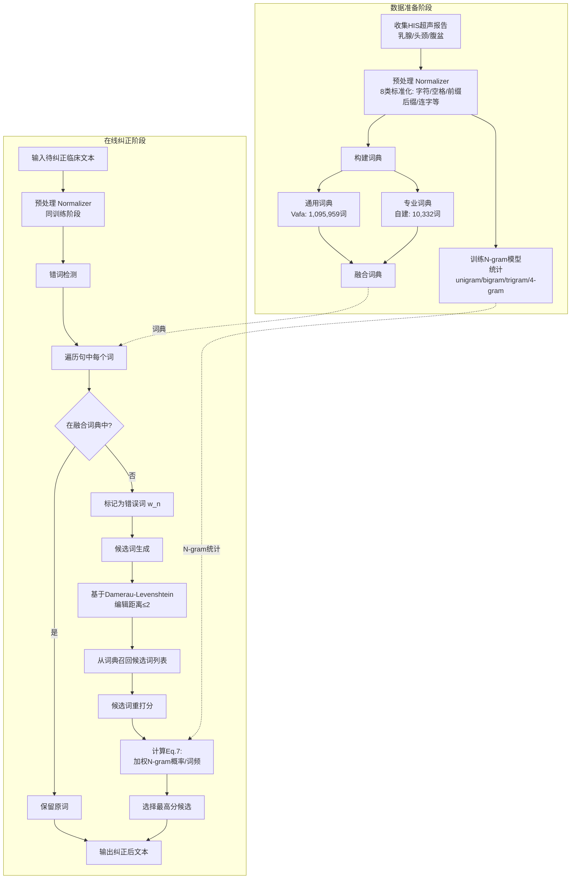

# Automated Misspelling Detection and Correction in Persian Clinical Text

---
## **作者信息**

| 作者 | 机构 | 身份/背景 | 领域大牛认定 |
|------|------|-----------|-------------|
| Azita Yazdani | 设拉子医科大学健康信息技术系；健康人力资源研究中心 | 第一作者，健康信息学/自然语言处理方向 | 尚未达到资深大牛层级 |
| Marjan Ghazisaeedi | 德黑兰医科大学联合医学学院健康信息管理系 | 通讯作者之一，健康信息管理方向 | 伊朗健康信息学领域中坚研究者 |
| Nasrin Ahmadinejad | 伊朗癌症研究所癌症研究中心 | 医学影像/放射学方向 | 临床医学背景，非NLP领域大牛 |
| Masoumeh Giti | 伊朗癌症研究所癌症研究中心 | 医学影像/超声方向 | 临床医学背景 |
| Habibe Amjadi | 伊朗癌症研究所癌症研究中心 | — | 临床医学背景 |
| Azin Nahvijou | 伊朗癌症研究所癌症研究中心 | 通讯作者（aznahvi@yahoo.com） | 癌症研究/流行病学方向，主要负责项目立项与管理 |

**团队定位**：该团队为**伊朗（德黑兰医科大学+设拉子医科大学）跨学科研究组**，由**健康信息管理学者联合放射科临床医生**组成。NLP/计算语言学功底主要依赖现成的Vafa拼写检查器与hjazm库，属于**应用驱动型工作**，并非计算语言学或NLP顶级团队。**不具备国际学术声誉（无ACL/EMNLP/NAACL等顶会固定发表记录）**。

---

## **团队相关信息：**
该团队是**伊朗德黑兰医科大学与设拉子医科大学联合组建的医疗信息学应用研究组**，核心成员为健康信息管理方向的学者（Yazdani、Ghazisaeedi）与放射科临床医生（Ahmadinejad、Giti）。团队在**波斯语医疗文本处理**领域有持续产出（参见Yazdani 2019 N-gram预测研究），但**在国际NLP/Health Informatics顶会（如AMIA、ACL、JBI）上缺乏稳定见刊记录**。本文发表于Springer旗下 *Journal of Digital Imaging*（IF≈3-4，影像信息学专业期刊），属于**医学影像与健康信息学交叉的应用期刊**，而非NLP顶会或顶级AI会议。团队整体处于**区域性领先、国际影响力有限**的状态。

---

## **论文发表时间**

| 项目 | 具体日期 | 来源/说明 |
|------|----------|-----------|
| 在线发表日期 | 2019年12月10日 | Springer *Journal of Digital Imaging* 官方在线发布 |
| 期刊卷号/页码 | — | 该期刊为SSCI/SCIE收录影像信息学专业期刊 |
| 当前状态 | **已正式发表** | 非预印本，为经同行评议的正式期刊论文 |
| 研究时间跨度 | 2014年–2018年7月 | 数据采集自Imam Khomeini医院HIS系统（2014–2018） |

---

## **摘要**

波斯语医疗文本中缺乏自动拼写检测与纠正系统。本文基于**N-gram语言模型**，结合**通用词典（Vafa拼写检查器，1,095,959词）** 与**医学专业词典（自建10,332词，涵盖乳腺/头颈/腹盆超声）** ，对影像科超声报告中的**非词错误（non-word errors）** 进行检测与纠正。在249份乳腺超声、75份头颈超声、428份腹盆超声测试集上，系统实现了**检测F值最高90.29%**、**纠正准确率最高88.56%**。系统集成至医院HIS后，显著缩短了报告从录入到终审的等待时间（消除Muda/非增值活动）。本文是**首个面向波斯语临床文本的自动拼写纠正系统**，填补了该语种医疗NLP的空白。

---

## 一、这篇论文讲了一个什么样的故事？

这篇论文讲述了一个**非常务实且"接地气"的应用故事**：

**故事背景**：伊朗德黑兰Imam Khomeini医院的影像科每天产生大量超声报告。这些报告由放射科医生口述、医疗打字员录入HIS，然后返回医生审核修改——整个流程平均耗时**至少30分钟**，其中充斥着"非增值等待时间"。更关键的是，**波斯语没有任何现成的医学拼写检查工具**——现有的Virastyar和Vafa拼写检查器都是面向新闻、政治、体育等通用领域的，医疗术语完全不在其词典覆盖范围内。

**故事主线**：作者团队（健康信息管理学者+放射科医生）决定自建一个波斯语临床拼写检查器。他们干了三件事：(1) **攒词典**——拿Vafa的通用词典（109万词）加上自己从超声报告中"抠"出来的专业术语（10,332词）；(2) **搭模型**——用N-gram语言模型（2-gram、3-gram、4-gram加权投票）对检测到的错词进行上下文感知的候选词排序；(3) **落地验证**——在真实HIS环境中测试，证明系统能将报告周转时间缩短、准确率达到88%以上。

**故事的学术"卖点"**：这并不是一个"NLP算法突破"的故事，而是一个"**用成熟技术解决低资源语言医疗场景真实痛点**"的故事。作者在讨论中直言不讳地承认：我们无法跟其他波斯语医学拼写检查比较，因为压根儿不存在。这个领域唯一的基线就是——"什么都没有"。

**故事的局限**：作者坦承，系统只处理"非词错误"（打出来的词压根不在词典里），对"真词错误"（如把"肝"误打成"干"这种上下文才看得出问题的错误）无能为力。这也是作者在"未来工作"中明确列出的待办事项。

---

## 二、本文的核心思想和创新点

### 1. 核心思想

**核心思想**：利用N-gram语言模型对上下文建模，结合通用词典与领域专业词典，实现波斯语临床自由文本中非词错误的自动检测与纠正，从而提升电子健康记录的数据质量与临床文档流程效率。

这一思想可解构为三个层次：
- **检测层**：任何不在词典（通用+专业）中的词即为错词——简单、直接、可解释。
- **纠正层**：对错词，基于Damerau-Levenshtein编辑距离（≤2）从词典中召回候选词，再用N-gram模型（unigram+bigram+trigram+4-gram加权）对候选词按上下文概率排序，选最优者。
- **应用层**：将系统嵌入HIS工作流，提供"自动纠正"与"建议列表"两种模式，让用户按需选择。

### 2. 关键创新点

| 创新点编号 | 具体内容 | 重要性评估 |
|:---:|---|---|
| **①** | **首个波斯语医学领域拼写纠正系统**：填补了波斯语医疗NLP在该任务上的空白。此前Virastyar和Vafa均为通用领域，不覆盖医学专业术语。 | ★★★★★（最大贡献） |
| **②** | **通用+专业双词典架构**：将1,095,959词通用词典与10,332词自建医学词典融合，覆盖"日常用语+医学术语"双域。专业词典来源包括超声报告语料与《Radiological Sciences Dictionary》波斯语译本。 | ★★★★☆ |
| **③** | **多阶N-gram加权融合的候选词重打分方法**：对同一候选词，同时计算unigram、bigram、trigram、4-gram概率并加权求和（高阶权重更高），再除以该词的训练集频次作为归一化。该方程（Eq. 7）被作者认为可迁移至其他语言。 | ★★★☆☆（算法层面为现有技术组合，创新在于加权策略） |
| **④** | **集成于实际HIS工作流的双模式设计**：支持"自动纠正模式"（系统直接替换最高概率候选）与"交互式建议列表模式"（用户手动选择），兼顾自动化效率与临床安全性。 | ★★★★☆ |
| **⑤** | **对波斯语脚本的特殊预处理流水线**：针对阿拉伯-波斯文特有的字符编码变体（如ك/ک、ي/ی）、空格/半空格变体、前缀/后缀附着方式、连字（tatweel/كشيده）等进行了8类标准化处理。这些工程细节对后续波斯语医疗NLP研究有参考价值。 | ★★★☆☆ |

---

## 三、方法是怎么实现的？(How does it work?)

### 1. 架构

系统采用**离线训练+在线推理**的两阶段架构，整体流程如下图所示：



**图注**：本图参考论文**Figure 1（系统概念框架）** 及**Methodology（材料与方法）** 章节所述整体流程综合绘制。

### 2. 关键算法

**① 错词检测算法（词典查找法）**

```
算法1：非词错误检测
输入：句子 S = [w₁, w₂, ..., wₙ]，融合词典 D
输出：错词位置集合 E

for each word wᵢ in S:
    if wᵢ ∉ D:
        E ← E ∪ {i}   // 标记为错词
    else:
        continue      // 通过检测
```

**② 候选词生成算法（Damerau-Levenshtein距离）**

编辑距离定义四种基本操作：
- **插入 (Insertion)**：在词中插入一个字符
- **删除 (Deletion)**：删除词中的一个字符
- **替换 (Substitution)**：将错字符替换为正确字符
- **转置 (Transposition)**：交换相邻两个字符的位置

论文利用"**80%的错误在编辑距离1以内**"（引用[32]）以及实测数据（表4：81.5%~87.9%错词在编辑距离1内），设置编辑距离阈值 d ≤ 2。

**③ 候选词重打分算法（N-gram加权融合）**

对每个候选词 Cᵢ，计算综合权重：

$$\text{Score}(C_i) = \frac{\lambda_1 P(C_i) + \lambda_2 P(C_i|w_{n-1}) + \lambda_3 P(C_i|w_{n-2}, w_{n-1}) + \lambda_4 P(C_i|w_{n-3}, w_{n-2}, w_{n-1})}{\text{freq}(C_i)/N}$$

其中：
- $P(C_i)$：unigram概率（词频/总词数）
- $P(C_i|w_{n-1})$：bigram条件概率
- $P(C_i|w_{n-2}, w_{n-1})$：trigram条件概率
- $P(C_i|w_{n-3}, w_{n-2}, w_{n-1})$：4-gram条件概率
- $\lambda_1, \lambda_2, \lambda_3, \lambda_4$：权重系数（高阶模型赋予更高权重）
- $\text{freq}(C_i)/N$：候选词在训练集中的归一化频率（作为分母，对高频词进行惩罚/归一化）

选择 Score 最大的候选词作为纠正结果。

### 3. 关键公式

**公式1：错词上下文窗口表示（Equation 1）**

$$W_{n-m} \dots W_{n-2} W_{n-1} \underbrace{\text{Error}}_{W_n} W_{n+1} W_{n+2} \dots W_{n+m}$$

将错词 $w_n$ 置于中心，前后各取 m 个词作为上下文。这些上下文词用于N-gram模型的条件概率计算。

**公式2：N-gram通用定义（Equation 2）**

$$P(w) = P(w_1 w_2 \dots w_n) \approx \prod_{i=1}^n p(w_i | w_{i-k} \dots w_{i-1})$$

**公式3：Bigram（Equation 4）**

$$P(w) \coloneqq \prod_{i=1}^n p(W_i | W_{i-1})$$

**公式4：Trigram（Equation 5）**

$$P(w) \coloneqq \prod_{i=1}^n p(W_i | W_{i-2}, W_{i-1})$$

**公式5：候选词最佳选择（Equation 7）**

$$\frac{W_{n-m} \dots W_{n-2} W_{n-1}}{W_{n-m} \dots W_{n-2} W_{n-1}} \qquad \text{Best Candidate} \qquad W_{n+1} W_{n+2} \dots W_{n+m}$$

*(注：论文PDF渲染中此公式存在格式错乱，实际含义为：以错词前后的上下文词为条件，计算每个候选词的概率，取最大值对应的候选。)*

---

## 四、实验效果 (Experimental Results)

### 1. 实验设置

| 数据集 | 训练集报告数 | 训练集词数 | 训练集错词率 | 测试集报告数 | 测试集词数 | 测试集错词率 |
|---|---|---|---|---|---|---|
| 乳腺超声 | 15,639 | 871,275 | 1.20% | 249 | 101,863 | 0.83% |
| 头颈超声 | 15,472 | 168,055 | 1.00% | 75 | 26,856 | 2,550条错词 |
| 腹盆超声 | 3,531 | 106,084 | 1.42% | 428 | 19,264 | 0.97% |
| **合计/平均** | **34,642** | **~1,145,414** | **~1.15%** | **752** | **~147,983** | — |

- **数据来源**：伊朗德黑兰Imam Khomeini医院影像科HIS系统（2014–2018）
- **评价指标**：Precision、Recall、F-measure、Accuracy（检测；纠正仅报告Accuracy）
- **基线**：无有效基线（波斯语无医学拼写检查工具），仅与训练集自身的"完美词典"对比

**关于"无法对比"的说明**：论文讨论中明确承认，因波斯语领域无其他医学拼写检查系统，无法与其他同类系统进行横向比较——这是本工作**最大的实验局限**。

### 2. 主要结果

**（一）错词类型分布**

| 错误类型 | 乳腺超声 | 头颈超声 | 腹盆超声 |
|---|---|---|---|
| 插入 (Insertion) | 23.9% | 15.1% | **41.3%** |
| 删除 (Deletion) | **34.6%** | **39.4%** | 15.3% |
| 替换 (Substitution) | 30.1% | 31.8% | 34.2% |
| 转置 (Transposition) | 11.4% | 13.7% | 9.2% |

**观察**：乳腺和头颈超声中删除错误最频繁；腹盆超声中插入错误占绝对多数（41.3%）；转置错误在所有数据集中均最少。推测与打字员输入习惯、术语长度特征差异有关。

**（二）编辑距离分布（测试集）**

| 编辑距离 | 乳腺超声 | 头颈超声 | 腹盆超声 |
|---|---|---|---|
| 1 | 81.5% | 87.9% | 82.6% |
| 2 | 18.1% | 11.3% | 16.3% |
| ≥3 | 0.4% | 0.9% | 1.1% |

**结论**：**平均约84%的错词在编辑距离1内**，与引文[32]所述"80%"高度吻合，验证了编辑距离阈值设为2的充分性。

**（三）错词检测性能（测试集）**

| 指标 | 乳腺超声 | 头颈超声 | 腹盆超声 |
|---|---|---|---|
| Precision | 90.44% | 89.67% | 90.12% |
| Recall | 87.59% | 89.35% | 89.43% |
| **F-measure** | **88.62%** | **90.08%** | **90.29%** |
| Accuracy | — | — | — |

**（四）错词纠正准确率**

| 测试集 | 纠正准确率 | 训练集（对照） |
|---|---|---|
| 乳腺超声 | **81.77%** | 92.71% |
| 头颈超声 | **88.56%** | 91.84% |
| 腹盆超声 | **84.14%** | 93.91% |

- **测试集纠正准确率范围**：81.77% ~ 88.56%
- **训练集纠正准确率范围**：91.84% ~ 93.91%（训练集词全在词典中，precision=100%，故此值为"理想上限"）

### 3. 消融实验与关键发现

**（一）N-gram阶数的影响**

论文未给出独立的消融表格，但从方法论描述可知：
- 本文使用的N-gram模型为**unigram + bigram + trigram + 4-gram的加权组合**
- 权重分配原则：**高阶N-gram权重 > 低阶N-gram权重**（4-gram最高，unigram最低）
- 直观解释：更长上下文能提供更强的约束，帮助在候选词中做出更精准的选择

**（二）词频归一化的作用**

论文明确指出：将候选词的概率除以该词在训练集中的出现频率（即 $\text{freq}(C_i)/N$），可**防止高频通用词"劫持"候选排序**——这在临床领域至关重要，因为低频医学专业术语若不做频次归一化，容易被高频日常词在概率上压制。

**（三）编辑距离阈值1与2的权衡**

- **阈值1**可覆盖~84%错词，候选集小、速度快，但会遗漏~16%的错词
- **阈值2**增加召回，但候选集膨胀（推理速度下降）
- **本文选择阈值2**，兼顾检测召回（87%~89%）与纠正精度（~90% Precision）

**（四）运行效率（定性）**

论文未给出精确的推理速度（ms/句）数据，但描述了**实际部署效果**：
- 系统作为**HIS插件**实时运行，在打字员录入的同时进行检测与纠正
- 使用后显著缩短了"从报告录入到终审确认"的时间
- 论文用丰田生产系统术语"**Muda**"（非增值活动/浪费）来描述其消除的流程等待时间
- 原流程平均至少30分钟，使用本系统后"显著节省时间"

**（五）模式选择的影响**

- **自动模式**：系统自动将错词替换为最高分候选——效率最高，但对误纠风险缺乏人工复核
- **交互模式**：系统弹出候选列表供用户选择——安全性更高，但稍微牺牲效率
- **实际部署场景**：影像科选择何种模式未在文中明确，但推测因错词率仅~1%，自动模式可接受

---

## 五、优点与局限性

### ✅ 1. 优点

| 优点 | 说明 |
|---|---|
| **首创性** | 首个波斯语医学领域自动拼写检查系统，填补了该语种×该任务的研究空白。 |
| **实用性极强** | 直接嵌入HIS工作流，在真实医院环境验证，解决了临床文档流程中的实际痛点（流程等待时间/Muda）。 |
| **方法清晰、可复现** | 所有步骤均有详细描述：词典来源、预处理8类标准化规则、编辑距离阈值设定、N-gram加权公式——工程复现门槛低。 |
| **低资源场景的典型范式** | 利用**现成通用词典+自建小规模专业词典**解决领域覆盖问题，不需要大规模的标注语料，在资源匮乏情况下具有方法论参考价值。 |
| **临床医生深度参与** | 共同作者包括放射科医生（Ahmadinejad、Giti），确保系统设计贴合实际工作流，非"纸上谈兵"的纯学术方案。 |
| **多数据集交叉验证** | 在三个不同的超声亚专科（乳腺/头颈/腹盆）上分别测试，验证了系统的泛化能力。 |
| **双模式设计** | 自动模式（效率）与交互模式（安全）并存，兼顾不同使用场景需求。 |

### ⚠️ 2. 局限性（研究边界与待解问题）

| 局限性 | 影响与讨论 |
|---|---|
| **仅处理非词错误 (Non-word Errors)** | 对"真词错误"（如将"肝脏"误写为"干净"——两者均为词典中的合法词）完全无能为力。这类错误需要上下文语义理解能力，而论文采用的N-gram模型并非为此设计。作者在结论中坦承此局限。 |
| **无法与其他系统横向对比** | 波斯语无其他医学拼写检查系统，无法进行有意义的SOTA对比。这在方法上是非对称的（我们无法判断88.56%的准确率在绝对尺度上算"好"还是"一般"）。 |
| **未报告推理速度等工程指标** | 缺乏精确的每句纠正耗时、吞吐量、候选集大小对响应时间的影响等数据。对"实时"系统的工程评价不完整。 |
| **N-gram模型的可迁移性受限** | N-gram依赖训练集语料的规模和分布。本系统仅覆盖超声科文本，若迁移至内科/外科/病理报告，需要重新训练N-gram并扩充专业词典。 |
| **缺乏对误纠正（False Correction）的系统分析** | 论文未报告"将原本正确的词误判为错词并错误纠正"的情况（即Precision=90%说明仍有~10%的误报/误纠）。在实际临床场景中，这类错误可能比漏纠更危险。 |
| **数据仅来自单中心（单家医院）** | 虽然报告数量较大（34,642份训练报告），但均来自同一家医院（Imam Khomeini Hospital）的影像科。不同医院/不同科室的书写风格、术语变体、错词类型分布可能存在差异，外推性未经验证。 |
| **专业词典规模偏小** | 仅10,332个专业词，覆盖的医学术语范围有限。作为对比，英文UMLS包含数百万医学概念。虽符合波斯语医疗NLP的现实条件，但覆盖不足可能成为性能上限的瓶颈。 |
| **未使用现代NLP技术** | 2019年的方法相对传统（N-gram+编辑距离）。同期（2018-2019）已有基于RNN/Transformer的拼写纠正探索，但本文未予采用。当然，这也与波斯语预训练模型资源当时极匮乏的现实背景有关。 |

---

## 六、其他

### 第一性原理

本文遵循的"第一性原理"可归纳为三条基本事实：

1. **错词检测的本质是"集合归属判断"**：一个词拼写是否正确，取决于它是否出现在该语言已知词汇的集合中。这个集合在医疗场景下 = 通用语词汇集 ∪ 医学专业术语集。词典查找法是最简洁、计算开销最小、可解释性最强的实现方式。

2. **错词纠正的本质是"带约束的候选排序"**：给定一个错词，所有可能的正确候选是在编辑距离空间内与该错词相近的词典词；而"最优"候选是指在上下文中出现概率最高的那个。N-gram模型通过统计词序规律来估算"在上下文中出现概率"——这是N-gram能用于拼写纠正的数学基础。

3. **临床文档质量问题的本质是"流程效率与准确性的博弈"**：口述→打字→审核的串行流程中，打字环节引入的错误如果不被及时发现，就会进入审核环节消耗医生的认知资源。将拼写纠正前置于录入环节，是从根本上减少下游环节非增值活动（Muda）的"源头治理"策略。

### 领域空白

本工作填补的具体空白（Gap）为：

1. **语言层面**：波斯语（Farsi/Persian）属于低资源语言，在医疗NLP领域的工具链几乎空白。已有的Virastyar和Vafa拼写检查器均为通用领域，对医学专业术语（如超声解剖结构、病理描述）的覆盖率近乎为零。

2. **任务层面**：据作者所述（"in the Persian language, there is no any spelling correction system in the field of medicine"），本文是**有据可查的首个波斯语医学领域拼写检查系统**。这一定位通过自建专业词典与收集真实临床语料得到支撑。

3. **应用层面**：波斯语国家的医院信息系统（HIS）广泛缺乏面向临床自由文本的辅助输入/纠错工具。本文探索了将NLP技术集成至HIS的可行路径，为后续波斯语医疗NLP研究提供了工程范本（预处理标准化流程、词典构建方案、系统集成模式等）。

4. **方法论空白**：虽然N-gram拼写纠正在英语/法语/匈牙利语等语言上已有较充分研究，但**将N-gram + 双词典架构 + HIS部署三者结合的完整方案**在波斯语医疗语境下尚属首次。作者提出的候选词加权公式（Eq. 7）融合了多阶N-gram概率与词频归一化，也为后续研究者提供了一个可直接复用的排序策略。

---
> 本文由 Deepseek AI 生成
