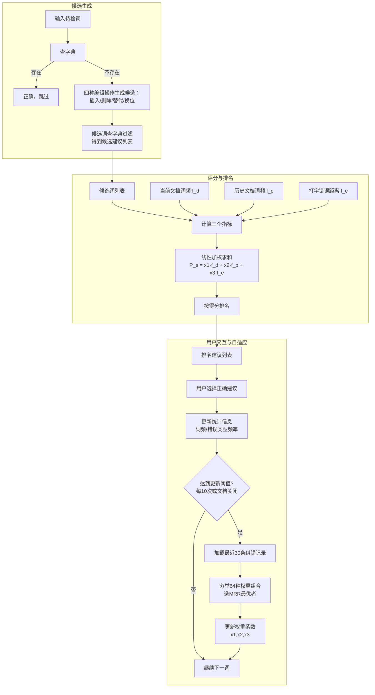

# Effect of Adaptive Spell Checking in Persian

---
## **作者信息**

| 作者 | 机构 | 身份/背景 | 领域大牛认定 |
|------|------|-----------|-------------|
| Mohammad Sadegh RASOOLI | 伊朗科技大学计算机工程系 | 博士生/研究员 | 伊朗计算语言学领域活跃学者，波斯语NLP方向重要贡献者，但未达国际顶级大牛层级 |
| Omid KAHEFI | 伊朗科技大学计算机工程系 | 博士生/研究员（IEEE会员） | 主要从事波斯语文本处理，学术影响力限于区域范围 |
| Behrouz MINAEI-BIDGOLI | 伊朗科技大学计算机工程系 | 教授/博导 | 伊朗科技大学NLP实验室负责人，指导多名NLP方向博士生，在波斯语NLP领域有较高学术地位 |

## **团队相关信息：**
该团队为**伊朗科技大学（IUST）计算机工程系自然语言处理研究组**，由Behrouz MINAEI-BIDGOLI教授领导。该组是**波斯语计算语言学领域的主力研究团队**，专注于波斯语拼写检查、词法分析等基础NLP任务，但团队规模与影响力局限于波斯语语种区域，在国际NLP社区中属于**语种特定（Language-Specific）方向的中型研究组**，不属国际顶尖NLP实验室序列（如Stanford NLP、Google Research等）。Rasooli本人是该组近年来最活跃的青年学者之一，在波斯语拼写检查与句法分析方向有系列产出。

## **论文发表时间**

| 项目 | 具体日期 | 来源/说明 |
|------|----------|-----------|
| 会议发表 | 2011年 | 发表于IEEE某会议（可能为ICEE或类似会议），由IEEE Xplore收录 |


该论文**2011年正式发表**，属于**已发表会议论文**，非预印本或双盲评审阶段作品。

## **摘要**

本文研究了自适应拼写检查在波斯语中的应用效果。传统拼写检查器使用固定的规则集，而不同用户有其独特的拼写错误模式和习惯，固定规则难以覆盖所有用户的错误模式。本文提出一种基于机器学习的动态方法，通过用户交互学习其拼写错误模式，动态调整排名的有效性系数（effectiveness weights）。实验使用来自11位用户的843个拼写错误进行评测，采用平均倒数排名（Mean Reciprocal Rank, MRR）作为评价指标。实验结果表明，自适应拼写检查方法在使用一段时间后，显著优于采用固定规则集的非自适应传统拼写检查方法，验证了用户拼写错误具有模式化特征以及自适应方法的有效性。

---

## 一、这篇论文讲了一个什么样的故事？

这篇论文讲了一个 **"因材施教"式的自适应拼写检查** 故事。

**起点**：计算机时代大量数字文本生产，人工校对不堪重负。波斯语因书写规则不统一（如同一个词可有连续、带空格、分隔三种写法）、形态变化丰富（超过100种动词变位、2800种名词变格）且缺乏统一正字法标准，使得传统拼写检查面临严峻挑战。

**核心观察与假设**：不同用户有其独特的打字错误模式（如某人总把特定字母输错），也有各自的常用词汇库。传统拼写检查器对所有用户"一视同仁"——使用固定的错误概率表和固定的词典频率，忽略了个体差异。

**所提方案**：本文提出一种通过用户交互进行自适应的拼写检查方法。系统在每次用户选择正确建议后，记录这次"教训"，动态调整三个排名指标（文档内词频、历史文档词频、打字错误统计）的权重系数。每处理10个拼写错误或关闭文档时，系统重新优化权重组合，使后续排名越来越贴合当前用户的习惯。

**结局**：在11位不同类型用户（包含博客作者、论文写作者、书籍作者）共843个拼写错误上的实验表明，自适应方法的MRR值随时间呈上升趋势，且始终高于非自适应基线方法，证实了"拼写错误有模式可循"这一假设以及自适应路线的有效性。

---

## 二、本文的核心思想和创新点

### 1. 核心思想

**拼写错误不是随机的，而是用户特有的模式化行为；因此拼写检查器应当从用户的纠错历史中学习，而非使用通用固定规则。**

这一思想基于两个核心假设：
- **有限词汇假设**：特定用户在日常写作中使用有限词汇集，这些词汇在历史文档中频繁出现应获得更高排名权重。
- **错误模式个性化假设**：特定用户的打字错误类型分布有其自身规律（如某人总犯替代错误，某人总犯漏字错误），系统应动态学习这种分布。

### 2. 关键创新点

| 序号 | 创新点 | 说明 |
|------|--------|------|
| 1 | **动态权重优化机制** | 非自适应方法使用固定系数 $(x_1,x_2,x_3)$，本文在每10次纠错或文档关闭时，穷举所有系数排列（1~4共4³=64种组合），基于最近30条纠错记录选取最优组合 |
| 2 | **三重特征融合** | 将文档内词频、跨文档词频、打字错误统计三个维度的特征线性组合，三个维度分别对应"当前上下文"、"用户长期偏好"和"用户错误习惯" |
| 3 | **自适应滑动窗口** | 基于中心极限定理（30样本阈值），仅保留最近30条纠错记录作为优化依据，兼顾了"适应性"与"计算效率/存储开销"的平衡 |
| 4 | **首次系统性验证波斯语自适应拼写检查** | 此前波斯语拼写检查多采用固定规则（如Barari等人的CloniZER、Rasooli本人的早期工作），本文首次用系统化实验证明自适应路线在波斯语上优于非自适应路线 |

---

## 三、方法是怎么实现的？(How does it work?)

### 1. 架构

本方法采用**交互式在线学习架构**，整体流程如下图所示：



**图注**：参考论文Section IV（Proposed Approach）及Equation (1)综合绘制，反映候选生成→评分排名→交互反馈→自适应优化的完整闭环。

### 2. 关键算法

**算法：自适应拼写检查的权重优化流程**

```
输入: 用户纠错历史 H（最近30条），权重搜索空间 X = {1,2,3,4}³
输出: 最优权重系数 (x1*, x2*, x3*)

1. 对每个候选权重组合 (x1,x2,x3) ∈ X:
2.   对每条纠错记录 (misspelling, candidates, correct):
3.     对每个候选词 w ∈ candidates:
4.       计算 score = x1·f_d(w) + x2·f_p(w) + x3·f_e(w, misspelling)
5.     按 score 降序排列候选词
6.     记录 correct 在该排序中的位置 rank
7.   计算该组合在当前 H 上的 MRR
8. 返回 MRR 最高的权重组合
9. 更新系统权重为该最优组合
```

**算法特点**：
- **穷举而非梯度优化**：因系数空间仅64种组合，穷举可保证全局最优
- **在线增量更新**：不重算全部历史，仅维护滑动窗口内30条记录
- **懒惰重优化**：每10次纠错才触发一次重优化，控制计算开销

### 3. 关键公式

**公式（1）：候选词评分函数**

$$
P_s(w_i, m) = x_1 \cdot f_d(w_i) + x_2 \cdot f_p(w_i) + x_3 \cdot f_e(w_i, m)
$$

其中：
- $w_i$：第 $i$ 个候选建议词
- $m$：用户输入的错误词（misspelling）
- $f_d(w_i)$：候选词在当前文档中的频率比
- $f_p(w_i)$：候选词在历史已处理文档中的频率比
- $f_e(w_i, m)$：候选词与错误词之间的"打字错误距离"，由 Figure 1 的算法计算（基于四种基本编辑操作产生的概率）
- $x_1, x_2, x_3 \in \{1,2,3,4\}$：有效性系数，自适应优化对象

**公式（2）：MRR 评价指标**

$$
MRR = \frac{1}{|Misspellings|} \sum_{i=1}^{|Misspellings|} \frac{1}{Rank(CorrectSuggestion_i)}
$$

其中 $Rank(CorrectSuggestion_i)$ 为第 $i$ 个拼写错误的正确建议在系统排名列表中的位置（从1开始）。MRR 值域为 (0, 1]，值越高表示系统将正确建议排得越靠前。

**打字错误概率表（Table I）**：

| 错误类型 | 概率 |
|----------|------|
| 替代（Substitution） | 0.375 |
| 删除（Deletion） | 0.375 |
| 插入（Insertion） | 0.1875 |
| 换位（Transposition） | 0.0625 |
| 连写（Run-on） | 0.375 |
| 分写（Separation） | 0.1875 |

注：Run-on 被建模为"删除"（删掉本应存在的空格），Separation 被建模为"插入"（插入多余空格）。

---

## 四、实验效果 (Experimental Results)

### 1. 实验设置

**数据集**：

| 用户编号 | 文档类型 | 主题 | 拼写错误数 |
|----------|----------|------|-----------|
| 1 | 书籍 | 宗教 | 180 |
| 2 | 博客 | 政治 | 92 |
| 3 | 博客 | 个人 | 83 |
| 4 | 硕士论文 | 语言学 | 167 |
| 5 | 硕士论文 | 语言学 | 48 |
| 6 | 博客 | 政治 | 76 |
| 7 | 书籍 | 电子工程 | 38 |
| 8 | 博客 | 个人 | 37 |
| 9 | 本科论文 | 电子工程 | 30 |
| 10 | 博客 | 科学 | 65 |
| 11 | 博客 | 政治 | 27 |
| **合计** | - | - | **843** |

- **11位不同用户**，涵盖博客、学位论文、书籍三种文档类型
- 每位用户的文档被**等分为5个部分**，逐部分计算MRR，以观察时间序列趋势

**基线方法**：
- **非自适应版本**：使用固定系数（而非动态优化），使用Table I的固定错误概率表，使用Hamshahri语料库的全局词频作为 $f_p$，文档内词频在全文范围预计算而非逐步更新

**评价指标**：
- 平均倒数排名（Mean Reciprocal Rank, MRR）

### 2. 主要结果

**Figure 2** 展示了自适应方法与非自适应方法在11位用户上5个连续部分的平均MRR趋势：

- **自适应拼写检查器在5个部分上的MRR值呈明显上升趋势**（从约0.65逐步上升至接近0.80），说明随着用户交互增多，系统排名精度持续改善
- **非自适应拼写检查器MRR值保持平稳**（约0.55~0.60），说明固定规则不具备学习能力
- **在所有5个部分上，自适应方法的MRR均高于非自适应方法**，且差距随使用时间扩大

**核心结论**：
- 自适应方法相比非自适应方法具有**显著优越性**，用户使用一段时间后效果差距愈发明显
- MRR的**递增趋势验证了"用户拼写错误具有模式化特征"这一核心假设**——如果错误是完全随机的，则自适应不会产生递增效果
- 自适应方法在处理**低资源/非标准书写语言（如波斯语）**时具有更大的相对优势，因为传统固定规则难以覆盖波斯语的正字法变体

### 3. 消融实验与关键发现

论文**未设立严格的消融实验**（将 $f_d$、$f_p$、$f_e$ 逐个移除对比），但通过方法设计本身隐含了部分对比信息：

**隐含对比1：动态 vs 静态权重**
- 非自适应方法本质上是将 $x_1, x_2, x_3$ 固定为某个预设值，而自适应方法动态寻找最优组合
- MRR差异（自适应约0.78 vs 非自适应约0.58，最终部分）可视为"动态权重优化"带来的增益

**隐含对比2：用户历史 vs 通用语料**
- 非自适应使用Hamshahri通用语料库频率作为 $f_p$，自适应使用用户自身历史文档频率
- 差异间接证明了**用户个人词汇分布与通用语料分布存在显著偏差**

**关键发现**：
- **中心极限定理的工程应用**：将滑动窗口设为30（基于统计学"样本量≥30可近似正态分布"的经典阈值），是一种计算效率与适应速度的巧妙权衡，实验证明30样本足以捕捉用户错误模式
- **更新频率为每10次纠错**：在适应速度与计算开销之间取得平衡，过于频繁则计算量大，过低则适应滞后

---

## 五、优点与局限性

### ✅ 1. 优点

| 维度 | 具体优势 |
|------|----------|
| **问题定位精准** | 敏锐地识别出"波斯语正字法不统一"这一核心痛点（一音多形、一词多写法），使自适应方法对波斯语格外有效 |
| **假设验证充分** | 用11位不同背景用户的真实数据验证了"拼写错误模式化"假设，而非仅用合成数据 |
| **计算效率工程化** | 将优化窗口限制为最近30条记录，权重搜索空间仅64种组合，使在线自适应在实际应用中可行 |
| **用户覆盖多样性** | 实验数据涵盖学生论文、个人博客、专业书籍等不同文本类型和领域，增强了结论的外部有效性 |
| **特征选取完备** | 三个特征分别对应"当前上下文"、"长期偏好"、"错误习惯"，覆盖了影响拼写建议排名的三个关键维度 |

### ⚠️ 2. 局限性（研究边界与待解问题）

| 维度 | 具体局限 |
|------|----------|
| **候选生成与语义无关** | 仅基于四种编辑距离操作生成候选，无法处理**同音词混淆**（如波斯语中多个拼写发音相同但含义不同）和**语义级错误** |
| **缺少上下文依赖错误处理** | 作者在引言中承认存在"context-dependent errors"，但所提方法仅处理isolated-word errors，无法纠正语法搭配错误 |
| **字典限制（无形态分析）** | 使用原始词形（word form）直接查字典，未进行词干提取（stemming）或词形还原（lemmatization）。波斯语有超过2800种屈折变化，未登录词（OOV）问题严重 |
| **自适应仅限于权重调优** | 权重搜索空间仅为 $4^3=64$，且特征本身（$f_d, f_p, f_e$）的定义固定不变，并非"全栈自适应" |
| **硬件/内存信息缺失** | 未报告存储开销和更新重算的计算耗时（在2011年的硬件条件下，每10次纠错穷举64组合的响应延迟可能影响用户体验） |
| **基线较弱** | 非自适应基线本质上是自适应方法的"退化版本"（固定 $x_i$），而非一个独立的、更强大的非自适应拼写检查器（如基于语言模型的方法） |
| **外部有效性限制** | 实验仅针对波斯语，结论能否推广到其他书写系统（如阿拉伯语、乌尔都语等具有类似正字法挑战的语言）需进一步验证 |

---

## 六、其他

### 第一性原理

本文的第一性原理可以追溯到两个根本观察：

1. **错误作为数据源**：传统观点将"拼写错误"视为需要清除的噪声，本文将其视为**蕴含用户个人特征的有价值信号**。拼写错误不仅是"错误"，更是用户行为的"指纹"。

2. **写作行为的个性化**：每个人在写作中使用的词汇集合、犯错的类型分布都存在稳定的个体差异。这意味着任何"一刀切"的NLP系统都存在理论上的效率损失，**个性化是NLP系统达到最优性能的必经之路**。

基于这一第一性原理，本文做出了一个关键的设计抉择：与其追求一个"对所有人都最优"的单一拼写检查模型，不如构建一个**能快速适应特定用户的轻量级学习系统**，以最小的交互代价换取最大的适应性增益。这一思路在2011年（深度学习兴起前）具有前瞻性，如今可以视作"**NLP个性化（Personalized NLP）**"这一更广泛研究方向的早期探索。

### 领域空白

论文所填补的领域空白为：

**"波斯语缺乏自适应的拼写检查系统"**——虽然此前已有若干波斯语拼写检查研究（如Rasooli & Minaei 2008、Barari & QasemiZadeh 2005），但皆采用固定规则集，未考虑**用户个体差异**这一维度。本文首次在波斯语NLP领域系统性地提出并验证了：

> *"拼写检查系统不应是静态的，而应是一个随用户使用而持续演化的动态系统，且这种演化在波斯语这种正字法不统一的语言上带来的收益尤为显著。"*

这一填补不仅在工程层面提升了波斯语拼写检查效果，更在方法论层面为波斯语NLP社区引入了一种"以用户为中心的适应性设计范式"（user-centric adaptive paradigm），后续可推广至波斯语的词性标注、句法分析等其他基础NLP任务。

---
> 本文由 Deepseek AI 生成