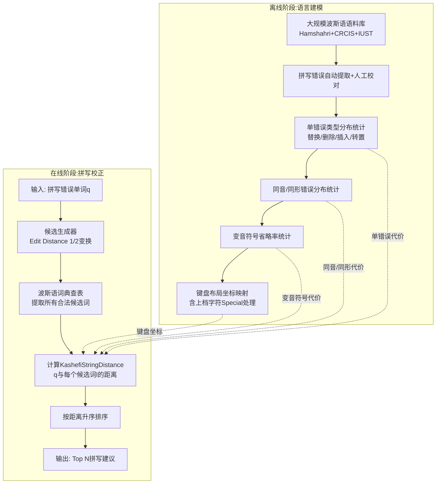

# A novel string distance metric for ranking Persian respelling suggestions

## 作者信息

| 作者 | 机构 | 身份/背景 | 领域大牛认定 |
|------|------|----------|-------------|
| Omid Kashefi | 伊朗科技大学（IUST）计算机工程学院 | IEEE会员，主要研究方向为自然语言处理、拼写校正 | 伊朗NLP领域活跃研究者 |
| Mohsen Sharifi（通讯作者） | 伊朗科技大学（IUST）计算机工程学院 | 教授，博士生导师 | 伊朗NLP与计算机工程领域资深学者，团队负责人 |
| Behrooz Minaei | 伊朗科技大学（IUST）计算机工程学院 | 教授 | 团队核心成员 |

## 团队相关信息

该团队是**伊朗科技大学（IUST）计算机工程学院自然语言处理与拼写校正方向的主力研究组**。Mohsen Sharifi为团队资深教授/负责人，带领博士生Omid Kashefi完成此项研究。该团队在波斯语文本处理、拼写校正、形态分析等领域有系列产出。**该团队在波斯语NLP领域具有重要地位**，但就国际NLP学术界而言，尚未达到ACL Fellow或顶级会议（ACL/EMNLP）最佳论文奖得主的层级。

## 论文发表时间

| 项目 | 具体日期 | 来源/说明 |
|------|----------|-----------|
| 首次投稿 | 2011年4月8日 | Received日期 |
| 第一次修订 | 2012年6月16日 | Revised日期 |
| 最终录用 | 2012年6月18日 | Accepted日期 |
| 在线首发（CJO） | 2012年7月24日 | Published online |
| 正式期刊出版 | 2012年12月（预计） | Natural Language Engineering期刊FirstView Article |

该论文**2012年7月在线首发**，目前已在**Cambridge University Press的Natural Language Engineering期刊正式出版**（Vol. 19, Issue 4, pp. 473-498, 2013），是经过完整同行评议的正式期刊论文，非预印本。

## 摘要

本文提出了一种**面向波斯语的新颖字符串距离度量方法**，用于对拼写错误候选词进行排序。该方法综合考虑了：
1. **键盘布局对打字拼写错误的影响**；
2. **同音词（homophones）和同形词（homomorphs）对正字法拼写错误的影响**；
3. **变音符号（diacritics）被忽略所导致的拼写错误**。

作者首先系统分析了波斯语的拼写特性，随后基于大规模波斯语语料库（约6700万词）进行了统计错误模式分析。实验表明，提出的度量方法在**Mean Average Precision (MAP)** 和**Mean Reciprocal Rank (MRR)** 上均显著优于Hamming、Levenshtein、Damerau-Levenshtein、Wagner-Fischer和Jaro-Winkler等经典字符串距离度量。

## 一、这篇论文讲了一个什么样的故事？

这篇论文讲的是：**如何让计算机为波斯语拼写错误给出更智能的候选词排序。**

故事的起点是一个普遍而古老的问题——拼写错误不可避免。已有的拼写校正方法中，基于字符串距离的排序策略被证明非常有效。然而，作者敏锐地发现：**这些通用距离度量是为英语设计的，它们无视波斯语的语言特性。**

波斯语有什么特殊之处？三个关键点：
1. **同音字母泛滥**：波斯语中有大量发音相同但写法不同的字母（如表2中的7大类），作者打字时很容易选错；
2. **同形字母混淆**：许多波斯语字母在不同位置（词首、词中、词尾、独立）形态不同，部分字母形态极其相似（如表3）；
3. **变音符号几乎被遗忘**：波斯语书写中，短元音变音符号（Harekat）几乎被省略，而重叠符号（Tashdid）和鼻化符号（Tanvin）虽应写却常被忽略，导致歧义。

更致命的是，这些语言特质与键盘布局效应交织在一起。作者对大规模波斯语语料库（Hamshahri报纸语料、CRCIS书籍语料、IUST学位论文语料，总计6700万词、约4万条拼写错误）进行了统计分析，发现：
- **替换错误占单错误的52%**，其中**27.54%是同形替换，17.67%是同音替换**；
- **88%的拼写错误是单错误**（即仅删除/插入/替换/转置一个字母）；
- 波斯语拼写错误中，**首字母错误率并不低**（与英语不同，仅18%的错误涉及首字母，错误均匀分布）。

基于这些洞见，作者设计了**KashefiStringDistance**——一个融入了单错误分布统计、键盘欧氏距离、上档字符特殊处理、同音/同形字母族、变音符号的定制化距离度量。

最后，作者在3个大语料库上进行了5折交叉验证，证明他们的方法在$P_1$（86.2%）、$P_{10}$（100%）、MAP（0.978）、MRR（0.919）上全部碾压经典距离度量。特别是在处理同音、同形和变音符号拼写错误时，优势尤为显著——**这证明了一个核心命题：语言定制的距离度量，远比通用度量更有效。**

## 二、本文的核心思想和创新点

### 1. 核心思想

**语言定制的字符串距离度量（Language-Specific String Distance）远优于通用距离度量。**

通用度量（如Levenshtein）将每次插入/删除/替换视为等代价操作。但这在波斯语中不成立：
- 同音字母间的替换比非同音替换更常见，因此应赋予更小的距离代价；
- 键盘上相邻的字母更容易被误按，因此应赋予更小的距离代价；
- 上档字符（需按Shift键）的误输入有特殊模式；
- 变音符号被省略是常态，删除变音符号不应与删除普通字母同价。

因此，**距离度量的设计必须以目标语言的错误统计模式为第一性原理**。

### 2. 关键创新点

1. **基于真实语料统计的单错误代价分配**（见公式(1)(2)）：
   $$
   P_{SE}(t) = \frac{\text{单错误类型t导致的错误数}}{\text{总拼写错误数}}, \quad \text{Distance}_{SE}(t) = \sum P_{SE} - P_{SE}(t)
   $$
   替换代价=0.414，删除=0.642，插入=0.766，转置=0.818。

2. **键盘布局感知的字符距离**（见公式(3)及Algorithm 7）：
   将字符映射到键盘坐标，计算欧氏距离，并将上档字符与Shift键的额外距离纳入考量。
   $$
   \text{CharacterEuclideanDistance}(c_1,c_2) = \frac{\text{EuclideanDistance}(c_1,c_2)}{\text{MaxEuclideanDistance}}
   $$

3. **同音/同形字母特殊处理**（Algorithm 8）：
   为同音族和同形族分别设定独立的距离代价（homophone=0.236, homomorph=0.138），而非依赖键盘坐标。

4. **变音符号特殊处理**（Algorithm 9）：
   变音符号的删除代价设为0.12（对应88%的变音符号被省略的统计），远低于普通字母删除代价0.642。

5. **综合算法**（Algorithm 10）：
   融合上述所有因素，扩展到同时考虑转置操作，最终归一化到[0,1]区间。

## 三、方法是怎么实现的？(How does it work?)

### 1. 架构

本方法采用**基于编辑距离的拼写候选排序架构**，整体流程如下图所示。

**架构图注**：参考论文**Section 4（错误模式统计）**、**Section 5（算法设计）** 及**Section 6.1（评价方法论）** 综合绘制。

### 2. 关键算法

**Algorithm 10 - KashefiStringDistance（全文核心算法）**：

该算法与Levenshtein/Damerau-Levenshtein采用相似的动态规划框架，但每个操作的代价不再是固定值1：

| 操作 | 代价来源 | 具体值 |
|------|----------|--------|
| 删除普通字母 | 公式(2) | 0.642 |
| 删除变音符号 | Algorithm 9 | 0.120 |
| 插入任意字母 | 公式(2) | 0.766 |
| 替换为同音字母 | Algorithm 8 | 0.236 |
| 替换为同形字母 | Algorithm 8 | 0.138 |
| 普通替换 | Algorithm 7+8 | 0.414~1.0（取决于键盘距离）|
| 转置相邻字母 | 公式(2) | 0.818 |

递推关系：
$$
f_k(i,j) = \min 
\begin{cases}
f_k(i-1,j) + d(q_i,\epsilon) & \text{删除} \\
f_k(i,j-1) + d(\epsilon,l_j) & \text{插入} \\
f_k(i-1,j-1) + d(q_i,l_j) & \text{替换} \\
f_k(i-2,j-2) + t(q_i,l_j) & \text{转置}
\end{cases}
$$
最终归一化：返回 $f_k(|q|,|l|) / \max(|q|,|l|)$。

### 3. 关键公式

- **公式(1)(2)**：将错误概率映射为距离代价的核心公式。
- **公式(3)**：键盘坐标的归一化欧氏距离。
- **Algorithm 8核心逻辑**：优先判断是否为同音/同形族（使用预定义的族表Table 2和Table 3），若是则直接赋予特殊代价；否则按键盘距离缩放至普通替换代价区间。

## 四、实验效果 (Experimental Results)

### 1. 实验设置

- **语料**：Hamshahri（1500万词，报纸）、CRCIS（5000万词，书籍）、IUST-CE（210万词，学位论文），累计**6700万词、50万不同词**。
- **拼写错误**：人工校对了约**40,000条拼写错误**（占总词数的0.06%）。
- **候选生成**：对每个拼写错误，生成Edit Distance 1（平均505个变换）和Edit Distance 2（平均206,430个变换）的全部候选，再查词典筛选合法词。此外额外生成同音变换（平均480个）和同形变换（平均34个）。
- **评价指标**：
  - $P_1$：正确建议排在第1位的比例；
  - $P_{10}$：正确建议排在前10位的比例；
  - **MAP（Mean Average Precision）**：前10位排名的平均精度；
  - **MRR（Mean Reciprocal Rank）**：正确建议排名的倒数均值。
- **验证方法**：5折交叉验证，确保训练/测试分离。

### 2. 主要结果

| Metrics | Hamming | Jaro-Winkler | Levenshtein | Damerau-Levenshtein | Wagner-Fischer | **本文方法（完整版）** |
|---------|---------|--------------|-------------|----------------------|----------------|----------------------|
| $P_1$ | 0.604 | 0.575 | 0.630 | 0.630 | 0.604 | **0.862** |
| $P_{10}$ | 0.961 | 0.941 | 0.964 | 0.964 | 0.970 | **1.000** |
| MAP | 0.875 | 0.857 | 0.890 | 0.889 | 0.914 | **0.978** |
| MRR | 0.732 | 0.705 | 0.753 | 0.752 | 0.824 | **0.919** |

**核心结论**：
- 本文方法在 $P_1$ 上比最优基线（Wagner-Fischer, 0.604）**提升约43%**（0.862 vs 0.604）；
- $P_{10}$ 达到**完美的1.000**，意味着每个拼写错误的正确建议都能出现在前10个候选中；
- MAP（0.978）和MRR（0.919）同样全面领先。

**分错误类型结果**（Table 9）：
- **同音错误**：本文方法 $P_1=0.966$，最优基线Levenshtein仅0.818；
- **同形错误**：本文方法 $P_1=0.934$，最优基线仅0.648；
- **变音符号错误**：本文方法 $P_1=1.000$，完美校正。

### 3. 消融实验与关键发现

作者采用**渐进式增加功能**的方式进行消融（见表8）：

| 配置 | $P_1$ | MAP | MRR | 增量贡献分析 |
|------|--------|-----|-----|-------------|
| 仅统计代价（无键盘/无同音/无变音/无同形） | 0.742 | 0.914 | 0.824 | 基线 |
| + 键盘布局 | 0.826 | 0.942 | 0.871 | **最大单提升（+8.4 pp）** |
| + 同音处理 | 0.848 | 0.961 | 0.903 | 次大提升（+2.2 pp） |
| + 变音符号 | 0.853 | 0.964 | 0.906 | 小幅提升 |
| + 同形处理（完整版） | **0.862** | **0.978** | **0.919** | 最终达成 |

**关键发现**：
- **键盘布局效应贡献最大**：原因是波斯语同形字母大多在键盘上相邻，键盘距离已能覆盖大部分同形替换；
- **同音处理贡献次之**：因为许多同音字母在键盘上相距较远，单纯靠键盘距离无法体现其高混淆概率；
- **变音符号处理贡献最小**：因为需要变音符号的词汇占比极少；
- **同形处理贡献不大**：因为同形字母与键盘相邻高度重叠，键盘距离已隐含了这层信息。

## 五、优点与局限性

### ✅ 1. 优点

1. **首创性**：首次针对波斯语设计定制化字符串距离度量，全面考虑了同音、同形、变音符号、键盘布局和上档字符五大维度的综合影响；
2. **数据驱动**：基于6700万词的超大规模波斯语语料，手工校对约4万条真实拼写错误，统计结果具有高度可靠性；
3. **方法论严谨**：5折交叉验证保证泛化性，MAP/MRR等多指标联合评估，分错误类型细粒度分析；
4. **性能卓越**：$P_1$ 达到86.2%（对于拼写校正这一任务，属于极高水平），$P_{10}$ 达到100%；
5. **工程实用性强**：候选生成策略保证98%的错误能生成至少一个合法候选，系统可直接部署；
6. **可迁移性**：该方法框架可迁移至其他与波斯语类似的语言（如阿拉伯语、乌尔都语等）。

### ⚠️ 2. 局限性（研究边界与待解问题）

1. **上下文无关**：本文仅处理词级别的非上下文敏感错误，未考虑上下文语境（如“their/there/they're”）；
2. **候选生成范围受限**：仅考虑Edit Distance≤2的变换及同音/同形变换，对超过2个单错误的拼写错误覆盖率有限（尽管本文声称已覆盖全部错误）；
3. **未与其他非距离策略对比**：由于波斯语资源匮乏，未能与概率统计方法（如noisy channel模型）进行对比；
4. **未开源**：论文未提供代码或工具包开源信息，限制了成果的可复现性；
5. **语言特定性强**：同音/同形族表、键盘布局均为波斯语定制，直接迁移到其他语言需重新构建这些资源；
6. **仅使用单一键盘布局**：ISIRI 9147是标准布局，但实际用户可能使用其他变体布局；
7. **字典局限**：使用的波斯语词典未说明覆盖范围和词汇量（提到约50万不同词），未明确如何处理未见词（OOV）的拼写校正。

## 六、其他

### 第一性原理

本文的第一性原理追问是：

> **“为什么拼写校正中的编辑距离必须是等代价的？”**

通用编辑距离的“等代价”假设（删除=插入=替换=1）是一个**计算便利性假设**，而非**语言真实性假设**。作者打破了这个假设，回归到一个更基本的层面：**语言的拼写错误是由物理动作（打字）、语音认知（同音）和视觉感知（同形）共同驱动的。** 因此，一个真正有效的距离度量必须建立在真实错误的统计分布之上，而非任意假设。

这一原则的延展逻辑是：**任何语言处理任务（不仅是拼写校正）若涉及“相似度”计算，其“相似度”的定义都应从该语言的实际使用模式中归纳，而非先验地、平等地对待所有符号。**

### 领域空白

在2012年该论文发表前，波斯语拼写校正领域存在显著研究空白：

| 维度 | 现状（2012年前） | 本文填补的空白 |
|------|------------------|---------------|
| 波斯语/阿拉伯语拼写校正 | Shaalan et al.(2003)仅完成错误检测和建议生成，**未涉及排序** | ✅ 完整排序方案 |
| 乌尔都语拼写校正 | Naseem & Hussain(2007)使用硬编码Soundex/Shapex，**无对比评估** | ✅ 系统性对比6种基线 |
| 波斯语文本处理基础工具 | Shamsfard et al.(2010)仅完成分词和简单间距校正 | ✅ 完整拼写校正与排序 |
| 波斯语键盘效应建模 | **完全缺失** | ✅ 首个键盘距离建模 |
| 波斯语同音/同形统计 | **完全缺失** | ✅ 首个大规模统计分析 |
| 波斯语变音符号错误分析 | **完全缺失** | ✅ 首个变音符号错误分析 |

该论文填补的不仅是方法论空白，更是**波斯语拼写校正领域的系统性数据空白**——首次提供了大规模波斯语拼写错误模式的统计基准（见表4），为后续所有波斯语拼写研究提供了可比较的基线。

---
> 本文由 Deepseek AI 生成