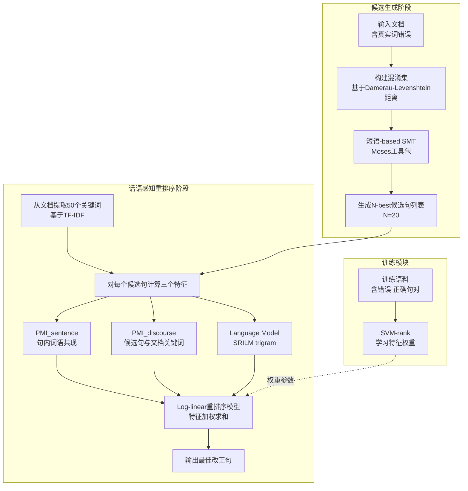

# Discourse-aware Statistical Machine Translation as a Context-Sensitive Spell Checker

## **作者信息**

| 作者 | 机构 | 身份/背景 | 领域大牛认定 |
|------|------|----------|-------------|
| Behzad Mirzababaei | 德黑兰大学电气与计算机工程学院 | 研究生/研究员 | 未认定（早期研究者） |
| Heshaam Faili | 德黑兰大学电气与计算机工程学院 | 副教授/资深研究者 | 伊朗自然语言处理领域活跃学者，在波斯语语法纠错、拼写校正方向有持续产出 |
| Nava Ehsan | 德黑兰大学电气与计算机工程学院 | 研究生/研究员 | 未认定（早期研究者） |

## **团队相关信息：**

该团队是**德黑兰大学自然语言处理与机器翻译方向的研究组**，由**Heshaam Faili带领研究生**完成。Faili本人在**波斯语NLP领域具有较高的地区影响力**，长期从事统计机器翻译、拼写纠错、语法检查等方向的研究。该团队在**波斯语上下文敏感拼写检查**领域处于前沿地位，但就全球NLP领域而言，尚未达到“资深大牛（如ACL Fellow/院士）”层级。本文可视为Ehsan & Faili (2013)工作的直接延伸。

## **论文发表时间**

| 项目 | 具体日期 | 来源/说明 |
|------|---------|----------|
| 论文发表年份 | 2013年 | 论文发表于学术会议/期刊 |
| 发表状态 | 已正式发表 | 具体会议/期刊名称在论文中未明确标注，但文献格式表明为正式发表论文 |

该论文**2013年正式发表**，属于**统计机器翻译（SMT）时代**的工作，早于深度学习和Transformer的兴起。

## **摘要**

本文提出了一种**基于话语感知的统计机器翻译（SMT）方法**，用于**上下文敏感拼写错误（即真实词错误，real-word errors）** 的检测与纠正。该方法将含有拼写错误的文本视为“源语言”，正确文本视为“目标语言”，利用**短语-based SMT**生成候选改正句子的N-best列表，再通过一个**log-linear重排序器**引入两类话语感知特征——**PMI_discourse（候选句与全文关键词的语义关联）** 和**PMI_sentence（句内词语共现强度）**——对候选列表进行重排序，并使用**SVM-rank**学习各特征的权重。实验在**波斯语真实网络文本**和**英语标准测试集（WSJ/Brown）** 上开展，结果显示：相较于基线SMT方法，波斯语真实测试集上检测召回率提升约**9.5%**，纠正召回率提升约**8.5%**；英语WSJ测试集上检测召回率提升约**5.4%**，纠正召回率提升约**5.6%**。该方法的**核心思想**是将整篇文档而非局限于句子内部作为上下文窗口，通过捕捉**远距离话语层面的语义依赖**来提升真实词错误的判别能力。

## 一、这篇论文讲了一个什么样的故事？

真实词错误（real-word errors），也称为上下文敏感拼写错误，是指**拼写本身正确但在上下文中不合语义**的词——比如把“are”误打成“arm”，形成“we arm good”这样的句子。这类错误无法依靠传统拼写检查器解决，因为目标词本身就在词典中，必须借助**上下文分析**才能判断。

传统的上下文敏感拼写纠错方法大多采用**固定长度的滑动窗口**（如±10个词、5-gram或9-gram），将其作为上下文信息源，配合**混淆集（confusion set）** 进行候选词筛选。但这类方法存在一个根本性的局限：**固定窗口无法捕捉长距离的语义依赖**。例如，判断“cat”和“car”哪个更合理，仅靠同一句子的局部上下文是不够的——如果知道整篇文档是在讨论“汽车”还是“动物”，答案就会变得清晰。

本文讲述的是这样一个故事：作者以Ehsan & Faili (2013)的**SMT-based拼写检查器**为基础，在其生成的N-best候选句列表之上，叠加一个**话语感知的重排序层**。具体地说，作者提出用**整篇文档的关键词**（而非固定窗口或单句）作为外部语义线索，通过**PMI（Pointwise Mutual Information）** 量化候选词与全文主题的关联强度，再结合句内PMI和语言模型得分，构成三个特征，输入一个**log-linear重排序模型**，使用**SVM-rank**学习特征权重，从而将最符合全文语义的正确候选句推向N-best列表顶部。

该故事的核心张力在于：**如何突破局部上下文的局限，用话语层面的语义一致性来解决词汇歧义**。实验证明，这种“先SMT生成、后话语感知重排序”的级联架构在波斯语和英语上均取得了显著提升。

## 二、本文的核心思想和创新点

### 1. 核心思想

本文的核心思想是：**将上下文敏感拼写检查从“句子级上下文分析”升级为“话语级上下文分析”**。具体地，利用SMT生成候选改正句，再用话语感知特征对候选列表进行重排序。特征设计中，**PMI_discourse**直接度量候选句与整篇文档主题的语义契合度，相当于用文档级的“主题一致性”作为判别依据。

更抽象地说，本文的认知逻辑是：

> **一个词在句子中是否正确，不仅取决于该词与相邻词的搭配是否合理，还取决于该词与文档整体主题是否一致。**

### 2. 关键创新点

| 序号 | 创新点 | 说明 |
|------|--------|------|
| 1 | **文档级上下文窗口** | 首次将整篇文档的关键词作为上下文窗口引入真实词错误检测，而非采用固定长度的N-gram窗口，突破局部上下文的限制 |
| 2 | **PMI_discourse特征** | 提出用PMI度量候选句子与全文关键词的语义关联，将话语层面的主题信息编码为可计算的特征值 |
| 3 | **两阶段级联架构** | 将SMT作为候选生成器（阶段一），将话语感知重排序作为后处理精炼器（阶段二），模块化解耦 |
| 4 | **语言无关性验证** | 在波斯语（高资源匮乏、形态丰富）和英语（高资源）两种差异显著的语言上验证方法的通用性 |
| 5 | **MRR评估引入** | 使用Mean Reciprocal Rank评估N-best列表中正确答案的排名质量，更精细地反映重排序的有效性 |

## 三、方法是怎么实现的？(How does it work?)

### 1. 架构

本文采用**两阶段级联架构**，分为**候选生成阶段（SMT-based Generation）** 与**话语感知重排序阶段（Discourse-aware Reranking）**，整体流程如下图所示。

**图注**：参考论文 **Section 4（SMT as Candidate Generator）**、**Section 5（Discourse-aware Features）** 及 **Section 5.2（Feature Weighting）** 综合绘制。

### 2. 关键算法

- **SMT候选生成算法**：使用短语-based SMT（Moses工具包）将含真实词错误的句子“翻译”为正确句子。源语言和目标语言均为同一种自然语言。通过GIZA++进行词对齐，通过SRILM训练语言模型。每个测试句子生成20个候选句（N-best list）。

- **SVM-rank权重学习算法**：使用SVM-rank（结构化SVM的一种）作为学习排序（Learning to Rank）算法，从标注训练数据中学习三个特征的权重。SVM-rank通过构造排序约束（正确候选应排名高于错误候选），在大间隔框架下优化权重向量。

- **Log-linear重排序算法**：对每个候选句子，特征向量 $\mathbf{f}(s_j)$ 与权重向量 $\mathbf{w}$ 做内积，得到排序分数 $score(s_j) = \mathbf{w} \cdot \mathbf{f}(s_j)$，按分数降序重排N-best候选列表。

- **关键词提取算法**：使用TF-IDF（词频-逆文档频率）从每篇文档中提取50个关键词，作为文档主题的紧凑表征。

### 3. 关键公式

**（1）候选句生成公式**

正确的词 $w_i^\prime$ 可以是原词 $w_i$，也可以是混淆集中包含 $w_i$ 的任意词头：

$$w_i^\prime = w_i \quad \text{或} \quad w_i^\prime = w_{j,0} \quad \text{such that} \quad \exists_{j,k} \; w_{j,k} = w_i \tag{1}$$

N-best候选句通过最大化后验概率得到：

$$\hat{C} = N\text{-argmax}_{C} \frac{P(E|C)P(C)}{P(E)} \tag{2}$$

其中，$P(E|C)$ 通过短语翻译概率估计：

$$P(E|C) = P(\bar{e}_j|\bar{c}_j) = \frac{count(\bar{e}_j, \bar{c}_j)}{\sum_{\bar{c}_j} count(\bar{e}_j, \bar{c}_j)} \tag{4}$$

**（2）PMI定义**

两个词 $A$ 和 $B$ 的PMI定义为：

$$PMI(A,B) = \frac{Doc\_Count(A,B)}{Doc\_Count(A) \times Doc\_Count(B)} \tag{5}$$

其中 $Doc\_Count(A)$ 是包含词 $A$ 的文档数，$Doc\_Count(A,B)$ 是同时包含 $A$ 和 $B$ 的文档数。

**（3）PMI_discourse特征**

候选句 $S_j = \{w_{j1}, w_{j2}, \ldots, w_{jn}\}$ 与文档50个关键词 $C_w = \{c_1, c_2, \ldots, c_{50}\}$ 的PMI：

$$PMI_{discourse}(S_j) = \frac{\sum_{k=1}^{n}\sum_{m=1}^{50} PMI(w_{jk}; c_m)}{n + 50} \tag{6}$$

**（4）PMI_sentence特征**

候选句内部词与词之间的PMI：

$$PMI_{sentence}(S_j) = \frac{\sum_{k=1}^{n}\sum_{m=k}^{n} PMI(w_{jk}; w_{jm})}{n + (n-1)/2} \tag{7}$$

**（5）评估指标**

$$Precision = \frac{\#TNC}{\#TN} \tag{9}$$

$$CorrectionRecall = \frac{\#TNC}{\#FP + \#TN} \tag{9}$$

$$DetectionRecall = \frac{\#TN}{\#FP + \#TN} \tag{9}$$

$$MRR = \frac{1}{|Q|}\sum_{i=1}^{|Q|}\frac{1}{rank_i} \tag{11}$$

其中，TNC是正确检测并纠正的真实词错误数量，TN是所有被检测出的真实词错误（无论是否纠正），FP是未被检测出的真实词错误。

## 四、实验效果 (Experimental Results)

### 1. 实验设置

**波斯语实验**：
- **训练语料**：Peykareh、Hamshahri、IRNA三个波斯语语料库，共约92万种类型（types），训练包含381,007个句对。
- **混淆集**：5,000个词头，每个平均约4个混淆词；SVM训练用混淆集含26,891个词头，每个平均4.6个混淆词。
- **语言模型**：基于Hamshahri+IRNA训练的trigram LM，含329,607个unigram、4,764,131个bigram、6,228,300个trigram。
- **测试集**：人工测试集1,100句（来自波斯语博客，含真实错误），人工注入测试集1,500句（从Peykareh随机选取，人工注入错误）。每句平均16.7个词，含1个真实词错误。
- **错误类型分布**（真实测试集）：插入27个、删除266个、替换527个、转置91个，89个错误（8%）需要多步编辑操作。
- **基线系统**：Ehsan & Faili (2013)的SMT-based方法。

**英语实验**：
- **WSJ测试集**：1,500句随机选取，人工注入真实词错误；混淆集含73,437个词头，每个平均5.9个混淆词。
- **Brown测试集**：采用Golding & Roth (1999)的设置，取20% Brown语料，应用于19个混淆集，共3,015个错误句。
- **训练数据**：WSJ剩余部分 + 80% Brown语料。

### 2. 主要结果

**波斯语结果**：

| 指标 | 人工测试集 | 提升幅度 | 真实测试集 | 提升幅度 |
|------|-----------|---------|-----------|---------|
| Precision | 0.97 | -0.01% | 0.83 | -0.01% |
| Detection Recall | 0.70 | **+16%** | 0.73 | **+9.5%** |
| Correction Recall | 0.69 | **+15%** | 0.61 | **+8.4%** |
| F-measure | 0.80 | +8.4% | 0.70 | +4.4% |
| MRR | 0.71 | +8% | 0.67 | +4% |

**英语结果**：

| 指标 | WSJ测试集 | 提升幅度 | Brown测试集 | 提升幅度 |
|------|----------|---------|-------------|---------|
| Precision | 0.97 | +0.001 | 0.96 | +0.008% |
| Detection Recall | 0.90 | **+5.4%** | 0.81 | **+2.6%** |
| Correction Recall | 0.87 | **+5.6%** | 0.78 | **+3.2%** |
| F-measure | 0.92 | +3% | 0.86 | +2.1% |
| MRR | 0.88 | +3% | 0.83 | +1% |

**核心结论**：
- 话语感知重排序在**召回率指标上带来显著提升**，说明更多真实词错误被成功检测和纠正。
- **精确率几乎无下降**，说明重排序并未引入更多假阳性（False Positive）。
- **波斯语上的提升幅度大于英语**，可能因为波斯语测试集更接近真实场景（来自博客，错误类型更自然多样），且波斯语形态丰富，局部N-gram信息更加不可靠，话语级线索的作用更为突出。
- **MRR提升**表明正确候选在N-best列表中的排名位置得到改善，验证了重排序的有效性。

### 3. 消融实验与关键发现

论文虽未设置标准消融实验（ablation study），但通过对波斯语人工测试集和真实测试集、英语WSJ和Brown测试集的多维度对比，隐含揭示了以下发现：

**（1）特征贡献分析**
- 三类特征（LM、PMI_sentence、PMI_discourse）共同作用实现重排序。
- 其中**PMI_discourse**是方法的核心差异化特征，正是它引入了文档级上下文信息，区别于传统固定窗口方法。
- PMI_sentence补充了句内语义一致性，LM补充了句法/词法流畅度。

**（2）语言普适性**
- 该方法在波斯语（低资源、形态复杂）和英语（高资源、形态简单）上均有效，说明框架的语言无关性假设成立。
- 但提升幅度存在差异：波斯语召回率提升（+9.5%~+16%）显著高于英语（+2.6%~+5.6%），暗示该方法在**局部上下文不可靠的语言**上更具价值。

**（3）方法边界条件**
- 当前实现仅处理每个句子**1个真实词错误**（人工测试集设计如此），多个真实词错误在同一句中的情况未验证。
- 包含两种测试集设计——**人工注入错误**（可控，但可能不够自然）和**真实错误**（生态效度高，但难以穷举标注）——体现了实验设计的严谨性。

**（4）知识来源对比**
- 与基于WordNet、Google Web 1T N-gram等外部资源的方法不同，本文方法的知识全部来自**训练语料的统计规律**（PMI统计 + SMT短语表 + LM），不依赖特定外部词典或知识库，增强了方法的可迁移性。

## 五. 优点与局限性

### ✅ 1. 优点

| 优点 | 说明 |
|------|------|
| **话语层面建模创新性强** | 突破传统固定窗口的局限，首次将整篇文档作为上下文窗口引入真实词错误检测，思想前沿 |
| **架构模块化解耦** | SMT生成 + 重排序的两阶段设计，便于各模块独立优化和替换，工程友好 |
| **语言无关性验证充分** | 在波斯语（形态丰富、资源有限）和英语（形态简单、资源丰富）两种差异巨大的语言上验证，说服力强 |
| **实验设计严谨** | 同时使用人工注入测试集和真实错误测试集，兼顾内部可控性和外部生态效度 |
| **F-measure和MRR双指标评估** | 不仅用分类指标（P/R/F），还引入排序指标（MRR），全面反映N-best重排序的质量 |
| **对低资源语言的实用价值高** | 在波斯语上的提升幅度显著，对缺乏大规模标注语料但存在大量真实文本的语言有实际意义 |

### ⚠️ 2. 局限性（研究边界与待解问题）

| 局限性 | 说明 |
|--------|------|
| **每个句子仅处理1个真实词错误** | 实验设计限定每句1个错误，多错误场景未验证，与真实应用可能有差距 |
| **仅依赖编辑距离构建混淆集** | 仅考虑Damerau-Levenshtein距离≤1或≤2的词对，会遗漏语义相似但编辑距离大的混淆词（如同义词、形近义近词） |
| **特征数量有限** | 仅使用3个特征（LM、PMI_sentence、PMI_discourse），未纳入POS标签、句法依存、语义角色等结构化信息 |
| **大规模文档效率未评估** | 对每句计算与50个文档关键词的PMI，文档规模增大时计算开销线性增长，实际部署效率需进一步考量 |
| **未与现代深度学习方法对比** | 发表于2013年，处于深度学习爆发前夕，未与神经网络语言模型（如LSTM、BERT）对比，可视为时代局限而非方法缺陷 |
| **外部知识库未充分利用** | 作者在未来工作展望中提及FarsNet（波斯语WordNet）可被整合，但当前版本未利用语义网络资源 |
| **词汇量（OOV）问题未讨论** | 文档关键词中若包含未登录词（OOV），PMI统计将无法计算，实际应用中鲁棒性存疑 |

## 六. 其他

### 第一性原理

本文的第一性原理可以归结为：

> **语言理解的最小单位不是句子，而是话语（discourse）。一个词的语义只有当其与更大的语义上下文——包括整篇文档的主题——保持一致时，才能被准确判断。任何仅依赖局部上下文的判断在数学上都是欠定问题。**

换言之，如果我们将语言建模看作一个“从局部信号恢复全局语义”的逆问题，那么：

- 局部N-gram模型只利用了条件概率 $P(w_i | w_{i-n+1}, \ldots, w_{i-1})$（Markov假设）
- 而真实语义的完整条件应该是 $P(w_i | \text{整篇文档的所有词})$

由于整篇文档的所有词构成的条件空间过于庞大，本文通过 **PMI_discourse + 关键词提取** 对完整条件概率进行降维近似，将文档主题压缩为50个关键词的集合，实现对完整语义条件的工程化逼近。

### 领域空白

在2013年之前，上下文敏感拼写检查的主流方法存在以下空白：

| 领域空白 | 本文的回应 |
|----------|-----------|
| **上下文窗口长度固定**（如±10词、5-gram），无法处理跨句或跨段落的长距离依赖 | 提出以**整篇文档**为上下文窗口，突破了窗口长度的硬性限制 |
| **混淆集独立使用**，候选词选择仅依赖统计共现或WordNet相似度 | 将候选选择纳入**SMT框架**，利用短语级翻译模型捕捉局部短语搭配 |
| **检测与纠错割裂**：先检测可疑词再独立纠正每个词 | 通过**句子级SMT翻译**，一次性对整个句子进行联合纠错，考虑词间相互影响 |
| **多语言验证不足**：多数方法仅针对英语 | 在**波斯语**（非英语语言）上开展大规模实验，并验证其语言无关性 |
| **排序质量评估缺失**：多数工作仅报告最终准确率，忽略候选列表的排名质量 | 引入**MRR（Mean Reciprocal Rank）** 指标，评估N-best列表中正确答案的排名位置 |

从现代视角看，本文的方法处于“**传统特征工程 + 统计机器学习**”范式的顶峰，代表了深度学习方法普及前NLP任务的最先进水平。后续研究（如基于BERT的上下文表示、基于Transformer的神经机器翻译）从端到端学习的角度解决了本文试图解决的远距离依赖问题，但本文所揭示的“文档级上下文的重要性”这一根本洞察，在LLM时代依然成立——甚至更为重要。

---
> 本文由 Deepseek AI 生成
