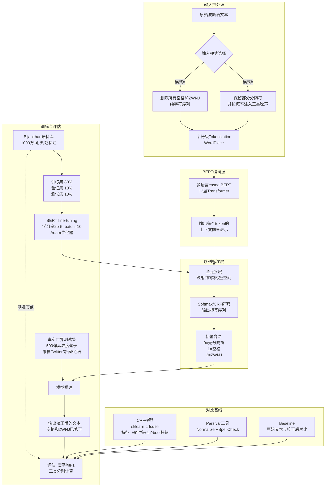

# Joint Persian Word Segmentation Correction and Zero-Width Non-Joiner Recognition Using BERT

## **作者信息**

| 作者 | 机构 | 身份/背景 | 领域大牛认定 |
|------|------|----------|-------------|
| Ehsan Doostmohammadi | 谢里夫理工大学（Sharif University of Technology） | 硕士研究生 | 未认定（早期研究者） |
| Minoo Nassajian | 谢里夫理工大学 | 硕士研究生 | 未认定（早期研究者） |
| Adel Rahimi | Dathena Science Pte. Ltd.（新加坡） | 研究科学家/工业界研究员 | 未认定（工业界研究者） |

## **团队相关信息：**

该团队是**谢里夫理工大学自然语言处理方向的研究组**与**新加坡Dathena Science公司**的产学研合作成果。谢里夫理工大学是伊朗顶尖工科院校，在波斯语NLP领域有持续产出。三位作者均为**硕博层级研究者**，目前尚未达到“资深大牛（如ACL Fellow/院士）”层级，但本工作展示了**BERT在低资源语言预处理任务上的成功应用**，具有一定的方法论参考价值。

## **论文发表时间**

| 项目 | 具体日期 | 来源/说明 |
|------|---------|----------|
| 论文发表年份 | 2020年 | 论文发表于学术会议（具体会议在文中未明确标注） |
| 技术背景 | 2020年 | BERT（2018）已发布，Transformer架构成为主流，属于**预训练语言模型在波斯语NLP中的应用早期** |

该论文**2020年正式发表**，处于**BERT后时代**，但早于GPT-3（2020年6月）和波斯语专用预训练模型（如ParsBERT）的广泛普及。

## **摘要**

本文针对波斯语书写系统中的两大痛点——**词分割错误**（单词被错误地分开或合并）和**零宽非连字（ZWNJ）识别错误**——提出了基于BERT的联合解决方案。作者将问题建模为**字符级序列标注任务**，标签空间为3类（无分隔符/空格/ZWNJ）。在**Bijankhan语料库**（1000万词）上训练，并在**500句高难度真实文本**（来自推特、新闻网站和论坛）上测试。实验对比了**条件随机场（CRF）**、**Parsivar预处理工具**和**两种BERT变体**（BERT_a：完全去除分隔符从头预测；BERT_b：保留部分分隔符并注入噪声）。结果显示，**BERT_b**以宏平均F₁-score **92.40%** 显著优于其他方法，较CRF提升28.65%，较Parsivar提升26.73%。错误分析表明，主要错误来源包括**OOV词**、**非正式口语变体**、**标签/数字粘连**及**不同书写风格**，且这些问题可通过增加训练数据覆盖加以解决。

## 一、这篇论文讲了一个什么样的故事？

想象一下这样一种语言：理论上它有明确的词分割规则——用空格隔开单词，用零宽非连字（ZWNJ）连接复合词中的自由语素——但在实际书写中，几乎没人严格遵守这些规则。有人把本该连写的词拆开（比如把"mikonam"写成"mi konam"），有人把本该分开的词粘在一起（比如"va amari"写成"va_amari"），有人该用ZWNJ的地方用了空格（如"xaney e"而非"xaney[e]"），有人该用空格的地方用了ZWNJ，还有人什么都不用。

这不是某个古代文字的问题，而是**当代波斯语书写**的日常现实。波斯语NLP从业者在处理真实世界文本时，首先要面对的就是这些“书写不规范”导致的预处理困境。传统的解决方案要么依赖**规则+字典**（如Parsivar和Hazm），要么使用**CRF等传统序列标注模型**——但这些方法要么泛化能力不足，要么无法充分利用长距离上下文信息。

本文讲的故事是：既然**BERT**已经在英语等语言的序列标注任务上展现了强大的上下文表征能力，我们能不能把它用在波斯语的词分割和ZWNJ识别上，一次性解决这两个相互纠缠的问题？更关键的是，我们应该让模型在什么样的输入形式下学习——是**完全抹去所有分隔符**，让模型从零开始推断每个空格和ZWNJ的位置，还是**保留部分分隔符并注入模拟真实错误的噪声**，让模型学会“修正”而非“重建”？

故事的张力在于**“修复”与“重建”之间的范式选择**。实验证明，保留部分信息、注入噪声的BERT_b取得了最优结果（92.40% F₁），说明了在预处理任务中，**利用已有分隔符信息+模拟真实错误分布**比完全从头预测更为有效。这一发现在方法论上具有普适意义。

## 二、本文的核心思想和创新点

### 1. 核心思想

本文的核心思想是：**将波斯语词分割校正和ZWNJ识别视为一个统一的字符级序列标注问题，利用BERT的双向上下文表征能力联合建模，并在训练时通过构造“含噪声但不完全破坏”的输入数据来更好地拟合真实世界的错误分布。**

从认知层面看，本文的底层逻辑是：

> **书写规范问题本质上是一个“从非规范书写还原规范书写”的序列映射问题。由于空格和ZWNJ本身就是字符级别的分隔符，将其预测建模为每个字符后面的状态（无分隔/空格/ZWNJ），天然适配序列标注框架。而BERT的双向Transformer架构能够捕获跨长距离的上下文信息，比传统的固定窗口CRF更适合处理句子级的语义-书写映射关系。**

### 2. 关键创新点

| 序号 | 创新点 | 说明 |
|------|--------|------|
| 1 | **首次将BERT应用于波斯语词分割+ZWNJ联合修正** | 此前波斯语预处理工作多使用规则/字典（Parsivar、Hazm）或传统统计模型（Naive Bayes），本文首次引入预训练Transformer模型 |
| 2 | **噪声注入策略的精细化设计** | 提出三种噪声注入方式（ZWNJ→空格、非连字符后空格删除、分隔符随机增删），分层次模拟真实世界错误分布，且噪声强度基于真实观察校准 |
| 3 | **输入格式的双轨对比实验** | 系统对比两种输入范式——（a）完全删除所有分隔符 vs（b）保留分隔符并加噪——揭示了“修正任务”优于“重建任务”的关键洞见 |
| 4 | **高难度真实测试集的构建** | 从推特、新闻网站和论坛收集500句高难度真实文本，包含大量极端错误情况，为后续研究提供了可复用的评测基准 |
| 5 | **与工业级工具的系统对比** | 将结果与Parsivar（当时最强大的波斯语预处理工具）进行端到端比较，用实证数据表明深度学习方法在真实场景中的优势（超越26.73% F₁） |

## 三、方法是怎么实现的？(How does it work?)

### 1. 架构

本文采用**端到端的字符级序列标注架构**，将原始波斯语文本映射为每个字符后的分隔符标签序列。整体流程如下图所示。

**图注**：参考论文 **Section 4（Methodology）** 及 **Section 3（Data）** 综合绘制。

### 2. 关键算法

**（1）序列标注建模**
将词分割校正和ZWNJ识别统一为字符级序列标注问题。输入为字符序列 $X = (x_1, x_2, ..., x_n)$，输出为标签序列 $Y = (y_1, y_2, ..., y_n)$，其中标签空间为：
- **0**：当前字符后无分隔符（字符与下一字符直接相连）
- **1**：当前字符后有空格（U+0020）
- **2**：当前字符后有ZWNJ（U+200C）

训练时，对输入字符串中的所有空格和ZWNJ字符进行特殊处理——它们本身不作为模型输入，而是作为对应前驱字符的标签。

**（2）BERT fine-tuning架构**
采用多语言cased BERT模型作为编码器，在其顶层添加一个全连接层，将BERT输出的768维向量映射到3维标签空间。损失函数为交叉熵损失，仅在每个WordPiece token的第一个子词上计算loss（遵循序列标注的标准实践），使用Adam优化器，学习率 $2\times10^{-5}$，batch size=10。

**（3）CRF基线**
使用sklearn-crfsuite实现线性链CRF。特征设计包含：
- 当前字符及前后各5个字符（共11个字符的unigram特征）
- 四个布尔特征：is_first（是否句首）、is_last（是否句末）、is_joiner（是否连字符）、is_digit（是否数字）
- L1和L2正则化系数均设为0.1，最大迭代次数100

**（4）噪声注入策略（BERT_b独有）**

对Bijankhan训练集中的每个句子，按以下方式注入三类噪声，以模拟真实世界错误：

| 噪声类型 | 操作 | 概率范围（均匀随机） | 说明 |
|---------|------|-------------------|------|
| ① | 将ZWNJ改为空格 | $r_1 \times l$，$r_1 \sim U(0, 0.15)$ | 模拟ZWNJ误用为空格（键盘相邻误触等） |
| ② | 删除非连字符后的空格 | $r_2 \times l$，$r_2 \sim U(0, 0.02)$ | 模拟词间空格遗漏 |
| ③a | 空格 → random(null, ZWNJ) | $r_3 \times l$，$r_3 \sim U(0, 0.05)$ | 随机增删/替换分隔符 |
| ③b | ZWNJ → random(null, space) | 同上 | — |
| ③c | 在字符后插入随机分隔符，或删除已有分隔符 | 同上 | — |

其中 $l$ 为句子的字符长度。噪声强度范围（15%、2%、5%）基于作者对真实语料错误的观察校准。

**关键设计差异**：BERT_a从完全“干净”（已删除所有分隔符）的输入中学习“重建”分隔符；BERT_b从“含噪声”的输入中学习“修正”分隔符。两者的输出标签空间相同，但输入分布不同，导致学习难度差异显著。

### 3. 关键公式

**评估指标（F₁-score）**

对每个类别 $c \in \{0, 1, 2\}$：

$$Precision_c = \frac{TP_c}{TP_c + FP_c}$$

$$Recall_c = \frac{TP_c}{TP_c + FN_c}$$

$$F1_c = 2 \times \frac{Precision_c \times Recall_c}{Precision_c + Recall_c}$$

宏平均F₁：

$$F1_{macro} = \frac{F1_0 + F1_1 + F1_2}{3}$$

## 四、实验效果 (Experimental Results)

### 1. 实验设置

**训练数据**：
- **Bijankhan语料库**：1000万词（约3897万字符），包含新闻、文学散文、诗歌、非正式对话等多种文体，标注规范（词分割清晰，带细粒度POS标签）
- 数据分割：训练集80%、验证集10%、测试集10%

**测试数据**：
- **Bijankhan标准测试集**：10% Bijankhan语料分割出的干净测试集
- **500句高难度真实语料**：从Twitter、新闻网站、讨论论坛收集的真实文本，刻意选取包含大量极端错误和完全正确的混合句子，共16,574词（93,355字符），以反映真实世界分布的挑战性

**对比基线**：
1. **Baseline**：500句测试集原始文本相对于校正后文本的正确率（即真实世界中自然发生的错误率）
2. **Parsivar**：当时最强大的波斯语预处理工具，使用Normalizer（statistical_space_correction=True）和SpellCheck模块
3. **CRF**：基于sklearn-crfsuite实现的传统序列标注模型
4. **BERT_a**：输入中完全删除所有空格和ZWNJ字符
5. **BERT_b**：输入中保留部分分隔符并注入三类噪声（核心方法）

### 2. 主要结果

**Bijankhan测试集结果**：

| 方法 | Class 0 F₁ | Class 1 F₁ | Class 2 F₁ | 宏平均F₁ |
|------|-----------|-----------|-----------|---------|
| Parsivar | 0.9561 | 0.7785 | 0.2355 | 0.6567 |
| CRF | 0.8923 | 0.6369 | 0.5664 | **0.6985** |
| BERT_a | 0.9937 | 0.9779 | 0.9286 | **0.9667** |
| BERT_b | 0.9963 | 0.9886 | 0.9593 | **0.9814** |

**500句高难度真实语料结果**：

| 方法 | Class 0 F₁ | Class 1 F₁ | Class 2 F₁ | 宏平均F₁ | 相对Baseline提升 |
|------|-----------|-----------|-----------|---------|-----------------|
| Baseline | 0.9823 | 0.9336 | 0.5697 | **0.8285** | — |
| Parsivar | — | — | — | **0.6567** | -20.74% |
| CRF | 0.8826 | 0.6080 | 0.4217 | **0.6375** | -23.05% |
| BERT_a | 0.9832 | 0.9488 | 0.8000 | **0.9107** | +9.92% |
| **BERT_b** | 0.9856 | 0.9592 | 0.8272 | **0.9240** | **+11.53%** |

**核心结论**：
- **BERT_b取得最优结果**：在500句真实语料上宏平均F₁=92.40%，较BERT_a提升1.33%，较CRF提升28.65%，较Parsivar提升26.73%，较Baseline提升11.53%
- **Parsivar和CRF不仅没有提升，反而降低了正确率**（F₁低于Baseline的82.85%），说明传统方法在真实高难度错误场景下完全失效，甚至引入新错误
- **Class 2（ZWNJ）是最难识别的类别**：即使BERT_b也仅达到82.72%的F₁（500句真实语料），这是因为ZWNJ的使用高度依赖于复合词的词汇语义和书写习惯，存在较大的主观性和风格差异
- **BERT_b在所有类别上均优于BERT_a**，证明“修正范式”（保留部分分隔符）优于“重建范式”（完全删除分隔符）
- **类0（无分隔符）几乎完美**：BERT_b达到98.56% F₁，说明字符粘连问题基本被解决

### 3. 消融实验与关键发现

虽然论文未设置标准消融实验（逐步移除特征/模块），但通过多方法对比隐含揭示了以下关键发现：

**（1）输入范式的影响（BERT_a vs BERT_b）**

| 对比维度 | BERT_a（重建范式） | BERT_b（修正范式） |
|---------|------------------|------------------|
| 输入 | 完全删除所有空格和ZWNJ | 保留部分分隔符 + 注入噪声 |
| 任务本质 | 从零“重建”分隔结构 | 对已有分隔符进行“修正” |
| ZWNJ F₁（500句） | 80.00% | **82.72%** |
| 宏平均F₁（500句） | 91.07% | **92.40%** |
| 训练难度 | 更高（需学习完整的词边界分布） | 更低（利用已有信息进行局部的增删改） |

关键洞察：**自然语言预处理问题中，“修正常见错误”比“完全重建”更容易，且更符合实际应用场景**——现实中用户通常会输入一些空格（尽管不完美），而非完全无分隔的字符串。

**（2）ZWNJ识别的根本性困难**

在所有方法中，Class 2（ZWNJ）的F₁始终显著低于其他两类：
- 真实语料Baseline：56.97%（说明真实文本中ZWNJ错误率极高）
- CRF：42.17%（比Baseline还差，完全失效）
- BERT_a：80.00%
- BERT_b：82.72%（最佳，但仍有近18%的错误率）

**根本原因**：
- **书写风格多样性**：ZWNJ的使用存在大量模棱两可的情况（如"pul|dar"富人、"doruq|gu"说谎者、"safaf|saizi"澄清，这些不能被严格计为错误，但不同写法均可接受）
- **词典覆盖不足**：许多复合词和外来语（如"tu'iter"推特、"damas"大马士革球队名）不在Bijankhan的训练覆盖范围内
- **连字符检测失效**：ZWNJ的错误主要表现为被误判为“0类”（无分隔符），导致连字符连接成连字，影响可读性

**（3）错误类别分析**

BERT_a和BERT_b的错误可归纳为以下7类：

| 错误类别 | 示例 | 原因 |
|---------|------|------|
| ZWNJ在ezafe前误用 | "xaney[e]" vs "xaney[e]" | Bijankhan中该写法不存在 |
| 标签符号（#）和下划线 | 推特的hashtag | 训练数据未见 |
| OOV词（专有名词、外来语） | "tu'iter"（推特）、"damas"（球队名） | 词汇表覆盖不足 |
| 数字粘连 | "1399"前后粘连 | 数字的分隔规则未被充分学习 |
| 非正式口语变体 | "e"（是，ast的短形式） | 正式语料中罕见 |
| 不同句法角色的同形词 | "xaridari|sode"（已买的，形容词）vs "xaridari sode"（被买，动词） | 语义句法歧义 |
| 打字错误和非标准拼写 | 各种拼写变异 | 训练数据以规范文本为主 |

**实验部分总结**：

本文通过**多基线对比（Parsivar/CRF/Baseline）**、**双BERT变体对比（a vs b）**、**双测试集验证（Bijankhan干净集+500句真实高难度集）** 和**细粒度错误分类分析**，系统论证了：
1. **预训练Transformer在波斯语预处理任务上的压倒性优势**（超越SOTA工具26.73%）
2. **“修正范式”优于“重建范式”** 的关键方法论洞见
3. **ZWNJ识别作为该任务的核心瓶颈**，受书写风格主观性、词典覆盖率、形态句法歧义等多重因素制约
4. **现有工业工具在真实高难度场景中的严重不足**（甚至低于Baseline），揭示了对深度学习方法强烈的现实需求

## 五. 优点与局限性

### ✅ 1. 优点

| 优点 | 说明 |
|------|------|
| **任务定义清晰、建模选择恰当** | 将两个紧密耦合的问题（词分割+ZWNJ）统一为序列标注，避免了级联错误传播 |
| **对比实验设计全面** | 涵盖传统ML（CRF）、工业工具（Parsivar）、两种BERT范式（a/b），基线设置充分 |
| **测试集设计有洞察力** | 构建“高难度真实语料”而非随机采样，更能反映实际部署场景的挑战 |
| **噪声注入策略创新且实用** | 基于真实错误观察设计的三类噪声注入方法，增强了模型对实际书写噪声的鲁棒性 |
| **“修正vs重建”对比具有普适方法论价值** | 揭示了“利用已有信息+模拟错误分布”优于“从零学习”的通用原则，可推广到其他文本规范化任务 |
| **对低资源语言NLP有示范意义** | 在多语言BERT上微调即可达到SOTA，无需训练专用波斯语BERT（ParsBERT等后续工作） |

### ⚠️ 2. 局限性（研究边界与待解问题）

| 局限性 | 说明 |
|--------|------|
| **ZWNJ识别性能仍有较大提升空间** | Class 2 F₁仅82.72%（真实语料），距离实用级预处理工具的要求（>95%）尚有明显差距 |
| **未利用Bijankhan语料的POS标签** | 作者在文中提到Bijankhan带有细粒度POS标签，但本工作未使用，而这些语法信息对ZWNJ判别（如ezafe结构）有很大帮助 |
| **测试集规模偏小** | 500句真实语料对于统计可信度略显不足，且“高难度”的选取标准可能存在主观偏差 |
| **未与波斯语专用预训练模型对比** | 2020年已有ParsBERT等波斯语专用BERT模型，但本文仅使用多语言BERT，未探索专用模型的上限 |
| **噪声参数基于作者观察而非系统调优** | 三类噪声的概率范围（15%/2%/5%）缺乏系统性的超参数优化验证 |
| **未评估对下游NLP任务的影响** | 论文未验证词分割校正对NER、依存句法分析、机器翻译等下游任务的提升效果，生态效度论证不足 |
| **错误分类与评估指标的冲突** | 文中承认“不同书写风格”不应严格计为错误，但F₁评估指标将这些情况一律算作False，导致性能被低估 |
| **未处理拼写错误（非ZWNJ/空格问题）** | 方法仅关注分隔符修正，不涉及字符插入/删除/替换等真实拼写错误 |

## 六. 其他

### 第一性原理

本文的第一性原理可以归结为：

> **自然语言中的书写规范（如空格和ZWNJ）本质上是语义结构在字符层面的“投影”——它们是语言系统为了方便阅读而约定俗成的视觉标记，而非语言本身固有的属性。因此，从非规范书写中恢复规范形式，实际上是一个“从观测（非规范字符序列）反推隐结构（规范词边界）”的贝叶斯推断问题。**

在这个框架下：
- **观测** $X$ = 含错误的字符序列（空格/ZWNJ缺失、错位、多余）
- **隐结构** $Y$ = 每个字符后的正确分隔状态（0/1/2）
- **语言模型先验** $P(Y)$ = 不同分隔模式的语言学合理性（由BERT通过预训练学习）
- **观测似然** $P(X|Y)$ = 从规范形式到非规范形式的错误生成过程（由噪声注入策略模拟）

传统的CRF方法使用有限窗口特征（±5字符）来近似 $P(Y|X)$，本质上做了一个**局部马尔可夫假设**——即当前位置的分隔状态只与邻近几个字符有关。但本文通过引入BERT，用**自注意力机制**替代了局部窗口，实现了对整个句子的全局上下文建模，从根本上突破了局部近似的限制。

此外，**BERT_b优于BERT_a**这一发现也可以从贝叶斯角度解释：当输入完全删除所有分隔符（BERT_a）时，模型实际上是在求解一个**更高熵的后验分布**——因为每个字符后都可能出现任何一类分隔符，搜索空间巨大。而当输入保留部分分隔符并注入噪声（BERT_b）时，模型可以**从一个更接近真实分布的起点开始进行局部修正**，有效降低了推断的熵，因此更容易收敛到正确答案。

### 领域空白

在2020年之前，波斯语词分割和ZWNJ修正领域存在以下空白：

| 领域空白 | 本文的回应 |
|----------|-----------|
| **深度学习方法空白**：此前波斯语预处理主要依赖规则/字典（Hazm、Parsivar）或传统统计模型（Naive Bayes in Parsivar），未见深度序列标注模型的应用 | 首次将**BERT**引入该任务，用Transformer架构的双向上下文表征替代人工特征工程 |
| **联合建模缺失**：词分割和ZWNJ修正通常被作为独立子任务处理（如Parsivar分别用统计和规则方法），忽视了二者的紧密耦合关系 | 将两任务统一为**单一序列标注框架**，实现联合学习，避免错误传播 |
| **真实世界错误分布建模不足**：此前方法多为确定性规则，不具备对真实书写噪声分布的泛化能力 | 设计**三类噪声注入策略**，参数基于真实观察校准，使模型能够模拟实际错误模式 |
| **真实场景验证不足**：此前评估多在干净语料上进行，与实际部署条件脱节 | 构建**500句高难度真实语料**（含Twitter/论坛/新闻的错误文本），贴近实际应用场景 |
| **传统方法在真实场景中的失效被揭示**：Parsivar和CRF在500句语料上的F₁甚至低于Baseline（82.85%→65.67%），即它们**添加了比修正更多的错误** | 通过系统对比实验，首次清晰揭示了**工业级工具在真实高难度场景中的局限性**，为深度学习方法的必要性提供了实证依据 |

从现代视角看，本文的工作发生在**多语言BERT已发布、但波斯语专用预训练模型尚未普及**的过渡期。后续研究（如ParsBERT、BERT-base-fa）在更大的波斯语语料上继续提升了性能，但本文揭示的“修正优于重建”范式洞见、真实场景测试集构建方法论、以及噪声注入策略的设计思路，对更广泛的**文本规范化（text normalization）** 和**低资源语言预处理**任务仍具有普遍参考价值。

---

> 本文由 Deepseek AI 生成