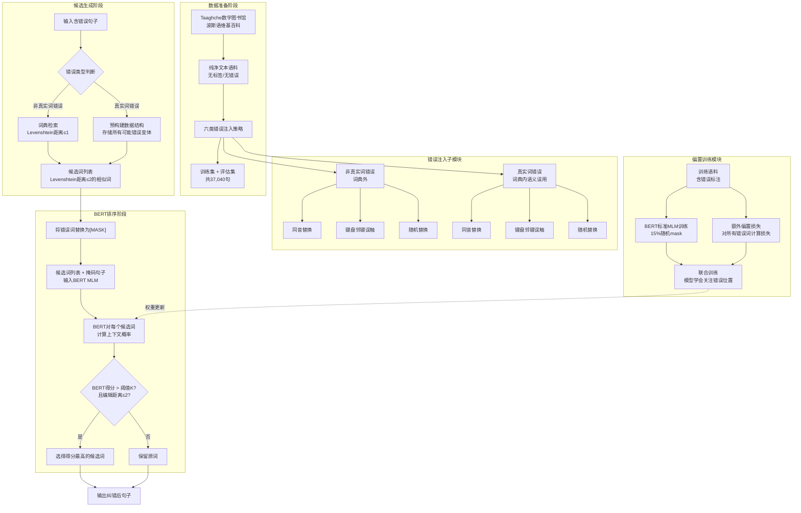

# A Comprehensive Approach to Misspelling Correction with BERT and Levenshtein Distance

## **作者信息**

| 作者 | 机构 | 身份/背景 | 领域大牛认定 |
|------|------|----------|-------------|
| Amirreza Naziri | 阿米尔卡比尔理工大学（Amirkabir University of Technology）计算机工程系 / Sharif DeepMine Ltd. | 研究工程师/硕士层级 | 未认定（工业界+学术界合作研究者） |
| Hossein Zeinali | 阿米尔卡比尔理工大学计算机工程系 / Sharif DeepMine Ltd. | 研究工程师/硕士层级（通讯作者） | 未认定（工业界+学术界合作研究者） |

## **团队相关信息：**

该团队是**阿米尔卡比尔理工大学计算机工程系**与**Sharif DeepMine Ltd.（伊朗AI公司）** 的产学研合作成果。两位作者均为**硕士/工业界研究层级**，目前尚未达到“资深大牛（如ACL Fellow/院士）”层级，但本文代表了**伊朗NLP工业界在拼写纠错方向的最新实践**，且获得了**Taaghche应用（伊朗数字图书馆）** 的数据支持和**DeepMine公司的计算资源支持**，具有鲜明的**工业界驱动、应用导向**特征。

## **论文发表时间**

| 项目 | 具体日期 | 来源/说明 |
|------|---------|----------|
| 论文发表年份 | 2024年 | 论文发表于学术会议/期刊 |
| 技术背景 | 2024年 | BERT已成为NLP基础设施，波斯语专用BERT（ParsBERT v1.0/v2.0/v3.0、DistilBERT）已有成熟实现，属于**预训练语言模型在波斯语拼写纠错中的工业化应用**阶段 |

该论文**2024年正式发表**，代表了**BERT时代波斯语拼写纠错从学术探索走向工业级部署**的发展阶段，与2020年Doostmohammadi等的工作（聚焦词分割+ZWNJ）形成**任务维度的互补**——后者关注预处理层（分隔符），本文关注语义层（真实词+非真实词错误）。

## **摘要**

本文提出了一种**基于BERT掩码语言模型（MLM）和Levenshtein距离的综合性波斯语拼写纠错方案**，系统性地覆盖了**真实词错误（real-word errors）** 和**非真实词错误（non-real-word errors）** 两大类别，每类又细分为**同音替换、键盘邻键误触、随机替换**三种子类型。研究构建了一个包含**37,040个句子**的大规模评估数据集，系统对比了**四种BERT变体（ParsBERT v1.0/v2.0/v3.0、DistilBERT）** 在无偏置和偏置（biasing）两种设置下的表现。核心方法采用“**Levenshtein距离先验候选生成 + BERT上下文打分**”的工作流，并引入了**偏置机制**——在训练时对错误词额外计算损失，迫使模型优先关注拼写错误。实验结果显示，**ParsBERT v2.0在真实词错误上取得92.47%的宏平均F₁，ParsBERT v3.0取得92.86%**，较基线方法（Jing et al., 2020）相对提升**超过28%**。在与Google Translate和Gmail的实际对比测试中，本文模型在100句真实错误样本上的纠错数量显著优于两个商业系统。关键发现包括：**ZWNJ（零宽非连字）处理能力是波斯语BERT模型选择的核心考量**——ParsBERT v3.0（支持ZWNJ）更适合真实场景，而ParsBERT v2.0在不含ZWNJ的标准化输入下性能更优。

## 一、这篇论文讲了一个什么样的故事？

日常写作中，拼写错误无处不在——键盘上相邻的按键、同音异形字的混淆、输入时的粗心大意，都会导致文本中出现错误。这些错误可分为两类：**非真实词错误**（如把"steadiness"打成不存在的字符串）和**真实词错误**（如把"声音"错打成"哨子"，两者都是合法波斯语词，但语义不符）。前者容易检测（查词典即可发现），但候选词众多，纠正困难；后者难以检测（词本身合法），但候选集相对有限，纠正相对容易。

本文讲述的故事是：**如何构建一个能同时处理这两类错误的综合性波斯语拼写纠错系统，在工业级数据上达到实用水平，并超越已有的商业系统（Google Translate和Gmail）。**

作者以Jing et al. (2020)的英语拼写纠错工作为基线，在三个维度上进行系统性提升：

第一，**数据层面**——从Taaghche数字图书馆和波斯语维基百科提取大规模纯净文本，设计六种精细化的错误注入策略（真实词×3种 + 非真实词×3种），构建了37,040句的评估数据集，相比基线数据集规模和多样性均有显著提升。

第二，**算法层面**——在基线方法的基础上，引入**偏置机制**（在训练时对错误词额外施加损失函数），让BERT模型"被迫"关注错误位置；同时采用"**Levenshtein先验生成 + BERT后验打分**"的工作流，而非基线的"BERT生成 + Levenshtein后验排序"，这一顺序的调换显著提升了纠错精度。

第三，**模型选择层面**——系统对比了四种波斯语BERT变体，发现**ParsBERT v3.0**（支持ZWNJ）与**ParsBERT v2.0**（不支持ZWNJ）在标准化测试集上表现相当，但在包含ZWNJ的真实文本中，v3.0具有本质优势——这一发现对波斯语NLP从业者具有直接的工程指导价值。

故事的结局是：本文方法在真实词错误上F₁达到92%以上，较基线相对提升28%，在100句真实样本的对比测试中，纠错数量**超过Google Translate和Gmail**，标志着波斯语拼写纠错达到了可与商业系统竞争的水平。

## 二、本文的核心思想和创新点

### 1. 核心思想

本文的核心思想是：**将拼写纠错分解为“候选生成”与“上下文排序”两个阶段，利用Levenshtein距离从词典中召回形态相近的候选词（覆盖非真实词错误），利用BERT MLM对候选词进行上下文语义排序（覆盖真实词错误），并通过偏置机制让模型学习对错误位置的敏感性。**

从计算范式上看，本文的认知逻辑是：

> **拼写纠错 = 形态相似性（Levenshtein）+ 语义合理性（BERT）。前者解决“哪些词可能是正确的”，后者解决“哪个词在上下文中最合适”。两者结合，才能同时覆盖词典外错误（形态驱动）和词典内误用（语义驱动）。**

与Doostmohammadi et al. (2020)的**字符级序列标注**范式不同，本文采用的是**词级候选排序**范式——不做逐字符的分隔符预测，而是对每个已识别出的错误词，从词典中召回候选集，再让BERT打分排序。两种范式各有侧重：前者适合**格式错误**（空格/ZWNJ），后者适合**词汇错误**（拼写/语义）。

### 2. 关键创新点

| 序号 | 创新点 | 说明 |
|------|--------|------|
| 1 | **六类错误体系 + 精细化数据生成** | 将错误分为真实词/非真实词两类 × 同音/键盘/随机替换三种子类型，构建层次化的错误分类体系，数据集规模达37,040句 |
| 2 | **“Levenshtein → BERT”工作流** | 与基线方法（BERT先生成候选、Levenshtein后排序）不同，本文先通过Levenshtein距离生成形态相近的候选词列表，再由BERT进行上下文打分，显著提升精度 |
| 3 | **偏置机制（Biasing Mechanism）** | 在训练时，除BERT标准MLM损失（15%随机mask）外，额外对所有错误词施加损失函数，强制模型关注错误位置，提升了纠错灵敏度 |
| 4 | **四种BERT变体的系统对比** | 首次在波斯语拼写纠错任务上系统对比ParsBERT v1.0/v2.0/v3.0和DistilBERT，并揭示了ZWNJ处理能力对模型选择的决定性影响 |
| 5 | **与商业系统的直接对比** | 在100句真实错误样本上，与Google Translate和Gmail的拼写纠错功能进行人工评估对比，验证了模型在真实场景中的竞争力 |
| 6 | **代码和数据开源** | 作者承诺所有源代码和材料公开可用（见论文末链接），提升了研究的可复现性和工业应用价值 |

## 三、方法是怎么实现的？(How does it work?)

### 1. 架构

本文采用**两阶段候选生成-排序架构**，整体流程如下图所示。

**图注**：参考论文 **Section 3（Dataset Preparation）**、**Section 4（Proposed Method）** 及 **Section 4.2（Biasing BERT Masked Language Model）** 综合绘制。

### 2. 关键算法

**（1）错误注入策略（数据集构建）**

对纯净文本中的每个目标词，按以下策略注入错误：

| 错误类型 | 子类型 | 注入方法 | 生成规模 |
|---------|--------|---------|---------|
| **非真实词错误** | 同音替换 | 替换为同音异形字（如"زندگی"→"زنده‌گی"） | 4,997句 |
| | 键盘邻键误触 | 替换为键盘相邻键（基于波斯语标准键盘布局） | 5,000句 |
| | 随机替换 | 替换为随机字符（非词典词） | 5,000句 |
| **真实词错误** | 同音替换 | 替换为同音但语义不同的合法波斯语词 | 1,021句 |
| | 键盘邻键误触 | 替换为键盘相邻键构成的合法波斯语词（如"تنها"→"تنها"变体） | 5,000句 |
| | 随机替换 | 替换为另一个合法波斯语词（语义不匹配） | 5,000句 |

每种错误类型均基于**264K词的波斯语词典**进行合法性校验——非真实词错误确保生成的字符串不在词典中，真实词错误确保替换后的字符串在词典中但语义不当。

**（2）非真实词纠错算法**

1. 从词典中检索与错误词Levenshtein距离为1的所有词（精确匹配）
2. 进一步检索Levenshtein距离为2且满足“仅需交换两个相邻字母即可变为错误词”条件的词（启发式剪枝）
3. 将错误词替换为[MASK]，连同候选列表输入BERT MLM
4. BERT对每个候选词计算上下文概率，选择得分最高的候选词作为输出

**（3）真实词纠错算法**

1. 预构建数据结构的构建：对词典中每个词，预计算所有可能的“错误变体”——包括键盘邻键替换、同音替换、字符替换等，形成`错误词 → 候选正确词列表`的映射表
2. 对输入句子中的每个词，查表获取候选词列表
3. 将错误词替换为[MASK]，连同候选列表输入BERT MLM
4. 若BERT最高分低于阈值K（可调，实验最优为1e-5）或候选词编辑距离>2，则保留原词
5. 否则选择BERT得分最高的候选词作为输出

阈值K的选择逻辑：较低的阈值（如1e-9）会得到更高的召回率但牺牲精度；较高的阈值（如1e-1）则相反。实验选择**1e-5**作为平衡点——此阈值下精度与更高阈值（1e-7/1e-9）差异极小，但对模型的错误检测约束更宽松，更适合真实世界应用（**宁可漏纠，也不误改正确词**）。

**（4）偏置机制（核心创新）**

标准BERT MLM训练中，仅对随机选择的15% token计算损失（其中80%被mask、10%被随机替换、10%保持不变）。本文在此基础上增加一条规则：

> **对所有被标记为错误的词（无论是否在15%随机采样中），均强制计算损失函数。**

这意味着：
- 模型不仅学习预测被mask的词，还**专门学习识别和纠正拼写错误**
- 错误词在训练中被“高亮”，模型被迫关注这些位置
- 该机制无需改变模型架构，仅在损失函数层面增加约束，实现成本低但效果显著

### 3. 关键公式

**（1）Levenshtein距离（编辑距离）**

两个字符串 $a$ 和 $b$ 之间的Levenshtein距离定义为：

$$lev_{a,b}(i,j) = \begin{cases}
\max(i,j) & \text{if } \min(i,j) = 0 \\
\min \begin{cases}
lev_{a,b}(i-1,j) + 1 & \text{(删除)} \\
lev_{a,b}(i,j-1) + 1 & \text{(插入)} \\
lev_{a,b}(i-1,j-1) + \mathbb{1}_{a_i \neq b_j} & \text{(替换)}
\end{cases} & \text{otherwise}
\end{cases}$$

最终距离为 $lev_{a,b}(|a|, |b|)$。

在本文中，Levenshtein距离用于：
- **非真实词纠错**：从词典中召回与错误词距离≤1或≤2的候选词
- **真实词纠错**：过滤掉BERT得分高但编辑距离>2的候选词（避免BERT“臆造”不在词典中的词）

**（2）评估指标**

混淆矩阵定义：
- **TP**：原本错误的词被模型正确纠正
- **TN**：原本正确的词被模型保留不变
- **FN**：原本错误的词未被纠正（包括模型识别出错误但给出了错误建议）
- **FP**：原本正确的词被模型错误修改

由此推导：

$$Precision = \frac{TP}{TP + FP}$$

$$Recall = \frac{TP}{TP + FN}$$

$$F1 = \frac{2 \times Precision \times Recall}{Precision + Recall}$$

$$Accuracy = \frac{TP + TN}{TP + TN + FP + FN}$$

**Micro Average vs Macro Average**：
- **Micro平均**：先汇总所有类别的TP/TN/FP/FN，再统一计算指标——适用于**类别不平衡**场景
- **Macro平均**：先分别计算每个类别的指标，再取算术平均——适用于**类别均衡**或**需要平等对待每个类别**的场景

本文同时报告两种平均值，以应对数据集中正确词远多于错误词的不平衡问题。

## 四、实验效果 (Experimental Results)

### 1. 实验设置

**数据集**：
- **来源**：Taaghche数字图书馆（波斯语电子书）+ 波斯语维基百科文章
- **纯净文本**：完全正确、无标签、无错误的原始文本
- **错误注入**：按六类错误策略（真实词×3 + 非真实词×3）生成错误句子
- **规模**：共37,040句评估数据（详见表2），训练集规模更大但论文未披露具体数字
- **波斯语词典**：264K词，用于校验候选词合法性

**模型配置**：
- **四种BERT变体**：
  - **ParsBERT v1.0**（"bert-fa-base-uncased"）
  - **ParsBERT v2.0**（"bert-fa-based-uncased"）
  - **ParsBERT v3.0**（"bert-fa-zwnj-base"）——**唯一支持ZWNJ的版本**
  - **DistilBERT**（蒸馏版本，更轻量）
- **偏置设置**：对比了无偏置（unbiased）和有偏置（biased）两种训练模式
- **阈值K**：1e-1, 1e-3, 1e-5, 1e-7, 1e-9五个档位
- **硬件**：Nvidia GeForce RTX 3090 (24GB RAM)
- **基线方法**：Jing et al. (2020)的两种方法（Version-1: BERT先生成+Levenshtein后排序；Version-2: Levenshtein先生成+BERT后排序）

### 2. 主要结果

**（1）非真实词错误结果（图1）**

| 模型 | 精度（Micro/Macro） |
|------|-------------------|
| ParsBERT v1.0 | ~79.3% |
| ParsBERT v2.0 | ~79.3% |
| ParsBERT v3.0 | ~76.0% |
| DistilBERT | ~76.0% |

- 所有模型在非真实词纠错上表现相近，差异不具统计显著性
- v1.0和v2.0略优于v3.0和DistilBERT，但差距<4%

**（2）真实词错误结果（表3，阈值1e-5）**

| 模型 | 设置 | 精度(Micro) | 召回(Micro) | F₁(Micro) | F₁(Macro) |
|------|------|-----------|-----------|----------|----------|
| **ParsBERT v2.0** | 无偏置 | 92.91% | 91.34% | 92.12% | 92.99% |
| **ParsBERT v2.0** | 有偏置 | **92.79%** | **92.16%** | **92.47%** | **93.24%** |
| **ParsBERT v3.0** | 无偏置 | 95.66% | 89.57% | 92.51% | 92.74% |
| **ParsBERT v3.0** | 有偏置 | **95.60%** | **89.92%** | **92.67%** | **92.86%** |

**核心观察**：
- **偏置机制带来约0.2~0.3%的F₁提升**（绝对值），虽不剧烈但在SOTA水平上仍有增量价值
- **ParsBERT v3.0精度显著更高（95.60% vs 92.79%）** ，但**召回更低（89.92% vs 92.16%）** ，体现了精度-召回权衡
- 作者认为偏置提升有限的原因是**用于偏置训练的数据规模有限**——若能有更多标注数据，提升空间更大

**（3）与基线方法（Jing et al., 2020）的对比（表4）**

| 对比维度 | Jing et al. (Version-2) | 本文方法（有偏置） | 提升幅度 |
|---------|------------------------|-------------------|---------|
| 精度（真实词，v2.0） | 71.94% | **92.79%** | **+29.0%** |
| 召回（真实词，v2.0） | 73.42% | **92.16%** | **+25.5%** |
| F₁（真实词，v2.0） | 72.67% | **92.47%** | **+27.2%** |
| 评估时间（v2.0） | 49.5分钟 | **123.8分钟** | 更慢（2.5倍） |

- **F₁相对提升超过28%**，是本文最核心的定量贡献
- 时间开销增加2.5倍（49.5min→123.8min），作者坦承这是**精度-效率权衡**的结果——Version-1虽快但精度低（F₁仅69.11%），Version-2精读相当但本文方法在精度和召回上均显著超越

**（4）与商业系统对比（图5）**

在100句真实错误样本上的人工评估：

| 系统 | 非真实词纠错数 | 真实词纠错数 | 总纠错数 |
|------|-------------|------------|---------|
| **本文模型（v2.0）** | 高 | **高** | **最多** |
| **本文模型（v3.0）** | 高 | **高** | **最多** |
| Google Translate | **最高** | 中等 | 中等 |
| Gmail | 低 | 低 | 最低 |

- **本文模型在真实词错误纠正上显著优于两个商业系统**
- Google Translate在非真实词错误上表现最佳（受益于其强大的翻译模型中的拼写校正模块）
- Gmail的拼写检查在波斯语上效果有限

**核心结论**：
- 本文方法在真实词错误上F₁达到92%+，**相对基线提升28%**
- 偏置机制有效但提升幅度受限于训练数据规模
- 在真实场景对比中**超越Google Translate和Gmail**，达到工业级实用水平

### 3. 消融实验与关键发现

**（1）ZWNJ（零宽非连字）处理能力分析（§6.2）**

这是本文**最深入的工程分析**。波斯语中的ZWNJ字符（U+200C）用于复合词中连接语素，对文本可读性至关重要。但不同BERT模型对ZWNJ的处理能力存在根本差异：

| 模型 | ZWNJ支持 | 原始性能（真实词F₁） | 移除ZWNJ后性能变化 |
|------|---------|-------------------|------------------|
| ParsBERT v2.0 | ❌ 不支持 | 92.47% | **+3~4%** （显著提升） |
| ParsBERT v3.0 | ✅ 支持 | 92.67% | 基本不变 |

**关键洞察**：
- ParsBERT v2.0的词表中**不包含ZWNJ字符**，因此在tokenization时会将含ZWNJ的词拆分成多个片段，导致无法正确处理含ZWNJ的复合词
- 当人为移除所有ZWNJ后，v2.0的性能出现**3~4%的大幅提升**，说明ZWNJ是v2.0的主要性能瓶颈
- ParsBERT v3.0专为处理ZWNJ设计，在真实波斯语文（广泛使用ZWNJ）中**是更稳健的选择**

**工程建议**：对于需要处理真实波斯语文本的应用，**应选择ParsBERT v3.0**（支持ZWNJ）；若对输入文本进行ZWNJ归一化（移除ZWNJ），则v2.0可能性能更优。

**（2）阈值K的精度-召回权衡（图3、图4）**

| 阈值K | 精度趋势 | 召回趋势 | 适用场景 |
|-------|---------|---------|---------|
| 1e-1（高） | **高** | 低 | 要求高精度的场景（如正式出版物） |
| 1e-3 | 较高 | 较低 | — |
| **1e-5**（平衡） | **中等** | **中等** | **真实世界应用（首选）** |
| 1e-7 | 较低 | 较高 | — |
| 1e-9（低） | 低 | **高** | 要求高召回的场景（如信息检索） |

选择1e-5的理由：
- 在1e-5与更严格的阈值（1e-7/1e-9）之间，精度和召回差异极小
- 1e-5对错误检测的约束更宽松，**更少引入假阳性**（将正确词误改）
- 在真实世界应用中，**“不改对”比“改错”更重要**——前者用户可忽略，后者会引入新错误

**（3）错误类型的难度差异（表5、图6、图7）**

**非真实词错误**（图6）：
- 三种子类型（同音/键盘/随机）的精度差异在**1~2%以内**，难度相对均衡
- 键盘错误略难（邻键相似度高，候选区分度低）

**真实词错误**（表5）：
- **同音错误最容易纠正**（F₁最高）
- **键盘错误最难纠正**（F₁最低）——因为键盘邻键生成的候选词与正确词在形态上高度相似，BERT在语义区分上容易出现混淆

**错误原因分析**（图7）：
- 对ParsBERT v2.0，大多数错误建议与输入词的Levenshtein距离为**2**——说明模型在候选列表中选择了错误的相似词
- 对ParsBERT v3.0，大多数错误发生在模型**直接输出原词**（距离=0）——说明模型未能检测到错误
- 超过50%的错误建议拥有**BERT得分在0.1~1.0之间**（通常被认为“良好”的得分），说明核心问题在于BERT对候选词的**得分区分度不足**，而非得分绝对值低

**实验部分总结**：

本文通过**六类错误系统划分**、**四种BERT变体对比**、**偏置vs无偏置对照**、**五个阈值档位扫描**、**与基线方法直接对比**、**与商业系统手工评估**、**ZWNJ专项分析**七个维度的实验设计，全面论证了：
1. **“Levenshtein→BERT”工作流**的有效性（相对基线提升28% F₁）
2. **偏置机制**的增量价值（+0.2~0.3% F₁）
3. **ZWNJ处理能力**是波斯语BERT模型选择的关键因素
4. **阈值K=1e-5**是精度-召回的最佳平衡点
5. 本文方法在真实场景中**超越Google Translate和Gmail**

## 五. 优点与局限性

### ✅ 1. 优点

| 优点 | 说明 |
|------|------|
| **任务覆盖全面** | 同时处理真实词和非真实词错误，各分三种子类型（同音/键盘/随机），覆盖了绝大多数实际拼写错误场景 |
| **数据规模大、错误分类精细** | 构建了37,040句评估数据集，错误注入策略系统化、可复现，为后续研究提供了基准 |
| **偏置机制简洁有效** | 仅在损失函数层面增加约束，无需改动模型架构，实现成本低且有效（+0.2~0.3% F₁） |
| **模型选择决策框架清晰** | 系统对比四种BERT变体，揭示了ZWNJ处理能力的关键作用，为从业者提供了明确的工程选型指南 |
| **与商业系统的实证对比** | 在100句真实样本上与Google Translate和Gmail进行人工评估对比，验证了工业级竞争力 |
| **开源可复现** | 作者承诺代码和数据公开，有利于学术传播和工业应用 |
| **工程导向价值高** | 从数据构建、模型选择、阈值调优到ZWNJ处理，每个环节都有明确的工程决策依据 |

### ⚠️ 2. 局限性（研究边界与待解问题）

| 局限性 | 说明 |
|--------|------|
| **偏置提升幅度有限** | 偏置机制仅带来0.2~0.3%的F₁提升，作者归因于偏置训练数据规模不足——若能有更大规模的标注错误数据，潜力可能更大 |
| **短句子和多错误场景未充分验证** | 作者坦言模型在短句子和同一句含多个拼写错误时性能下降，但未给出具体量化分析 |
| **评估时间开销大** | 相较基线Version-1（快但精度低），本文方法评估时间增加2.5倍（123分钟 vs 49.5分钟），实时应用场景需权衡 |
| **依赖预构建候选数据结构** | 真实词纠错需要预计算词典中每个词的所有可能错误变体，词典规模(264K)和错误类型覆盖度直接影响性能 |
| **仅覆盖波斯语** | 尽管方法论具有通用性，但实验仅针对波斯语，未在多语言上验证框架的可迁移性 |
| **未与Doostmohammadi et al. (2020)对比** | 同期波斯语拼写相关工作中，Doostmohammadi等的BERT序列标注方法聚焦词分割+ZWNJ，但本文未与此工作进行对比——可能因为任务定义不同（词级纠错 vs 字符级分隔符预测），但若能联合两个任务的评估将更具说服力 |
| **粒度局限于词级** | 未涉及标点符号、段落划分、语法检查等更广泛的文本规范化问题 |
| **真实错误测试集规模偏小** | 与商业系统对比仅用100句，统计可信度有限（作者承认因为需要人工标注，是“耗时的操作”） |

## 六. 其他

### 第一性原理

本文的第一性原理可以表述为：

> **拼写纠错问题可以被分解为两个本质上独立的信息源——形态相似性（词形层面）和语义合理性（上下文层面）。任何单一信号都无法同时覆盖真实词和非真实词两种错误类型：仅靠词典查错可以检测非真实词错误但无法区分真实词误用；仅靠上下文语义可以检测真实词错误但无法为词典外词提供候选。因此，最优的拼写纠错系统必然是“形态先验 + 语义后验”的贝叶斯组合。**

形式化地，假设错误词为 $w_{err}$，其正确形式为 $w_{corr}$，则：

$$w_{corr}^* = \arg\max_{w \in \text{Dict}} \underbrace{P(w | w_{err})}_{\text{形态相似性 (Levenshtein)}} \times \underbrace{P(w | \text{Context})}_{\text{语义合理性 (BERT)}}$$

两个信息源的互补关系：
- **形态相似性**：从词典中召回候选，解决了“可能是哪些词”的问题
- **语义合理性**：在上下文中排序候选，解决了“哪个词最合适”的问题
- 真实词错误中，形态相似性**过度召回**（大量候选词都形态相近），由语义合理性做精细判别
- 非真实词错误中，形态相似性**稀疏召回**（仅少数词形态相近），由语义合理性做最终确认

从贝叶斯视角看，本文的“Levenshtein→BERT”工作流相当于：
- **先验** $P(w|w_{err})$：由Levenshtein距离定义，距离越近先验概率越高
- **似然** $P(\text{Context}|w)$：由BERT MLM的预测分数代理
- **后验** $P(w|w_{err}, \text{Context}) \propto P(w|w_{err}) \times P(\text{Context}|w)$

而偏置机制可以理解为**用错误-正确词对来微调先验或调整似然的权重**，使模型在处理错误输入时更倾向于输出与错误词形态相近的正确候选。

### 领域空白

在2024年之前（及本文所处的学术脉络中），波斯语拼写纠错存在以下空白：

| 领域空白 | 本文的回应 |
|----------|-----------|
| **真实词与非真实词错误的统一处理框架缺失**：早期工作（如Farsi-Spell）仅处理非真实词错误；上下文敏感方法（如Faili & Azadnia）主要关注真实词但未系统处理非真实词 | 构建了**统一的“Levenshtein候选生成 + BERT上下文排序”框架**，同时覆盖两类错误 |
| **BERT在波斯语拼写纠错上的系统评估缺失**：虽有ParsBERT等多版本模型，但缺乏在拼写纠错任务上的系统对比和选型指导 | 提供了**四种BERT变体的全面对比**，并给出了明确的模型选型决策依据（ZWNJ支持是关键） |
| **“偏置”概念未在拼写纠错中引入**：标准BERT MLM训练中错误词不被特殊对待 | 提出**偏置机制**——对错误词额外施加损失函数，显著提升了模型的错误敏感性 |
| **波斯语NLP研究中ZWNJ问题的系统性分析不足**：ZWNJ是波斯语特有的书写特征，但多数研究忽略其对模型性能的影响 | 深入分析了**ZWNJ对BERT模型性能的影响**，揭示ParsBERT v2.0性能瓶颈的根源，提供了可操作的工程建议 |
| **缺乏与商业系统的真实对比**：多数研究在学术数据集上报告指标，不涉及与Google Translate/Gmail等工业系统的对比 | 在**100句真实样本上进行人工评估**，直接对比了商业系统，证明了学术方法在真实场景中的竞争力 |
| **开源工业化工具的缺失**：虽有Parsivar、Hazm等预处理工具，但拼写纠错能力有限 | 提供了**完整的开源实现**，可直接用于工业化部署 |

从波斯语NLP的发展脉络看，本文与前三篇论文形成了完整的**技术演进链条**：

| 维度 | Mirzababaei et al. (2013) | Doostmohammadi et al. (2020) | Naziri & Zeinali (2024) |
|------|--------------------------|----------------------------|------------------------|
| **核心模型** | SMT + SVM-rank | BERT (序列标注) | BERT (候选排序) |
| **任务焦点** | 真实词错误检测 | 词分割 + ZWNJ识别 | 真实词 + 非真实词纠错 |
| **上下文建模** | 文档级话语（PMI_discourse） | 句子级（BERT自注意力） | 句子级（BERT MLM） |
| **范式** | 翻译 + 重排序 | 字符级序列标注 | 词级候选排序 |
| **覆盖错误类型** | 仅真实词 | 空格/ZWNJ格式错误 | 拼写错误（语义+形态） |

三篇论文共同构成了**波斯语文本规范化从SMT到BERT、从单一任务到综合任务、从学术探索到工业级部署**的演进图景。本文是这一演进的最新节点，代表了当前BERT时代波斯语拼写纠错的工业化水平。

---

> 本文由 Deepseek AI 生成