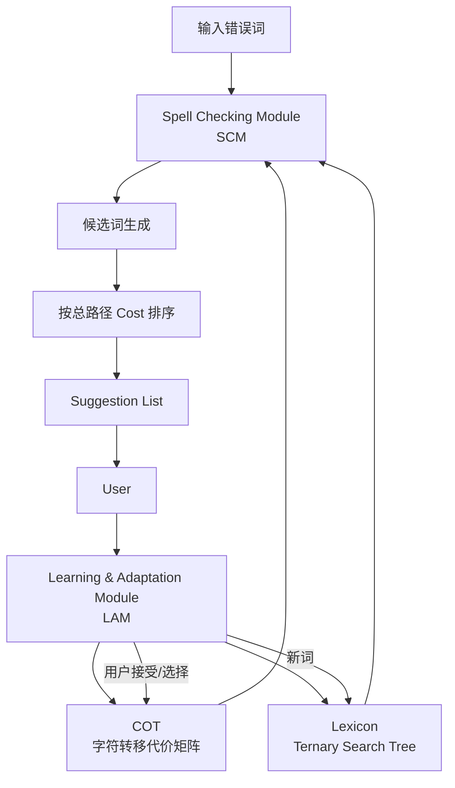

# Adaptive Language Independent Spell Checking using Intelligent Traverse on a Tree

---

## **作者信息**

| 作者                      | 机构                                                | 身份/背景                                         | 领域大牛认定                                                                                                                                          |
| ----------------------- | ------------------------------------------------- | --------------------------------------------- | ----------------------------------------------------------------------------------------------------------------------------------------------- |
| **Behrang QasemiZadeh** | Iran University of Science and Technology（伊朗科技大学） | NLP、词汇资源、语言资源方向研究者；论文发表时主要从事波斯语/语言资源与拼写检查相关研究 | **不是传统意义上的领域大牛**。其后续研究逐渐拓展到计算语言学、语义建模、语言资源等方向，曾在 National University of Ireland Galway、University of Düsseldorf 等机构开展研究。([elexicography.eu][1]) |
| **Ali Ilkhani**         | Digital Clone Corp., Tehran                       | 工业界研究/技术人员，参与 Digital Clone 的语言技术与拼写检查工作      | **非公认领域大牛**                                                                                                                                     |
| **Amir Ganjeii**        | Iran University of Science and Technology         | 计算机/智能系统相关研究背景                                | **非公认领域大牛**                                                                                                                                     |

> 论文首页给出的作者单位是 Iran University of Science and Technology 和 Digital Clone Corp.，研究团队明显偏向“**高校研究 + 工业语言技术开发**”的合作模式，而不是今天意义上由顶级 NLP PI 主导的大型研究组。

### **团队相关信息：**

这个团队**不是 ACL/计算语言学意义上的顶级大牛实验室**，而是一个具有明显工程实践背景的早期语言技术研究团队。论文一方面来自 **Iran University of Science and Technology**，另一方面来自当时位于德黑兰的 **Digital Clone Corp.**，研究主题高度聚焦于实际拼写检查工具。

比较值得注意的是，**QasemiZadeh 后来的学术轨迹明显比这篇论文时期更偏向计算语言学和语言资源研究**。他的后续经历包括 National University of Ireland Galway 的 INSIGHT Centre，以及 Düsseldorf 的计算语言学研究环境，并参与了 SemEval、LREC 等计算语言学项目。([data-science-expert.de][2])

因此，如果从你做“小语种拼写纠错”文献综述的角度评价，这篇论文更应该看作：

> **早期波斯语拼写纠错/语言无关拼写纠错的重要工程型探索，而不是某个顶级 NLP 学术团队的代表作。**

---

## **论文发表时间**

| 项目   | 具体日期                                                                         | 来源/说明                                                                        |
| ---- | ---------------------------------------------------------------------------- | ---------------------------------------------------------------------------- |
| 会议   | **2006 IEEE Conference on Cybernetics and Intelligent Systems (ICCIS 2006)** | IEEE 会议论文                                                                    |
| 会议时间 | **2006年6月7日-9日**                                                             | Bangkok, Thailand ([开放图书馆][3])                                               |
| 论文时间 | **2006年6月**                                                                  | 文献数据库将该论文标注为 June 2006，并给出 DOI 10.1109/ICCIS.2006.252325。([ResearchGate][4]) |
| 页码   | **1-6**                                                                      | IEEE Conference Proceedings                                                  |
| DOI  | **10.1109/ICCIS.2006.252325**                                                | IEEE Xplore / 文献记录 ([ResearchGate][4])                                       |

所以，这篇论文不是“预印本/修改中”，而是**已经正式发表的 2006 年 IEEE 会议论文**。

---

## **摘要**

本文提出一种**自适应、语言无关（language independent）、不依赖预定义错误模式（built-in error pattern free）**的拼写检查系统。

核心方法是将语言词典组织成 **Ternary Search Tree（TST，三叉搜索树）**，同时为树中的字符转移赋予不同的代价，并使用 **Cost of Transition（COT）** 矩阵表示字符之间的转移成本。这样，拼写纠错就不再是简单地寻找编辑距离最小的单词，而被转化为：

> **在带权 TST 中寻找总路径代价最小的候选词。**

系统进一步加入 **Learning and Adaptation Module（LAM）**，利用用户选择的纠错结果反向调整 COT，从而学习某种语言、用户或媒介（例如 OCR）中特定的错误模式。

---

# 一、这篇论文讲了一个什么样的故事？

这篇论文实际上讲的是一个非常典型的 **2000 年代早期拼写纠错故事**：

> **传统拼写纠错太依赖“人工定义错误模式”，而错误模式又高度依赖语言和使用媒介，因此作者尝试让拼写检查系统自己从用户反馈中学习错误模式。**

作者首先指出，传统拼写检查主要面对 **non-word error** 和 **real-word error** 两类错误。本文明确把研究范围限定在：

> **non-word error / misspelling**

也就是拼出来以后根本不属于该语言词汇表的错误。

real-word error 因为需要结合语义、上下文甚至句法来判断，因此不是本文研究对象。

传统方法大体需要两样东西：

**第一，语言词典（Lexicon）**

系统必须知道一个词是否属于该语言。

**第二，错误模式（Error Pattern）**

例如：

* substitution：字母替换
* deletion：字母删除
* insertion：字母插入
* transposition：相邻字母交换
* split-word：词连接/分词错误

问题就在于：

> **错误模式往往需要人工定义，而且高度依赖具体语言、用户和输入媒介。**

例如，OCR 产生的错误模式和普通用户键盘输入产生的错误模式并不一样。论文认为，如果每换一种语言/媒介都重新设计错误模式，会非常耗时，而且通常需要语言专家。

于是论文提出了一个非常漂亮的思想：

> **不要手工规定“什么错误应该怎样纠正”，而是把不同字符之间的变化看成不同成本，让系统通过用户反馈自动学习这些成本。**

例如：

如果用户经常把：

> `a → e`

输入错，那么用户每次选择正确答案之后，系统就逐渐降低这一类字符转移的代价。

反过来，如果某种候选经常被拒绝，就提高对应转移成本。

因此系统逐渐形成：

> **“这个用户/这个媒介最常出现哪些错误”的概率式隐式表示。**

---

# 二、本文的核心思想和创新点

## 1. 核心思想

本文最核心的思想可以概括为一句话：

> **把拼写纠错从“人工设计错误规则的问题”，转换成“带权三叉搜索树上的最小代价路径搜索 + 在线错误模式学习问题”。**

传统拼写纠错：

```text
输入错误词
   ↓
判断错误类型
   ↓
调用预定义错误规则
   ↓
生成候选
   ↓
排序
```

本文：

```text
输入错误词
   ↓
进入 TST
   ↓
不同字符转移具有不同 Cost
   ↓
搜索低成本路径
   ↓
得到候选词
   ↓
用户选择
   ↓
更新 Cost
   ↓
下一轮纠错能力发生变化
```

所以，作者实际上把：

**Error Pattern Modeling**

从一个显式规则模块，变成了：

**Cost of Transition（COT）中的隐式参数。**

论文明确指出，错误模式被**implicitly modeled in COT**。

---

## 2. 关键创新点

### 创新一：语言无关的拼写纠错框架

系统设计成：

> **新增一种语言 ≈ 增加对应 Lexicon + COT matrix**

而不是重新开发整套纠错算法。

论文明确指出，添加新语言主要就是添加：

* Lexicon
* COT matrix

因此作者认为系统具有较强的 localization 能力。

这对于**低资源语言**尤其有意义。

---

### 创新二：把 TST 从普通查词结构改造成“纠错搜索空间”

普通 TST 主要用于字符串搜索。

本文则进一步：

> **给 TST 的边增加 cost。**

于是树就变成了一个带权搜索空间：

```text
                root
              /  |  \
          smaller same larger
              ...
               ↓
       带权字符转移路径
               ↓
       最小总成本候选词
```

论文认为，这使传统确定性树遍历转变成：

> **non-deterministic traverse**

即同一个输入字符可能通过不同的替换、删除、插入或换位操作走向多个候选路径。

---

### 创新三：错误模式可以在线学习

这是本文最值得关注的地方。

用户并不是简单地使用系统。

用户的选择本身就是训练信号：

```text
错误词
 ↓
系统产生多个候选
 ↓
用户选择第 k 个候选
 ↓
更新 COT
 ↓
提高被选择路径的权重优势
 ↓
降低其他候选路径的优势
```

换句话说：

> **Human-in-the-loop spelling correction**

已经出现在这篇 2006 年的工作中。

---

### 创新四：把删除和插入也统一成 COT

COT 并不仅仅记录：

```text
character A → character B
```

还增加：

```text
NULL → character
character → NULL
```

分别表示：

* insertion
* deletion

作者因此可以用统一的 Cost 框架表示各种字符级错误。

---

### 创新五：通过两个 Threshold 控制搜索空间

作者并没有直接让 TST 无限搜索，而是设计：

* **Local Threshold**
* **Global Threshold**

用来限制候选搜索深度以及候选数量。

这实际上是在解决经典 spell correction 的核心问题：

> **候选空间巨大，怎么在保证纠错效果的同时控制计算成本？**

---

# 三、方法是怎么实现的？(How does it work?)

## 1. 架构

论文的整体结构由五部分组成：

1. **Spell Checking Module（SCM）**
2. **Lexicon**
3. **Cost of Transition（COT）**
4. **Learning and Adaptation Module（LAM）**
5. **User**

论文原始 Figure 2 正是围绕这五个部分设计的。

可以重构为：



最关键的逻辑是：

> **SCM负责“搜索”，LAM负责“学习”，Lexicon负责“知识”，COT负责“错误模式”。**

---

## 2. Lexicon：三叉搜索树

TST 中每个节点保存一个字符，同时拥有三个方向：

```text
        Left
         /
Current Node
         \
        Right

Middle → 下一个字符
```

其中：

* Left：字符编码更小
* Right：字符编码更大
* Middle：输入字符串中的下一个字符

这种结构可以共享相同前缀。

例如：

```text
receive
receiver
receiving
```

公共前缀可以只保存一次，因此比直接存储大量完整字符串更加紧凑。

---

## 3. Cost of Transition（COT）

这是整个系统最核心的数据结构。

作者建立一个二维矩阵：

$$
COT(C_i,C_j)
$$

其中：

* 行：起始字符 \(C_i\)
* 列：目标字符 \(C_j\)
* 单元格：从 \(C_i\rightarrow C_j\) 的转移成本

例如：

```text
        a     e     i     o
a      100   80    100   100
e       80  100     60   100
i      ...
```

初始情况下，整个矩阵都设为：

$$
100
$$

对于 Persian，论文举例使用 **40×40** 左右的矩阵规模，并增加 NULL 行/列来描述 insertion/deletion。

---

## 4. Spell Checking：把纠错变成最短路径搜索

输入一个错误词以后，SCM 会在 TST 上进行非确定性遍历。

核心原则：

> **寻找总 transition cost 最低的路径。**

因此，一个候选词 \(w\) 可以抽象成：

$$
Cost(w)=\sum_{t=1}^{T} COT(c_t,c'_t)
$$

然后系统优先选择总成本较低的候选。

这里不是传统的：

$$
\min EditDistance(w,x)
$$

而更类似：

$$
\min \sum Cost(字符转换)
$$

区别就在于：

> **不同字符的编辑操作不再具有相同的代价。**

---

## 5. 支持的四类主要操作

### ① 替换

例如：

```text
a → e
```

直接查 COT：

$$
COT(a,e)
$$

---

### ② Transposition

如果当前字符不同，而且下一字符可能匹配，则进行交换。

即：

```text
ab → ba
```

---

### ③ 删除

把输入字符转换成 NULL：

$$
COT(c,NULL)
$$

对应：

```text
abcd
 ↓
acd
```

---

### ④ 插入

将 NULL 转化成一个真实字符：

$$
COT(NULL,c)
$$

对应：

```text
acd
 ↓
abcd
```

论文就是通过这种方式把 deletion / insertion 纳入统一代价体系。

---

# 6. Learning and Adaptation

这是整个模型真正实现“adaptive”的地方。

假设：

```text
错误输入：X
系统候选：

A
B
C
D
E
```

如果用户最终选择了：

```text
C
```

那么系统会：

> **降低 C 对应路径的 Cost，同时提高其他候选路径中相关转移的 Cost。**

论文给出了更新公式：

$$
COT(C_i,C_j)=
\begin{cases}
COT(C_i,C_j)_{old}(1-\alpha \cdot index), & index=selected\\
COT(C_i,C_j)_{old}\left(1+\frac{\alpha}{index}\right),&index\neq selected
\end{cases}
$$

其中：

* \(\alpha\)：learning rate
* \(index\)：候选在 suggestion list 中的位置
* \(selected\)：用户实际选择的位置


这实际上构成了一个非常简单的**在线反馈学习机制**。

---

# 7. Threshold 机制

为了避免搜索空间爆炸，系统设计两个阈值。

### Local Threshold

控制：

> **单个候选词允许有多大的差异。**

论文用：

$$
L_s
$$

表示 suggested word 长度，用：

$$
L_i
$$

表示输入词长度。

Local Threshold 与允许的最大不相似率 \(\lambda\) 有关。

---

### Global Threshold

控制：

> **整个 suggestion entry 可以生成多少候选。**

大致可以理解成：

$$
GlobalThreshold
=
\min(
LocalThreshold(L_i),
\gamma \times \text{Min/related threshold}
)
$$

其中：

* \(\lambda\)：maximum allowed dissimilarity rate
* \(\gamma\)：限制候选数量的比例参数

---

# 8. 一个更直观的整体算法

```text
Input: misspelled word x

1. 在 Lexicon 中查询 x
2. 如果 x 存在
      → 不认为是 non-word error
3. 如果 x 不存在
      → 从 TST root 开始搜索
4. 对当前字符尝试：
      a. 精确匹配
      b. substitution
      c. transposition
      d. deletion
      e. insertion
5. 每次操作查询 COT cost
6. 累积路径 cost
7. 超过 Local / Global Threshold
      → 剪枝
8. 到达合法词节点
      → 加入候选集合
9. 按 total path cost 排序
10. 返回 suggestion list
11. 用户选择候选
12. LAM 更新 COT
13. 后续输入继续使用新的 COT
```

---

# 9. 关键公式

### ① COT 更新

$$
COT_{new}(C_i,C_j)=
\begin{cases}
COT_{old}(C_i,C_j)(1-\alpha\cdot index),
& index=selected\\
COT_{old}(C_i,C_j)
\left(1+\frac{\alpha}{index}\right),
& index\neq selected
\end{cases}
$$

这是本文最核心的学习公式。

---

### ② Local Threshold

论文定义：

$$
LocalThreshold(L_s)
=
\lambda
\cdot f(L_s)
$$

其中 \(f(L_s)\) 根据词长分段变化，并且包含指数衰减项。

---

### ③ Global Threshold

$$
GlobalThreshold
=
\min(
LocalThreshold(L_i),
\gamma \times M
)
$$

核心思想是：

> **输入越长，可以容忍的差异越大；但候选数量依然要受到约束。**

---

# 四、实验效果 (Experimental Results)

## 1. 实验设置

论文测试了：

> **Persian + English**

两个语言。

### Persian

论文作者自己构建了数据集：

* 总错误词：**5595**
* Training：**3827**
* Testing：**1768**
* Lexicon：**40,000 Persian words**

### English

使用已有的常见拼写错误数据集：

* 总数据：**547**
* Training：**360**
* Testing：**187**
* Lexicon：**25,000 English words**


---

### 参数设置

统一设置：

$$
COT_{initial}=100
$$

$$
\alpha=0.01
$$

$$
\lambda=35
$$

$$
\gamma=1.50
$$


---

## 2. 主要结果

论文主要报告三类指标：

### ① Auto-Select Precision

即：

> 正确答案是否排在 suggestion list 的第一位。

---

### ② System Precision

考虑正确答案在候选列表中的**位置**。

论文没有简单采用传统 precision，而是认为：

> **正确答案排第1和排第10是不一样的。**

所以指标会根据正确候选的位置给予不同权重。

具体来说：

$$
Index_i=
\begin{cases}
11-SuggestNo_{w_i}, & 1\leq SuggestNo_{w_i}\leq10\\
0, & otherwise
\end{cases}
$$

最终：

$$
Precision=
\frac{\sum_i Index_i}{10N}
$$

---

### ③ No Suggestion

即：

> 对多少错误词，系统一个候选都生成不出来。

这个指标实际上衡量：

> **系统 Coverage。**

---

## 3. 主要实验现象

### Persian

从 Figure 4-6 可以看到：

**Auto-Select**

最初大约从 **30% 左右**开始，经过学习后逐渐提升到 **70% 左右**。

**System Precision**

快速提高到约 **80%+**，之后进入相对稳定区间。

**No Suggestion**

开始时较高，经过学习之后明显下降，最终大约维持在 **10%-15%** 附近。

也就是说：

> **在线学习能够明显改善系统早期的纠错效果。**

---

### English

English 数据上的提升更加明显。

Auto-Select 从大约：

$$
10\%-20\%
$$

逐步提升到：

$$
70\%+
$$

System Precision 很快达到约：

$$
75\%-80\%
$$

而 No Suggestion 从约：

$$
35\%
$$

迅速下降到：

$$
5\%
$$

左右。

这些趋势与论文 Figures 7-9 一致。

---

# 4. 一个非常值得注意的实验发现

本文并不是简单地发现：

> “学习越多，性能一直越高。”

恰恰相反。

作者明确观察到了一个重要现象：

> **Learning itself can cause new errors.**

也就是说：

```text
学习某一种错误
        ↓
某条路径成本下降
        ↓
该类错误纠正得更好了
        ↓
但是其他错误路径的相对关系发生变化
        ↓
原来能产生正确候选的词
可能反而无法产生正确候选
```

论文指出：

> 在经过一定次数的 iteration 后，error pattern learning 对一些词产生积极作用的同时，可能导致其他词无法再生成正确候选。

**这是这篇论文非常重要、但容易被忽略的发现。**

---

# 5. 消融实验与关键发现

严格来说：

> **本文没有现代论文意义上的 systematic ablation study。**

所以你给出的示例里那种“消融实验：隐藏 token 尺寸……”等内容**并不适用于这篇论文**。

这篇 2006 年论文的实验设计主要是：

```text
不同 iteration
        ↓
观察
Auto-Select
System Precision
No Suggestion
        ↓
分析 online learning 的效果
```

论文真正可以提炼出的关键实验发现是：

### 关键发现 1：错误模式学习确实有效

训练集和测试集都显示，随着 iteration 增加，整体纠错性能明显改善。

### 关键发现 2：学习不是单调收益

部分错误类型学习得更好之后，会牺牲其他错误类型的覆盖能力。

### 关键发现 3：语言不同，学习曲线不同

Persian 和 English 的 learning curves 并不完全一致。

### 关键发现 4：系统对“媒介”敏感

作者明确承认：

> **the method is sensitive to media**

也就是说，同一个错误模式模型不能保证在所有输入媒介上都同样有效。

---

## **实验部分总结：**

这篇论文的实验规模在今天看并不大，但对于 2006 年的拼写纠错研究而言，其价值并不是追求一个特别高的 SOTA 数字，而是验证了一个重要概念：

> **“错误模式可以不由专家预定义，而可以通过用户交互逐渐学习。”**

尤其是 Persian 数据集的实验，使得论文不仅仅是一个 English spell checker 的工程实现，而是证明该架构可以应用于**低资源语言场景**。

这一点对你现在做 Arabic/Persian spelling correction 的历史文献梳理尤其值得关注。

---

# 五、优点与局限性

## ✅ 1. 优点

### ① 很早就提出了“Language Independent”思想

这是本文最有历史价值的地方。

作者没有针对 Persian 单独设计规则，而是希望：

> **算法本身尽可能语言无关。**

语言相关知识主要进入：

```text
Lexicon + COT
```

这非常符合后来 multilingual / low-resource NLP 的一个基本思想：

> **把语言依赖知识和算法框架分离。**

---

### ② 把“错误模式”参数化了

传统方法：

```text
人工专家
 ↓
错误规则
 ↓
spell checker
```

本文：

```text
错误行为
 ↓
COT 参数
 ↓
用户反馈
 ↓
在线更新
```

这是一种非常重要的设计思想。

---

### ③ 把用户反馈直接纳入算法

今天我们很容易把它称为：

> **Human-in-the-loop learning**

虽然论文当时没有使用这个术语，但思想非常接近。

用户并不只是系统的最终使用者：

> **用户本身就是训练机制的一部分。**

---

### ④ Persian 是一个很重要的验证语言

论文并没有只用英文。

作者专门构建：

> **5595 Persian misspelled words**

并使用：

> **40,000 Persian-word lexicon**

验证方法。

对于当时 Persian NLP 数据资源相对有限的环境，这一点是有意义的。

---

### ⑤ 计算结构比较清晰

整套系统实际上非常模块化：

```text
Lexicon
   +
COT
   ↓
SCM
   ↓
Suggestion
   ↓
LAM
   ↓
COT update
```

工程上非常容易理解和实现。

---

# ⚠️ 2. 局限性（研究边界与待解问题）

### ① 只处理 Non-word Error

这是最大的研究边界。

作者明确说：

> real-word error 并不是本文研究目标。

因此类似：

> “I saw a good **book**”

实际上应该是：

> “I saw a good **look**”

这种两个单词本身都合法，但上下文使用错误的问题，本文无法解决。

也就是说：

> **它本质上还是 lexical-level / word-level spelling correction，而不是 contextual spelling correction。**


---

### ② 基本没有真正的上下文模型

候选词主要依据：

> **字符转移成本 + Lexicon**

而不是：

```text
context
syntax
semantics
language model
```

这也是为什么作者最后明确提出：

> **future work：使用 language models 改善准确率。**

---

### ③ COT 的学习非常粗粒度

COT 本质上主要表示：

$$
character_i \rightarrow character_j
$$

但是实际拼写错误往往具有更加复杂的上下文依赖：

```text
character + neighboring character
character position
morphological environment
phonological environment
keyboard layout
user habit
```

单独依靠一个字符转换矩阵，表达能力有限。

---

### ④ 在线学习存在“灾难性偏移”问题

这是我认为本文实验中最值得你借鉴的一个问题。

论文自己已经观察到：

> 学习某些错误模式以后，可能使其他词的正确候选消失。

从现代机器学习角度理解，这其实就是一种：

> **局部优化影响全局候选空间的 trade-off。**

所以：

$$
Performance_{t+1}
\not\geq
Performance_t
$$

并不是一个单调学习系统。

---

### ⑤ 数据集规模较小

特别是 English：

$$
547
$$

个错误词。

即使 Persian 有：

$$
5595
$$

个错误词，也依然属于：

> **word-level handcrafted test set**

而不是今天意义上的大规模 corpus benchmark。

---

### ⑥ 缺少现代意义上的标准 benchmark comparison

论文虽然回顾了：

* Edit Distance
* n-gram
* Similarity Key
* rule-based
* hybrid

等方法，但实验阶段并没有提供一个特别系统的：

> **same dataset + same metric + multiple strong baselines**

比较。

因此论文的实验更偏：

> **proof-of-concept**

而不是严格意义上的 benchmark competition。

---

### ⑦ 没有真正解决语言特定问题

论文称：

> language independent

但实际上它依然需要：

```text
Language-specific Lexicon
+
Language-specific COT
```

因此严格来说：

> **算法框架语言无关，但知识资源依然是语言相关的。**

这一点对于你现在研究 Arabic/Persian 尤其重要。

---

# 六、其他

## 第一性原理

从第一性原理来看，这篇论文实际上是在解决一个极其基础的问题：

> **一个错误单词究竟应该被改成什么？**

假设输入：

$$
x
$$

词典中存在：

$$
W=\{w_1,w_2,\ldots,w_n\}
$$

那么最基本的拼写纠错就是寻找：

$$
w^*=\arg\min_{w\in W}Cost(x,w)
$$

传统编辑距离把：

$$
Cost(x,w)
$$

定义成统一的 insertion/deletion/substitution/transposition cost。

而本文的改变是：

$$
Cost(x,w)
=
\sum COT(c_i,c_j)
$$

即：

> **不同字符变化具有不同成本。**

然后进一步：

$$
COT
\leftarrow
Learning(User\ Feedback)
$$

于是整个系统实际上变成：

$$
\boxed{
拼写纠错
=
候选空间
+
代价函数
+
搜索
+
反馈学习
}
$$

这是这篇论文最值得记住的抽象。

---

# 领域空白

从今天的视角回看，这篇论文暴露出来的领域空白非常明显。

## ① 从“字符级错误”走向“上下文错误”

本文：

$$
P(correct|error)
$$

主要由：

$$
COT
$$

决定。

下一步自然应该变成：

$$
P(correct|error,context)
$$

也就是：

> **Context-aware spelling correction**

这正是后来 statistical LM、neural LM、Transformer、LLM spelling correction 发展的方向之一。

---

## ② 从人工词典走向大规模语言资源

本文：

```text
Lexicon
+
COT
```

高度依赖词典。

现代研究则可以进一步研究：

```text
Corpus
+
Subword
+
Contextual Representation
+
LM
```

从而降低对人工词典的依赖。

---

## ③ 从“语言无关”走向“跨语言迁移”

本文所谓 language-independent，本质上是：

> 同一个算法可以换 Lexicon。

但现代真正的问题是：

> **一个语言学到的错误模式能不能迁移到另一个低资源语言？**

例如：

$$
Arabic \rightarrow Persian
$$

或者：

$$
High-resource\ language
\rightarrow
Low-resource\ language
$$

这是更强意义上的 cross-lingual transfer。

---

## ④ 从静态错误模式到动态错误分布

本文已经意识到：

> 用户习惯、OCR 媒介等因素会改变错误模式。

但是 COT 仍然是比较简单的全局矩阵。

进一步可以研究：

$$
P(error|user,device,domain,time)
$$

即：

> **用户、领域、媒介、时间变化下的动态错误模型。**

---

## ⑤ 从 Non-word Error 走向 Real-word Error

这是这篇论文最明确的空白。

它主动把：

> real-word error

排除在研究范围之外。

因此后续研究自然会走向：

```text
Non-word Error
        ↓
Real-word Error
        ↓
Contextual Spelling Correction
        ↓
Grammar / Syntax Error Correction
        ↓
General Text Correction
```

---

# 最后：如果从你的“阿拉伯语 + 波斯语自动拼写错误纠正”研究视角看

这篇论文**非常值得保留在你的文献综述里**，但建议你不要把它当成“现代方法论文”，而是把它放到：

> **早期语言无关、资源驱动、字符级拼写纠错 / Persian spelling correction 的历史演进阶段**

它对你最有价值的不是 2006 年的 TST 本身，而是它提出的这条演化逻辑：

```text
人工错误规则
      ↓
参数化错误模式
      ↓
COT / weighted edit operations
      ↓
用户反馈学习
      ↓
统计语言模型
      ↓
神经网络
      ↓
Transformer / LLM
```

也就是说，这篇论文实际上处于你综述中的一个很好的**“规则/编辑距离方法 → 自适应统计方法”过渡节点**。

尤其值得你在 Arabic/Persian literature review 中强调一个判断：

> **该工作虽然声称“language independent”，但其算法真正做到的是“语言无关的纠错机制”，而不是“语言无关的语言知识”。Lexicon 与 COT 仍然需要针对具体语言构建。因此，其真正贡献更准确地说是“language-independent architecture with language-specific lexical/error resources”。**

这个区分对你后面讨论**低资源语言的数据资源依赖、错误模式建模以及跨语言泛化**会非常有用。 

---
> 本文由 ChatGPT AI（202609） 生成
