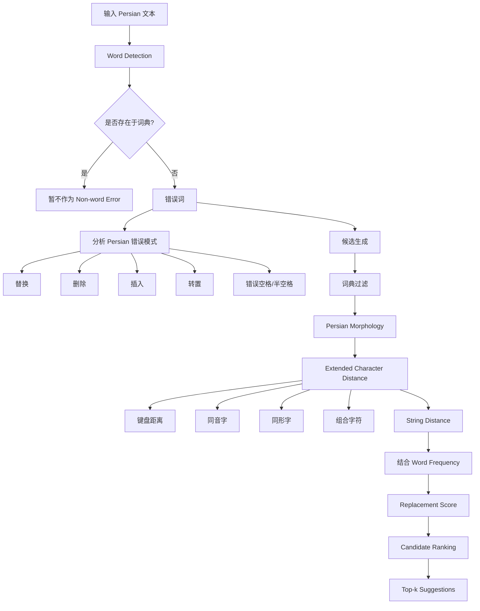

下面这篇材料需要先做一个性质上的澄清：**它严格来说不是一篇普通的 conference/journal paper，而是一部 2010 年出版的波斯语自动拼写检查研究专著/项目技术成果**，围绕 **Virastyar（ویراستیار）波斯语拼写检查系统**展开。书中第四章才是与“自动波斯语拼写检查”直接对应的核心研究部分。书名页列出的作者为 Omid Kashefi、Mitra Nasri、Kamiar Kanani，出版机构为伊朗 Supreme Council for Information and Communication Technology 的 Secretariat。

# Towards Automatic Persian Spell Checking / خطایابی املایی خودکار در زبان فارسی

---

## **作者信息**

| 作者                               | 机构                                                           | 身份/背景                                   | 领域大牛认定                                       |
| -------------------------------- | ------------------------------------------------------------ | --------------------------------------- | -------------------------------------------- |
| **Omid Kashefi（امید کاشفی）**     | 书中作者信息未完整给出机构；其邮箱为 IEEE 地址                                   | Persian NLP、拼写纠错、Virastyar 项目的核心开发者/研究者 | **波斯语 NLP / 拼写检查方向的重要实践型研究者，但不能认定为“领域资深大牛”** |
| **Mitra Nasri（میترا نصری）**      | 书中邮箱为 `ut.ac.ir`，即德黑兰大学体系邮箱                                  | Persian NLP、语言处理、拼写检查                   | **非公认意义上的领域大牛**                              |
| **Kamiar Kanani（کامیار کنعانی）** | 书中邮箱为 `ce.sharif.edu`，即 Sharif University of Technology 体系邮箱 | 计算机/语言技术、Virastyar 项目开发                 | **非公认意义上的领域大牛**                              |

书中版权页确认三人为主要作者；附录中的“标点纠错”同样由 Kamiar Kanani 负责。

值得特别注意的是，后来的 Virastyar 开源项目资料把 **Omid Kashefi 列为开发者**，并同时列出 Kamiar Kanani、Mitra Nasri 等作为开发者；SourceForge 将 Virastyar 定义为面向**低资源语言，尤其是 Persian 和 RTL languages** 的开源拼写检查器。([开源软件库][1])

---

## **团队相关信息：**

这个团队更准确地说是一个：

> **“伊朗高校计算机/语言处理研究人员 + 国家信息通信技术机构支持 + 工程化软件开发”组成的 Persian NLP 实践团队。**

它与单纯发表一篇算法论文的团队不同，目标非常明确：

> **不是只证明某个算法有效，而是建立一套真正能够运行的 Persian spelling-checking system。**

书的前言明确指出，项目属于伊朗最高信息委员会直接支持的**研究—实施型项目**，最终形成了可实际使用的 **Virastyar（ویراستیار）** 软件第一版，并采用“形态纠错”的路线。

后来的 Virastyar 资料也显示，该项目并不是一次性的论文工作，而形成了包含拼写检查、语法纠错、标点纠错、字符标准化、Pinglish 转换等能力的完整软件生态。([开源软件库][1])

所以，从你的研究视角看：

> **这支团队在“Persian NLP 工程实践”和“Persian spelling correction”历史上是值得关注的团队，但不能简单等同于今天 ACL/EMNLP 意义上的顶级学术明星团队。**

---

# **论文/专著发表时间**

| 项目   | 具体日期                                                                    | 来源/说明                            |
| ---- | ----------------------------------------------------------------------- | -------------------------------- |
| 正式出版 | **2010 年，伊朗历 1389 年秋季**                                                 | 上传文件版权页明确标注“پاییز 1389”（秋季 1389） |
| 出版机构 | **Supreme Council for Information and Communication Technology（SCICT）** | 书中版权/出版信息明确给出                    |
| 出版地  | **Tehran, Iran**                                                        | 书目信息                             |
| 版本   | **第一版**                                                                 | `نوبت چاپ: اول`                  |
| ISBN | **978-964-8846-34-8**                                                   | 书中版权页                            |
| 篇幅   | **189 页**                                                               | 书目信息                             |


需要注意：ResearchGate 将该成果的英文标题记录为 **Towards Automatic Persian Spell Checking**，并标注为 **January 2010**；但你提供的正式出版物本身明确写的是**1389 年秋季**。因此做论文/综述引用时，我建议采用：

> **Kashefi, O., Nasri, M., & Kanani, K. (2010). Towards Automatic Persian Spell Checking. SCICT.**

这个书目信息也被 Virastyar 项目后续资料引用。([ResearchGate][2])

---

# **摘要**

这项工作围绕**波斯语自动拼写错误检测与纠正**展开。作者首先系统分析波斯语在计算机处理中的特殊困难，包括：

* 丰富的形态变化；
* 派生与复合构词；
* 非动词屈折形式；
* 动词复杂屈折；
* 普通空格与词内空格/半空格问题；
* 同音字；
* 同形字；
* 键盘布局导致的输入错误；
* Unicode/字符表示差异。

在此基础上，作者构建了一套面向 Persian 的自动拼写检查方法。整个过程包括：

> **错误检测 → 候选生成 → 候选排序**

其中，核心创新不是重新发明一个普通编辑距离，而是：

> **把 Persian 的语言学知识和真实错误模式融入字符串距离计算与候选排序。**

特别是提出一种改进的 **character distance / string distance / replacement score**，同时考虑：

1. 拼写错误发生概率；
2. Persian 键盘布局；
3. 复合字符；
4. 同音字；
5. 同形字；
6. 词频。

因此，该方法本质上是一个：

> **“语言特定的加权编辑距离 + Persian linguistic knowledge + word frequency”的候选排序框架。**

---

# 一、这篇论文讲了一个什么样的故事？

这篇工作的故事可以浓缩成一句话：

> **英文 spell checker 的方法不能直接搬到 Persian，因为 Persian 的真正困难并不只是“字符写错了”，而是词怎么构成、词间怎么连接、字符怎么表示以及用户怎样输入，都可能造成拼写错误。**

作者首先将人的语言错误划分到：

* lexical
* syntactic
* semantic
* contextual

等层次，而传统 spell checker 主要处理：

> **typing / orthographical / OCR 等 word-level errors。**


传统拼写检查通常有三个步骤：

```text
错误检测
   ↓
候选生成
   ↓
候选排序
```

也就是：

$$
\boxed{
Detection
\rightarrow
Generation
\rightarrow
Ranking
}
$$


问题在于：

> **如果只是把 English 的 Levenshtein Distance 搬过来，很多 Persian 的错误完全无法被合理处理。**

例如 Persian 有大量：

### ① 屈折词

一个词后面可以叠加多个后缀。

### ② 复合词

多个独立词素组合成一个词。

### ③ 半空格/ZWNJ

错误插入或删除空格都可能导致拼写错误。

### ④ 同音字

字符不同，但是发音相同。

### ⑤ 同形/相关字

部分字符在视觉上非常接近。

### ⑥ 键盘邻近错误

用户按错相邻键的概率明显高于按到距离很远的键。

这些问题使作者认为：

> **Persian spelling correction 必须把语言本身的结构知识纳入算法。**

书中甚至指出，错误的空格处理及词内空格问题可能构成 Persian 拼写错误的重要部分，约占相关错误的 **80% 左右**。

---

# 二、本文的核心思想和创新点

## 1. 核心思想

核心思想可以写成：

$$
\boxed{
Persian\ Spell\ Correction
=
Morphology
+
Error\ Pattern
+
Weighted\ String\ Distance
+
Keyboard
+
Linguistic\ Similarity
+
Word\ Frequency
}
$$

作者不是单纯寻找：

$$
\arg\min_{w\in Lexicon} EditDistance(x,w)
$$

而是试图建立一个更符合 Persian 实际错误分布的：

$$
\arg\min_{w\in Lexicon} Score(x,w)
$$

其中 Score 同时编码：

> **错误发生概率 + 字符相似性 + 键盘距离 + 语言学关系 + 词频。**

---

# 2. 关键创新点

## 创新一：把 Persian 特有语言学知识直接纳入拼写纠错

作者认为，普通编辑距离只关心：

> 两个字符是否相同。

但 Persian 中：

> **“两个字符不一样”并不意味着“它们同样不可能互相替换”。**

例如：

* 键盘相邻字符；
* 同音字；
* 同形字；
* 组合字符；

都应该具有不同的 substitution cost。

这就是后文 **Extended Character Distance** 的来源。

---

## 创新二：使用真实 Persian 语料估计错误模式

作者没有直接照抄 English spelling-error distribution，而是使用三个大型 Persian corpora：

### Hamshahri Corpus

约：

* **1500 万词**
* **417,000 非重复词**
* 160,000 articles

### Computer Research Center of Islamic Sciences

约：

* **5000 万词**
* **398,000 非重复词**
* 800+ books

### Iran University of Science and Technology Corpus

约：

* **210 万词**
* **231,000 非重复词**


这一点非常重要：

> **这是从语言数据出发建立 Persian-specific error model，而不是凭经验设定 edit cost。**

---

## 创新三：提出 Persian-specific error distribution

作者统计得到：

| 错误类型             | Persian 中的发生比例 |
| ---------------- | -------------: |
| 替换 Substitution  |        **53%** |
| 删除 Deletion      |        **27%** |
| 插入 Insertion     |        **13%** |
| 转置 Transposition |         **7%** |
| 单一错误合计           |        **78%** |


因此：

$$
P(substitution)=0.413
$$

$$
P(deletion)=0.211
$$

$$
P(insertion)=0.101
$$

$$
P(transposition)=0.055
$$

四者总和：

$$
0.780
$$


这实际上给后面的编辑距离赋予了**语言特定权重**。

---

# 三、方法是怎么实现的？(How does it work?)

## 1. 架构

这套方法可以抽象成：



这套系统的核心逻辑可以简单理解成：

> **先把“可能的正确词”找出来，再用 Persian-specific distance 给它们排序。**

---

# 2. 关键算法

## （1）错误检测

最基本的检测仍然是：

$$
word \notin Lexicon
\Rightarrow
Possible\ Spelling\ Error
$$

但这个词典并不是普通的静态词表。

由于 Persian 大量存在：

> **动词屈折 + 非动词屈折**

作者不能简单把所有可能词形全部放入词典。

例如每个非动词词可能有超过：

> **2700 个屈折形式**

如果全部展开保存，会浪费大量内存。

所以作者采用：

> **运行时生成/处理部分形态变化。**

---

# 3. 候选生成

对错误词 \(q\)，作者根据四类基本错误：

* insertion
* deletion
* substitution
* transposition

构造候选字符串，然后在 Lexicon 中进行过滤。

即：

$$
Candidate(q)
=
Lexicon
\cap
EditNeighborhood(q)
$$


但作者很清楚：

> 编辑距离越大，候选数量呈爆炸式增长。

因此：

$$
EditDistance=2
$$

相比：

$$
EditDistance=1
$$

会产生数量级更大的候选集合。

所以：

> **candidate generation 必须在 recall 与 computational cost 之间折中。**

---

# 4. Persian 非动词屈折处理

这是本文非常有特色的一部分。

假设：

```text
正确：امیدهایشان
错误：انیدهایشان
```

如果直接从词典里搜索，系统可能无法找到正确候选，因为：

> `هایشان`

这类屈折后缀组合并没有作为完整词存储在 Lexicon 中。

因此作者专门设计了：

```text
Word
 ↓
Lemma / Base
 ↓
Morphological analysis
 ↓
Inflection handling
 ↓
Candidate generation
```

而不是简单：

```text
Wrong Word
 ↓
Dictionary lookup
```


---

# 5. Persian 空格/半空格处理

这是我认为论文对你的研究最值得注意的地方之一。

作者指出：

> **传统 character-level spell checker 很难处理 Persian 的 word-spacing error。**

例如：

```text
正确：
زبان فارسی

错误：
زبا ن فارسی
```

这种错误不是简单：

$$
character\rightarrow character
$$

而是：

$$
word\ segmentation
/
word\ composition
$$

发生变化。

所以作者设计了针对：

> **三个相邻词**

共同考虑的候选生成过程，以处理七种不同的 spacing error。

这意味着本文已经认识到：

> **Persian spelling correction 不能只做“词内字符纠错”，还需要处理 token boundary。**

---

# 6. Extended Character Distance

这是本文最核心的算法之一。

普通：

$$
CharacterDistance(c_1,c_2)
$$

只考虑字符本身。

本文进一步考虑：

### 键盘位置

如果两个字符在 Persian keyboard 上很近：

$$
Distance(c_1,c_2)\downarrow
$$

意味着：

> 更可能是用户误按。

---

### 同音字

如果：

$$
c_1,c_2\in HomophoneFamily
$$

那么作者直接赋予较小的字符距离。

---

### 同形字

同理：

$$
c_1,c_2\in HomomorphFamily
$$

也降低距离。

---

### 组合字符

对于 Persian 的：

* `آ`
* `ژ`

等需要 Shift 键组合输入的字符，作者进一步考虑了：

> **Shift key omission**

造成的错误。

例如：

$$
ز\leftrightarrow ژ
$$

其错误概率并不对称。论文指出，漏按 Shift 导致 `ز` 而非 `ژ` 的概率会更高，因此不能把两种 substitution 当成完全等价。

---

# 7. 关键公式：Extended Character Distance

其核心逻辑可以简化为：

$$
ECD(c_1,c_2)=
\begin{cases}
d_{min}, & c_1,c_2\text{ 同音或同形}\\
CharacterDistance(c_1,c_2), & otherwise
\end{cases}
$$

其中：

$$
d_{min}
=
\min
\text{EuclideanDistance}_{keyboard}
$$


因此：

> **字符距离不再是语言无关的统一距离，而成为 Persian-specific distance。**

---

# 8. String Distance

两个词：

$$
q=q_1q_2...q_m
$$

和：

$$
l=l_1l_2...l_n
$$

之间的距离，通过动态规划计算。

作者允许：

* deletion
* insertion
* substitution
* transposition

并把 substitution 从普通：

$$
1
$$

替换成：

$$
ExtendedCharacterDistance(c_1,c_2)
\times
Distance_{substitution}
$$

核心递推可以表示为：

$$
f(i,j)=
\min
\begin{cases}
f(i-1,j)+d(q_i,\epsilon)\\
f(i,j-1)+d(\epsilon,l_j)\\
f(i-1,j-1)+d(q_i,l_j)\\
f(i-2,j-2)+t(q_i,l_j)
\end{cases}
$$

最后做长度归一化：

$$
StringDistance(q,l)
=
\frac{f(m,n)}
{\max(m,n)}
$$


---

# 9. Replacement Score

仅有 String Distance 仍然不够。

因为：

> 两个候选词距离一样，并不代表哪个更可能是正确答案。

例如：

```text
错误：X
候选 A：高频词
候选 B：极低频词
```

A 显然通常更应该排前面。

所以作者进一步加入：

$$
WordFrequency
$$

形成：

> **Replacement Score**

算法同时考虑：

$$
StringDistance
+
WordFrequency
$$


---

# 10. 五级实验模型

作者非常有意思地不是直接只测试“最终模型”，而是逐层加入 Persian knowledge：

### Method 1

$$
ErrorPattern
$$

### Method 2

$$
ErrorPattern
+
Keyboard
$$

### Method 3

$$
ErrorPattern
+
Keyboard
+
Homophone
$$

### Method 4

$$
ErrorPattern
+
Keyboard
+
Homophone
+
Homomorph
$$

### Method 5

$$
ErrorPattern
+
Keyboard
+
Homophone
+
Homomorph
+
WordFrequency
$$


这其实就是本文最接近现代意义的：

> **incremental ablation / component analysis**

---

# 四、实验效果 (Experimental Results)

## 1. 实验设置

实验核心是：

> **使用 Persian 大规模真实语料分析出来的错误模式，建立候选词排序模型，并与经典字符串距离算法进行比较。**

主要 baseline：

* Hamming
* Jaro-Winkler
* Levenshtein
* Damerau-Levenshtein
* Wagner-Fischer


作者特别注意到：

> Wagner-Fischer 可以设置 insertion/deletion/substitution/transposition 的不同权重。

因此为了公平比较，作者使用 Persian error distribution 对其参数进行了设置。

---

## 2. 主要结果

论文使用：

* **P1**
* **P10**
* **MAP**
* **MRR**

评价候选排序。

其中：

> P1：正确答案出现在第1位的准确率；
> P10：正确答案处于 Top-10 中的准确率；
> MAP：Mean Average Precision；
> MRR：Mean Reciprocal Rank。

结果：

| 方法                  |        P1 |       P10 |       MAP |       MRR |
| ------------------- | --------: | --------: | --------: | --------: |
| Hamming             |     0.604 |     0.964 |     0.875 |     0.732 |
| Jaro-Winkler        |     0.575 |     0.951 |     0.857 |     0.705 |
| Levenshtein         |     0.630 |     0.967 |     0.890 |     0.753 |
| Damerau-Levenshtein |     0.630 |     0.967 |     0.889 |     0.752 |
| Wagner-Fischer      |     0.742 |     0.974 |     0.914 |     0.824 |
| Proposed (1)        |     0.742 |     0.974 |     0.914 |     0.824 |
| Proposed (2)        |     0.826 |     0.989 |     0.942 |     0.871 |
| Proposed (3)        |     0.848 |     0.997 |     0.961 |     0.903 |
| Proposed (4)        |     0.853 |     0.997 |     0.968 |     0.908 |
| **Proposed (5)**    | **0.861** | **1.000** | **0.978** | **0.917** |


---

## 3. 最重要实验结论

最值得记住的不是最终的：

$$
P1=0.861
$$

而是一个非常清晰的**逐层提升趋势**：

```text
普通编辑距离
      ↓
+ Persian error pattern
      ↓
+ Keyboard
      ↓
+ Homophone
      ↓
+ Homomorph
      ↓
+ Word Frequency
      ↓
0.861 P1
0.978 MAP
0.917 MRR
```

换句话说：

> **真正带来性能提升的是“把 Persian 的语言/输入知识加入字符串距离模型”。**

这一点是全文最核心的实验论证。

---

# 4. 消融实验与关键发现

虽然作者没有使用今天标准的“ablation study”术语，但它设计的五级模型实际上非常接近组件递进消融。

### 关键发现 1：键盘信息有效

Method 1：

$$
P1=0.742
$$

加入 keyboard 后：

$$
P1=0.826
$$

提升：

$$
+8.4\ percentage\ points
$$

---

### 关键发现 2：同音字信息进一步有效

Method 3：

$$
P1=0.848
$$

说明 Persian homophone information 对 candidate ranking 有明显帮助。

---

### 关键发现 3：同形字继续提升

Method 4：

$$
P1=0.853
$$

---

### 关键发现 4：加入词频后达到最佳

Method 5：

$$
P1=0.861
$$

$$
MAP=0.978
$$

$$
MRR=0.917
$$

而 Top-10：

$$
P10=1.000
$$


这说明：

> **即便最终 Top-1 仍然存在困难，模型实际上已经能够把正确词放入 Top-10 中。**

---

## **实验部分总结：**

本文最强的实验证据不是“我们的算法比 Levenshtein 高很多”，而是：

> **每加入一种 Persian-specific knowledge，候选排序就进一步改善。**

因此论文真正证明的是：

$$
\boxed{
Language\ Specific\ Knowledge
>
Generic\ String\ Similarity
}
$$

至少在 Persian spelling correction 的候选排序任务中，这一结论非常明确。

---

# 五、优点与局限性

## ✅ 1. 优点

### ① 对 Persian 特性研究得非常深入

这不是：

> “把英语 spell checker 翻译成 Persian。”

作者真正从语言本体出发研究：

* morphology
* compounding
* spacing
* homophone
* homomorph
* keyboard
* inflection

这是这项工作的最大优点。

---

### ② 有较强的工程落地性

最终目标并不是纯粹 benchmark，而是实际的：

> **Virastyar**

这使得研究与真实 Persian writing environment 联系非常紧密。

后来的项目资料也明确说明 Virastyar 是一个实际可用的 Persian spell checker，并具有字符标准化、拼写检查、语法纠错、标点修正等能力。([开源软件库][1])

---

### ③ 使用真实大型语料估计错误分布

作者使用了多个百万级、千万级 Persian corpus，而不是随便人工构造几百个错误。

这使得：

$$
P(substitution)
$$

$$
P(deletion)
$$

等参数具有经验基础。

---

### ④ 评价指标设计比较合理

不只看：

$$
Top-1
$$

还看：

$$
Top-10,\ MAP,\ MRR
$$

因此能够评价：

> **“正确答案虽然没有第一，但有没有被模型排进一个可接受的候选列表？”**

这一点对于 spelling correction 很重要。

---

### ⑤ 很好地体现了“语言知识 + 算法”的结合

作者没有把：

> linguistic knowledge

看成算法外部的附加规则，而是直接放进：

$$
Distance
$$

和：

$$
Ranking
$$

当中。

---

# ⚠️ 2. 局限性（研究边界与待解问题）

## ① 最大问题：严重依赖人工语言知识

本文的优势同时也是它最大的限制。

为了支持 Persian，作者需要建立：

* morphology rules
* homophone families
* homomorph families
* keyboard layout
* inflection rules
* word frequency
* error patterns

因此：

> **算法本身并不是真正意义上的 language-independent。**

它更准确地说是：

> **Persian-specific knowledge-enhanced spelling correction。**

---

## ② 仍然是以 Non-word / Orthographical Error 为核心

像：

> 「چدا」

可以在上下文之外产生：

* خدا
* جدا

两个合理候选。

论文自己明确指出：

> **必须结合相邻词语甚至句子语义才能确定真正正确的词。**

也就是说：

$$
P(correct|word)
$$

还没有真正发展成：

$$
P(correct|word,context)
$$

---

## ③ Contextual spelling correction 尚未解决

作者在 Future Work 中非常明确：

> 下一步应该使用 Persian word co-occurrence / statistical language model，使纠错、候选生成和候选选择都依赖上下文。


这实际上正是：

$$
Spell\ Correction
\rightarrow
Contextual\ Spell\ Correction
$$

的下一步。

---

## ④ Syntax-level correction 基本没有解决

作者进一步指出：

> Persian 缺乏足够的 syntax-level corpora。

因此未来需要构建：

* syntactic error corpus
* chunking corpus
* capacity corpus
* lexical corpus
* dependency corpus
* named entity corpus

等资源。

这一点对于低资源语言研究非常重要：

> **真正限制 Persian grammar/spelling correction 的，不只是模型，而是数据资源。**

---

## ⑤ 词典依赖严重

作者自己也发现：

> 即使非常大的 Persian dictionary，也会缺少部分实际存在的词。

因此：

$$
Dictionary
$$

并不能作为唯一的 truth source。

这也是所有 dictionary-based spell checkers 的经典问题：

> **OOD word ≠ spelling error**

---

## ⑥ Candidate Generation 可能产生组合爆炸

如果把 edit distance 从：

$$
1\rightarrow2
$$

候选规模会迅速膨胀。

因此系统不得不在：

$$
Recall
$$

和：

$$
Computational\ Cost
$$

之间折中。

---

## ⑦ 实验仍属于“预神经网络时代”

2010 年的研究主要比较：

* Hamming
* Levenshtein
* Damerau-Levenshtein
* Jaro-Winkler
* Wagner-Fischer

没有：

* neural LM
* Transformer
* contextual embedding
* sequence-to-sequence
* LLM

因此其性能上限天然受限。

---

# 六、其他

## 第一性原理

把这项工作完全抽象以后，它其实在解决一个非常基本的问题：

给定：

$$
q=\text{错误词}
$$

和词典：

$$
L=\{w_1,w_2,\dots,w_n\}
$$

需要找到：

$$
w^*
=
\arg\max_{w\in L}
P(w|q)
$$

传统方法近似成：

$$
w^*=
\arg\min_{w\in L}
EditDistance(q,w)
$$

本文认为这个公式太简单。

因此进一步把：

$$
EditDistance
$$

改成：

$$
PersianSpecificDistance
$$

即：

$$
Distance
=
f(
ErrorPattern,
Keyboard,
Homophone,
Homomorph,
Morphology
)
$$

然后再加入语言使用概率：

$$
Score(w|q)
=
f(
Distance(q,w),
Frequency(w)
)
$$

于是整体就变成：

$$
\boxed{
CorrectWord
=
Language\ Knowledge
+
Error\ Model
+
String\ Distance
+
Word\ Probability
}
$$

这就是这本书/这项工作的第一性原理。

---

# 领域空白

这部分其实非常适合直接接到你的 **Arabic + Persian ATSEC 文献综述**里面。

## ① 从语言特定规则走向跨语言迁移

本文的问题是：

> Persian-specific knowledge 怎么编码？

下一步的问题就变成：

> 能不能让 Arabic / Persian 共用一部分 spelling-error knowledge？

即：

$$
Persian
\rightarrow
Arabic
$$

或者：

$$
High-resource
\rightarrow
Low-resource
$$

---

## ② 从 Character Distance 走向 Contextual Representation

本文：

$$
Distance(c_i,c_j)
$$

未来需要：

$$
P(c_i|context)
$$

即：

> **字符到底应该改成什么，需要由上下文决定。**

这也是作者自己提出的未来方向：使用统计语言模型和词共现模型增强上下文依赖。

---

## ③ 从词典驱动走向开放词表

本文高度依赖：

$$
Lexicon
$$

但 Persian 存在：

> 新词、派生词、复合词、屈折词、未登录词。

因此未来需要：

$$
Open\ Vocabulary
$$

甚至：

$$
Subword
/
Character
/
Neural\ Representation
$$

来解决 OOV。

---

## ④ 从静态错误模式走向真实用户错误分布

本文已经统计：

$$
P(substitution)=53\%
$$

$$
P(deletion)=27\%
$$

等总体错误分布。

但真实用户之间可能存在：

$$
P(error|user)
\neq
P(error|population)
$$

因此下一步可以研究：

> **User-specific spelling error modeling**

---

## ⑤ 从 Non-word Error 走向 Real-word Error

这是本文特别明确的领域空白。

例如：

```text
چدا
 ↓
خدا / جدا
```

仅仅看字符距离无法判断。

必须进一步引入：

```text
Word
 ↓
Context
 ↓
Syntax
 ↓
Semantics
 ↓
Discourse
```

才能解决真正的：

> **Real-word spelling error**

---

## ⑥ 从拼写纠错走向完整 Text Correction

本文自己实际上已经给出了后续路线：

```text
Morphological Spelling Correction
             ↓
Contextual Spelling Correction
             ↓
Syntactic Error Correction
             ↓
Semantic Correction
             ↓
General Text Correction
```

而未来研究需要的核心资源也随之升级：

$$
Lexicon
\rightarrow
Corpus
\rightarrow
Error\ Corpus
\rightarrow
Syntactic\ Corpus
\rightarrow
Contextual\ Corpus
$$

作者明确指出，Persian 在句法层面的数据资源不足，本身就是下一阶段发展的瓶颈。

---

# 最后：从你的 Arabic + Persian 拼写纠错研究角度，如何定位这篇工作？

这篇材料**非常值得放进你的博士资格考文献综述**，而且我建议不要把它简单放在“传统编辑距离方法”里面。

它更准确的位置是：

```text
早期 Spell Checking
        │
        ├── Edit Distance
        │
        ├── Rule-based
        │
        └── Statistical / Noisy Channel
                 │
                 ▼
    ┌───────────────────────────┐
    │ Persian-specific modeling │
    │                            │
    │ Morphology                │
    │ Spacing                   │
    │ Homophone                 │
    │ Homomorph                 │
    │ Keyboard                  │
    │ Word Frequency            │
    └───────────────────────────┘
                 │
                 ▼
        Contextual Modeling
                 │
                 ▼
        Neural Language Model
                 │
                 ▼
        Transformer / LLM
```

最值得你在综述里提炼的一句话是：

> **Kashefi et al. 的贡献并不只是提出一种新的字符串距离，而是证明了：对于 Persian 这类形态丰富、正字法不稳定、空格规则复杂的低资源语言，通用编辑距离必须与语言特定的错误分布、形态规则、键盘布局、同音/同形关系及词频信息联合建模，才能获得可靠的候选排序效果。**

这和你现在做的 **Arabic + Persian ATSEC** 有非常直接的承接关系：**2006 年那篇论文解决的是“让错误模式自适应”，这一篇 2010 年工作解决的是“让错误距离真正语言化”，而再往后的研究则自然进入“上下文化、神经化和 LLM 化”。**

从文献演进角度看，这篇材料最重要的历史标签可以概括成：

$$
\boxed{
\textbf{Persian-specific linguistic knowledge-enhanced spell correction}
}
$$

而不是简单的“Levenshtein 改进版”。 

[1]: https://sourceforge.net/projects/virastyar/files/Virastyar/4.0%20Beta/Virastyar%204%20Beta.zip/download?utm_source=chatgpt.com "Download Virastyar 4 Beta.zip (Virastyar)"
[2]: https://www.researchgate.net/publication/233407559_Towards_Automatic_Persian_Spell_Checking?utm_source=chatgpt.com "(PDF) Towards Automatic Persian Spell Checking"


---
> 本文由 ChatGPT AI（202609） 生成