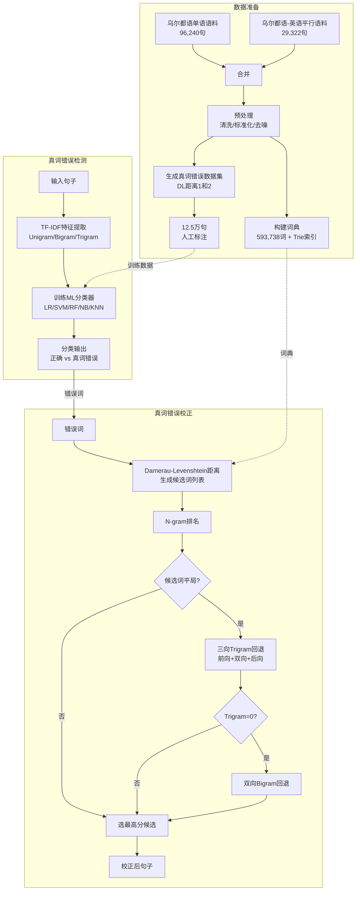

# Real Word Spelling Error Detection and Correction for Urdu Language

中文：乌尔都语真词拼写错误检测与校正

## 作者信息

| 作者 | 机构 | 身份/背景 | 领域大牛认定 |
|------|------|----------|-------------|
| **Romila Aziz** | COMSATS University Islamabad (Lahore Campus) | 博士生（M.S.已获，在读Ph.D.），2019-2022任访问讲师 | ★★☆☆☆ |
| **Muhammad Waqas Anwar** | COMSATS University Islamabad / Government College University Lahore | 教授，计算机科学系主任| ★★★☆☆ |
| **Muhammad Hasan Jamal** | COMSATS University Islamabad (Lahore Campus) | 助理教授，普渡大学博士 | ★★★☆☆ |
| **Usama Ijaz Bajwa** | COMSATS University Islamabad (Lahore Campus) | 副教授，机器感知与视觉智能研究组负责人 | ★★★☆☆ |
| **Angel Kuc Castilla** | Universidad Europea del Atlantico (Spain) | 教授 | ★★☆☆☆ |
| **Carlos Uc Rios** | Universidad Europea del Atlantico (Spain) | 教授 | ★★☆☆☆ |
| **Ernesto Bautista Thompson** | Universidad Europea del Atlantico (Spain) | 教授 | ★★☆☆☆ |
| **Imran Ashraf** | Yeungnam University (South Korea) | 助理教授，通信工程背景（室内定位/LIDAR） | ★★☆☆☆ |

## 团队相关信息

该论文由**COMSATS大学伊斯兰堡分校计算机科学系**为主完成，与**西班牙欧洲大西洋大学**和**韩国岭南大学**开展国际合作。Romila Aziz是本研究的执行者，导师为Muhammad Waqas Anwar。该团队在乌尔都语拼写检查领域已有系列工作（2020-2021年），此论文是该团队**从非词错误扩展至真词错误的系统化研究**，是Aziz博士论文的核心部分。

**值得注意**：多数学者（除Imran Ashraf外）长期深耕NLP与人工智能领域，团队规模较大（8人），国际合作网络广泛但技术贡献以COMSATS团队为主。

## 论文发表时间

| 项目 | 具体日期 | 来源/说明 |
|------|----------|----------|
| 出版日期 | 2023年9月7日 | IEEE Access正式出版 |
| 当前版本日期 | 2023年9月20日 | IEEE Access |
| Digital Object Identifier | 10.1109/ACCESS.2023.3312730 | IEEE Access |

该论文**已于2023年9月正式发表**于 **IEEE Access**（中科院二区，开源期刊，涵盖多学科工程与计算机科学），经同行评审后出版，非预印本或评审阶段论文。IEEE Access以审稿快速著称，该刊影响因子约3.9。

## 摘要

非词错误（Non-word errors）和真词错误（Real-word errors）是拼写错误的两种基本类型。非词错误是不存在于词典中的拼写错误，而真词错误是指词本身存在于词典中但在句子中被**上下文误用**的词。基于词典的查找方法广泛应用于非词错误检测，但无法处理真词错误，因为后者需要上下文信息。与英语不同，低资源语言（如乌尔都语）的真词错误检测与校正是一个未被探索的领域。本文提出了乌尔都语真词错误检测与校正方法。作者构建了包含**593,738个词**的大规模词典，并生成了包含**125,562个句子**和**2,552,735个词**的真词错误数据集。在真词错误检测阶段，使用词级N-gram特征配合五种机器学习分类器，实现了**Precision=0.84、Recall=0.79、F1=0.81**的性能，并在40%错误密度下进行了验证。在真词错误校正阶段，使用Damerau-Levenshtein距离生成候选词，并结合N-gram模型进行排名，最高校正准确率达**83.67%**。


## 一、这篇论文讲了一个什么样的故事？

这篇论文讲述的是乌尔都语拼写检查研究中**最后一块“硬骨头”——真词错误**的故事。

**背景设定**：过去20年，乌尔都语拼写检查主要解决“非词错误”（即词典里找不到的词），用词典查找法就能处理。但真词错误是另一种性质的问题——词本身在词典里，但在句子里用错了上下文。比如“I want to **hole** that you come”，这里的“hole”是个合法英语词，但应该用“hope”。这类错误在乌尔都语中同样存在，且**报告占比高达20-40%**。

**困境**：词典查找法对真词错误完全无效，因为它只看“词是否存在”，不问“词是否合适”。乌尔都语此前没有任何系统性的真词错误研究。

**解决方案**：本文作者构建了一条完整的真词错误处理流水线：
- 第一步：建立大规模词典（593,738词）和真词错误数据集（通过自动注入错误生成，人工标注）
- 第二步：用N-gram特征训练ML分类器检测哪个词可能是真词错误
- 第三步：用Damerau-Levenshtein距离生成候选词
- 第四步：用三向Trigram回退排名选出最佳候选

**结果**：真词错误检测F1达到0.81，校正准确率达83.67%。这是乌尔都语NLP中**首次系统化解决真词错误**的工作。

## 二、本文的核心思想和创新点

### 1. 核心思想

真词错误无法通过“词是否存在”来判断，必须依赖**上下文**。因此，拼写检查要从“词级问题”升级为“**句子级问题**”——检查一个词在特定上下文中是否合适，而不仅仅是它是否存在于词典中。

具体而言：
- **检测**：将真词错误建模为**二分类问题**——给定一个句子中的特定词及其周围上下文，判断它是否为真词错误（用N-gram特征 + ML分类器）
- **校正**：为检测出的错误生成候选词列表，用**上下文信息**（Trigram概率）选择最合适的候选

### 2. 关键创新点

**（1）首个乌尔都语真词错误数据集**

此前乌尔都语没有任何真词错误的标准数据集。作者从两个现有语料库（乌尔都语单语语料96,240句 + 乌尔都语-英语平行语料29,322句）出发，通过**自动注入错误 + 人工标注**的方式生成了125,562句真词错误数据集，并构建了593,738词的大规模词典。

**（2）真词错误检测：N-gram特征 + ML分类器**

用TF-IDF提取Unigram/Bigram/Trigram特征，结合5种ML分类器（SVM、RF、NB、LR、KNN）进行二分类（正确 vs 真词错误）。Logistic Regression表现最佳，F1=0.81。

**（3）三向Trigram回退排名算法**

这是校正阶段的核心创新。当候选词在Unigram/Bigram/Trigram排名中出现平局时，作者提出了一套**层级化回退机制**：
- 第一层：三个Trigram（前向 + 前后双向 + 后向）频率加权求和
- 第二层：若Trigram分数为0，回退到两个Bigram求和
- 第三层：若Bigram分数也为0，随机选择

**（4）数据集规模显著提升**

与之前Naseem (2004)的744个错误对、Aziz (2021)的147个错误相比，本文的数据集规模**提升约千倍**，达到12.5万句级别，使统计方法真正可行。

**（5）错误密度鲁棒性验证**

在30%和40%两种错误密度下测试，Logistic Regression的F1稳定在0.81，验证了方法的鲁棒性。


## 三、方法是怎么实现的？

### 1. 整体架构



**图注**：基于论文Figure 1（Architecture of the proposed work）及Section III（Methodology）综合绘制。

### 2. 关键算法

**（1）真词错误数据集生成算法**

```python
def generate_real_word_errors(corpus, lexicon, error_density=0.3):
    """
    在30%的句子中随机选择一个词，用DL距离1或2的混淆词替换
    """
    selected_sentences = random_select(corpus, ratio=error_density)
    for sent in selected_sentences:
        word = random_select(sent)
        confusion_set = damerau_levenshtein_generate(word, lexicon, d=2)
        if confusion_set:
            replacement = random_select(confusion_set)
            sent.label = "real-word error"
            sent.error_word = word
            sent.candidate = replacement
```

**（2）候选词生成**（反向编辑距离）

Damerau-Levenshtein距离 ≤ 2：
- 插入（Insertion）：在任意位置插入一个字母
- 删除（Deletion）：删除任意一个字母
- 替换（Substitution）：用词典中某字母替换
- 转置（Transposition）：交换相邻两字母

**（3）三向Trigram回退排名算法**

Step 1：计算三个Trigram频率
```
Tri = {
    W_{i-2} W_{i-1} C,    # 后向Trigram
    W_{i-1} C W_{i+1},    # 前后双向Trigram
    C W_{i+1} W_{i+2}     # 前向Trigram
}
score_Tri = sum(freq(tri) for tri in Tri)
```

Step 2：若score_Tri = 0，回退到Bigram
```
score_Bi = freq(W_{i-1}, C) + freq(C, W_{i+1})
```

Step 3：若score_Bi = 0，选择最长公共子序列最大的候选

### 3. 关键公式

**TF-IDF特征提取**（检测阶段）：
$$
W_{t,d} = tf_{t,d} \times \log\frac{N}{df_t}
$$

**Logistic Regression分类函数**：
$$
logit(P) = \beta_0 + \beta_1X_1 + \beta_2X_2 + \ldots + \beta_kX_k
$$

**三向Trigram排名分数**：
$$
freq(Tri) = freq(W_{i-2}W_{i-1}C) + freq(W_{i-1}CW_{i+1}) + freq(CW_{i+1}W_{i+2})
$$

**Bigram回退分数**：
$$
freq(Bi) = freq(W_{i-1}C) + freq(CW_{i+1})
$$

**校正准确率定义**：
$$
Accuracy = \frac{N_{SCW}}{N_{DE}}
$$
其中 $N_{SCW}$ 为候选词与正确词一致的数量，$N_{DE}$ 为检测出的真词错误总数。


## 四、实验效果

### 1. 实验设置

| 项目 | 设置 |
|------|------|
| 数据集 | 125,562句，2,552,735词 |
| 词典大小 | 593,738词 |
| 错误密度 | 30%（主要）/ 40%（鲁棒性测试） |
| 编辑距离分布 | 80%为DL=1，20%为DL=2 |
| 训练/测试分割 | 80%/20% |
| 分类器 | SVM, RF, NB, LR, KNN |
| 特征 | Unigram/Bigram/Trigram 单独及组合 |
| 工具 | Scikit-learn |
| 评估指标 | Precision/Recall/F1/Accuracy |

### 2. 主要结果

**真词错误检测结果**（30%错误密度）：

| 特征集 | 分类器 | Precision | Recall | F1 |
|--------|--------|-----------|--------|-----|
| Unigram | LR | 0.84 | 0.77 | 0.80 |
| Bigram | KNN | 0.81 | 0.80 | **0.80** |
| Trigram | KNN | 0.81 | 0.79 | **0.80** |
| **Combined** | **LR** | **0.84** | **0.79** | **0.81** |

**真词错误检测结果**（40%错误密度）：

| 特征集 | 分类器 | F1 |
|--------|--------|-----|
| **Combined** | **LR** | **0.81** |
| Combined | SVM | 0.76 |
| Bigram | KNN | 0.80 |

> 结论：LR在Combined特征下F1保持稳定，对错误密度不敏感，鲁棒性好。

**真词错误校正结果**：

| 校正方法 | Accuracy |
|----------|----------|
| DL + Unigram + 三向回退 | 52.65% |
| DL + Bigram + 三向回退 | 76.33% |
| **DL + Trigram + 三向回退** | **83.67%** |

**核心结论**：
- Trigram排名效果最佳，因其捕获了更多上下文信息（前两个词）
- Bigram（前一词）效果次之
- Unigram（无上下文）效果最差（仅52.65%）
- 三向Trigram回退在平局时提供了有效的消歧能力

### 3. 关键发现

**（1）真词错误占比高**

文献报告真词错误占拼写错误总量的20-40%，本文研究证实了这一比例，凸显了真词错误检测的实际重要性。

**（2）Logistic Regression在检测阶段最优**

NB因特征独立性假设不符而表现最差（F1低至0.36）；LR因能联合考虑特征间相关性而最优。

**（3）Trigram排名效果显著优于Bigram**

从76.33%提升至83.67%，说明在乌尔都语中，前两个词的上下文对消除真词错误歧义至关重要。

**（4）三向Trigram回退机制有效**

在候选词排名出现平局时，结合前向$Trigram(C W_{i+1} W_{i+2})$和双向$Trigram（W_{i-1} C W_{i+1}）$ 以及后向$ Trigram（W_{i-2} W_{i-1} C）$ 的三向评分提供了额外的消歧信息。


## 五、优点与局限性

### ✅ 1. 优点

**填补真词错误研究空白**

这是乌尔都语NLP中**首次系统化研究真词错误检测与校正**的完整工作。此前所有乌尔都语拼写研究都限于非词错误。

**数据集规模大幅提升**

从Naseem (2004)的744个错误提升到125,562个句子、2.55M词、593K词词典的规模，提升3个数量级，使统计方法具有统计显著性。

**完整的两阶段流水线**

将真词错误处理分解为“检测”和“校正”两个阶段，分别建模，思路清晰，工程可落地性强。

**三向Trigram回退算法创新性强**

针对N-gram排名平局问题设计了层次化的回退消歧机制，为其他低资源语言的类似问题提供了可参考的方法。

**鲁棒性验证充分**

在30%和40%两种错误密度下测试，证实了方法对错误密度的鲁棒性。

**词典规模大**

593,738词的词典，是目前乌尔都语NLP中规模最大的公开词典之一。

### ⚠️ 2. 局限性（研究边界与待解问题）

**单错误约束限制实用性**

论文严格限制“每句只有一个真词错误”，但真实文本中一个句子可能包含多个真词错误，此约束降低了方法的真实适用性。

**人工注入错误 vs 自然错误**

错误是通过自动替换生成的（DL距离1或2的混淆词），而非从真实用户文本中采集。生成的错误可能与自然错误分布存在差异（如认知错误、键盘邻接错误等复杂模式未被完全模拟）。

**词典封闭性未解决**

词典为静态构建，无法处理新词（专有名词、新兴网络词汇、外来词），真实应用中会产生假阳性或漏检。

**检测与校正耦合度低**

检测用ML分类器，校正用DL距离+N-gram排名，两个阶段相对独立，错误在检测阶段的误分类无法在校正阶段纠正。

**深度学习未应用**

本文仍以传统ML为主，未使用BERT等预训练语言模型或BiLSTM等深度模型。作者在结论中承认这是未来方向，但技术相对SOTA有明显差距。

**上下文窗口有限**

Trigram最多看到前两个词，无法捕获长距离上下文依赖，复杂的语义错误可能无法被检测到。

**无公开基准**

论文未声明将数据集和代码公开发布，可复现性存疑。


## 六、其他

### 第一性原理

真词错误的本质问题是：**词的存在性（lexical validity）≠ 词的适用性（contextual appropriateness）**。

词典查找法基于一个隐含假设——“存在的词就是合适的词”。但对于真词错误，这个假设不成立。因此，解决方法必须引入**上下文信息**——不是问“这个词存在吗”，而是问“在这个位置，这个词合适吗”。

从信息论角度看，真词错误检测需要**比词典查找更多的信息熵**。词典查找只需知道“词在不在词典中”（1 bit信息），真词错误检测需要知道“这个词在给定上下文中是否最优”（log V bits，V为词典大小）。本文用N-gram特征和ML分类器试图捕获这些额外的上下文信息。

**为何Trigram有效？**

Trigram的有效性依赖于语言的局部依赖性——在绝大多数情况下，一个词的合适性可通过前两个词来判断。这是语言建模的Markov假设的体现：$P(w_i|w_1...w_{i-1}) \approx P(w_i|w_{i-2}w_{i-1})$。Trigram排名本质上是在不同候选词之间比较这个条件概率。

**为何三向Trigram回退有效？**

当候选词在Trigram频率上平局时，说明仅靠前两个词不足以区分。三向回退（前向Trigram $C W_{i+1} W_{i+2}$ + 双向Trigram $W_{i-1} C W_{i+1}$ + 后向Trigram $W_{i-2} W_{i-1} C$）实际上是在**同时利用左上下文和右上下文**，捕捉更多信息，从而打破平局。

### 领域空白

**真词错误**是乌尔都语拼写检查的最后一块未被系统研究的版图。

此前研究的覆盖范围：
- ✅ 非词错误：Naseem (2004), Iqbal (2013), Aziz (2021)
- ✅ 词边界错误：Durrani (2010)
- ❌ 真词错误：**完全空白**（截至2023年）

本研究填补了这一空白，但也揭示了更多待解决的空白：

1. **多错误句子**：本文仅处理单错误句子，多错误句子是未来工作
2. **长距离依赖**：Trigram无法处理长距离依赖，未来可用BiLSTM/Transformer
3. **开放词典**：静态词典无法处理新词，需要引入形态分析或子词模型
4. **实时处理**：本文为离线处理，生产环境需要毫秒级响应
5. **多语言混合**：乌尔都语文本常混合英语/阿拉伯语，本文未处理
6. **罗马乌尔都语**：与标准乌尔都语正交，本文完全未涉及（参考Soomro 2024的工作）

---

> 本文由 Deepseek AI 生成

