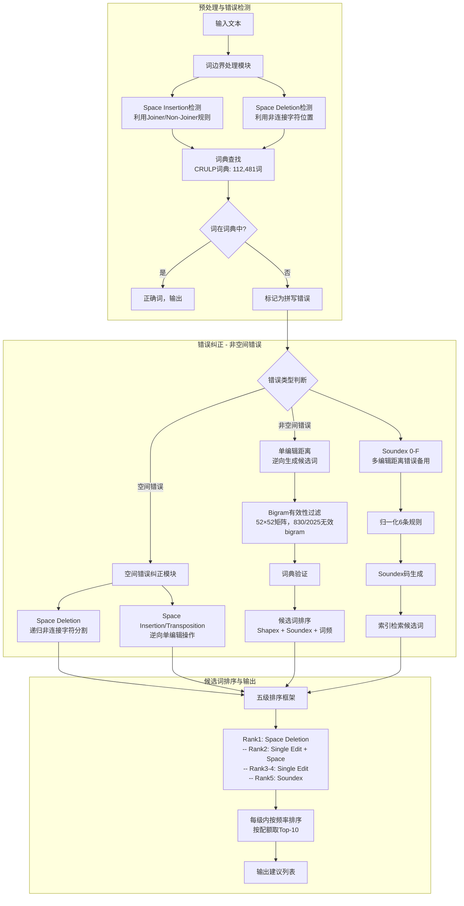

# A Hybrid Approach for Urdu Spell Checking

---

## **作者信息**

| 作者 | 机构 | 身份/背景 | 领域大牛认定 |
|------|------|-----------|-------------|
| Tahira Naseem | FAST - National University of Computer & Emerging Sciences, Lahore | 硕士生（2004年毕业，导师Dr. Sarmad Hussain） | 非大牛（当时），后成为Google/IBM NLP研究员 |
| Dr. Sarmad Hussain（导师） | FAST-NU; CRULP（Center for Research in Urdu Language Processing） | 副教授，CRULP创始人 | ★★★★ 乌尔都语NLP领域奠基人，CRULP创始人，在乌尔都语语音学、文字处理、拼写检查等领域有奠基性贡献 |
| Mr. Shafiq-ur-Rahman（评审） | FAST-NU | 副教授 | 非大牛 |
| Dr. Fakhar Lodhi（系主任） | FAST-NU | 计算机科学系主任 | 非大牛 |

## **团队相关信息**

该论文是**Tahira Naseem在FAST-NU（巴基斯坦国立计算机与新兴科学大学）的硕士学位论文**，由导师**Dr. Sarmad Hussain**指导完成。Sarmad Hussain是**乌尔都语NLP领域最具影响力的学者之一**，2000年代初创立了CRULP（Center for Research in Urdu Language Processing），该中心在乌尔都语语音、文字处理、拼写检查、OCR等领域均有奠基性贡献。CRULP是巴基斯坦乌尔都语计算语言学方向的**核心研究基地**，其构建的乌尔都语语料库和词典至今仍是该领域的基础资源。

Tahira Naseem出生于1980年11月17日，2002年获得Lahore College for Women University计算机科学学士学位，2002-2004年间完成本硕士论文研究。她在2004年之后的职业生涯中，先后在Google、IBM等机构从事NLP研究，在命名实体识别、跨语言表示学习等方向发表了多篇高水平论文，可以说是从乌尔都语拼写检查起步逐步成长为NLP领域有影响力的研究者。

该团队的独特之处在于：**在乌尔都语NLP几乎为零的时代，敢于从零开始构建基础设施**（包括词典、语料库、错误语料），并系统性地将英语NLP技术进行本地化适配。这种"从书写系统出发理解NLP"的方法论，影响了其后20年整个乌尔都语NLP研究的方向。

## **论文发表时间**

| 项目 | 具体日期 | 来源/说明 |
|------|----------|-----------|
| 完成时间 | 2004年11月 | MS Thesis, FAST-NU |
| 研究周期 | 2002-2004 | 约2年 |
| 发表形式 | 硕士学位论文（非会议/期刊） | 约70页，含5个附录 |
| 后续发表 | 2007年发表于Language Resources and Evaluation（Springer） | 核心内容（Shapex排序）在期刊正式发表 |

该论文**2004年11月完成**，为硕士学位论文，**未正式发表于会议或期刊**，但作为乌尔都语拼写检查领域的开创性工作，被后续大量研究广泛引用。其核心贡献（特别是Shapex技术和错误模式研究）在2007年以"A Novel Approach for Ranking Spelling Error Corrections for Urdu"为题发表于Springer期刊Language Resources and Evaluation（LRE）。

---

## **摘要**

本文针对乌尔都语拼写检查问题，系统性地完成了以下工作：

1. **文献综述**：全面回顾了1960年代以来40年的拼写检查技术发展，包括编辑距离（Damerau、Levenshtein、加权编辑距离）、语音相似性（Soundex、Phonix、Editex）、N-gram相似度、相似性键（Skeleton Key、Omission Key、Plato Key）、噪声信道模型（Noisy Channel Model）以及上下文敏感纠错（Context-Based Error Correction）等。

2. **两项实证研究**：从报纸文本和学生论文中收集错误数据，首次系统性地揭示了乌尔都语拼写错误的独特模式——**视觉相似性混淆（35%）远多于语音相似性（约12%）**，且75%的错误与词边界问题相关。

3. **乌尔都语特殊问题识别**：系统梳理了三大挑战——选词问题（Diction Problem，即同词异拼现象）、词边界问题（Word Boundary Problem，空格插入/删除）、变音符号问题（Diacritics Problem）。

4. **混合方法提出**：设计了Soundex的乌尔都语本地化方案（6条归一化规则，两个版本Soundex 0-F和Soundex 0-9），结合单编辑距离（Single Edit Distance）和专门的词边界处理算法，形成管线式混合方案。最终Top-1准确率达82.57%，总召回率96.68%。

---

## 一、这篇论文讲了一个什么样的故事？

2004年，一个22岁的巴基斯坦女硕士生Tahira Naseem坐在FAST-NU的实验室里，面对着一个几乎空白的领域：**乌尔都语没有一个能用的拼写检查器**。英语拼写检查技术已经发展了40年，从Damerau（1964）到Brill & Moore（2000），技术日趋成熟。但这些技术**无法直接迁移到乌尔都语**——因为乌尔都语使用阿拉伯字母的Nastaliq书写体，字母的连写规则（Joiner/Non-Joiner）导致空格在乌尔都语中**不是词边界标记，而是字形控制工具**。更糟糕的是，连一个机器可读的乌尔都语词典都没有。

Tahira Naseem的故事分三层展开：

**第一层：摸清敌人**。她手工分析了几百个报纸和学生论文中的拼写错误，发现了一个反直觉的结论——在英语中，主要错误来源是键盘邻接（58%），而在乌尔都语中，**视觉形状相似的字母混淆是主要错误来源**（35%的替换错误涉及形状相似的字母，如ج/چ、ت/ٹ、د/ڈ）。这个发现直接催生了Shapex技术的诞生。

**第二层：改造工具**。Soundex是为英语名字匹配设计的，直接套用到乌尔都语上效果很差。她发明了6条专门针对乌尔都语的归一化规则——比如词首‫ا→ع‬（处理词首alif混淆），词尾‫ہ→ا‬（词尾he发音同alif），送气符号‫ھ的判断规则（前邻字符可送气则忽略否则→ہ）——这些规则展现了深刻的语言学洞察力。

**第三层：解决独有问题**。75%的乌尔都语拼写"错误"其实不是真正的错误，而是**词边界问题**——打字者故意不加空格，因为词尾的非连接字符自动断开，视觉上完全看不出问题。她设计了一个递归分割算法，利用非连接字符作为分割点，结合频率排序和主观排序（越短的切分越优先），实现了98.2%的纠正率。

这是一篇典型的"**从零到一**"的论文。它不追求算法的炫技，而是**从书写系统的基本原理出发，系统地识别问题、改造工具、解决独有挑战**。这种方法论影响了其后20年整个乌尔都语NLP研究的方向。

---

## 二、本文的核心思想和创新点

### 1. 核心思想

**不同语言的拼写错误模式由其书写系统根本决定，因此拼写检查技术必须针对目标语言进行本地化改造。** 乌尔都语由于其阿拉伯字母/Nastaliq书写体与英语的根本性差异，在三个维度上需要特殊处理：

- **语音维度**：乌尔都语有大量同音字母（如ز/ذ/ض/ظ四者同音），Soundex必须重新设计编码方案
- **视觉维度**：阿拉伯字母中存在大量形状相似但发音不同的字母对（如ب/ت/ث/پ形状相似），需要Shapex来捕捉视觉混淆
- **结构维度**：非连接字符规则导致空格不是词边界标记，需要专门的词边界处理算法

此外，论文提出了一个重要的方法论观点：**对于低资源语言，统计/概率方法（如噪声信道模型）不可行**——因为缺乏标准键盘布局（导致混淆矩阵不可靠），且缺乏大规模标注错误语料。因此，**规则方法的智能组合**是更实际的路径。

### 2. 关键创新点

1. **首次系统性研究乌尔都语拼写错误趋势**
   - 研究1：手工分析报纸（91.18%为打字错误）和学生论文（57.69%为打字错误，42.31%为认知错误）中的230个错误
   - 研究2：从170万词语料库中自动筛选975个低频词（潜在错误），发现**75.49%为空间相关错误**
   - 关键发现：替换错误最频繁（47.42%），35%的替换涉及形状相似字母；视觉混淆远多于语音混淆

2. **Soundex的乌尔都语本地化（6条归一化规则）**
   - 规则1：词首‫ا→ع（处理词首alif与ain混淆）
   - 规则2：‫آ→ا（alif-madda折合）
   - 规则3：词尾‫ہ→ا（词尾he的发音同alif）
   - 规则4：送气符号‫ھ判断——前邻字符可送气（ب/پ/ت/ٹ/ج/چ/ک/گ）→忽略；否则→ہ
   - 规则5：词首/元音间‫ى→ژ（此时yā为半元音）
   - 规则6：‫و的处理——元音间→辅音；否则→元音(pesh)
   - 设计了两个版本：Soundex 0-9（10组数字码）和Soundex 0-F（16组十六进制码）

3. **Shapex视觉相似性编码的雏形**
   - 将43个乌尔都语字母按视觉形状分为10组（0-9）
   - 用于单编辑距离候选词的排序
   - 这是后续2007年LRE期刊论文中Shapex完整方案的前身

4. **词边界问题的系统性解决方案**
   - **Space Deletion**：利用非连接字符位置作为分割点，递归尝试所有可能分割，结合频率排序（取最不频繁词的频率作为整体频率）和主观排序（越短→越优先）
   - **Space Insertion/Transposition**：作为单编辑操作处理，约50%可纠正

5. **多维度排序框架**
   - 五级排序：Rank1（Space Deletion Rank1）→ Rank2（Single Edit Rank1 + Space Deletion Rank2 + Space Insertion/Transposition）→ Rank3-4（Single Edit Rank2-3）→ Rank5（Soundex 0-F）
   - 在每级内部按频率排序，按配额选取Top-10建议

---

## 三、方法是怎么实现的？(How does it work?)

### 1. 架构



**图注**：参考论文Figure 5.1-5.4（方法论流程图）综合绘制。

### 2. 关键算法

**算法1：Soundex乌尔都语归一化（两遍处理）**

第一遍：确定‫ى和ہ的元音/辅音属性

第二遍：基于第一遍结果确定‫و的元音/辅音属性，并重新审查‫ی的状态

这是因为‫و和‫ى的元音/辅音行为受上下文影响，必须分两遍处理。例如，如果‫و在‫ا或已识别为元音的‫ى/ہ之后，则认定为辅音；否则为元音。

**算法2：词边界分割（递归非连接字符分割）**

```
function split_word(word):
    if word in dictionary: return [word]
    for each non-joiner position p in word:
        left = word[0:p+1]
        right = word[p+1:]
        if left in dictionary:
            right_parts = split_word(right)
            if right_parts is not None:
                return [left] + right_parts
    return None
```

使用备忘录（memoization）避免重复检查已处理过的子串。此外，将词尾的‫ن→ں和‫ى→ے转换后再查词典，处理常见的词尾连接省略。

**算法3：五级排序框架**

- 每级内按词频排序（取分词中最不频繁词的频率作为整体频率）
- 主观排序：越短的分词方案越优先（Rank1.1: 2部分 > Rank1.2: 3部分 > Rank1.3: 4+部分）
- 在Rank1内，对非连接字符处的分割（Rank1）优先于连接字符处的分割（Rank2）
- 各Rank配额：Rank1和Rank5各最多2个建议，其余从Single Edit建议中选取，总共10个建议

### 3. 关键公式

**逆向单编辑距离候选词数量公式**（后来2013年论文进一步形式化）：

对于字母表大小m=43（乌尔都语），词长n：
- 删除变体：n个
- 插入变体：m × (n+1) = 43(n+1)个
- 替换变体：(m-1) × n = 42n个
- 换位变体：n-1个
- 总计：n + 43(n+1) + 42n + (n-1) = 86n + 41

对于英语（m=26）：53n + 25

---

## 四、实验效果 (Experimental Results)

### 1. 实验设置

- **数据集**：
  - 错误趋势研究1：230个手工标注错误（报纸+学生论文）
  - 错误趋势研究2：170万词语料库，筛选975个低频词
  - 测试集：744个错误-正确词对（含444个空间错误和280个非空间错误）
- **词典**：CRULP词典，112,481词
- **语料库**：170万词（用于词频统计）
- **评估指标**：Top-1/Top-2/Top-5/Top-10准确率，总召回率，平均建议数
- **对比基线**：Soundex四个变体（0-9/0-F × 首字母编码/不编码），单编辑距离+四种排序方案

### 2. 主要结果

**Soundex变体对比**（280个非空间错误测试集）：

| Soundex变体 | Top-1 | Top-5 | Top-10 | Total Recall | 平均建议数 |
|-------------|-------|-------|--------|-------------|-----------|
| 0-F + 首字母编码 | 26.2% | 44.4% | 49.5% | 54.8% | 21 |
| 0-9 + 首字母编码 | 20.1% | 35.5% | 43.0% | 60.9% | 92 |
| 0-F + 首字母不编码 | 23.7% | 36.2% | 39.1% | 39.8% | 7 |
| 0-9 + 首字母不编码 | 22.6% | 40.9% | 46.2% | 49.5% | 21 |

**结论**：Soundex 0-F + 首字母编码在效率和准确性之间取得最佳平衡。Soundex 0-9虽然总召回率更高，但建议集过大（平均92个），排序后Top-10流失18%。

**单编辑距离 + 不同排序方案**（280个非空间错误）：

| 排序方案 | Top-1 | Top-5 | Top-10 | Total Recall |
|----------|-------|-------|--------|-------------|
| SE + 词频(FR) | 58.1% | 90.0% | 93.5% | 94.6% |
| SE + Shapex + FR | 64.2% | 89.6% | 93.9% | 94.6% |
| SE + Soundex + FR | 64.5% | 89.6% | 93.5% | 94.6% |
| SE + Shapex + Soundex + FR | **71.7%** | 87.1% | 93.5% | 94.6% |

**结论**：Shapex和Soundex在Top-1准确率上贡献几乎相同（各约+6%），三者组合达71.7% Top-1。但Top-5反而略有下降（从90.0%降至87.1%），说明组合排序有时会将一些本应在前5的正确建议挤出Top-5。

**空间删除错误纠正**（443个空间删除错误）：

| 方法 | Top-1 | Top-2 | Total Recall | 平均建议数 |
|------|-------|-------|-------------|-----------|
| 单空间删除 | 92.3% | 94.2% | 94.2% | 1.5 |
| 多空间删除 | **95.7%** | **98.2%** | **98.2%** | 1.5 |

**混合方法最终结果**（724个全部错误）：

| 方法 | Top-1 | Top-2 | Top-5 | Total Recall | 平均建议数 |
|------|-------|-------|-------|-------------|-----------|
| SE + SPD + SX | **82.57%** | 93.91% | 96.27% | 96.68% | 6 |
| SE + SPD | 82.43% | 93.08% | 96.13% | 96.54% | 6 |

### 3. 消融实验与关键发现

**关键发现**：

1. **Soundex在检索方面贡献极小**（仅增加0.14%总召回率），但在排序中发挥作用。这说明乌尔都语的多编辑距离错误很少是语音性质的。

2. **Shapex和Soundex在排序中贡献几乎相等**（各自约+6% Top-1），验证了"视觉相似性在乌尔都语拼写错误中与语音相似性同等重要"的假设。

3. **空间删除错误几乎可以完美纠正**（98.2%），因为非连接字符提供了明确的分割信号。未纠正的1.8%是空间删除+其他错误的复合错误。

4. **25%的空间相关错误是真实词错误**（分割后产生合法但非预期的词），这为后续真实词错误研究提供了动机。

5. **与英语概率模型的差距**：Top-1 82.57% vs 英语95%（Toutanova & Moore 2002），但总召回率96.68% vs 英语98%，差距不大。

---

## 五. 优点与局限性

### ✅ 1.优点

- **开创性**：乌尔都语拼写检查领域的奠基性工作，首次系统性研究错误模式、识别语言特殊问题、提出解决方案
- **本地化深刻**：对Soundex的6条乌尔都语归一化规则设计精妙，深刻理解乌尔都语书写系统（如‫و/ى/ہ的元音/辅音双重角色、送气符号‫ھ的判断规则）
- **问题识别全面**：同时覆盖非词错误、词边界问题、选词问题、变音符号问题
- **实证研究扎实**：两项错误趋势研究（手工+自动），为后续工作提供了数据基础
- **方法论贡献**：提出了"从书写系统出发分析问题→改造通用技术→解决语言独有挑战"的研究范式
- **Shapex概念雏形**：首次提出基于视觉形状相似性的编码方案，为2007年LRE论文奠定了基础
- **实用性强**：总召回率96.68%，平均6个建议，接近实用化水平

### ⚠️ 2.局限性

- **仅覆盖非词错误**：明确排除了真实词错误（Real-word errors），而25%的空间相关错误是真实词错误
- **单编辑距离限制**：只能处理单字符错误，约4%的多字符错误（编辑距离≥2）无法覆盖
- **无正式发表**：作为硕士论文未经过同行评审，核心方法在3年后（2007年）才正式发表于LRE
- **词典规模有限**：112,481词，缺少复合词和词形变化形式
- **词频排序依赖语料库质量**：170万词语料库不够平衡，导致某些罕见词获得过高频率
- **无标准评估指标**：未使用Precision/Recall/F1-score等标准化指标
- **键盘布局缺失**：因乌尔都语无标准键盘布局，主动放弃了键盘邻接这一重要排序参数
- **无上下文信息**：所有纠正基于孤立词，未利用句子级上下文

---

## 六. 其他

### 第一性原理

**书写系统决定错误模式，错误模式决定纠正策略。** 乌尔都语的阿拉伯字母书写系统（连写规则、字母多形态、空格非词边界）从根本上决定了其拼写错误的独特模式——视觉混淆优先、词边界问题是主要挑战。任何来自英语的技术方案都必须从书写系统的基本原理出发进行重新设计，而不能简单移植。

### 领域空白

本论文明确指出了以下空白：
- 真实词错误（Real-word errors）检测与纠正（25%的空间相关错误是真实词错误）
- 基于统计/概率模型的方法（如噪声信道模型），待标准键盘布局和充足训练数据就绪后
- 复合词处理（形态学分析）
- 多编辑距离错误的纠正（编辑距离≥2）
- 上下文感知的纠错
- 大规模标准化评估数据集

这些空白在后续20年的研究中被逐步填补——2013年RevED、2021年混合排序、2023年真实词错误、2024年Roman Urdu和OCR后处理。

---

> 本文由 DeepSeek AI 生成
