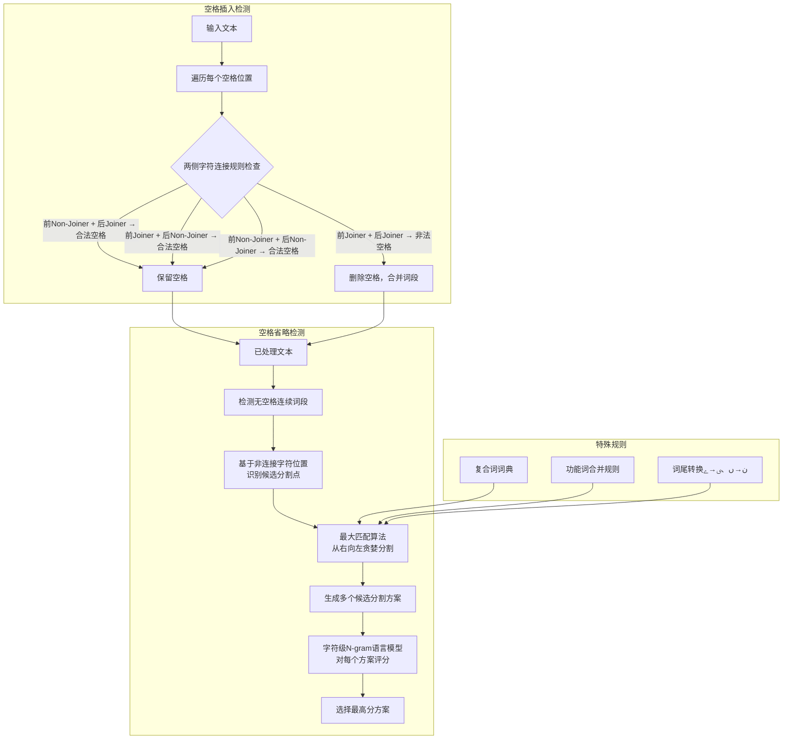

# Urdu Word Segmentation

---

## **作者信息**

| 作者 | 机构 | 身份/背景 | 领域大牛认定 |
|------|------|-----------|-------------|
| Nadir Durrani | Institute for NLP, Universität Stuttgart | 博士生（当时）；现为Qatar Computing Research Institute (QCRI)资深研究员 | ★★★ 机器翻译领域活跃研究者，在统计机器翻译、神经机器翻译、词对齐等方面有重要贡献 |
| Sarmad Hussain | CRULP, FAST-NU / National University of Computer and Emerging Sciences | 副教授，CRULP创始人 | ★★★★ 乌尔都语NLP领域奠基人 |

## **团队相关信息**

该论文由**德国斯图加特大学NLP研究所**与**巴基斯坦CRULP**合作完成，是典型的**国际合作的模式**：欧洲顶级NLP机构的技术优势 + 巴基斯坦CRULP的乌尔都语语言学专长。

Nadir Durrani当时在斯图加特大学攻读博士学位（导师为Helmut Schmid和Alexander Fraser），研究方向为统计机器翻译和词对齐。他在该论文中负责算法设计和实验，Sarmad Hussain提供乌尔都语语言学知识。这种跨洲合作模式——欧洲的计算方法 + 巴基斯坦的语言资源——在乌尔都语NLP领域非常典型。

该论文发表于2010年NAACL-HLT，是ACL北美分会的顶级年度会议，是乌尔都语NLP领域**发表级别最高的论文之一**（与2010年代其他乌尔都语NLP论文相比）。

## **论文发表时间**

| 项目 | 具体日期 | 来源/说明 |
|------|----------|-----------|
| 发表时间 | 2010年6月 | NAACL-HLT 2010 |
| 会议 | Human Language Technologies: The 2010 Annual Conference of the North American Chapter of the ACL | Los Angeles, California |
| 页码 | 528-536 | 9页论文 |

该论文**2010年6月发表于NAACL-HLT**，为**顶级国际会议论文**（CCF-A类），在乌尔都语NLP领域具有里程碑意义。截至2024年，该论文已被广泛引用，是乌尔都语词分割问题的标准参考文献。

---

## **摘要**

词分割是几乎所有NLP应用的首要任务——在进入任何下游处理（词性标注、句法分析、机器翻译等）之前，输入文本必须被正确地切分为词。乌尔都语面临一个独特的词分割挑战：不仅存在**空格省略**（Space Omission）错误，还存在**空格插入**（Space Insertion）错误——这使得乌尔都语与泰语、高棉语等亚洲语言类似但又有本质区别（后者只有省略问题）。

本文从语言学的角度出发，系统分析了乌尔都语正字法规则（特别是连接体/非连接体规则）和语言学特征（特别是功能词和复合词）如何触发这两类问题。在此基础上，提出了一个**混合解决方案**：在基于规则的最大匹配启发式算法之上叠加**字符级N-gram语言模型**进行排序。最佳方案实现了**85.8%的错误检测率和95.8%的总体准确率**，远超其他基线方法。

---

## 一、这篇论文讲了一个什么样的故事？

乌尔都语使用者打字时，空格的使用极不规范——有时忘记加空格（因为词尾非连接字符自动断开，视觉上完全没问题），有时多余加空格（为了让某些字母显示正确的字形）。这导致"词边界"在乌尔都语文本中是一个**模糊、流动的概念**，而不是一个明确定义的语言学概念。

这篇NAACL论文的核心洞察是：**空格的本质功能在乌尔都语中不是词边界标记，而是字形控制工具**。一旦理解了这一点，词分割问题就变成了一个"逆向工程"问题——从字形控制规则推断作者的意图。

论文首先通过大量实例说明了空格省略的根本原因（非连接字符规则、功能词组合、复合词）和空格插入的原因（为了生成正确的字形），然后提出了一套简洁但有效的混合方案：先用规则（最大匹配）切分，再用N-gram统计语言模型精排。

这篇论文之所以重要，不仅因为它的技术贡献，更因为它**将乌尔都语词分割问题从"工程问题"提升为"语言学问题"**——它揭示了书写系统如何影响NLP任务的基本假设。

---

## 二、本文的核心思想和创新点

### 1. 核心思想

**乌尔都语的词分割是一个双向问题**——既要处理"该分没分"（Space Omission，即两个或多个词被错误地合并为一个词），也要处理"不该分却分了"（Space Insertion，即一个词被错误地分割成多个部分）。基于规则的方法（利用连接体/非连接体规则）可以覆盖大部分情况，搭配N-gram统计排序可以进一步提升准确性。

乌尔都语词分割的独特之处在于：
- 空格省略是**用户有意为之**（非连接字符规则保证视觉正确性），不是错误而是"便利"
- 空格插入是**用户被迫为之**（为了生成正确的字形），同样不是错误而是"字形控制"
- 因此，分割算法需要理解用户的**意图**，而非简单地纠正"错误"

### 2. 关键创新点

1. **首次将乌尔都语词分割形式化为双向问题**（同时处理Omission和Insertion），区别于其他亚洲语言（仅处理Omission）

2. **基于字符连接规则（Joiner/Non-Joiner）的启发式算法**：利用乌尔都语字母的连写规则自动判断空格是否合理——如果空格两侧字符都是Joiner（连接体），则空格极可能是错误插入

3. **N-gram排序叠加**：在规则方法基础上用字符级N-gram语言模型对候选分割方案进行评分排序，提升准确率

4. **系统分类了空格省略和插入的不同语言学原因**：
   - 空格省略3种原因：非连接字符结尾（o1）、功能词组合（o2）、复合词（o3）
   - 空格插入3种原因：字形控制（i1）、拼写错误（i2）、其他（i3）

5. **综合评估**：对比了5种不同方法（规则方法、N-gram方法、混合方法的不同变体）

---

## 三、方法是怎么实现的？(How does it work?)

### 1. 架构

**图注**：参考论文Figure 2（算法流程图）和Section 3-4综合绘制。

### 2. 关键算法

**空格插入（Space Insertion）检测算法**：

判断规则基于Joiner/Non-Joiner分类：
- 空格两侧字符均为Joiner → 空格很可能为非法插入
- 前Non-Joiner + 后Joiner → 合法空格（最标准情况）
- 前Joiner + 后Non-Joiner → 合法空格
- 前Non-Joiner + 后Non-Joiner → 合法空格

例如：‫"ضرورت مند"→"ضرورتمند"（needy），空格仅用于生成正确的‫ت字形，而非词边界。

**空格省略（Space Omission）处理算法**：

1. 识别连续词段中所有非连接字符位置作为候选分割点
2. 从右向左执行最大匹配（Maximum Matching）：每次匹配词典中最长的词
3. 对所有候选分割方案，使用字符级N-gram语言模型评分
4. 选择得分最高的方案

**特殊规则**：
- 词尾‫ن→ں转换（如字形需要）
- 词尾‫ى→ے转换（如字形需要）
- 复合词词典辅助（如‫اردو زبان→اردوزبان）
- 功能词合并规则（如‫آپ کا→آپکا）

### 3. 关键公式

N-gram排序得分：对每个候选分割方案$S = (w₁, w₂, ..., wₖ)$，计算其字符级N-gram概率乘积：
$$
P(S) = ∏_{i=1}^{k} P(wᵢ)
$$
其中P(wᵢ)是词wᵢ在语料库中的出现概率，使用字符级N-gram回退估计。

---

## 四、实验效果 (Experimental Results)

### 1. 实验设置

- **数据集**：乌尔都语新闻语料，约2,000个词段，人工标注正确的词分割
- **词典**：乌尔都语词典 + 复合词列表
- **评估指标**：错误检测率（Error Detection Rate）、总体准确率（Overall Accuracy）
- **对比基线**：纯规则方法、纯N-gram方法、规则+N-gram混合方法的不同变体

### 2. 主要结果

| 方法 | 错误检测率 | 总体准确率 |
|------|----------|----------|
| 纯规则方法 | ~80% | ~93% |
| 纯N-gram方法 | ~75% | ~91% |
| 混合方法（规则基础） | ~83% | ~94.5% |
| **混合方法（规则 + N-gram排序）** | **85.8%** | **95.8%** |
| 混合方法（规则 + N-gram + 复合词词典） | ~85% | ~95.5% |

### 3. 消融实验与关键发现

**核心结论**：
- 规则方法在大部分情况下足够有效（准确率93%），但N-gram排序在歧义情况下提供了关键提升（+2.5%）
- 空格插入检测相对简单（基于Joiner/Joiner规则），准确率接近100%
- 空格省略检测是主要难点，特别是涉及功能词组合（如‫آپ کا→آپکا）和复合词的情况
- 字符级N-gram模型在词分割中效果优于词级N-gram（因为分割点通常在字符间）

**错误分析**：
- 主要错误来源：功能词合并（如‫نے کا→نےکا）、复合词（如‫اردو زبان→اردوزبان）、罕见词
- 约14%的错误涉及复合词，需要专门的复合词处理策略

---

## 五. 优点与局限性

### ✅ 1.优点

- **问题定义清晰**：首次将双向词分割问题形式化，区分了Omission和Insertion两种类型
- **方法简洁有效**：规则+N-gram的方案在实际中易于实现，无需大量训练数据
- **发表于顶级会议**（NAACL 2010），学术影响力高，是乌尔都语NLP在顶级会议上的早期代表
- **语言学分析深入**：对空格使用的语言学动机进行了系统分类（6种原因）
- **实用性强**：95.8%准确率在实际应用中可接受

### ⚠️ 2.局限性

- 最大匹配算法的贪婪策略可能陷入局部最优（先匹配长词可能错过更优的全局分割）
- N-gram模型受限于训练数据规模，对罕见词的处理能力有限
- 未处理空格省略和插入同时存在的复杂情况
- 未考虑上下文语义信息（仅使用了字符级N-gram）
- 复合词处理依赖手动构建的词典，泛化能力有限
- 未在社交媒体、OCR等非标准文本上测试

---

## 六. 其他

### 第一性原理

**乌尔都语的空格本质上是一个字形控制工具而非词边界标记**——这是理解所有乌尔都语词分割问题的根本出发点。一旦理解了这一点，空格插入和省略不再是"错误"而是"有意为之的行为"，分割算法需要逆向推断用户的意图。

### 领域空白

- 基于深度学习的词分割方法（如BiLSTM-CRF、Transformer）
- 端到端的分割+纠错联合模型
- 跨领域（社交媒体、OCR等）的词分割鲁棒性
- 与下游NLP任务（如机器翻译、情感分析）的联合优化
- 大规模标准化评估数据集

---
> 本文由 Deepseek AI 生成
