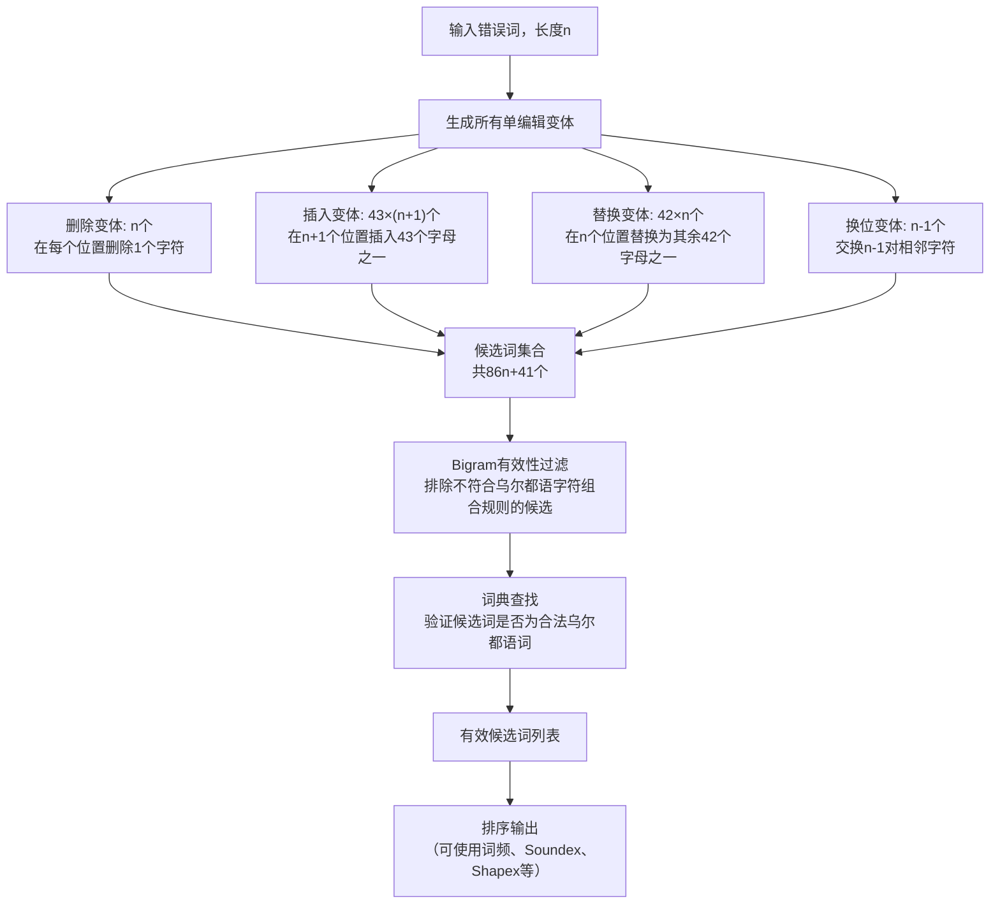

# Urdu Spell Checking: Reverse Edit Distance Approach

---

## **作者信息**

| 作者 | 机构 | 身份/背景 | 领域大牛认定 |
|------|------|-----------|-------------|
| Saadat Iqbal | COMSATS Institute of Information Technology, Abbottabad | 研究者 | 非大牛 |
| Waqas Anwar | COMSATS, Abbottabad（后转至Lahore Campus） | 教授 | ★★ 乌尔都语拼写检查领域活跃研究者，后续持续发表多篇高水平论文 |
| Usama Ijaz Bajwa | COMSATS, Abbottabad（后转至Lahore Campus） | 教授 | ★★ 乌尔都语拼写检查领域活跃研究者 |
| Zobia Rehman | COMSATS, Abbottabad | 研究者 | 非大牛 |

## **团队相关信息**

该团队属于**COMSATS信息技术学院（Abbottabad校区）**，是乌尔都语拼写检查领域的**主力研究团队之一**。COMSATS是巴基斯坦领先的公立大学之一，其计算机科学系在乌尔都语NLP领域有持续的研究产出。

特别值得注意的是，Waqas Anwar和Usama Ijaz Bajwa在此后持续发表多篇乌尔都语拼写检查相关论文，形成了该领域的重要研究脉络：从2013年的逆向编辑距离（WSSANLP），到2021年的混合排序模型（Neural Computing and Applications），再到2023年的真实词错误检测（IEEE Access）。这是一个**持续的、迭代深入的研究进程**，体现了巴基斯坦团队在低资源语言NLP领域的长期投入。

## **论文发表时间**

| 项目 | 具体日期 | 来源/说明 |
|------|----------|-----------|
| 发表时间 | 2013年10月14-18日 | IJCNLP 2013 |
| 会议 | The 4th Workshop on South and Southeast Asian NLP (WSSANLP) | Nagoya, Japan |
| 页码 | 58-65 | 8页论文 |
| 主办 | IJCNLP（International Joint Conference on Natural Language Processing） | 国际联合NLP会议 |

该论文**2013年10月发表于IJCNLP的WSSANLP研讨会**，属于区域性NLP研讨会论文。WSSANLP是南亚和东南亚NLP的核心研讨会，虽然影响力不及ACL/EMNLP等顶级会议，但在该区域具有重要地位。

---

## **摘要**

本文系统研究了乌尔都语拼写检查的各种技术，并提出了一个 **逆向编辑距离（Reverse Edit Distance, RevED）** 方法。传统编辑距离方法（如Levenshtein距离）需要将每个错误词与词典中的每一个词逐一比较，计算编辑距离，时间复杂度为$O(D×n²)$（D为词典大小，n为词长），对大规模词典不可行。

RevED方法的思路是"反过来"：**从错误词出发，生成所有可能的单编辑操作变体（插入、删除、替换、换位），然后直接在词典中验证这些变体是否存在**。对于乌尔都语（43个字母），这产生了86n+41个候选词（n为错误词长度），与词典大小无关。

论文还系统梳理了乌尔都语拼写检查的六大挑战：词分割（Tokenization）、选词问题（Diction Problem）、外来词（Loan Words）、形态复杂性（Morphological Nature）、语法词（Grammatical Words）、首字母大写缺失（Initial Letter Capitalization）。

---

## 一、这篇论文讲了一个什么样的故事？

传统编辑距离方法有一个根本性的效率问题：你需要遍历整个词典，逐个计算每个词与错误词的编辑距离。对于英语（约50万词），这是可行的；但对于乌尔都语，词典可能在不断增长，遍历的成本越来越高。

这篇论文的解法很简单：**"与其在词典中找最接近的，不如从错误词生成所有可能的正确形式，然后验证它们是否在词典中。"** 这就像在迷宫中找出口——与其从每个出口倒推，不如从当前位置探索所有可能的下一步。

对于长度为n的乌尔都语词，生成所有单编辑变体需要86n+41次操作（vs 英语的53n+25）。对于n=6的典型词长，这产生约557个候选词——远小于遍历整个词典的成本。

论文还贡献了一个重要的系统性工作：**首次全面梳理了乌尔都语拼写检查面临的六大挑战**，为后续研究提供了清晰的问题框架。

---

## 二、本文的核心思想和创新点

### 1. 核心思想

**逆向编辑距离（Reverse Edit Distance）**：将传统的"错误词→遍历词典计算距离"范式反转为"错误词→生成所有可能的正确形式→验证是否在词典中"。这利用了Damerau(1964)和Gorin(1971)的逆向生成思想，并将其应用于乌尔都语。

### 2. 关键创新点

1. **RevED方法的形式化**：将逆向单编辑距离技术应用于乌尔都语，给出了精确的候选词数量公式（86n+41）

2. **乌尔都语RevED候选词数量推导**（详细分析见关键公式部分）

3. **系统化乌尔都语拼写检查六大挑战**：
   - 词分割（Tokenization）：空格不是可靠的词边界标记
   - 选词问题（Diction）：同词异拼现象普遍（如‫تکيہ/تکيا）
   - 外来词（Loan Words）：英语词以乌尔都语书写（如انجن/Engine）
   - 形态复杂性：乌尔都语趋向黏着语，一个词根可派生出大量词形
   - 语法词（Grammatical Words）：如‫سے/نے/کا等，自身意义不明确但影响句子结构
   - 首字母大写缺失：乌尔都语没有大小写概念，无法用大写字母识别专有名词

4. **文献综述的系统性**：全面回顾了Damerau(1964)到Naseem(2004)的乌尔都语拼写检查技术发展

---

## 三、方法是怎么实现的？(How does it work?)

### 1. 架构

### 2. 关键算法

**RevED（Reverse Edit Distance）算法**：

1. 给定错误词$w$（长度$n$）和字母表$Σ$（大小m=43）
2. 生成所有删除变体：$∀i∈[0,n-1], w[:i] + w[i+1:]$
3. 生成所有插入变体：$∀i∈[0,n], ∀c∈Σ, w[:i] + c + w[i:]$
4. 生成所有替换变体：${∀i∈[0,n-1], ∀c∈Σ\{w[i]}, w[:i] + c + w[i+1:] $
5. 生成所有换位变体：$∀i∈[0,n-2], w[:i] + w[i+1] + w[i] + w[i+2:]$
6. 对每个候选词，使用Bigram矩阵过滤无效字符组合
7. 通过Bigram过滤后，在词典中验证

**Bigram过滤优化**：类似Naseem(2004)的方法，使用52×52的Bigram有效性矩阵，排除不符合乌尔都语字符组合规则的候选词，显著减少词典查找次数。

### 3. 关键公式

**RevED候选词数量公式**：

对于长度为n、字母表大小为m=43的乌尔都语词：
- 删除：n个变体
- 插入：m × (n+1) = 43(n+1)个变体
- 替换：(m-1) × n = 42n个变体
- 换位：n-1个变体
- **总计**：n + 43(n+1) + 42n + (n-1) = 86n + 42

对于英语（m=26）：53n + 25

对于n=6的典型乌尔都语词，产生556个候选词；对于n=10的较长词，产生900个候选词。

**复杂度分析**：
- RevED：$O(86n + 42) ≈ O(n)$，与词典大小无关
- 传统Levenshtein遍历：$O(D × n²)$，D为词典大小
- 对于D=100,000, n=6：RevED约557次操作，传统方法约3,600,000次操作——RevED快约6,500倍

---

## 四、实验效果 (Experimental Results)

论文主要提出了方法框架和算法复杂度分析，具体实验数据有限。主要进行了以下分析：

- **效率对比**：RevED的$O(n)$复杂度 vs 传统Levenshtein的$O(D×n²)$复杂度
- **候选词数量**：对于典型乌尔都语词长（5-7字符），RevED产生400-600个候选词，经过Bigram过滤后大幅减少
- **适用性讨论**：RevED适用于词典查找检测非词错误，无法处理真实词错误

---

## 五. 优点与局限性

### ✅ 1.优点

- **效率优势显著**：$O(n)$ vs $O(D×n²)$，对大规模词典优势巨大
- **方法简洁**：易于理解和实现，不依赖训练数据
- **挑战识别全面**：对乌尔都语拼写检查的6大挑战进行了系统梳理，为后续研究提供了清晰的问题框架
- **与Naseem(2004)的互补**：Naseem(2004)侧重方法和实验，本文侧重效率优化和问题框架

### ⚠️ 2.局限性

- **仅覆盖单编辑错误**：多字符错误无法处理（约20%的错误）
- **实验评估不足**：缺少大规模定量评估，未给出具体准确率/召回率数据
- **无排序机制**：候选词列表没有排序，仅完成了"生成"步骤
- **仅覆盖非词错误**：无法处理真实词错误
- **Bigram过滤可能误杀**：某些正确的稀有词可能包含低频Bigram，被错误过滤
- **发表级别较低**：WSSANLP为区域性研讨会，非顶级会议

---

## 六. 其他

### 第一性原理

**"从错误词出发生成正确词"比"从所有正确词中找最接近的"更高效**——这是利用了"错误空间远小于正确词空间"的基本事实。对于单编辑错误，错误空间的大小为$O(n)$级别，而正确词空间为$O(D)$级别。

### 领域空白

- 多编辑距离错误的RevED扩展
- 与排序技术（如Naseem 2007的Shapex+Soundex）的结合
- 基于更高效数据结构（如Trie、Automaton）的RevED实现
- 利用GPU并行化生成候选词

---

> 本文由 Deepseek AI 生成
