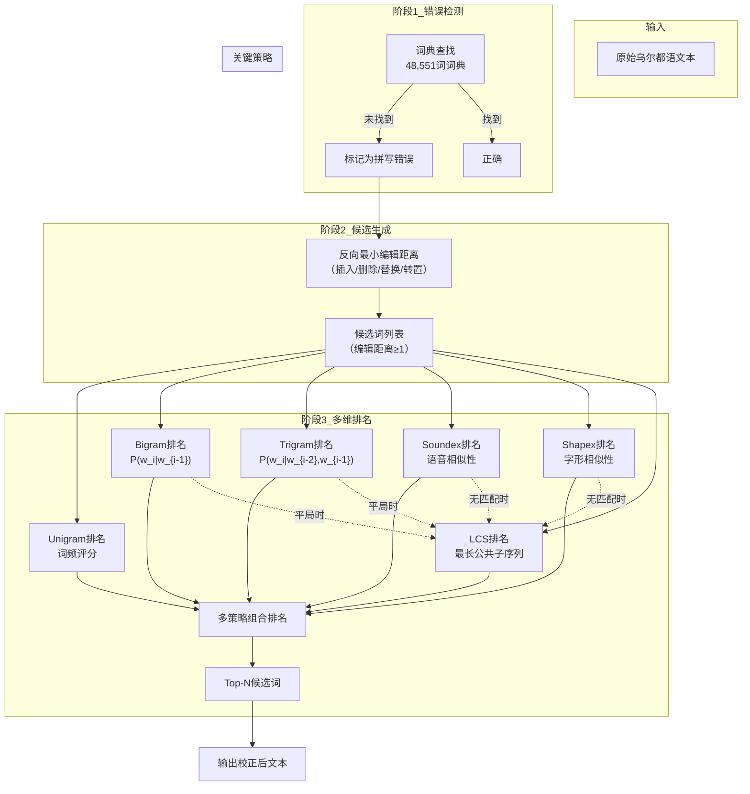

# A Hybrid Model for Spelling Error Detection and Correction for Urdu Language

中文：乌尔都语拼写错误检测与校正的混合模型

## 作者信息

| 作者 | 机构 | 身份/背景 | 领域大牛认定 |
|------|------|----------|-------------|
| **Romila Aziz** | COMSATS University Islamabad (Lahore Campus) | 博士生（M.S.已获），拼写检查研究主力执行者 | ★★☆☆☆ |
| **Muhammad Waqas Anwar** | COMSATS University Islamabad / Government College University Lahore | 教授，系主任 | ★★★☆☆ |
| **Muhammad Hasan Jamal** | COMSATS University Islamabad (Lahore Campus) | 助理教授，普渡大学博士（并行/分布式系统背景） | ★★★☆☆ |
| **Usama Ijaz Bajwa** | COMSATS University Islamabad (Lahore Campus) | 副教授，机器感知与视觉智能研究组负责人 | ★★★☆☆ |

## 团队相关信息

该团队是**COMSATS大学伊斯兰堡分校计算机科学系NLP方向的主力研究组**，由**资深教授Muhammad Waqas Anwar带领博士生Romila Aziz**完成。Aziz是本研究的执行核心，从M.S.阶段起即专注于乌尔都语拼写检查，2023年进一步扩展至真词错误研究，形成了从非词错误到真词错误的完整研究谱系。

团队整体属于**巴基斯坦NLP领域的中坚力量**，研究水平在低资源语言NLP中具有代表性。与奠基性团队（CRULP的Sarmad Hussain）相比，本团队更多是**方法论的继承者与精进者**——在Naseem (2004)的基础上引入更丰富的排名维度（LCS、Bigram、Trigram），而非提出全新的语言特异性洞察。但正是这类“继承+精进”的工作，将乌尔都语拼写检查的Top-1准确率从71.7%推至88.29%，使技术更接近工程可用。

## 论文发表时间

| 项目 | 具体日期 | 来源/说明 |
|------|----------|----------|
| 收稿日期 | 2020年9月16日 | — |
| 接受日期 | 2021年5月5日 | — |
| 在线出版日期 | 2021年8月5日 | Springer（Neural Computing and Applications） |

该论文**已于2021年8月正式发表**于 **Neural Computing and Applications**（Springer旗下期刊，影响因子约5-6，中科院二区），经同行评审后出版，非预印本或会议论文。这是Aziz团队乌尔都语拼写检查系列工作的**核心论文**，承上（Naseem 2004）启下（Aziz 2023真词错误）。

## 摘要

拼写检查是诸多自然语言处理应用（机器翻译、词性标注、命名实体识别、文本摘要、情感分析等）的重要前置步骤。本文提出了一种乌尔都语拼写错误检测与校正的**混合模型**。在错误检测阶段，采用**词典查找法**（48,551词词典，来自UMC语料和乌尔都语报纸语料）。在校正阶段，用**最小编辑距离**生成候选词，然后使用**多维度排名策略**选出最佳候选：Soundex（语音相似性）、Shapex（字形相似性）、LCS（最长公共子序列）和N-gram（Unigram/Bigram/Trigram）——单用或组合使用。实验在147个错误上进行，结果表明：**Top-5候选的F1最高达94.02%（Bigram单用），Top-1候选的F1最高达88.29%（Shapex + 其他组合）**。与之前唯一存在的乌尔都语拼写检查工作（Naseem 2004）相比，Top-1准确率提高了15.71%。

## 一、这篇论文讲了一个什么样的故事？

这是 **“在巨人的肩膀上再爬一层”** 的故事。

**起点**：Naseem (2004) 已经为乌尔都语拼写检查奠定了完整框架——反向编辑距离生成候选 + Soundex/Shapex排名 + 词频排名。但存在一个明显的**短板**：排名机制仅依赖**Unigram词频**，即只看“这个词在语料中出现了多少次”，不看“这个词在前一个词之后出现了多少次”（上下文信息）。

**问题**：纯词频排名常常选错。例如，错误词“کیام”（Kayam）的候选词中，“کیا”（Kiya，“做了”）出现3,505次，而真正正确的“قیام”（Qiyam，“停留”）仅出现69次——Unigram会错误地选“کیا”。但如果看上下文（Bigram），前一个词是“زون کے”（zone的），则“زون کے قیام”（zone的停留）是合理搭配，而“زون کے کیا”不合理——Bigram能纠正这个错误。

**解决方案**：本文在Naseem框架的基础上，**增加三个新的排名维度**：
1. **Bigram和Trigram**：利用上下文信息排名（不只看词频）
2. **LCS（最长公共子序列）** ：作为N-gram排名平局时的**消歧器**
3. **Soundex/Shapex + N-gram的组合排名**：让语音/字形信息与上下文信息协同决策

**结果**：Top-1准确率从Naseem的71.7%提升至88.29%，提升幅度达**16个百分点**。这是乌尔都语非词错误拼写检查的**最高记录**，直到2023年真词错误研究开辟新战场。

## 二、本文的核心思想和创新点

### 1. 核心思想

拼写检查的排名不能只看“词是否高频”，还要看“词在上下文中是否合理”。具体而言：

- **Unigram排名**：告诉系统哪个候选词最常用
- **Bigram/Trigram排名**：告诉系统哪个候选词与前面的词搭配最合理
- **Soundex/Shapex排名**：告诉系统哪个候选词与错误词在语音/字形上最相似
- **LCS排名**：告诉系统哪个候选词与错误词在字符序列上最接近

**四类信息各有侧重，互补不足**。本文的核心思想是**系统化整合这四类信息**，在不同场景下选择最优的组合策略。

### 2. 关键创新点

**（1）将N-gram从Unigram扩展到Bigram和Trigram**

Naseem (2004) 只用Unigram（词频）。本文首次在乌尔都语拼写检查中引入**Bigram和Trigram**，使排名从“看词”升级为“看词 + 上下文”。这是性能提升最显著的改动——Bigram单用的Top-5 F1达94.02%。

**（2）引入LCS作为N-gram平局消歧器**

当N-gram排名出现多个候选词频率相同时，用LCS选择与错误词**字符级最接近**的候选。例如，错误词“چہا”（Cheha）的三个候选词频率都为1，但“چیخا”（Shouted）与“چہا”的LCS最长，因而被选中。这解决了N-gram排名中常见的**平局困境**。

**（3）系统化比较14种排名组合**

本文实验覆盖了：
- ED + Unigram / Bigram / Trigram
- ED + LCS（单用 + 与Uni/Bi/Tri组合）
- ED + Soundex + Uni/Bi/Tri + LCS
- ED + Shapex + Uni/Bi/Tri + LCS

共14种排名策略的系统化对比，**揭示了各策略的最佳适用场景**：Top-5最优为Bigram单用（94.02%），Top-1最优为Shapex组合（88.29%）。

**（4）语料级排名评分（1M词语料）**

排名所用的N-gram频率从**1M词的语料**（乌尔都语报纸 + UMC语料）中统计，比Naseem (2004)的语料规模更大，统计更稳定。

**（5）词典规模扩展至48,551词**

相比Naseem (2004)的112,481词有所减少，但本文词典从**UMC语料 + 乌尔都语报纸**中抽取，覆盖新闻和通用文本领域，更具实用性。

## 三、方法是怎么实现的？

### 1. 整体架构

**图注**：基于论文Figure 1（Flowchart of proposed hybrid model）及Section 4（Methodology）综合绘制。

### 2. 关键算法

**（1）反向最小编辑距离**（与Naseem 2004相同）

对长度为n的乌尔都语错误词，生成所有单编辑距离候选词：
- 插入：42(n+1)种
- 删除：n种
- 替换：42n种
- 转置：n-1种
- 总计：86n+41次比较

**（2）Bigram排名公式**
$$
P(w_i|w_{i-1}) = \frac{\text{count}(w_{i-1}, w_i)}{\text{count}(w_{i-1})}
$$

**（3）Trigram排名公式**
$$
P(w_i|w_{i-2}, w_{i-1}) = \frac{\text{count}(w_{i-2}, w_{i-1}, w_i)}{\text{count}(w_{i-2}, w_{i-1})}
$$

**（4）Soundex算法（乌尔都语定制版）**

字母按**发音相似性**分组（16组，十六进制编码0-F），首字母也编码（与Naseem 2004相同），先**归一化字符串**再编码（处理类似字母Alif/Ain/Seen/Sowad/Kaaf/Qaf/Taui'n/Tay的混淆）。归一化规则见论文Table 9及Section 4.3.3。

**（5）Shapex算法（乌尔都语定制版）**

字母按**字形相似性**分组（16组，0-F），基于Nastaliq字体中的**词中形态**。见论文Table 10。

**（6）LCS匹配**
$$
LCS(s, t) = \max\{|c| : c \subseteq s \text{ 且 } c \subseteq t\}
$$

**（7）Soundex/Shapex + N-gram的组合排名机制**

- Step 1：用Soundex/Shapex匹配候选词与错误词的语音/字形代码
- Step 2：若匹配到多个候选 → 用N-gram在其中排名
- Step 3：若无匹配 → 放弃Soundex/Shapex，回退到N-gram + LCS

### 3. 关键公式

**Precision/Recall/F1**（论文Section 5）：
$$
Precision = \frac{TP}{TP + FP}
$$
$$
Recall = \frac{TP}{TP + FN}
$$
$$
F1 = \frac{2 \times Precision \times Recall}{Precision + Recall}
$$

**Total Recall**：候选列表中包含正确词的错误比例（不论排名位置）。

## 四、实验效果

### 1. 实验设置

| 项目 | 设置 |
|------|------|
| 测试数据 | 147个拼写错误 |
| 词典规模 | 48,551词（UMC + 乌尔都语报纸） |
| 排名语料 | 1M词（用于统计N-gram频率） |
| 排名策略 | 14种（Uni/Bi/Tri + LCS + Soundex + Shapex 单用及组合） |
| 评估指标 | Precision / Recall / F1 (Top-1 & Top-5) |
| 对比基线 | Naseem (2004) 的结果（280个错误） |

### 2. 主要结果

**N-gram排名结果（Table 11）** ：

| 排名方法 | Top-1 F1 | Top-5 F1 | 总召回 |
|----------|----------|----------|--------|
| ED + Unigram | 61.83% | 93.54% | 98.68% |
| ED + Bigram | **74.50%** | **94.02%** | 98.68% |
| ED + Trigram | 79.68% | 93.88% | 98.68% |

> Bigram单用在Top-5中表现最佳（94.02% F1），因为Bigram频率（前一词+候选词）比Trigram（前两词+候选词）更容易在语料中统计到有效频次。

**LCS排名结果（Table 12）** ：

| 排名方法 | Top-1 F1 |
|----------|----------|
| ED + LCS | 61.30% |
| ED + Uni + LCS | 71.26% |
| ED + Bi + LCS | 78.43% |
| ED + Tri + LCS | **80.95%** |

> LCS作为消歧器与Trigram结合时Top-1 F1最高（80.95%），比纯Trigram提升了1.27个百分点。

**Soundex排名结果（Table 13）** ：

| 排名方法 | Top-1 F1 | Top-5 F1 |
|----------|----------|----------|
| ED + SXR + Uni + LCS | 78.92% | 85.35% |
| ED + SXR + Bi + LCS | 81.06% | 83.36% |
| ED + SXR + Tri + LCS | **83.72%** | 82.70% |

**Shapex排名结果（Table 14）** ：

| 排名方法 | Top-1 F1 | Top-5 F1 |
|----------|----------|----------|
| ED + SHR + Uni + LCS | 79.73% | 81.88% |
| ED + SHR + Bi + LCS | 87.62% | 88.96% |
| ED + SHR + Tri + LCS | **88.29%** | 88.96% |

> Shapex在Top-1中表现最佳（88.29% F1），因为**乌尔都语中字形相似错误占比（60.54%）远高于语音相似错误**。语音相似的字母组（如س/ص/ث）字形差异明显，用户犯错较少；字形相似的字母组（如ح/چ/ج/خ）犯错概率更高。

**与Naseem (2004)的对比（Table 15）** ：

| 评估指标 | Naseem (2004) | 本文 (Aziz 2021) | 提升 |
|----------|---------------|------------------|------|
| Top-1 Recall | 71.7% | **87.41%** | **+15.71%** |
| Top-5 Recall | 87.1% | 88.07% | +~1% |
| 总召回 | 94.6% | 98.68% | +4.08% |

**核心结论**：
- Top-1最佳策略：**ED + Shapex + Bigram + LCS**（F1=88.29%）
- Top-5最佳策略：**ED + Bigram**（F1=94.02%）
- Shapex比Soundex对Top-1提升更显著（+4.67个百分点F1），证实了字形相似性错误在乌尔都语中的主导地位
- 加入Bigram/Trigram + LCS可将Top-1 F1从61.83%提升至88.29%（**+26.46个百分点**），远超大语言模型Unigram的贡献

### 3. 消融实验与关键发现

**发现1：Bigram/Trigram的贡献远超LCS**

纯Unigram的Top-1 F1为61.83%；加入Bigram后提升至74.50%（+12.67%）；加入Trigram后提升至79.68%（+17.85%）。而LCS单用仅为61.30%，主要起平局消歧作用而非主要排名维度。

**发现2：Shapex的最佳组合是Bigram而非Trigram**

Shapex + Bigram + LCS的Top-1 F1为87.62%，略低于Shapex + Trigram + LCS的88.29%，但考虑到Trigram数据稀疏性，Bigram组合在工程上更鲁棒。论文最终推荐Bigram为Shapex的最佳搭档。

**发现3：Soundex的贡献因错误类型而异**

Soundex对**替换错误**有效（约占60.54%），但对**插入/删除错误**无效。因为插入/删除改变了词长，导致Soundex代码完全错位。论文因此设计了**Soundex回退LCS**的机制——若无匹配，则用LCS处理。

**发现4：总召回已达98.68%**

总召回代表“候选列表中包含正确词”的比例，98.68%意味着**几乎所有错误都进入了候选列表**，主要瓶颈已从“候选生成”转移到“排名”。这是乌尔都语非词错误拼写检查的**天花板级指标**。

**发现5：Top-5与Top-1的差距揭示排名难题**

即使在最佳策略下，Top-5 F1为94.02%，Top-1 F1为88.29%，相差约6个百分点。这意味着**即使正确词进入了前5名，要确保它排在第1名仍然困难**——这正是未来排名优化的空间。

## 五、优点与局限性

### ✅ 1. 优点

**系统化的排名策略对比**

本文覆盖14种排名组合，系统化地揭示了各策略的适用场景与性能上限，为后续研究者提供了清晰的“性能地图”。

**Bigram/Trigram引入是最大突破**

从Naseem (2004)的纯Unigram升级为Bigram/Trigram，Top-1 F1提升近27个百分点，**验证了上下文信息在乌尔都语拼写检查中的核心价值**。

**LCS平局消歧机制精巧**

当N-gram频率相同时，LCS提供了**与错误词字符级最接近**的候选选择依据，在Top-1上提升约1-2个百分点，虽不大但稳定。

**Shapex在Top-1中表现最佳**

证实了**字形相似性是乌尔都语拼写错误的首要因素**（占比60.54%），这一发现为乌尔都语NLP工具设计提供了明确方向——字形信息比语音信息更重要。

**总召回达天花板级别（98.68%）**

证明候选生成机制已成熟，几乎所有错误都能进入候选列表，后续工作可专注于排名优化。

**与Naseem (2004)的直接对比**

在相同框架下进行改进，性能对比清晰（Top-1 +15.71%），体现了增量研究的价值。

### ⚠️ 2. 局限性（研究边界与待解问题）

**测试集规模偏小**

仅147个错误，远小于Naseem (2004)的280个和Durrani (2010)的404个。小样本的统计显著性存疑，某些策略的微小性能差异（如+1%）可能不具统计意义。

**未涉及真词错误**

本文仅处理非词错误（词典中不存在的词），未涉及真词错误（词存在但上下文用错）。作者在结论中明确将“真词错误处理”列为未来工作（2023年完成）。

**词典规模反而缩小**

词典从Naseem (2004)的112,481词缩小至48,551词，虽然来源更聚焦（新闻+UMC），但词汇覆盖率下降，对新词/专有名词的处理能力减弱。

**缺乏端到端系统评估**

各模块独立评估（词典检测、候选生成、排名），但未测试完整流程在真实场景中的性能（如处理整篇文档的连续错误）。

**排名语料与测试语料可能重叠**

1M词排名语料与测试集可能重叠（均来自乌尔都语报纸），导致排名频率偏向测试数据，高估实际性能。论文未说明是否做了语料分离。

**无公开代码/数据**

论文未声明代码或数据集公开，可复现性低（与Naseem 2004相似）。这对领域发展不利——后续研究者难以在相同条件下对比。

**深度学习未涉及**

本文仍为传统方法（规则+统计），未尝试深度学习（Transformer、BERT等）。虽然2023年真词错误研究仍用传统ML，但英语NLP中的拼写检查已全面转向深度学习，乌尔都语领域存在技术代差。

## 六、其他

### 第一性原理

**拼写检查排名的本质是什么？**

从第一性原理看，拼写检查排名的问题本质是：**给定一个错误词e，从候选词集合C中选择最可能是“用户本意”的词c\***。

这要求系统估计：
$$
P(c^*|e, \text{context})
$$

贝叶斯分解：
$$
P(c|e, \text{context}) \propto \underbrace{P(e|c)}_{\text{错误模型}} \times \underbrace{P(c|\text{context})}_{\text{语言模型}}
$$

- **错误模型** \(P(e|c)\)：用户从c错打成e的概率——受**键盘邻接**（typographic）、**语音相似**（cognitive）、**字形相似**（visual）影响。Soundex和Shapex正是对后两者的**粗糙建模**。
- **语言模型** \(P(c|\text{context})\)：在特定上下文中c出现的概率——Unigram/Bigram/Trigram是其**简化版本**。

**Naseem (2004) 只用Unigram，相当于假设**：
$$
P(c|\text{context}) \approx P(c)
$$
即“词频越高的词越可能是正确词”——忽略了上下文。

**本文的改进是**：
$$
P(c|\text{context}) \approx P(c|w_{i-1}) \quad \text{(Bigram)}
$$
或
$$
P(c|\text{context}) \approx P(c|w_{i-2}, w_{i-1}) \quad \text{(Trigram)}
$$

即“与前面词搭配越合理的词越可能是正确词”。这是**从词级统计升级到短语级搭配统计**，是对语言模型更准确的逼近。

**为什么Bigram比Trigram在Top-5上表现更好？**

因为Bigram频率比Trigram频率更容易在有限语料中统计到有效值。Trigram需要三个词同时出现，数据稀疏性更高（频率为0的概率大），导致排名置信度下降。这是一个**数据稀疏性与模型精度之间的权衡**——更长的上下文（Trigram）理论上更准确，但实践中因数据不足而表现反而不如较短的上下文（Bigram）。

### 领域空白

**本文填补的空白**：
- ✅ 乌尔都语拼写检查排名从Unigram升级到Bigram/Trigram
- ✅ 引入LCS作为N-gram平局消歧器
- ✅ 系统化比较Soundex/Shapex与N-gram的14种组合策略
- ✅ 将Top-1 F1从71.7%提升至88.29%

**本文揭示但未解决的空白**：

1. **真词错误处理** ← Aziz et al. (2023) 已在本文基础上完成，用ML分类器 + Trigram排名解决
2. **更大规模的端到端评估** ← 本文仅147个错误，真实场景验证不足
3. **动态词典/新词处理** ← 词典固定，无法处理专有名词和新词
4. **深度学习模型** ← 未尝试Transformer/BERT等，落后英语NLP SOTA约5-10年
5. **用户个性化排名** ← 不同用户的拼写习惯不同，统一排名可能非最优
6. **代码与数据公开** ← 本文和Naseem (2004) 均未公开资源，阻碍领域复现与对比

**更大的领域空白**：

从2004年Naseem奠基到2021年Aziz精进，乌尔都语非词错误拼写检查已接近成熟（总召回98.68%）。但**真词错误**直到2023年才被系统研究（检测F1=0.81，校正准确率83.67%），**罗马乌尔都语拼写标准化**直到2024年才有数据基建（Soomro 2024）。**标准乌尔都语与罗马乌尔都语之间的跨书写系统拼写检查**仍是完全空白——这可能是乌尔都语NLP的“终极挑战”。

---

> 本文由 Deepseek AI 生成
