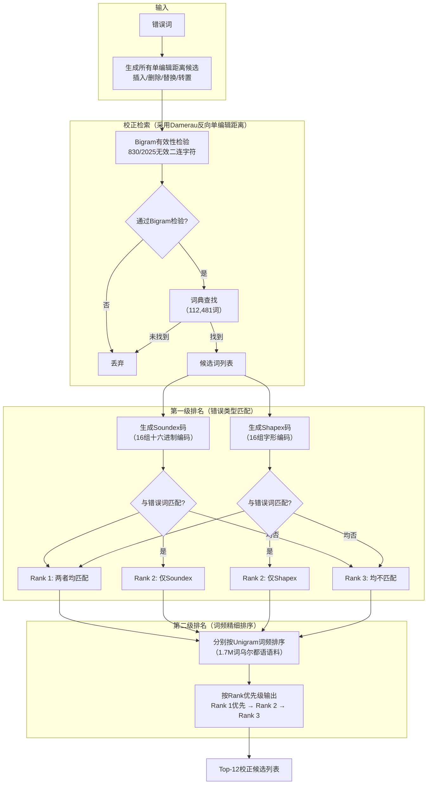

# A Novel Approach for Ranking Spelling Error Corrections for Urdu

乌尔都语拼写错误校正排名的新方法

## 作者信息

| 作者 | 机构 | 身份/背景 | 领域大牛认定 |
|------|------|----------|-------------|
| **Tahira Naseem** | FAST - National University of Computer & Emerging Sciences, Lahore | 硕士毕业生（2004届），本研究基于其硕士论文核心成果 | ★★☆☆☆ |
| **Sarmad Hussain** | FAST - National University of Computer & Emerging Sciences | 副教授，乌尔都语NLP领域奠基人，CRULP创始人 | ★★★★☆ |

## 团队相关信息

该研究来自**巴基斯坦FAST国立大学计算机科学系**，由**Sarmad Hussain指导硕士生Tahira Naseem**完成。Sarmad Hussain是**乌尔都语计算语言学领域的公认开创者**，其研究涵盖了乌尔都语NLP的各个层面（语音合成、OCR、拼写检查、词边界分割等）。Naseem在其硕士论文（2004）中完成了乌尔都语拼写检查的完整框架设计，本文是其中**排名机制部分的独立期刊论文**。

该团队是**乌尔都语NLP研究的奠基性团队**，其2004年硕士论文是乌尔都语拼写检查领域的**开山之作**，此后所有相关工作（Aziz 2021、Aziz 2023等）均以此为基。Sarmad Hussain是该领域**无可争议的领军人物**，虽尚未达到院士/ACM Fellow层级，但在低资源语言NLP领域具有国际影响力。

## 论文发表时间

| 项目 | 具体日期 | 来源/说明 |
|------|----------|----------|
| 在线出版日期 | 2007年9月26日 | Springer（Language Resources and Evaluation） |
| 版权年份 | 2007 | Springer Science+Business Media B.V. |

该论文**已于2007年9月正式发表**于 **Language Resources and Evaluation**（Springer旗下期刊，专注于语言资源与评估，计算语言学领域主流期刊之一）。这是Naseem (2004)硕士论文核心成果的**期刊精简版**，聚焦于排名机制，并在论文中正式提出**Shapex**这一新算法名称。

## 摘要

拼写检查技术通常不提供显式的排名机制——排名要么隐含在校正算法中，要么根本不排序。本文提出了乌尔都语拼写错误校正的**显式排名方案**。研究表明，在乌尔都语中，校正词与错误词之间的**语音相似性**可作为有效排名参数。结合本文提出的**Shapex**新算法（利用字符**字形相似性**进行排名），相比仅用词频排名，**Top-1匹配准确率提升了23%** ——从58.1%提升至71.7%。本文对Soundex算法进行了乌尔都语定制化改编，并首次系统化证明了字形相似性在拼写错误模式中的重要性。


## 一、这篇论文讲了一个什么样的故事？

这是 **"拼写检查的最后一步——排名"** 的故事。

**背景**：拼写检查有三个步骤：检测、校正、排名。大多数技术只关心前两步——找到可能的候选词就结束了，不排名，或者排名方式很粗糙（比如分两三个等级）。这使得用户体验很差：用户面对一大串候选词，不知道哪个最可能是自己想要的。

**问题**：什么才是好的排名依据？英语研究中已经知道"语音相似性"很重要（Soundex就是干这个的）。但乌尔都语有没有独特的特征可以被利用？答案是**有**——字形相似性。

**关键洞察**：在乌尔都语（以及所有阿拉伯/波斯语系语言）中，许多字母共享相同的基本形状，仅靠**点的数量和位置**区分（如ح/ج/خ/چ/ح）。在快速书写或复制手稿时，很容易混淆这些字形相似的字母。这在拉丁字母语言中几乎不存在（拉丁字母中字形相似的很少，如l/I、O/0是例外而非系统现象）。

**解决方案**：本文提出了一个两级排名架构：
- **第一级**：语音相似（Soundex） + 字形相似（Shapex）——宽泛分组
- **第二级**：词频排名——在第一级各档内精细排序

**结果**：纯词频排名Top-1准确率58.1%。加入Soundex或Shapex分别提升约6个百分点（到~64%）。两者结合后提升至71.7%——**总提升23个百分点**。证明Shapex和Soundex覆盖的是**互补的错误类型**，可以安全组合。

## 二、本文的核心思想和创新点

### 1. 核心思想

拼写检查的排名可以显式建模为**多级过滤**：

**第一级**：用**错误生成机制的特征**来粗筛候选词——如果错误是字形相似的，那么字形相似的候选词应该排名更高；如果错误是语音相似的，那么语音相似的候选词应该排名更高。
**第二级**：用**词频**在粗筛的各档内精细排序。

这背后的第一性原理是：**错误的类型决定了校正的特征**。如果一个错误是因为字形混淆产生的，那么与错误词字形相同的校正词，比字形不同的词更可能是正解；同理适用于语音混淆。

### 2. 关键创新点

**（1）Shapex算法——首次系统化利用字形相似性**

这是本文的**核心创新**。Shapex将乌尔都语字母按**字形相似性**分组，为每个字母分配一个十六进制编码（0-F，16组）。其设计基于两个关键观察：
- 乌尔都语/阿拉伯语系中，**大量字母共享基本形状，仅靠点的数量/位置区分**
- 约**1/3的乌尔都语拼写错误是字形相似性导致的**（见表1）

这是英语拼写检查研究中**从未被系统化利用的特征**，因为拉丁字母中字形相似现象不显著。

**（2）乌尔都语定制版Soundex**

对原版Soundex做了两项改造：
- **首字母编码**：原版Soundex不编码首字母（假设首字母错误罕见），但乌尔都语中词首错误同样常见→改为编码首字母
- **16组字母分组**：原版10组（0-9）对乌尔都语44个音位太粗糙→扩展为16组（0-F十六进制），提高区分度

**（3）字符串归一化处理**

在Soundex编码前，对字符串进行**归一化**，解决乌尔都语中一些特殊字符在上下文中的音位/字形歧义问题（如ى在元音间作辅音发[j]音，و在不同位置的元音/辅音切换等）。这提升了Soundex在乌尔都语中的匹配精度。

**（4）Shapex + Soundex + 词频的三级排名架构**

**Rank 1**：Shapex和Soundex**同时匹配**（错误既是字形相似又是语音相似）
**Rank 2**：Shapex**或**Soundex任一匹配
**Rank 3**：两者均不匹配（仅靠词频）

这种架构使得**最有可能的正确候选优先出现**，Top-1准确率提升至71.7%。

## 三、方法是怎么实现的？

### 1. 整体架构



**图注**：基于论文Section 2.2（Correction retrieval）和Section 2.3（Ranking）综合绘制。

### 2. 关键算法

**（1）Shapex编码方案**

将乌尔都语字母按**字形相似性**分为16组（十六进制0-F），基于Nastaliq字体中的**词中/词首形态**：

| Shapex码 | 字母组 | 说明 |
|----------|--------|------|
| 0 | ا, ل | 无点、线形 |
| 1 | ب, پ, ت, ث, ن, س, ش, ی, ے | 带点/曲线组 |
| 2 | ر, ڑ, ز, ژ, ذ | 类似"钩"形 |
| 3 | ج, چ, ح, خ | 带点/无点组 |
| 4 | د, ڈ | 小钩形 |
| 5 | ص, ض | 圆形带点 |
| 6 | ط, ظ | 圆形无点 |
| 7 | ع, غ, ف, ق, م | 复杂曲线组 |
| 8 | ک, گ | 带横线组 |
| 9 | ھ, ہ, ة | 圆头组 |

**关键设计原则**：字母在**词中/词首位置**相似（而非孤立或词尾），因为拼写错误多发生在连写状态。

**（2）Soundex编码方案（乌尔都语定制版）**

将字母按**发音相似性**分为16组：

| Soundex码 | 字母组 | 发音特征 |
|-----------|--------|----------|
| 0 | ث, س, ص, ش | 齿龈/齿间摩擦音 |
| 1 | ت, ط, ٹ, ت | 齿龈爆破音 |
| 2 | ز, ض, ظ, ذ | 齿龈/齿间浊擦音 |
| 3 | ج, چ | 硬腭塞擦音 |
| 4 | ھ, ح | 喉音/气息音 |
| 5 | خ, ک, ق | 软腭/小舌音 |
| 6 | د, ڈ | 齿龈爆破音 |
| 7 | ب, پ | 双唇爆破音 |
| 8 | ن, م, ں | 鼻音 |
| 9 | گ, غ | 软腭/小舌音 |
| A | ر, ڑ | 齿龈颤音 |
| B | ژ, ی | 硬腭擦音/半元音 |
| C | ع | 喉塞音 |
| D | ف | 唇齿擦音 |
| E | ل | 齿龈边音 |
| F | و | 双唇半元音 |

**（3）字符串归一化规则**

编码前对字符串进行归一化（解决乌尔都语中字符的上下文音位歧义）：

1. **词尾ھ → 转换为ا**（如"نعمت" → "نعما"）
2. **ھ（气息音）处理**：若前接可送气辅音（ب, پ, ت, ٹ, ج, چ, ک, گ）→ 忽略；若前接元音/不可送气辅音→ 映射为ہ
3. **词首ا → 映射为ع**（如"است" → "عست"）
4. **آ → 映射为ا**
5. **ى在词首或元音间 → 映射为ژ**（如"یہ" → "ژہ"）
6. **و的元音/辅音判定**：词首或后接元音→保留为و（辅音）；否则→映射为زبر/پیش（元音标记）

这些规则在**两轮迭代中执行**（先判定ى和ھ的行为，再判定و的行为，再回头检查ى），确保相互依赖的规则正确应用。

**（4）Shapex + Soundex + 词频三档排名**

```
Rank 1: Shapex匹配 AND Soundex匹配 → 最高优先级
Rank 2: Shapex匹配 OR Soundex匹配（但不同时）→ 中等优先级  
Rank 3: 两者均不匹配 → 最低优先级
每档内按词频降序排序 → 输出Top-12
```

### 3. 关键公式

**Top-N准确率定义**：
$$
\text{Top-N Accuracy} = \frac{\#\{\text{错误}: \text{正确词在Top-N候选列表中}\}}{\text{错误总数}} \times 100\%
$$

**总召回定义**：
$$
\text{Total Recall} = \frac{\#\{\text{错误}: \text{候选列表包含正确词}\}}{\text{错误总数}} \times 100\%
$$

**编辑距离**：采用Damerau单编辑距离操作（插入/删除/替换/转置），最多允许一次操作。


## 四、实验效果

### 1. 实验设置

| 项目 | 设置 |
|------|------|
| 测试数据 | 280个拼写错误（独立于错误趋势研究数据） |
| 词典规模 | 112,481词 |
| 排名语料 | 1.7M词（Iqbal Academy + Feroz Sons出版社书籍） |
| 候选排名数量 | Top-12 |
| 错误来源 | 乌尔都语语料自动拼写检查 + 人工上下文验证 |
| Bigram检验 | 2,025个二连字符中830个无效 |

### 2. 主要结果

| 排名方法 | Top-1 | Top-5 | Top-10 | 总召回 | 平均结果集大小 |
|----------|-------|-------|--------|--------|---------------|
| 仅词频（FR） | **58.1%** | 90.0% | 93.5% | 94.6% | 8.5 |
| 词频 + Soundex | 64.2% | 89.6% | 93.9% | 94.6% | 8.5 |
| 词频 + Shapex | 64.5% | 89.6% | 93.5% | 94.6% | 8.5 |
| **词频 + Soundex + Shapex** | **71.7%** | 87.1% | 93.5% | 94.6% | 8.5 |

**核心结论**：
- **Soundex和Shapex贡献相当**：分别将Top-1从58.1%提升至64.2%和64.5%（各约+10%）
- **两者作用叠加**：组合后Top-1达71.7%（总提升+23%），说明两者覆盖**互斥的错误集**
- **Top-5准确率略有下降**（从90.0%降至87.1%），因为Soundex/Shapex有时将**不相似的词错误地匹配**，挤占了正确词的前五位置
- **总召回稳定在94.6%**：无论排名方法如何，候选生成阶段均覆盖94.6%的错误（校正检索机制未变）
- **平均结果集大小稳定在8.5**：候选列表长度不因排名策略而显著变化

### 3. 消融实验与关键发现

**发现1：字形相似性错误占乌尔都语拼写错误的约1/3**

表1数据显示，在报纸文本中，75个替换错误中有40个（53.3%）是字形相似的；在学期论文中，35个替换错误中有19个（54.3%）是字形相似的。这一比例**远超语音相似错误**（报纸12/75=16%，学期论文14/35=40%）。这解释了为什么Shapex的贡献几乎与Soundex相当——在乌尔都语中，字形混淆甚至比语音混淆更常见。

**发现2：字形相似性错误的根本原因——手稿转写机制**

作者明确指出，字形相似错误**不是认知错误**（没有人不知道字母的正确形状），而是**视觉复制错误**：专业打字员面对手写稿时，"所见即所打"，未经过语义验证。加上字形相似错误在视觉上**难以自查**，导致其留存率更高。

**发现3：词首错误在乌尔都语中同样常见**

与英语不同，乌尔都语词首错误（尤其是词首省略错误）同样常见。这证明了**编码首字母**的Soundex变体是必要的——原版Soundex假设首字母错误罕见，在乌尔都语中不成立。

**发现4：Shapex的局限性——词尾字形差异导致误匹配**

Shapex编码基于词中/词首字形，但有些字母在**词尾位置**的形状与词中完全不同（尤其是连写字母）。这导致Shapex在词尾位置可能错误匹配或漏匹配。作者建议未来方向：**按位置（词首/词中/词尾）分别编码**。

**发现5：94.6%的总召回已经是天花板级别**

候选生成阶段（反向编辑距离 + Bigram有效性检验 + 词典查找）覆盖了94.6%的错误。这意味着**排名优化是提升用户体验的唯一途径**——候选词列表已经包含了正确答案，只是没排在前面。

**发现6：Soundex+Shapex组合的Top-5下降（3个百分点）暴露了粗糙编码的代价**

Soundex和Shapex都是**粗粒度编码**——多个不同字母可能共享同一代码。这导致某些不相似词因代码巧合进入Rank 1，挤占了正确词在Top-5中的位置。这是一个**精度-召回权衡**：提升Top-1准确率以牺牲Top-5为代价。


## 五、优点与局限性

### ✅ 1. 优点

**Shapex是真正的原创贡献**

这是**首次在拼写检查研究中系统化利用字形相似性**。此前字形相似性仅用于OCR校正（事后校正机器识别错误），从未用于人类拼写错误。本文通过数据证明：在阿拉伯/波斯语系中，字形相似性是**人类错误模式的内生特征**，而非OCR特有。

**方法论清晰：从数据洞察到算法设计**

本文先做错误趋势分析（表1），确认字形/语音相似性的重要性，再设计相应算法。这种**数据驱动的算法设计**是NLP研究的黄金范式。

**显式排名架构具有通用性**

两级排名（第一级：错误类型匹配；第二级：词频排序）可作为通用框架，适用于其他低资源语言。Shapex的"字形编码"思路也可迁移到其他阿拉伯/波斯语系语言。

**解释了"为什么英语拼写检查中没有类似Shapex"**

本文明确指出：拉丁字母中**字形相似的字母对极少**（l/I、O/0是例外而非系统现象），因此英语研究者从未想到字形相似性可作为拼写错误特征。这实际上是**语言/书写系统差异驱动的创新**。

**实验设计严谨**

用280个**独立**错误测试排名算法（与错误趋势分析的164+72个错误不同），避免过拟合。总召回与排名策略解耦（均保持94.6%），证明了排名的改进来自于排序质量而非候选覆盖。

**词源/书写系统洞察深刻**

对词尾ھ → ا、词首ا → ع、送气符号ھ处理等归一化规则的设计，体现了对乌尔都语书写系统的深入理解。这些规则不是通用的，而是**语言特异的深度工程**。

### ⚠️ 2. 局限性（研究边界与待解问题）

**Shapex仅用于排名，未用于校正检索**

作者明确指出Shapex仅用于排名，不参与候选生成。虽然潜在可用，但论文未探索这一方向。后续Aziz (2021) 基本沿用了这一设计。

**Shapex编码仅基于词中/词首形态**

词尾字形差异被忽略，导致词尾错误匹配不准（Top-5下降3个百分点即源于此）。作者在讨论中承认这一问题，但未在本文中解决。

**未处理上下文信息**

排名仅靠字形/语音相似性 + 词频，未考虑上下文（Bigram/Trigram）。直到Aziz (2021)才引入Bigram/Trigram，将Top-1进一步提升至88.29%。

**语料来源局限**

1.7M词排名语料来自Iqbal Academy和Feroz Sons出版社的**书籍**，可能与日常/社交媒体文本的词汇分布不同。这会影响词频排名的通用性。

**代码与数据未公开**

与Naseem (2004)硕士论文相同，本文未提供公开的代码、词典或测试数据集。这使得独立复现和后续对比变得困难。

**未涉及真词错误和词边界错误**

本文仅处理非词错误（词典中不存在的词），且假设输入已正确分词。Durrani (2010)和Aziz (2023)分别填补了这两个空白。

**统计显著性未报告**

论文未报告置信区间或p值。Top-1从58.1%提升至64.2%（Soundex，+6.1%）和64.5%（Shapex，+6.4%）的差异是否统计显著？未给出，限制了结论的严谨性。


## 六、其他

### 第一性原理

**为什么字形相似性在乌尔都语中如此重要？——书写系统的设计哲学差异**

1. **拉丁字母的设计原则**：拉丁字母的**字形差异最大化**，使得每个字母在视觉上易于区分。即使快速书写，A与B、C与D也不会混淆。因此，拼写错误主要是**键盘邻接**（物理输入）或**语音混淆**（认知）驱动的。

2. **阿拉伯/波斯语系字母的设计原则**：这些书写系统采用**同形异点（homoglyph with diacritics）** 原则——基本字形数量远少于音位数量，通过**点的数量、位置和组合**来区分不同字母。例如，基本形状"ح"加上不同点组合可产生ج、خ、چ、ح等不同字母。

3. **这意味着什么？**
   - 书写系统本身**容忍字形相似性**——这是设计的特征，而非缺陷
   - 快速书写或复制手稿时，**点的遗漏/错位**是高频错误
   - 这类错误在视觉上**不易被察觉**（因为基本形状仍相似），因此留存率高
   - 用户群体对这种字形相似性**习以为常**，认知上将其视为"同一字母的变体"而非"完全不同的字母"

4. **Shapex的本质**：
   - 不是从"语言"层面建模（语音、语法），而是从**书写系统的物理实现**建模
   - Shapex的设计哲学是：**如果用户在书写/打字时犯了字形相关的错误，那么与错误词字形最接近的词，就是最可能的正解**
   - 这是从**错误生成机制**而非**语言正确性**出发的排名策略——与Soundex从语音生成机制出发形成完美互补

**为什么这三点构成了完整的拼写检查哲学？**

- **编辑距离**：从**字符串编辑机制**建模（插入/删除/替换/转置）——最通用，但最无区分度
- **Soundex**：从**语音生成机制**建模（发音混淆）——处理认知错误
- **Shapex**：从**视觉书写机制**建模（字形混淆）——处理视觉复制错误

三者覆盖了拼写错误的**三大生成源**：打字动作（编辑距离）、语音认知（Soundex）、视觉复制（Shapex）。这是本文最大的理论贡献——拼写错误的多源建模框架。

### 领域空白

**本文已填补的空白**：
- ✅ 乌尔都语拼写错误的错误类型分析（表1）
- ✅ 显式的多级排名机制（从无排名 → 三档排名 + 词频排序）
- ✅ 字形相似性作为拼写错误特征的系统化利用（Shapex）
- ✅ 乌尔都语定制版Soundex（首字母编码 + 16组 + 归一化）

**本文揭示但未解决的空白**：

1. **真词错误** ← 本文完全未触及，Aziz (2023) 填补，用时16年
2. **词边界错误** ← Durrani (2010) 填补，用时3年
3. **上下文排名** ← Aziz (2021) 引入Bigram/Trigram，将Top-1从71.7%提升至88.29%，用时14年
4. **Shapex的校正检索应用** ← 作者提及但未探索；Aziz (2021) 仍仅用于排名
5. **位置敏感Shapex编码** ← 作者在讨论中建议（词首/词中/词尾分别编码），至今未见实现
6. **键盘邻接排名** ← 作者提及但放弃（因缺乏标准键盘布局），至今仍未解决
7. **统计显著性和公开资源** ← 本文未提供，后续Aziz (2021) 也未解决

**更大的领域空白——"低资源语言的拼写检查方法论"** ：

本文的方法论（错误趋势分析 → 错误生成机制建模 → 多级排名融合）可提炼为一种**通用方法论框架**，适用于任何书写系统有独特特征的**低资源语言**。但这一方法论在本文中仅针对乌尔都语实现，未被形式化为通用框架。对于其他阿拉伯/波斯语系语言（波斯语、普什图语、信德语、克什米尔语等），这一方法论具有**直接可迁移性**——特别是Shapex算法，只需重新分组即可。但至今未见系统化的跨语言应用，这可能是低资源语言NLP领域的一个重要空白。

---

> 本文由 Deepseek AI 辅助生成