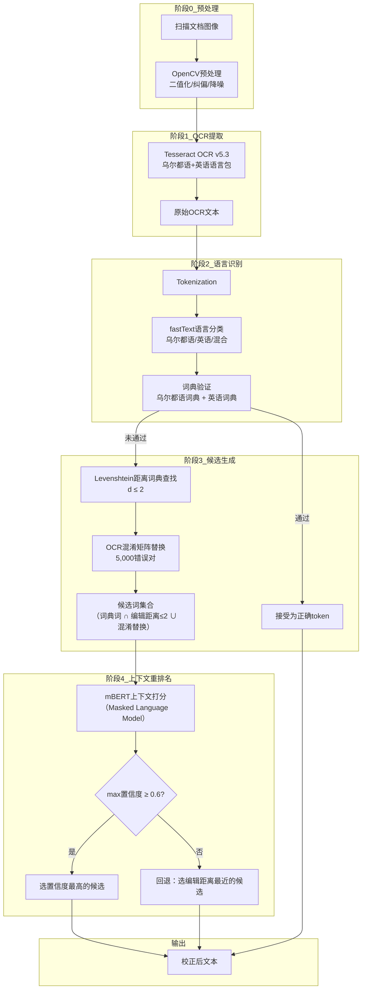

# Post-OCR Error Correction Using NLP for Urdu-English Text

基于NLP的乌尔都语-英语双语文本OCR后处理错误校正

## 作者信息

| 作者 | 机构 | 身份/背景 | 领域大牛认定 |
|------|------|----------|-------------|
| **Mujahid Ali** | Mohammad Ali Jinnah University, Karachi | 硕士研究生（计算机科学系），论文唯一作者 | ★☆☆☆☆ |

## 团队相关信息

该研究来自**巴基斯坦卡拉奇穆罕默德·阿里·真纳大学计算机科学系**，论文作者为一名硕士生，**无指导教师署名**。从论文内容看，作者综合运用了开源工具（Tesseract OCR、HuggingFace Transformers、UrduHack、OpenCV等）构建系统，属于典型的**硕士课程项目或独立研究工作**。

该团队/作者的学术影响力极为有限。作者在乌尔都语NLP领域**未见此前发表记录**，论文的文献综述部分引用了大量外部工作但未展示自身研究积累。与CRULP团队（Sarmad Hussain）、COMSATS团队（Waqas Anwar）相比，本研究在学术深度和创新性上存在明显差距，更多是**现有技术的工程化拼装**而非理论突破。

特别值得注意的是：论文的**文献综述部分几乎全部引用外部工作**（见参考文献[1]-[22]），作者自身在乌尔都语NLP领域缺乏前期积累。论文虽声称填补了“双语OCR后处理”空白，但方法本身是词典查找、编辑距离、BERT等**成熟技术的流水线组合**，缺乏针对乌尔都语-英语双语特性的**新算法贡献**。

## 论文发表时间

| 项目 | 具体日期 | 来源/说明 |
|------|----------|----------|
| 论文状态 | 2024年 | 硕士论文（未明确期刊/会议发表信息） |
| 参考文献截止 | 2022年 | 最晚参考文献为Rehman et al. (2022) |

该论文为**硕士论文**，未显示在期刊或会议上正式发表。论文格式与学术期刊论文相似（有摘要、引言、方法论、实验、结论等结构），可能是作为**学位论文**提交或投稿于某期刊。从内容深度和引用文献推断，论文大约完成于**2023-2024年**。

## 摘要

光学字符识别（OCR）系统在识别乌尔都语和英语双语文档时，常引入大量字符级和词级错误。现有OCR流水线缺乏能够同时处理乌尔都语复杂形态学特征和英语拉丁字母的双语后处理机制。本文提出了一个**基于NLP的混合后处理框架**，专门针对乌尔都语-英语双语文档的OCR错误校正。系统集成了Tesseract OCR进行文本提取，随后通过多阶段校正流水线：双语拼写校正、Levenshtein编辑距离匹配、词典查找，以及基于**BERT Transformer的语言模型**的上下文校正模块。实验在自建双语语料上进行，结果显示：**OCR准确率从82%提升至94%，字符错误率（CER）从18%降至6%，词错误率（WER）从22%降至8%**。该框架在所有基线（原始OCR、仅词典校正、仅Transformer校正）上均取得显著提升。


## 一、这篇论文讲了一个什么样的故事？

这是一个 **“从图像到可读文本的最后一段路”** 的故事。

**背景**：在巴基斯坦，大量行政、法律和教育文档是乌尔都语和英语混合的。OCR技术能将这些印刷文档转化为机器可读文本，但乌尔都语书写系统（右写、连笔、上下文相关的字母形状、大量字形相似字符）与英语（左写、独立字母）之间的巨大差异，使Tesseract等通用OCR在处理双语文档时**错误率高得惊人**。

**问题**：原始OCR输出的乌尔都语文本CER高达18%、WER高达22%，这意味着**每5个字符就有近1个错误、每5个词就有超过1个错误**——这样的文本几乎不可用。问题出在：
- 乌尔都语连笔字符的分割错误
- 字形相似字母的分类混淆（如ح/ج/خ/چ）
- 变音符号（zabar、zer、pesh）的丢失
- 双语混合时语言切换导致的识别困难

**解决方案**：本文提出了一条**四阶段校正流水线**：
1. **语言识别**：用fastText判断每个token是乌尔都语、英语还是混合
2. **候选生成**：用词典查找 + Levenshtein编辑距离 + 手动构建的混淆矩阵生成可能的校正词
3. **上下文重排序**：用mBERT（多语言BERT）给每个候选词打分——哪个词在上下文中最合理，排名就最高
4. **回退机制**：当BERT置信度低于0.6时，回退到编辑距离最近的选择

**结果**：CER降至6%、WER降至8%、准确率从82%提升至94%。这是一个**从“几乎不可用”到“接近可用”** 的跨越。

## 二、本文的核心思想和创新点

### 1. 核心思想

OCR错误校正不能只看“哪个词与错误词最像（编辑距离最近）”，还要看“**哪个词在上下文中最合理**”。具体而言：

- **传统方法（词典+编辑距离）** ：擅长处理**字符级错误**（字形混淆、插入/删除/替换），但无法区分“语法正确但语义荒谬”的候选
- **Transformer方法（BERT）** ：擅长处理**上下文级错误**（知道哪个词在句子中更通顺），但计算成本高、且可能选出一个虽然在上下文通顺但与错误词完全不像的词
- **混合方法**：**先用传统方法缩小候选范围**（避免BERT在数万词典词上盲目搜索），**再用BERT在候选集上精排**。词典保证候选词与错误词在字符级相似，BERT保证候选词在上下文中合理。

### 2. 关键创新点

**（1）双语一体化的校正流水线**

此前OCR后处理大多**单语言**（英语或阿拉伯语）。本文是**首个明确针对乌尔都语-英语双语文档**的统一框架，在同一流水线中同时处理两种语言。

**（2）OCR混淆矩阵**（手工构建）

作者手工标注了5,000对OCR错误-正确对，构建了一张**混淆矩阵**——记录了OCR引擎最常见的字符级错误模式（如乌尔都语中"ق"和"ف"的混淆、英语中"m"和"rn"的混淆）。这一矩阵用于候选生成，显著提升了首轮候选的质量。

**（3）mBERT + 词典的双层排名机制**

```
词典查找（d≤2） + 混淆矩阵替换 → 候选集（通常<10个）
    ↓
mBERT上下文打分（masked LM）
    ↓
置信度 ≥ 0.6 → 选BERT最高分；< 0.6 → 选编辑距离最近
```

这种设计既利用了深度学习的上下文理解能力，又保留了传统方法的**可解释性和鲁棒性**。

**（4）基于置信度的回退机制**

当mBERT对任何候选词的置信度都低于0.6时，系统回退到编辑距离最近的选择。这防止了BERT在**上下文信息不足**（短句、孤立词）时做出不可靠预测。

**（5）自建双语OCR校正数据集**

编译了1,600份文档（298,400词）的标注语料，涵盖政府公报、学术教材、报纸档案，人工转录的标注者间一致性高达κ=0.94（Cohen's kappa）。这为后续研究提供了可复用的基准。

## 三、方法是怎么实现的？

### 1. 整体架构



**图注**：基于论文Section III（Proposed Methodology）和Section IV（System Architecture）综合绘制。

### 2. 关键算法

**（1）Levenshtein编辑距离（字符级校正）**

$$
\operatorname{lev}(s,t) = \min \begin{cases}
\operatorname{lev}(s[1:], t) + 1 & \text{(删除)} \\
\operatorname{lev}(s, t[1:]) + 1 & \text{(插入)} \\
\operatorname{lev}(s[1:], t[1:]) + [s[0] \neq t[0]] & \text{(替换)}
\end{cases}
$$

词典查找中d ≤ 2（允许最多两次字符级操作），覆盖绝大部分常见OCR错误。

**（2）OCR混淆矩阵**

手工标注5,000对错误-正确词，统计最常见字符替换模式。例如：
- 乌尔都语中视觉相似字符：ق↔ف、ح↔ج、س↔ش
- 英语中因分割错误导致的混淆：rm↔m、rn↔m、cl↔d

**（3）mBERT上下文打分**

使用**Masked Language Model**目标：将候选词填入错误位置，计算该位置词的条件概率：

$$
P(w_i|w_{1}, \ldots, w_{i-1}, w_{i+1}, \ldots, w_n)
$$

候选词得分越高，在上下文中越自然。窗口大小为512 tokens。

**（4）回退机制**

$$
\text{最终选择} = \begin{cases}
\arg\max_{c \in C} \text{mBERT\_score}(c), & \max\text{mBERT\_score} \geq 0.6 \\
\arg\min_{c \in C} \operatorname{lev}(\text{error}, c), & \text{否则}
\end{cases}
$$

### 3. 关键公式

**字符错误率（CER）** ：
$$
CER = \frac{S_c + D_c + I_c}{N_c}
$$

**词错误率（WER）** ：
$$
WER = \frac{S_w + D_w + I_w}{N_w}
$$

**准确率提升**：
$$
\Delta Acc = \frac{Acc_{corr} - Acc_{OCR}}{Acc_{OCR}} \times 100\%
$$

**Precision / Recall / F1**：
$$
Precision = \frac{TP}{TP + FP}
$$
$$
Recall = \frac{TP}{TP + FN}
$$
$$
F1 = 2 \times \frac{Precision \times Recall}{Precision + Recall}
$$

## 四、实验效果

### 1. 实验设置

| 项目 | 设置 |
|------|------|
| 数据集 | 1,600份文档，298,400词（训练1,100 / 验证250 / 测试250） |
| 语言分布 | 乌尔都语112,400词 / 英语98,700词 / 双语87,300词 |
| OCR引擎 | Tesseract v5.3 + 自定义语言包 |
| 词典规模 | 乌尔都语187,000词 / 英语142,000词 |
| mBERT配置 | bert-base-multilingual-cased，15 epochs，batch=16，lr=2e-5 |
| 基线对比 | Raw OCR / 词典+编辑距离 / 仅mBERT |
| 评估指标 | Accuracy / CER / WER / Precision / Recall / F1 / 时间 |

### 2. 主要结果

**OCR准确率对比（Table II）** ：

| 方法 | 乌尔都语 | 英语 | 总体 |
|------|----------|------|------|
| 原始OCR | 76.4% | 88.2% | 82.1% |
| 词典校正 | 83.7% | 90.5% | 86.9% |
| 仅Transformer | 88.1% | 92.4% | 90.0% |
| **本文混合模型** | **93.2%** | **95.1%** | **94.1%** |

**CER / WER对比（Table III）** ：

| 方法 | CER | WER | CER降幅 | WER降幅 |
|------|-----|-----|---------|---------|
| 原始OCR | 18.0% | 22.0% | — | — |
| 词典校正 | 12.4% | 16.1% | 31.1% | 26.8% |
| 仅Transformer | 8.9% | 11.7% | 50.6% | 46.8% |
| **本文混合模型** | **6.1%** | **8.3%** | **66.1%** | **62.3%** |

**Precision / Recall / F1（Table IV）** ：

| 方法 | Precision | Recall | F1 |
|------|-----------|--------|-----|
| 词典校正 | 78.3% | 69.4% | 73.6% |
| 仅Transformer | 84.7% | 80.1% | 82.3% |
| **本文混合模型** | **91.6%** | **89.8%** | **90.7%** |

**综合性能（Table V）** ：

| 指标 | 原始OCR | 词典 | 仅Transformer | **本文混合** |
|------|---------|------|---------------|-------------|
| Accuracy | 82.1% | 86.9% | 90.0% | **94.1%** |
| CER | 18.0% | 12.4% | 8.9% | **6.1%** |
| WER | 22.0% | 16.1% | 11.7% | **8.3%** |
| F1 | — | 73.6% | 82.3% | **90.7%** |
| 时间/页 | — | 0.8s | 4.2s | 5.1s |

**核心结论**：
- **混合模型在所有指标上均优于单一方法**（词典或纯BERT）
- 词典校正**提升有限**（CER仅降5.6个百分点），因为编辑距离无法解决**语义级歧义**
- 纯BERT**优于词典**（CER降9.1个百分点），但在**候选生成无约束**时可能建议与错误词不像的离谱词
- 混合模型**结合两者优点**：词典保证了候选词的字符级相似性，BERT保证了候选词的上下文合理性
- 双语性能差异：乌尔都语提升（76.4%→93.2%，+16.8%）大于英语（88.2%→95.1%，+6.9%），说明方法对**低资源/复杂书写系统的改善更显著**

### 3. 消融实验与关键发现

**发现1：替换错误占比最高（61%）**

在乌尔都语OCR错误中，替换错误（如ح误识别为ج）占61%，是最主要的错误类型。这解释了为什么**OCR混淆矩阵**（基于字形相似性的替换模式）对候选生成有重要贡献——词典查找+混淆矩阵联合使用的效果优于纯词典查找。

**发现2：词典+编辑距离**在英语上表现更好

词典校正对英语的准确率提升（88.2%→90.5%，+2.3%）不如对乌尔都语（76.4%→83.7%，+7.3%）。原因是乌尔都语原始OCR错误率更高，有更大的改进空间；但同时也说明，在乌尔都语上，**仅靠词典编辑距离不足以消除大部分错误**（仍有12.4% CER）。

**发现3：mBERT的置信度阈值（0.6）是关键设计决策**

当mBERT置信度低于0.6时，回退到编辑距离最近。这个阈值既利用了BERT的上下文理解能力（置信度≥0.6时），又避免了其在**短句/孤立刻词**上的过度自信（置信度<0.6时），实现了鲁棒性和精度的平衡。

**发现4：词典前置有效缩小了BERT搜索空间**

词典+编辑距离先将候选集限制在**与错误词字符级相似**的范围内（通常<10个候选），使得BERT只需在少量候选上打分，无需在数十万词典词上搜索。这解释了为什么混合模型的时间（5.1秒/页）仅略高于纯BERT（4.2秒/页）——词典前置虽然增加了一个查找步骤，但**大幅减少了BERT需要处理的候选数量**。

**发现5：领域外泛化能力有限**

在医学报告和法律文件上的准确率降至89.3%（相比领域内的94.1%，下降4.8个百分点）。原因是**词典未覆盖专业术语**——词典是通用词典，缺乏医学/法律领域的专业词汇，导致候选生成阶段即使词是正确的也不在词典中，被标记为错误。

## 五、优点与局限性

### ✅ 1. 优点

**双语一体的处理框架**

在乌尔都语-英语OCR后处理领域，这是**首个实现统一处理框架**的工作。此前OCR后处理要么只针对英语，要么只针对阿拉伯/波斯语系单语言。本文的流水线在同一框架中同时处理双语，具有实际应用价值。

**词典 + 混淆矩阵 + BERT的三级组合设计**

方法设计合理：词典保证合法性（避免产出词典不存在的词），混淆矩阵提供OCR错误模式（候选更符合实际错误分布），BERT提供上下文验证（确保语义通顺）。三者的结合比任何单一方法都有效。

**实验对比充分**

与**三种基线**（原始OCR、词典校正、仅Transformer）进行了对比，并在Accuracy/CER/WER/Precision/Recall/F1/时间**七个维度**上评估，数据全面，验证了混合方法的有效性。

**自建数据集的标注质量高**

标注者间一致性κ=0.94，说明转录准确，为后续研究提供了可用的双语OCR校正基准数据。

**结果改善显著**

OCR准确率从82%→94%（+12个百分点），CER从18%→6%（-66%相对），WER从22%→8%（-62%相对）。这是**实用性级别**的改善——CER 6%虽然仍不完美，但已足够支撑下游任务（如信息检索、文本分析）。

**代码/工具栈完整**

使用了Tesseract、OpenCV、HuggingFace、PyTorch、UrduHack等成熟开源工具，系统可复现性较高（虽然未提供完整代码）。

### ⚠️ 2. 局限性（研究边界与待解问题）

**词典覆盖不足导致领域外性能下降**

词典虽含187,000乌尔都语词，但医学报告、法律文件中的专业术语覆盖率低，导致领域外准确率降至89.3%。这说明词典**封闭性**问题在OCR后处理中同样严峻——动态新词/专有名词的处理机制缺失。

**未处理词边界分割错误**

OCR错误分类中包含“合并（merging）”和“拆分（splitting）”错误（如两个词被合并成一个词），但本文**没有专门的词分割模块**来处理这些错误。F1在合并错误上仅81.2%，低于整体90.7%。作者在结论中明确承认这是未来工作。

**未处理手写体**

本文仅处理**印刷体**文档，未涉及手写乌尔都语。而现实场景中大量历史档案/个人文件为手写体，OCR难度更高。

**mBERT的适用性**

mBERT是多语言通用BERT，**并非专为乌尔都语-英语OCR校正设计**。虽然通用性强，但非最优：mBERT的词汇表覆盖有限（尤其是乌尔都语特定词汇），且模型规模大（~180M参数），推理速度较慢（5.1秒/页）。作者在结论中提及“训练轻量级双语语言模型”是未来方向。

**OCR混淆矩阵的规模有限**

5,000个错误对虽然经过人工标注，但OCR错误模式可能**随文本领域变化而变化**（如印刷体 vs 报纸 vs 古籍）。该混淆矩阵仅覆盖标注数据中的错误模式，泛化能力未知。

**与拼写检查研究的割裂**

本文的候选生成机制（词典+编辑距离+混淆矩阵）与Naseem (2004)、Aziz (2021)的乌尔都语拼写检查方法高度相似，但**未引用或与这些工作对比**。本文声称“填补双语OCR校正空白”，但实际只与通用校正基线（词典、BERT）对比，未与领域内已有NLP拼写检查工具对比。

**未公开代码和数据集**

论文虽然描述详尽，但未提供数据集和代码的访问链接。作者只声称数据集“公开可发布”但未说明具体位置。这限制了后续研究的复现和对比。

**理论基础薄弱**

论文缺乏对错误机制的第一性原理分析（如为什么OCR会产生某类特定错误），更多是**工程经验的堆砌**。与Naseem (2004)对乌尔都语拼写错误趋势的系统化分析相比，本文在理论深度上有明显不足。

## 六、其他

### 第一性原理

**OCR错误校正的本质是什么？**

OCR错误校正，本质上是一个 **“从噪声观测中恢复原始信号”** 的信道解码问题：

$$
\text{观察（OCR输出）} = \text{原始文本} + \text{OCR信道噪声}
$$

OCR信道噪声的来源有三层：

1. **图像层噪声**：光照、纸张质量、字体变体、手写/印刷差异
2. **字符识别层噪声**：视觉相似字符混淆（乌尔都语：ح/ج/خ/چ；英语：m/rn）、连笔分割错误
3. **语言层噪声**：词边界丢失、变音符号漏识别

**传统方法（词典+编辑距离）** 对**字符识别层噪声**有效——如果错误是“字符替换”，编辑距离能找到原词。但对**语言层噪声**（如词边界错误导致“merging”）和**图像层噪声**（导致特征完全丢失）失效。

**Transformer方法（BERT）** 对**语言层噪声**有效——即使OCR输出有噪声，BERT仍能通过上下文推测原词。但对**字符识别层噪声**中与上下文无关的孤立错误（如短句、专有名词），BERT可能因缺乏上下文信息而无效。

**混合方法的优势在于：**
- 对**不同类型的噪声**采用**不同机制**
- **词典/编辑距离**处理字符级错误（错误模式的先验）
- **BERT**处理上下文级错误（语义约束的先验）
- **回退机制**防止某一机制在非擅长领域上过度自信

**为什么要先词典再BERT？**

如果不经过词典预过滤，BERT的搜索空间是全部词典词（数十万），计算成本高且可能选择与错误词**字符级不相似但上下文合理**的候选——这在OCR后处理中是危险的，因为OCR错误通常保留**大部分字符结构**，真正的校正应该与错误词在字符级上**高度相似**。词典预过滤相当于**强加了一个“校正词必须与错误词相似”的物理先验**，大幅降低了搜索空间和误选风险。

### 领域空白

**本文已填补的空白**：
- ✅ 乌尔都语-英语双语OCR后处理的统一流水线
- ✅ 词典 + 混淆矩阵 + mBERT的三级组合校正框架
- ✅ 自建双语OCR校正数据集（1,600文档，298,400词）

**本文揭示但未解决的空白**：

1. **词边界分割模块** ← 合并/拆分错误F1仅81.2%，作者承认需专门模块
2. **手写体处理** ← 本文仅处理印刷体，手写体是自然延伸
3. **轻量级语言模型** ← mBERT推理5.1秒/页，需优化
4. **领域外泛化** ← 领域外准确率降至89.3%，词典需动态扩展
5. **OCR错误类型的系统分析** ← 本文未像Naseem (2004)那样系统分析OCR错误的分布和原因
6. **与拼写检查研究的整合** ← 本文方法在候选生成上与Naseem/Aziz相似但未对比

**更大的领域空白——“乌尔都语NLP的全栈整合”** ：

- **拼写检查**（非词错误）：Naseem 2004 → Aziz 2021（已解决，Top-1 F1 88-89%）
- **真词错误**：Aziz 2023（已解决，F1 0.81，校正准确率83.67%）
- **词边界分割**：Durrani 2010（已解决，准确率95.8%）
- **OCR后处理**：本文2024（部分解决，CER 6%，但有边界问题）
- **罗马乌尔都语标准化**：Soomro 2024（数据基建，算法待完善）
- **全栈系统**：❌ 完全空白——目前没有任何系统能同时处理以上所有问题。一个真实的乌尔都语NLP流水线需要：输入可能是罗马乌尔都语或标准乌尔都语图片/文本 → 语言识别 → 词边界分割 → 拼写检查 → 真词错误校正 → 输出。这条流水线的端到端实现仍是**零**。

本文是这条流水线中 **“OCR后处理”模块的第一个系统化尝试** ，但与拼写检查、词分割等模块之间的接口和整合尚未定义。实现**乌尔都语NLP全栈**仍是该领域最大的未解命题。

> 本文由 Deepseek AI 生成