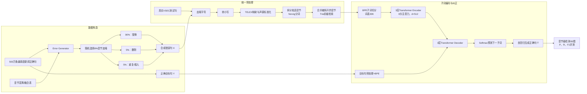

# VSEC: Transformer-based Model for Vietnamese Spelling Correction

> 中文题目：**VSEC：基于 Transformer 的越南语拼写纠错模型**  
> 论文类型：低资源语言 NLP、拼写错误检测与纠正、序列到序列生成  
> 正式出处：PRICAI 2021，Springer LNCS 13032，Part II，pp. 259–272  
> DOI：[10.1007/978-3-030-89363-7_20](https://doi.org/10.1007/978-3-030-89363-7_20)  
> arXiv：[2111.00640](https://arxiv.org/abs/2111.00640)  
> 数据集与标注：[VSEC2021/VSEC](https://github.com/VSEC2021/VSEC)

---

## 作者信息

| 作者 | 论文发表时机构 | 身份/背景 | 领域大牛认定 |
|---|---|---|---|
| Dinh-Truong Do（Đỗ Đình Trường，第一作者/通讯标记） | VNU University of Engineering and Technology（VNU-UET），越南国家大学河内分校工程与技术大学 | 论文完成期为本科研究生；个人主页显示其 2020–2021 年在软件工程实验室从事本科研究，随后赴 JAIST 攻读硕士并转向语义解析、对话系统和法律 NLP。本文是典型的学生主导工作。 | **否，论文发表时属于优秀学生/青年研究者**。后来在 ACL、EACL 等发表工作，发展较快，但不能称作资深国际大牛。 |
| Ha Thanh Nguyen（Nguyễn Hà Thanh） | Japan Advanced Institute of Science and Technology（JAIST） | 长期从事深度学习、越南语 NLP 与法律文本处理；ORCID 为 0000-0003-2794-7010，后续工作还涉及法律检索与法律推理。 | **方向骨干型研究者，但不是公认国际顶级领军人物**。在越南语/法律 NLP 交叉方向具有持续积累。 |
| Thang Ngoc Bui（Bùi Ngọc Thăng） | VNU-UET | VNU-UET 博士、机器学习教师；VNU-UET AI Institute 页面显示其为副院长/副所长，方向为机器学习。 | **越南本地高校机器学习方向骨干**，但没有证据支持 ACM/IEEE Fellow、院士或国际顶级 NLP 领军者层级。 |
| Hieu Dinh Vo（Võ Đình Hiếu） | VNU-UET | 工学博士，2009 年毕业于 JAIST；研究背景主要是软件架构、Web 服务、软件质量与程序分析，也指导 NLP/软件工程交叉学生研究。 | **资深教师和软件工程研究者**，在本项目中更像导师与工程方法支持者；并非国际 NLP “大牛”。 |

团队相关信息：

该工作是 **VNU-UET 与 JAIST 的跨机构合作**，整体呈现为“**优秀本科生/青年研究者主导，VNU-UET 与 JAIST 教师共同指导**”的结构。团队并不是由国际顶级 NLP 学术明星领衔的大型实验室，但它抓住了当时越南语拼写纠错缺少真实统一测试集的问题，形成了后来被多项工作复用的 **VSEC 数据集与基准**。从领域贡献看，团队的优势在于越南语本地知识、工程实现与数据资源建设，而不是提出新的 Transformer 理论。

作者身份依据：[第一作者个人主页](https://truongdo619.github.io/)、[VNU-UET AI Institute](https://uet.vnu.edu.vn/vien-tri-tue-nhan-tao/)、[Hieu Dinh Vo 主页](https://uet.vnu.edu.vn/~hieuvd/)、[VNU 学术档案](https://scholar.vnu.edu.vn/entities/publication/2b10e580-458e-454b-b062-5f8f5df6d8e3)。

## 论文发表时间

| 项目 | 具体日期 | 来源/说明 |
|---|---|---|
| arXiv v1 | **2021 年 11 月 1 日** | arXiv 首次公开，编号 2111.00640 |
| arXiv v2 | **2021 年 11 月 9 日** | 当前本地 PDF 对应 v2，PDF 边栏标注 “9 Nov 2021” |
| 会议召开 | **2021 年 11 月 8–12 日** | PRICAI 2021，越南河内 |
| 正式发表 | **2021 年** | 收录于 Springer LNCS 13032《PRICAI 2021: Trends in Artificial Intelligence》，Part II，259–272 页 |
| DOI | **10.1007/978-3-030-89363-7_20** | Springer 正式会议论文 DOI |
| 当前影响力参考 | **OUCI 记录 11 次引用** | 截至 2026-07-27 查询；不同数据库的合并规则不同，引用数会变化。OUCI 同时标注 Scopus 收录、Web of Science 未收录 |

因此，这篇论文**不是仍处于双盲评审的预印本**，而是已经正式发表于 **PRICAI 2021**。arXiv 只是公开版本。PRICAI 是历史较久的区域性国际人工智能会议，具有正式同行评审和 Springer LNCS 出版渠道，但不能与 ACL、EMNLP、NeurIPS 等领域旗舰会议等同。

发表信息依据：[arXiv 提交记录](https://arxiv.org/abs/2111.00640)、[PRICAI 2021 书目信息](https://dblp.org/db/conf/pricai/pricai2021-2.html)、[出版与引用记录](https://ouci.dntb.gov.ua/en/works/lR8gyZG7/)。

## 摘要

论文研究通用越南语拼写错误检测与纠正。传统越南语方法多依赖 N-gram，只利用目标音节附近的有限上下文；当相邻位置同时出现多个错误时，错误本身会污染上下文，导致漏检。作者把纠错重新表述为“错误句到正确句”的机器翻译任务，使用 **BPE 子词切分 + Transformer Encoder–Decoder** 直接生成修正后的句子。

训练方面，作者从越南语新闻语料中抽取 500 万句，通过错误融合表和随机插入、删除、替换构造合成错误。测试方面，作者从教育文档网站收集并人工校正 9,341 个句子，包含 11,202 个错误，形成公开的 VSEC 真实错误测试集。实验中，VSEC 获得检测 F1 0.868、纠错 F1 0.815，优于作者复现的 N-gram 基线。

---

## 一、这篇论文讲了一个什么样的故事？

这篇论文的故事可以概括为：

> **局部上下文不够用，完整上下文又容易被 OOV 拖垮；因此用 BPE 把越南语音节拆成可学习的子词，再用 Transformer 在全句范围内完成“错误句 → 正确句”的翻译。最后用真实人工错误数据证明，这条路线比 N-gram 更均衡。**

故事分为五步：

1. **现实问题**：越南语错误不只是不存在于词典的 non-word typo，还包括仍是合法音节、但放在当前上下文中错误的 real-word typo，以及由方言发音和书写认知造成的 misspelling。
2. **旧方法瓶颈**：N-gram 主要查看目标位置前后有限音节。当两个错误相邻时，一个错误会成为另一个错误的错误上下文。
3. **粒度矛盾**：
   - 字符级可以处理未登录词，但序列过长、训练慢；
   - 音节级序列短，但拼错音节往往直接 OOV；
   - BPE 子词级位于两者之间。
4. **模型方案**：把拼写纠错视为机器翻译，让 Transformer 编码整句上下文并自回归生成正确句。
5. **证据闭环**：用 500 万合成噪声句训练，再用人工标注的真实错误集测试；检测和纠错 F1 均超过 N-gram。

论文最成功的叙事点，是把“**广上下文建模**”和“**OOV 处理**”绑定起来；最重要的长期产物，则是 **VSEC 真实错误测试集**。

---

## 二、本文的核心思想和创新点

### 1. 核心思想

核心思想是学习条件生成函数：

$$
f:X\rightarrow Y,\qquad f(x_i)=y_i
$$

其中 $x_i$ 是含拼写错误的越南语音节序列，$y_i$ 是对应的正确序列。模型不再逐个位置检索候选并用局部 N-gram 排序，而是直接学习：

$$
\hat{Y}=\arg\max_Y P(Y\mid X)
$$

这里的关键不是“用了 Transformer”本身，而是三个设计的组合：

- **句级条件生成**：利用全句上下文消解 real-word error；
- **BPE 子词表示**：让拼错或稀有音节仍能被分解和编码；
- **合成训练 + 真实测试**：解决低资源场景中训练样本不足，同时避免只在合成错误上自证有效。

### 2. 关键创新点

1. **将通用越南语拼写纠错建模为 Transformer Seq2Seq**
   
   同时覆盖 typing error 与认知/方言相关的 misspelled error，而不是只处理某一类声母或 OCR 错误。

2. **在越南语拼写纠错中使用 BPE 子词粒度**
   
   子词粒度在字符级和音节级之间折中：既减少 OOV，又不把序列扩张到纯字符级的长度。

3. **构造 VSEC Error Generator**
   
   从新闻语料生成大规模“错误句—正确句”对，并显式加入替换、删除和重复操作，以模拟输入、复制粘贴等错误。

4. **发布真实人工拼写错误测试集**
   
   VSEC 包含 9,341 个句子、11,202 个错误、4,582 类错误。相较只用人工注入错误的评测，它更接近真实使用场景，并成为后续越南语纠错工作的常用基准。

5. **把检测与纠正分开评价**
   
   分别报告 Detection P/R/F1 与 Correction P/R/F1，可以区分“找到了错误”与“给出了正确修改”。

需要注意：Transformer、BPE、Seq2Seq 都不是本文原创；真正的新意是把这些成熟组件系统地适配到越南语拼写纠错，并以公开真实数据集形成基准。

---

## 三、方法是怎么实现的？(How does it work?)

### 1. 架构

VSEC 是一个“**规则预处理 + BPE 子词化 + Transformer 条件生成**”流水线。训练阶段使用合成错误句与原始正确句构成平行语料；测试阶段输入真实错误句，输出完整修正句。

**图注**：依据论文 **Figure 1（Model pipeline）**、Section 3.3–3.5、Section 4.1 与 Table 3 综合重绘。原 Figure 1 只展示预处理、BPE 和 VSEC 三模块；上图补出了论文正文描述的训练数据生成、Transformer 编解码和评测路径。

### 2. 关键算法

#### 2.1 五步预处理

1. **去噪字符**：删除 emoji、换行等作者认为无助于上下文学习的字符。
2. **统一小写**：降低词表稀疏度。
3. **声调/附加符号标准化**：先转成 TELEX，再通过映射恢复标准 Unicode 越南语。例如：
   $$
   \text{“cuả”}\rightarrow \text{“cuar”}\rightarrow \text{“của”}
   $$
4. **拆分粘连音节**：用 Peter Norvig 的基于词频的分词算法处理缺失空格。
5. **合并被拆开的音节**：用 Trie 前缀结构处理一个音节内部被误加空格的问题。

这五步非常重要，因为它们意味着 VSEC 并非“纯端到端 Transformer”：部分空格和声调规范化错误已经在规则层解决。

#### 2.2 BPE 子词学习

BPE 的过程是：

1. 在每个音节末尾加入 `/w` 边界符；
2. 将语料初始拆为单字符；
3. 统计所有相邻 token pair；
4. 每轮合并频率最高的 pair；
5. 重复直到达到目标词表规模。

例如，错误音节 `nghành` 不必作为一个完整 OOV 音节存在，可以被表示成 `ngh` + `ành`。相比之下：

- 字符级：OOV 少，但序列最长；
- 音节级：序列最短，但错误音节容易 OOV；
- BPE：在表达能力和序列长度之间折中。

#### 2.3 Transformer Seq2Seq

编码器将错误输入序列映射为全局上下文表示；解码器结合编码器状态和已经生成的目标子词，逐步生成正确句子。训练使用 Teacher Forcing 语境下的交叉熵损失，优化器为 Adam。

#### 2.4 错误生成

从 500 万新闻句中随机选取 **8% 的音节**加噪：

- 90% 替换为混淆表中的其他音节；
- 5% 删除；
- 5% 重复，近似插入/复制粘贴错误。

该策略提供了足够大的监督训练集，但也隐含假设：真实错误频率、类型比例和上下文条件可以由这套随机过程近似。

### 3. 关键公式

#### 3.1 编码器

$$
\mathbf{h}^{src}_{1:n}
=
\operatorname{Encoder}
\left(
\mathbf{E}^{src}_{x_{1:n}}
\right)
$$

- $x_{1:n}$：输入错误句的 BPE token；
- $\mathbf{E}\in\mathbb{R}^{d\times |V|}$：嵌入矩阵；
- $\mathbf{h}^{src}_{1:n}$：编码器对整句生成的上下文隐状态。

#### 3.2 解码器

$$
\mathbf{h}_t
=
\operatorname{Decoder}
\left(
\mathbf{E}^{trg}_{y_{1:t-1}},
\mathbf{h}^{src}_{1:n}
\right)
$$

解码器利用输入句上下文和此前已生成的目标 token，得到时刻 $t$ 的目标隐状态。

#### 3.3 下一个 token 的概率

$$
P_t(w)
=
\operatorname{softmax}
\left(
\mathbf{W}^{T}\mathbf{h}_t
\right)
$$

Softmax 在大小为 $|V|$ 的目标词表上输出概率分布，自回归选择下一个 token。

#### 3.4 检测指标

$$
DP=\frac{\#\text{正确检测的错误}}{\#\text{被模型判为错误的位置}}
$$

$$
DR=\frac{\#\text{正确检测的错误}}{\#\text{真实错误}}
$$

$$
DF=\frac{2DP\cdot DR}{DP+DR}
$$

#### 3.5 纠正指标

$$
CP=\frac{\#\text{被正确改正的位置}}{\#\text{被模型判为错误的位置}}
$$

$$
CR=\frac{\#\text{被正确改正的位置}}{\#\text{真实错误}}
$$

$$
CF=\frac{2CP\cdot CR}{CP+CR}
$$

这里必须区分：

- **CF = 0.815** 是纠错 F1；
- **CR = 0.763** 才表示“所有真实错误中有 76.3% 被成功改正”。

论文摘要把 0.815 写成“81.5% errors corrected”，表达并不严谨。

---

## 四、实验效果 (Experimental Results)

### 1. 实验设置

#### 数据集

| 用途 | 来源与规模 | 处理方式 |
|---|---|---|
| 训练数据 | 越南语新闻语料 500 万句 | 每句随机选择 8% 音节注入错误；90% 替换、5% 删除、5% 重复 |
| 真实测试数据 | Tailieu.vn 的 618 篇教育类文档 | 3 人、3 阶段人工校正 |
| 测试集规模 | 9,341 句；11,202 个错误；4,582 种错误类型 | 公开于 VSEC GitHub |

#### 基线

- N-gram；
- BiLSTM Seq2Seq + attention；
- Character-level Transformer；
- Syllable-level Transformer；
- VSEC：Subword-level Transformer。

#### 超参数

| 参数 | 数值 |
|---|---:|
| Embedding dimension | 512 |
| 最大序列长度 | 200 |
| 多头注意力 head 数 | 8 |
| Encoder/Decoder 层数 | 3 / 3 |
| Batch size | 32 |
| Learning rate | 0.0003 |
| Dropout | 0.1 |
| BPE vocabulary | 30,000 |
| 优化器/损失 | Adam / Cross-Entropy |

论文未报告训练硬件、训练时长、解码策略、beam size、随机种子、重复实验方差与显著性检验。

### 2. 主要结果

| 方法 | 检测 P | 检测 R | 检测 F1 | 纠正 P | 纠正 R | 纠正 F1 |
|---|---:|---:|---:|---:|---:|---:|
| N-gram | 0.912 | 0.731 | 0.812 | **0.891** | 0.714 | 0.793 |
| Seq2Seq + Attention | 0.310 | 0.752 | 0.439 | 0.222 | 0.539 | 0.315 |
| Character Transformer | 0.775 | 0.367 | 0.498 | 0.612 | 0.290 | 0.393 |
| Syllable Transformer | 0.719 | 0.776 | 0.746 | 0.636 | 0.686 | 0.661 |
| **VSEC（Subword Transformer）** | **0.931** | **0.813** | **0.868** | 0.874 | **0.763** | **0.815** |

**核心结论**：

- VSEC 的检测 F1 为 **0.868**，比 N-gram 的 0.812 高 **5.6 个百分点**。
- VSEC 的纠错 F1 为 **0.815**，比 N-gram 的 0.793 高 **2.2 个百分点**。
- N-gram 的纠错 Precision 反而更高：**0.891 > 0.874**。它更保守，少改但漏得更多。
- VSEC 的主要优势来自 Recall：能够发现并纠正更多错误，尤其是相邻的多错误情形。
- 纯字符 Transformer 与纯音节 Transformer 都明显弱于 BPE 子词模型，支持“中间粒度更适合该任务”的判断。
- BiLSTM Seq2Seq 表现非常差，提示“生成式模型”并非自动有效，表示粒度和架构同样关键。

论文给出的代表性例子是：

> `Chuẩn bị sãn sang hợp đồng ký kết`

其中 `sãn sang` 应为 `sẵn sàng`。N-gram 只改正其中一个音节，因为另一个错误污染了局部上下文；VSEC 能同时修正两个音节。

### 3. 消融实验与关键发现

#### 3.1 训练数据规模

| 训练句数 | 检测 F1 | 纠错 F1 |
|---:|---:|---:|
| 500K | 0.767 | 0.676 |
| 1M | 0.804 | 0.733 |
| 2M | 0.826 | 0.765 |
| 5M | **0.868** | **0.815** |

数据从 50 万增加到 500 万时，检测 F1 提升 10.1 个百分点，纠错 F1 提升 13.9 个百分点。论文范围内尚未观察到明显饱和，但这不等于“数据无限增加一定继续提升”，因为实验只到 500 万。

#### 3.2 BPE 词表规模

| 词表规模 | 检测 P | 检测 R | 检测 F1 | 纠正 P | 纠正 R | 纠正 F1 |
|---:|---:|---:|---:|---:|---:|---:|
| 1K | 0.886 | 0.585 | 0.705 | 0.771 | 0.509 | 0.613 |
| 10K | 0.935 | 0.793 | 0.858 | **0.878** | 0.745 | 0.806 |
| 30K | 0.931 | **0.813** | **0.868** | 0.874 | **0.763** | **0.815** |
| 50K | **0.937** | 0.773 | 0.847 | 0.874 | 0.721 | 0.790 |

关键发现：

- 词表太小会把音节切得过碎，序列变长、召回下降。
- 词表太大又趋近音节级，稀有/错误音节更难共享子词结构。
- **30K 是本文数据上的最佳折中，而不是普适常数。**
- 50K 的 Precision 更高，但 Recall 和 F1 更低，再次体现保守性与覆盖率的权衡。

#### 3.3 错误分析

作者抽样分析 100 个 false detection：

- **32%**：外来词与缩略词；
- **28%**：缺少领域知识；
- **40%**：无明确统一类别。

典型错误：

- 公司缩写 `TH` 被改成越南语音节 `Thì`；
- 数学术语 `Đồ thị`（图）被改成 `Đô thị`（城市）。

这说明模型会把“不熟悉但正确”的专名、缩写和领域词误判为拼写错误。问题本质是训练新闻语料与测试教育文档之间的领域偏移。

**实验部分总结**：

本文的实验支持三个结论：

1. 全句 Transformer 比局部 N-gram 更擅长相邻多错误；
2. BPE 子词级比字符级、音节级更适合该数据；
3. 大规模合成训练可以迁移到真实错误测试集。

但论文没有证明模型在不同领域、正式文书、社交媒体、OCR 或完全干净文本上同样可靠，也没有量化过度纠正对用户的实际代价。

---

## 五、优点与局限性

### ✅ 1. 优点

1. **问题抓得准**
   
   论文明确指出 N-gram 在相邻多错误时会发生“错误上下文污染”，这是通用拼写纠错中的真实瓶颈。

2. **表示粒度设计合理**
   
   BPE 不是为了追逐潮流，而是针对越南语音节级 OOV 与字符级长序列之间的矛盾给出的工程折中。

3. **训练与测试来源分离**
   
   用新闻合成数据训练、用人工真实错误测试，至少避免了“在同一种噪声生成器上训练和测试”的明显循环论证。

4. **发布真实测试集**
   
   这是论文最具长期价值的贡献。VSEC 让后续方法能够在相同真实错误集上比较，而不必各自生成一套不可比的错误。

5. **指标拆分清楚**
   
   检测与纠正分别计算 P/R/F1，比只报告句子 BLEU 更能反映拼写系统的实际行为。

6. **提供了有效的超参数分析**
   
   数据规模与词表规模实验直接揭示了低资源训练和子词粒度的影响。

7. **有实际错误分析**
   
   外来词、缩写和领域术语的 false positive 分布，为后续实体保护、领域词典和置信度校准指出了方向。

### ⚠️ 2. 局限性（研究边界与待解问题）

1. **训练噪声与真实错误分布不匹配**
   
   8% 加噪比例以及 90/5/5 的替换、删除、重复分布是人为设定，论文没有证明它与真实用户错误频率一致。错误是独立随机注入的，也难模拟方言、认知、输入法状态和连续编辑行为。

2. **“端到端”程度有限**
   
   粘连音节、音节内部空格和部分声调规范化由规则预处理提前完成。论文没有单独消融这五步预处理，因此无法知道增益中有多少来自 Transformer。

3. **真实测试集仍然单域**
   
   测试集主要来自教育材料网站，且作者刻意选择低质量文本以提高错误密度。它不能代表新闻、社交媒体、行政文书、聊天、医学和法律文本。

4. **标注可靠性报告不足**
   
   只说明由 3 人分 3 个阶段校正，没有报告标注规范、标注者背景、互标一致性、冲突解决方案及错误类型分布。

5. **基线不够完整**
   
   作者只复现 N-gram、BiLSTM 和不同粒度 Transformer，没有比较预训练语言模型、检测—纠正双阶段模型或强大的规则/词典系统。以 2021 年时间点看尚可理解，但今天不能把它当作现代 SOTA。

6. **复现材料不完整**
   
   GitHub 仓库公开的是数据集和 JSONL 格式，未发现完整模型训练代码、错误生成器、融合表、模型权重与环境配置。论文还缺少硬件、训练时长、解码策略和随机种子。

7. **无统计显著性**
   
   没有多随机种子、置信区间或显著性检验。纠错 F1 相对 N-gram 只高 2.2 个百分点，不能判断这一差异对随机初始化有多稳定。

8. **忽略大小写和专名保护**
   
   全部转小写降低了稀疏性，却牺牲了大小写错误检测和专名线索；缩写被误改正是这一设计的直接风险之一。

9. **没有评估干净文本上的过度纠正**
   
   实际拼写系统的大多数输入位置是正确的。论文没有报告 clean sentence accuracy、false edits per 1,000 tokens、over-correction rate 或最小编辑性。

10. **生成式系统的部署成本不明**
    
    未报告推理速度、显存、吞吐量和延迟，也没有讨论 Seq2Seq 生成整句可能带来的非局部改写与语义漂移。

11. **摘要对 81.5% 的描述不严谨**
    
    0.815 是纠错 F1，不是成功改正的真实错误比例；真正的纠错召回率为 0.763。

---

## 六、其他

### 第一性原理

#### 1. 拼写纠错不是“找最近的词”，而是受约束的条件推断

对于输入 $X$，系统需要寻找最可能的正确文本 $Y$：

$$
\hat{Y}
=
\arg\max_Y
\underbrace{P(Y)}_{\text{语言合理性}}
\underbrace{P(X\mid Y)}_{\text{错误机制}}
$$

传统 N-gram 主要近似局部语言合理性，编辑距离主要近似错误机制；VSEC 则直接学习 $P(Y\mid X)$。两者并非互斥：更理想的系统应把语言模型、真实错误通道和最小修改约束结合起来。

#### 2. real-word error 的信息来自上下文

一个音节单独看可能完全合法，只有放入句子才显得错误。因此：

- non-word error 可以较多依赖词典和字符结构；
- real-word error 必须依赖上下文语义；
- 方言/认知错误还需要标准书写知识。

Transformer 的意义是扩大有效上下文，而不是简单把模型做大。

#### 3. token 粒度是一个压缩—泛化权衡

- 字符级：共享充分、OOV 少，但序列长，语义组合困难；
- 音节级：语义单元完整、序列短，但错误音节稀疏；
- 子词级：用频繁片段压缩序列，同时让罕见音节共享内部结构。

BPE 30K 最优，本质上是该数据分布下的“压缩率与泛化能力”平衡点。

#### 4. 拼写纠错的核心目标应是“最小充分修改”

真正的目标不是生成最流畅的句子，而是：

$$
\max_Y P(Y\mid X)
\quad
\text{s.t.}
\quad
\operatorname{Meaning}(Y)\approx \operatorname{Meaning}(X),
\quad
\operatorname{Edit}(X,Y)\ \text{尽可能小}
$$

VSEC 只显式优化生成概率，没有显式约束语义保持和最小编辑。这解释了缩写、专名和领域术语被“合理化改写”的风险。

#### 5. 纠错系统必须按错误成本选择工作点

N-gram 更保守、Precision 更高；VSEC Recall 更高。在法律、行政、医学文本中，误改一个正确实体可能比漏掉一个普通错字更严重。因此不能只看 F1，需要按场景设定：

- 自动改正；
- 仅提示；
- 高置信自动改正、低置信候选建议；
- 实体与专业词强制保护。

### 领域空白

结合本文贡献和后续研究需求，仍有以下值得做的空白：

1. **真实用户错误通道**
   
   从版本修订、键盘日志或人工纠错历史中学习 $P(X\mid Y)$，替代固定 90/5/5 合成比例。

2. **检测—纠正解耦**
   
   先用高精度检测器定位错误，再用字符/子词局部生成器修改，避免整句生成造成非局部改写。

3. **OOV、空格和长度变化的统一处理**
   
   token classification 往往难处理一对多、多对一；Seq2Seq 又容易过改。局部 span generation、pointer-generator 或编辑标签与生成混合值得研究。

4. **领域自适应与实体保护**
   
   行政编号、法律条款、人名、机构名、缩写、数学术语和外来词需要显式 mask、领域词典或检索增强。

5. **过度纠正评测**
   
   应增加：
   - Clean Sentence Accuracy；
   - Over-Correction Rate；
   - False Edits / 1,000 tokens；
   - 保持原句率；
   - 实体保护准确率；
   - 语义保持评价。

6. **跨域、跨错误类型基准**
   
   在 VSEC 之外，应加入 Wikipedia 修订、新闻、聊天、社交媒体、行政/法律及 OCR，并分别报告 typo、real-word、diacritic、spacing、case、dialect、entity 等类型。

7. **置信度校准与人机协作**
   
   研究何时自动改、何时给候选、何时保持不动，比单纯提升平均 F1 更接近真实产品需求。

8. **现代越南语预训练模型的公平比较**
   
   需要在统一数据、统一指标和统一算力下比较 PhoBERT、BARTpho、ViT5、字符生成模型、编辑式模型和 LLM，并控制训练数据泄漏。

9. **可复现的开放流水线**
   
   公开错误生成器、融合表、预处理代码、模型权重、训练日志、随机种子和许可证，使 VSEC 从“开放测试集”升级为“完整开放基准”。

---

## 一句话评价

**VSEC 不是因为提出了新的 Transformer 而重要，而是因为它用 BPE + 全句生成解决了越南语局部 N-gram 的明显瓶颈，并公开了一套真实错误测试集；模型今天已经不是最先进，但论文仍是理解越南语拼写纠错数据、指标与基准演化的必读起点。**

---

> 笔记由ChatGPT （Codex）生成

