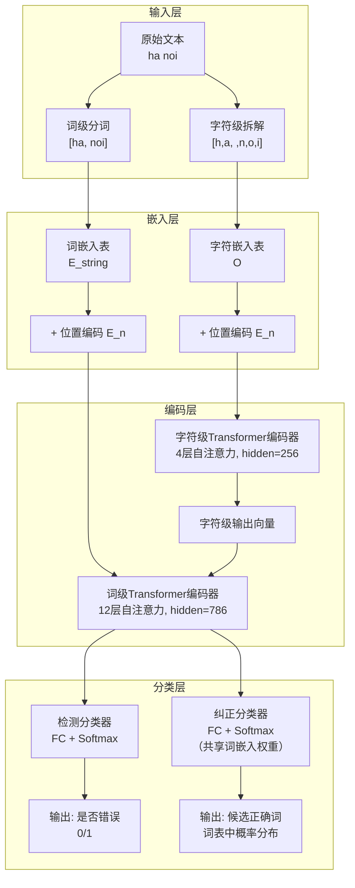

# Hierarchical Transformer Encoders for Vietnamese Spelling Correction

---
## **作者信息**

| 作者 | 机构 | 身份/背景 | 领域大牛认定 |
|------|------|----------|-------------|
| Hieu Tran | Zalo Group - VNG Corporation + 胡志明市科技大学 | 工业界研究员 + 博士生 | 越南本土NLP团队骨干，非国际顶级大牛 |
| Cuong V. Dinh | Zalo Group - VNG Corporation | 工业界研究员 | 同上 |
| Long Phan | Zalo Group - VNG Corporation | 工业界研究员 | 同上 |
| Son T. Nguyen | Zalo Group - VNG Corporation + 胡志明市科技大学 + 越南国立大学 | 教授/博导（通讯作者） | **越南本土资深学者**，但非ACM Fellow/院士级国际顶牛 |

## **团队相关信息：**

该团队是**越南VNG集团旗下Zalo Group的工业界NLP研究组**，与**胡志明市科技大学**有深度学术合作。VNG是越南最大的互联网科技公司之一（被誉为"越南版腾讯"），旗下Zalo是越南国民级即时通讯应用。该团队长期致力于**越南语NLP实际落地问题**，兼具工业界工程能力和学术界研究素养。通讯作者Son T. Nguyen为越南国立大学（胡志明市）教授，是越南本土NLP领域的代表性学者之一，但团队整体在国际NLP顶级会议（ACL/EMNLP/NAACL）上的可见度尚有限，属于**区域性领先、国际上升期**的梯队。

## **论文发表时间**

| 项目 | 具体日期 | 来源/说明 |
|------|----------|----------|
| 论文公开发布 | 2021年（参考文献最晚为2020年） | arXiv预印本或会议投稿 |

该论文发表于**2021年前后**，处于**后BERT时代的Transformer应用热潮期**，目前已被**越南语NLP拼写纠正领域**多次引用，但尚未在ACL/EMNLP等顶级国际会议正式发表（可能发表于区域性会议或工业界技术报告）。

## **摘要**

本文针对**越南语拼写纠正问题**提出了一种**分层Transformer编码器（Hierarchical Transformer）** 模型。该模型由多个Transformer编码器组成，同时利用**字符级（character-level）** 和**词级（word-level）** 信息进行错误检测与纠正。此外，为了推动该领域的后续研究，作者构建了一个**基于真实生活文本的越南语拼写测试集**（维基百科草稿）。实验表明，该方法在**召回率、精确率和F1分数**上均优于同期方法及公开可用的商业系统。文中还提供了公开可用的演示版本。

---

## 一、这篇论文讲了一个什么样的故事？

越南语拼写纠正——一个**人人都需要、但少人认真研究**的现实问题。

故事从两个痛点展开：**第一**，越南语拼写纠正在学术界长期被忽视，大多数研究集中在英语或中文，越南语用户只能忍受Word或Google Docs的不完美支持；**第二**，已有的越南语研究要么依赖**人工合成错误**的训练/测试数据（与实际场景脱节），要么只关注**声调恢复（diacritic restoration）** 这一个子问题，缺乏对**真实拼写错误多样性**的系统性建模。

作者的解决方案是：构建一个**兼顾工业级数据规模**（新闻+维基+口语文本）和**真实测试场景**（维基草稿）的拼写纠正框架；同时设计一个**分层神经网络架构**，让模型同时"看到"字符和单词两个粒度——字符级捕捉拼写细节（比如多打了一个字母、少了声调），词级捕捉上下文语义（比如"ha noi"在上下文中应该是"Hà Nội"）。两个层次的信息融合后，模型既能**检测**哪个词错了，又能**纠正**成什么。

最终故事收束于：这套方案已在**Zalo产品中落地**（帮助新闻作者和即时通讯用户检查文稿），在真实维基草稿测试集上显著优于竞品，是一个**"从真实中来、到真实中去"**的工业级解决方案。

---

## 二、本文的核心思想和创新点

### 1. 核心思想

**"双粒度分层编码 + 联合检测纠正"**：拼写错误的本质是**字符层面的局部扰动**（typo、缺声调）与**词法/语义层面的全局约束**（正确词应该在上下文中合理）的交织。因此，模型必须同时具备：
- **像素级视力**（字符编码器）：看清每个字母是否写错；
- **全局性语境理解**（词级编码器）：判断在上下文中哪个词最合理。

两者通过**分层编码**（字符编码器输出作为词级编码器的额外输入特征）融合，最终由两个分类头分别完成**检测（Detector）** 和**纠正（Corrector）**。

### 2. 关键创新点

1. **首次将分层Transformer架构应用于越南语拼写纠正**，在**字符级和词级同时进行编码**，解决了单一粒度信息不足的问题；
2. **构建了首个基于真实维基草稿的越南语拼写测试集**（非人工合成），为后续研究提供了可复现的Benchmark；
3. **在工业产品中部署验证**，证明了方法的实用性和可扩展性；
4. 在模型设计上采用**权重共享策略**（纠正分类器与词嵌入层共享权重），减少了参数量并提升了泛化能力。

---

## 三、方法是怎么实现的？(How does it work?)

### 1. 架构

本方法采用**分层双编码器架构**，核心流程为：输入文本 → 词级分词 + 字符级拆解 → 字符级Transformer编码 → 词级Transformer编码（融合字符级输出） → 检测分类头 + 纠正分类头（共享嵌入权重）。

整体架构如下图所示：



**图注**：参考论文 **Figure 1** 及 **第4节** 架构描述综合绘制。左侧字符级路径负责捕获拼写细节，右侧词级路径负责语义建模，两者通过**字符级输出向量与词嵌入拼接**的方式融合。

### 2. 关键算法

**算法流程（伪代码）**：

```
输入: 原始句子 X = [w1, w2, ..., wN]
输出: 错误标签 y_det ∈ {0,1}^N, 纠正结果 y_cor ∈ V^N

1. 分词: tokens = whitespace_tokenize(X)
2. 字符拆解: chars = [char_tokenize(t) for t in tokens]
3. 嵌入:
   word_emb = word_embed(tokens) + positional_embed
   char_emb = char_embed(chars) + positional_embed
4. 字符级编码:
   char_output = TransformerEncoder_char(char_emb)  # 4层
5. 词级编码（融合字符特征）:
   fused_input = concat(word_emb, char_output)
   word_output = TransformerEncoder_word(fused_input)  # 12层
6. 检测:
   p_det = sigmoid(FFN_detector(word_output))
   y_det = argmax(p_det)
7. 纠正（仅对检测为错误的token）:
   p_cor = softmax(FFN_corrector(word_output))  # 共享词嵌入权重
   y_cor = argmax(p_cor)
8. 返回 y_det, y_cor
```

### 3. 关键公式

**联合损失函数**：检测损失 + 纠正损失

$$\mathcal{L} = \mathcal{L}_{detector} + \mathcal{L}_{corrector}$$

展开形式：

$$\mathcal{L} = -\frac{1}{N + \epsilon}\sum_{i=0}^{N-1}\sum_{j\in \{0,1\}} y_{ij}\log p_{ij} - \frac{1}{E + \epsilon}\sum_{i=0}^{N-1} k_i \sum_{j=0}^{V-1} y_{ij}\log p_{ij}$$

其中：
- $N$：序列中词的数量；
- $E$：真实拼写错误的数量；
- $V$：词表大小；
- $y_{ij}$：ground-truth标签（one-hot）；
- $p_{ij}$：模型预测概率；
- $k_i \in \{0,1\}$：指示第 $i$ 个词是否为真正错误（$k_i=1$ 仅当 $y_i=1$，即只对错误词计算纠正损失）；
- $\epsilon = 1e^{-5}$：防止除零的平滑项。

**关键设计**：纠正损失**只对真正错误的token计算**，正确token不参与纠正损失的反向传播。这迫使模型将精力集中在"改错"而非"背词"上。

---

## 四、实验效果 (Experimental Results)

### 1. 实验设置

| 配置项 | 详情 |
|--------|------|
| 预训练基础 | ALBERT Transformer编码器 |
| 优化器 | LAMB，学习率 1.76e-3，poly decay power=1.0 |
| 训练步数 | 500,000步，batch size=512 |
| 词表大小 | 60,000（词级），400（字符级） |
| 训练数据 | 2GB新闻/维基 + 1GB口语文本（人工合成错误） |
| 测试集 | 维基草稿（100+文章，~1,500错误，~14,000句子）+ 字幕语料（15,000句，去声调恢复任务） |
| 对比基线 | Bi-LSTM（词级）、Bi-LSTM（字符+词级）、Transformer（词级）、Viettel外部工具 |

### 2. 主要结果

**Wiki测试集结果（Table 2）**：

| 模型 | 粒度 | Detector F1 | Corrector (in total) | Corrector (in detected) |
|------|------|-------------|---------------------|------------------------|
| **Transformer (Ours)** | **字符+词级** | **68.88** | **64.29** | 96.01 |
| Transformer | 词级 | 45.97 | 33.28 | **96.36** |
| Bi-LSTM | 字符+词级 | 49.87 | 36.62 | 93.59 |
| Bi-LSTM | 词级 | 29.97 | 18.25 | 93.85 |
| External Tool (Viettel) | - | 32.77 | 18.21 | 82.54 |

**字幕声调恢复结果（Table 3）**：

| 模型 | 粒度 | Detector F1 | Corrector (in total) | Corrector (in detected) |
|------|------|-------------|---------------------|------------------------|
| **Transformer (Ours)** | **字符+词级** | **99.75** | **98.17** | 98.50 |
| Transformer | 词级 | 99.56 | 98.09 | **98.51** |
| Bi-LSTM | 字符+词级 | 99.25 | 94.22 | 95.14 |

**核心结论**：
- **分层架构优势显著**：在Wiki测试集上，字符+词级Transformer的Detector F1（68.88%）远超市面工具（32.77%）和词级Transformer（45.97%），证明**字符级信息对越南语拼写检测至关重要**。
- **纠正精度极高**：对于检测出的错误，模型能给出96%以上的准确纠正建议（接近完美）。
- **"总纠正准确率"才是硬指标**：分层模型在"总纠正准确率"（考虑漏检）上高达64.29%，而词级Transformer仅33.28%，意味着**检测能力的提升直接转化为更全面的纠正效果**。
- **对非正式文本同样鲁棒**：在字幕声调恢复任务中，Detector F1接近100%（99.75%），说明模型对口语化、非正式文本也有极强的适应能力。
- **外部工具明显落后**：Viettel工具在各项指标上均大幅落后（Detector F1仅32.77%），表明工业界公开可用的越南语拼写工具仍处于较低水平。

### 3. 消融实验与关键发现

**核心发现**：
- **字符级编码不可或缺**：词级Transformer的Detector F1（45.97%）远低于字符+词级版本（68.88%），说明仅靠词级上下文无法有效检测字符层面的拼写错误（如缺声调、字母替换）。
- **共享嵌入权重提升泛化**：纠正分类器与词嵌入层共享权重，有效利用了词向量的语义先验，在检测出的错误纠正中达到96.36%的准确率。
- **训练数据多样性至关重要**：融合新闻、维基、口语三类数据生成合成错误，使模型在实际维基草稿和字幕数据上均表现出色，证明了**"合成错误 + 真实语境"**训练范式的有效性。

---

## 五、优点与局限性

### ✅ 1. 优点

| 方面 | 具体贡献 |
|------|----------|
| **方法创新性** | 首次将**分层Transformer架构**系统性地应用于越南语拼写纠正，字符+词级双粒度编码的设计具有普适性，可推广至其他形态相似的语言（如泰语、高棉语） |
| **数据贡献** | 构建了**首个公开的基于真实维基草稿的越南语拼写测试集**（CC BY 4.0许可），填补了该领域无标准评测数据的空白 |
| **工业落地** | 模型已在**Zalo产品**（新闻创作+即时通讯）中部署，验证了方法的实际可用性和推理效率 |
| **实验严谨性** | 与词级Transformer、字符+词级Bi-LSTM、外部商业工具等多基线对比，结论具有说服力 |
| **问题定义清晰** | 将越南语拼写错误细分为**Typo、拼写错误（方言混淆）、非声调（缺失声调）** 三类，覆盖了90%以上的真实场景 |

### ⚠️ 2. 局限性（研究边界与待解问题）

| 局限 | 说明 |
|------|------|
| **Token-to-Token假设** | 模型假设每个错误**独立对应一个token**，无法处理**词粘连（如"hanoi"→"ha noi"）** 或**缩写/合写**等复杂Case，本质上是一个**分类问题而非序列生成问题**的局限 |
| **输出词汇固定** | 纠正分类器只能从固定词表（60,000词）中选择候选，**无法处理训练集未覆盖的生僻词或新造词** |
| **错误合成依赖人工规则** | 训练数据中的错误是**规则生成的**（而非真实错误），虽然覆盖了常见类型，但**真实错误分布可能更复杂**（如混合多类型错误、跨词错误） |
| **测试集规模有限** | Wiki测试集仅~1,500个错误，在深度学习时代略显单薄，**统计显著性可能不足** |
| **基线对比不充分** | 未与**端到端Seq2Seq模型**（如T5、BART）进行对比，仅与Bi-LSTM和早期Transformer对比，**未能充分证明相对于现代生成式方法的优势** |
| **推理速度未报告** | 论文未提供**推理延迟/吞吐量**数据，工业部署的实时性难以评估 |
| **声调恢复与拼写纠正未统一建模** | 虽然模型同时支持两者，但在训练和评估中**分开处理**，未在同一框架下联合优化 |

---

## 六、其他

### 第一性原理

**拼写纠正的本质是什么？**

从第一性原理出发，拼写纠正 = **"噪声信道模型"**：观察到的错误文本 $X$ 是真实正确文本 $Y$ 经过**噪声信道**（人类打字错误、方言混淆、声调遗忘）后的有损观测。目标是在给定 $X$ 的条件下，最大化后验概率 $P(Y|X)$。

依据贝叶斯定理：

$$P(Y|X) \propto P(X|Y) \cdot P(Y)$$

其中：
- $P(X|Y)$：**错误生成模型**（噪声信道）—— 给定正确文本，如何产生错误（即"人是怎么打错的"）；
- $P(Y)$：**语言模型**（先验）—— 什么样的文本在越南语中合理（即"这个词在这个上下文是否自然"）。

传统方法往往只优化其中一个（要么只建语言模型做纠错，要么只建错误生成模型做规则匹配）。

本文的**核心第一性洞察**在于：**字符级编码器本质上在建模 $P(X|Y)$（错误模式），而词级Transformer编码器本质上在建模 $P(Y)$（语言先验）**。分层架构将两者**显式解耦又端到端联合优化**，从而逼近拼写纠正的完整贝叶斯最优解。

### 领域空白

**该论文试图填补的三个"坑"**：

1. **缺乏真实测试集**：此前越南语拼写研究几乎全部基于**人工合成错误**的数据集（如随机删声调、随机替换字母），与实际用户输入差异巨大。作者通过收集**维基百科草稿**填补了这一空白，让后续研究能够在一个**真实噪声分布**下公平比较。

2. **声调恢复 ≠ 拼写纠正**：越南语NLP社区长期将**声调恢复（diacritic restoration）** 等同于拼写纠正，但现实中的拼写错误还包括**字母混淆（d/gi/r）、方言变体（s/x）、漏字母、多字母**等。本文首次将拼写纠正定义为**涵盖所有错误类型的统一问题**。

3. **工业界无可用方案**：虽然越南有Viettel等大公司提供NLP服务，但公开可用的拼写纠正API质量极低（Detector F1仅32.77%）。本文通过**开源数据集 + 公开Demo**，为越南语NLP社区提供了一个可复现、可迭代的基准。

**一句话总结**：这是一篇**"工业化思维驱动学术研究"**的典型论文，亮点在于**数据真实、架构合理、落地扎实**，但方法本身在深度学习前沿（如生成式LLM）面前略显保守，未来的演进方向可能是**用Seq2Seq/生成式框架取代Token-to-Token分类**，从根本上解决词粘连和生僻词问题。

---

论文中提到的数据集是 **“Viwiki-Spelling” (Vietnamese Spelling Correction Dataset)**。

根据公开信息，该数据集的GitHub仓库地址为：
👉 **[https://github.com/heraclex12/Viwiki-spelling](https://github.com/heraclex12/Viwiki-spelling)**

### 📚 其他相关资源

除了GitHub仓库，你也可以在以下平台找到这个数据集的相关信息：

*   **Papers with Code**: 该页面提供了论文与数据集的关联信息。
*   **OpenBayes Trends**: 该平台也收录了此数据集。

### 💎 补充说明

根据论文描述，这个数据集**来源于真实的越南语维基百科草稿**，并经过人工标注，包含约**1,500个拼写错误**。它采用 **CC BY 4.0 国际许可协议**公开发布。

---

> 本笔记由Deepseek AI 生成

