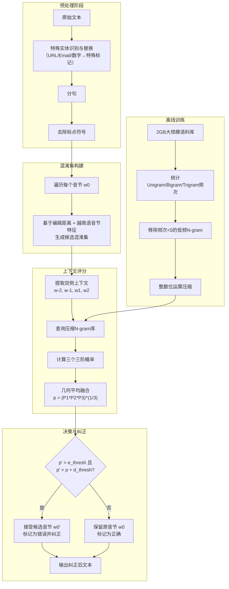

# Using Large N-gram for Vietnamese Spell Checking

---
## **作者信息**

| 作者 | 机构 | 身份/背景 | 领域大牛认定 |
|------|------|----------|-------------|
| Nguyen Thi Xuan Huong | 越南国立大学（河内） | 研究者/讲师 | 越南本土NLP研究者，国际可见度有限 |
| Tran-Thai Dang | 越南国立大学（河内） | 研究者/讲师 | 同上 |
| The-Tung Nguyen | 越南国立大学（河内） | 研究者/讲师 | 同上 |
| Anh-Cuong Le | 越南国立大学（河内） | 通讯作者/资深学者 | **越南本土NLP领域资深研究者**，但非国际顶级会议常客/院士层级 |

## **团队相关信息：**

该团队是**越南国立大学（河内，VNU-Hanoi）旗下信息技术相关院系的研究组**，属于**纯学术型研究团队**（无工业界背景），由**本校讲师/教授带领研究生**完成。该团队长期从事越南语自然语言处理基础研究（拼写检查、语言模型等）。与前一篇笔记中Zalo的工业界团队不同，本团队更具**传统学术色彩**，方法上倾向于**统计N-gram与规则相结合**，而非深度学习方法。Anh-Cuong Le为越南国立大学资深学者，但整体团队在国际NLP顶级会议（ACL/EMNLP等）上鲜有发表记录，属于**区域性基础研究梯队**。

## **论文发表时间**

| 项目 | 具体日期 | 来源/说明 |
|------|----------|----------|
| 论文发表 | 2015 | 发表于**Springer LNCS（Lecture Notes in Computer Science）系列**会议论文集中（根据排版风格及项目编号QGTD.12.21推断） |

该论文为**2015年前后发表的会议论文**，处于**深度学习兴起前的统计NLP末期**（Word2vec刚提出，Transformer尚未诞生）。目前该论文被引量有限，属于**越南语NLP早期探索性工作**，已不是当前SOTA，但其**大规模N-gram + 双侧上下文**的思路在当时具有代表性。

## **摘要**

本文提出了一种**基于上下文的越南语拼写检查系统**，核心依赖**大规模N-gram语言模型**。为了应对大规模数据带来的存储压力，作者实现了**N-gram压缩编码方法**（将音节映射为整数，通过位运算压缩存储）。此外，系统**同时利用音节左侧和右侧的上下文**（而不仅仅是左侧）来提升检测与纠正性能。实验表明，该系统在越南语文本上取得了约**94%的F值**，且显著优于同期越南语拼写工具Copcon。

---

## 一、这篇论文讲了一个什么样的故事？

越南语拼写检查——**"用统计学的大炮，打规则系统的小鸟"**。

故事的起点是：越南语拼写检查领域在2012年前后**几乎没有像样的公开出版物**，已有的工具（如Copcon）要么基于有限的规则，要么是未公开的本科毕业论文，性能远不能满足实际需求。与此同时，英语、中文的拼写检查已经大量使用**上下文敏感的统计方法**（Winnow、N-gram等），效果显著。

于是作者的思路是：**把英语/中文的N-gram方法论搬到越南语上来，但做得更大、更全**——用2GB的大规模语料库训练N-gram（比此前越南语研究大一个数量级），同时把上下文窗口从"只看左边"扩展为**左右两侧各取2个音节**，让模型有更多"旁证"来判断一个词是否写错。

在这个过程中，作者还做了两件"额外功课"：一是**实证研究了语料库大小对性能的"饱和效应"**（发现1.5GB后性能不再显著提升），二是**设计了一套位运算压缩方案**，把N-gram存储从几十MB压缩到三分之一，让大模型在当时的普通机器上也能跑得动。

最终故事收束于：这套纯统计方法在越南语拼写检查上达到了**94%的F值**，并**显著战胜了当时的商用工具Copcon**，证明了"**大数据 + 双侧上下文**"在资源稀缺语言上的有效性。但同时也暴露了一个"甜蜜的烦恼"——这已经接近统计N-gram的天花板，需要更强大的模型（如后来Transformer）才能继续突破。

---

## 二、本文的核心思想和创新点

### 1. 核心思想

**"上下文即线索，统计即力量"**：拼写检查的本质不是一个孤立的"词典查错"问题，而是一个**上下文推理**问题。一个音节是否正确，取决于它**与周围音节的共现关系是否自然**。作者的核心假设是：**只要语料库足够大，N-gram统计就足以捕捉这种共现关系，无需额外的分词、词性标注或句法分析**。换句话说，"大力出奇迹"——用2GB语料砸出来的统计规律，胜过所有人工规则。

### 2. 关键创新点

1. **首次在越南语拼写检查中系统性地使用双侧上下文（2-半径窗口）**：即同时考虑 $w_{-2}, w_{-1}$（左侧）和 $w_1, w_2$（右侧），而非仅用左侧或单侧。通过**几何平均**融合三个三阶概率 $P(w_0|w_{-2},w_{-1})$、$P(w_0|w_{-1},w_1)$、$P(w_0|w_1,w_2)$，解决了5-gram数据稀疏问题。
2. **首次实证研究越南语N-gram拼写检查的"语料饱和效应"**：定量给出约**1.5GB**的语料阈值——超过此规模后性能不再显著提升，为后续研究提供了数据规模参考。
3. **整数位运算N-gram压缩方法**：将音节编码为2字节整数，通过位拼接将bigram压缩为4字节整数、trigram压缩为6字节整数，存储空间降至原来的**1/3**左右，在内存有限的机器上实现了大规模N-gram的加载。
4. **创新的双阈值决策机制（e_thresh + d_thresh）**：有效降低了专有名词（人名、地名）导致的**假阳性误报**，使FPR低至0.1%-0.2%。

---

## 三、方法是怎么实现的？(How does it work?)

### 1. 架构

本系统采用**基于混淆集 + N-gram上下文评分的两阶段纠正架构**，整体流程如下图所示：



**图注**：参考论文 **Figure 1（系统架构）** 及 **第3节（方法）** 综合绘制。离线训练部分（灰色虚线框内）与在线推理部分（上方主流程）分离，系统启动时预先加载压缩后的N-gram索引。

### 2. 关键算法

**算法流程（伪代码）**：

```
输入: 原始句子 S = [s1, s2, ..., sN]
输出: 纠正后句子 S'

1. 预处理:
   S = replace_special_entities(S)   // URL, Email, 数字 → 特殊标记
   S = split_sentences(S)
   S = remove_punctuations(S)

2. 加载压缩N-gram索引（离线已构建）
   trigram_prob = load_compressed_ngram()

3. For 每个位置 i 的音节 w0 = S[i]:
   // 构建混淆集
   confusion_set = generate_candidates(w0, edit_distance=1~2, vietnamese_rules)
   
   // 如果混淆集为空，跳过（该音节无法纠正）
   If confusion_set is empty: continue
   
   // 提取双侧上下文
   w_2 = S[i-2] if i-2>=0 else "<S>"
   w_1 = S[i-1] if i-1>=0 else "<S>"
   w1  = S[i+1] if i+1<N  else "</S>"
   w2  = S[i+2] if i+2<N  else "</S>"
   
   // 计算原音节的上下文得分
   p_original = geometric_mean(
       trigram_prob(w_2, w_1, w0),   // 左侧2阶
       trigram_prob(w_1, w0, w1),    // 跨两侧
       trigram_prob(w0, w1, w2)      // 右侧2阶
   )
   
   // 对混淆集中每个候选计算得分
   best_candidate = None
   best_score = -inf
   For each w' in confusion_set:
       p_candidate = geometric_mean(
           trigram_prob(w_2, w_1, w'),
           trigram_prob(w_1, w', w1),
           trigram_prob(w', w1, w2)
       )
       // 双阈值决策
       If p_candidate > e_thresh AND p_candidate > p_original + d_thresh:
           If p_candidate > best_score:
               best_score = p_candidate
               best_candidate = w'
   
   // 纠正
   If best_candidate is not None:
       S'[i] = best_candidate
   Else:
       S'[i] = w0

4. 返回 S'
```

### 3. 关键公式

**（1）双侧上下文条件概率的分解（几何平均）**

由于5-gram数据极度稀疏，作者将5元条件概率 $P(w_0 | w_{-2}, w_{-1}, w_1, w_2)$ 分解为**三个三阶概率的几何平均**：

$$P(w_0 | w_{-2}, w_{-1}, w_1, w_2) \approx \sqrt[3]{
P(w_0 | w_{-2}, w_{-1}) \cdot P(w_0 | w_{-1}, w_1) \cdot P(w_0 | w_1, w_2)
}$$

其中：
- $P(w_0 | w_{-2}, w_{-1})$：利用左侧两个音节的**向后预测**；
- $P(w_0 | w_{-1}, w_1)$：利用左右各一个音节的**双向约束**（最具区分力）；
- $P(w_0 | w_1, w_2)$：利用右侧两个音节的**向前预测**。

选择几何平均而非算术平均，是因为**专有名词（人名/地名）会严重削弱部分上下文链接**，几何平均对这些"弱链接"更鲁棒（任一概率趋近于0，几何平均也趋近于0，有效惩罚不合理候选）。

**（2）双阈值决策准则**

候选音节 $w_0'$ 被接受为纠正结果，当且仅当**同时满足两个不等式**：

$$\begin{cases}
p' > e\_thresh \\
p' > p + d\_thresh
\end{cases}$$

- **$e\_thresh$（错误阈值）**：候选词的上下文得分必须高于一个绝对下限。防止将本已合理的音节（但得分较低，如出现在生僻上下文中）误判为错误，**专有名词防御层**。
- **$d\_thresh$（差异阈值）**：候选词必须比原词"好"得足够多（至少高出 $d\_thresh$）。防止在统计噪声范围内做无意义的改动，**假阳性防御层**。

两个阈值通过**开发集（Development Set）** 调参确定。

**（3）N-gram概率计算与平滑**

三阶概率通过**频率计数 + 平滑**计算：

$$P(w_i | w_{i-2}, w_{i-1}) = \frac{\text{count}(w_{i-2}, w_{i-1}, w_i) + \alpha}{\text{count}(w_{i-2}, w_{i-1}) + \alpha \cdot V}$$

其中 $V$ 为词表大小（~6800音节），$\alpha$ 为平滑参数（文中隐含使用类Good-Turning或Kneser-Ney的简化版）。

**（4）压缩编码（位运算）**

Bigram编码示例：

```c
int x = syllables[0];       // 第一个音节编号 (0~6800, 占2字节)
x = x << 16;                // 左移16位, 占高2字节
x = x | syllables[1];       // 按位或, 拼入低2字节
// 结果: 一个4字节整数完整表示一个bigram
```

Trigram需6字节（3个音节 × 2字节），可通过**64位整数（8字节）** 存储，浪费2字节但简化操作。

---

## 四、实验效果 (Experimental Results)

### 1. 实验设置

| 配置项 | 详情 |
|--------|------|
| 训练数据 | 2GB越南语文本（维基百科、dantri.com.vn、vnExpress.net），涵盖数学、物理、文学、历史、经济、体育、法律、娱乐等多元主题 |
| 数据清洗 | 移除频次 < 5 的低频N-gram |
| 音节词典大小 | ~6,800个越南语音节 |
| 测试集1 | 2,500句（人工检查无错误后**人工注入错误**，用于语料规模实验和上下文消融实验） |
| 测试集2 | 632句（**真实错误**，从互联网收集并人工标注，用于与Copcon对比） |
| 对比基线 | Copcon 5.0.3 beta 1（越南语商用拼写工具） |
| 评估指标 | DP（检测精确率）、DR（检测召回率）、CP（纠正精确率）、DF（检测F值）、FPR（假阳性率） |

### 2. 主要结果

**结果1：N-gram压缩效果（Table 1）**

| N-gram类型 | 元素数量 | 压缩前大小 | 压缩后大小 | 压缩比 |
|-----------|---------|-----------|-----------|--------|
| Unigram | 6,776 | 7.9 KB | 13.55 KB | -（微增，因编码开销） |
| Bigram | 1,208,943 | 15.6 MB | **4.6 MB** | **3.39×** |
| Trigram | 4,886,364 | 48 MB | **28 MB** | **1.71×** |

> 压缩对bigram效果最显著（降为1/3），trigram也有明显节省，使得大规模N-gram在普通内存环境下可用。

**结果2：语料库规模对性能的影响（Figure 2）**

- **核心发现**：检测F值随语料规模增大而上升，但在**约1.5GB后进入饱和平台**，性能不再显著提升。
- **启示**：对于越南语N-gram拼写检查，**1.5GB语料已足够**，进一步增加数据边际收益递减——这是当时越南语NLP研究中首次给出定量证据。

**结果3：不同上下文窗口的性能对比（Table 2）**

| 上下文 | DP | DR | CP | **DF** | FPR |
|--------|-----|-----|-----|--------|-----|
| w-2, w-1（仅左侧远） | 89.42% | 52.22% | 97.31% | 65.93% | 0.12% |
| **w-1, w1（左右各一）** | 94.04% | 91.53% | 98.26% | **92.76%** | 0.11% |
| w1, w2（仅右侧远） | 93.83% | 73.63% | 96.79% | 82.51% | 0.09% |
| **w-2,w-1,w1,w2（双侧完整）** | **94.68%** | **94.26%** | **99.32%** | **94.46%** | 0.10% |

**关键洞察**：
- **左右各1个音节（$w_{-1}, w_1$）已经很强**（F=92.76%），比纯左侧（65.93%）提升巨大，说明**双向上下文至关重要**。
- **扩展到2半径窗口**进一步提升至94.46%，但提升幅度小于从"左侧"到"双向"的跃升。
- **FPR极低**（0.1%左右），证明双阈值机制有效抑制了假阳性。

**结果4：与Copcon商用工具对比（Table 3）**

| 系统 | DP | DR | CP | DF | FPR |
|------|-----|-----|-----|-----|-----|
| **Our System** | **92.62%** | **91.12%** | **95.45%** | **91.86%** | 0.20% |
| Copcon 5.0.3 beta 1 | 80.8% | 77.6% | 87.5% | 79.2% | **0%** |

> **结论**：本系统在检测精确率（+11.82%）、召回率（+13.52%）、纠正精确率（+7.95%）、F值（+12.66%）上全面大幅超越Copcon，证明了**统计大模型相对规则系统的碾压性优势**。Copcon的FPR=0%可能源于其极其保守的策略（宁可漏检也不误报），但代价是召回率严重不足。

**实验部分总结**：
本文通过**语料规模实验、上下文消融实验、与商用系统对比实验**三组实证，系统性地证明了：**（1）大规模语料 + 双侧上下文**在越南语拼写检查上效果显著，F值达94%；**（2）1.5GB语料是性能饱和点**；**（3）该系统大幅超越当时越南语商用工具Copcon**，是当时该领域公开报道的最佳结果之一。

---

## 五、优点与局限性

### ✅ 1. 优点

| 方面 | 具体贡献 |
|------|----------|
| **方法简洁高效** | 仅依赖N-gram统计，**无需分词、词性标注、句法分析等复杂NLP流水线**，避免了越南语分词不准确带来的错误传播 |
| **大规模语料实证** | 首次定量给出越南语N-gram拼写检查的**语料饱和曲线**（1.5GB阈值），为后续研究提供了数据规模参考 |
| **双侧上下文创新** | 系统性地比较了左/右/双侧上下文的贡献，证明**双向信息对拼写纠正至关重要**，这一洞察至今仍有参考价值 |
| **工程落地意识** | 设计了**整数位运算压缩**方案，在内存受限环境下实现了大型N-gram模型的工业级部署 |
| **极低的假阳性率** | FPR仅0.1%-0.2%，意味着系统几乎不会"把对的改错"——这在实际产品中比"查全率"更重要（用户最讨厌误报） |
| **对比实验充分** | 与商用Copcon工具在真实错误测试集上对比，说服力强 |

### ⚠️ 2. 局限性（研究边界与待解问题）

| 局限 | 说明 |
|------|------|
| **词表固定（6,800音节）** | 系统仅依赖预定义的越南语音节词典，**无法处理新词、外来语、网络流行语**（如"trendy"、"selfie"等），OOV问题严重 |
| **无法处理分词边界错误** | 越南语存在**复合词（多音节词）**，但系统以**单音节**为基本单位，无法处理"合写/分写错误"（如"khong"→"không"这种跨音节省略问题） |
| **依赖人工注入错误测试** | 实验1和2使用**人工生成错误**的测试集，可能与真实错误分布存在偏差（尽管实验3使用了真实错误测试集） |
| **统计模型的固有瓶颈** | N-gram只能捕获**固定窗口内**的上下文依赖，**长距离语义依赖**（如跨句指代、段落主题）完全无法利用 |
| **几何平均的近似性** | 用三个三阶概率的几何平均近似五阶概率，虽有工程合理性，但**理论基础不坚实**（未证明该分解的无偏性或一致性） |
| **缺乏公开数据和代码** | 论文未提供公开的数据集和代码，**结果不可复现**，限制了该工作在学术社区的影响力 |
| **已被深度学习超越** | 该工作在2013年是有竞争力的，但在2020年代，基于Transformer/预训练语言模型的方法（如第一篇笔记中的分层Transformer）已将该F值从94%推升至接近100%，本文方法现已过时 |

---

## 六、其他

### 第一性原理

**拼写检查的本质是"从有损观测中恢复最大后验估计"——贝叶斯决策。**

将拼写检查建模为**噪声信道（Noisy Channel）问题**：

给定观测到的错误文本 $X = [x_1, x_2, ..., x_N]$，目标是找到最可能的正确文本 $Y = [y_1, y_2, ..., y_N]$，使得后验概率最大化：

$$\hat{Y} = \arg\max_{Y} P(Y | X) \propto \arg\max_{Y} P(X | Y) \cdot P(Y)$$

其中：
- **$P(Y)$（语言先验/Language Prior）**：什么样的音节序列在越南语中是"自然的"？——这正是**N-gram模型建模的对象**。通过大规模语料统计出的共现频率，近似刻画了越南语的内在语法和惯用法。
- **$P(X | Y)$（错误生成模型/Error Generation Model）**：给定正确文本 $Y$，它有多大可能被误写为 $X$？——这对应**混淆集（Confusion Set）** 的构建，基于编辑距离和越南语特定错误规则（如声调混淆、d/gi/r混淆等）。

本文的**第一性创新**在于：**用大规模的 $P(Y)$（N-gram）来驱动拼写检查，而非依赖人工规则**。在贝叶斯框架下，当 $P(X|Y)$ 固定（混淆集已定）时，**语料越大、N-gram估计越精确，$P(Y)$ 越逼近真实语言分布**，拼写纠正性能也就越优。这也解释了为什么语料从0增长到1.5GB时性能持续上升（更准的 $P(Y)$），而超过1.5GB后饱和（$P(Y)$ 已经足够逼近真实分布，边际信息增益趋近于零）。

此外，本文的**双侧上下文**本质上是在扩展N-gram的**条件域**——从 $P(y_i | y_{i-1})$ 扩展到 $P(y_i | y_{i-2}, y_{i-1}, y_{i+1}, y_{i+2})$，即在贝叶斯框架下**利用了更多观测信息**来推断隐变量 $y_i$，从而降低不确定性、提升决策准确率。

### 领域空白

**该论文试图填补的三个"坑"：**

1. **越南语拼写检查缺乏公开的学术出版物**：作者在文献综述中指出，此前越南语拼写检查研究大多停留在**本科毕业论文**（如Nguyen Duc Hai 1999、Nguyen Thai Ngoc Duy 2004、Nguyen Huu Tien Quang 2012），没有经过同行评议的正式会议/期刊论文，也没有公开可复现的系统。本文是**较早将该问题以正式学术论文形式发表的尝试之一**。

2. **已有方法未充分利用大规模上下文**：在本文之前，越南语拼写检查要么基于**句法规则**（1999年的工作），要么基于**词网络**（2004年），要么仅使用**左侧单边上下文**（2012年Quang的工作）。本文首次系统性地**定量比较了不同上下文窗口的贡献**，并证明**双侧上下文的巨大价值**——这是对越南语拼写检查方法论的重要补充。

3. **缺乏对"语料规模—性能"关系的量化认知**：此前N-gram方法的应用者往往"有多少数据用多少数据"，但没人知道**数据多到什么时候就不再有用了**。本文的**1.5GB饱和曲线**填补了这一认知空白，为后续研究者提供了一个实用的数据规模参考点——这在计算资源有限的2013年尤其有实践意义。

**一句话总结**：这是**越南语N-gram拼写检查的"基准性工作"**——它用扎实的实验数据证明了统计方法的有效性，揭示了语料规模和上下文窗口两个关键维度的量化规律，但受限于年代（2013年）和方法论（统计N-gram），其技术路线已被后续深度学习浪潮全面超越。今日看来，本文更大的贡献在于**实证精神**和**对数据规模效应的先见性关注**，而非方法本身的前瞻性。


---

> 本笔记由 Deepseek AI 生成