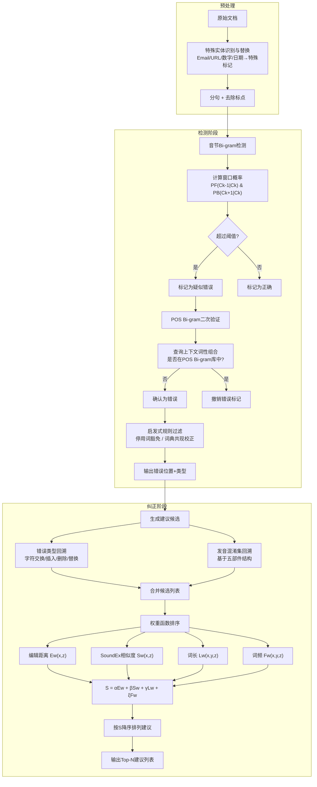

# Vietnamese Spelling Detection and Correction using Bi-gram, Minimum Edit Distance, SoundEx Algorithms with Some Additional Heuristics

---
## **作者信息**

| 作者 | 机构 | 身份/背景 | 领域大牛认定 |
|------|------|----------|-------------|
| Phuong H. Nguyen | 河内理工大学 软件工程系 | 本科生/研究生 | 无国际学术影响力 |
| Thuan D. Ngo | 河内理工大学 软件工程系 | 本科生/研究生 | 同上 |
| Dung A. Phan | 河内理工大学 软件工程系 | 本科生/研究生 | 同上 |
| Thu P. T. Dinh | 河内理工大学 软件工程系 | 讲师/研究员 | 越南语NLP早期研究者 |
| Thang Q. Huynh | 河内理工大学 软件工程系 | 副教授/通讯作者 | **越南本土NLP学者**，主要研究方向为越南语语法解析、拼写检查 |

## **团队相关信息：**

该团队是**河内理工大学（Hanoi University of Technology，现为河内百科大学/HUST）软件工程系的越南语NLP研究组**。河内理工大学是越南工科领域的顶尖学府（相当于"越南的清华大学"），该团队由**Thang Q. Huynh副教授带领本科生团队**完成。团队此前在越南语**句法解析（CYK算法）和POS标注**方面已有积累[15,16]，是越南本土最早系统研究NLP问题的学术团队之一。但该团队**缺乏国际顶级会议发表记录**，论文主要发表于越南国内期刊或区域性会议，在国际NLP社区基本无知名度。此论文由**本科毕业论文级别的团队**完成（四名作者中三人使用gmail/雅虎邮箱，无机构域名），研究风格偏**工程启发式**，而非严格的理论建模。

## **论文发表时间**

| 项目 | 具体日期 | 来源/说明 |
|------|----------|----------|
| 论文发表 | **2008年** | **IEEE RIVF 2008**（International Conference on Research, Innovation and Vision for the Future in Computing and Communication Technologies）正式发表 |

该论文为**2008年发表**，当时**深度学习尚未兴起**（AlexNet 2012年才出现），NLP领域的主流方法为**统计N-gram + 规则/启发式**。该论文是**越南语拼写检查领域最早的系统性学术发表之一**，标志着该问题在越南学术界的正式起步。

## **摘要**

本文提出了一种**基于越南语自身特征**的拼写检查新方法。系统分为**检测**和**纠正**两个阶段。在检测阶段，采用**音节Bi-gram**结合**词性（POS）Bi-gram**来发现疑似错误音节。在纠正阶段，基于**最小编辑距离（Minimum Edit Distance）** 和**SoundEx算法**，结合若干启发式规则，构建了一个**权重函数**来评估候选建议的相关性。训练语料和测试集均采集自**电子报纸**。实验结果表明该方法在越南语文本上的有效性。

---

## 一、这篇论文讲了一个什么样的故事？

**"用最小的资源，做最大的事"——越南语拼写检查从零到一的艰难起步。**

将时间拨回到2008年。此时的越南语NLP研究条件极其匮乏：

- **没有大规模标注语料**（POS标注词仅37,232个，不足词典70,000词的60%）；
- **没有统一的分词标准**（越南语词边界模糊，分词本身就是难题）；
- **没有完整的语法规则集**；
- **连学术界和工业界都没有一套公开的评测标准**。

在这样的"一穷二白"条件下，河内理工大学的团队接下了这个难题。他们不像后来者（VinAI）那样有预训练语言模型可用，也不像Zalo团队那样有海量用户数据支撑——他们能依赖的只有：**一本70,000词的词典、一套POS标注集、几千篇Vnexpress电子报文章，以及若干人工编写的启发式规则**。

团队的核心思路是：**用算法"借力"，用启发式"补拙"**。检测阶段用Bi-gram统计（从语料中"借"共现概率）结合POS Bi-gram（"借"词性序列规则）；纠正阶段用编辑距离（"借"字符串相似度）和SoundEx（"借"越南语发音相似性），再加一堆人工设计的启发式规则（词长、词频、音节结构）作为"补丁"来缝合各种边界情况。

最终，这个"用草稿纸搭出来的系统"在312句测试集上达到了**约92%的检测精度**和**约86%的纠正精度**——虽然远低于同期英语系统的96%，但与中文（70%）、日语（90%）的成绩可比，证明了：**即便资源极度稀缺，精心设计的启发式组合依然能够搭建出可用的越南语拼写检查系统**。

这篇论文是**"越南语NPG的拓荒者"**——它设立了问题框架、积累了基础数据、验证了方法可行性，为后续十年越南语拼写检查研究（从N-gram到Transformer再到预训练模型）铺平了道路。

---

## 二、本文的核心思想和创新点

### 1. 核心思想

**"用两阶段流水线 + 多维度启发式投票，在标注数据极度匮乏的条件下逼近可用性能。"**

系统设计遵循"**分而治之**"的原则：
- **检测阶段**：非词错误靠词典（简单），真词错误靠**Bi-gram统计 + POS序列约束 + 越南语专属启发式**（复杂）；
- **纠正阶段**：建议生成靠**错误类型回溯**（字符交换、插入、删除、替换），建议排序靠**多因子权重函数**（编辑距离 + 发音相似性 + 词长 + 词频）。

核心哲学是：**没有一个单一算法能解决所有问题，组合多个弱信号（weak signals）才能形成强决策（strong decision）**。

### 2. 关键创新点

1. **音节Bi-gram + POS Bi-gram的双层检测机制**：先由音节Bi-gram筛选可疑位置，再由POS Bi-gram（上下文词性序列）二次验证——用POS信息弥补音节Bi-gram数据稀疏的问题；
2. **针对越南语特征定制的编辑距离权重**：不同字符的增/删/替换操作赋予不同权重（元音/辅音、有声调/无声调），比标准编辑距离更贴合越南语拼写错误的真实分布；
3. **首次将SoundEx算法适配至越南语**：利用越南语音节的**五部件结构**（声母 + 介音 + 主元音 + 韵尾 + 声调）构建发音混淆集，处理**方言语境下的读音混淆错误**（如 s/x、tr/ch、d/gi/r）；
4. **多因子权重函数的设计**：将编辑距离、SoundEx相似度、词长、词频四个因子线性加权组合，**权重可适配不同领域/文档类型**，体现了"从规则固定到参数可调"的工程思想；
5. **利用词典内部共现信息补充N-gram统计**：越南语词典（70,000词）本身就是音节共现概率的知识库，用此弥补训练语料稀疏的问题——这是对越南语"词由音节构成"特性的巧妙利用。

---

## 三、方法是怎么实现的？(How does it work?)

### 1. 架构

本系统采用**检测 + 纠正的两阶段流水线架构**，检测阶段输出错误位置和类型，纠正阶段为每个错误生成排序后的建议列表。整体流程如下图所示：



**图注**：参考论文 **Figure 1（总体模型）** 及 **Figure 2（纠正模型）** 综合绘制。检测阶段采用"音节Bi-gram → POS Bi-gram → 启发式过滤"的三层验证机制；纠正阶段采用"错误回溯生成 → 多因子加权排序"的两步流程。

### 2. 关键算法

**检测阶段算法（音节Bi-gram + POS Bi-gram）**：

```
输入: 句子 S = [C1, C2, ..., Cn]（音节序列）
输出: 错误位置列表 ErrorPositions

// === 阶段1: 音节Bi-gram ===
For k = 1 to n:
    提取窗口 WIN = {Ck-1, Ck, Ck+1}（边界补特殊标记）
    计算 PF = P(Ck-1 | Ck)  // 左→右概率
    计算 PB = P(Ck+1 | Ck)  // 右→左概率
    If -log(PF) > ThresholdF AND -log(PB) > ThresholdB:
        标记 Ck 为"疑似错误"
    Else:
        标记 Ck 为"正确"

// === 阶段2: POS Bi-gram二次验证 ===
For 每个疑似错误位置 k:
    构建上下文 {S_front}：从前一句开端到 Ck-1 的所有可能构词
    构建上下文 {S_back}：从 Ck+1 到句末的所有可能构词
    查询Ck的候选POS集合 {POS_C}
    查询{S_front}中所有音节的POS集合 {POS_SF}
    查询{S_back}中所有音节的POS集合 {POS_SB}
    Exists = False
    For each TB in {POS_SB}:
        For each T in {POS_C}:
            For each TF in {POS_SF}:
                If 三元组 (TB, T, TF) 存在于POS Bi-gram库:
                    Exists = True
                    Break
    If Not Exists:
        确认 Ck 为错误
    Else:
        撤销错误标记

// === 阶段3: 启发式修正 ===
If Ck 在停用词列表:
    撤销错误标记
If Ck 能与相邻音节组成词典中的复合词:
    撤销错误标记

Return ErrorPositions
```

**纠正阶段算法（建议生成 + 权重排序）**：

```
输入: 错误音节 x, 上下文句子 y, 错误类型 type
输出: 排序后的建议候选列表

// === 步骤1: 生成候选 ===
Candidates = []
// 1a. 基于错误类型回溯
Switch type:
    Case "字符交换": 生成交换相邻字符的所有变体
    Case "字符插入": 生成删除一个字符的所有变体
    Case "字符删除": 生成插入每个音节的变体
    Case "字符替换": 生成键盘近邻替换的所有变体
// 1b. 基于发音混淆集（Hoang Phe词典）
For 每个与x在五部件上易混淆的音节 z:
    Add z to Candidates
// 去重，过滤不在音节词典中的候选

// === 步骤2: 权重排序 ===
For 每个候选 z in Candidates:
    Ew = edit_distance_weighted(x, z)  // 带权编辑距离
    Sw = SoundEx_match(x, z)           // 0/1发音相似
    Lw = max_word_length(y, z)         // 替换后可构成的最长词
    Fw = word_frequency(y, z)          // 替换后词在语料中的频率
    S = α*Ew + β*Sw + γ*Lw + ξ*Fw
    记录 (z, S)

Sort Candidates by S descending
Return Top-10 Candidates
```

### 3. 关键公式

**（1）音节Bi-gram检测的双阈值准则**

对窗口中的中心音节 \(C_k\)，分别计算两个方向的负对数概率：

$$\text{Score}_F = -\log P(C_{k-1} | C_k)$$
$$\text{Score}_B = -\log P(C_{k+1} | C_k)$$

判定为错误当且仅当：

$$\text{Score}_F > \theta_F \quad \text{且} \quad \text{Score}_B > \theta_B$$

通过实验确定的阈值：\(\theta_F = 4.68\)，\(\theta_B = 5.23\)。

**（2）POS Bi-gram三元组存在性验证**

定义一个音节 \(C\) 为错误，如果对于其所有可能的词性组合 \(T \in \text{POS}(C)\)，以及左上下文可能的词性集合 \(\text{POS}(S_F)\) 和右上下文可能的词性集合 \(\text{POS}(S_B)\)，三元组 \((T_B, T, T_F)\) **不存在于**POS Bi-gram库中：

$$C \text{ is error} \iff \forall T_B \in \text{POS}(S_B), T \in \text{POS}(C), T_F \in \text{POS}(S_F): (T_B, T, T_F) \notin \text{BiGram}_{POS}$$

**（3）纠正阶段权重函数**

$$\begin{aligned}
S(x, y, z) = &\alpha \cdot E_w(x, z) \\
&+ \beta \cdot S_w(x, z) \\
&+ \gamma \cdot L_w(x, y, z) \\
&+ \xi \cdot F_w(x, y, z)
\end{aligned}$$

其中：
- \(x\)：检测出的错误音节；
- \(y\)：错误所在的句子；
- \(z\)：建议候选音节；
- \(E_w(x, z)\)：带权编辑距离（元音/辅音、有声调/无声调权重不同）；
- \(S_w(x, z) \in \{0, 1\}\)：发音相似度（1=在SoundEx混淆集中，0=不在）；
- \(L_w(x, y, z)\)：替换后能构建的**最大词长**（鼓励形成多音节词）；
- \(F_w(x, y, z)\)：替换后形成词在语料中的出现频率；
- \((\alpha, \beta, \gamma, \xi)\)：实验确定的权重系数 = **(3, 5, 7, 1)**。

**（4）编辑距离带权决策表**

| 条件 | 添加/删除权重 | 替换权重 |
|------|-------------|---------|
| 元音 ↔ 元音（有声调） | 1.5 | 1 |
| 元音 ↔ 元音（无声调） | 1 | 1 |
| 辅音 ↔ 辅音（相近键盘） | 1 | 0.5 |
| 辅音 ↔ 辅音（不相近） | 2 | 2 |

---

## 四、实验效果 (Experimental Results)

### 1. 实验设置

| 配置项 | 详情 |
|--------|------|
| 音节词典 | 6,685个越南语音节（基于Hoàng Phế词典[17]） |
| 词汇词典 | 70,000个越南语词（基于[16]） |
| POS词典 | 37,232个带有POS标注的词[15] |
| 训练数据 | 9篇POS标注文档 + 1,000篇分词&POS标注文章 + **4,000篇Vnexpress电子报文章** |
| 测试数据 | 50篇完全人工校对文章 + **312个错误句子（400个已知错误：300个非词错误 + 100个真词错误）** |
| 评估指标 | 精确率（Precision）、召回率（Recall）、F值 |
| 评测标准 | 建议列表中Top-10中包含正确答案即为"纠正成功" |

### 2. 主要结果

**检测阶段结果（Table VI）**：

| 测试 | 句子数 | 实际错误数 | 检测到错误数 | 正确检测数 | 召回率 | 精确率 |
|------|--------|-----------|-------------|-----------|--------|--------|
| 1 | 400 | 523 | 693 | 479 | 0.92 | 0.69 |
| 2 | 400 | 497 | 632 | 453 | 0.91 | 0.72 |
| 3 | 400 | 511 | 620 | 454 | 0.89 | 0.73 |
| 4 | 400 | 539 | 688 | 495 | 0.92 | 0.72 |
| 5 | 400 | 567 | 734 | 514 | 0.91 | 0.70 |

**检测阶段核心结论**：
- **召回率表现优异（89-92%）**：绝大部分真实错误都能被检测到；
- **精确率相对偏低（69-73%）**：约30%的"检测到的错误"实际上是误报（假阳性）；
- 主要原因是检测阶段同时处理**非词错误和真词错误**，而非词错误会破坏音节序列的平滑性，导致大量疑似位置被标记；
- 作者建议实践中**先检测并纠正非词错误，再检测真词错误**，以提升精确率。

**纠正阶段结果（Table VII）**：

| 测试 | 句子数 | 错误数 | 正确纠正数 | 精确率 |
|------|--------|--------|-----------|--------|
| 1 | 20 | 59 | 51 | 86% |
| 2 | 30 | 96 | 84 | 87% |
| 3 | 50 | 153 | 132 | 86% |
| 4 | 100 | 322 | 288 | 89% |
| 5 | 200 | 613 | 546 | 89% |
| 6 | 300 | 959 | 834 | 86% |
| 7 | 400 | 1,286 | 1,106 | 86% |
| 8 | 600 | 1,873 | 1,580 | 84% |
| 9 | 800 | 2,498 | 2,188 | 88% |
| 10 | 1,000 | 3,092 | 2,678 | 86% |

**纠正阶段核心结论**：
- **纠正精确率稳定在84-89%**，表现稳定，不受句子数/错误数影响；
- 与同期其他语言对比：英语96%[12]、日语90%[8,9]、泰语90-97%[11]、中文70%[14]——**越南语结果与同属亚洲的日语/泰语相当，优于中文**；
- 作者认为在**训练语料不完整、POS数据稀缺**的条件下，84-89%的精度已是可观成果，预期完整语料后可进一步提升。

### 3. 消融实验与关键发现

**关键发现**：

- **Bi-gram双阈值的最优组合**：经过网格搜索，\(\theta_F=4.68\)、\(\theta_B=5.23\) 取得最佳F值（图3-4）。两个阈值**相互依赖**——过高则漏检过多，过低则误报激增。
- **权重函数的最佳权重系数**：\((\alpha, \beta, \gamma, \xi) = (3, 5, 7, 1)\)。**词长（Lw）权重最高（7）**，说明越南语复合词现象对纠错排序影响最大；**词频（Fw）权重最低（1）**，说明在训练语料不足时词频统计不可靠，不应过度依赖。
- **检测与纠正的解耦必要性**：实验证明，**非词错误存在时，真词错误检测精度大幅下降**，因为非词错误破坏了N-gram统计的连续性。作者建议实际系统采用**两阶段检测**（先非词后真词），这一结论对后续所有越南语拼写检查系统设计具有指导意义。

**实验部分总结**：
本文在**数据极度匮乏**的条件下完成了检测和纠正两大模块的实证验证，虽然测试集规模小（仅312句）、精确率偏低（69-73%），但**首次建立了越南语拼写检查的完整实验框架**——包括训练/测试数据集、评估指标、阈值调优方法，为后续研究奠定了方法论基础。

---

## 五、优点与局限性

### ✅ 1. 优点

| 方面 | 具体贡献 |
|------|----------|
| **开创性地位** | **四篇笔记中最早（2008年）**，是越南语拼写检查领域**最早的系统性学术发表之一**，为后续所有研究设定了问题框架和评估范式 |
| **资源利用率极高** | 在**POS标注词不足词典60%、无大规模语料、无统一语法规则**的条件下，通过**启发式组合**实现了可用性能，体现了强烈的"工程匠心" |
| **越南语特化设计深入** | 将越南语语言学特征融入算法的每个环节——**五部件音节结构（声母/介音/元音/韵尾/声调）、复合词构词规则、六种声调混淆模式**——比后来更"通用"的深度学习方法更贴近语言本质 |
| **SoundEx适配越南语** | 首次将发音编码算法应用到越南语环境，构建了**方言语境下拼写错误**的针对性解决方案，这一设计在此后多年仍被引用 |
| **模块化设计思想** | 检测与纠正分离、多因子权重可调、不同模块可独立替换/优化，体现了良好的工程架构 |
| **开源数据集意识** | 虽然数据集未公开，但作者详细报告了训练数据来源（Vnexpress 4,000篇文章）和词典资源，为后续研究者复现提供了基础 |

### ⚠️ 2. 局限性（研究边界与待解问题）

| 局限 | 说明 |
|------|------|
| **数据集规模过小** | 测试集仅312句（400个错误），**远低于深度学习时代的标准**（第一篇笔记的VSEC有9,341句，第三篇训练集达1.45亿句）。统计显著性存疑，且无法反映真实场景的错误分布 |
| **检测精确率偏低（~70%）** | 30%的误报率意味着用户每看到10个"错误"标记，就有3个是冤枉的——**严重影响用户体验**。同期英语系统检测精度通常>95% |
| **依赖人工构造的启发式规则** | 系统大量依赖**手写规则**（键盘近邻表、发音混淆集、停用词列表），**规则覆盖度有限**，无法处理未预见到的错误类型 |
| **真词错误处理能力薄弱** | 测试集中真词错误仅100个（占25%），且检测/纠正精度均未单独报告——**无法评估系统对"最难类型"的实际表现** |
| **POS数据依赖严重** | POS Bi-gram需要POS标注语料，但越南语POS标注本身准确率不高（论文[15]标注的37,232词准确率未报告），**错误传播效应**可能很大 |
| **无公开代码/数据** | 实验所用训练数据、测试集、词典均未公开，**结果无法复现**，后人也无法在其基础上直接改进 |
| **缺乏与已有系统的对比** | 实验仅报告本系统的绝对性能，**未与同期其他越南语拼写工具（如Copcon）进行对比**——第二篇笔记（2013年）后来做了这一对比，显示N-gram方法优于Copcon |
| **领域依赖性问题未解决** | 作者坦承Bi-gram性能**高度依赖于训练语料与输入文本的主题相关性**，但仅提出了"文本分类+领域适配"的改进方向，未在实验中验证 |

---

## 六、其他

### 第一性原理

**拼写检查的本质是在"词典约束"与"上下文约束"之间寻找最大后验——当数据不足时，用"领域知识"作为先验。** 从贝叶斯决策框架出发：

$$\hat{Y} = \arg\max_{Y} P(Y | X) \propto P(X | Y) \cdot P(Y)$$

- \(P(Y)\)（语言先验）：**音节Bi-gram + POS Bi-gram**。由于训练语料稀疏，\(P(Y)\)估计不准确（表现为数据稀疏、阈值难以设定）。因此引入**POS信息**作为额外的结构先验，缩小假设空间。
- \(P(X | Y)\)（错误生成模型）：**编辑距离 + SoundEx**。编辑距离建模"打字错误"的生成过程（键盘近邻、字符增删替换）；SoundEx建模"发音混淆错误"的生成过程（方言语调、声母混淆）。

**本文的第一性创新不在算法本身**（Bi-gram、编辑距离、SoundEx都是已有技术），而在于**针对越南语的特殊性，显式地将领域知识编码进先验分布的每个因子**：
- 用**越南语词典内部共现**弥补\(P(Y)\)的统计不足（因为越南语的词=音节组合，词典本身携带了音节共现信息）；
- 用**越南语音节五部件结构**构建SoundEx混淆集（不同语言发音错误模式不同）；
- 用**复合词最大词长**作为排序权重因子（越南语是单音节语言，但词由多音节构成，词长是重要信号）。

在数据极端稀缺的2008年，**"领域知识作为先验"是比"暴力统计"更现实的建模选择**。这种思路在后来的深度学习时代被暂时取代，但在Low-Resource NLP回暖的今天，重新获得了价值——用语言学知识弥补数据不足，正是当前"标注数据稀缺语言"研究的重要范式。

### 领域空白

**该论文试图填补的三个"坑"：**

1. **"越南语拼写检查缺乏学术研究"**：在2008年之前，越南语拼写检查的研究仅停留在**本科毕业论文阶段**[15,16]（作者自己的团队此前也仅发表过越南语句法解析的中文论文），无正式的国际会议/期刊发表。本文是**最早将该问题以英文论文形式在国际学术会议上公开发表的尝试**。

2. **"外来方法直接移植到越南语水土不服"**：英语的拼写检查方法（Winnow[12]、编辑距离）和中文的方法（N-gram[14]）都不能直接照搬到越南语——因为**越南语既有英文的字母拼写特征，又有中文的音节/词边界模糊特征**，属于混合型语言。本文首次系统性地设计了一套**"混血"方法**：用编辑距离处理字母级错误（借英语经验），用Bi-gram和POS处理音节级约束（借中文经验），同时用SoundEx处理发音混淆（越南语特有）。

3. **"缺乏基础数据和工具链"**：在2008年，越南语NLP连标准词典、POS标注集、分词工具都不成熟。本文在构建系统的同时，还**整理了6,685音节词典、70,000词词典、37,232词POS词典、4,000篇标注文章**——这些基础资源虽然不完美，但为后续所有越南语拼写检查研究提供了"起跑线"。

**一句话总结**：这是**越南语NLP的"石器时代"奠基之作**——它没有深度学习的算力、没有大规模语料、甚至没有标准评测集，但凭借对越南语语言特征的深刻理解和精巧的启发式设计，搭建了第一个"可工作"的越南语拼写检查系统。与前三篇笔记（2013年的N-gram规模化、2021年的Transformer工业化、2023年的预训练模型SOTA化）并置阅读，可以清晰地看到**越南语NLP十五年演进的技术光谱**：从规则启发式→统计N-gram→Transformer→预训练模型，从本科团队→学术团队→工业团队→顶级研究院，从几百句测试→几万句基准→百万级合成数据。这篇论文是这条演进之路的**原点**。