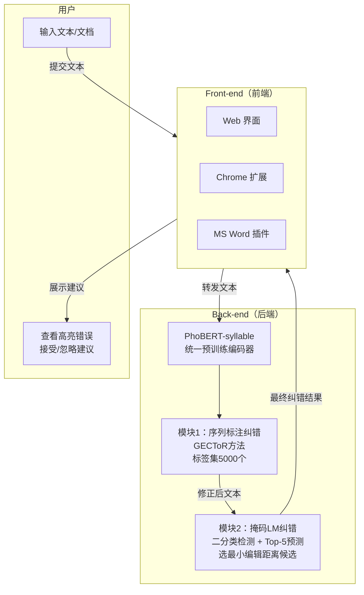

# A Vietnamese Spelling Correction System
---
## 作者信息
| 作者 | 机构 | 身份/背景 | 领域大牛认定 |
|------|------|-----------|-------------|
| Thien Hai Nguyen | VinAI Research | 研究员（NLP/MT方向，有INTERSPEECH发表） | 否 |
| Thinh Pham | VinAI Research | 研究员 | 否 |
| Khoi Minh Le | VinAI Research | 研究员 | 否 |
| Manh Luong | VinAI Research | 研究员（有INTERSPEECH发表） | 否 |
| Nguyen Luong Tran | VinAI Research | 研究员（BARTpho作者，INTERSPEECH发表） | 否 |
| Hieu Man | VinAI Research | 研究员 | 否 |
| Dang Minh Nguyen | VinAI Research | 研究员 | 否 |
| Tuan Anh Luu | VinAI Research | 研究员 | 否 |
| Thien Huu Nguyen | VinAI Research | 研究员 | 否 |
| **Hung Bui** | **VinAI Research** | **VinAI创始人/CEO，前Google DeepMind** | **是 — AI领域资深研究者** |
| **Dinh Phung** | **VinAI Research** | **VinAI研究总监，前Monash大学教授** | **是 — 机器学习领域资深学者** |
| **Dat Quoc Nguyen** | **VinAI Research** | **VinAI高级研究科学家，PhoBERT/BARTpho作者** | **是 — 越南NLP领域顶级研究者** |
## 团队相关信息
该团队来自 **VinAI Research（越南人工智能研究院）**，是越南最具影响力的AI研究机构之一。本文由 **11位作者** 完成，其中包括 **Hung Bui（VinAI创始人/前Google DeepMind）**、**Dinh Phung（研究总监/前Monash教授）** 和 **Dat Quoc Nguyen（PhoBERT/BARTpho原作者，越南NLP领域核心人物）** 三位资深学者。前8位作者（学生/初级研究员）为第一梯队执行者，后3位为学术指导。团队在越南NLP领域（特别是预训练语言模型PhoBERT、BARTpho系列）处于**绝对领军地位**。虽然三位资深作者在NLP领域具备较强的学术影响力，但均未达到"院士/ACM Fellow"级别，整体属于**国家顶级研究机构 + 有影响力的PI团队**。
## 论文发表时间
| 项目 | 具体日期 | 来源/说明 |
|------|---------|-----------|
| 发表会议 | IUI '23 Companion | ACM International Conference on Intelligent User Interfaces |
| 会议日期 | 2023年3月27-31日 | 悉尼，澳大利亚 |
| DOI | 10.1145/3581754.3584159 | ACM Digital Library |
| 论文长度 | 4页 | Companion track（系统演示短文） |

该论文于 **2023年3月在IUI '23 Companion（系统演示track）正式发表**，属于已发表的正式会议论文（非预印本）。

---

## 摘要

本文提出了一个全新的越南语拼写纠错系统。该系统是一个交互式写作助手，集成了先进的自然语言处理技术来（i）识别拼写错误和（ii）将错误替换为正确版本。据作者所知，这是**首个通过Web界面、Microsoft Word插件和Chrome扩展与用户交互的越南语拼写纠错工具**。系统在VSEC基准数据集上取得了新的SOTA性能，并通过人工评估验证了有效性。系统公开可访问：https://grammar.vinai.io/。

---
## 一、这篇论文讲了一个什么样的故事？

故事主线：**越南语拼写纠错是一个有真实需求但缺乏好工具的任务。** 越南语的书写特点（空格既分隔词也分隔音节）导致拼写错误定义在音节级别，现有的公开工具要么只有简陋的Web界面，要么（如MS Word内置拼写检查）只靠词典匹配而不考虑上下文。VinAI团队利用自家预训练的PhoBERT-syllable模型，构建了一个**前端+后端分离的完整系统**：前端提供Web/Chrome/Word三种交互方式，后端用序列标注+掩码语言模型两个模块做**流水线式纠错**。最后用自动评测（VSEC benchmark）和人工评测（11名独立评审员）双重验证，证明系统确实好用且准确。
本质上是**一篇典型的工业级系统演示论文（System Demo Paper）**：核心贡献不在算法创新，而在工程整合与用户体验打磨。

---

## 二、本文的核心思想和创新点
### 1. 核心思想
**"取长补短"的双模块流水线设计。** 序列标注模块擅长处理结构性的编辑操作（插入、删除、合并、拆分），但受限于5000个标签集，只能处理常见音节；掩码LM模块擅长处理语义错误和低频音节的拼写错误，但无法做结构性编辑。将两者串成流水线（序列标注输出 → 掩码LM输入），让两个模块互补，覆盖更全面的错误类型。
### 2. 关键创新点
1. **首个多平台交互的越南语拼写纠错系统**：同时支持Web、Chrome扩展、MS Word插件三种UI，这是越南语领域的首创。
2. **双模块流水线纠错架构**：GECToR式序列标注 + 掩码LM分类-预测流水线，利用PhoBERT-syllable作为统一的底层编码器，工程上简洁高效。
3. **大规模合成训练数据策略**：在145M句子的预训练语料上，对每句随机采样10%音节，施加多种策略生成错误变体，构建等价规模的纠错训练数据。
4. **双维度评估（自动+人工）**：不仅用VSEC benchmark做自动评测，还设计了11人的独立人工评审，评估"Good/Average/Bad"三级质量反馈。

---
## 三、方法是怎么实现的？(How does it work?)
### 1. 架构
该系统采用 **前端-后端分离架构**，后端由 **双模块流水线** 组成，整体流程如下：

**图注**：基于论文 Figure 1（系统总体架构）绘制。前端三种UI将用户文本发送到后端，后端两个模块以流水线方式依次处理：模块1先做序列标注式的结构性编辑（插入/删除/合并/拆分），输出结果再送入模块2做掩码LM式的语义级纠错（二分类判断是否拼错 → 掩码预测Top-5候选 → 编辑距离最小者当选）。
### 2. 关键算法
**模块1 — 序列标注纠错（GECToR方法）**：
- 将纠错任务建模为音节级别的序列标注问题
- 对每个输入token预测一个"变换标签"（保持/替换/删除/合并/拆分等）
- 标签集大小限制为5000（覆盖常见编辑操作）
- 在PhoBERT-syllable上进行fine-tuning
**模块2 — 掩码LM纠错**：
- Step 1：在冻结的PhoBERT-syllable编码器上加一个线性分类头，做二分类（正确/错误）
- Step 2：对预测为错误的token，用[MASK]替换，让PhoBERT-syllable预测Top-5候选
- Step 3：从Top-5中选择与原始错误token编辑距离最小的候选作为正确拼写
**合成数据生成策略**：
- 对预训练语料中每句，随机选10%音节
- 对每个选中音节，随机选择一种错误生成策略（如声调混淆、辅音替换等）
- 产出145M句规模的合成纠错训练数据
- 各模块在此数据上训练10个epoch
### 3. 关键公式
本文为系统演示论文，**没有引入新的数学公式或理论推导**。核心机制均为对已有方法的工程应用：
- 序列标注：标准交叉熵损失 + GECToR标签体系
- 掩码LM纠错：编辑距离（Levenshtein距离）作为候选排序准则
- 评估指标：Precision、Recall、F1、F0.5（标准NLP纠错评估指标）
---
## 四、实验效果 (Experimental Results)
### 1. 实验设置
| 维度 | 详情 |
|------|------|
| 自动评测数据集 | VSEC benchmark（9341条测试句） |
| 评估指标 | Precision / Recall / F1 / F0.5（检测和纠错两个维度） |
| 对比基线 | VSEC论文中的最佳模型 |
| 消融实验 | 仅序列标注模块 / 仅掩码LM模块 / 完整流水线 |
| 人工评测 | 11名独立评审员，每人准备20份文档（错误率<10%），段落级Good/Average/Bad评分 |
### 2. 主要结果
**自动评测（VSEC Benchmark）：**
| 模型 | 检测F1 | 检测F0.5 | 纠错F1 | 纠错F0.5 |
|------|--------|----------|--------|----------|
| VSEC（先前SOTA） | 0.868 | 0.905 | 0.815 | 0.849 |
| **本文系统（完整流水线）** | **0.901** | **0.923** | **0.875** | **0.896** |
| 仅序列标注模块 | 0.706 | 0.835 | 0.685 | 0.811 |
| 仅掩码LM模块 | 0.877 | 0.922 | 0.843 | 0.886 |
**核心结论**：
- 完整流水线在所有指标上**全面超越先前SOTA**，纠错F1从0.815提升至0.875（+6个百分点）
- **掩码LM模块单独表现优于序列标注模块**（纠错F1：0.843 vs 0.685），说明语义级纠错对越南语更重要
- 序列标注模块的**召回率极低**（检测Recall仅0.561），因为5000个标签集限制了覆盖范围
- 两个模块的**流水线组合带来了显著的互补增益**
**人工评测**：
- 75.6%段落被评为Good，12.7%为Average，11.7%为Bad
- 基于人工期望输出的Precision/Recall/F1/F0.5分别为80.6%/79.3%/79.9%/80.3%
### 3. 消融实验与关键发现
**关键发现**：
- 序列标注模块**高精度（0.952）但低召回（0.561）**，本质上是"宁可漏报也不误报"
- 掩码LM模块**精度和召回更均衡**，说明基于上下文语义判断比规则式标签更鲁棒
- 流水线组合在保持高精度的同时**大幅提升召回率**（检测Recall：0.561 → 0.868）
**实验部分总结**：本文通过自动评测（VSEC benchmark的完整对比+消融实验）和人工评测（11人220份文档），系统性地验证了双模块流水线架构的有效性。实验设计严谨但规模适中，符合系统演示论文的预期定位。
---
## 五、优点与局限性
### ✅ 1. 优点
- **工程完整性高**：从前端三种UI到后端双模块流水线，再到训练数据生成，构成完整的端到端系统，且已公开部署可用。
- **双模块互补设计合理**：序列标注处理结构性编辑 + 掩码LM处理语义纠错，分工明确、相互补充。
- **评估维度全面**：自动评测（标准benchmark）+ 人工评测（真实用户反馈），双重验证增强可信度。
- **工业实用性**：系统已在线运行，对越南语写作场景有真实价值。
- **预训练模型复用高效**：基于团队已有的PhoBERT生态（PhoBERT-syllable），避免了从零预训练的成本。
### ⚠️ 2. 局限性（研究边界与待解问题）
- **算法创新有限**：两个核心模块（GECToR + 掩码LM）均为已知方法的直接应用，无新的算法或理论贡献。这是系统演示论文的固有特点。
- **合成数据的真实分布偏差**：随机采样10%音节并施加策略生成的合成错误，可能与真实用户的错误分布存在差距（如声调混淆在合成数据中的比例可能与实际不同）。
- **人工评测规模偏小**：11名评审员、每人20份文档，共220个段落样本，统计显著性有限。且未与VSEC做人工评测的横向对比。
- **流水线方式的错误传播**：序列标注模块的输出直接作为掩码LM模块的输入，前序模块的错误无法被后序模块纠正。
- **未见上下文级错误处理**：论文未讨论跨句/跨段落的上下文依赖型纠错（如指代一致性、语义连贯性）。
- **未来工作缺失兑现**：论文提及将提供Google Docs插件，但未说明当前是否已实现。
---
## 六、其他
### 第一性原理
从第一性原理出发，越南语拼写纠错的本质挑战在于：
1. **音节是纠错的基本单位**（而非单词），这源于越南语书写中空格分隔音节而非词的特点
2. **声调系统**是越南语独有的错误来源（6种声调 + 多种方言变体），英文纠错系统无法直接迁移
3. **上下文敏感性**：同音异义/同形异义现象需要语义级别的判断，词典匹配无法解决
本文的回应方式是：用预训练语言模型（PhoBERT-syllable）捕获上下文语义信息，用双模块分别处理结构性错误和语义错误。这是当前技术条件下最务实的方案。
### 领域空白
本文揭示的领域空白：
1. **越南语拼写纠错的端到端seq2seq方案**：本文使用的序列标注+掩码LM流水线是两阶段方法，直接用BARTpho等seq2seq模型做端到端纠错（类似英文GEC的做法）是否更优？论文未探索。
2. **真实用户错误分布建模**：合成数据训练与实际错误分布的gap有多大？需要大规模的越南语真实用户纠错数据集来量化。
3. **增量/个性化纠错**：不同用户（如不同方言背景）的错误模式不同，系统能否根据用户行为做个性化适配？
4. **低资源场景**：PhoBERT-syllable依赖145M句训练数据，对于资源更少的越南少数民族语言，类似的纠错系统如何构建？
---

> 本笔记由Deepseek AI 生成

