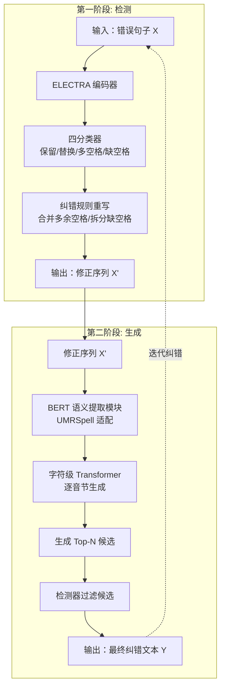

# Character-level Generative Network for Vietnamese Spelling Error Correction
---
基于字符级生成网络的越南语拼写纠错

---

## **作者信息**

| 作者 | 机构 | 身份/背景 | 
|------|------|-----------|
| Yanmei Ou | 广东外语外贸大学 | 第一作者 | 
| Zhuofan You | 广东外语外贸大学 | 第二作者 |  
| Siyi Lian  | 广东外语外贸大学 | 第三作者 |  
| Cuiyi Zhi  | 广东外语外贸大学 | 第四作者 | 
| Shengyi Jiang | 广东外语外贸大学 | 通讯作者 |  

---

## **团队相关信息**

该团队来自于广东外语外贸大学，是**国内从事越南语自然语言处理方向的少见研究力量**。论文发表在国际会议 IMLIP 2024（Intelligent Multilingual Information Processing，第一届智能多语言信息处理国际会议，2024年11月16-17日于北京举行）论文集中。从论文引用的越南语 NLP 领域核心工作（Do et al. 2021、Tran et al. 2021、Nguyen et al. 2023 等）以及使用的越南语预训练模型（vELECTRA、PhoBERT）来看，该团队对越南语 NLP 领域前沿有深入跟踪。从研究深度和技术成熟度来看，该团队应为该方向**有稳定产出的研究力量**。

---

## **论文发表时间**

| 项目 | 具体日期 | 来源/说明 |
|------|----------|-----------|
| 会议召开 | 2024年11月16-17日 | IMLIP 2024，北京 |
| 在线出版 | 2025年5月22日 | Crossref 元数据 |
| 出版状态 | **已正式发表** | Springer CCIS 系列，页码 125-139 |
| DOI | 10.1007/978-981-96-5123-8_9 | [Springer Link](https://link.springer.com/chapter/10.1007/978-981-96-5123-8_9) |
| 收录丛书 | Communications in Computer and Information Science (CCIS) | ISSN: 1865-0929 |
| 所属论文集 | Intelligent Multilingual Information Processing (IMLIP 2024) | ISBN: 978-981-96-5122-1 (print), 978-981-96-5123-8 (electronic) |

---

## **摘要**

越南语拼写纠错（SEC）面临两大挑战：(1) 标注数据不足；(2) 现有 SOTA 方法难以纠正集外词（OOV）和空格错误。本文提出：**一种包含三种策略的高质量训练数据构建方法**，以及**一个两阶段字符级生成式拼写纠错框架（TS-CGSEC）**。该框架通过对检测到的错误音节进行精确修改，有效提升了 OOV 词和空格错误的纠正能力。在 VSEC 和 Viwiki-Spelling 数据集上，框架取得了 F0.5 = 0.9170 的优异性能，超越了现有方法。

---

## 一、这篇论文讲了一个什么样的故事？

越南语是一种使用拉丁字母但带有多达六种复杂变音符号（diacritics）的语言。一个音节可以有六种不同的书写形式，每种含义和用法各异。这使得越南语的拼写纠错比英语、中文等语言更加困难——不仅存在打字错误（typos），还存在因发音混淆导致的认知错误（如越南北部人常混淆 d/r/gi、tr/ch、s/x、n/l）。

当前越南语 SEC 的 SOTA 方法主要基于 BERT/Transformer，但它们面临两个瓶颈：**(1) 集外词（OOV）无法纠正**——因为 BERT 将 OOV 词切分为子词单元，失去了直接修正的能力；**(2) 空格错误难以处理**——越南语以空格分隔音节并标记词边界，错误的空格插入或遗漏会导致整句语义混乱。

本文的故事线是：**先解决数据问题，再解决模型问题**。作者首先提出了一套"三管齐下"的训练数据构建策略（伪数据 + Wikipedia 修订历史 + 新闻语料挖掘），构建了百万级高质量训练数据。在此基础上，提出了 TS-CGSEC 框架——一个三模块协同工作的系统：ELECTRA 负责检测错误、BERT 负责提取语义、字符级 Transformer 负责逐字生成正确音节。最终在两大公开数据集上全面超越现有方法，尤其 OOV 纠错能力实现了质的飞跃（从 UMRSpell 的 F0.5 = 0.2415 提升到 0.7640）。

---

## 二、本文的核心思想和创新点

### 1. 核心思想

**将越南语拼写纠错从"序列标注/分类问题"重新定义为"字符级生成问题"**。传统方法试图用 BERT 直接输出纠错结果，但受限于固定词表和一对一映射。TS-CGSEC 的思路是：先检测哪些音节有错，再逐字符生成正确音节——这使得框架天然具备处理 OOV 词和空格错误的能力。

### 2. 关键创新点

**(1) 三种策略的高质量训练数据构建方法**
- **键盘距离 + 字符级 n-gram 的伪数据构造**：基于键盘物理坐标的曼哈顿距离模拟真实击键错误，比随机替换更贴近实际；利用 bi-gram 和音素概率字典模拟认知错误。最终生成 100 万句对。
- **Wikipedia 修订历史挖掘**：从越南语 Wikipedia 的编辑历史中提取真实人工纠错对，经模型迭代噪声过滤后获得约 14 万高质量句对（人工验证精度 94.12%）。
- **越南语新闻语料挖掘**：通过 Google Translate 检测非词（non-word），用模型生成纠错建议，再经检测器验证，最终获得约 10 万 IV 纠错句对。

**(2) 两阶段字符级生成式拼写纠错框架（TS-CGSEC）**
- 第一阶段（检测）：ELECTRA 四分类（保留/替换/多空格/缺空格）
- 第二阶段（生成）：BERT 语义提取 + 字符级 Transformer 逐字生成正确音节

**(3) 迭代纠错策略**
- 使用不同微调阶段的框架进行多轮纠错，实现了互补效应，进一步提升召回率。

---

## 三、方法是怎么实现的？(How does it work?)

### 1. 架构

本框架采用**两阶段三模块架构**，分为**检测阶段**与**生成阶段**，整体流程如下：

**图注**：参考论文 **Figure 2（TS-CGSEC 框架总览）** 绘制。绿色为检测模块，蓝色为语义提取模块，深红色为音节生成模块。虚线表示迭代纠错流程。

### 2. 关键算法

**数据构造算法——键盘距离伪数据生成：**
- 将键盘映射到二维坐标系，字符替换概率与曼哈顿距离的平方成反比（距离越近，误触概率越高）
- 大写字母因需按 Shift，距离额外 +1
- 对每个正确句子的 4% 音节引入错误：96% 替换、1% 合并、3% 拆分
- 音节替换需多次编辑直到达到预设编辑距离（Levenshtein Distance）

**纠错框架——迭代纠错策略：**
- 第一轮使用三阶段微调框架纠错
- 第二轮使用二阶段微调框架纠错（因为三阶段引入的新闻数据仅含 IV 错误，改变了错误分布，两阶段框架可与之互补）

### 3. 关键公式

**(1) 编码器输出（音节生成模块）：**

$$H_{encoder} = \text{Encoder}(x)$$

其中 $x = \{w_1, w_2, \dots, w_i, \dots, w_n\}$ 为错误音节的 n 个字符。

**(2) 联合损失函数：**

$$L = \alpha L_d + \frac{1-\alpha}{2} L_c + \frac{1-\alpha}{2} L_w$$

其中 $L_d$ 为检测网络损失，$L_c$ 为语义提取模块中纠错网络损失，$L_w$ 为音节生成模块损失。$\alpha = 0.2$，因为检测任务（四分类）相对简单，给予较小权重。

**(3) 评价指标——F0.5 分数：**

$$CP = \frac{\#\text{ of true corrections}}{\#\text{ of error corrected}}, \quad CR = \frac{\#\text{ of true corrections}}{\#\text{ of actual errors}}$$

$$CF_{0.5} = \frac{(1 + 0.5^2) \times CP \times CR}{0.5^2 \times (CP + CR)}$$

F0.5 强调精度（precision）权重更高，反映实际拼写纠错场景中对"不要改对为错"的偏好。

---

## 四、实验效果 (Experimental Results)

### 1. 实验设置

| 项目 | 详情 |
|------|------|
| **训练数据** | 伪数据（100 万句对）→ Wikipedia 数据（14 万句对）→ 新闻数据（10 万句对），三阶段渐进微调 |
| **测试数据** | VSEC（9,047 句含拼写错误）+ Viwiki-Spelling（约 14,000 句，约 1,300 含错） |
| **检测模块** | vELECTRA，序列长度 128，10 epochs，lr=1e-5 |
| **语义提取模块** | PhoBERT-base-v2，lr=3e-5（二/三阶段） |
| **音节生成模块** | BART（Hugging Face Transformers），lr=1e-4（二/三阶段） |
| **基线方法** | Detector+n-gram、UMRSpell、Hierarchical Transformer、Sequence Tagging |

### 2. 主要结果

**VSEC 数据集：**

| 方法 | Precision | Recall | F0.5 |
|------|-----------|--------|------|
| Detector+n-gram | 0.7492 | 0.6762 | 0.7334 |
| UMRSpell | 0.9097 | 0.7355 | 0.8685 |
| **TS-CGSEC（最优）** | **0.9442** | **0.8561** | **0.9170** |

**核心结论：**
- TS-CGSEC 全面超越所有基线，F0.5 达到 0.9170，相比 UMRSpell 提升约 5.6%
- 迭代纠错显著提升召回率（从 0.8059 到 0.8561），同时精度保持稳定
- 使用不同微调阶段的框架进行多轮纠错（二阶段 + 三阶段互补）效果最佳

**OOV 错误纠正能力对比：**

| 方法 | OOV-F0.5 | IV-F0.5 |
|------|----------|---------|
| UMRSpell | 0.2415 | 0.8926 |
| Detector+n-gram | 0.6217 | 0.7393 |
| **TS-CGSEC（最优）** | **0.7640** | **0.9252** |

- UMRSpell 几乎无法纠正 OOV 错误（F0.5 仅 0.2415），而 TS-CGSEC 达到 0.7640——**OOV 纠错能力提升超过 3 倍**
- IV 错误纠正也从 0.8926 提升到 0.9252，全面领先

**Viwiki-Spelling 数据集：**

| 方法 | 纠错准确率（total） | 纠错准确率（detected） |
|------|---------------------|------------------------|
| Hierarchical Transformer | 0.6429 | 0.9636 |
| Sequence Tagging | 0.6180 | — |
| **TS-CGSEC（最优）** | **0.6436** | 0.8826 |

- 整体纠错准确率略优于 Hierarchical Transformer（0.6436 vs 0.6429），且检测召回率更高

### 3. 消融实验与关键发现

| 配置 | F0.5 | 变化 |
|------|------|------|
| TS-CGSEC 完整框架 | 0.9043 | — |
| 移除音节生成模块 | 0.8882 | **-0.016** |
| 移除检测模块 | 0.8789 | **-0.025** |

**关键发现：**
- **检测模块和生成模块缺一不可**——移除任何一个都导致显著性能下降，且移除检测模块的损失更大
- **三阶段渐进微调优于跳过第一阶段**——仅用二/三阶段微调（跳过伪数据），F0.5 从 0.9170 骤降至 0.8960，证明了伪数据构造策略的关键作用
- **Wikipedia 噪声过滤有效**——过滤前检测 F1 = 0.6334，过滤后提升至 0.6681

**实验部分总结**：本文通过大规模、多阶段、多数据集的实证评估，**确凿证明了字符级生成方法在越南语拼写纠错中的显著优势**，系统性量化了数据质量、模块贡献、迭代策略三大维度的影响，尤其 OOV 纠错能力的飞跃式提升是该工作的核心亮点。

---

## 五、优点与局限性

### ✅ 1. 优点

1. **OOV 纠错的突破性提升**：字符级生成策略从根本上解决了 BERT 类方法无法处理 OOV 词的固有问题，OOV 的 F0.5 从 0.2415 提升到 0.7640，是三倍以上的质的飞跃。
2. **数据构造方法系统且务实**：三种策略覆盖了伪数据（低成本大规模）、真实人工纠错（Wikipedia 修订历史）、真实应用场景（新闻语料），层次分明，可复现性强。
3. **模块化设计清晰**：检测→语义提取→音节生成的三模块架构各司其职，消融实验充分验证了每个模块的必要性。
4. **实验设计严谨**：多数据集（VSEC + Viwiki-Spelling）、多基线（n-gram、UMRSpell、Hierarchical Transformer、Sequence Tagging）、OOV/IV 分项评估、消融实验、迭代策略分析——实验链路完整。
5. **迭代纠错策略巧妙**：利用不同微调阶段的框架互补，在不增加模型复杂度的情况下提升召回率。

### ⚠️ 2. 局限性（研究边界与待解问题）

1. **大小写错误处理薄弱**：新闻纠错数据集中 62% 的遗漏错误是大小写相关的，框架对此几乎无能为力——这是一个明显的盲区。
2. **键盘距离模型过于简化**：伪数据构造中仅考虑字符间曼哈顿距离，未考虑实际输入法行为（如 TELEX/VNI 输入法）、多键组合、手指移动惯性等，可能无法充分模拟真实打字场景。
3. **长句处理受限**：模型最大处理长度约 120 音节，超长句的纠错性能会下降。
4. **迭代次数为手工设定**：论文中限定为两轮迭代，未探索自适应终止条件（如何时停止迭代），实际部署中可能需要更智能的策略。
5. **仅支持 IV 错误的新闻数据限制了泛化**：第三阶段引入的新闻数据集仅包含 IV 错误，导致 OOV 纠错性能在三阶段后反而下降——虽然通过迭代策略弥补，但这暴露了数据构造策略的局限性。
6. **匿名投稿未公开代码**：目前尚无开源实现可供复现和社区验证。

---

## 六、其他

### 第一性原理

越南语拼写纠错的**根本困难**在于：越南语是一个"高密度变音符号语言"——同一个基础字母组合加上不同变音符号就变成完全不同的词。这导致两个后果：(1) 错误和正确的边界模糊（一个变音符号的差异就可能改变整个词义）；(2) 词表天然巨大且 OOV 问题严重。

传统方法的思路是"分类"——给定一个错误音节，从固定候选集中选一个正确的。这在 OOV 场景下必然失败。

本文的第一性原理回归是：**纠错本质上是一个"生成"问题，而不是"分类"问题**。当遇到未见过的错误形式时，不应该从固定词表中选择（那永远选不到 OOV 词），而应该像人类一样——逐字符地"写出"正确的音节。字符级 Transformer 解码器扮演的就是这个角色。这是思路上的根本转变。

### 领域空白

1. **越南语 SEC 的评估基准缺失**：目前仅有 VSEC 和 Viwiki-Spelling 两个公开数据集，且规模偏小。该领域缺乏统一的、大规模的、多维度的评估基准（如区分错误类型、领域、难度等级）。
2. **端到端系统与实际应用的鸿沟**：现有工作均在"句子级"评估，但实际应用中拼写纠错往往作为下游任务（OCR、语音识别、搜索）的前置模块，端到端效果未知。
3. **多模态/上下文增强的 SEC**：越南语中存在大量同音异义词（如 d/r/gi），仅靠文本上下文有时难以判断。结合语音信息或更广的语境可能是突破口。
4. **低资源场景下的 SEC**：虽然本文提出了数据构造方法，但针对特定领域（医疗、法律）的越南语 SEC 数据仍然极度匮乏，迁移学习和少样本学习方向有待探索。

---

> 本文由 Deepseek AI 生成

