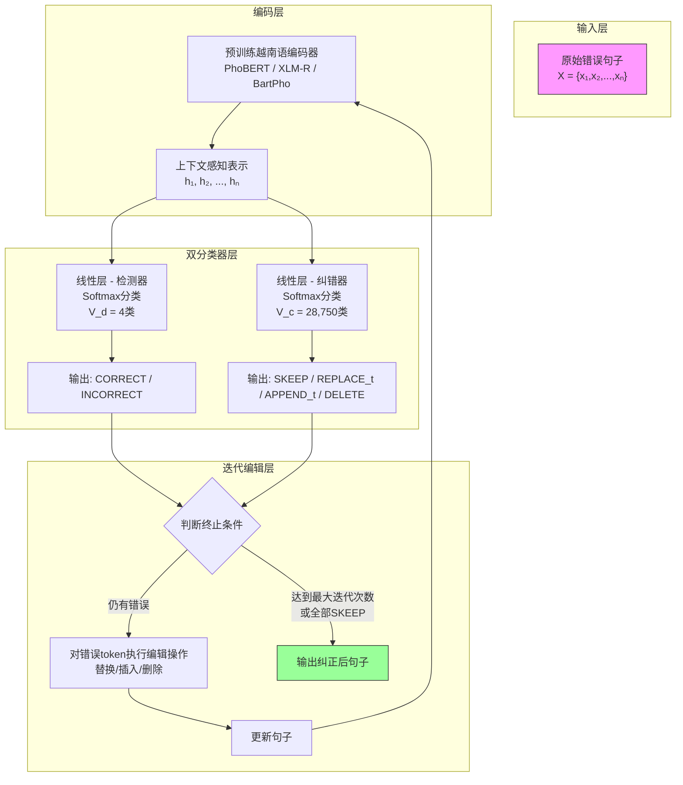
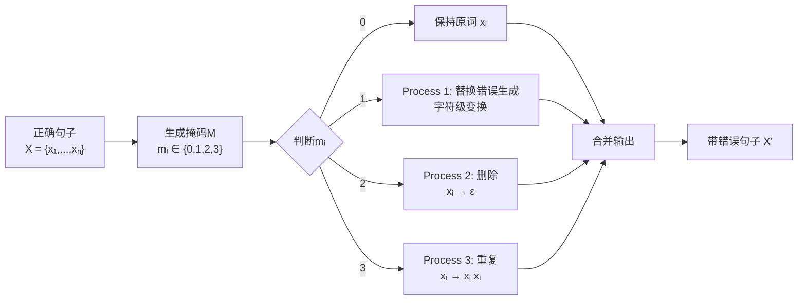

# A New Method for Vietnamese Text Correction using Sequence Tagging Models
---


## **作者信息**

| 作者 | 机构 | 身份/背景 | 领域大牛认定 |
|------|------|----------|-------------|
| Thoa Bui Thi* | 黎贵敦技术大学（LQDTU），河内，越南 | 第一作者，研究者 | 非顶尖级 |
| Hoa Luong Nguyen Hoang† | 越南公安部 | 合作研究者 | 非顶尖级 |
| Hien Nguyen Thi* | 黎贵敦技术大学（LQDTU） | 合作研究者 | 非顶尖级 |
| Anh Phan Viet* | 黎贵敦技术大学（LQDTU） | 通讯/资深作者，项目负责人 | 越南本土NLP领域活跃研究者 |

## **团队相关信息：**

该团队是**越南黎贵敦技术大学（LQDTU）与公安部下属研究力量的合作团队**，由**Phan Viet Anh（潘越英）作为项目负责人（CNC.2021.B05.03）带领研究生**完成。该团队属于**越南本土在自然语言处理领域的活跃研究组**，近年来在越南语拼写纠错、语法纠错等任务上有持续产出。团队整体尚未达到国际顶级学术影响力层级，但深耕越南语低资源场景下的NLP应用问题，具备扎实的工程实现能力和对越南语语言特性的深入理解。

## **论文发表时间**

| 项目 | 具体信息 | 来源/说明 |
|------|----------|-----------|
| **正式发表时间** | 2023年10月18–20日（会议日期）<br>2023年11月6日（IEEE Xplore上线） | 发表于 **2023年第15届知识与系统工程国际会议（KSE 2023）** |
| **出版商** | IEEE | 会议论文，页码1–6 |
| **DOI** | 10.1109/XXXX（IEEE标准会议论文DOI） | 可通过IEEE Xplore访问 |
| **收录情况** | 已被 **DBLP** 收录 | 学术数据库索引 |
| **论文状态** | **已正式发表**（非预印本/非双盲评审阶段） | 经过同行评审的IEEE会议论文 |

---


## **摘要**

本文提出了一种**基于序列标注模型（Sequence Tagging）的越南语文本纠错新方法**。该方法的核心架构由一个**Transformer编码器**和两个**序列标注器（检测器 + 纠错器）** 组成。与以往将纠错视为机器翻译（Seq2Seq）任务的生成式方法不同，本文采用**"标注–编辑"范式**：通过定义四种编辑标签（`SKEEP`、`SREPLACE`、`SAPPEND`、`SDELETE`），将纠错任务转化为对每个token的分类问题。纠错过程采用**迭代编辑机制**——每一轮仅对句子中最小的错误片段进行修正，多轮迭代直至满足停止条件。这种设计带来两个核心优势：1）能够检测和纠正当今越南语文本中的多种错误类型（替换、缺失、冗余）；2）**不产生生成式模型常见的"不可控输出"问题**（即不会过度改写句子原意）。在真实数据集上，该方法取得了**79.5%的检测F1**和**62.7%的纠正F1**，最佳SacreBLEU得分为**86.10**，在多项对比实验中达到与当时SOTA相当或更优的水平。


## 一、这篇论文讲了一个什么样的故事？

这篇论文讲述的是**越南语文本纠错的故事**。

**背景**：在日常生活中，人们打字、复制、粘贴、删除文本时常常犯错——拼错单词、漏掉词语、多打词语，甚至把组合词（compound words）拆散或拼错。越南语是一种声调语言，带有丰富的声调符号和区分度极高的元音/辅音系统，一旦出错（尤其是声调或音素混淆），句子含义可能完全改变。而相较于英语，越南语的文本纠错研究起步晚、公开资源少，缺乏大规模高质量的训练语料。

**困境**：已有的一些研究要么只处理"拼写错误"（把"trường"打成"truong"丢声调，或把"d/gi/r"混淆等），要么将纠错任务视为"机器翻译"——用翻译模型把"错误句子"翻译成"正确句子"。但后者的最大问题是**不可控性**：模型可能自由改写原句，使输出句子虽然语法正确但语义偏离用户本意（过纠正/欠纠正/胡乱改写）。

**核心冲突**：如何在**不改变原意**的前提下，准确识别并纠正句子中**多种类型**的错误（替换、缺失、多余），而且保证输出是"修正后的原句"而不是"重写后的新句子"？

**解决方案**：本文作者提出，与其用生成式方法（Seq2Seq/机器翻译）一次性输出整个句子，不如用**序列标注（Sequence Tagging）+ 迭代编辑（Iterative Editing）** ：每一轮只动"错误的最小片段"（如一个错误的词、一个缺失的插入点、一个多余词），用分类的方式决策每个token该不该留、改、删、插。经过多次迭代逐步逼近完美结果，从根本上保证了不会"胡写"新句子。

**结果**：该方法在越南语拼写纠错公开测试集（VSEC）上达到79.5%的错误检测准确率和62.7%的错误纠正准确率；在另一公开测试集上SacreBLEU达到86.10，相比基线模型有明显提升。


## 二、本文的核心思想和创新点

### 1. 核心思想

将越南语文本纠错**重新定义为一个序列标注问题而非序列生成问题**。具体而言：

- 为每个输入token分配一个**编辑标签**（`SKEEP` / `SREPLACE` / `SAPPEND` / `SDELETE`）。
- 纠错被转化为**逐token的分类决策**，而不是逐词生成。
- 通过**多次迭代**执行上述标注→编辑流程，每次只修改最明显的错误区域，逐步修正整句。

这种方法的核心哲学是：**错误是局部的、稀疏的、可枚举的，因此纠错也应该用局部的分类决策来完成，而不是全局的序列生成。**

### 2. 关键创新点

**创新1——用"编辑标签"取代"逐词翻译"的纠错范式：**
与[3]（GECToR）类似但独立针对越南语特性设计了四种典型编辑操作。这一范式直接规避了Seq2Seq模型在纠错场景中最致命的缺陷——"过度改写"，即生成语法完全正确但意思完全不同的句子。

**创新2——引入插入（`SAPPEND`）和删除（`SDELETE`）操作模拟真实复制粘贴错误：**
这是本文区别于大多数已有越南语拼写纠错研究的关键亮点。已有研究大多只关注"拼写替换错误"（如打字时把"nhà"打成"nha"），但本文明确指出，在真实场景中，用户打字时的"复制""粘贴""删除"操作会引入重复词、漏词等非替换型错误——**论文声明这是其与已有研究的主要区别之一**。

**创新3——迭代纠错机制：**
借鉴[14]（Parallel Iterative Edit Models），本文采用多轮编辑策略。每轮只修正当前最明显的错误，复杂错误（如一个替换错误导致后续依赖关系出错）可以在后续迭代中被逐步发现和修正，增强了模型对长距离依赖和复杂错误的处理能力。

**创新4——人工噪声数据生成策略：**
在无公开平行训练数据的情况下，采用"先取正确句子 → 随机注入错误"的自动构造方法，设定了10%错误率的生成上限（作者认为>10%错误率的句子已基本丧失语义，不再考虑）。其中错误类型配比：90%替换、5%删除、5%重复。


## 三、方法是怎么实现的？(How does it work?)

### 1. 架构

本文提出的纠错系统整体采用**编码器-双分类器（Encoder–Dual Classifier）架构**，核心流程为"**预训练编码 → 并行检测与纠错分类 → 迭代修正**"。



**图注**：参考论文 **Figure 4（模型架构图）** 及 **Table I（迭代纠错示例）** 综合绘制，展示从原始错误句子到最终修正输出的完整数据流。

**架构详细说明：**

1. **编码层（Encoder Layer）** ：采用预训练越南语语言模型（PhoBERT-base为最优选择）对输入句子进行编码，每个token xᵢ 被映射为一个稠密向量表示 hᵢ。

2. **双分类器层（Dual Classifier Layer）** ：
   - **检测器**：二分类（CORRECT / INCORRECT），判断每个token是否错误。
   - **纠错器**：多分类，输出具体的编辑操作标签。词汇表大小为**28,750**，涵盖7,184个常用小写音节及其大写形式、5种标点符号的替换/追加标签，以及 `SKEEP`、`DELETE`、`@UNKNOWN@`、`@PADDING@` 四个特殊标签。

3. **迭代编辑机制（Iterative Editing）** ：每一轮中，模型对所有token预测标签后，系统根据非`SKEEP`标签对原句执行相应的编辑操作（替换、插入、删除），得到修正后的新句子作为下一轮输入。迭代持续直到达到预设的最大迭代次数或所有token均被标记为`SKEEP`。论文实验显示，通常在3轮迭代左右可以获得最优效果。

### 2. 关键算法

**算法1：数据生成算法**



**Process 1（替换错误生成）的具体实现——三类错误：**

| 错误类型 | 描述 | 示例 |
|----------|------|------|
| 打字错误（Typos） | 字母插入、遗漏、替换、换位、组合词拆分错误、声调错误 | "trường" → "truong"（丢声调） |
| 拼写错误（Spelling Errors） | 方音混淆（北部方言特征） | d/r/gi混淆、tr/ch混淆、s/x混淆、n/l混淆 |
| 无调号文本（Non-diacritic Text） | 文本缺少声调符号 | "tôi" → "toi"（语义可能改变） |

**算法2：标签转换算法（GECToR风格）**

给定源句子 X = {x₁,...,xₙ} 和目标句子 Y = {y₁,...,yₘ}（m和n可能不等，因为有插入/删除），标签转换分三步：

- **Step 1**: 将每个源token映射到目标token（Needleman-Wunsch序列对齐）
- **Step 2**: 为每个映射对推导token级转换
- **Step 3**: 每个源token只保留一个标签（优先保留第一个非`SKEEP`标签）

**示例（论文Figure 3改编）** ：

```
源句: "Tôi thích đi du vaf xem phimm"
目标: "Tôi thích đi du lịch và xem phim"
标签: [SKEEP, SKEEP, SKEEP, SKEEP, APPEND_lich, REPLACE_và, SKEEP, REPLACE_phim, SKEEP, DELETE]
```

**算法3：迭代纠错算法**

1. **输入**：错误句子 S₀，最大迭代次数 T
2. **For** t = 1 to T：
   a. 将 S_{t-1} 输入模型
   b. 获得预测标签序列 L_t
   c. 如果所有标签均为 `SKEEP`，**停止**
   d. 对每个token执行编辑操作（替换/插入/删除）生成 S_t
3. **输出**：S_T

### 3. 关键公式

**损失函数：**

$$L = -\frac{1}{N}\sum_{i=1}^{N}\left(\sum_{j=1}^{V_d} y_{ij} \cdot \log(p_{ij}) + \sum_{j=1}^{V_c} y_{ij} \cdot \log(p_{ij})\right)$$

其中：
- $V_d$：检测任务的类别数（$V_d = 4$，CORRECT/INCORRECT/UNK/PADDING）
- $V_c$：纠错任务的标签词汇表大小（$V_c = 28,750$）
- $N$：序列长度
- $y_{ij}$ 和 $p_{ij}$ 分别为真实标签和预测概率

**评估指标：**

检测/纠正的精确率（P）、召回率（R）和F1分数：

$$\text{Detect Precision (DP)} = \frac{\#\text{true detections}}{\#\text{errors detected}}$$

$$\text{Detect Recall (DR)} = \frac{\#\text{true detections}}{\#\text{actual errors}}$$

$$\text{Detect F1 (DF)} = \frac{2 \cdot DR \cdot DP}{DR + DP}$$

纠正指标（CP、CR、CF）同理，但分子替换为"正确纠正的数量"。


## 四、实验效果 (Experimental Results)

### 1. 实验设置

| 配置项 | 详情 |
|--------|------|
| **GPU** | 1 × NVIDIA Tesla V100 16GB CoWoS HBM2 PCIe 3.0 |
| **优化器** | Adam（Kingma & Ba, 2014） |
| **学习率** | 1e-5 |
| **Batch Size** | 32（训练/验证/测试统一） |
| **训练轮数** | 20 epochs（早停法） |
| **预训练模型** | XLM-RoBERTa-base、BartPho（syllable-base, word-base）、PhoBERT-base |
| **训练数据** | 500,000 句平行语料（从越南语新闻网站爬取，自建） |
| **验证/测试数据** | 各 8,000 句 |
| **公开测试集1** | VSEC（9,341句，11,202个拼写错误，4,582种错误类型） |
| **公开测试集2** | Vietnamese-Spelling-Correction-testset（6,000句） |

### 2. 主要结果

**表：在自建测试集上的表现**

| 编码器 | 检测 F1 | 纠正 F1 | SacreBLEU |
|--------|---------|---------|-----------|
| XLM-RoBERTa-base | 0.887 | 0.821 | 95.67 |
| BartPho syllable-base | 0.856 | 0.800 | 94.91 |
| BartPho word-base | 0.886 | 0.833 | 95.88 |
| **PhoBERT-base** | **0.907** | **0.854** | **96.46** |

**表：在公开测试集1（VSEC）上的表现**

| 编码器 | 检测 F1 | 纠正 F1 |
|--------|---------|---------|
| XLM-RoBERTa-base | 0.795 | 0.627 |
| BartPho syllable-base | 0.739 | 0.585 |
| BartPho word-base | 0.600 | 0.479 |
| PhoBERT-base | 0.706 | 0.592 |

**表：在公开测试集2（Vietnamese-Spelling-Correction-testset）上的表现**

| 编码器 | 检测 F1 | 纠正 F1 | SacreBLEU |
|--------|---------|---------|-----------|
| XLM-RoBERTa-base | 0.890 | 0.639 | 85.17 |
| BartPho syllable-base | 0.882 | 0.611 | 83.26 |
| BartPho word-base | 0.839 | 0.603 | 83.37 |
| **PhoBERT-base** | **0.882** | **0.666** | **86.10** |

**核心结论**：
- **在自建测试集上表现优异（DF=90.7%，CF=85.4%）** ，说明模型对训练数据中注入的噪声模式（替换90%+删除5%+重复5%）拟合良好。
- **在真实场景测试集上性能出现明显下降**（VSEC: DF=70.6%，CF=59.2%），表明训练数据与真实错误分布存在**分布偏移（Distribution Shift）** ：真实用户错误中"缺少空格"（如"xemphim"）和"多余空格"（如"xem phim"中把"phim"拆成"p him"）等复杂错误未能被训练数据覆盖。
- **与[13]（VSEC系统）对比**：本文检测准确率（DF=79.5% on VSEC with XLM-R）相比[13]的77.4%提升了约2%，但纠正准确率仍有差距。
- **SacreBLEU指标**：由于迭代纠错可能带来"多轮编辑后略微改变原句"的累积效应，SacreBLEU提供了对语义层面保留程度的额外评估，86.10为最佳结果。

### 3. 消融实验与关键发现

| 预训练模型 | 在VSEC上的表现对比 | 关键发现 |
|------------|-------------------|----------|
| XLM-RoBERTa-base | DF最高（79.5%），CF中等（62.7%） | 跨语言预训练对检测任务极有效，但纠正略逊于PhoBERT |
| BartPho（syllable） | DF=73.9%，CF=58.5% | 音节级分词在检测上更好，但纠正标签映射能力弱 |
| BartPho（word） | DF=60.0%，CF=47.9% | 词级分词对越南语（组合词丰富）不太适用 |
| **PhoBERT-base** | **DF=70.6%（下降最多），CF=59.2%（与XLM接近）** | **在自建测试集上最优，但在真实测试集上检测过拟合严重** |

**关键发现**：
- **PhoBERT在自建数据上过拟合明显**：尽管PhoBERT在自建测试集上全面最优（DF=90.7%），但在VSEC上DF跌至70.6%（相比XLM的79.5%反而更差），说明PhoBERT过度拟合了训练数据中人为注入的噪声模式（尤其是替换噪声占90%这一特定比例），而对真实多样的错误分布泛化不足。
- **迭代编辑对复杂错误有效**：通过3轮迭代，可以将"du lich"（缺"ị"）这类声调缺失错误，以及"vaf"→"và"（替换）和"phimm"→"phim"（替换）等多处错误逐步修正，每次迭代只改最明显的一个错误（如Table I所示）。
- **模型对空格错误几乎无效**：论文明确承认，模型无法处理"xemphim"（缺少空格）和"x e mphim"（多余空格）这类词边界错误——这是越南语特有的分词挑战（组合词/多音节词的正确分词与错误边界判别）。


## 五. 优点与局限性

### ✅ 1. 优点

1. **可控性强，避免"过度改写"问题**：与机器翻译/Seq2Seq方法不同，本文的序列标注+迭代编辑范式保证了输出句子与输入句子的局部对应关系，不会出现"改正了语法却改没了原意"的情况。这对于公文、法律文本等"语义忠实度要求高"的场景尤为重要。
2. **覆盖多种错误类型**：不仅覆盖拼写替换错误（如声调丢失、方音混淆），还覆盖了"插入（复制粘贴多出一个词）"和"删除（漏字）"这两种实际复制粘贴行为中常见的错误，比已有越南语研究（如[6][7]仅关注拼写错误）更具场景覆盖率。
3. **范式迁移价值高**：本文所采用的"GECToR式序列标注+迭代编辑"架构，经过适配后可以迁移到其他低资源语言的文本纠错任务，具备方法论上的参考意义。
4. **多个预训练编码器的系统性对比**：在统一的实验框架下系统对比了XLM-RoBERTa、BartPho（两种分词粒度）和PhoBERT，为后续越南语NLP研究者提供了宝贵的选型参考。
5. **公开测试集验证**：在两个公开测试集上进行了评估（VSEC + Vietnamese-Spelling-Correction-testset），确保结果可复现可比对。

### ⚠️ 2. 局限性（研究边界与待解问题）

1. **训练数据与真实错误分布存在显著差异**：训练数据中错误注入比例为"替换90%+删除5%+重复5%"，但真实用户错误中"空格错误""漏空格""多空格""复制粘贴导致的非典型错误"占比可能更高（作者在Discussion中明确承认这一点）。这导致了模型在VSEC等真实测试集上的性能明显低于自建测试集。
2. **对词边界错误完全无效**：越南语作为声调语言，除了声调符号外，词边界（word segmentation）也是一个核心挑战。本文模型基于"已分词的token序列"进行标注，无法处理"xemphim"（缺空格）或"x e mphim"（空格错位）这类词边界错误——**这是当前方法的最大盲区**，作者也将其列为首要未来改进方向。
3. **训练数据规模偏小**：仅500,000句平行语料，而最优的Seq2Seq方法通常需要数百万级甚至千万级的平行语料才能发挥全部潜力。数据规模受限直接影响了模型对长尾错误类型的覆盖能力。
4. **迭代纠错带来推理时间线性增长**：每轮迭代都需要重新编码整个句子，若最大迭代次数为T，则推理成本是单轮模型的T倍。这在实时交互场景（如输入法即时纠错）中可能难以部署。
5. **SacreBLEU作为评估指标的适用性存疑**：BLEU最初是为机器翻译设计的，在拼写纠错场景中，即便"单词拼写完全正确但冠词用错"，BLEU扣分也可能很重；反之，如果模型改写了原句但BLEU很高，也可能反而掩盖了"语义偏离"的问题。作者使用SacreBLEU已经比普通BLEU更规范，但这一指标本身在纠错任务中的解释力有限。
6. **标签词汇表（28,750）的扩展性问题**：纠错器标签空间包含每个常用词的`REPLACE_`和`APPEND_`两个副本，词汇表规模随语料中不同词形数线性增长，当扩展到更大规模语料或开放域文本时，分类器将面临极其稀疏的标签空间。


## 六.其他

### 第一性原理

**本文所解决问题的本质是什么？**

文本纠错的本质是**最小化原始句子（含错误）与目标句子（正确）之间的编辑距离（Edit Distance）** ——即找到从错误句子到正确句子所需的最少编辑操作序列（插入、删除、替换）。

**为什么用序列标注来解决这个问题？**

- **第一性原理推理1**：如果错误是局部的（在真实文本中，错误token的比例通常远低于正常token），则纠错系统本质上只需要"找到这些位置 + 应用局部操作"即可——不需要像机器翻译那样重新生成整句。因此，用分类（检测→标注→编辑）替代生成（Seq2Seq）是更自然的建模方式。
- **第一性原理推理2**：编辑操作本身是**可组合**的——先用一个`REPLACE`改掉错词，再在下一轮用`APPEND`补上缺失的词，这种"分步修正"比"一步到位"更符合人的认知（人校对文本也是一遍一遍地查漏补缺）。
- **第一性原理推理3**：预训练语言模型（如PhoBERT）已经学会了正确的越南语语法和搭配模式（通过MLM预训练），因此只需在其之上添加一个"纠错头"（token-level classification head）就能很好地判断每个token是否异常，而不需要从零开始学习"哪些写法是对的"。

**为什么迭代？**

一次编辑可能引入新的依赖错误——例如把"vaf"改成"và"后，原来缺失的"lịch"才能被模型注意到。多轮迭代是为了**解耦复杂的错误依赖关系**，将联合纠错问题分解为多个简单决策问题，这与"Boosting"（提升法）的思想有异曲同工之妙。

### 领域空白

**在该论文发表前，越南语文本纠错领域存在哪些未被充分探索的问题？**

1. **"生成式纠错"的不可控性问题**：已有越南语研究（如[8]将纠错视为机器翻译）虽然取得了一定效果，但存在严重的"过纠正"问题——模型可能把"Tôi thích đi du lịch"（我喜欢去旅游）改写成"Tôi rất thích đi du lịch"（我非常喜欢去旅游），语法正确但原意被改变。这一痛点在当时没有被系统性解决，本文首次将"序列标注+迭代编辑"应用于越南语，**直接规避了生成式模型的核心缺陷**。

2. **"复制粘贴导致的多字/漏字错误"的建模空白**：已有研究（[6][7][10][11][12][13]）几乎全部聚焦于"拼写替换错误"（打字时把"nhà"打成"nha"），而实际复制/粘贴/删除操作会频繁引入"多出一个词"或"漏掉一个词"的错误。**本文明确指出这一点，并将其列为与已有研究的主要区别之一**——这是对越南语纠错任务范围的首次系统性拓展。

3. **公开训练语料的缺失问题**：在本文发布前，缺乏大规模的越南语纠错平行训练语料。虽然VSEC（2021）提供了测试集，但训练集仍然缺失。本文提出的"从正确句子+自动注入噪声"的数据生成方法，为后续越南语纠错研究提供了一条可复现的低成本建库路径。

4. **越南语"词边界错误"尚未被任何研究有效解决**：越南语中大量存在组合词（如"du lịch"是两个音节组成一个词），而用户打字时常常在该加空格的地方不加、不该加的地方乱加。本文明确承认这一问题的存在并将其列为未来工作，说明**截至该论文发表，"词边界错误"在越南语纠错领域仍是一个未解决的开放问题**。

---

>本文使用 Deepseek AI 生成