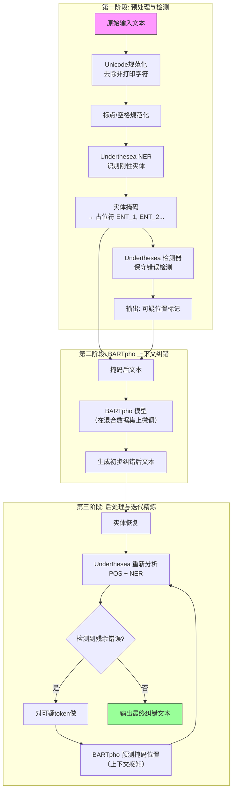

# A Two-Stage Vietnamese Spelling Correction Pipeline Combining Underthesea and BARTpho

越南语拼写纠正两阶段流水线 —— 结合 Underthesea 与 BARTpho 的受控文本编辑方法


## **作者信息**

| 作者 | 机构 | 身份/背景 | 领域大牛认定 |
|------|------|----------|-------------|
| Hao T. N. Huynh<sup>1</sup> | 西宁省科技厅数字化转型中心，越南 | 第一作者，应用研究工程师 | 非顶尖级 |
| Long S. T. Nguyen<sup>2</sup> | HCMUT大学URA研究组 | 合作研究者 | 非顶尖级 |
| Nam H. Nguyen<sup>2</sup> | HCMUT大学URA研究组 | 合作研究者 | 非顶尖级 |
| Hoang M. Nguyen<sup>2</sup> | HCMUT大学URA研究组 | 合作研究者 | 非顶尖级 |
| **Tho T. Quan<sup>2\*</sup>** | HCMUT大学URA研究组，越南 | **通讯作者/资深作者** | 越南胡志明市理工大学（HCMUT）资深教授，在越南语NLP应用研究领域有长期积累 |

## **团队相关信息：**

该团队是**胡志明市理工大学（HCMUT）URA研究组**与**西宁省科技厅数字化转型中心**的产学研合作团队，由**Tho T. Quan教授带领博士生/工程师**完成。该团队聚焦于**越南语自然语言处理的应用落地**方向，尤其在**行政与法律文本的自动化处理**方面有深厚积累。团队在方法论上偏向**部署导向的工程化设计**，强调系统在真实场景中的稳定性、可控性和安全性，而非纯粹的学术SOTA追逐。团队整体属于**越南本土NLP应用研究的活跃力量**，在国际学术影响力上尚未达到顶级层级。

## **论文发表时间**

| 项目 | 具体日期 | 来源/说明 |
|------|----------|-----------|
| 收稿日期 | 2026年2月19日 | 期刊投稿记录 |
| 修订日期 | 2026年3月7日 | 同行评审修改 |
| 接收日期 | 2026年3月26日 | 最终录用 |
| 发表状态 | **已被接收，待正式出版** | 属于期刊论文（Original Article），非会议论文，尚无卷期号/页码 |

该论文**已于2026年3月26日被某学术期刊正式接收**，目前处于**最终编辑/排版阶段（in press）**，尚未分配卷期号和页码，但已被期刊接受，属于经过同行评审的正式出版论文。


## **摘要**

越南语拼写纠正因该语言丰富的声调符号系统、基于音节的tokenization方式，以及行政/法律文本中大量出现的"刚性实体"（如文件编号、日期、专有名词），成为一项极具挑战性的任务。序列到序列（Seq2Seq）模型虽然纠错准确率高，但在领域迁移下容易产生**过度纠正（over-correction）**和**非预期改写**问题，限制了其在关键任务场景中的可靠性。

本文提出了一种**面向部署的两阶段越南语拼写纠正流水线**。第一阶段使用**Underthesea**进行文本规范化和保守的错误检测，并结合**实体掩码（entity masking）** 保护刚性标识符和格式信息不被改写；第二阶段使用**BARTpho Seq2Seq模型**进行上下文感知的纠错，随后通过**检测器引导的后处理**和**迭代掩码精炼**来控制非必要的编辑。

为支持真实场景评估，本文构建了一个**混合数据集**，将合成的拼写噪声与从行政文档中收集的真实错误相结合。实验表明，该流水线在显著减少过度纠正的同时，达到了较高的纠错准确率。除传统的端到端指标外，本文还引入了**检测导向的分析指标**，在模型实际处理的错误位置明确量化纠错行为，为真实部署提供了更清晰的实践安全性证据。

---

## 一、这篇论文讲了一个什么样的故事？

这篇论文讲述的是**越南语拼写纠错系统如何在真实行政/法律场景中安全落地**的故事。

**背景**：越南语是一种声调丰富、音节分明的语言——"ma"、"mà"、"mã"、"mạ"、"mả"五个完全不同的词共享相同的基础字母，只靠声调符号区分。行政和法律文本更是"重灾区"：里面充斥着"15/2023/NĐ-CP"这样的刚性实体（法令编号）、日期、人名、地名，任何不经意的改动都可能引发法律不一致、行政流程中断，甚至信任崩塌。

**困境**：传统的Seq2Seq模型（如BART、T5）在拼写纠错上确实"大力出奇迹"——直接学习从"错误句子"到"正确句子"的映射，准确率很高。但它们有一个致命缺陷：**过度纠正（over-correction）** 。在行政文本场景下，模型可能把"15/2023/NĐ-CP"（一个完全正确的法令编号）改成"15/2023/NĐ-CP"（同形异义？甚至改了数字）、或者把"UBND tỉnh Tây Ninh"（西宁省人民委员会）的缩写改成了完整形式。这种"好心办坏事"在高风险场景中是难以接受的。

**更根本的矛盾**：规则/字典方法稳定、可控、不会乱改，但"笨"——大量上下文相关的错误（尤其是声调错误和易混淆声母）它识别不出来；神经网络方法"聪明"但"野"——上下文理解力强，但缺乏约束机制，什么词都敢改。

**解决方案**：既然两者优缺点高度互补，为什么不把两者串成一个流水线？**第一步让Underthesea（规则工具）"保守地"干**——只找出那些"几乎肯定错了"的位置（高精度），同时把需要"绝对保护"的刚性实体用占位符蒙住（mask掉）。**第二步让BARTpho（神经网络生成器）"谨慎地"改**——只对第一步标记为"可能有错"的位置进行上下文预测，并配合检测器引导的后处理，反复精炼，确保不改无辜的词。

**结果**：BARTpho+两阶段流水线在Word Accuracy上达到**96.91%** ，Sentence Accuracy达到**73.93%** ，相比无纠错基线（90.85% WA）有显著提升。更重要的是，过度纠正率被控制在**2.05%** ——三款模型中最高但也是因为其纠错能力最强（能力越强，越容易"顺手"改掉边界上有歧义的词）。检测器的Over-Flag Rate仅为**0.11%** ，说明Underthesea作为安全过滤器是极其保守和可靠的。

---
## 二、本文的核心思想和创新点

### 1. 核心思想

拼写纠错系统在真实部署中，**"改对的"和"改错的"同样重要**——在行政/法律文本中，"不该改的坚决不改"的优先级甚至高于"把该改的都改了"。

因此，本文的核心思想是：**将拼写纠错设计为一个"先保守检测、再受控生成"的两阶段流水线**——第一阶段只负责"标记可疑位置+保护刚性实体"，第二阶段只在被标记的位置上进行上下文感知的修正，并配合迭代掩码精炼来严格控制不必要的编辑。

这一设计本质上是在**"召回率（覆盖所有错误）"与"精确率（不乱改）"之间做明确的、对安全敏感的权衡**——宁可不改（漏掉一些错误），也不能乱改（破坏原文的合法性/语义完整性）。

### 2. 关键创新点

**创新1——两阶段"检测-生成"受控纠错架构**：
与直接将整句输入Seq2Seq模型进行"自由生成"的方法不同，本文先将文本交给Underthesea进行**保守检测（high precision, low recall）** ，仅在检测器标记的位置上触发BARTpho的生成。这一设计将神经生成器的"行动范围"从"整句"限制为"可疑子集"，从根本上降低了过度纠正的风险。

**创新2——实体掩码（Entity Masking）与占位符保护机制**：
行政和法律文本中的刚性标识符（如"15/2023/NĐ-CP"、"UBND"等）是"不可触碰的红线"。本文使用Underthesea的NER组件识别这些实体，在输入BARTpho前将其替换为占位符（如`ENT_1`），输出后再恢复。这确保了即便BARTpho有"过度生成"的倾向，也无法触及这些关键信息。

**创新3——检测器引导的迭代掩码精炼（Detector-Guided Iterative Masked Refinement）** ：
纠错不是一步到位的。在BARTpho生成初步输出后，再次用Underthesea对修正后的文本做词性标注和NER分析，将标记为`0`（非实体）的token与标准化词汇表做比对，发现仍存疑的位置则用`<mask>`掩码后送回BARTpho进行上下文预测。该过程迭代进行，直至没有新错误被检测出来。

**创新4——混合数据集构建（Synthetic + Real-World Administrative Errors）** ：
此前越南语拼写纠错研究大多依赖纯合成噪声数据，真实世界错误（尤其是行政文本中的特有错误模式）覆盖不足。本文构建了一个**78,909句**的混合数据集，其中**295句（0.37%）为真实行政文档人工标注错误**。虽然占比小，但这些真实错误捕捉了纯合成噪声无法模拟的领域特性。

---

## 三、方法是怎么实现的？(How does it work?)

### 1. 架构

本文提出的系统采用**两阶段受控纠错流水线架构**，整体分为**预处理与检测阶段**、**BARTpho上下文纠错阶段**和**后处理与迭代精炼阶段**，流程如下图所示。



**图注**：参考论文 **Figure 1（系统总览图）** 综合绘制，展示从原始输入到最终输出的完整数据流。虚线框内为迭代精炼循环，最大迭代次数根据停止条件动态决定。

**各阶段详细说明：**

**第一阶段——预处理与保守检测：**
- 使用Underthesea进行Unicode规范化、去除非打印字符、标点和空白规范化。
- 使用Underthesea NER识别人名、地名、日期、领域特定标识符，将刚性实体替换为占位符。
- 在掩码后的文本上运行Underthesea的拼写检测模块，标记可疑位置（高精度设置，Over-Flag Rate仅0.11%）。

**第二阶段——BARTpho上下文纠错：**
- 将被掩码的文本和检测器标记的可疑位置送入BARTpho（在混合数据集上微调）。
- BARTpho学习"带噪句子 → 干净句子"的直接映射，但**仅在可疑位置上执行生成**，而非整句重写。

**第三阶段——后处理与迭代掩码精炼：**
- BARTpho输出后，恢复被掩码的实体。
- 对修正后文本再次运行Underthesea分析（POS + NER），判断是否仍有残余错误。
- 对可疑token用`<mask>`替换，将句子送回BARTpho进行上下文预测。
- 迭代直到无新错误检测到或达到预设停止条件。

### 2. 关键算法

**算法1：实体掩码与恢复**

对于输入文本中的每个句子：
1. 使用Underthesea NER识别实体及其类型（PERSON、LOCATION、DATE、MISC）
2. 对匹配预定义刚性格式模式（如数字+"/"+年份+"/"+字母组合）的实体，替换为占位符 `ENT_1`, `ENT_2`, ...
3. 在最终输出前，按占位符索引恢复原始实体字符串

**算法2：检测器引导的迭代掩码精炼**

```
输入: 初步纠错文本 S, 最大迭代轮次 T
输出: 最终纠错文本 S_final

1. 对 S 运行 Underthesea POS + NER
2. 对每个非实体 token（标签≠0）:
   a. 去除标点、特殊字符、数字
   b. 与 Underthesea 标准化词表比对
   c. 若不在词表中 → 标记为可疑
3. 若无可疑 token → 返回 S 作为最终输出
4. 若迭代轮次已到 T → 返回 S
5. 对每个可疑 token 替换为 <mask>
6. 将掩码后句子输入 BARTpho 预测 <mask> 位置
7. 取最高概率预测更新 S，进入下一轮迭代
```

### 3. 关键公式

**词准确率（Word Accuracy, WA）：**

$$\mathrm{WA} = \frac{1}{|\mathrm{tok}(y)|}\sum_{i=1}^{|\mathrm{tok}(y)|}\mathbb{I}[\mathrm{tok}(\hat{y})_i = \mathrm{tok}(y)_i]$$

其中 $\mathrm{tok}(\cdot)$ 为tokenization函数，$\mathbb{I}[\cdot]$ 为指示函数，$y$ 为参考句子，$\hat{y}$ 为预测句子。

**句子准确率（Sentence Accuracy, SA）：**

$$\mathrm{SA} = \frac{1}{N}\sum_{n=1}^{N}\mathbb{I}[\hat{y}^{(n)} = y^{(n)}]$$

句子级完全匹配，是严格的上界指标。

**Levenshtein相似度（LS）：**

$$\mathrm{LS} = 1 - \frac{\mathrm{ED}(\hat{y},y)}{\max(|\hat{y}|,|y|)}$$

其中 $\mathrm{ED}(\cdot,\cdot)$ 为编辑距离（字符级），衡量字符串整体相似度。

**检测器Over-Flag Rate（OFR）：**

$$\mathrm{OFR} = \frac{\#\{\text{正确token被误标记为错误}\}}{\#\{\text{正确token总数}\}}$$

衡量检测器的"误报率"，OFR越低表示检测越保守。

**检测导向指标——Accuracy@Flagged：**

$$\mathrm{Accuracy@Flagged} = \frac{1}{|\mathcal{F}|}\sum_{i\in\mathcal{F}}\mathbb{I}[\hat{y}_i = y_i]$$

其中 $\mathcal{F}$ 为检测器标记的可疑token位置集合。该指标衡量"在模型实际干预的位置上，纠正得多准"。

**过度纠正率（Over-Correction）：**

$$\mathrm{Over\text{-}Correction} = \frac{\#\{i\in\mathcal{F}\cap C:\hat{y}_i \neq y_i\}}{|\mathcal{F}\cap C|}$$

其中 $C$ 为输入中正确的token位置集合。该指标衡量"原本正确的词被改错了"的比例，**是本文最核心的安全性指标**。

**未修正错误率（Unchanged Error）：**

$$\mathrm{UnchangedError} = \frac{\#\{i\in\mathcal{F}\cap\mathcal{E}:\hat{y}_i \neq y_i\}}{|\mathcal{F}\cap\mathcal{E}|}$$

其中 $\mathcal{E}$ 为输入中真实错误的token位置集合。该指标衡量"本该改但没改"的比例。


## 四、实验效果 (Experimental Results)

### 1. 实验设置

| 配置项 | 详情 |
|--------|------|
| **训练数据** | 78,909句平行语料（合成噪声78,614句 + 真实行政错误295句） |
| **训练/测试划分** | 训练70,963句（89.93%），测试7,946句（10.07%），按句子长度分桶分层 |
| **优化器** | AdamW |
| **学习率** | 3e-5，线性预热（6%步数）+ 余弦退火 |
| **训练轮次** | 10 epochs |
| **Batch Size** | 每设备8，梯度累积8步 → 有效batch size 64 |
| **Dropout** | 0.2 |
| **权重衰减** | 0.01 |
| **标签平滑** | 0.1 |
| **最大序列长度** | 256 |
| **对比模型** | BARTpho（越南语专用）、mBART-cc25、mBART-50（多语言） |
| **GPU** | 未明确说明（推测为单/多卡V100/A100） |

### 2. 主要结果

**表：Underthesea检测器性能**

| 模型 | Precision | Recall | F1 | OFR |
|------|-----------|--------|-----|-----|
| Underthesea | 0.8173 | 0.4279 | 0.5617 | **0.0011** |

**关键解读**：检测器精度高达81.73%，Over-Flag Rate仅为0.11%（即每10,000个正确token中只有1个被误报），说明Underthesea作为"安全过滤器"极其保守可靠。但召回率仅42.79%，意味着超过一半的真实错误未被标记——这是"宁缺毋滥"设计哲学的必然代价。

**表：端到端纠错性能**

| 模型 | WA | SA | LS | BLEU | ChrF |
|------|-----|-----|-----|------|------|
| 输入（无纠错） | 0.9085 | 0.0240 | 0.9890 | 0.8788 | 0.8577 |
| mBART-cc25 | 0.9255 | 0.6685 | 0.9842 | 0.9583 | 0.9126 |
| mBART-50 | 0.9401 | 0.7077 | 0.9904 | 0.9609 | 0.9033 |
| **BARTpho** | **0.9691** | **0.7393** | **0.9903** | **0.9653** | **0.9224** |

**核心结论**：
- **BARTpho在所有5项指标上全面最优**，WA达96.91%，SA达73.93%，相比无纠错基线分别提升6.06个百分点和71.53个百分点（SA提升幅度大是因为句子级完全匹配对"改对最后一个词"极度敏感）。
- **越南语专用预训练（BARTpho）显著优于多语言模型**，在WA上比mBART-50高出2.90个百分点，验证了领域专用模型在细粒度声调/拼写纠错上的不可替代性。
- SA指标大幅跳升（从2.40%到73.93%）说明两阶段流水线不仅改了词，而且改变了"整句是否完全正确"的分布，对实际应用有重要意义。

**表：检测导向分析（仅看被标记位置）**

| 模型 | Accuracy@Flagged | Over-Correction | Unchanged Error |
|------|------------------|-----------------|-----------------|
| mBART-cc25 | 0.8606 | 0.0120 | 0.1620 |
| mBART-50 | 0.8728 | 0.0119 | 0.0785 |
| **BARTpho** | **0.8824** | **0.0205** | **0.1021** |

**关键解读**：
- BARTpho在被标记位置上的准确率最高（88.24%），说明一旦进入"受控修改范围"，它的纠错能力最强。
- 但BARTpho的Over-Correction也最高（2.05%），虽绝对值很小，但高于两个多语言模型——**更强的纠错能力伴随着更强的"改写冲动"** ，这是实践者需要权衡的：每多改对10个词，可能会多改错1-2个原本正确的词。
- mBART-50在Unchanged Error上最低（7.85%），说明它"该改的都改了"覆盖最好，但代价是Accuracy@Flagged和Over-Correction的平衡稍逊。

### 3. 按错误类型分类的性能

**表：各错误类型上的词准确率（WA）**

| 错误类型 | mBART-cc25 | mBART-50 | BARTpho |
|----------|------------|----------|---------|
| 声调/音符错误（Tone/Diacritics） | 0.9278 | 0.9409 | **0.9720** |
| 空格错误（Spacing） | 0.9102 | 0.9113 | **0.9299** |
| 缺字母（Missing Letter） | 0.9168 | 0.9176 | **0.9614** |
| 元音错误（Vowel） | 0.9220 | 0.9428 | **0.9681** |
| 韵母错误（Rhyme） | 0.9357 | 0.9495 | **0.9730** |
| 辅音错误（Consonant） | 0.9292 | 0.9475 | **0.9676** |

**关键发现**：
- BARTpho在所有6种错误类型上全面领先，尤其在声调/音符错误（97.20%）和韵母错误（97.30%）上表现最佳——这与BARTpho的越南语专用预训练直接相关。
- 所有模型在**空格错误（Spacing）** 上的表现最差（BARTpho仅92.99%），这再次印证了越南语分词/词边界问题的难度——"xemphim"（缺少空格）和"x e mphim"（空格错位）这类错误是所有现有方法的共同盲区。

### 4. 不同噪声强度下的鲁棒性

**表：不同错误数量下的词准确率（WA）**

| 噪声级别 | mBART-cc25 | mBART-50 | BARTpho |
|----------|------------|----------|---------|
| 1个错误 | 0.9277 | 0.9406 | **0.9707** |
| 2个错误 | 0.9096 | 0.9245 | **0.9397** |

BARTpho在1个错误时表现近乎完美（97.07%），但在2个错误时下降到93.97%（降幅约3.1个百分点）。说明**多个错误之间存在交互效应**——模型在处理多错误句子时，错误之间的相互干扰会显著增加修正难度。

### 5. 定性分析（代表性示例）

**示例1（上下文敏感修复）：**
> 错误句子："...khong con tinh trang bay ban, lua hanh cac xuat ban pham doi truy, **me trin** doan."
>
> - **BARTpho**: trin → **tin**（Top候选: [tin, hoac, san]）
> - **mBART-cc25**: trin → tinh（Top候选: [va, lit, tinh]）
> - **mBART-50**: trin → trin（未改正）
>
> **分析**：上下文语境应为"mê tín"（迷信），BARTpho正确恢复为"tin"，多语言模型分别给出语义不匹配的"tinh"或干脆不改。

**示例3（行政固定搭配）：**
> 错误句子："...co ban dam bao kha nang **cap** dien cho sinh hoat va san xuat tren dia ban tinh."
>
> - **BARTpho**: cap → **cấp**（Top候选: [dap, cap, tiép]）
> - **mBART-cc25**: cap → cấp（Top候选: [phat, dien, cap]）
> - **mBART-50**: cap → cấp（Top候选: [cung_cap, cung_ung, du]）
>
> **分析**："cấp điện"（供电）是行政文本中的固定搭配，BARTpho能正确恢复声调，且在候选排序中正确将"cấp"列为高概率项。


## 五. 优点与局限性

### ✅ 1. 优点

1. **部署导向的设计哲学**：本文的出发点不是"刷榜"SOTA，而是"让模型在真实行政/法律场景中不犯错"。系统在**精确率优先（Precision-first）** 的指导思想下设计，将过度纠正（Over-Correction）作为与准确率同等重要的核心指标，这在NLP学术论文中相对少见，具有较高的实用参考价值。
2. **两阶段"检测-生成"架构有效抑制过度纠正**：通过将BARTpho的"行动范围"限制在检测器标记的可疑位置上，并结合实体掩码机制，将过度纠正率控制在2.05%（绝对值很低）。相比纯Seq2Seq"整句生成"范式，这一设计显著提高了系统在关键场景下的安全性。
3. **混合数据集构建有代表性**：在78,909句训练数据中包含295句真实行政文档错误（人工标注），虽然比例小（0.37%），但这些真实错误来自目标应用领域，对领域适应性的提升有实质帮助，优于纯合成数据的同类研究。
4. **检测导向分析框架为部署提供量化依据**：提出的Accuracy@Flagged、Over-Correction、Unchanged Error三个指标为实践者提供了"该改的是否改了、不该改的是否改了"的清晰量化视角，弥补了BLEU/ChrF等端到端指标无法回答"过度纠正多严重"这一问题的不足。
5. **越南语专用模型的优势再次被验证**：BARTpho在所有指标上全面优于两个多语言基线（mBART-cc25、mBART-50），为后续越南语NLP从业者提供了明确的模型选型建议。
6. **迭代掩码精炼机制的引入**：在BARTpho初步输出后，通过重新分析→掩码→预测的迭代循环，进一步修正残留错误，相比单轮生成更具容错能力。

### ⚠️ 2. 局限性（研究边界与待解问题）

1. **检测器召回率较低（42.79%），存在"漏报"风险**：Underthesea的保守设计虽然确保了高精度（81.73%）和极低误报（OFR=0.11%），但也意味着超过57%的真实错误未被标记，从而完全跳过了BARTpho的修正路径。在"安全优先"场景中可以接受，但在需要高覆盖率的场景下可能不够。
2. **混合数据集中真实错误占比极低（0.37%）** ：虽然引入了295句真实行政错误，但占比过小，模型的主要训练信号仍来自合成噪声。真实世界错误的多样性（尤其是行政文本特有的错误模式）可能未能被充分学习。
3. **空格/词边界错误仍是最薄弱环节**：在所有错误类型中，空格错误（Spacing errors）上的WA最低（BARTpho 92.99%，mBART-50 91.13%），说明"xemphim"（缺空格）这类词边界错误的检测和纠正仍是当前方法的系统性盲区。
4. **多错误句子的性能下降明显**：当句子包含2个错误时，BARTpho的WA从97.07%降至93.97%（降幅3.1个百分点），说明错误之间的交互效应当前方法应对不足。
5. **未与同领域强基线做对比**：实验对比了mBART多语言基线和无纠错基线，但**未与2021–2023年间发表的越南语拼写纠正SOTA（如VSEC [5]、BERT+Transformer [6]、PhoBERT-based方法）做直接对比**。虽然论文声称"experiments against strong multilingual and Vietnamese-specific baselines"，但对比实验未包含这些领域内公认的强基线。
6. **实体掩码依赖NER准确性**：如果Underthesea的NER未能正确识别某些需要保护的实体（尤其是领域特定的缩写或非标准格式），这些实体仍可能被BARTpho意外修改，存在潜在风险。
7. **迭代精炼增加了推理时间**：检测→掩码→再预测的迭代循环在推理时需要多次调用BARTpho，可能影响实时/近实时场景下的部署效率（论文未报告平均推理时间或迭代轮次分布）。


## 六. 其他

### 第一性原理

**本文所解决问题的本质是什么？**

文本纠错在真实部署中面临的本质矛盾是：**"必要性"与"安全性"之间的张力**。

- **必要性**：行政/法律文本中拼写错误是客观存在的（声调丢失、方音混淆、打字错误），必须纠正以避免误解和法律不一致。
- **安全性**：但纠正的"成本"（修改一个本来正确的词、篡改一个刚性实体）可能远大于"收益"（改对一个错词）。在极端情况下，改错一个法令编号可能比漏改一个错词的后果严重得多。

因此，本文的第一性原理推理是：**拼写纠错系统不应该是"能改的都改"，而是"只改该改的，不该改的绝对不改"** 。这不是一个纯准确率问题，而是一个**风险控制问题**。最优策略不是最大化纠错数量，而是最小化"错误修改"的期望损失。在这个框架下，**宁可漏掉一些真实错误（召回率牺牲），也不制造新的错误（精确率绝对优先）** ，这是行政/法律领域纠错系统的根本准则。

**为什么用"两阶段"而非"端到端"？**

- **第一阶段（Underthesea检测器）** ：规则/字典方法的本质是"硬约束"——它不聪明，但它"老实"。它的所有判断基于确定性规则，输出可解释、可审计、可追溯。在高风险场景中，"可解释性"与"可控性"的优先级高于"准确率"。
- **第二阶段（BARTpho生成器）** ：神经网络的本质是"软预测"——它灵活、上下文感知强，但它的决策是概率性的、非透明的。因此，必须用第一阶段的"硬约束"为第二阶段的"软预测"划出安全边界（只允许在标记位置上行动、只允许在非实体范围内行动）。

这两个阶段的组合，本质上是在**"AI的灵活性"与"规则的确定性"之间寻求一个工程化的最优平衡**，而不是单纯地追求用AI取代规则。

### 领域空白

**在该论文发表前，越南语拼写纠正领域存在哪些未被充分探索的问题？**

1. **"过度纠正"的系统性研究空白**：此前越南语拼写纠正的论文（如[5][6][10][11][13]）几乎全部采用"端到端准确率"作为核心甚至唯一评价标准。对于Seq2Seq模型在高风险文本（行政/法律）中的"过度纠正"问题，缺乏专门的定义、量化和分析。本文首次将 **"Over-Correction"定义为独立的核心指标** 并进行了系统化分析，这在越南语拼写纠正文献中具有开创性。

2. **"刚性实体保护"的机制缺失**：已有研究在处理行政/法律文本时，往往将其视为与普通文本相同的一般语料。但行政文本中有大量"不可修改"的刚性实体（文件编号、日期、身份标识符），直接输入Seq2Seq模型存在"被篡改"的风险。本文提出的**实体掩码与占位符保护机制**，是目前越南语拼写纠正文献中首个针对这一问题的系统性解决方案。

3. **训练数据中真实领域错误的稀缺**：VSEC [5]虽发布了真实错误测试集，但训练数据仍以合成噪声为主。本文首次将**真实行政文档错误**（虽仅295句）纳入训练集，打开了"领域自适应混合数据集"的研究方向。

4. **"检测-生成"协同架构在越南语中的应用空白**：在英语GEC领域，"先检测后纠正"（GECToR [4] 的"Encode-Tag-Realize"范式）已较成熟，但在越南语拼写纠正中，已有研究要么纯规则（[7]）、要么纯神经网络（[5][6][10]）。本文是越南语文献中**首个将规则检测器与神经网络生成器以"受控流水线"方式深度耦合的工作**，为后续研究提供了工程架构参考。

5. **部署导向的评估框架缺失**：此前越南语拼写纠正研究多采用BLEU、Word Accuracy等传统指标，这些指标无法回答"过度纠正多严重""哪些类型的错误最难纠正"等部署关键问题。本文提出的**检测导向指标体系（Accuracy@Flagged、Over-Correction、Unchanged Error）** ，为越南语拼写纠正研究建立了一个更贴近真实需求的评价框架。

---

> 本文使用Deepseek AI 生成